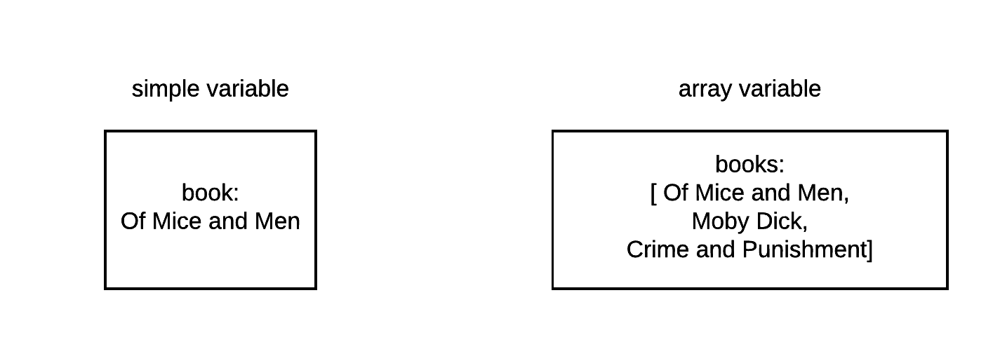
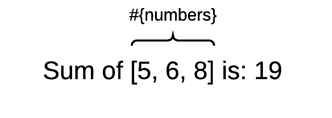
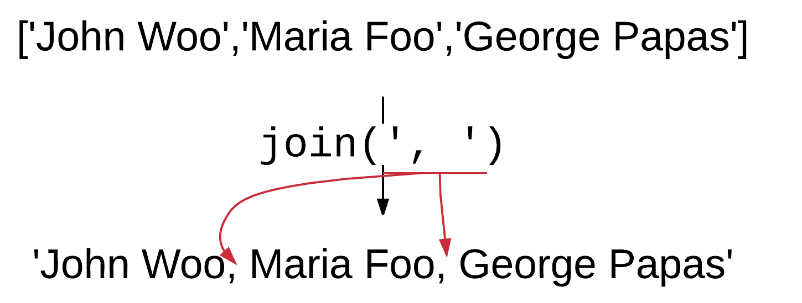

## Array Variables

We have already learnt about the variables in Ruby. They are placeholders to hold content. The point is that the simple
variables can hold one item at a time. On the other hand, the array variables can hold multiple items at a time, and, on top
of that, Ruby allows us to refer to each one of these items individually, if we want.



## Initializing an Array

Let's start the interactive ruby console.

``` bash
$ irb
2.2.3 :001 > 
```

We initialize/define an array variable in many different ways. One simple way is to use the assignment operator and the square brackets to specify
the contents/items of the array:

``` ruby
2.2.3 :001 > customers = []
 => [] 
```

This array above, `customers` is an empty array. It's defined but does not have any elements inside.

## `.size`

The `Array#size` method returns the number of elements in the array. Let's try that on our `customers` array:

``` ruby
2.2.3 :002 > customers.size
 => 0 
```

You will see that it returns 0, because, the `customers` array does not have any element inside.

## Adding Elements to an Array

Usually, if we want to add elements to an array, we use the double less than (`<<`) operator. This will
push the right hand side value to the array that exists on the left hand side. Here is an example:

``` ruby
2.2.3 :003 > customers << 'John Woo'
 => ["John Woo"] 
2.2.3 :004 > 
```

As you can see from the result returned after the execution of the command, our array `customers`, now has the
value `["John Woo"]`. This denotes that `customers` is an array that has 1 element inside. The element is a string literal.

Now the size of the array has changed to 1.

``` ruby
2.2.3 :004 > customers.size
 => 1 
2.2.3 :005 > 
```

Let's add another customer:

``` ruby
2.2.3 :005 > customers << 'Maria Foo'
 => ["John Woo", "Maria Foo"] 
2.2.3 :006 > 
```

Now the array has the value `["John Woo", "Maria Foo"]` and it has size equal to 2:

``` ruby
2.2.3 :006 > customers.size
 => 2 
2.2.3 :007 > 
```

## Accessing an Element At Specific Position

How can we access an element of the array? This is done by the position index of the element we want to access. Note that 
elements are positions using a 0-based indexing scheme. This means that 1st element is at position 0, 2nd element is at
position 1, 3rd element is at position 2 and so on. In other words, the Nth element is at position N-1.

The position index is used inside square brackets in order to access the element at corresponding position.

``` ruby
2.2.3 :007 > customers[0]
 => "John Woo" 
2.2.3 :008 > customers[1]
 => "Maria Foo" 
2.2.3 :009 > 
```

The above shows that 1st customer is accessed with `customers[0]` and 2nd customer is accessed with `customers[1]`.

Let's add one more element:

``` ruby
2.2.3 :009 > customers << 'George Papas'
 => ["John Woo", "Maria Foo", "George Papas"] 
2.2.3 :010 > customers.size
 => 3 
2.2.3 :011 >  
```

The one that we add is always added at the end of the array. The size of the array is increased by 1.

The last element is always at the position equal to size minus 1:

``` ruby
2.2.3 :011 > customers[customers.size - 1]
 => "George Papas" 
2.2.3 :012 > 
```

## Arrays are Enumerables

Arrays are what we call in ruby *Enumerables*. This means that they respond to `.each` method. The `.each` method allows us
to iterate over the elements of the array, one-by-one, and carry out an action, on each one of the elements, while we
parse the array. The action is actually a set of Ruby statements that it is enclosed inside a `do...end` block. Similar to
the `.upto` command that we saw in the previous chapter.

Let's see an example of `.each`. Give the following onto your irb console.

``` ruby
customers.each do |customer|
  puts customer.downcase
end
```

Here it is:

``` ruby
2.2.3 :012 > customers.each do |customer|
2.2.3 :013 >     puts customer.downcase
2.2.3 :014?>   end
john woo
maria foo
george papas
 => ["John Woo", "Maria Foo", "George Papas"] 
2.2.3 :015 > 
```

You can see that the `puts` command has been executed 3 times. Once per item inside the `customers` array. That's why you see:
```
john woo
maria foo
george papas
```

Note that the `do ... end` block takes one parameter. This is the element that is being handed over to the iteration on every
step of the iteration. So, the 1st time, it will be the 1st element of the array. The 2nd time, it will be the 2nd element and so on.
We can name this parameter, this local variable, any name that we like. But it is a good practice to name it in such a way to ease
the reading and denote that it refers to an element of the array that is being scanned. That's why we called it `customer`.

> *Note* The `=> ["John Woo", "Maria Foo", "George Papas"]` is the return value of the `.each` command. `.each` returns the
original array it is applied to.

## Sum

Let's quit now the irb console and start RubyMine, in order to work a little bit more complex examples with arrays.

We will start by writing the program `sum.rb`. It is a program that takes an array of integers and sums them up. Write
the following program inside the file `sum.rb`:

``` ruby
1. # File: sum.rb
2. #
3. numbers = [5, 6, 8]
4. sum = 0
5. numbers.each do |number|
6.   sum += number
7. end
8. 
9. puts "Sum of #{numbers} is: #{sum}"
```

If you run the above program, you will get this:

``` bash
$ ruby sum.rb
Sum of [5, 6, 8] is: 19
$
```

The program is easy. For each one of the elements of the array `numbers`, increases the `sum` variable by that element.
Finally, it prints the message with the sum calculated. The construction of the print message is also interesting. You can
see how the numbers array is being printed as part of the output string:



## `.each_with_index`

Another version of `.each()` method is the method `.each_with_index`. This does exactly the same like `.each()` but it yields two
arguments to the corresponding block, whereas `.each()` yields only one. The second extra argument is the index of the iteration. 
So, on the first iteration it has the value 0, on the second iteration it has the value 1 and so on.

Let's see the 'print-index.rb' file:

``` ruby
1. # File: print-index.rb
2. #
3. ['John', 'Maria', 'James', 'Jim'].each_with_index do |name, index|
4.  puts "#{name} is on position #{index + 1}"
5. end
```
The above program takes an array and scans it from first to last, using the `.each_with_index()` method. On each iteration, the
element at hand is stored in `name` block variable, and the position of the element is stored in `index` block variable.
Hence, inside the block, the code has access to both the item and of the iteration as well as the position of the item.

If you run the above program, you will get:

``` bash
$ ruby print-index.rb
John is on position 1
Maria is on position 2
James is on position 3
Jim is on position 4
$
```

You can see that the lines print the position after adding `1` to the `index` variable value. This is because Ruby does 0-based indexing.

## `.join`

The method `.join()` combines the elements of an array into one. It actually converts each element to a string representation, 
if it is not already a string, and then joins the string elements into one, using as join string the string given as input argument
to the `.join()` method.

Let's write the following program `customers.rb`:

``` ruby
1. # File: customers.rb
2. #
3. customers = ['John Woo', 'Maria Foo', 'George Papas']
4. puts customers.join(', ')
```

If you run this program, you will get this:

``` bash
$ ruby customers.rb
John Woo, Maria Foo, George Papas
$
```

The output is generated by the command `puts customers.join(', ')`. Do you see the `, ` strings in between the values of the array?



Let's try another example of `.join()` with another concatenation string. This is the program `customers-2.rb`:

``` ruby
1. # File: customers-2.rb
2. #
3. customers = ['John Woo', 'Maria Foo', 'George Papas']
4. puts customers.join(' *-*-*-* ')
``` 

If you run the above, you will get this:

``` bash
$ ruby customers-2.rb
John Woo *-*-*-* Maria Foo *-*-*-* George Papas
$
```

As you can now see, the individual items have been concatenated using the string ` *-*-*-* `. 

## `.push()`

This command adds an element at the end of the array. Like the `<<` operator does.

Let's try the program `push.rb`.

``` ruby
1. # File: push.rb
2. #
3. customers = ['John Woo', 'Maria Foo', 'George Papas']
4. customers.push('Maria Xoo')
5. puts customers
```

The command on line 4 adds the string `'Maria Xoo'` at the end of the array `customers`.

If you run this program, you will get this:

``` bash
$ ruby push.rb
John Woo
Maria Foo
George Papas
Maria Xoo
$
```

## Print with `puts` and interpolation

Before we proceed to further array commands, let's see some alternatives when it comes to printing the contents of an array.
These will improve the printed output.

First is the usage of `puts` and interpolation method that we have already seen. Edit the program `interpolation.rb` as follows:

``` ruby
1. # File: interpolation.rb
2. #
3. customers = ['John Woo', 'Maria Foo', 'George Papas']
4. puts "#{customers}"
```

If you run this program, you will get this:

``` bash
$ ruby interpolation.rb
["John Woo", "Maria Foo", "George Papas"]
$
```
The nice printed output
```
["John Woo", "Maria Foo", "George Papas"]
```
vs the result
```
John Woo
Maria Foo
George Papas
```
which is printed with `puts customers` only, is thanks to the fact that we have interpolated the `customers` in `"#{customers}"`.

## Print with `puts` and `.to_s`

Instead of interpolating, you can call `to_s` on the `customers` array. Edit the program `using_to_s.rb` as follows:

``` ruby
1. # File: using_to_s.rb
2. #
3. customers = ['John Woo', 'Maria Foo', 'George Papas']
4. puts customers.to_s
```

This is how you will get the same nice result:
```
["John Woo", "Maria Foo", "George Papas"]
```

## Print with `puts` and `.inspect`

Or, instead of calling `.to_s`, you can call `.inspect`. Edit the program `with_inspect.rb` as follows:

``` ruby
1. # File: with_inspect.rb
2. #
3. customers = ['John Woo', 'Maria Foo', 'George Papas']
4. puts customers.inspect
```
Again, you will get the same nice output:

```
["John Woo", "Maria Foo", "George Papas"]
```

## Print with `p`

Finally, you can use `p customers` instead of `puts customers.inspect`. These are equivalent, because `p` internally
calls `inspect` on its argument. Edit the following program `with_p.rb`:

``` ruby
1. # File: with_p.rb
2. #
3. customers = ['John Woo', 'Maria Foo', 'George Papas']
4. p customers
```
Again, you will get the same nice output:
```
["John Woo", "Maria Foo", "George Papas"]
```

## `.pop()`

Continuing with more array methods, the `.pop()` method deletes the last element of an array and it returns its value.
Let's try the following example `pop.rb`:

``` ruby
1. # File: pop.rb
2. customers = ['John Woo', 'Maria Foo', 'George Papas']
3. p customers
4. 
5. removed_customer = customers.pop
6. p "Removed Customer: #{removed_customer}"
7. p customers
```
If you run the above program, you will get:

``` bash
$ ruby pop.rb
["John Woo", "Maria Foo", "George Papas"]
"Removed Customer: George Papas"
["John Woo", "Maria Foo"]
$
```

The command on line 5 removes the customer `'George Papas'` from the array `customers`. The removed customer value
is the one assigned to `removed_customer` variable.

The last two commands, lines 6 and 7, print both the removed customer and the final contents of the `customers` array.

> *Information:* `.push()` and `.pop()` can be used to implement a *stack* like functionality. [Have a look here what is
a stack](https://en.wikipedia.org/wiki/Stack_(abstract_data_type)). We will come back to this when we will talk about objects.

## Set Operations With Arrays

Arrays support set operations like union, intersection and difference. Let's see that one-by-one.

### Union

When we have 2 arrays, then we can find their union, i.e. a new array that contains elements from both. Let's write the following
program `set-union.rb`:

``` ruby
1. # File: set-union.rb
2. #
3. volleyball = ['John', 'Maria', 'Jim', 'George']
4. football = ['John', 'Clark', 'Jim']
5. 
6. volleyball_or_football = volleyball | football
7. puts "Players that play either volleyball or football are: #{volleyball_or_football}"
```

This program uses two arrays. One for the players that play volleyball. One for the players that play football. Since, there are some
players that play both, finding the names of all the players, requires that we find the union of those two arrays. The union operator 
for two arrays is `|` operator. This is applied on line 6. The result is stored in `volleyball_or_football` variable and 
then it is used to print the names of the players on line 7.

If you run this program you will get the following:

``` bash
$ ruby set-union.rb
Players that play either volleyball or football are: ["John", "Maria", "Jim", "George", "Clark"]
$
```

### Intersection

The following program finds those players that play both football and volleyball. This is the intersection of the two arrays.
Here is the program `set-intersection.rb`:

``` ruby
1. # File: set-intersection.rb
2. #
3. volleyball = ['John', 'Maria', 'Jim', 'George']
4. football = ['John', 'Clark', 'Jim']
5. 
6. volleyball_and_football = volleyball & football
7. puts "Players that play both volleyball and football are: #{volleyball_and_football}"
```

The intersection operator for arrays is `&`. If you run the above program, you will get:

``` bash
$ ruby set-intersection.rb
Players that play both volleyball and football are: ["John", "Jim"]
$
```

Indeed, if you inspect the values of the two arrays, `volleyball` and `football`, you will verify that only `John` and `Jim` are the
players playing both volleyball and football.

### Difference

Can we find which players play volleyball but they do not play football? We will have to take the difference of the two arrays.
Edit and run the following program `set-difference.rb`:

``` ruby
1. # File: set-difference.rb
2. #
3. volleyball = ['John', 'Maria', 'Jim', 'George']
4. football = ['John', 'Clark', 'Jim']
5. 
6. volleyball_but_not_football = volleyball - football
7. puts "Players that play volleyball but not football are: #{volleyball_but_not_football}"
```

The difference operator is `-`. If you run the above program, you will get:

``` bash
$ ruby set-difference.rb
Players that play volleyball but not football are: ["Maria", "George"]
$
```

which is correct, because, if you inspect the value of the two arrays, you will see that only `Maria` and `George` are the
ones that play volleyball but they do not play football.

## `.sort()`

This is the last command that we will learn in this chapter. It is the command `.sort()` and it is used to sort the contents
of an array. Try the following program `sort-1.rb`:

``` ruby
# File: sort-1.rb
#
customers = ['John', 'Maria', 'George', 'James']
p customers.sort
```

If you run that above program, you will get this:

``` bash
$ ruby sort-1.rb
["George", "James", "John", "Maria"]
$
```

which are the elements of the array `customers` but sorted in alphabetical order.

Note that `.sort` returns the sorted version of the array, but does not alter the array itself. The `.sort!` method alters
the array itself.

## Closing Note

If you want, you can also watch the following video that describes the content of this chapter using some hands-on exercises inside Linux/Debian environment.

<div id="media-title-video-arrays-ruby.mp4">Arrays</div>
<a href="https://player.vimeo.com/video/194695700"></a>
