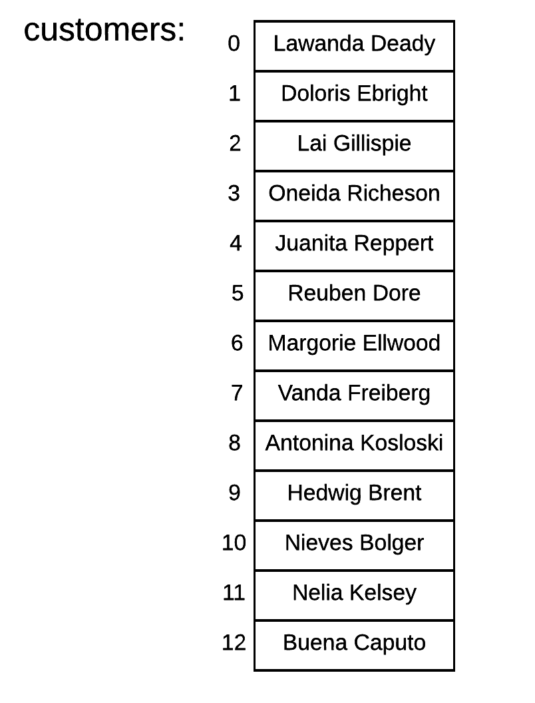

Arrays is a very useful programming construct that we encounter almost in every programming language. They allow us to
handle large amounts of items using the same name and with various extra abilities like direct access to specific elements.

In this chapter you will learn how to define an array and manipulate the elements that it contains.
