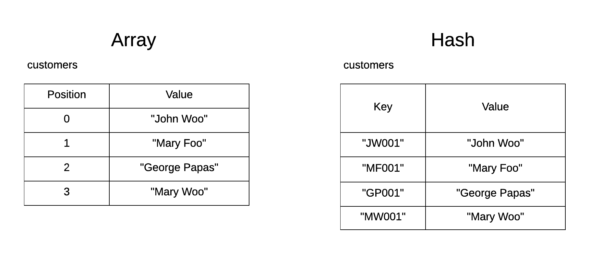
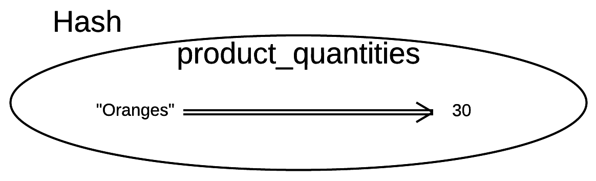
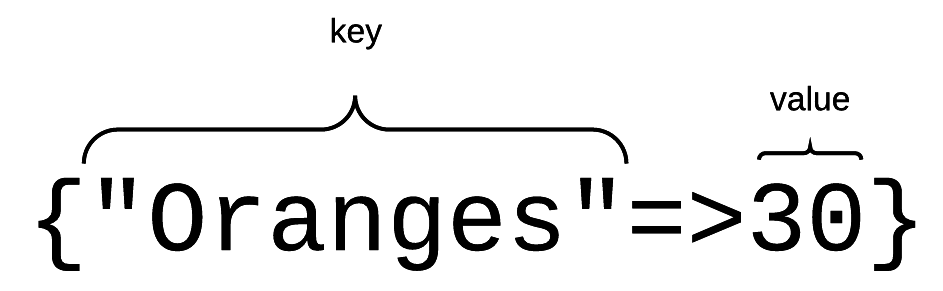
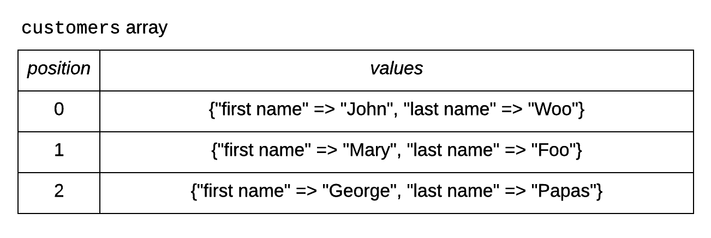

## Hashes Introduction

Hashes is a very popular structure in Ruby. Hashes are buckets of values, like arrays are. But they are not
positioned in specific order. Also, the values are not retrieved by any kind of position indexing. The values
are indexed by another value, which functions like a key.



As you can see on the above picture, the hash maps the values into keys, so that we can locate the values using the keys.
The arrays map the values to index position (starting from 0) so that we can locate the values using their index.

You can see the difference on the following picture too:


The values are indexed by their keys and not by an integer position.

> *Note:* Hashes some times are also called dictionaries or associative arrays.

## Hash Initialization and Inspection

Let's start our IDE, RubyMine. We will write our first hash program (`product-quantities-1.rb`):

``` ruby
1. # File: product-quantities-1.rb
2. #
3. product_quantities = {}
4. product_quantities['Oranges'] = 30
5. puts product_quantities.inspect
```

On line 3, we initialize the hash. The initialization is done with the curly braces `{}`. This is a little bit
different to the array initialization which uses square brackets `[]`. The `product_quantities` on line 3 is an empty
hash. 

On line 4, we set the first value `30` to this hash. We associate this value with the key `"Oranges"`. So, we have 
something like this:



This hash, `product_quantities` will be holding the quantities per product. So, given the product, we can find the quantity of that.

If you run the above program, you will get this:

``` bash
$ ruby product-quantities-1.rb
{"Oranges"=>30}
$
```

The `{"Oranges"=>30}` that is printed out, is the string representation of the hash `product_quantities`. It tells us that the hash
has 1 value indexed by the key `"Oranges"`.



## Adding More Values

Let's now add more values to our `product_quantities` hash. Write the following program (`product-quantities-2.rb`):

``` ruby
1. # File: product-quantities-2.rb
2. #
3. product_quantities = {}
4. product_quantities['Oranges'] = 30
5. puts product_quantities.inspect
6. 
7. product_quantities['Apples'] =  20
8. puts product_quantities.inspect
```

If you run the above program, you will get this:

``` bash
$ ruby product-quantities-2.rb
{"Oranges"=>30}
{"Oranges"=>30, "Apples"=>20}
$
```

You can see that the second line depicts the fact that we have added one more value to the hash. The new value is indexed by
the key `"Apples"`

## Accessing Values in a Hash

Like when we want to access a value in an array, when we want to access a value in a hash, we use its index. In arrays the index
is the position of the element. In hashes, the index is the key associated to the element.

Let's write the program `access-1.rb`:

``` ruby
1. # File: access-1.rb
2. #
3. product_quantities = {}
4. product_quantities['Oranges'] = 30
5. product_quantities['Apples'] =  20
6. 
7. puts "The quantity of Oranges is: #{product_quantities['Oranges']}"
8. puts "The quantity of Apples is: #{product_quantities['Apples']}"
```

If you run this program, you will get this:

``` bash
$ ruby access-1.rb
The quantity of Oranges is: 30
The quantity of Apples is: 20
$
```

You can see how we have accessed the values for different keys. On line 7, for the key `"Oranges"`. On line 8, for the
key `"Apples"`. In order to access for a key, you can use the square brackets `[]` operator and give the key as argument to that.
Like `product_quantities['Oranges']`, which returns the value for the key `"Oranges"`.

## `.each` - Enumerables

Like the arrays, hashes are enumerables, which means that they respond to the `.each` command. The difference here being that 
the `.each do` block is given 2 arguments for each one of the items in the hash. The first argument is the key and the second is the
value associated to that key.

Let's write the next program that parses the keys and values of a hash (`hash-parse-1.rb`):

``` ruby
1. # File: hash-parse-1.rb
2. #
3. product_quantities = {}
4. product_quantities['Oranges'] = 30
5. product_quantities['Apples'] =  20
6. 
7. product_quantities.each do |key, value|
8.   puts "Key: #{key} has the value: #{value}"
9. end
```

If you run this program, you will get this:

``` bash
$ ruby hash-parse-1.rb
Key: Oranges has the value: 30
Key: Apples has the value: 20
$
```

As you can see, all the items of the hash are being accessed with the loop on line 7 till line 9. Each iteration of the loop
refers to one item of the hash. The reference is done via two block variables, the `key` and the `value`. The `key` holds the
key of the item and the `value` holds the value of the item. 

Note that `key` and `value` names have been chosen to represent the two block variables, but they could have been any names.
We just need to choose names that make the reading of our code easier and self-explanatory.

For example, this is a *bad* example of naming:

``` ruby
7. product_quantities.each do |foo, bar|
8.   puts "Key: #{foo} has the value: #{bar}"
9. end
```

but it still works and brings the same results. However, we should not follow this bad practice. We should be using names
that make meaning within the context we are using them.

Another good example could have been:

``` ruby
7. product_quantities.each do |product_name, quantity|
8.   puts "Key: #{product_name} has the value: #{quantity}"
9. end
```

which is much better even than the `|key, value|` original example.

## A More Complex Hash Exercise

Let's proceed now by writing a more complex hash exercise. Edit the file `employees-1.rb` as follows:

``` ruby
 1. # File employees-1.rb
 2. #
 3. print 'Please, give the number of employees: '
 4. number_of_employees = gets.to_i
 5. 
 6. employees = {}
 7. number_of_employees.times do
 8.   print 'Please, give the name of the next employee: '
 9.   name = gets.chomp
10.   print 'Please, give us also the salary: '
11.   salary = gets.to_i
12.   employees[name] = salary
13. end
14. puts employees.inspect
```

Can you tell what this program does? Think about that, before reading further down.

It asks the user the number of employees he is going to give us salaries for. Then, for that number of times,
it asks the user to give the name of the employee and their salary. Saves each employee/salary pair as a hash
item inside the hash `employees`. Finally, it prints the contents of the hash.

If you run the above program, for example for 3 employees, you will get this:

``` bash
$ ruby employees-1.rb
Please, give the number of employees: 3
Please, give the name of the next employee: John Woo
Please, give us also the salary: 1000
Please, give the name of the next employee: Mary Foo
Please, give us also the salary: 1500
Please, give the name of the next employee: George Papas
Please, give us also the salary: 800
{"John Woo"=>1000, "Mary Foo"=>1500, "George Papas"=>800}
$
```

There is nothing new to you. Except, maybe for the fact that we are using a variable value to index a hash item:
```
12.   employees[name] = salary
```

On the above line, the key is specified by the value of the variable `name`. On the example that we ran, the
first time, the `name` variable has the value `"John Woo"`. Hence, the command:
 
```
12.   employees[name] = salary
```
 
is essentially equivalent to `employees["John Woo"] =  salary`.

The second time, the `name` variable has the value `"Mary Foo"`. Hence, the value assignment `employees[name] = salary` 
is basically equivalent to `employees["Mary Foo"] = salary`.

Same goes for the third time the iteration runs.

At the end, you can see the output being `{"John Woo"=>1000, "Mary Foo"=>1500, "George Papas"=>800}` which proves that
we have set up our hash correctly, the keys being the employee names and the values being their salaries.

## Expand To Find Maximum Salary

Given a hash with employees and their salaries, can we find the employee with the maximum salary?
Let's write the following `employees-2.rb` program:

``` ruby
 1. # File: employees-2.rb
 2. #
 3. employees = { "John Woo" => 1000, "Mary Foo" => 1500, "George Papas" => 800}
 4. 
 5. max_salary_name = ''
 6. max_salary = 0
 7. employees.each do |employee_name, salary|
 8.   if salary > max_salary
 9.     max_salary_name = employee_name
10.     max_salary = salary
11.   end
12. end
13. 
14. puts "The employee #{max_salary_name} has the maximum salary: #{max_salary}"
```

The only thing that is new to you here, is the line number 3. This is how we initialize a hash with specific key value pairs.
So, instead of initializing it as an empty hash (`employees = {}`), we initialize it with 3 keys.

Then, we use two local variables, `max_salary_name` and `max_salary` to save the maximum salary employee name and the
maximum salary respectively. 

Then we iterate over the keys of the hash and if we find an employee which has salary greater than the current maximum salary,
then we save its name and we replace the current maximum salary with the one found. 

At the end of the iteration, the `max_salary_name` and `max_salary` will be holding the necessary information.

If you run the above program, you will get this:

``` bash
$ ruby employees-2.rb
The employee Mary Foo has the maximum salary: 1500
$
```

## An Array of Hashes

Although we have seen arrays holding simple data type values, the truth about arrays is that they can hold any type of element.
This means that they can hold an array of hashes too.

Let's see the following example `customers-hash.rb`. It will build an array structure on which the elements are hashes.



The program that constructs this structure is the following:

``` ruby
 1. # File: customers-hash.rb
 2. #
 3. customers = []
 4. customers << {'first name' => 'John', 'last name' => 'Woo'}
 5. customers << {'first name' => 'Mary', 'last name' => 'Foo'}
 6. customers << {'first name' => 'George', 'last name' => 'Papas'}
 7. 
 8. customers.each_with_index do |customer, index|
 9.   puts "Customer #{index + 1}: #{customer}"
10. end
```

You can see that on line 4, we are adding the first element to the array `customers`. This element is a hash literal. The hash has two keys, the
`"first name"` and the `"last name"`. The first element added to the array is `{'first name' => 'John', 'last name' => 'Woo'}`. Similarly, we
add the second element on line 5 and the third element on line 6. 
 
On lines 8 till 10, we iterate over the elements of the array, using the `.each_with_index` method. 
 
If you run this program, you will get this:

``` bash
$ ruby customers-hash.rb
Customer 1: {"first name"=>"John", "last name"=>"Woo"}
Customer 2: {"first name"=>"Mary", "last name"=>"Foo"}
Customer 3: {"first name"=>"George", "last name"=>"Papas"}
$
```

## Removing Keys - `.delete()`

We have learned how we can register a new key in an existing hash. For example:

``` ruby
1. hash = {'foo' => 'bar'}
2. hash['mail'] = 'google'
```
line 2 above registers the new key `"mail"` with the value `"google"`, rendering `hash` being: `{'foo' => 'bar', 'mail' => 'google'}`.

But how can we delete a key from a hash? The method to call is `.delete()` passing as argument the key that we want to delete.

Let's write the example `leaving-employee.rb`:

``` ruby
 1. # File: leaving-employee.rb
 2. #
 3. employees = {
 4.   'JS001' => 'John Smith',
 5.   'MF001' => 'Mary Foo',
 6.   'GP001' => 'George Papas'
 7. }
 8. 
 9. print "Give me the employee number that left the company. One of #{employees.keys}: "
10. employee_number = gets.chomp.upcase
11. 
12. employees.delete(employee_number)
13. 
14. puts "Thanks! Now the employees are: #{employees}"
```

This program uses the `.delete()` method on line 12 to delete an entry from the hash `employees`. This is an example run:

``` bash
$ ruby leaving-employee.rb
Give me the employee number that left the company. One of ["JS001", "MF001", "GP001"]: MF001
Thanks! Now the employees are: {"JS001"=>"John Smith", "GP001"=>"George Papas"}
$
```

The user gives the key of the employee they want removed. The `employees.delete(employee_number)` does the trick.

## Checking for Key Existence - `.has_key?()`

It is very common that you might want to check whether a key is registered in a hash. The method that you should be
using is `.has_key?()`. For example (file: `key-existence.rb`):

``` ruby
 1. # File: key-existence.rb
 2. #
 3. customers = {
 4.   'JW001' => 'John Smith',
 5.   'MW001' => 'Maria Foo',
 6.   'GP001' => 'George Papas'
 7. }
 8. 
 9. puts "Is customer with id 'FB001' registered? #{customers.has_key?('FB001') ? 'YES' : 'NO'}"
10. puts "Is customer with id 'GP001' registered? #{customers.has_key?('GP001') ? 'YES' : 'NO'}"
```

If you run the above program, you will get this:

``` bash
$ ruby key-existence.rb
Is customer with id 'FB001' registered? NO
Is customer with id 'GP001' registered? YES
$
```

This is because the `customers.has_key?('FB001')` returns `true` whereas the `customers.has_key?('GP001')` returns `false`.
Look also how we are using the ternary operator to decide whether to print `YES` or `NO`.

## Other Interested Properties of Hashes

### Keys can be Symbols

They keys of a hash can be symbols. We will talk about symbols in the next chapter.

### Initializing with `new`

A hash can be initialized with the `.new` method. But this is something we will further expand on after we talk about classes and objects in Ruby.

### Keys are Unique

This is very important, you cannot have a key appearing twice within the same hash. This is not allowed. The hash is a uniquely indexed key value store.
You will never manage to add the same key twice.

### Keys array

Hashes respond to the `.keys` method which returns an array with the keys inside the hash. Let's see the example `keys.rb`:

``` ruby
1. # File: keys.rb
2. #
3. product_quantities = {
4.   'Oranges' => 50,
5.   'Apples' => 30,
6.   'Tomatoes' => 40
7. }
8. 
9. puts "These are the keys of product_quantities hash: #{product_quantities.keys}"
```

If you run the above program, you will get this:

``` bash
$ ruby keys.rb
These are the keys of product_quantities hash: ["Oranges", "Apples", "Tomatoes"]
$
```

The statement `product_quantities.keys` returns the array `["Oranges", "Apples", "Tomatoes"]`, which is the list of the keys
registered in the hash `product_quantities`.

## Closing Note

If you want, you can also watch the following video that describes the content of this chapter using some hands-on exercises inside Linux/Debian environment.

<div id="media-title-video-hashes.mp4">Hashes</div>
<a href="https://player.vimeo.com/video/194639619"></a>
