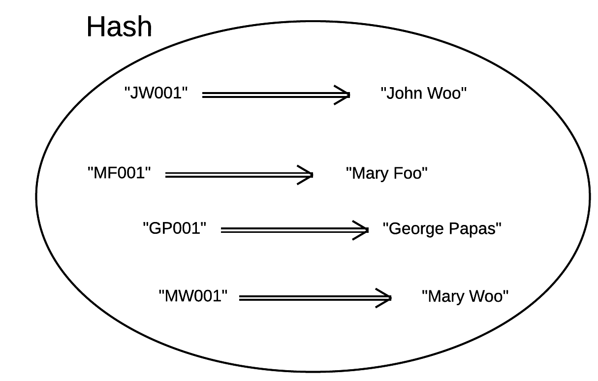

The hashes are very popular structures in Ruby. They are also called dictionaries or associative arrays. They are key-value buckets
and they will be proven very useful in every program that will be writing in the future.
