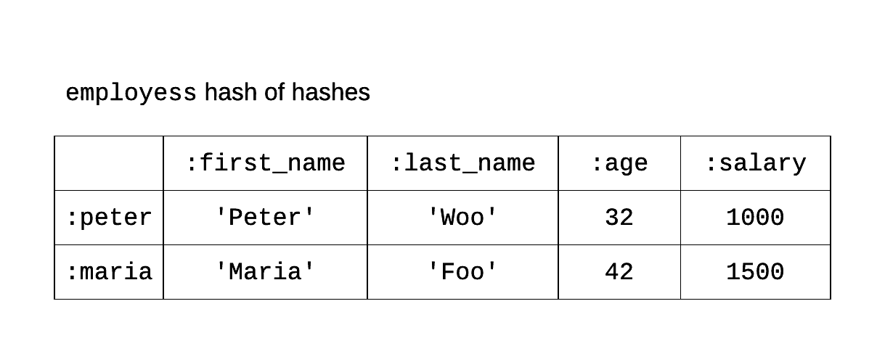

## What Are Symbols?

Symbols are name or string representations inside Ruby interpreter. Ruby holds a global list of symbols which is
accessed from any context.

## Defining Symbols

The symbols are created with one of the following mechanisms:

1. `:<name>`
2. `:<string>`
3. with the call of the method `.to_sym`

The 1st defines a name symbol. This is an example:

```
:descending
```

The above symbol is a name symbol, the name of which is `descending`. When defined, like above, it can later be used anywhere
in your program and it will always be referring to the same position in memory, which is the global symbols table that Ruby
interpreter is holding for symbols.

The 2nd method defines a symbol like in the following example:

```
:'descending order'
```

A string literal is prepended with the `:` character. This is a string symbol, basically, the name including blank characters.
When the name includes blank characters we use the string literal to define the symbol.

The 3rd method is by calling the method `.to_sym` whenever it is defined. Currently, defined for string objects. So, the following

```
'descending order'.to_sym
```

defines the symbol using the `.to_sym` method.

## Symbols Table

Ruby holds all the symbols defined during the execution of a program inside a symbols table. The call to `Symbol.all_symbols` returns
the list of all symbols defined. The value returned is an array and you can call the `.size` to get the number of symbols inside it.

Let's try that. Start irb:

``` bash
$ irb
2.2.3 :001 >
```

and give the command that would return the size of the symbols table:

``` ruby
2.2.3 :001 > Symbol.all_symbols.size
 => 3290 
2.2.3 :002 >
```

> *Note:* The exact number returned depends on the Ruby interpreter that you are using

The method `.last` will give the last element of an array. Let's try that on the symbols table.

``` ruby
2.2.3 :003 > Symbol.all_symbols.last
 => :irb_exit_org 
2.2.3 :004 > 
```

Let's also try the last 10 symbols.

``` ruby
2.2.3 :004 > Symbol.all_symbols.last(10)
 => [:select_message, :sep, :regmessage, :gv, :lv, :cv, :rec, :Operators, :irb_binding, :irb_exit_org] 
2.2.3 :005 >
```

or the first 10 symbols

``` ruby
2.2.3 :005 > Symbol.all_symbols.first(10)
 => [:!, :"\"", :"#", :"$", :%, :&, :"'", :"(", :")", :*] 
2.2.3 :006 > 
```

Let's define one symbol. Remember that symbol is defined with the `:` character. What follows that character is
the content of the symbol.

``` ruby
2.2.3 :006 > :descending
 => :descending 
2.2.3 :007 > Symbol.all_symbols.size
 => 3291 
2.2.3 :008 > Symbol.all_symbols.last
 => :descending 
2.2.3 :009 > 
```

As you can see, when we defined the symbol `:descending`, it has been added at the end of the symbols table. The 
size of the symbol table has been increased by 1.

Another one:

``` ruby
2.2.3 :009 > :'descending order'
 => :"descending order" 
2.2.3 :010 > Symbol.all_symbols.size
 => 3292 
2.2.3 :011 > Symbol.all_symbols.last
 => :"descending order" 
2.2.3 :012 > 
```

Also, next time we reference a symbol that is already part of the table, this is not redefined.

``` ruby
2.2.3 :012 > Symbol.all_symbols.include?(:descending)
 => true 
2.2.3 :013 > :descending
 => :descending 
2.2.3 :014 > Symbol.all_symbols.size
 => 3292 
2.2.3 :015 > Symbol.all_symbols.last(2)
 => [:descending, :"descending order"] 
2.2.3 :016 > 
```

As you can see above, the `:descending` was already part of the array of symbols. When we reference that
symbol on line `013` then this does not add the symbol again. 

> *Note:* the `.include?` method on an array returns either `true` or `false`. It returns `true` if the
argument given is in the list of items of the array. It returns `false` otherwise.

Note also that `:descending` and `:'descending'` are the same and only one symbol. Try this:

``` ruby
2.2.3 :018 > :'descending'
 => :descending 
2.2.3 :019 > Symbol.all_symbols.size
 => 3292 
2.2.3 :020 > Symbol.all_symbols.last(2)
 => [:descending, :"descending order"] 
2.2.3 :021 > 
```

As you can see above, the `:'descending'` didn't add any new symbol to the symbols table.

## Benefit of Symbols vs String Literals

We often compare the symbols to string literals. The `:descending` to `'descending'`. The main benefit of using symbols
is that they use less memory. This is because when you use the literal `'descending'` more than once, every time you 
use it you declare a new String object (more about objects in corresponding chapter). So, 2 instances of the `'descending'` 
literal create 2 different objects in memory. Objects have an overhead of management and this means that this overhead
is doubled in this case. On the other hand, when you use the symbol `:descending` 2 times, then the memory occupied is
of a single symbol. Same goes for `:descending` appearing 10 times or 100 times in your program.

## Symbols and Hash Keys

Many times we prefer to use symbols rather than string literals to define a hash whose keys are strings literals.

See the following examples of hash definitions:

``` ruby
2.2.3 :021 > peter = {'first_name' => 'Peter', 'last_name' => 'Woo', 'age' => 32, 'salary' => 1000}
 => {"first_name"=>"Peter", "last_name"=>"Woo", "age"=>32, "salary"=>1000} 
2.2.3 :022 > peter = {:first_name => 'Peter', :last_name => 'Woo', :age => 32, :salary => 1000}
 => {:first_name=>"Peter", :last_name=>"Woo", :age=>32, :salary=>1000} 
2.2.3 :023 > 
```

From the above definition, we prefer the second one. The one that uses symbols. Because this incurs less memory management
than the first one. Especially if the literals are repeated. We prefer to repeat the symbols rather than the literals, as
we explained earlier on.

``` ruby
2.2.3 :023 > mary = {'first_name' => 'Mary', 'last_name' => 'Foo', 'age' => 26, 'salary' => 800}
 => {"first_name"=>"Mary", "last_name"=>"Foo", "age"=>26, "salary"=>800} 
2.2.3 :024 > george = {'first_name' => 'George', 'last_name' => 'Papas', 'age' => 43, 'salary' => 1100 }
 => {"first_name"=>"George", "last_name"=>"Papas", "age"=>43, "salary"=>1100} 
2.2.3 :025 > 
```

The above 2 variable definitions, are using hash literal that has string literals as keys. The fact that `'first_name'` literal
is used twice bears extra memory management overhead. It whould have been much better if it were like this:

``` ruby
2.2.3 :025 > mary = {:first_name => 'Mary', :last_name => 'Foo', :age => 26, :salary => 800}
 => {:first_name=>"Mary", :last_name=>"Foo", :age=>26, :salary=>800} 
2.2.3 :026 > george = {:first_name => 'George', :last_name => 'Papas', :age => 43, :salary => 1100 }
 => {:first_name=>"George", :last_name=>"Papas", :age=>43, :salary=>1100} 
2.2.3 :027 > 
```

The 2 occurrences of `:first_name` do not incur extra memory management overhead. 

## A Symbol is Not Equal to a String Literal

Nevertheless, a symbol is not equal to its string literal counterpart. This means that if you have a Hash with string literal 
keys, you will not be able to locate a key using its symbol counterpart, or vice versa. Try this one:

``` ruby
2.2.3 :027 > mary = {:first_name => 'Mary', :last_name => 'Foo', :age => 26, :salary => 800}
 => {:first_name=>"Mary", :last_name=>"Foo", :age=>26, :salary=>800} 
2.2.3 :028 > mary['first_name']
 => nil 
2.2.3 :029 > mary[:first_name]
 => "Mary" 
2.2.3 :030 > 
```

Although `:first_name` and `'first_name'` might look similar, they are not equal. The command `028` fails to locate the first name of `mary`. 
The `029` succeeds. This is because the hash `mary` uses symbols as keys and not string literals.

## A String can Be Symbolized - `.to_sym`

However, a string literal can be turned to its symbol counterpart with the `.to_symn` method. Try this one:

``` ruby
2.2.3 :030 > mary = {:first_name => 'Mary', :last_name => 'Foo', :age => 26, :salary => 800}
 => {:first_name=>"Mary", :last_name=>"Foo", :age=>26, :salary=>800} 
2.2.3 :031 > mary[:first_name]
 => "Mary" 
2.2.3 :032 > mary['first_name'.to_sym]
 => "Mary" 
2.2.3 :033 > 
```

You can now see that comment `032` succeeds to bring the first name of `mary`, because the key used is the symbol version of the string literal `'first_name'`.
We've got that with the help of the method `.to_sym` called on the string literal.

## A Symbol can be Stringified - `.to_s`

The other way around is true too. A symbol can be turned to its string literal counterpart if we call `.to_s` on that. Let's try this:

``` ruby
2.2.3 :033 > mary = {'first_name' => 'Mary', 'last_name' => 'Foo', 'age' => 26, 'salary' => 800}
 => {"first_name"=>"Mary", "last_name"=>"Foo", "age"=>26, "salary"=>800} 
2.2.3 :034 > mary['first_name']
 => "Mary" 
2.2.3 :035 > mary[:first_name.to_s]
 => "Mary" 
2.2.3 :036 > 
```

The command `035` succeeds only because we convert the symbol `:first_name` to its string literal counterpart with the help of the method `.to_s`.
So, `:first_name` is turned to `'first_name'` which then matches with the key `'first_name'` and the first name of `mary` is finally returned.

## Alternative Notation for Hash Symbol Keys

There is an alternative notation for hash symbol keys that you need to be aware of, since it is used by many Ruby developers. It is as follows:
When a key of a hash is a symbol, we may not use this symbol notation `:symbol_name => key_value` but we may use this `symbol_name: key_value`.

Let's see an example:

``` ruby
2.2.3 :038 > mary = {:first_name => 'Mary', :last_name => 'Foo', :age => 26, :salary => 800}
 => {:first_name=>"Mary", :last_name=>"Foo", :age=>26, :salary=>800} 
2.2.3 :039 > foo = {first_name: 'Mary', last_name: 'Foo', age: 26, salary: 800}
 => {:first_name=>"Mary", :last_name=>"Foo", :age=>26, :salary=>800} 
2.2.3 :040 > mary == foo
 => true 
2.2.3 :041 > 
```

As you can see above, the two hashes `mary` and `foo` are exactly equal. This means that they have the same keys and corresponding values.
However, when we defined them we used the different notations. For `mary` we used the `:symbol_name => key_value`, whereas for `foo` we
used the `symbol_name: key_value`.

The latter notation is a little bit more concise and it is highly preferred. 

## Hash of Hashes

Let's now start RubyMine, our IDE. And let's write the following program `array-of-hashes.rb`:

``` ruby
 1. # File: array-of-hashes.rb
 2. #
 3. peter = {first_name: 'Peter', last_name: 'Woo', age: 32, salary: 1000}
 4. maria = {first_name: 'Maria', last_name: 'Foo', age: 42, salary: 1500}
 5. employees = [peter, maria]
 6. 
 7. puts "Employees: #{employees}"
 8. 
 9. employees.each_with_index do |employee, index|
10.   puts "Employee at position #{index + 1}: #{employee}"
11. end
```

This program builds the array `employees` as an array of hashes. It initializes that on line 5. The first element is the hash pointed to by the
variable `peter`. The second element is the hash pointed to by the variable `maria`. Later we print the elements of the array.

If you run the above program you will see this:

``` bash
$ ruby array-of-hashes.rb
Employees: [{:first_name=>"Peter", :last_name=>"Woo", :age=>32, :salary=>1000}, {:first_name=>"Maria", :last_name=>"Foo", :age=>42, :salary=>1500}]
Employee at position 1: {:first_name=>"Peter", :last_name=>"Woo", :age=>32, :salary=>1000}
Employee at position 2: {:first_name=>"Maria", :last_name=>"Foo", :age=>42, :salary=>1500}
$
```

One disadvantage of this approach is that, if we want to retrieve the details of a particular employee from the `employees` table, we need to know
the exact position of the employee. Otherwise, we will have to scan the `employees` table from top to bottom until we find the employee with the
search terms at hand. 

Another approach would have been to store the employees in a hash and index the hash by easy to remember symbols. Let's see the alternative 
with hash of hashes:

``` ruby
1. # File: hash-of-hashes.rb
2. #
3. employees = {peter: {first_name: 'Peter', last_name: 'Woo', age: 32, salary: 1000},
4.              maria: {first_name: 'Maria', last_name: 'Foo', age: 42, salary: 1500}}
5. 
6. puts "Employees: #{employees}"
7. 
8. employees.each_with_index do |(employee_key, employee_value), index|
9.   puts "Employee at position #{index + 1}: #{employee_key}: #{employee_value}"
10. end
```

Let's first run this program. You will get this:

``` bash
$ ruby hash-of-hashes.rb
Employees: {:peter=>{:first_name=>"Peter", :last_name=>"Woo", :age=>32, :salary=>1000}, :maria=>{:first_name=>"Maria", :last_name=>"Foo", :age=>42, :salary=>1500}}
Employee at position 1: peter: {:first_name=>"Peter", :last_name=>"Woo", :age=>32, :salary=>1000}
Employee at position 2: maria: {:first_name=>"Maria", :last_name=>"Foo", :age=>42, :salary=>1500}
$
```

On lines 3 and 4 we instantiate the `employees` as a hash, this time, rather than an array. The keys to the hash are simple symbols that 
remind us of which employee details are stored in the corresponding value. See also that the actual value is now another hash. That's why we
are saying that this is a hash of hashes. 

Hence, having the key, it is easy to get the details. For example, it only takes this command:
```
employees[:maria]
```
to get the details of *Maria Foo* employee. 

Watch out how we scan the `employees` hash on lines 8 till 10. The call to `.each_with_index` yields as first argument to the block
a pair of variables that need to be declared inside parenthesis: `(employee_key, employee_value)`. This is because each element
of the hash is composed of the key and the value. The second argument is the actual index of the key in the list of keys in the hash.
Note that hashes are being scanned with `.each` and with `.each_with_index` methods taking the keys in the order they have been
added to the hash.

Maybe you also need to have a picture in your head about the hash of hashes construct above. Like this:



The above hash of hashes is like a table. The rows are being named with the keys of the hash (`:peter`, `:maria`). The values of the hash
are hashes themselves, whose keys are used as column headers, i.e. `:first_name`, `:last_name`, `:age` and `:salary`.

## Closing Note

If you want, you can also watch the following video that describes the content of this chapter using some hands-on exercises inside Linux/Debian environment.

<div id="media-title-video-symbols-and-hashes.mp4">Symbols and Hashes</div>
<a href="https://player.vimeo.com/video/194583215"></a>
