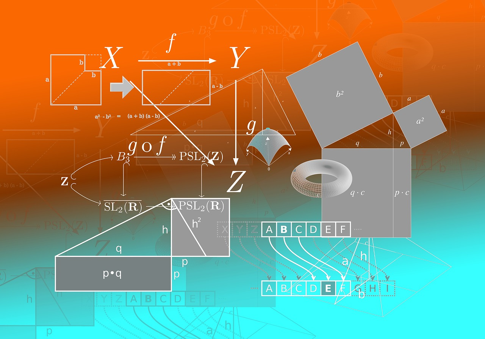

In this chapter we start to learn one of the most important tools that we should be deploying whenever we want
to reduce code duplication, increase code reuse, encapsulate complexity and implementation details and increase
our program readability and ease of maintenance. It is the concept of the function (and later on called method
in Object Oriented Programming).  
