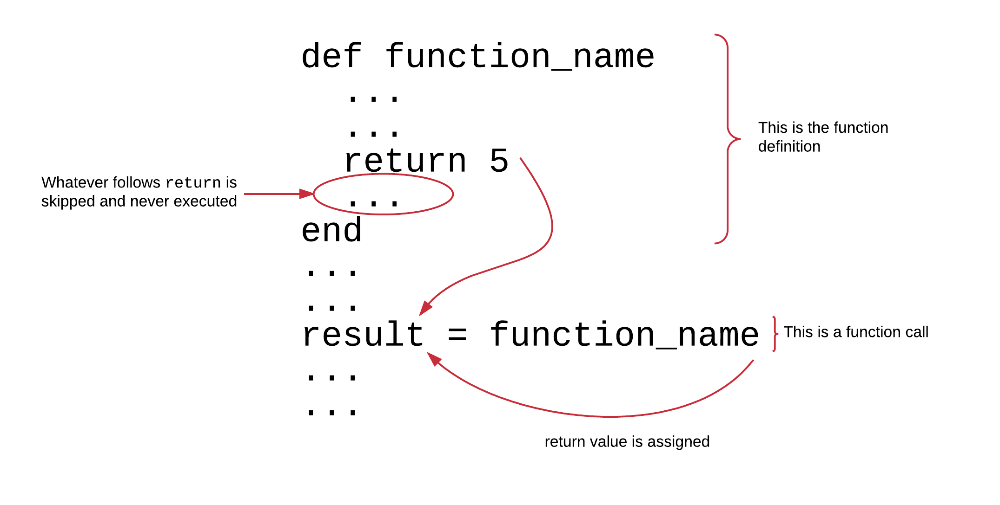
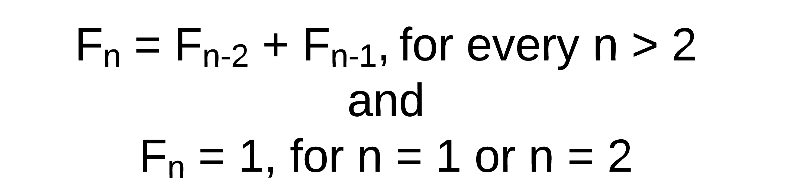
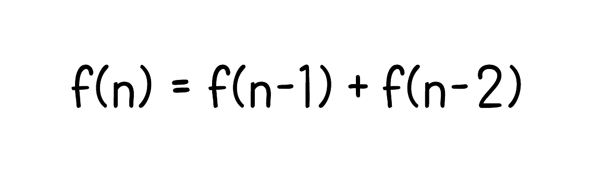
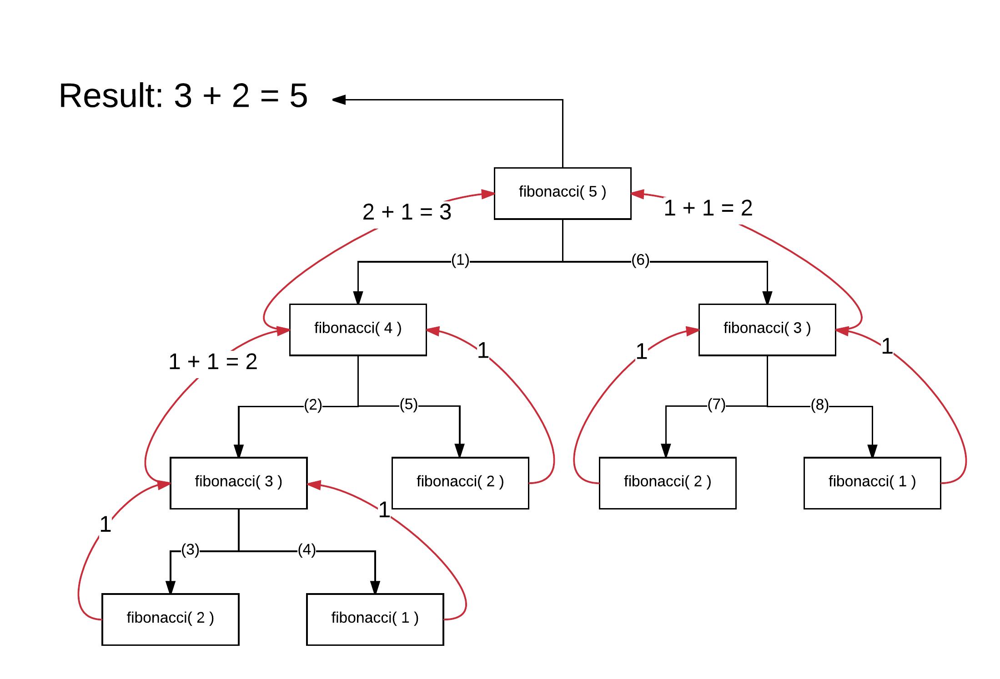
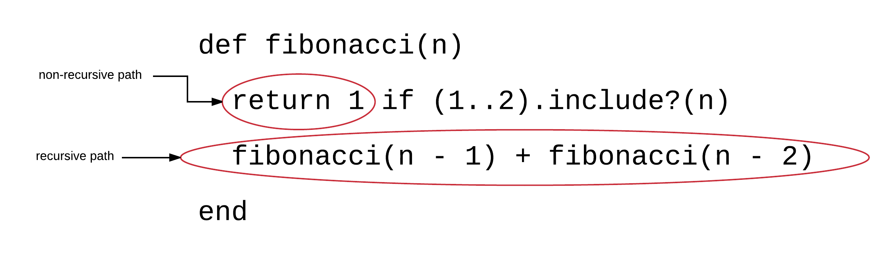

## Return Value of a Function

Let's start our programming environment, RubyMine. Then write the following program `second-degree-polynomial-1.rb`:

``` ruby
 1. # File: second-degree-polynomial-1.rb
 2. #
 3. # y = f(x) = a * x^2 + b * x + c
 4. #
 5. def f(a, b, c, x)
 6.   result = a * x ** 2 + b * x + c
 7.   return result
 8. end
 9. 
10. y = f(5, 3, 2, 2)
11. 
12. puts "y = #{y}"
```

If you run the above program, you will get this:

``` bash
$ ruby second-degree-polynomial-1.rb
y = 28
$
```

Indeed, the result of `5 * 2^2 + 3 * 2 + 2` equals `28`.

The program is calling the function `f` on line 10. The function returns a result which is saved inside the variable `y` using
the assignment operator.

Function `f` calculates the formula on line `6` and assigns the result to the local variable `result` using the assignment operator.
Then it calls the keyword `return` followed by an expression that returns what this function is actually needs to return back to the 
caller. So, the `return` is followed by the variable `result`. Ruby interpreter, takes the content of the `result` and returns it back
at the calling point, at the caller code, i.e. on line 10, in order to be assigned to the variable `y`.

The `return` keyword exits a method at the point it is called. Whatever it is on the right hand side of it, it will be calculated
and its result will be returned to the caller.



Note also that if there are, inside the function body, Ruby statements that follow the `return` call, these will not be executed. The `return` exists
the execution of the function body. See this program: `return-exits-function.rb`:

``` ruby
1. # File: return-exits-function.rb
2. #
3. def print_hello
4.  puts 'Hello'
5.  return
6.  puts 'Goodbye!'
7. end
8.
9. print_hello
```

If you run the above program, you will get this:

``` bash
$ ruby return-exits-function.rb
Hello
$
```

Although the body of the function includes one more `puts` command, this is not executed, because it follows the `return` keyword.

## What Is Returned?

Again, what is returned by a function? Whatever is on the right-hand side of the `return` keyword, or `nil` if nothing exists there. 

Let's try the following program, `second-degree-of-polynomial-2.rb`:

``` ruby
 1. # File: second-degree-polynomial-2.rb
 2. #
 3. # y = f(x) = a * x^2 + b * x + c
 4. #
 5. def f(a, b, c, x)
 6.   return a * x ** 2 + b * x + c
 7. end
 8. 
 9. y = f(5, 3, 2, 2)
10. 
11. puts "y = #{y}"
```

If you run the above program, you will get exactly the same output like you did with the `second-degree-polynomial-1.rb`.

``` bash
$ ruby second-degree-polynomial-2.rb
y = 28
$
```

This is because this new version of the function `f` does exactly the same like the previous one. It just does not use a temporary
`result` variable to store the result of the `a * x ** 2 + b * x + c`. It just has it next to the `return` keyword and this is enough
for Ruby interpreter to calculate that and return its result as the return value of the function.

If the `return` call is not followed by any expression to be evaluated, then `nil` is the value that it is returned. Try this program
here `simple-return.rb`:

``` ruby
1. # File: simple-return.rb
2. #
3. def returns_nil
4.   puts 'Foo'
5.   return
6. end
7. 
8. returned_value = returns_nil
9. puts "Returned value is: >>>#{returned_value}<<<. Is it nil?: #{returned_value.nil?}"
```

If you run the above program, you will get this:

``` bash
$ ruby simple-return.rb
Foo
Returned value is: >>><<<. Is it nil?: true
$
```

The line 8 calls the method `returns_nil` and saves its result into the variable `returned_value`. This is actually `nil`, which is 
proven by the command on line 9. This command prints the contents of the variable `returned_value` and prints also `true` when checking
whether the value is `nil` or not. The content of `nil` is represented with an empty string. That's why you see `>>><<<` being printed.

> *Information:* What might be new to you is the call to `.nil?` method. This returns `true` if the receiving object has the value `nil`.
Otherwise, it returns `false`. Hence, `returned_value.nil?` is equivalent to `returned_value == nil`

Another thing that you need to know about the return value of a function is that a function does not necessarily need the `return` keyword
in order to return something. The evaluation result of the last expression executed inside a function it is what it is really returned, if
there is no explicit `return` keyword used.

Let's see this example here (`second-degree-polynomial-3.rb`):

``` ruby
 1. # File: second-degree-polynomial-3.rb
 2. #
 3. # y = f(x) = a * x^2 + b * x + c
 4. #
 5. def f(a, b, c, x)
 6.   a * x ** 2 + b * x + c
 7. end
 8. 
 9. y = f(5, 3, 2, 2)
10. 
11. puts "y = #{y}"
```

This third version of the `f` function returns the result of the evaluation of the expression `a * x ** 2 + b * x + c` without actually
using a `return` keyword. If you run this program, you will get, again this:

``` bash
$ ruby second-degree-polynomial-3.rb
y = 28
$
```

which proves that the function worked as it was expected.

Let's try another example to make sure we understand what is returned by a function. See the program `return-literal.rb`:

``` ruby
1. # File: return-literal.rb
2. #
3. def foo
4.   2
5.   3
6.   4
7. end
8. 
9. puts "Result of calling the function foo is: #{foo}"
```

Before you run this program, what do you think this `foo` function returns? The last statement that is evaluated by the Ruby interpreter
parsing the body of this function is `4`. This means that the function returns `4`. Let's call the program to prove that:

``` bash
$ ruby return-literal.rb
Result of calling the function foo is: 4
$
```

## Recursive Functions

Let's see another category of Ruby functions, which are supported by many programming languages. These are the recursive functions.
We will do it using an example. We will implement a function that returns the fibonacci number at a specific position of the [fibonacci 
sequence](https://en.wikipedia.org/wiki/Fibonacci_number).

The fibonacci sequence follows the rule: every integer number is equal to the previous two, except from the first two numbers, which
are both 1. In other words:



Here is the list of the first fibonacci numbers:

```
1, 1, 2, 3, 5, 8, 13, 21, 34, 55, 89, 144, ...
```

The fact that the number at position `n` can be calculated if we know the numbers at positions `n-1` and `n-2` implies that the
fibonacci function, that takes as input the position `n`, can be considered a recursive function, since it relies on
calling itself for the previous two positions:



The property can also be transferred as such in Ruby functions. See the following program `fibonacci-1.rb`:

``` ruby
1. # File: fibonacci-1.rb
2. #
3. def fibonacci(n)
4.   return 1 if (1..2).include?(n)
5.   fibonacci(n - 1) + fibonacci(n - 2)
6. end
7. 
8. puts "Fibonacci on position 10: #{fibonacci(10)}"
```

On line 4, we return `1` if the number `n` given to the function is within the range `1..2`.

> *Information:* In Ruby, we can use ranges. For example, the range `(1..2)` includes the integers `1` and `2`.
Try this one on irb:
``` ruby
2.2.3 :002 > (1..2).to_a
 => [1, 2] 
2.2.3 :003 > 
```
which converts the range to an array with elements the integers belonging to the range. Or try for the range `(5..10)`:
``` ruby
2.2.3 :003 > (5..10).to_a
 => [5, 6, 7, 8, 9, 10] 
2.2.3 :004 > 
```
The ranges respond also to `.each` if one wants to loop through all the integers of the range. Also, they respond to `.include?()` and
return `true` if the given argument is included in the range or not. Note also that there is another range construct too, that
does not include the right limit. Try this:
``` ruby
2.2.3 :004 > (5...10).to_a
 => [5, 6, 7, 8, 9] 
2.2.3 :005 > 
```
As you can see, we have now used 3 `.` between the lower and upper limit. And the actual upper limit of the range does not include
the limit specified in the range.

If the number given is within the range `(1..2)`, then the `return 1` is executed (line: 4) and hence, the function terminates.
The code at line 5 is not executed. 

If the number given is not within that range, then the line 5 is executed (whereas the `return 1` is not). Line 5 is calling
the function `fibonacci` twice. First time with argument equal to whatever was the input argument `n` minus 1. Second time, with
argument equal to whatever was the input argument `n` minus 2. Then calls to `fibonacci` are instantiated recursively.

For example, let's assume that we call `fibonacci` with argument `5`. This is how the function is being called until we finally get
the result:


`fibonacci(5)` calls `fibonacci(4)` and then `fibonacci(3)`. The first call to `fibonacci(4)` calls the `fibonacci(3)` and `fibonacci(2)`. E.t.c.
Finally, the `fibonacci(2)` returns `1`. Same does `fibonacci(1)`. The results are being summed up.

In the following diagram we have also added the sequence of the function calls, as Ruby interpreter calls `fibonacci()` functions recursively.
After the initial call to `fibonacci(5)`, then 1st call goes to `fibonacci(4)`, then, 2nd call goes to `fibonacci(3)` e.t.c.



## Recursive Functions Have 2 Paths

The recursive functions need to have 2 well identified paths.

1. The path that ends the recursion. This is the path which does not call the function again.
2. The path that does at least one more recursive call. This is the path that calls the function again.



If the non-recursive path is missing, or is never reached during execution of the function, then the function will end up
running forever, until, actually, process runs out of memory. So, it is very important, when you design a recursive function,
to make sure that there is always a path to the non-recursive code part of your function body.

## Recursive Functions Are Resource Consuming

Although recursive functions are easy to write and understand, they consume lots of resources. Ruby interpreter needs to keep track of the 
recursive calls in the whole depth of the sequence they are being called. And then return back the results to the caller. So, there is a stack
that is piled up in order to reach the terminating calls, and, then, the stack is being consumed back again, one-by-one, until we accumulate the
result that we want to have at hand.

Also, as you can see from the above drawings, the recursive functions may call the function for the same value multiple times. For example, when we
call `fibonacci(5)`, then call to `fibonacci(3)` takes place twice. So, you may want to optimize the implementation to avoid multiple calls with the
same arguments.

## Asking Input From User

Let's now enhance the fibonacci program and let the user of the program give the position for the fibonacci number to calculate. See the program
`fibonacci-2.rb`:

``` ruby
 1. # File: fibonacci-2.rb
 2. #
 3. def fibonacci(n)
 4.   return 1 if (1..2).include?(n)
 5.   fibonacci(n - 1) + fibonacci(n - 2)
 6. end 
 7.  
 8. print 'Give the fibonacci position you want to calculate fibonacci for (between 1 and 40): '
 9. n = gets.to_i
10. 
11. if n < 1 || n > 40
12.   puts "Please, give an integer between 1 and 40."
13.   exit(1)
14. end
15. 
16. puts "The fibonacci(#{n}) is: #{fibonacci(n)}"
```
This program asks the user to give the fibonacci position `n`. Because of the fact that for large numbers this recursive implementation of Fibonacci takes
too much time, we have limited the numbers that we can accept in the range up to 40.

Here are some examples of running this program:

``` bash
$ ruby fibonacci-2.rb 
Give the fibonacci position you want to calculate fibonacci for: 20
The fibonacci(20) is: 6765
$ ruby fibonacci-2.rb 
Give the fibonacci position you want to calculate fibonacci for: 30
The fibonacci(30) is: 832040
$ ruby fibonacci-2.rb 
Give the fibonacci position you want to calculate fibonacci for: 40
The fibonacci(40) is: 102334155
$
```

## Benchmarking Ruby Code

If you try various numbers with the `fibonacci-2.rb` program, you can see that the larger the number the more time it takes to return a value.
Ruby gives us some tools that we can use to measure the time it takes for a program to execute.

One of those tools is the `Benchmark` tool. We can wrap the piece of code that we want to measure performance for. At the end of the
execution, a report with performance metrics will be printed. Let's try with the `fibonacci-3.rb` program:

``` ruby
 1. # File: fibonacci-3.rb
 2. #
 3. require 'benchmark'
 4. 
 5. def fibonacci(n)
 6.   return 1 if (1..2).include?(n)
 7.   fibonacci(n - 1) + fibonacci(n - 2)
 8. end
 9. 
10. print 'Give the fibonacci position you want to calculate fibonacci for (between 1 and 40): '
11. n = gets.to_i
12. 
13. if n < 1 || n > 40
14.   puts "Please, give an integer between 1 and 40."
15.   exit(1)
16. end
17. 
18. fib = nil
19. Benchmark.bm do |x|
20.   x.report { fib = fibonacci(n) }
21. end
22. puts "The fibonacci(#{n}) is: #{fib}"
```

Before we explain what the above program does and its differences to the previous version of the fibonacci programs, let's run it. Below,
you can find a series of executions:

``` bash
$ ruby fibonacci-3.rb
Give the fibonacci position you want to calculate fibonacci for (between 1 and 40): 30
       user     system      total        real
   0.220000   0.000000   0.220000 (  0.223123)
The fibonacci(30) is: 832040
$ ruby fibonacci-3.rb
Give the fibonacci position you want to calculate fibonacci for (between 1 and 40): 31
       user     system      total        real
   0.370000   0.000000   0.370000 (  0.369981)
The fibonacci(31) is: 1346269
$ ruby fibonacci-3.rb
Give the fibonacci position you want to calculate fibonacci for (between 1 and 40): 32
       user     system      total        real
   0.580000   0.000000   0.580000 (  0.576577)
The fibonacci(32) is: 2178309
$ ruby fibonacci-3.rb
Give the fibonacci position you want to calculate fibonacci for (between 1 and 40): 40
       user     system      total        real
  29.530000   0.020000  29.550000 ( 29.586880)
The fibonacci(40) is: 102334155
$
```

You can focus, for the time being, on the `total` column of the results. You can see the total number of seconds spend running
the `fibonacci()` function for different arguments. For example, for `30` it took `0.22` seconds to calculate the fibonacci number.
For, `32`, only 2 numbers greater than `30`, it took `0.58` seconds, more than double the time. For `40`, it took `29.55` seconds,
i.e. almost half a minute to calculate the fibonacci number.

The technique that we are using to get the metrics is the following:

``` ruby
19. Benchmark.bm do |x|
20.   x.report { fib = fibonacci(n) }
21. end
```
We wrap the portion of code that we want to measure into a block that is given to `x.report`, like on line 20. Then
all that is wrapped into another block `Benchmark.bm do |x| ... end`. This does the trick. The `fib = fibonacci(n)` call
will be time measured and time spent on that piece of code will be printed out.

> *Note:* In order for you to be able to use the `Benchmark` methods, you need to require the file `'benchmark'`, like we did
on line 3. Requiring of files will be explained in the following chapter.

> *Note:* Don't worry too much about the concept of blocks. We will explain that in the following chapters.

## Closing Note

If you want, you can also watch the following video that describes the content of this chapter using some hands-on exercises inside Linux/Debian environment.

<div id="media-title-video-function-return-value-and-recursive-functions.mp4">Function Return Value And Recursive Functions</div>
<a href="https://player.vimeo.com/video/194675247"></a>
