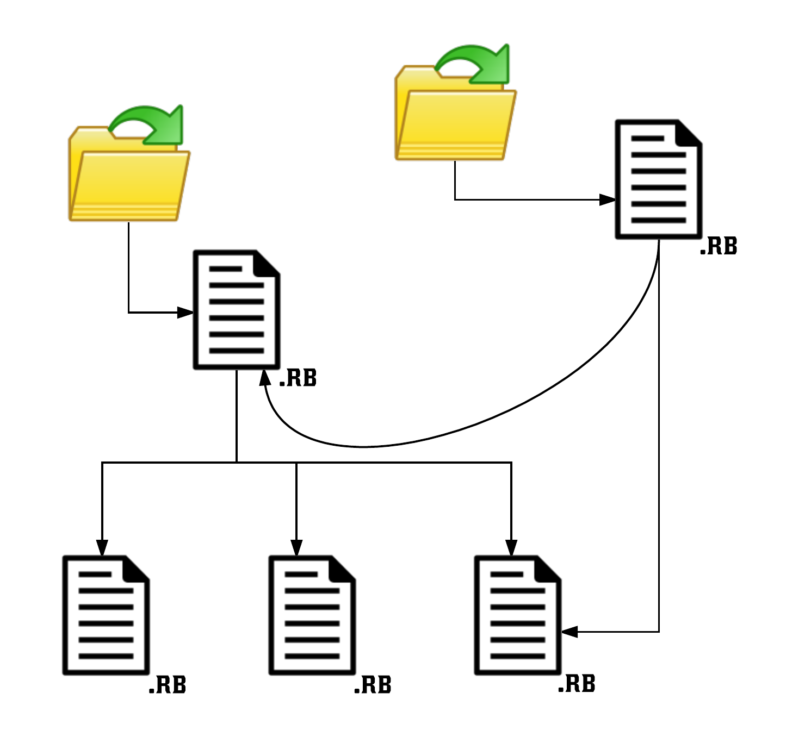

Having one long file, with thousands of lines of code, being the only resource comprising your Ruby application is not a good idea.
In this chapter you learn what tools Ruby provides us with, in order to break our big application code to smaller files. Breaking
the code to smaller files and units of software, we end up having something that is very maintainable, with reusable software components,
easy to read and troubleshoot.
