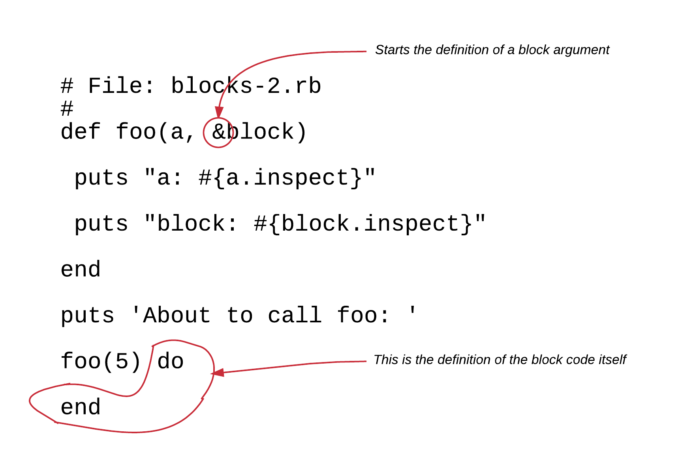
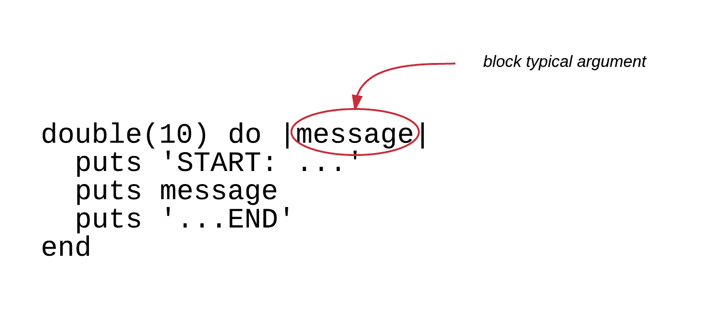

## Variable Scope

When defining a variable, this is not accessible (visible) in any piece of our code. There are parts of the code
that have access to this variable and other parts of the code that they do not. Exception to this rule, are the
global variables, and that is why they are called global.

### Local Variables

Whenever we declare a variable with the methods that we have learned so far, this variable is a local variable.

A variable declared inside a function is considered local to the function and is not accessible outside of it.
See the program `local-variables-1.rb`:

``` ruby
 1. # File: local-variables-1.rb
 2. #
 3. def foo
 4.   var = 5
 5.   puts var
 6. end
 7. 
 8. puts 'Calling foo...'
 9. foo
10. 
11. puts 'Calling var outside foo...'
12. puts var
```

You can see that the above program declares the variable `var` on line 4. This is a local variable and its visibility (its scope)
is within the body of the `foo` function from the point it was declared until the end of its body.

This means that trying to access the same variable outside the `foo` function gives an error. This is what happens on line 12. 

If you run the program, you will get this:

``` bash
$ ruby local-variables-1.rb
Calling foo...
5
Calling var outside foo...
local-variables-1.rb:12:in `<main>': undefined local variable or method `var' for main:Object (NameError)
$
```

It says that the program has an error, on line 12. It is trying to access a local variable (or method/function) that does not
exist. The error message includes the name identifier that is on error: `var`.

A similar error will be thrown if the variable is accessed before it is defined, even if both take place inside the function body.
See the program `local-variables-2.rb`.

``` ruby
 1. # File: local-variables-2.rb
 2. #
 3. def foo
 4.   puts var
 5.   var = 5
 6. end
 7. 
 8. puts 'Calling foo...'
 9. foo
10. 
11. puts 'Calling var outside foo...'
12. puts var
```

You can see that, on line 4, it is trying to access the variable `var`. But this variable has not been defined yet. If you try 
to run the program:

``` bash
$ ruby local-variables-2.rb
Calling foo...
local-variables-2.rb:4:in `foo': undefined local variable or method `var' for main:Object (NameError)
        from local-variables-2.rb:9:in `<main>'
$
```

you will get the error of undefined variable, thrown on line 4. Again, this is because we are referencing a local variable
that has not been defined yet.

### Local Variables Defined Outside Functions

Note that local variables defined outside functions are not accessible inside functions. Let's see the program `local-variables-3.rb`.

``` ruby
 1. # File: local-variables-3.rb
 2. #
 3. var = 2
 4. 
 5. def foo
 6.   puts var
 7. end
 8. 
 9. puts 'Calling var outside foo...'
10. puts var
11. 
12. puts 'Calling foo...'
13. foo
```

This program defines the local variable `var` with content `2` on line 3. This variable is accessible at this level of the program only.
Hence, the line 10 will be executed without problem. On the other hand, line 6, that is trying to access the `var` will fail, because
`var` is not visible inside the function.

Let's run the program to verify that:

``` bash
$ ruby local-variables-3.rb
Calling var outside foo...
2
Calling foo...
local-variables-3.rb:6:in `foo': undefined local variable or method `var' for main:Object (NameError)
        from local-variables-3.rb:13:in `<main>'
$
```

The above output confirms what we have said. The error is raised on line 6, `puts var`, inside the function.

### Function Arguments Are Local Variables

The typical arguments of a function are local variables to the function itself and they can be accessed from any
point within the body of the function.

Let's see the program `local-variables-4.rb`:

``` ruby
 1. # File: local-variables-4.rb
 2. #
 3. def double(a)
 4.   a * 2
 5. end
 6. 
 7. puts 'Calling double with 5'
 8. puts double(5)
 9. 
10. var = 8
11. puts "Calling double with the var being #{var}"
12. puts double(var)
```

You can see that the function `double` has a typical argument `a`. This is the local variable declaration and
it will have any value that the calling point will pass to `double` as first run-time argument. So, on line 8,
program calls `double` passing `5` as run-time argument. On line 12, it passes the value of the variable `var`.

Let's run the program:

``` bash
$ ruby local-variables-4.rb
Calling double with 5
10
Calling double with the var being 8
16
$
```

The above program also demonstrates how we can pass the content of a variable to the body of a function.
This is done using the function arguments. But, note again, it is the content that is being transferred, copied
to the local variable / argument of function. If we change the local variable / argument value, this will
not affect the content of the original variable outside the function.

Let's see the program `local-variables-5.rb` in order to make clear what we mean:

``` ruby
 1. # File: local-variables-5.rb
 2. #
 3. def change_value(a)
 4.   puts "a inside function before change: #{a}"
 5.   a *= 2
 6.   puts "a inside function after change: #{a}"
 7. end
 8. 
 9. var = 8
10. puts "Calling change_value with the var being #{var}"
11. change_value(var)
12. 
13. puts "var after calling the change_value function: #{var}"
```

You can see that on line 11 we are calling the function `change_value` giving as argument the `var`. Value `8` is being
assigned to local variable `a` and this is then doubled. 

Let's run the program:

``` bash
$ ruby local-variables-5.rb
Calling change_value with the var being 8
a inside function before change: 8
a inside function after change: 16
var after calling the change_value function: 8
$
```

As you can see, the `a` is being changed. From initial content `8` is changed to `16`. However, this does not affect the
content of the variable `var` (which was used to set the local variable `a`). As the last line printed confirms, the content
of the variable `var` remains `8`.

> *Note:* In the Object Oriented Programming chapters, we will find methods to alter the content of the outside
variable from within a function.

### Global Variables

After having the encounter with local variables, let's jump to the global variables. These are accessible anywhere in your
code and need to be defined with a name that starts with the character `$`. This is how Ruby can tell a local variable.

Let's see the following example (`global-variables-1.rb`):

``` ruby
 1. # File: global-variables-1.rb
 2. #
 3. $var = 5
 4. 
 5. def foo
 6.   $var += 6
 7. end
 8. 
 9. puts "$var value before calling foo: #{$var}"
10. 
11. foo
12. 
13. puts "$var value after calling foo: #{$var}"
```

If you run the above program, you will see this:

``` bash
$ ruby global-variables-1.rb
$var value before calling foo: 5
$var value after calling foo: 11
$
```

As you can see, function foo has direct access to the `$var` global variable. It increases its content on line 6.

Now, with regards to when to use global variables vs local variables, the best practice here is that you should avoid
using global variables as much as you can. They are sources of evil things that can happen to your application. They are not
thread safe (see about threads later on) and they can turn your code into a mess, unmaintainable and difficult to debug.
However, if you are careful on how you use them, they might be proven useful. For example, when you want to store some
configuration values, at the start of your program, that you might want to use globally, at other places in your code, only for reading.

## Blocks, Block Arguments

Before we see any other examples of local and global variables, let's delve into another concept of Ruby language, that we
have already used, but we didn't actually worked in depth.

This is the concept of the code blocks.

The Ruby code blocks are pieces of Ruby statements that can be defined on the fly, using various methods. They can also
take arguments, like the functions do.

### Block Arguments

Let's see this function definition here (program `blocks-1.rb`):

``` ruby
 1. # File: blocks-1.rb
 2. #
 3. def foo(a, &b)
 4.   puts "a: #{a.inspect}"
 5.   puts "b: #{b.inspect}"
 6. end
 7. 
 8. puts 'About to call foo: '
 9. 
10. foo(5)
```

If you run this program, you will get this:

``` bash
$ ruby blocks-1.rb
About to call foo: 
a: 5
b: nil
$
```

On line 10, we are calling `foo(5)` without actually giving any argument for `&b`. Is the `&b` argument optional. Yes it is.
When we define an argument with a name that starts with `&`, this is an optional argument.

In fact, this is called a *block* argument and usually, we use the name `block` as the local variable name (rather than `b` that
we used on the example above). If we call the function without giving value for the block argument, then this has the value `nil`
inside the body of the function.

The block arguments are used to send a set of Ruby statements to a function, when we actually call that function.

But, how do we actually pass a block to a function when we call that function? The usual way you do that is by suffixing the
call to the function with a `do..end` block that contains the Ruby statements that define the block to send to the function.

See this example (`blocks-2.rb`):

``` ruby
 1. # File: blocks-2.rb
 2. #
 3. def foo(a, &block)
 4.   puts "a: #{a.inspect}"
 5.   puts "block: #{block.inspect}"
 6. end
 7. 
 8. puts 'About to call foo: '
 9. 
10. foo(5) do
11. 
12. end
```

There is not much difference if compared to the version `blocks-1.rb`. Besides the fact that we have renamed the local variable
to be `block` instead of `b`, we have added the block definition after the `foo(5)` call on line 10. The block starts on line 10
and ends on line 12. It is an empty block, i.e. it does not contain any Ruby statements, but, nevertheless, it is a valid block
code definition sent to the `foo` function when `foo` is called.



If you run the above program, you will get this:

``` bash
$ ruby blocks-2.rb
About to call foo: 
a: 5
block: #<Proc:0x007fcc3a27d950@blocks-2.rb:10>
$
```

As you can see above the variable `block` now has a value. It is a value of type `Proc`. In other words is a `Proc` object. We have not
learned about objects yet, but let's just keep that off for a while. Note also that the `Proc` instance mentions `@blocks-2.rb:10` which
is pretty cool. It bears the information where the actual block code has been defined: it tells us that it has been defined inside the
file `blocks-2.rb` on line 10. 

So, the blocks are actually `Proc` objects. 

Now, let's do something more useful inside the block code. For example, let's print a message (`blocks-3.rb`):

``` ruby
 1. # File: blocks-3.rb
 2. #
 3. def foo(a, &block)
 4.   puts "a: #{a.inspect}"
 5.   puts "block: #{block.inspect}"
 6. end
 7. 
 8. puts 'About to call foo: '
 9. 
10. foo(5) do
11.   puts 'I am a piece of Ruby block code!'
12. end
```

Now, there is a small change to our program. We have added an Ruby statement inside the block code. But, if you run the program again,
you will not see the message `'I am a piece of Ruby block code!'` being printed, despite of the `puts 'I am a piece of Ruby block code!'`
command. 

This is because, defining the block code is not enough for the block code to be executed. We need to invoke the block code like we do 
for functions. We define a function and then we invoke it. Same for block codes. We need to invoke or call them.

### Calling a Block

One way you can call the code inside a block is by calling the method `.call` on the block variable. Let's see that (`blocks-4.rb`):

``` ruby
 1. # File: blocks-4.rb
 2. #
 3. def foo(a, &block)
 4.   puts "a: #{a.inspect}"
 5.   puts "block: #{block.inspect}"
 6.   block.call
 7. end
 8. 
 9. puts 'About to call foo: '
10. 
11. foo(5) do
12.   puts 'I am a piece of Ruby block code!'
13. end
```

There is only one change to this program. On line 6 we have the `block.call` method call. Let's run the program:

``` bash
$ ruby blocks-4.rb
About to call foo: 
a: 5
block: #<Proc:0x007fdc29209010@blocks-4.rb:11>
I am a piece of Ruby block code!
$
```

Great! After the inspect message for the block variable, the message `I am a piece of Ruby block code!` is printed.
This is done thanks to the `block.call` command which is used to invoke the code of a block.
 
Another way you can call a block is using the method `yield`. This is generally preferred. We are just calling `yield` and
the block is being invoked. See the program `blocks-5.rb`:

``` ruby
 1. # File: blocks-5.rb
 2. #
 3. def foo(a, &block)
 4.   puts "a: #{a.inspect}"
 5.   puts "block: #{block.inspect}"
 6.   yield
 7. end
 8. 
 9. puts 'About to call foo: '
10. 
11. foo(5) do
12.   puts 'I am a piece of Ruby block code!'
13. end
```

There is only one small difference here. Instead of `block.call`, we just call `yield`. If you now call the
program again, then it will do exactly the same:
 
``` bash
$ ruby blocks-5.rb
About to call foo: 
a: 5
block: #<Proc:0x007fe3fa270f48@blocks-5.rb:11>
I am a piece of Ruby block code!
$
```

### Block With Arguments

Since we have now learned about defining a block and then invoking it, it's about time to let you know that blocks can take
arguments like functions do. Let's see the example `blocks-6.rb`:

``` ruby
 1. # File: blocks-6.rb
 2. #
 3. def double(a, &block)
 4.   yield "Double of #{a} is #{a * 2}"
 5. end
 6. 
 7. puts 'About to call double for 5: '
 8. 
 9. double(5) do |message|
10.   puts '- Start of message: '
11.   puts message
12.   puts '... end of message -'
13. end
14. 
15. puts 'About to call double for 10: '
16. 
17. double(10) do |message|
18.   puts 'START: ...'
19.   puts message
20.   puts '...END'
21. end
```

On the above program, we are defining the function `double` that calculates the double of its argument `a` and calls a block to
actually format the result response. The bock that formats the result response takes 1 argument, which is the message to print
and decides how to print the message.

We also have 2 different invocations of the function `double`. One for `5` and one for `10`. The invocation for `5` takes place
on line 9 and it is accompanied by one instance of the block code. The invocation for `10` takes place on line 17 and it is
accompanied by another, different instance of the block code.

Both definitions of the block code specify that the block should be invoked with 1 argument.
  


The block typical argument is a local variable, which means it is visible only within the block code. 
 
### Curly Braces instead of `do..end`

Blocks can be defined using curly braces rather than `do..end` blocks. Here is the version of the last program but with curly braces used (`blocks-7.rb`):

``` ruby
1. # File: blocks-7.rb
2. #
3. def double(a, &block)
4.   yield "Double of #{a} is #{a * 2}"
5. end
6. 
7. puts 'About to call double for 5: '
8. 
9. double(5) { |message|
10.   puts '- Start of message: '
11.   puts message
12.   puts '... end of message -'
13. }
14. 
15. puts 'About to call double for 10: '
16. 
17. double(10) { |message|
18.   puts 'START: ...'
19.   puts message
20.   puts '...END'
21. }
```

As you can see, on lines 9 and 17, we are defining the block code using curly braces rather than `do..end` delimiters. 

However, you need to know that we prefer to use `do..end` delimiters when we have multiline block codes. On the other hand,
we prefer to use curly braces when we have one line block codes. See this `blocks-8.rb`:

``` ruby
1. # File: blocks-8.rb
2. #
3. def multiply(a, &block)
4.   yield a
5. end
6. 
7. multiply(5) { |a| puts "#{a * 2}" }
8. multiply(10) { |a| puts "#{a * 3}" }
```

The above program is equivalent to this:

``` ruby
 1. # File: blocks-9.rb
 2. #
 3. def multiply(a, &block)
 4.   yield a
 5. end
 6. 
 7. multiply(5) do |a|
 8.   puts "#{a * 2}"
 9. end
10. 
11. multiply(10) do |a|
12.   puts "#{a * 3}"
13. end
```

but we prefer the first version when the Ruby block code contains only 1 line.

## Omitting `&block` Declaration

You don't have to define the `&block` typical argument if you don't want to use it. However,
the function will have access to the block given. In other words, the `yield` will work as expected.
See this example (`blocks-10.rb`):

``` ruby
1. # File: blocks-10.rb
2. #
3. def multiply(a)
4.   yield a
5. end
6. 
7. multiply(5) { |a| puts "#{a * 2}" }
8. multiply(10) { |a| puts "#{a * 3}" }
```

As you can see above, the `&block` has been omitted. However, the `yield` method calls the blocks sent on lines 7 and 8 without
problem.

``` bash
$ ruby blocks-10.rb
10
30
$
```

## What If Block Is Not Given

What happens if a `yield` is called but no block has been defined when calling the function? See this program `blocks-11.rb`:

``` ruby
1. # File: blocks-11.rb
2. #
3. def multiply(a)
4.   yield a
5. end
6. 
7. multiply(5)
```

You can see that on line 7, we are calling the `multiply` function without specifying a block. However, the `multiply` function
expects a block, which is denoted by the fact that on line 4 it calls `yield`. If you run this program, you will get this:

``` bash
$ ruby blocks-11.rb
blocks-11.rb:4:in `multiply': no block given (yield) (LocalJumpError)
        from blocks-11.rb:7:in `<main>'
$
```
This is an error. It tells you that on line 4 there is a try to execute a block but the block was not given on line 7.

## Check If Block Given

A function can check whether a block has been given or not. If the function uses the `&block` typical argument it can
check whether the `block` is `nil` or not. See `blocks-12.rb`:

``` ruby
 1. # File: blocks-12.rb
 2. #
 3. def multiply(a, &block)
 4.   if block
 5.     yield a
 6.   else
 7.     puts 'block not given'
 8.   end
 9. end
10. 
11. multiply(5) { |a| puts "#{a * 2}"}
12. multiply(10)
```

If you run the above program, you will see that it now does not fail on line 12. 

``` bash
$ ruby blocks-12.rb
10
block not given
$
```

This is because it checks whether a block has been given or not. If it is not, it does not call the `yield`.

If the function does not declare the `&block` typical argument, then, it can still check whether a block has been given
by calling the function `block_given?`. See program `blocks-13.rb`:

``` ruby
 1. # File: blocks-13.rb
 2. #
 3. def multiply(a)
 4.   if block_given?
 5.     yield a
 6.   else
 7.     puts 'block not given'
 8.   end
 9. end
10. 
11. multiply(5) { |a| puts "#{a * 2}"}
12. multiply(10)
```

As you can see on line 3, the `&block` typical argument is not given. However, the function calls `yield` only if the `block_given?` returns `true`.
If you try to run this program it will succeed exactly like the previous one.

### We have already used blocks

We may have reached this chapter to learn about blocks, but we have already used them in the previous chapters. For example, we used them to iterate
over the elements of an array. See program `blocks-14.rb`:

``` ruby
1. # File: blocks-14.rb
2. #
3. customers = [{first_name: 'John', last_name: 'Smith'},
4.              {first_name: 'Mary', last_name: 'Foo'},
5.              {first_name: 'George', last_name: 'Papas'}]
6. 
7. customers.each do |element|
8.   puts "Customer is: #{element[:first_name]} #{element[:last_name]}"
9. end
```

See how on lines 7 to 9 we are using a block `do..end` sent to `.each` on the array variable `customers`. Obviously, the `.each` method knows how
to take an element from the array and `yield` it to the block, which then does whatever it wants to do with the element.

That is very cool because `.each` encapsulates the implementation details of accessing the underlying structure. We don't have to care about it.
All we care about is to get the next element in order to do something with that.

## `Proc` objects.

Although we have not talked about objects yet, it does worth saying a few words about the `Proc` objects.

As we saw earlier, the `&block` typical argument is an object of type `Proc`. We have also seen that we can call `.call` on 
that object. Except from the case of blocks in the form of `&block` typical arguments, we can create `Proc` objects using
definitions like the following (program `blocks-15.rb`):

``` ruby
 1. # File: blocks-15.rb
 2. #
 3. block1 = Proc.new { puts 'I am block #1' }
 4. block2 = Proc.new { puts 'I am block #2' }
 5. 
 6. def foo(b1, b2)
 7.   b1.call
 8.   b2.call
 9. end
10. 
11. puts 'I will now call foo'
12
13. foo(block1, block2)
```

As you can see above, the definition of function `foo` takes 2 arguments. The arguments are supposed to be block definitions.
And for that reason, lines 7 and 8 can call `.call` on them. On line 12 we call `foo` with the 2 actual block definitions.
These definitions have been declared on line 3 and 4 respectively.

If you run the above program you will get:

``` bash
$ ruby blocks-15.rb
I will now call foo
I am block #1
I am block #2
$
```

The call to `foo` method prints the lines that correspond to each block.

Note again that the `Proc` objects can be created with a call to `Proc.new` which takes an accompanying block piece of Ruby code,
either using `do..end` or `{ ... }` notation.

The `Proc` objects can also be specified to take arguments when called. Here is another example (`blocks-16.rb`):

``` ruby
 1. # File: blocks-16.rb
 2. #
 3. block1 = Proc.new { |a| puts "I am block #1 and I will double my argument: #{a * 2}" }
 4. block2 = Proc.new { |a| puts "I am block #2 and I will triple my argument: #{a * 3}" }
 5. 
 6. def foo(b1, b2, number)
 7.   b1.call(number)
 8.   b2.call(number)
 9. end
10. 
11. puts 'I will now call foo'
12. 
13. foo(block1, block2, 2)
```

On the above program, you can see that both blocks take an argument, a number `a`. They do different things with that. On lines
7 and 8 we call these blocks giving one argument, a number.

If you run the above program, you will get this:

``` bash
$ ruby blocks-16.rb
I will now call foo
I am block #1 and I will double my argument: 4
I am block #2 and I will triple my argument: 6
$
```

which proves that the blocks have been called successfully.

## Lambdas

Another way you can create blocks are the lambdas. They are almost similar to blocks with regards to what they do. Except from some subtle differences.
Nevertheless, here is the version of the `blocks-15.rb` program using lambdas (program: `blocks-17.rb`):

``` ruby
 1. # File: blocks-17.rb
 2. #
 3. block1 = -> { puts 'I am block #1' }
 4. block2 = -> { puts 'I am block #2' }
 5. 
 6. def foo(b1, b2)
 7.   b1.call
 8.   b2.call
 9. end
10. 
11. puts 'I will now call foo'
12. 
13. foo(block1, block2)
```

The only difference to `blocks-15.rb` program are the lines 3 and 4, on how we define the lambdas. Instead of using `Proc.new`, we just use
`->`. 
 
> *Information:* older versions of Ruby didn't have the `->` notation for lambdas. But you had to call the method `lambda`. So, instead of `->` 
 you called `lambda`. This is still supported but new Ruby programs prefer the `->` notation.
 
If you run the program you will get this:

``` bash
$ ruby blocks-17.rb
I will now call foo
I am block #1
I am block #2
$
```

which is the same output like the output of the program `blocks-15.rb`.
 
If you want your lambda to take typical arguments, you will have to define them after the `->` symbol. Let's see the 
program `blocks-16.rb` again, written using `lambdas`. This is it (program: `blocks-18.rb`):

``` ruby
 1. # File: blocks-18.rb
 2. #
 3. block1 = ->(a) { puts "I am block #1 and I will double my argument: #{a * 2}" }
 4. block2 = ->(a) { puts "I am block #2 and I will triple my argument: #{a * 3}" }
 5. 
 6. def foo(b1, b2, number)
 7.   b1.call(number)
 8.   b2.call(number)
 9. end
10. 
11. puts 'I will now call foo'
12. 
13. foo(block1, block2, 2)
```

If you compare the above program to program `blocks-16.rb`, the only differences are on lines 3 and 4 where we define
the typical arguments of the lambda.

## Methods

We will not talk too much about methods, but we would like to just tell you that a function (which is actually a method, something that we 
will learn about in the object-oriented part of the course), can be invoked using the `.call` method. See the following program (`methods-1.rb`)

``` ruby
1. # File: methods-1.rb
2. #
3. def foo(a)
4.   puts "#{a} doubled is #{a * 2}"
5. end
6. 
7. method_var = method(:foo)
8. puts "method_var is: #{method_var.inspect}"
9. method_var.call(5)
```

Let's first run the program:

``` bash
$ ruby methods-1.rb
method_var is: #<Method: Object#foo>
5 doubled is 10
$
```

On lines 3 to 5 we define the function `foo` and on line 7 we call `method` function and give as argument a symbol that is equal to the name
of the function previously defined. The `method(:foo)` returns an object which is stored in `method_var` variable. This is of type `Method`.
Then, on line 9 we are using again the `.call` method to invoke the method that is *behind* the method_var.

Now that you know that, you may want to write program `blocks-18.rb` in another version, that would define the functions normally, but
would still be able to define another function taking as arguments the definitions of other functions and calling them with `.call`.
Here is a new version of the `blocks-18.rb` program (program `methods-2.rb`):

``` ruby
 1. # File: methods-2.rb
 2. #
 3. def double(a)
 4.   puts "I am block #1 and I will double my argument: #{a * 2}"
 5. end
 6. 
 7. def triple(a)
 8.   puts "I am block #2 and I will triple my argument: #{a * 3}"
 9. end
10. 
11. def foo(b1, b2, number)
12.   b1.call(number)
13.   b2.call(number)
14. end
15. 
16. puts 'I will now call foo'
17. 
18. foo(method(:double), method(:triple), 2)
```

Compare this version, `methods-2.rb` to either `blocks-18.rb` or to `blocks-16.rb`. They are the same programs. If you run them, they output
the same results. The only difference is how we define the blocks of code: 

1. `blocks-16.rb` is using `Proc` objects
2. `blocks-18.rb` is using `lambda` objects
3. `methods-2.rb` is uging normal function definitions.

But they all use the same `foo` function that has function/method definitions as typical arguments.

## Closing Note

That was a long trip to variable scope, blocks, procs and lambdas. The blocks are very popular in the Ruby world and you need to get
acquainted with them little-by-little. So, you need to practice a lot. 
