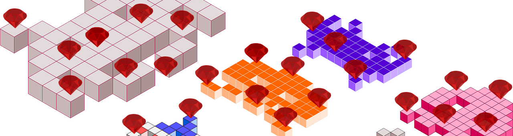

This chapter is about variables, their visibility scope. It is also about blocks of code that can be defined on the fly and
sent as arguments to other functions/methods. This is where we start a little bit of Ruby meta-programming. Blocks and
Procs and Lambdas are very popular in the Ruby world and you need to get acquainted as much as possible.
