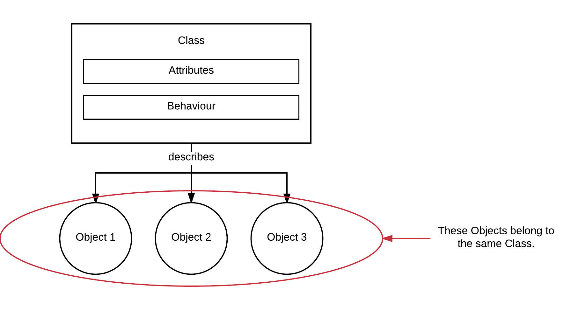
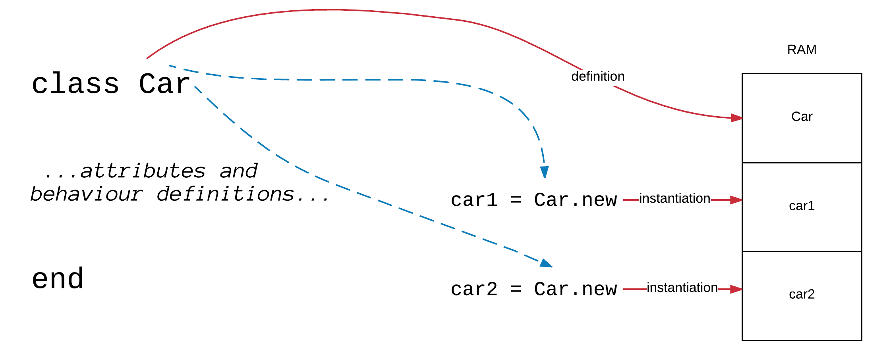
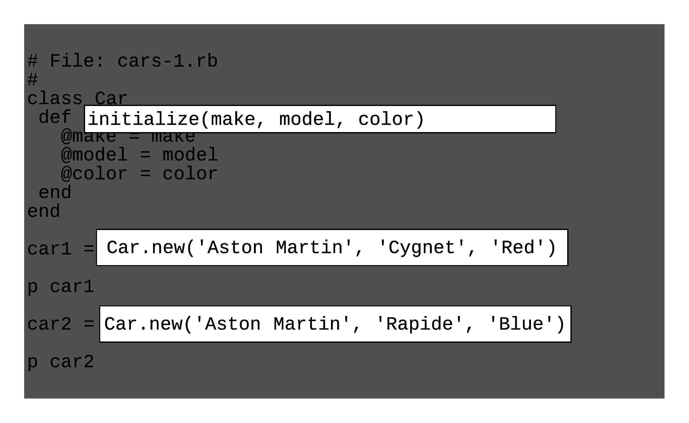
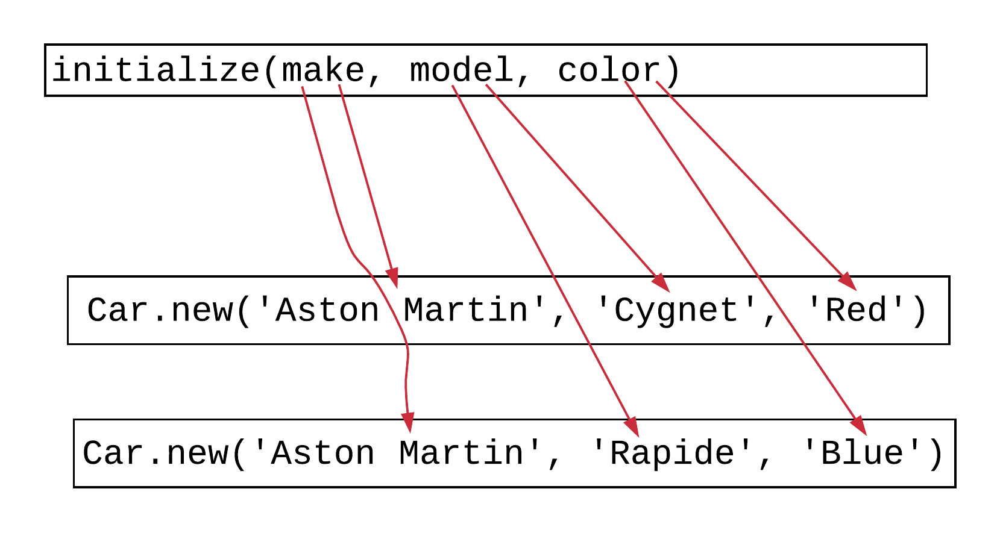
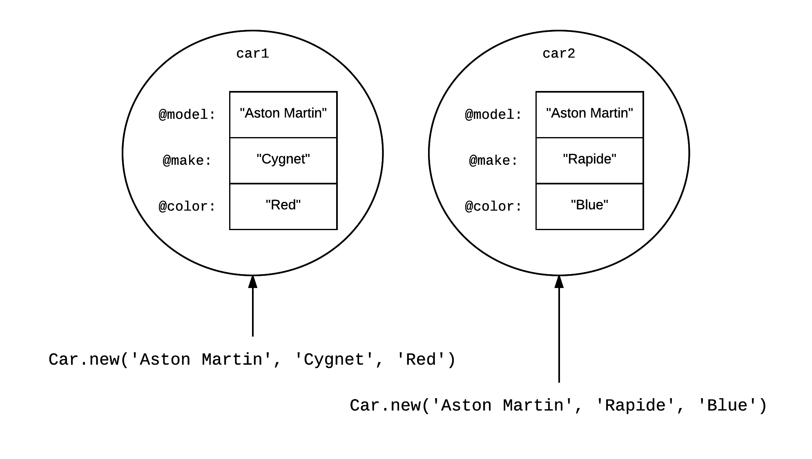
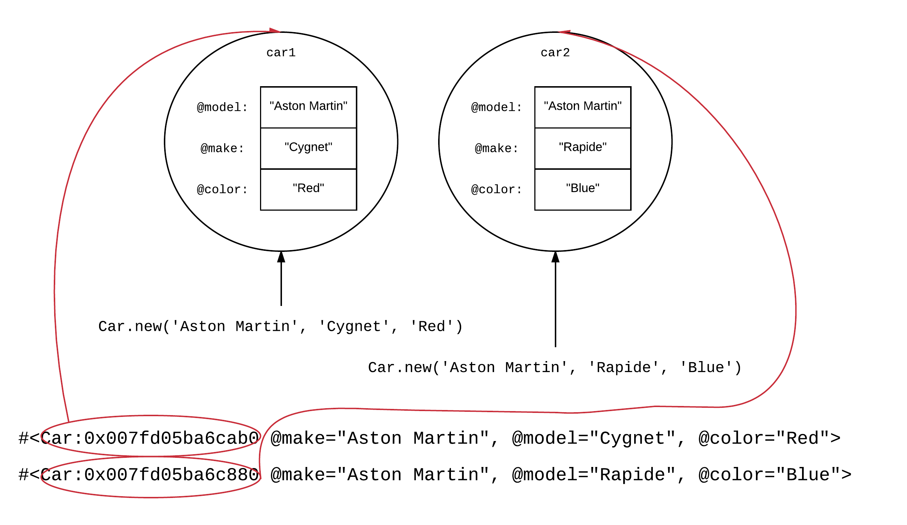
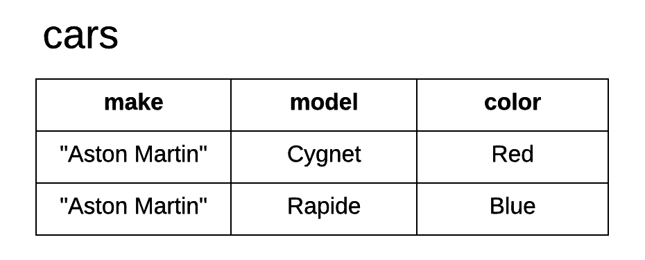
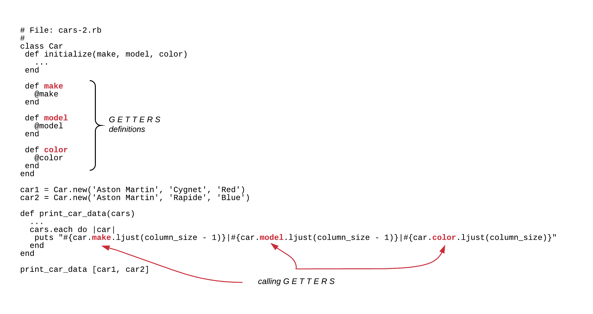
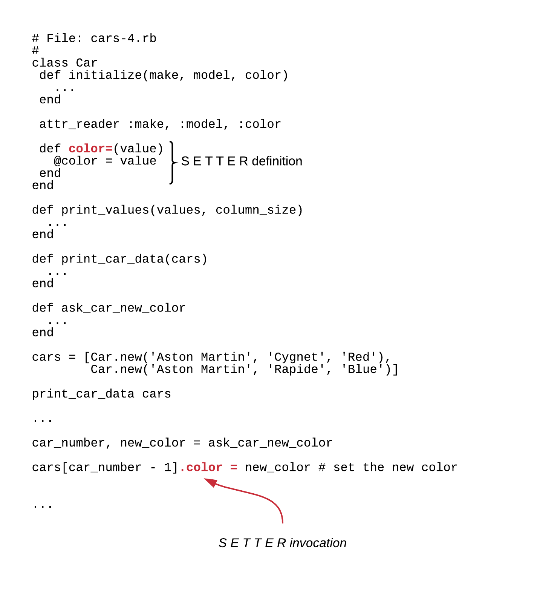
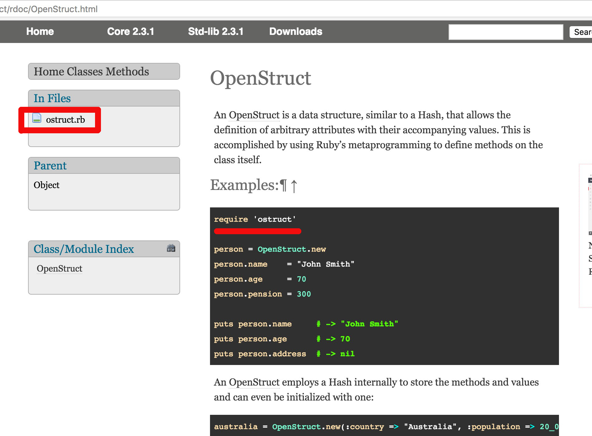

## Introduction

A Class is a way to describe a set of Objects of the world that share the same attributes, not same values. They also share
same behaviour. It is one of the main tools in modeling the world, while creating software to solve a real world problem. 



## Basics By Example

Let's suppose that we want to model *cars* in our Ruby application, which might be, for example, a car simulator.
How do we do that? Let's start our RubyMine IDE and a new file `cars.rb`. 

First, we might want to specify the attributes of each car. The attributes of each car need to be modeled as special named
variables inside the definition of the class. There are many ways you can do that. Let's see the following:

``` ruby
 1. # File: cars-1.rb
 2. #
 3. class Car
 4.   def initialize(make, model, color)
 5.     @make = make
 6.     @model = model
 7.     @color = color
 8.   end
 9. end
10. 
11. car1 = Car.new('Aston Martin', 'Cygnet', 'Red')
12. 
13. p car1
14. 
15. car2 = Car.new('Aston Martin', 'Rapide', 'Blue')
16. 
17. p car2
```

Reading the above code, here are the things you need to pay attention to.

(1) A new class is defined using the keyword `class` which is followed by the name of the class, the body of the class which defines
its attributes and its behaviour, and, finally, the closing `end` keyword.


(2) The class names start with an upper case latin character. For that reason, they are also considered **constants**. In other words,
whenever we define a class we also define a new constant. On the `cars-1.rb` example above, the `Car` is a new constant. 

(3) All the functions defined inside the class definition block are called `methods` in Object Oriented Programming and they constitute the
behaviour of the objects this class classifies.

(4) We create **instances** of a class, i.e. **objects** by calling the method `.new()` on the class constant. This is what happens on lines
11 and 15 above, in the `cars-1.rb` program. This is very important to understand. The class defines how the instances should be, but the
actual objects do not exist until they are instantiated with `.new()` calls.


On the previous picture, you can see 3 objects as instances of the same class.



Above, you can see the picture of RAM contents for the class definition and the 2 object instances created with `.new()` for the program `cars-1.rb`.
As you can see, the definition exists only once. However, the objects can be many. Every time we call `.new()`, we create an instance of that class, i.e. 
a new object.

(5) The `.new()` is the way to instantiate objects. This is a method that might take arguments. Whether it takes arguments or not depends on the
definition of the `initialize` method inside the class definition.



With regards to our example code, `cars-1.rb`, the `.new()` method is called with 3 arguments, because `initialize` requires that. 1 for make, 1 for model
and 1 for color.



The matching of argument of `.new()` to `initialize()` is mandatory. For each `.new()` call, Ruby will do some housekeeping (e.g. to allocate enough memory for the
object instance in RAM) and then will call `initialize()` passing the `.new()` arguments to it. If the arguments that `.new()` is called with do not match
the definition of typical arguments of `initialize()` then instantiation of the object will fail.

(6) All the variables that are defined inside the `initialize()` method and have a name that starts with the symbol `@` are considered object local variables. This
means that their visibility, their scope, is not limited inside the body of the `initialize()` method. They live as long as the object lives. And they are accessible
and visible by any other method defined in the class. These variables are called *instance variables* (or sometimes *ivars* for short), in order to differentiate them
from local variables, global variables and class variables.

> *Note:* We have not talked yet about the *class variables*. See later on in this section.


As you can see on the above picture, our `Car` class makes sure that whenever a `Car` instance is created, it has 3 instance variables.

(7) The instance variables hold values which are unique copies per instance. Setting the instance variable value on one instance/object does not affect
the value of the same name variable on another object of same class. Hence, the instance variables are scoped by the object instance.



(8) Running the above program, it gives you this:

``` base
$ ruby cars-1.rb
#<Car:0x007fd05ba6cab0 @make="Aston Martin", @model="Cygnet", @color="Red">
#<Car:0x007fd05ba6c880 @make="Aston Martin", @model="Rapide", @color="Blue">
$
```

This verifies what we have said earlier.



You can see that Ruby has created two different positions in memory. One for `car1` and another one for `car2`. And when you print the contents of those variables,
on lines 13 and 17, you can see that each one has its own copies of the instance variables `@make`, `@model` and `@color`. 

(9) The instance variables of an object are, basically, its object attributes. In the example above, the class `Car` that we have designed does not
contain any other method, other than the constructor `initializer` method. Hence, this is a class without behaviour. At least obvious one. Later on, we will see
how we can add behaviour to the class.

## `initializer` is optional

When we define a new class, we do not have to define an `initializer` method. All classes, by default have an empty `initializer` method already defined.
See the following program `without-initializer.rb`:

``` ruby
1. # File: without-initializer.rb
2. #
3. class Color
4. end
5. 
6. blue = Color.new
7. 
8. p blue
```

This means that the line 6, `Color.new` will not fail. It will succeed and will create a new instance of the class Color. If you run this program
you will get this:

``` bash
$ ruby without-initializer.rb
#<Color:0x007fae811956e0>
$
```

You can confirm that the instance has been created, but it does not have any instance variables. However, the absence of the `initializer` was not a problem at all.

## Classes and Objects vs Tables and Rows

Another way you can view the class definition is comparing it to a `create table` command in MySQL. So, one could say that classes correspond to tables.
They have attributes like tables have columns. Taking that further, instances of classes correspond to rows inside the tables. I can have many instances of
a class like I can have many rows inside a particular table.



The main difference of course being the fact that tables cannot have behaviour, they only hold data. Classes, on the other hand, can have behaviour, 
something that we are going to see extensively a little bit later.

## Getters and Setters

We have learnt how we can instantiate objects of a particular class. Also, how we can set initial values to their attributes, i.e. their instance variables.
But how can we read the values of their attributes? How can we change the values of the attributes after initialization?

This is very simple. For getting the values back, we need to have *getters* for each one of the instance variables. For setting new values, we need to have
*setters*. Let's see version 2 of our `Car` class (program `cars-2.rb`):

### Getters

``` ruby
 1. # File: cars-2.rb
 2. #
 3. class Car
 4.   def initialize(make, model, color)
 5.     @make = make
 6.     @model = model
 7.     @color = color
 8.   end
 9. 
10.   def make
11.     @make
12.   end
13. 
14.   def model
15.     @model
16.   end
17. 
18.   def color
19.     @color
20.   end
21. end
22. 
23. car1 = Car.new('Aston Martin', 'Cygnet', 'Red')
24. car2 = Car.new('Aston Martin', 'Rapide', 'Blue')
25. 
26. def print_car_data(cars)
27.   column_size = 30
28.   number_of_columns = 3
29.   puts "#{'Make'.ljust(column_size - 1)}|#{'Model'.ljust(column_size - 1)}|#{'Color'.ljust(column_size)}"
30.   puts '=' * (column_size * number_of_columns)
31.   cars.each do |car|
32.     puts "#{car.make.ljust(column_size - 1)}|#{car.model.ljust(column_size - 1)}|#{car.color.ljust(column_size)}"
33.   end
34. end
35. 
36. print_car_data [car1, car2]
```

Program `cars-2.rb` is a program that demonstrates the *getters*. You can see that the class definition includes three new methods on lines 10, 14 and 18.
One for each one of the instance variables. These methods could have had any name, but, since all that they do is to return the
value of the corresponding instance variable, we named them after the name of the instance variable that they return (without the
prefix `@` of course). 

Hence, method `make` returns the value of the instance variable `@make`, `model` that of `@model` and `color` that of `@color`.
These methods are called *getters* because they are used to get the value of an object attribute.

On line 32, we use those getters in order to print a long string with the instance attribute values.



Ooooh. `cars-2.rb` is a little bit complicated. I believe that we have learnt quite a lot of Ruby tricks in order to make it more clear.
Try this version, which is functionally equal to `cars-2.rb`, but with more clean implementation. Reduced number of code repetition, smaller
methods and easier to adapt to changes (program `cars-2-improved.rb`):

``` ruby
 1. # File: cars-2-improved.rb
 2. #
 3. class Car
 4.   def initialize(make, model, color)
 5.     @make = make
 6.     @model = model
 7.     @color = color
 8.   end
 9. 
10.   def make
11.     @make
12.   end
13. 
14.   def model
15.     @model
16.   end
17. 
18.   def color
19.     @color
20.   end
21. end
22. 
23. car1 = Car.new('Aston Martin', 'Cygnet', 'Red')
24. car2 = Car.new('Aston Martin', 'Rapide', 'Blue')
25. 
26. def print_values(values, column_size)
27.   puts values.
28.          map {|column_header| column_header.ljust(column_size)}.
29.          join('|')
30. end
31. 
32. def print_car_data(cars)
33.   column_size = 30
34.   number_of_columns = 3
35. 
36.   print_values ['Make', 'Model', 'Color'], column_size
37. 
38.   puts '=' * (column_size * number_of_columns + number_of_columns - 1)
39. 
40.   cars.each do |car|
41.     print_values ["#{car.make}", "#{car.model}", "#{car.color}"], column_size
42.   end
43. end
44. 
45. print_car_data [car1, car2]
```

> *Important:* You need to be able to understand why the 2 versions, `cars-2.rb` and `cars-2-improved.rb`, deliver
the same functionality. If not, please, try to review your Ruby knowledge from the previous chapters or consult with your
mentor.

If you run the above program, you will get this:

``` bash
$ ruby cars-2-improved.rb
Make                          |Model                         |Color                         
============================================================================================
Aston Martin                  |Cygnet                        |Red                           
Aston Martin                  |Rapide                        |Blue                     
$
```

### `attr_reader` method

One of Ruby objectives is to relief developer from tedious and repetitive tasks. `attr_reader` is one tool that helps
achieve this objective. 

If you read the `cars-2-improved.rb` program carefully, you will encounter a repetition here that does not have 
too much value:

``` ruby
10.   def make
11.     @make
12.   end
13. 
14.   def model
15.     @model
16.   end
17. 
18.   def color
19.     @color
20.   end
```

Three similar methods, returning the instance variable value, with names matching the corresponding instance variable
name (without the `@` prefix). If we had twenty attributes, we would have to repeat this pattern twenty times. `attr_reader`
is a method that we can call at `class` level and do the work for us.
 
In fact:

``` ruby
attr_reader :make
```

is equivalent to

``` ruby
def make
  @make
end
```

So, three lines of code have now become only one. And not only that, `attr_reader` can take variable number of arguments
all of them being symbols to use with the same logic. Look at the following version of the cars program that is using
`attr_reader` (program: `cars-3.rb`)

``` ruby
 1. # File: cars-3.rb
 2. #
 3. class Car
 4.   def initialize(make, model, color)
 5.     @make = make
 6.     @model = model
 7.     @color = color
 8.   end
 9. 
10.   attr_reader :make, :model, :color
11. end
12. 
13. car1 = Car.new('Aston Martin', 'Cygnet', 'Red')
14. car2 = Car.new('Aston Martin', 'Rapide', 'Blue')
15. 
16. def print_values(values, column_size)
17.   puts values.
18.          map {|column_header| column_header.ljust(column_size)}.
19.          join('|')
20. end
21. 
22. def print_car_data(cars)
23.   column_size = 30
24.   number_of_columns = 3
25. 
26.   print_values ['Make', 'Model', 'Color'], column_size
27. 
28.   puts '=' * (column_size * number_of_columns + number_of_columns - 1)
29. 
30.   cars.each do |car|
31.     print_values ["#{car.make}", "#{car.model}", "#{car.color}"], column_size
32.   end
33. end
34. 
35. print_car_data [car1, car2]
```

Program `cars-2-improved.rb` has been reduced by 10 lines of code. If you run the program `cars-3.rb` you will get exactly the
same output like you did when you ran the program `cars-2-improved.rb`.

Cool!

Now, let's talk about changing the values of instance variables.

### Setters

The setters are methods that have name that ends with `=`. This makes Ruby know that you can call this method with an
assignment operator. This is how we are going to define setters for the instance variables of our cars. See program `cars-4.rb`:

``` ruby
 1. # File: cars-4.rb
 2. #
 3. class Car
 4.   def initialize(make, model, color)
 5.     @make = make
 6.     @model = model
 7.     @color = color
 8.   end
 9. 
10.   attr_reader :make, :model, :color
11. 
12.   def color=(value)
13.     @color = value
14.   end
15. end
16. 
17. def print_values(values, column_size)
18.   puts values.
19.          map {|column_header| column_header.ljust(column_size)}.
20.          join('|')
21. end
22. 
23. def print_car_data(cars)
24.   column_size = 30
25.   number_of_columns = 3
26. 
27.   print_values ['Make', 'Model', 'Color'], column_size
28. 
29.   puts '=' * (column_size * number_of_columns + number_of_columns - 1)
30. 
31.   cars.each do |car|
32.     print_values ["#{car.make}", "#{car.model}", "#{car.color}"], column_size
33.   end
34. end
35. 
36. def ask_car_new_color
37.   print 'Which car color has changed? (1/2): '
38.   car_changed = gets.to_i
39.   if car_changed < 0 || car_changed > 2
40.     puts 'This is not a valid car number'
41.     exit 1 # program exits
42.   end
43. 
44.   print 'Which is the new color? '
45.   new_color = gets.chomp.strip
46. 
47.   [car_changed, new_color]
48. end
49. 
50. cars = [Car.new('Aston Martin', 'Cygnet', 'Red'),
51.         Car.new('Aston Martin', 'Rapide', 'Blue')]
52. 
53. print_car_data cars
54. 
55. puts # just print an empty line
56. 
57. car_number, new_color = ask_car_new_color
58. cars[car_number - 1].color = new_color # set the new color
59. 
60. puts # just print an empty line
61. 
62. print_car_data cars
```

This program is asking the user to specify the car that needs to change color and the new color value. This is a sample run:

``` bash
$ ruby cars-4.rb
Make                          |Model                         |Color                         
============================================================================================
Aston Martin                  |Cygnet                        |Red                           
Aston Martin                  |Rapide                        |Blue     
                     
Which car color has changed? (1/2): 1
Which is the new color? White

Make                          |Model                         |Color                         
============================================================================================
Aston Martin                  |Cygnet                        |White                         
Aston Martin                  |Rapide                        |Blue                              
$
```

The program, in order to deliver its functionality, it had to define a way to change the color of a car instance. This is the method:

``` ruby
12.   def color=(value)
13.     @color = value
14.   end
```

The name of the method does not matter, but the convention is to have the same name as the variable to set (without the prefix `@`),
but with a suffix `=`. The suffix `=` tells Ruby that this is an assignment method. Here is how we call it:

``` ruby
58. cars[car_number - 1].color = new_color
```
We just call the `.color =` and on the right hand side we have the value to assign. Inside the setter implementation we just take the
value given and we assign it to the instance variable:

``` ruby
13.     @color = value
```



In `cars-4.rb` program we have specified the setter method only for the `@color` attribute. Similarly, we can specify the setters for the other two attributes:
(program `cars-5.rb`):

``` ruby
 1. # File: cars-5.rb
 2. #
 3. class Car
 4.   def initialize(make, model, color)
 5.     @make = make
 6.     @model = model
 7.     @color = color
 8.   end
 9. 
10.   attr_reader :make, :model, :color
11. 
12.   def make=(value)
13.     @make = value
14.   end
15. 
16.   def model=(value)
17.     @model = value
18.   end
19. 
20.   def color=(value)
21.     @color = value
22.   end
23. end
24. 
25. def print_values(values, column_size)
26.
27. ... same as +cars-4.rb+ ...
```

### `attr_writer`
 
The whole set of setters for the three instance variables of the `Car` class are:

``` ruby
12.   def make=(value)
13.     @make = value
14.   end
15. 
16.   def model=(value)
17.     @model = value
18.   end
19. 
20.   def color=(value)
21.     @color = value
22.   end
```

I guess that you can now see the pattern again. Like you did for the getters. Imagine how much typing we would have to
do if we had twenty instance variables. Ruby saves us a lot of typing here with the help of the method `attr_writer`.
It works like `attr_reader` does, but for the setter methods.

So, the

``` ruby
attr_reader :make
```
is equivalent to:

``` ruby
def make=(value)
  @make = value
end
```
Also, it can take a variable number of arguments. For each one, it will internally create the setter methods, like the `attr_reader`
internally creates the getter methods.

This is the version of the `cars-5.rb` program using `attr_writer` method (program `cars-6.rb`):

``` ruby
 1. # File: cars-6.rb
 2. #
 3. class Car
 4.   def initialize(make, model, color)
 5.     @make = make
 6.     @model = model
 7.     @color = color
 8.   end
 9. 
10.   attr_reader :make, :model, :color
11.   attr_writer :make, :model, :color
12. end
13. 
14. def print_values(values, column_size)
15. ... same as +cars-5.rb+ ...
```

### `attr_accessor`

But still, this is a pattern that Ruby takes advantage of and offers us the method `attr_accessor` that does the job that
both `attr_reader` and `attr_writer` do together.

Hence, the

``` ruby
attr_reader :foo
attr_writer :foo
```

is absolutely equivalent to

``` ruby
attr_accessor :foo
```

which is equivalent to

``` ruby
def foo
  @foo
end

def foo=(value)
  @foo = value
end  
```

Perfect, the version of `cars-6.rb` now becomes (program `cars-7.rb`):

``` ruby
 1. # File: cars-7.rb
 2. #
 3. class Car
 4.   def initialize(make, model, color)
 5.     @make = make
 6.     @model = model
 7.     @color = color
 8.   end
 9. 
10.   attr_accessor :make, :model, :color
11. end
12. 
13. def print_values(values, column_size)
14. ... same as +cars-6.rb+ ...
```

## Optional Initializer

We have already told that `initializer` is optional. Let's see a version of the `cars-7.rb` file without `Car` having an
initializer (program `cars-8.rb`):

``` ruby
 1. # File: cars-8.rb
 2. #
 3. class Car
 4.   attr_accessor :make, :model, :color
 5. end
 6. 
 7. def print_values(values, column_size)
 8.   puts values.
 9.       map {|column_header| column_header.ljust(column_size)}.
10.       join('|')
11. end
12. 
13. def print_car_data(cars)
14.   column_size = 30
15.   number_of_columns = 3
16. 
17.   print_values ['Make', 'Model', 'Color'], column_size
18. 
19.   puts '=' * (column_size * number_of_columns + number_of_columns - 1)
20. 
21.   cars.each do |car|
22.     print_values ["#{car.make}", "#{car.model}", "#{car.color}"], column_size
23.   end
24. end
25. 
26. cars = [Car.new, Car.new]
27. 
28. cars.each do |car|
29.   puts "Car: Make: #{car.make}, Model: #{car.model}, Color: #{car.color}"
30. end
31. 
32. # Give the cars some values
33. 
34. [['Aston Martin', 'Cygnet', 'Red'],
35.  ['Aston Martin', 'Rapide', 'Blue']].
36.  each_with_index do |attributes, index|
37.   cars[index].make = attributes[0]
38.   cars[index].model = attributes[1]
39.   cars[index].color = attributes[2]
40. end
41. 
42. print_car_data cars
```

Now, the class definition does not include an `initializer`.

``` ruby
3. class Car
4.   attr_accessor :make, :model, :color
5. end
```

And we instantiate the two cars with simple `.new` method calls:

``` ruby
26. cars = [Car.new, Car.new]
```

But, these two instances do not have any values to their attributes. So, the following lines
will actually print empty strings at the points we invoke the getters

``` ruby
28. cars.each do |car|
29.   puts "Car: Make: #{car.make}, Model: #{car.model}, Color: #{car.color}"
30. end
```

How can we set values? Using the setter methods of course:

``` ruby
34. [['Aston Martin', 'Cygnet', 'Red'],
35.  ['Aston Martin', 'Rapide', 'Blue']].
36.  each_with_index do |attributes, index|
37.   cars[index].make = attributes[0]
38.   cars[index].model = attributes[1]
39.   cars[index].color = attributes[2]
40. end
```

On line 37, 38 and 39 above we set the values to the two car instances. Then we print the values.

If we run the program `cars-8.rb` we will see this:

``` bash
Car: Make: , Model: , Color: 
Car: Make: , Model: , Color: 
Make                          |Model                         |Color                         
============================================================================================
Aston Martin                  |Cygnet                        |Red                           
Aston Martin                  |Rapide                        |Blue 
```

You can see that the first two lines print empty values for the attributes of the two cars.

## `instance_variables`

Before we close this chapter on classes and objects, let's see some methods that all instances offer. One of them is `#instance_variables`, which 
returns a list of the instance variables. See this program here: `cars-9.rb`

``` ruby
 1. # File:: cars-9.rb
 2. #
 3. class Car
 4.   def initialize(make, model, color)
 5.     @make = make
 6.     @model = model
 7.     @color = color
 8.   end
 9. 
10.   attr_accessor :make, :model, :color
11. end
12. 
13. car = Car.new('Aston Martin', 'Rapide', 'Blue')
14. puts "car instance variables: #{car.instance_variables}"
```

On line 14 we are calling `car.instance_variables`. This returns the list of instance variables of the instance `car`. 
If we run this program we will see this:

``` bash
car instance variables: [:@make, :@model, :@color]
```

You can see the array of instance variables printed: `[:@make, :@model, :@color]`. The name of each variable is printed
in its symbol format. 

## General Getter: `instance_variable_get`

Ruby allows you to use a general getter to get the value of an instance variable. This might be particularly useful when
the calling code does not really know the actual variable names, or there are not normal getters to get the values. 
In the following example, the class does not provide getters. We are getting the variable values using `instance_variable_get`.
(Program `cars-10.rb`):

``` ruby
 1. # File:: cars-10.rb
 2. #
 3. class Car
 4.   def initialize(make, model, color)
 5.     @make = make
 6.     @model = model
 7.     @color = color
 8.   end
 9. end
10. 
11. car = Car.new('Aston Martin', 'Rapide', 'Blue')
12. 
13. car.instance_variables.each do |instance_variable|
14.   human_name_for_variable = instance_variable.to_s.delete(':@').capitalize
15.   variable_value = car.instance_variable_get(instance_variable)
16. 
17.   puts "Car #{human_name_for_variable}: #{variable_value}"
18. end
```

As you can read from the class definition above, there is no way we can get the attribute values, other than using the method `#instance_variable_get()`. 
This is what we do on line 15. Note that on line 14, we manipulate the symbol corresponding to the instance variable. The instance variable symbols are
of the following format `:@color`. So, in order to make it presentable, we delete the `:@` and we capitalize the rest. So `:@color` becomes `Color`.

## General Setter: `instance_variable_set`

Similar to the general getter, there is also a general setter, `#instance_variable_set()` method. It takes as first argument the symbol corresponding
to the variable to set value for, and as second argument the actual value to set. See the program `cars-11.rb`:

``` ruby
 1. # File:: cars-11.rb
 2. #
 3. class Car
 4.   def initialize(make, model, color)
 5.     @make = make
 6.     @model = model
 7.     @color = color
 8.   end
 9. end
10. 
11. car = Car.new('Aston Martin', 'Rapide', 'Blue')
12. 
13. car.instance_variable_set(:@color, 'White')
14. 
15. car.instance_variables.each do |instance_variable|
16.   human_name_for_variable = instance_variable.to_s.delete(':@').capitalize
17.   variable_value = car.instance_variable_get(instance_variable)
18. 
19.   puts "Car #{human_name_for_variable}: #{variable_value}"
20. end
```

The `cars-11.rb` program is exactly the same like the `cars-10.rb`, except from the fact that there is an extra line, line 13, that is using
`#instance_variable_set` to change the color of the car. Note that there is no other way we can do that, since there is not setter method.

> *Note:* Try to avoid using `instance_variable_set` and `instance_variable_get` methods, unless it is absolutely necessary. For example
when you write a generic utility method that does not necessarily know the instance variables of the object it acts upon. Those methods
they violate the encapsulation principle that we need to obey, which says that we should be using methods to access / change the state
of an object, methods that actually hide the complexity that might rely behind the actual implementation.

## Struct

The class definition pattern

1. `initializer` with a series of typical attributes to initialize the instance variables with
2. `attr_accessor` with all the instance variable names 

is a very common pattern. For that reason, Ruby has another type of `Class`, which is called `Struct`.

So, instead of the following piece of code:

``` ruby
class Car
  def initialize(make, model, color)
    @make = make
    @model = model
    @color = color
  end

  attr_accessor :make, :model, :color
end
```

You can write this piece of code:

``` ruby
Car = Struct.new(:make, :model, :color)
```

and your are done. You can later on 

1. instantiate the cars with `Car.new`. Example: `car = Car.new('Aston Martin', 'Rapide', 'Blue')`
2. you can use getter methods to have read access to the attribute values. Example: `car.model`.
3. you can use setter methods to have write access to the attribute values. Example: `car.color = 'White'`.

### `#members`

However, `car` instances that have been created based on a `Struct` do not have instance variables. They respond
to a method called `#members` which returns the list of attributes the instance has. The array returned has the
symbols of the attributes, but these are not instance variable symbols. So, instead of `:@color` it is `:color`. Let's see 
an example (program `struct-1.rb`):

``` ruby
1. # File:: struct-1.rb
2. #
3. Car = Struct.new(:make, :model, :color)
4. 
5. car = Car.new('Aston Martin', 'Rapide', 'Blue')
6.
7. puts "car members: #{car.members}"
```

If you run the above program, you will see this:

``` bash
$ ruby struct-1.rb
car members: [:make, :model, :color]
$
```

which proves the difference in names between `Struct` members and object instance variables.

### Member Access

Since we don't have instance variables, there is no point using `#instance_variable_get`, neither `#instance_variable_set`. There are
equivalent methods to access the member values without calling the accessor methods. So, instead of calling `car.color` you can call
`car[:color]` like if the `car` were a `Hash` (but it is n't).

See the example `struct-2.rb`:

``` ruby
 1. # File:: struct-2.rb
 2. #
 3. Car = Struct.new(:make, :model, :color)
 4. 
 5. car = Car.new('Aston Martin', 'Rapide', 'Blue')
 6. 
 7. puts "car members: #{car.members}"
 8. 
 9. car.members.each do |member|
10.   human_name_for_member = member.to_s.delete(':').capitalize
11.   member_value = car[member]
12. 
13.   puts "Car #{human_name_for_member}: #{member_value}"
14. end
```

If you run the above program, you will get this:

``` ruby
car members: [:make, :model, :color]
Car Make: Aston Martin
Car Model: Rapide
Car Color: Blue
```

On line 12, we are using the `[]` operator to have access to the corresponding member value. 

Similarly, you can use the `[] =` method to set the value of a member without actually using the setter. So, instead of `car.color = 'White'`,
you can do `car[:color] = 'White'`. See the program `struct-3.rb`:

``` ruby
 1. # File:: struct-3.rb
 2. #
 3. Car = Struct.new(:make, :model, :color)
 4. 
 5. car = Car.new('Aston Martin', 'Rapide', 'Blue')
 6. 
 7. puts "car members: #{car.members}"
 8. 
 9. car[:color] = 'White'
10. 
11. car.members.each do |member|
12.   human_name_for_member = member.to_s.delete(':').capitalize
13.   member_value = car[member]
14. 
15.   puts "Car #{human_name_for_member}: #{member_value}"
16. end
```

You can see that on line 9 we are setting the `color` member to the value `White`.

Again, setting and reading member values using `[] =` and `[]` respectively, without actually using the accessor methods, is recommended
when you are not aware of the actual member names. 

### Initialized with `nil` values

Another difference between the `class` `Car` and the `Struct` `Car` is that when you initialize the latter you may not provide
values for all the members. In that case, they will be initialized with a `nil` value.

### When Shall We Use a `Struct`?

A Struct is a convenient way to bundle a number of attributes together, using accessor methods, without having to write an explicit class.
We will talk about the `Structs` later on in other chapters of this section.

## `OpenStruct`

An `OpenStruct` is a data structure, similar to a `Hash`, that allows the definition of arbitrary attributes with their accompanying values.
Let's see our cars example using `OpenStruct` (`open-struct-1.rb`):
 
``` ruby
 1. # File: open-struct-1.rb
 2. #
 3. require 'ostruct'
 4. 
 5. def print_values(values, column_size)
 6.   puts values.
 7.       map {|column_header| column_header.ljust(column_size)}.
 8.       join('|')
 9. end
10. 
11. def print_car_data(cars)
12.   column_size = 30
13.   number_of_columns = 3
14. 
15.   print_values ['Make', 'Model', 'Color'], column_size
16. 
17.   puts '=' * (column_size * number_of_columns + number_of_columns - 1)
18. 
19.   cars.each do |car|
20.     print_values ["#{car.make}", "#{car.model}", "#{car.color}"], column_size
21.   end
22. end
23. 
24. cars = [OpenStruct.new, OpenStruct.new]
25. 
26. cars.each do |car|
27.   puts "Car: Make: #{car.make}, Model: #{car.model}, Color: #{car.color}"
28. end
29. 
30. # Give the cars some values
31. 
32. [['Aston Martin', 'Cygnet', 'Red'],
33.  ['Aston Martin', 'Rapide', 'Blue']].
34.     each_with_index do |attributes, index|
35.   cars[index].make = attributes[0]
36.   cars[index].model = attributes[1]
37.   cars[index].color = attributes[2]
38. end
39. 
40. print_car_data cars
```

If you run the above program, you will get this:

```
$ ruby open-struct-1.rb
Car: Make: , Model: , Color: 
Car: Make: , Model: , Color: 
Make                          |Model                         |Color                         
============================================================================================
Aston Martin                  |Cygnet                        |Red                           
Aston Martin                  |Rapide                        |Blue
$
```

Watch out for the following:

1. On line 3 we require the file `ostruct`. This is necessary in order for us to be able to call `OpenStruct.new` later on in our code.
2. There is no class definition for the `Car` anymore.
3. When we instantiate the cars, we use `OpenStruct.new`. See line 24.
4. Then the rest of the program is as if we had the class `Car` with the `attr_accessors` defined. The `OpenStruct` instances have the
ability to define dynamically necessary getters and setters at the moment we actually need the attributes. So, on line 27, where
we need the getters (`car.make`, `car.model` and `car.color`), they are dynamically defined by the `OpenStruct`. Same goes for the
setters on lines 35, 36 and 37.

Note that neither `OpenStruct` instances create, internally, the instance variables like the `attr_accessor` on classes does. So, if you 
try on the previous example to get the value of the instance variable `color`, using something like `cars[0].instance_variable_get(:@color)`
you will not get anything.

Use `OpenStruct` with caution because it might be much slower than a proper `Hash` or a `Struct`.

## Core vs Standard Library

Note that Ruby comes with two sets of libraries. The core and the standard library.

Core Library: http://ruby-doc.org/core-2.3.1/

Standard Library: http://ruby-doc.org/stdlib-2.3.1/
 
For example, `Struct` belongs to core library, whereas `OpenStruct` belongs to standard library. The standard library extends and relies on the
core library. Usually, when you use constructs from the standard library you need to `require` the corresponding file. 
 
 

I would like to ask you to start getting familiar with the docs pages for both core and standard libraries. I understand that it may be a little
bit of daunting at the moment, but the more you read it the more you get familiar with it and, finally, it will be proven useful to you.

## Notes About the Programs In This Chapter

The Ruby programs presented on this chapter may have some Ruby challenges for you. Let's have a look at some of them:

* Program `cars-2.rb`. It uses the `#ljust()` method to left justify a string value within a specific column width. Example `car.make.ljust(column_size - 1)`
* Program `cars-2.rb`. Calling functions without curved brackets. Example: `print_car_data [car1, car2]` instead of `print_car_data([car1, car2])`.
* Program `cars-2-improved.rb`. Chaining method calls using multiple lines. Example:
``` ruby
values.
  map {|column_header| column_header.ljust(column_size)}.
  join('|') 
```
On this example, we are calling method `#map()` on the `values` variable. Then on the result of `#map()` we are calling `#join()` method.
Note the `.` at the end of each line before starting the next one. Note also that `#map()` takes each one of the elements of an array
and maps it to another, the result being another array.
* Program `cars-4.rb`. You can just call `puts` without any arguments. This will print an empty line.
* Program `cars-5.rb`. The `exit` method used on line 49 (`exit 1`) is terminating the program with an error code equal to `1`. 
* Program `cars-6.rb`. The return value of the function `ask_car_new_color` is an array. Line 44: `[car_changed, new_color]`. It contains two elements.
* Program `cars-6.rb`. When we call a function that returns an array we can save the result to distinct variables. See line 54: `car_number, new_color = ask_car_new_color`.
Since we know that `ask_car_new_color` returns an array with two elements, we can assign the result to two variables. Then each variable will have the
value of the corresponding position item of the array returned.
* Program `cars-8.rb`. An array can be initialized with object instances. See line 26. It is not only initialized with simple literal values like strings or numbers. The line
is `cars = [Car.new, Car.new]`.
* Program `cars-8.rb`. Lines 34 and 35, they define an array of arrays. In other words, every item of the array is another array. 
* Program `cars-10.rb`. Note that symbols do not respond to `#delete()` method. Strings do. That's why we are converting the symbol to a string, on line 14. The 
method to convert a symbol to a string is to call method `@to_s` on it. Also, method `#capitalize` makes the first character uppercase.
