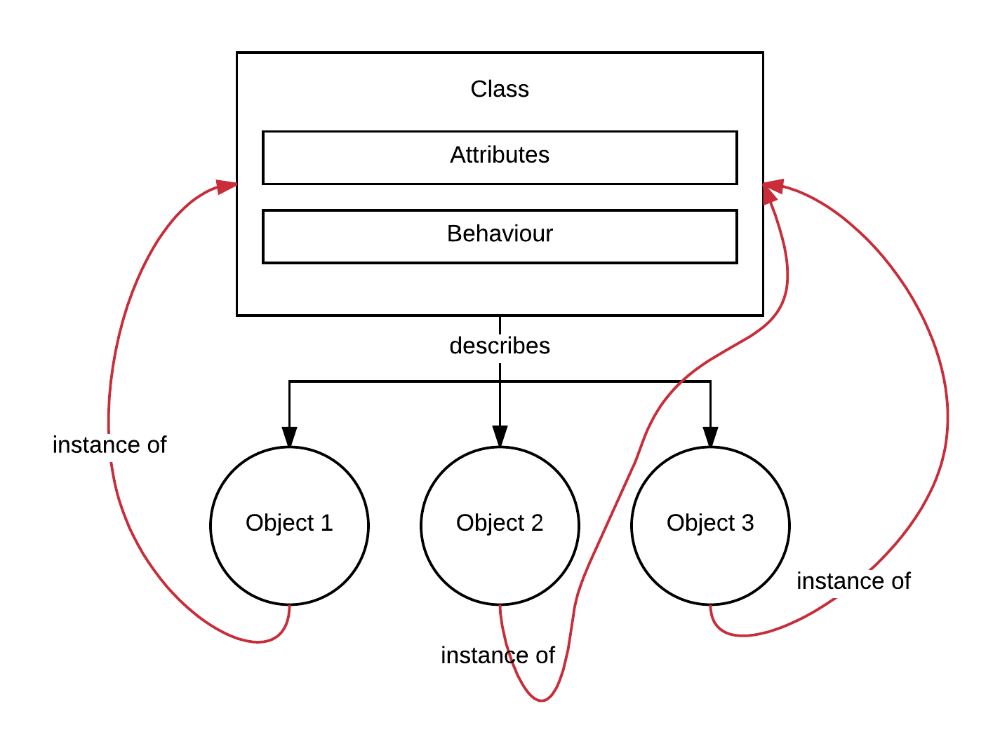

This chapter will introduce you to the object oriented programming using Ruby. This is very important in the software development
industry. The object oriented paradigm is widely used and you need to start getting familiar with that sooner rather than later.
Modeling the world with classes and objects is very intuitive and Ruby offers all the necessary tools to design your powerful object models.
Ruby is an object oriented language and everything in Ruby is an object.
