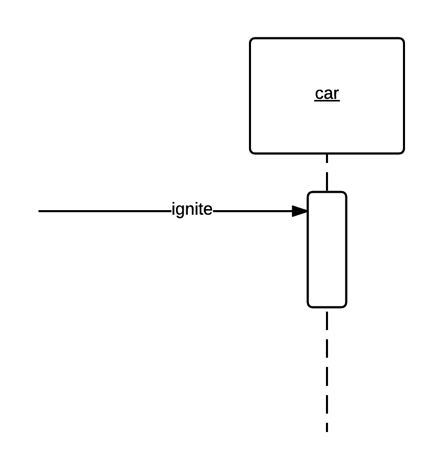
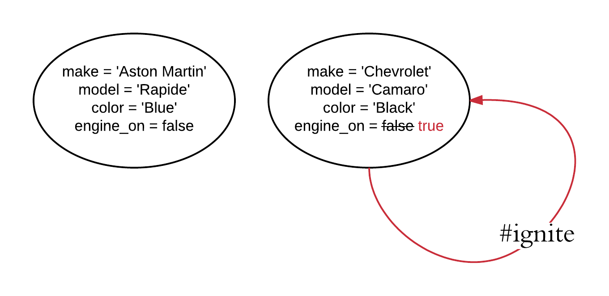
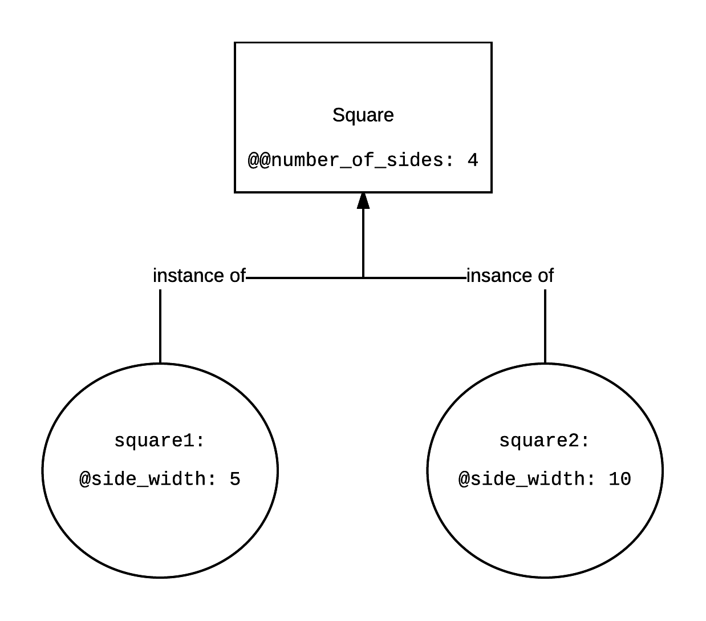
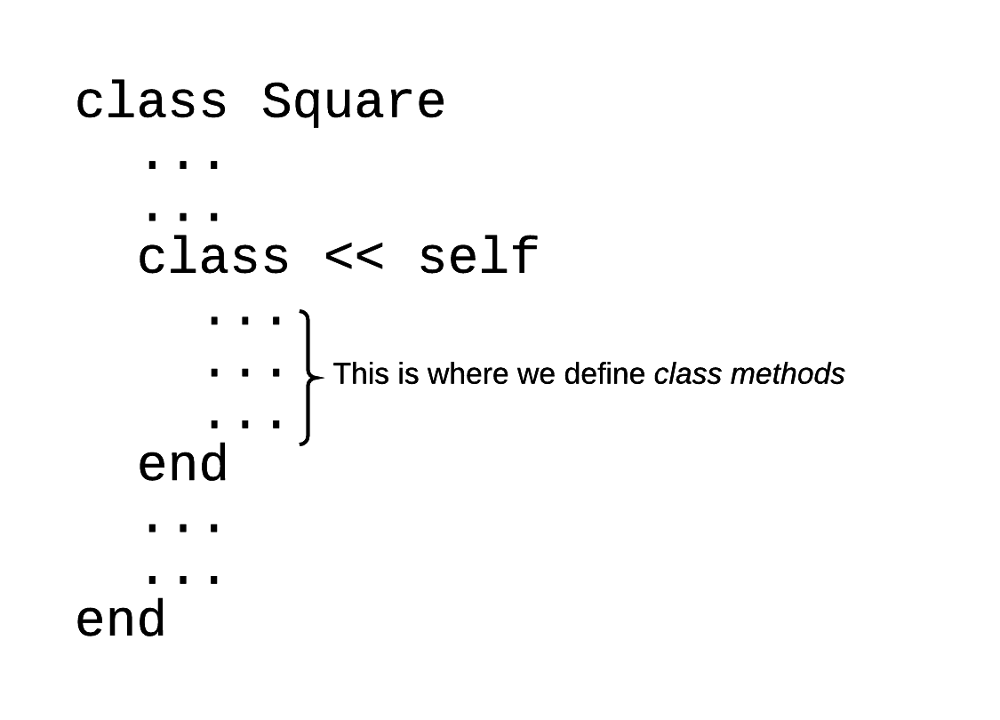
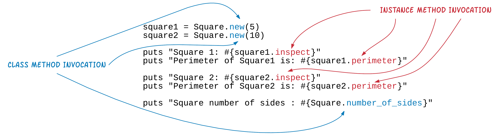
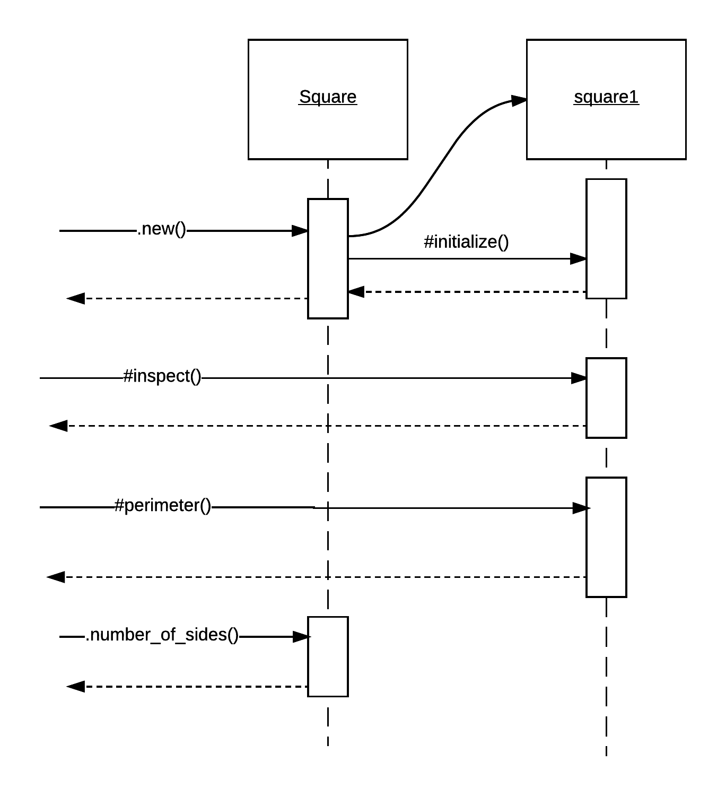
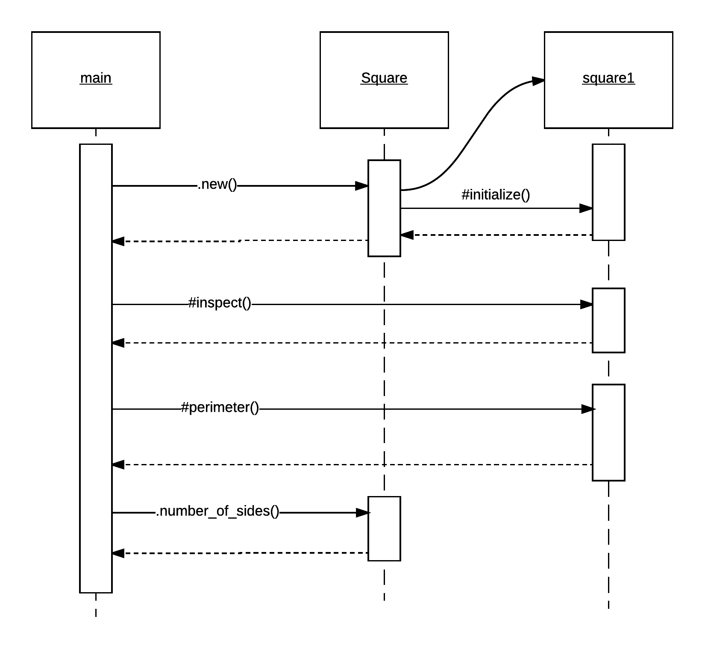

We have worked the concept of the class and the concept of the object, in general object-oriented terms. 
We have talked about attributes of an object. But have not studied much the behaviour of an object.

The behaviour of an object is usually modeled using a function, which is called *method* in that case. The definition
of the method takes place inside the definition of a class. The method, usually, evaluates or updates the state of the
object. The state being defined by the current values of the attributes of the object.

We have already seen the construction behaviour of an object. This is modeled using the `initialize` method. Let's work
some examples that will allow us to add some extra behaviour to the object.

## Examples of Behaviour

Our `Car` model, with `make`, `model` and `color` attributes, allows us to change the values of its attributes via the
setter/writer methods. This means that the setter methods are part of the behaviour of the object.

But this is very primitive. Let's do something a little bit more complex! Let's ask the car
to ignite itself. With the `ignite` method we will be asking the car to switch its engine on (program: `car-1.rb`)

``` ruby
 1. # File: car-1.rb
 2. #
 3. class Car
 4.   attr_accessor :make, :model, :color
 5. 
 6.   def initialize(make, model, color)
 7.     @make = make
 8.     @model = model
 9.     @color = color
10.     @engine_on = false
11.   end
12. 
13.   def ignite
14.     @engine_on = true
15.   end
16. end
17. 
18. car = Car.new('Aston Martin', 'Rapide', 'Blue')
19. 
20. puts car.inspect
21. 
22. puts "About to ignite..."
23. 
24. car.ignite
25. 
26. puts car.inspect
```

## Responding To a Method or Accepting a Message

This is an enhanced model of the `Car` which also has the method `ignite`. This means that:

1. `Car` instances will be responding to `.ignite` calls.
2. `Car` instances will be able to accept and process the message `.ignite`.
3. `Car` instances accept the message `.ignite`.

The above 3 statements are interchangeably used in object oriented programming. *Instance responds to a particular method call*,
or *Instance responds to particular message* or *Instance accepts a message* and similar.

And sometimes we draw it like this:



## Change of The State of The Object

If you run the above program, you will get this:

``` ruby
$ ruby car-1.rb
#<Car:0x007fc6eba7c4c0 @make="Aston Martin", @model="Rapide", @color="Blue", @engine_on=false>
About to ignite...
#<Car:0x007fc6eba7c4c0 @make="Aston Martin", @model="Rapide", @color="Blue", @engine_on=true>
$
```
As you can see, after calling ignite, the attribute `engine_on` has the value `true`. It was updated, changed, by the call to `#ignite` method.
And of course this change is specific to each instance. See this (`car-2.rb`):

``` ruby
 1. # File: car-2.rb
 2. #
 3. class Car
 4.   attr_accessor :make, :model, :color
 5. 
 6.   def initialize(make, model, color)
 7.     @make = make
 8.     @model = model
 9.     @color = color
10.     @engine_on = false
11.   end
12. 
13.   def ignite
14.     @engine_on = true
15.   end
16. end
17. 
18. cars = [Car.new('Aston Martin', 'Rapide', 'Blue'),
19.         Car.new('Chevrolet', 'Camaro', 'Black')]
20. 
21. puts cars.inspect
22. 
23. puts "About to ignite Chevrolet..."
24. 
25. cars.find {|car| car.make == 'Chevrolet'}.ignite
26. 
27. puts cars.inspect
```

The above program instantiates two cars. And then, on line 25, it ignites the second one. If you run this program

``` bash
[#<Car:0x007f80111e8708 @make="Aston Martin", @model="Rapide", @color="Blue", @engine_on=false>, #<Car:0x007f80111e8668 @make="Chevrolet", @model="Camaro", @color="Black", @engine_on=false>]
About to ignite Chevrolet...
[#<Car:0x007f80111e8708 @make="Aston Martin", @model="Rapide", @color="Blue", @engine_on=false>, #<Car:0x007f80111e8668 @make="Chevrolet", @model="Camaro", @color="Black", @engine_on=true>]
```
you will see that the `#ignite` call changed the value of the attribute `engine_on` only for the second instance. The other one remained `false`. 



## Boolean Result Methods

Instance methods do not only change the state of an object, but they also return the state of it. For example, we can add a method `#switched_on?` that would return
`true` or `false`, depending on whether the engine is on or off. Note the `?` at the end of the method name. It is a common practice in Ruby to name the boolean returning
methods with a `?` suffix to their names. See program `car-3.rb`:

``` ruby
 1. # File: car-3.rb
 2. #
 3. class Car
 4.   attr_accessor :make, :model, :color
 5. 
 6.   def initialize(make, model, color)
 7.     @make = make
 8.     @model = model
 9.     @color = color
10.     @engine_on = false
11.   end
12. 
13.   def ignite
14.     @engine_on = true
15.   end
16. 
17.   def switched_on?
18.     @engine_on
19.   end
20. end
21. 
22. car = Car.new('Aston Martin', 'Rapide', 'Blue')
23. 
24. puts "About to ignite..."
25. 
26. car.ignite
27. 
28. puts "Is car switched on?: #{car.switched_on?}"
```

The above program adds a new method on line 17. The method `#switched_on?`. This is another new instance method that returns `true` or `false`, depending on the
value of the instance variable `@engine_on`.

Still, this method would possibly return different value according to the instance it is being called on. One instance might be switched on, whereas another 
not.

## Class Variables

Some times there are cases that we need to have the same value for all the instances of a class. In other words, no matter how many instance of a class we have,
we want a particular attribute to have the same value for all of them. In that case, we do not use an instance variable. We use a *class variable*. See the
following example (`square-1.rb`):

``` ruby
 1. # File: square-1.rb
 2. #
 3. class Square
 4.   @@number_of_sides = 4
 5. 
 6.   def initialize(side_width)
 7.     @side_with = side_width
 8.   end
 9. 
10.   def perimeter
11.     @side_with * @@number_of_sides
12.   end
13. end
14. 
15. square1 = Square.new(5)
16. square2 = Square.new(10)
17. 
18. puts "Square 1: #{square1.inspect}"
19. puts "Perimeter of Square1 is: #{square1.perimeter}"
20. 
21. puts "Square 2: #{square2.inspect}"
22. puts "Perimeter of Square2 is: #{square2.perimeter}"
23. 
24. puts "#{Square.class_variables}"
```

On line 4, we define the class variable `@@number_of_sides`. The class variable names need to start with the prefix `@@`.
Also, we do not use the instance method `#initialize()` to define it. We define it inside the `do ... end` class definition block, but outside the
instance method. This is because this is a class and not an instance variable.



As you can see from the picture above, the class variable is attached to the class rather than to the instances. 

The class variables are accessible by the instance methods. Hence, `#perimeter()` method has access to the `@@number_of_sides` (see line 11).

If you run the above program, you will see this:

``` bash
$ ruby square-1.rb
Square 1: #<Square:0x007f9774264f68 @side_with=5>
Perimeter of Square1 is: 20
Square 2: #<Square:0x007f9774264f40 @side_with=10>
Perimeter of Square2 is: 40
[:@@number_of_sides]
$
```

This prints the expected results. Another thing new to you is the method `.class_variables` which we call on the class `Square` and not on any of the
instances. This returns the array with the class variables defined for this class.

## Getter for Class Variable

We have learned in previous chapters about the accessor methods, setters and getters, for access to instance variables. We can create similar methods
for the class variables too. See the `square-2.rb` program below:

``` ruby
 1. # File: square-2.rb
 2. #
 3. class Square
 4.   @@number_of_sides = 4
 5. 
 6.   def initialize(side_width)
 7.     @side_with = side_width
 8.   end
 9. 
10.   def perimeter
11.     @side_with * @@number_of_sides
12.   end
13. 
14.   class << self
15.     def number_of_sides
16.       @@number_of_sides
17.     end
18.   end
19. end
20. 
21. square1 = Square.new(5)
22. square2 = Square.new(10)
23. 
24. puts "Square 1: #{square1.inspect}"
25. puts "Perimeter of Square1 is: #{square1.perimeter}"
26. 
27. puts "Square 2: #{square2.inspect}"
28. puts "Perimeter of Square2 is: #{square2.perimeter}"
29. 
30. puts "Square number of sides : #{Square.number_of_sides}"
```

Lines 14 to 18 define a getter for the class variable `@@number_of_sides`. The getter has the name `number_of_sides`.
Note that the block `class << self ... end` allows us to include method definitions that define *class methods*. The class methods
can be called on the class, like we do on line 30: `Square.number_of_sides`.



## Class vs Instance Methods Again

So, let's say it again.
 
* We have the instance variables and instance methods.
* and the class variables and the class methods. 
* We call instance methods on instances. 
* We call class methods on classes. 
* Instance methods have access to both instance and class variables.
* Class methods have access only to class variables.


The following picture depicts the class vs instance method invocations:




Note the call to `.new`. The `.new` method is a class method. It returns an instance by internally calling the `#initialize` instance method. But this should not be 
confusing to you. Again: `.new` method is class method, whereas `#initialize` is instance method.

Also note that `#inspect` is being called on the instances of `Square` class. This means that it is an instance method too. 

And another picture of the same concept:



Above, you can see the class vs instance method calls. This diagram is a UML diagram ([UML](http://www.uml.org/)) that demonstrates the sequence of method calls too. We will talk more
about UML on another chapter.

> *Note* how I prefer to indicate that I am calling a class method by prefixing the method name with a `.`. On the contrary, when indicating that
I am calling an instance method, I prefer to use the prefix `#`. However, this happens only when I am documenting the method calls. The actual Ruby statements that
call methods they always do that with the `.`. So, in Ruby code, when you see `.x` this means invocation of method `x` (class or instance method is not distinguished).

## Setter for Class Variable

We have seen the getter for a class variable. Let's see the setter for the class variable. Program `square-2.rb` Also has a setter method for the class variable
`@@number_of_sides`. 

``` ruby
 1. # File: square-3.rb
 2. #
 3. class Square
 4.   @@number_of_sides = 4
 5. 
 6.   def initialize(side_width)
 7.     @side_with = side_width
 8.   end
 9. 
10.   def perimeter
11.     @side_with * @@number_of_sides
12.   end
13. 
14.   class << self
15.     def number_of_sides
16.       @@number_of_sides
17.     end
18. 
19.     def number_of_sides=(value)
20.       @@number_of_sides = value
21.     end
22.   end
23. end
24. 
25. square1 = Square.new(5)
26. square2 = Square.new(10)
27. 
28. puts "Square 1: #{square1.inspect}"
29. puts "Perimeter of Square1 is: #{square1.perimeter}"
30. 
31. puts "Square 2: #{square2.inspect}"
32. puts "Perimeter of Square2 is: #{square2.perimeter}"
33. 
34. puts "Square number of sides : #{Square.number_of_sides}"
35. 
36. puts "Setting number of sides to 5:..."
37. Square.number_of_sides = 5
38. 
39. puts "Square number of sides : #{Square.number_of_sides}"
40. 
41. puts "Recalculating perimeters: "
42. 
43. puts "Perimeter of Square1 is: #{square1.perimeter}"
44. puts "Perimeter of Square2 is: #{square2.perimeter}"
```

The program above defines another class method, the `.number_of_sides=`. This can be called on the class and change the
value of the class variable `@@number_of_sides`. This is the call we do on line 37. Then lines 43 and 44 recalculate
the perimeters of the squares for both instances, and they are both changed. This is because the change of the class variable
affected all the instances of that class.

``` bash
$ ruby square-3.rb
Square 1: #<Square:0x007fdb1a047bb0 @side_with=5>
Perimeter of Square1 is: 20
Square 2: #<Square:0x007fdb1a047b60 @side_with=10>
Perimeter of Square2 is: 40
Square number of sides : 4
Setting number of sides to 5:...
Square number of sides : 5
Recalculating perimeters: 
Perimeter of Square1 is: 25
Perimeter of Square2 is: 50
$
```

## Alternative Technique To Define Class Methods

There is a popular alternative to how we can define class methods in Ruby. See the following program:

``` ruby
 1. # File: square-4.rb
 2. #
 3. class Square
 4.   @@number_of_sides = 4
 5. 
 6.   def initialize(side_width)
 7.     @side_with = side_width
 8.   end
 9. 
10.   def perimeter
11.     @side_with * @@number_of_sides
12.   end
13. 
14.   def self.number_of_sides
15.     @@number_of_sides
16.   end
17. 
18.   def self.number_of_sides=(value)
19.     @@number_of_sides = value
20.   end
21. end
22. 
23. square1 = Square.new(5)
24. square2 = Square.new(10)
25. 
26. puts "Square 1: #{square1.inspect}"
27. puts "Perimeter of Square1 is: #{square1.perimeter}"
28. 
29. puts "Square 2: #{square2.inspect}"
30. puts "Perimeter of Square2 is: #{square2.perimeter}"
31. 
32. puts "Square number of sides : #{Square.number_of_sides}"
33. 
34. puts "Setting number of sides to 5:..."
35. Square.number_of_sides = 5
36. 
37. puts "Square number of sides : #{Square.number_of_sides}"
38. 
39. puts "Recalculating perimeters: "
40. 
41. puts "Perimeter of Square1 is: #{square1.perimeter}"
42. puts "Perimeter of Square2 is: #{square2.perimeter}"
```

It is the same like `square-3.rb` program, but there is a difference on how the accessor methods for the class variable are defined.
Instead of

``` ruby
class << self
  def number_of_sides
    @@number_of_sides
  end
  
  def number_of_sides=(value)
    @@number_of_sides = value
  end
end
```

we can write:

``` ruby
def self.number_of_sides
  @@number_of_sides
end

def self.number_of_sides=(value)
  @@number_of_sides = value
end
```

which means, instead of enclosing the method definitions inside `class << self ... end` block, to prefix the method name
definition with a call to `self.`. 

> *Information:* Some times you may encounter class variables and class methods being called *static* variables and *static* methods.

## `self` keyword

### When called in instance methods

All the methods in Ruby are being called on an object. i.e. on an instance of a class. 

> *Note:* This is even true for class methods. Wat! ... don't worry, we will explain that later on in a next chapter.
In Ruby, even classes are objects.

On top of that, inside a method body, the code has access to the actual instance the method has been called on, via the
keyword variable `self`. In other words, `self` always returns the object the current method is being executed for.

Let's see the example `self-1.rb`:

``` ruby
 1. # File: self-1.rb
 2. #
 3. class Addition
 4.   def initialize(a, b)
 5.     @a = a
 6.     @b = b
 7.     puts "Inside initialize: who_am_i: #{who_am_i}"
 8.   end
 9. 
10.   def add
11.     puts "Inside add: who_am_i: #{who_am_i}"
12.     @a + @b
13.   end
14. 
15.   def who_am_i
16.     self
17.   end
18. end
19. 
20. addition = Addition.new(5, 3)
21. addition.add
22. puts "addition: #{addition}"
```

The above program is very simple. It only demonstrates that `self` returns the actual object context. 

If you run the program, you will see this:

``` bash
$ ruby self-1.rb
Inside initialize: who_am_i: #<Addition:0x007febc12608b8>
Inside add: who_am_i: #<Addition:0x007febc12608b8>
addition: #<Addition:0x007febc12608b8>
$
```

As you can see, both the `self` inside the instance methods, and the `addition` instance outside, in the main program, all point to the
same object in memory. 

### When called in class methods

What about the `self`, when called inside the body of a class method? Let's see the following `self-2.rb` program.

``` ruby
 1. # File: self-2.rb
 2. #
 3. class Square
 4.   @@number_of_sides = 4
 5. 
 6.   def initialize(side_width)
 7.     @side_with = side_width
 8.   end
 9. 
10.   def perimeter
11.     @side_with * @@number_of_sides
12.   end
13. 
14.   class << self
15.     def number_of_sides
16.       puts "self inside class method number_of_sides: #{self}"
17.       @@number_of_sides
18.     end
19. 
20.     def number_of_sides=(value)
21.       @@number_of_sides = value
22.     end
23.   end
24. end
25. 
26. Square.number_of_sides
```

On line 26, we are calling the class method `.number_of_sides`. This prints the value of `self`. Try to run the program. 
You will see this:

``` bash
$ ruby self-2.rb
self inside class method number_of_sides: Square
$
```

As you can see, `self` inside a class method has the value of the class itself. 

## The `main` object

When you start a Ruby program, Ruby interpreter parses and executes the statements in the context of an object instance
which is called `main`. You do have access to the `main` object via the `self` keyword. The `main` object is an instance
of the class `Object`. Run this program to verify that:

``` ruby
1. # File: main-1.rb
2. #
3. puts self
4. puts self.class
```

If you run this, you will get:

``` bash
$ ruby main-1.rb
main
Object
$
```

> *Note:* Calling `#class` instance method on an instance returns the class of that instance.

Whatever we do inside this context, becomes part of this `main` object instance. See the following `main-2.rb` program:
 
``` ruby
 1. # File: main-2.rb
 2. #
 3. @a = 5
 4. 
 5. def double_a
 6.   @a *= 2
 7. end
 8. 
 9. double_a
10. 
11. puts @a
12. 
13. puts instance_variables
```

If you run the above program, you will get this:

``` bash
$ ruby main-2.rb
10
@a
$
```

On line 3, we define an instance variable with name `@a`. This becomes instance variable of the instance `main`.
On line 5, we define an instance method with name `double_a`. This, since it is an instance method, it has access
to the instance variable `@a`. On line 9 we call the instance method `double_a` which internally doubles the value `5` 
and stores back the content to `@a` again. On line 11 we print the content of the variable `@a`, which is now `10`.
On line 13 we call the method `instance_variables`. This is called on `self`, which is the current object instance
all methods are sent to, i.e. the `main` object instance. It prints `@a` which is the single instance variable
defined for this object instance.

Having said the above, let's draw again the sequence diagram that we saw earlier.



You can see that the messages that start the conversation between the objects originally start from the `main` object.

## Opening a Class

When Ruby interpreter encounters a `class MyClass ... end` definition does not necessarily create a new class inside the set of
class definitions. If the class `MyClass` has been previously defined, then a new call to `class MyClass ... end` is treated as
a way to update the class definition. Hence, we say that Ruby will not create the class, but it will *open* the class.
 
Let's see the program `open-1.rb`:
 
``` ruby
 1. # File: open-1.rb
 2. #
 3. class Car
 4.   attr_accessor :make, :model
 5. end
 6. 
 7. car = Car.new
 8. car.make = 'Aston Martin'
 9. car.model = 'Rapide'
10. 
11. class Car
12.   attr_accessor :color
13. end
14. 
15. car.color = 'Blue'
16. 
17. puts "Car: #{car.inspect}"
```
 
On lines 3 to 6, we define the class `Car` with two instance variables, `@make` and `@model`, and their corresponding attribute accessors.
Then, after we set `@make` and `@model`, we then open the class again, on line 11 to 13 and we define one more instance variable, `@color`,
and the corresponding attribute accessor. Lines 15 to 17 verify that the `@color` and corresponding accessors have been added to the existing
class `Car` and affected all the instance of this class.

## Closing Note

Class variables are rarely used in Ruby. If you decide to use them, you need to be very careful because updating their value would mean that
all instances would be affected. On the other hand, class methods are quite usually used. They are there to wrap a piece of functionality
and present a nice and easy interface for the callers to use.

> *Information:* Interface is the method signature, i.e the method name, the method arguments and the return value.


