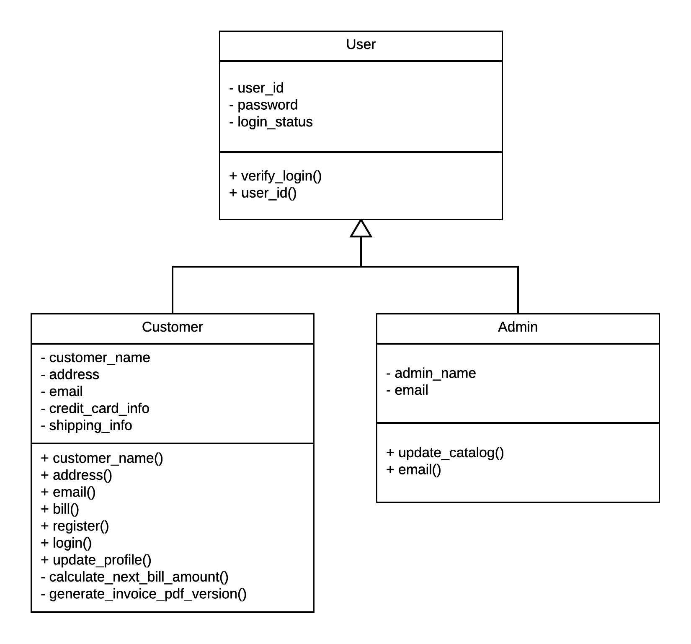
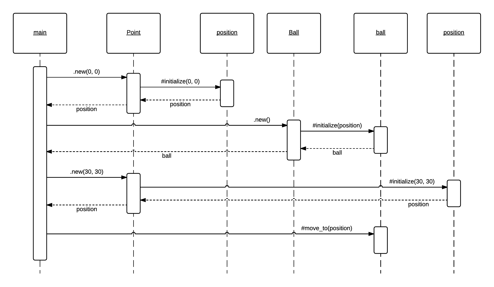

# Task B

## B.1. Please, convert this UML Class Diagram to a Ruby program with the correct class definitions?



<br/>

> *Note:* This program should only be the skeleton, not a really functional program. Just make sure that you transfer the properties that
you see on the class diagram correctly.

Answer: This is an indicative implementation

``` ruby
class User
  def initialize(user_id, password)
    @user_id = user_id
    @password = password
    @login_status = 'logged out'
  end

  def verify_login
  end

  attr_reader :user_id
end

class Customer < User
  attr_reader :customer_name, :address, :email

  def initialize(customer_name, address, email)
    @customer_name = customer_name
    @address = address
    @email = email
    @credit_card_info = ''
    @shipping_info = ''
  end

  def bill
  end

  def register
  end

  def login
  end

  def update_profile
  end

  private

  def calculate_next_bill_amount
  end

  def generate_invoice_pdf_version
  end
end

class Admin < User
  def initialize(admin_name, email)
    @admin_name = admin_name
    @email = email
  end

  def update_catalog
  end

  attr_reader :email
end
```

## B.2. Please, convert this UML Sequence Diagram to a Ruby program?



<br/>

> *Note:* This program should only be the skeleton, not a really functional program. Just make sure that you transfer the properties that
you see on the class diagram correctly.

Answer: This is an indicative implementation:

``` ruby
class Point
  def initialize(x, y)
    @x, @y = x, y
  end

  def to_s
    "#{@x}, #{@y}"
  end
end

class Ball
  def initialize(position)
    @position = position
  end

  def move_to(position)
    puts "I will move from position #{@position} to new position: #{position}"
    @position = position
  end
end

position = Point.new(0, 0)
ball = Ball.new(position)

position = Point.new(30, 30)
ball.move_to(position)
```