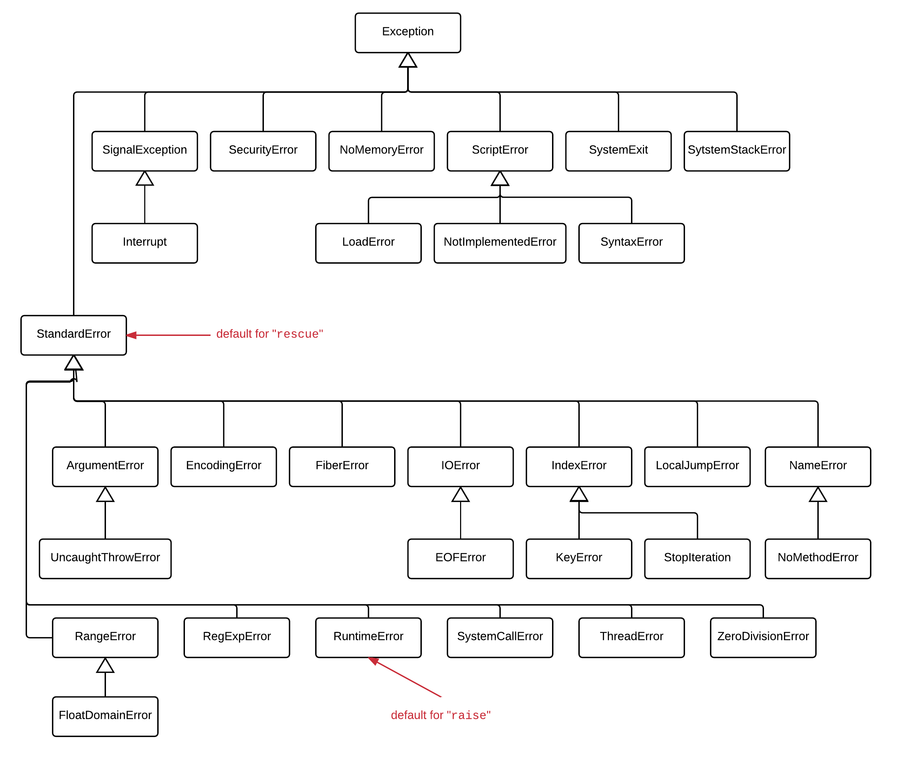
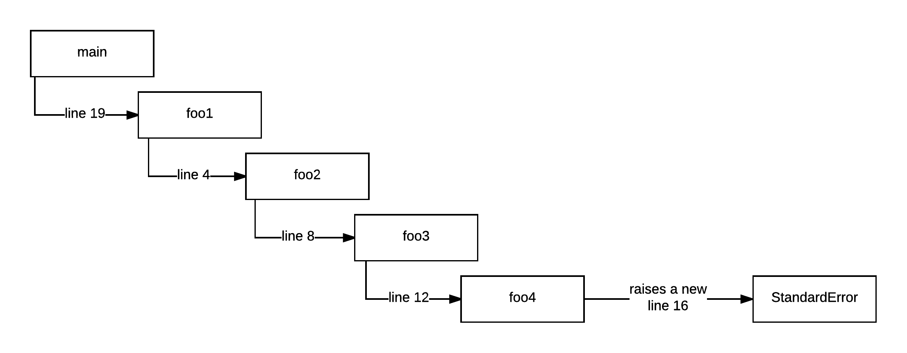
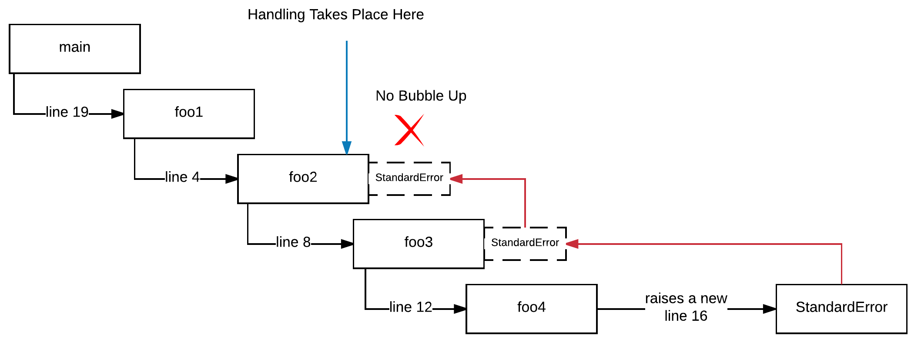
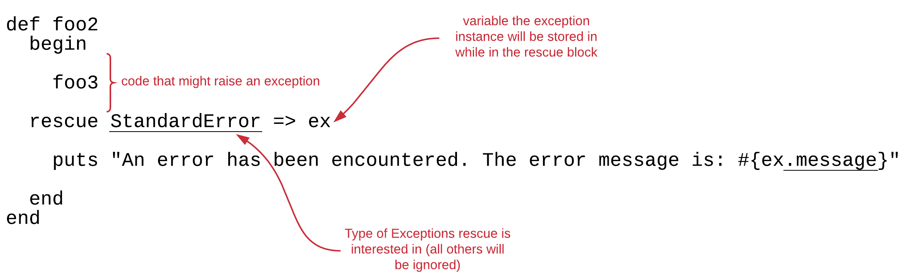
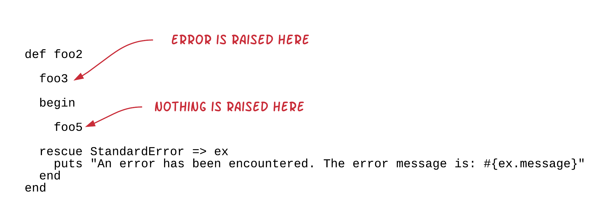
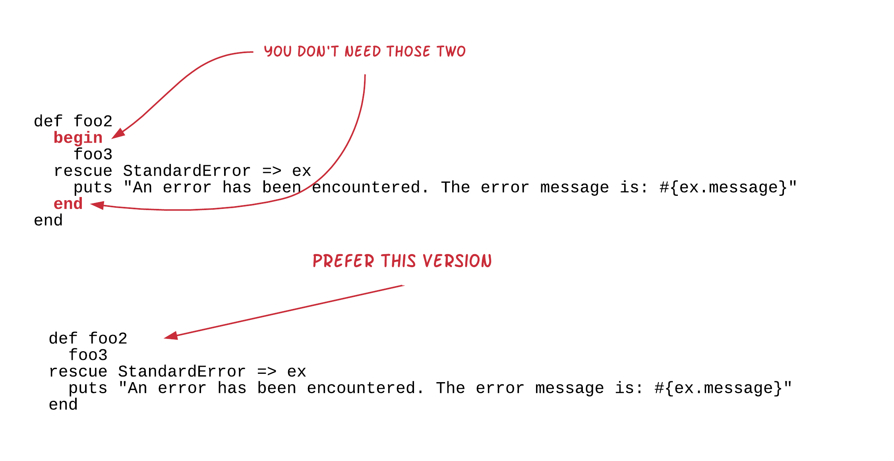
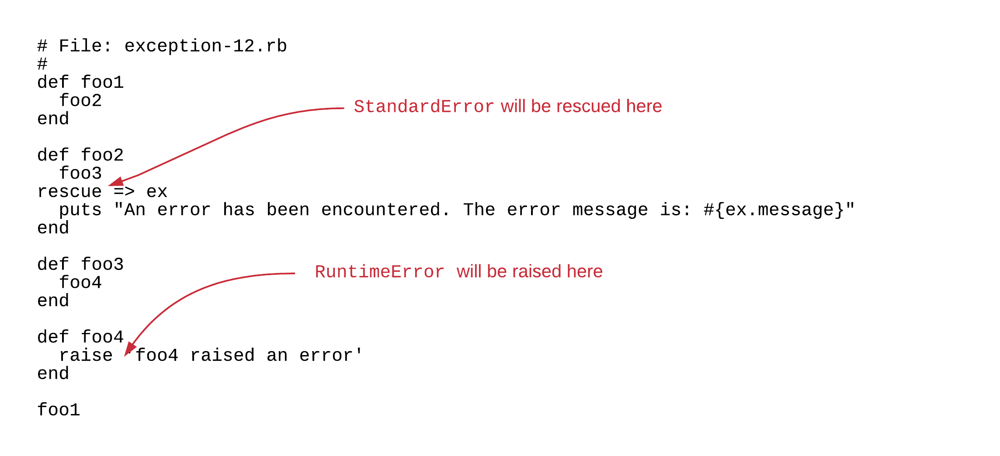

Exceptions are the official object oriented artefact to model error conditions in Ruby (and in many other OO programming languages).

## Exception Example

Let's see first an example (`exception-1.rb`):

``` ruby
 1. # File: exception-1.rb
 2. #
 3. def divide(a, b)
 4.   a / b
 5. end
 6. 
 7. def get_answer(question)
 8.   print "#{question}: "
 9.   gets.chomp
10. end
11. 
12. while true
13.   break if (answer = get_answer('Give me the dividend')) == 'stop'
14. 
15.   dividend = answer.to_i
16. 
17.   break if (answer = get_answer('Give me the divisor')) == 'stop'
18. 
19.   divisor = answer.to_i
20. 
21.   puts "Division #{dividend} / #{divisor} = #{divide(dividend, divisor)}"
22. end
23. 
24. puts "Bye!"
```

The above program works as a division calculator. It asks the user for the dividend, then asks for the
divisor and then returns back the result. This is done repeatedly until the user enters the word `stop` in
any of the questions asked.

This is an example run of the program:

``` bash
$ ruby exception-1.rb
Give me the dividend: 5
Give me the divisor: 2
Division 5 / 2 = 2
Give me the dividend: 25
Give me the divisor: 3
Division 25 / 3 = 8
Give me the dividend: stop
Bye!
$
```

However, look what happens if you try to divide by 0:

``` bash
$ ruby exception-1.rb
Give me the dividend: 5
Give me the divisor: 0
exception-1.rb:4:in `/': divided by 0 (ZeroDivisionError)
        from exception-1.rb:4:in `divide'
        from exception-1.rb:21:in `<main>'
$
```

The program ends abruptly, with an error being printed by the Ruby interpreter. It gives you information such as:

1. which line of code the error was raised from: `exception-1.rb:4`
2. which method was the current method when the error was raised: `in '/'`
3. a short descriptive message of the error: `divided by 0`
4. the class that corresponds to the error raised: `ZeroDivisionError`

## Exception Class Hierarchy

Exceptions are objects and, hence, each exception corresponds to an actual class. On the previous example,
the exception instantiated and then raised was of the class `ZeroDivisionError`.

All the exceptions need to be a sub-class of the `Exception` class. But not necessarily first child descendants. They
can be in a lower level of the `Exception` class hierarchy.

Ruby comes with a set of already defined exception classes, which are given here:



and [here](https://ruby-doc.org/core-2.3.3/Exception.html).

## Raising an Exception of an already defined class

Ruby has already defined exception classes as we saw above. It creates and raises them whenever Ruby interpreter considers that necessary.
But, your code can raise an exception on demand. Here is an example that does that (`exception-2.rb`):

``` ruby
 1. # File: exception-2.rb
 2. #
 3. def raise_if_not_integer(number)
 4.   unless number.is_a?(Integer)
 5.     argument_error_exception = ArgumentError.new("#{number} has to be an Integer but it is not.")
 6.     raise argument_error_exception
 7.   end
 8. end
 9. 
10. def add_integers(a, b)
11.   raise_if_not_integer(a)
12.   raise_if_not_integer(b)
13. 
14.   a + b
15. end
16. 
17. puts add_integers(5, 7.3)
```

If you run this program, you will get this:

``` bash
$ ruby exception-2.rb
exception-2.rb:6:in `raise_if_not_integer': 7.3 has to be an Integer but it is not. (ArgumentError)
        from exception-2.rb:12:in `add_integers'
        from exception-2.rb:17:in `<main>'
$
```
This is an informative message about the error that your program has raised:

1. It raises the error on line 6.
2. Inside the method `raise_if_not_integer`. 
3. The actual error is of class `ArgumentError`, and
4. The accompanying message is `7.3 has to be an Integer but it is not`.

The method `add_integers` is designed to add two integer numbers. Also, it is designed in such
a way that when the arguments given are not as expected, to raise an error.

The program raises an error from inside the method `raise_if_not_integer`. It is the `raise` 
method call that does the raise of the error. It takes as argument an instance of an Exception class.
The particular program uses the already defined class `ArgumentError`.

The instantiation allows the raising code to specify the message that will accompany the exception.

> *Hint:* Try calling the `add_integers` method wtih two integers. You will see that no error is raised.

## Don't have to save in variable

I guess that you understand that the exception does not have to be saved in a variable before raised. So, the next program `exception-3.rb`
is equivalent to the `exception-2.rb`:

``` ruby
 1. # File: exception-3.rb
 2. #
 3. def raise_if_not_integer(number)
 4.   unless number.is_a?(Integer)
 5.     raise ArgumentError.new("#{number} has to be an Integer but it is not.")
 6.   end
 7. end
 8. 
 9. def add_integers(a, b)
10.   raise_if_not_integer(a)
11.   raise_if_not_integer(b)
12. 
13.   a + b
14. end
15. 
16. puts add_integers(5, 7.3)
```
You can see that on line 5, we `raise` the instance created by `ArgumentError.new` without actually saving it into a local variable fist.

## Alternative technique to call `raise`

Before we dive even more into exceptions, let me give you one alternative technique that you can use when calling `raise`. Program
`exception-4.rb` is equivalent to `exception-3.rb`:

``` ruby
 1. # File: exception-4.rb
 2. #
 3. def raise_if_not_integer(number)
 4.   unless number.is_a?(Integer)
 5.     raise ArgumentError, "#{number} has to be an Integer but it is not."
 6.   end
 7. end
 8. 
 9. def add_integers(a, b)
10.   raise_if_not_integer(a)
11.   raise_if_not_integer(b)
12. 
13.   a + b
14. end
15. 
16. puts add_integers(5, 7.3)
```

You can see that we have replaced line 5. From 

``` ruby
raise ArgumentError.new("#{number} has to be an Integer but it is not.")
```

to

``` ruby
raise ArgumentError, "#{number} has to be an Integer but it is not."
```

In other words, instead of calling `raise` with 1 argument, the instance of the exception, we
are calling `raise` with 2 arguments, the exception class and the message.

If you run the above `exception-4.rb` program, you will get the same output like before.

## Errors/Exceptions Stack Trace

When a point of code raises an exception, then this exception bears information about the
call stack point at which the exception was raised.

But, first, let's make sure that we understand what the call stack is. Whenever we call a method, this
method creates a new level in the call stack. Whenever we return from a method, then that level
is deleted. Example: Program `exception-4.rb` initially has 1 level in the stack, the `main` object.
Then `main` object on line 16, calls method `add_integers(5, 7.3)`. This creates a new level in the
call stack, one for the `add_integers` call. So, the stack now is:

```
main
add_integers
```

Then, `add_integers` calls `raise_if_not_integer(a)` on line 10. This creates another level in the call stack
and the call stack now becomes:

```
main
add_integers
raise_if_not_integer
```

`raise_if_not_integer` calls the method `is_a?` on line 4. At that call, the call stack becomes

```
main
add_integers
raise_if_not_integer
is_a?
```

When the `is_a?` returns, the call stack returns back to being:

```
main
add_integers
raise_if_not_integer
```

and then `raise_if_not_integer` (assuming that it was called for `5`, i.e. for an integer) returns. That makes the call stack:

```
main
add_integers
```

And then `add_integers` goes to line 11, to call `raise_if_not_integer` again, for another number. That makes the call stack

```
main
add_integers
raise_if_not_integer
```

again.

And so on. It is like a breadcrumb. `main -> add_integers -> raise_if_not_integer -> is_a?` e.t.c.

This means that if an exception is raised while on a specific level of the stack, when this exception is 
printed out, it will display all the levels of the stack up to the level the exception was raised on. This is very useful
for debugging purposes, i.e. in order to troubleshoot and possibly fix a programming error or other kind of error.

Look at the exception information that is being printed for `exception-4.rb` program:

``` bash
exception-4.rb:5:in `raise_if_not_integer': 7.3 has to be an Integer but it is not. (ArgumentError)
        from exception-4.rb:11:in `add_integers'
        from exception-4.rb:16:in `<main>'
```
You can see the different levels of the stack being announced next to `in` words:

`in 'raise_if_not_integer'`

`in 'add_integers'`

`in '<main>'`

This is the stack picture at the moment the error was raised: `main -> add_integers -> raise_if_not_integer`. And for each
stack level we also see the file and the line number that the *next* stack level was introduced at. For example, you can see that
2nd stack level, i.e. the one for `add_integers` was introduced from parsing the file `exception-4.rb` at line 16:

``` ruby
puts add_integers(5, 7.3)
```

Whereas 3rd stack level was introduced from file `exception-4.rb` line 11:

``` ruby
raise_if_not_integer(b)
```

Let's see another extreme example just to make sure that we understand the stack trace information that we see when an exception
is raised. Example `exception-5.rb`:

``` ruby
 1. # File: exception-5.rb
 2. #
 3. def foo1
 4.   foo2
 5. end
 6. 
 7. def foo2
 8.   foo3
 9. end
10. 
11. def foo3
12.   foo4
13. end
14. 
15. def foo4
16.   raise StandardError, 'foo4 raised an error'
17. end
18. 
19. foo1
```

If you read the above code carefully, you will see that `main` calls `foo1` on line 19, which calls `foo2`, on line 4,
which calls `foo3` on line 8, which calls `foo4` on line 12. Finally, `foo4` raises an exception on line 16.



If you run this program, you will get this:

``` bash
$ ruby exception-5.rb
exception-5.rb:16:in `foo4': foo4 raised an error (StandardError)
        from exception-5.rb:12:in `foo3'
        from exception-5.rb:8:in `foo2'
        from exception-5.rb:4:in `foo1'
        from exception-5.rb:19:in `<main>'
$
```
which shows how the exception, when printed as an error, it bears the information of the stack levels that were introduced
when the exception was raised.

The call stack information printed, like above, in Ruby, it is called `backtrace`. In other languages it is called `stacktrace`.
Nevertheless, it is very useful for us to understand where the things have gone wrong.

## Exceptions Bubble Up the Call Stack

An exception instance, when raised, is treated in such a way so it becomes available to the stack levels of the call stack. 
But it is not available to all the stack levels at the same time. It travels from lowest to highest,
i.e the stack unwinds and on each stack level the exception instance is available for handling.


## Exception/Error Handling

Ruby does that, bubbles up the exception instance on each one of the stack levels, backwards, one-by-one, in order to give 
the code the chance to **handle the error**. If a stack level handles the error, then propagation to the higher stack levels
stops. Otherwise, the propagation continues.



In order for a stack level to handle an error, it needs to `rescue` it. Let's see how `foo2` can handle the error thrown from `foo4`.
See program `exception-6.rb`:

``` ruby
 1. # File: exception-6.rb
 2. #
 3. def foo1
 4.   foo2
 5. end
 6. 
 7. def foo2
 8.   begin
 9.     foo3
10.   rescue StandardError => ex
11.     puts "An error has been encountered. The error message is: #{ex.message}"
12.   end  
13. end
14. 
15. def foo3
16.   foo4
17. end
18. 
19. def foo4
20.   raise StandardError, 'foo4 raised an error'
21. end
22. 
23. foo1
```

If function `foo2` knows that the `foo3` code might raise an error (even if that error is not in fact raised by `foo3` itself
but by any other piece of code that `foo3` is calling) it can enclose the call to `foo3` inside a `begin ... rescue` block.
The `rescue` should be followed by the class that the code in `foo2` is interested to handle. On the example above, `foo2` is
interested to handle any exception of type `StandardError` (or any of its sub-classes). That's why we see `rescue StandardError`.
Then, we can optionally use a variable to save the exception instance while rescuing. This is done with the `=> ex`, where `ex`
can be any name we like. `ex` seems to be a good practice for the names of the variables of the exception instances.



Now, if we run this program, we will see this:

``` bash
$ ruby exception-6.rb
An error has been encountered. The error message is: foo4 raised an error
$
```

You can now see that what happens is that `foo2` takes responsibility to handle the error and print the message that you see. 
This stops the bubbling up and, by consequence, this never reaches the top level. Hence, the default behaviour of handling the
exception, which is to print the backtrace, is not applied. 

You can confirm that handling of the error at `foo2` does not propagate that to higher levels of stack by writing some
code to handle it at those higher levels. See program `exception-7.rb`:

``` ruby
 1. # File: exception-7.rb
 2. #
 3. def foo1
 4.   begin
 5.     foo2
 6.   rescue StandardError => ex
 7.     puts "foo1: An error has been encountered. The error message is: #{ex.message}"
 8.   end
 9. end
10. 
11. def foo2
12.   begin
13.     foo3
14.   rescue StandardError => ex
15.     puts "foo2: An error has been encountered. The error message is: #{ex.message}"
16.   end
17. end
18. 
19. def foo3
20.   foo4
21. end
22. 
23. def foo4
24.   raise StandardError, 'foo4 raised an error'
25. end
26. 
27. begin
28.   foo1
29. rescue StandardError => ex
30.   "main: An error has been encountered. The error message is: #{ex.message}"
31. end
```

If you read the code above, you will see that we have wrapped in `begin ... rescue` blocks both the
`main` call to `foo1` and the `foo1` call to `foo2`. So, we have error handling code at all the levels
above the first level that is handling the error, i.e. the level of method `foo2`. 

If you run this program, you will see this:

``` bash
$ ruby exception-7.rb
foo2: An error has been encountered. The error message is: foo4 raised an error
$
```

Only the `foo2` error handling code takes place. This is because the exception instance was rescued on level
of the `foo2` method and was not allowed to bubble further up.

## Handling and Raising

In some cases, we might want to both handle and raise. We only have to call `raise` from within the handling block,
i.e. from within the `rescue` block. See the program `exception-8.rb` below. You can see that `foo2` is rescuing and
then raising.

``` ruby
 1. # File: exception-7.rb
 2. #
 3. def foo1
 4.   begin
 5.     foo2
 6.   rescue StandardError => ex
 7.     puts "foo1: An error has been encountered. The error message is: #{ex.message}"
 8.   end
 9. end
10. 
11. def foo2
12.   begin
13.     foo3
14.   rescue StandardError => ex
15.     puts "foo2: An error has been encountered. The error message is: #{ex.message}"
16.     raise
17.   end
18. end
19. 
20. def foo3
21.   foo4
22. end
23. 
24. def foo4
25.   raise StandardError, 'foo4 raised an error'
26. end
27. 
28. begin
29.   foo1
30. rescue StandardError => ex
31.   "main: An error has been encountered. The error message is: #{ex.message}"
32. end
```

The only difference to program `exception-7.rb` is that we have added the line `raise`. This, inside the `rescue` block
will raise the exception instance rescued. You don't have to write `raise ex`. But if you did, wouldn't be an error.

If you run this program, you will see this:

``` bash
$ ruby exception-8.rb
foo2: An error has been encountered. The error message is: foo4 raised an error
foo1: An error has been encountered. The error message is: foo4 raised an error
$
```

Right! The error was first handled by `foo2` level, and then by `foo1` level. On `foo1` it was propagated only because
`foo2` allowed that (using `raise`).

## Rescuing Subclasses of Expected Class

Since an instance of any subclass is also considered to be of the same type with any superclass when we are expecting to
handle a particular instance class, the handling code will be triggered for any instance of any subclass of the expected class.

Let's make that clear with an example (`exception-9.rb`):

``` ruby
 1. # File: exception-9.rb
 2. #
 3. def foo1
 4.   foo2
 5. end
 6. 
 7. def foo2
 8.   begin
 9.     foo3
10.   rescue StandardError => ex
11.     puts "An error has been encountered. The error message is: #{ex.message}"
12.   end
13. end
14. 
15. def foo3
16.   foo4
17. end
18. 
19. def foo4
20.   raise RuntimeError, 'foo4 raised an error'
21. end
22. 
23. foo1
```

This program is almost the same like the `exception-6.rb`. The difference is on line 20, on which instead of raising a `StandardError`
exception, we raise a `RuntimeError` exception. However, we have not changed line 10 and it still rescues `StandardError` types of exceptions.

If you run this program, you will get this:

``` bash
$ ruby exception-9.rb
An error has been encountered. The error message is: foo4 raised an error
$
```

As you can see, the `rescue` block has been activated. Even if the `rescue` class was `StandardError`. This is because of this (you can run
this on your `irb` console):

``` ruby
2.2.3 :001 > RuntimeError.new.is_a?(StandardError)
 => true 
2.2.3 :002 > 
```
In other words, any `RuntimeError` instance is also of type `StandardError`. You can also double check the picture at the beginning of the
chapter with the Ruby Exception Class Hierarchy. There, it is depicted that `RuntimeError` is a subclass of `StandardError`.

## `rescue` scope

Note that `rescue` handles exceptions that are raised by the code that exists inside the corresponding `begin ... rescue` block. If the exception
is raised by code outside of this block, then that exception is not handled. Let's see the example `exception-10.rb`:

``` ruby
 1. # File: exception-10.rb
 2. #
 3. def foo1
 4.   foo2
 5. end
 6. 
 7. def foo2
 8.   foo3
 9.   begin
10.     foo5
11.   rescue StandardError => ex
12.     puts "An error has been encountered. The error message is: #{ex.message}"
13.   end
14. end
15. 
16. def foo3
17.   foo4
18. end
19. 
20. def foo4
21.   raise StandardError, 'foo4 raised an error'
22. end
23. 
24. def foo5
25.   puts "foo5 will not raise error"
26. end
27. 
28. foo1
```

Watch out what happens inside method `foo2`. It is now calling `foo3` outside of the `begin ... rescue` block. But `foo3` calls `foo4` which 
raises an exception. Will that be handled by `foo2` method? No, it will not. Because the `foo3` call is outside of any `begin ... rescue` that would
have handled this type of errors.

If you run the above program, you will confirm this:

``` bash
$ ruby exception-10.rb
exception-10.rb:21:in `foo4': foo4 raised an error (StandardError)
        from exception-10.rb:17:in `foo3'
        from exception-10.rb:8:in `foo2'
        from exception-10.rb:4:in `foo1'
        from exception-10.rb:28:in `<main>'
$
```

You can see that the `StandardError` error raised by `foo4` is not handled, and reaches top-level where Ruby is left with the only option
to exit the program and print the stack trace.



## Alternative To `begin ... rescue` In Current Block Of Code

If the whole current block of code might raise an error and we want to handle it with a `rescue` call, then we don't have
to use `begin ... rescue ... end` block. We can just use `rescue ...`, and the limits of the code at error risk is automatically
set to the limits of the code block.

For example `exception-11.rb`:

``` ruby
 1. # File: exception-11.rb
 2. #
 3. def foo1
 4.   foo2
 5. end
 6. 
 7. def foo2
 8.   foo3
 9. rescue StandardError => ex
10.   puts "An error has been encountered. The error message is: #{ex.message}"
11. end
12. 
13. def foo3
14.   foo4
15. end
16. 
17. def foo4
18.   raise RuntimeError, 'foo4 raised an error'
19. end
20. 
21. foo1
```

Have a look at the implementation of `foo2` method. We have omitted one `begin` and one `end` which were not necessary.
  


On that particular example, all the code that exists inside the method `foo2` is a code that we want to deal with a `rescue` handler. In that case,
we don't have to use `begin ... end`. The `rescue` is enough.

## Default `rescue` type.

The default exception type for `rescue` is `StandardError`, which means that you do not have to specify `StandardError` if this is the type
of error that you would like to handle.

So, this:

``` ruby
begin
  ...
rescue StandardError => ex
  ...
end
```  

is equivalent to this:

``` ruby
begin
  ...
rescue => ex
  ...
end
```  

## Default for `raise`

On the other hand, there is also a default type for the `raise` method call too. It is the `RuntimeError` type. This means that

``` ruby
raise RuntimeError, 'foo4 raised an error'
```

is equivalent to

``` ruby
raise 'foo4 raised an error'
```

Look at the program `exception-12.rb`. It is using the defaults, both for `rescue` and for `raise`:

``` ruby
 1. # File: exception-12.rb
 2. #
 3. def foo1
 4.   foo2
 5. end
 6. 
 7. def foo2
 8.   foo3
 9. rescue => ex
10.   puts "An error has been encountered. The error message is: #{ex.message}"
11. end
12. 
13. def foo3
14.   foo4
15. end
16. 
17. def foo4
18.   raise 'foo4 raised an error'
19. end
20. 
21. foo1
```



## Multiple `rescues`

Finally there are some cases on which we would like the handling to be different for different types of errors raised by a piece of code.
Let's see the following example `exception-13.rb`:

``` ruby
 1. # File: exception-13.rb
 2. #
 3. def foo1(a)
 4.   foo2(a)
 5. end
 6. 
 7. def foo2(a)
 8.   foo3(a)
 9. rescue RuntimeError => ex
10.   puts "An RuntimeError has been encountered. The error message is: #{ex.message}"
11. rescue RangeError => ex
12.   puts "A RangeError has been encountered. The error message is: #{ex.message}"
13. end
14. 
15. def foo3(a)
16.   foo4(a)
17. end
18. 
19. def foo4(a)
20.   if a >= 10
21.     raise 'foo4 raised an error because argument given is greater than 10'
22.   else
23.     raise RangeError, 'foo4 raised an error because argument given is less than 10'
24.   end
25. end
26. 
27. print 'Give an integer number: '
28. a = gets.to_i
29. 
30. foo1 a
```

This program has the `foo4` method raising an error, like before. But, this time, it raises different error depending on the
input argument. If the input argument is greater than `10`, it raises a `RuntimeError`. If the argument is less than `10`, it
raises a `RangeError` (see lines: 19 to 25).

On top of that, the `foo2` method, that decides to handle the errors, has two different `rescue` blocks. One to handle the
`RuntimeError` and another one to handle the `RangeError`. 

If you run this program and give the number `5` when asked, you will see this:

``` bash
$ ruby exception-13.rb
Give an integer number: 5
A RangeError has been encountered. The error message is: foo4 raised an error because argument given is less than 10
$
```

Whereas if you run this again and you give the number `12` instead, you will see this:

``` bash
Give an integer number: 12
An RuntimeError has been encountered. The error message is: foo4 raised an error because argument given is greater than 10
```

Both of those proving that `foo2` handles different error types differently.

## Multiple types on same `rescue`

On the other hand, you might want to handle similarly, errors of different types. See program `exception-14.rb`:

``` ruby
 1. # File: exception-14.rb
 2. #
 3. def foo1(a)
 4.   foo2(a)
 5. end
 6. 
 7. def foo2(a)
 8.   foo3(a)
 9. rescue RuntimeError, RangeError => ex
10.   puts "A RuntimeError or a RangeError has been encountered. The error message is: #{ex.message}"
11. end
12. 
13. def foo3(a)
14.   foo4(a)
15. end
16. 
17. def foo4(a)
18.   if a >= 10
19.     raise 'foo4 raised an error because argument given is greater than 10'
20.   else
21.     raise RangeError, 'foo4 raised an error because argument given is less than 10'
22.   end
23. end
24. 
25. print 'Give an integer number: '
26. a = gets.to_i
27. 
28. foo1 a
```

This program has changed how `foo2` handles the errors raised. It now uses one `rescue` block to handle two different
error types, `RuntimeError` and `RangeError`. See how the types are listed in a comma separated list before the ` => ex`.

If you run this program giving `5` when asked, it will print this:

``` bash
$ ruby exception-14.rb
Give an integer number: 5
A RuntimeError or a RangeError has been encountered. The error message is: foo4 raised an error because argument given is less than 10
$
```

whereas if you give `12`, it will print this:

``` bash
$ ruby exception-14.rb
Give an integer number: 12
A RuntimeError or a RangeError has been encountered. The error message is: foo4 raised an error because argument given is greater than 10
$
```

Both proving that `rescue RuntimeError, RangeError => ex` block handles both types of errors.

## Print the Backtrace

Until now, we have only used the method `#message` on an exception instance. We used it to print the message that the exception
bears with. There is another useful method which is frequently used. It is the method `#backtrace` which returns the backtrace
related to the exception. The backtrace returned is an Array with one item per stack level in the call stack. 

Let's see an example of that in program `exception-15.rb`:

``` ruby
 1. # File: exception-15.rb
 2. #
 3. def foo1
 4.   foo2
 5. end
 6. 
 7. def foo2
 8.   foo3
 9. rescue => ex
10.   puts "An error has been encountered. The error message is: #{ex.message}"
11.   puts "The backtrace is: "
12.   puts ex.backtrace
13. end
14. 
15. def foo3
16.   foo4
17. end
18. 
19. def foo4
20.   raise 'foo4 raised an error'
21. end
22. 
23. foo1
```

On the above program, you can now see that except from the message, we also print the backtrace attached to the
exception. If you run this program, you will see this:

``` bash
$ ruby exception-15.rb
An error has been encountered. The error message is: foo4 raised an error
The backtrace is: 
exception-15.rb:21:in `foo4'
exception-15.rb:17:in `foo3'
exception-15.rb:8:in `foo2'
exception-15.rb:4:in `foo1'
exception-15.rb:24:in `<main>'
$
```

Having access to the backtrace is quite useful in complex applications. For example, it is heavily used in Ruby on Rails applications
to log the backtrace into a log file.

## Custom Exception Classes

So far, we have used the exception classes that come with Ruby language. However, there are a lot of times that we want the error
class to be more representative of the actual application error that has occurred, i.e. more specific and not that general. On those cases,
we prefer to define custom exception classes.

Let's see the example `insurance-1.rb`:

``` ruby
 1. # File: insurance-1.rb
 2. #
 3. class PolicyAlreadyActive < StandardError
 4. end
 5. 
 6. class InsurancePolicy
 7.   def initialize(code)
 8.     @code = code
 9.     @state = 'pending-activation'
10.   end
11. 
12.   def activate
13.     raise PolicyAlreadyActive, "Policy with #{code} is already active!" if active?
14.     @state = 'active'
15.   end
16. 
17.   def to_s
18.     code
19.   end
20. 
21.   private
22. 
23.   def active?
24.     state == 'active'
25.   end
26. 
27.   attr_reader :code, :state
28. end
29. 
30. policy = InsurancePolicy.new('ABCD')
31. 
32. puts "Trying to activate Policy #{policy}..."
33. policy.activate
34. 
35. puts "Trying to activate Policy #{policy} again ..."
36. policy.activate
```

This little program is about creating an instance of the `InsurancePolicy` class and then calling the `#activate` method
two times consecutively on that instance. The class is designed in such a way so that if the code tries to activate the
same instance more than once, it will raise an error. The error chosen to be an instance of the class `PolicyAlreadyActive`.

The class `PolicyAlreadyActive` is a subclass of `StandardError` and does not have anything in particular other than making the
exception be a more application specific exception. 

Let's run the program:

``` bash
$ ruby insurance-1.rb
Trying to activate Policy ABCD...
Trying to activate Policy ABCD again ...
insurance-1.rb:13:in `activate': Policy with ABCD is already active! (PolicyAlreadyActive)
        from insurance-1.rb:36:in `<main>'
$
```

As you can see above, the first time the policy is activated without error, but the second try for activation it raised an exception
of type `PolicyAlreadyActive`. 

This is a very common practice in Ruby applications, i.e. to specialize the exceptions with more application specific classes. And, on those
cases, the custom application exception class is suggested to be derived from `StandardError` in order to make sure that it
can be rescued from the default `rescue` handler.

## Name Convention for Methods Raising Errors

There is a name convention for methods that might raise an error. That being their name ending in `!`. Let's see the insurance example again
using this convention (`insurance-2.rb`):

``` ruby
 1. # File: insurance-2.rb
 2. #
 3. class PolicyAlreadyActive < StandardError
 4. end
 5. 
 6. class InsurancePolicy
 7.   def initialize(code)
 8.     @code = code
 9.     @state = 'pending-activation'
10.   end
11. 
12.   def activate!
13.     raise PolicyAlreadyActive, "Policy with #{code} is already active!" if active?
14.     @state = 'active'
15.   end
16. 
17.   def to_s
18.     code
19.   end
20. 
21.   private
22. 
23.   def active?
24.     state == 'active'
25.   end
26. 
27.   attr_reader :code, :state
28. end
29. 
30. policy = InsurancePolicy.new('ABCD')
31. 
32. puts "Trying to activate Policy #{policy}..."
33. policy.activate!
34. 
35. puts "Trying to activate Policy #{policy} again ..."
36. policy.activate!
```

As you can see above, we have renamed method `#activate` to `#activate!`. Naming the methods that are designed to raise an exception using
a `!` suffix, is not a hard rule. Just something that it is quite common in Ruby community.
