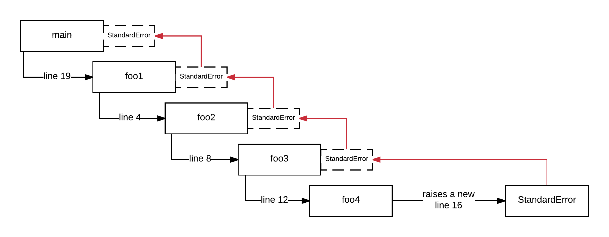

Things can go wrong and Ruby gives you a tool, which is called *Exception*, in order to deal with that in a controlled manner. This chapter
is about standard and custom exceptions. How you can raise an error and how you can handle an error. It is very important to make sure you 
understand these tools. You will continuously use them and encounter them, while developing your Ruby applications. When you master how
to raise and handle exceptions, you will be developing applications that will respect the user and that will also be easier to debug and
maintain.
