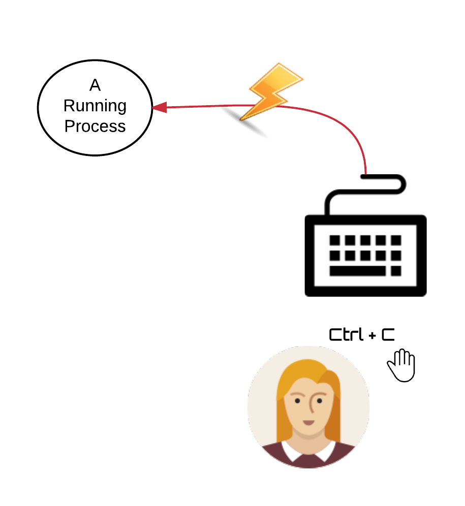
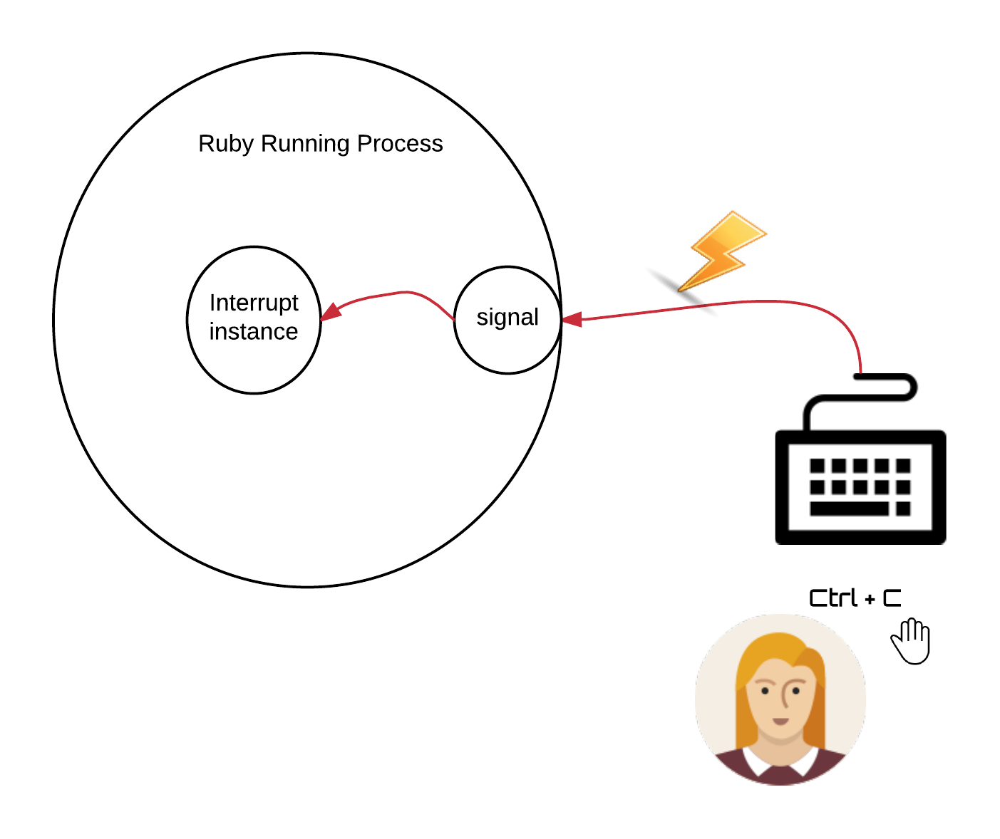
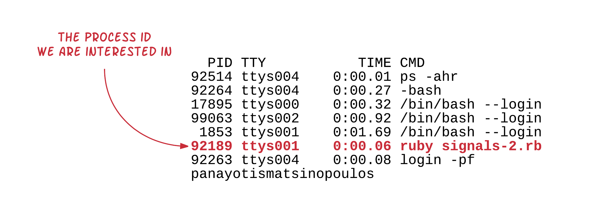
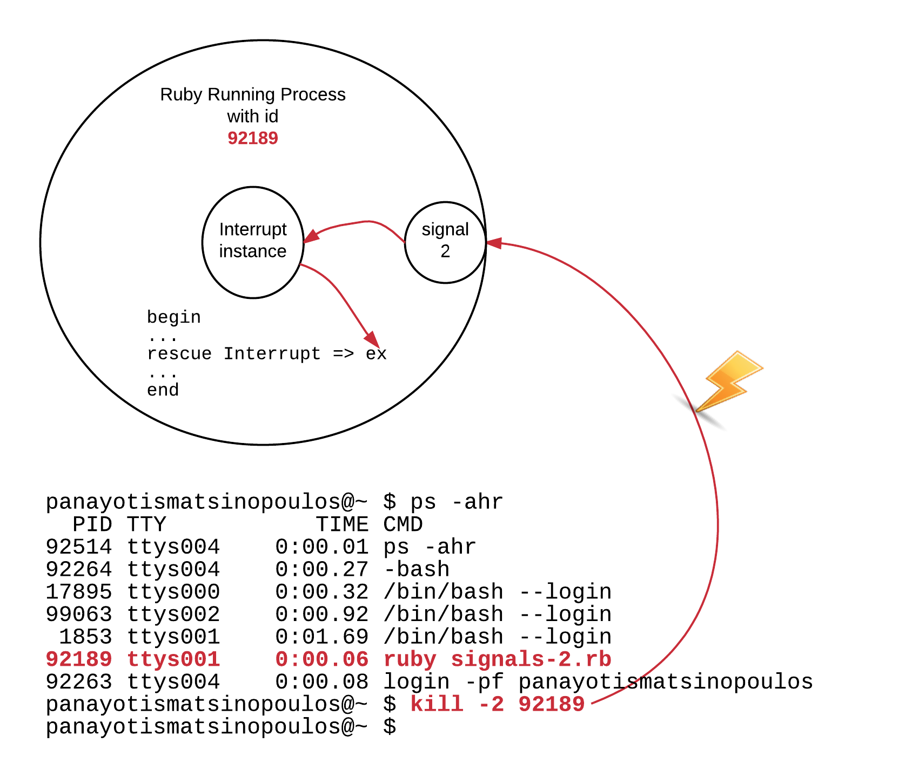

Software signals are interrupts that the operating system is sending to a process. Depending on the signal type,
category (some times called *name* too), the process responds accordingly. 

## Sending a Signal - Example

Let's see an example that would demonstrate the delivery of a signal to a process.

``` ruby
 1. # Files: signals-1.rb
 2. #
 3. SECONDS_TO_SLEEP = 3
 4. 
 5. i = 1
 6. while true
 7.   puts "#{i}...sleeping for #{SECONDS_TO_SLEEP} seconds (press Ctrl+C to terminate me)"
 8.   sleep SECONDS_TO_SLEEP
 9.   i += 1
10. end
```

Write the above ruby program and save it as `signals-1.rb`. Then run the program.

``` bash
$ ruby signals-1.rb
1...sleeping for 3 seconds (press Ctrl+C to terminate me)
2...sleeping for 3 seconds (press Ctrl+C to terminate me)
3...sleeping for 3 seconds (press Ctrl+C to terminate me)
4...sleeping for 3 seconds (press Ctrl+C to terminate me)
5...sleeping for 3 seconds (press Ctrl+C to terminate me)
6...sleeping for 3 seconds (press Ctrl+C to terminate me)
...

```

This program never terminates. It is composed of an endless loop (`while true ... end`). On each iteration it prints a message and 
then sleeps for some seconds. Then it goes back from the beginning. 

As the program suggests, please, use your keyboard to key in the key combination `Ctrl+C`. This will send a signal to the running Ruby process.

And the program will terminate:

``` bash
1...sleeping for 3 seconds (press Ctrl+C to terminate me)
2...sleeping for 3 seconds (press Ctrl+C to terminate me)
3...sleeping for 3 seconds (press Ctrl+C to terminate me)
4...sleeping for 3 seconds (press Ctrl+C to terminate me)
5...sleeping for 3 seconds (press Ctrl+C to terminate me)
6...sleeping for 3 seconds (press Ctrl+C to terminate me)
^Csignals-1.rb:8:in `sleep': Interrupt
        from signals-1.rb:8:in `<main>'
```

You can see the `^C` symbol printed when you clicked the `Ctrl+C` combination. Then an error has been printed out, an exception. It is an `Interrupt`
exception instance being printed. 

## Pressing `Ctrl-C` Is Treated as a Signal

Pressing `Ctrl-C` on the holding terminal of a process sends a signal to that process. This is an operating system behaviour. Not Ruby behaviour.
This behaviour takes place for any process. 



## How Ruby Treats Incoming Signals?

But, Ruby, has a special way of handling signals coming from the outside world. It receives them from the operating system and converts them to instances of 
the exception class `SignalException` or its sub-class `Interrupt`.

However, **this is not true for all the signal types**, something that will be explained later.

> *Information:* You can visit the previous chapter to see where exactly `SignalException` and `Interrupt` classes are positioned in the exception class hierarchy:
>
> ``` ruby
> Interrupt < SignalException < Exception
> ```



The <kbd>Ctrl + C</kbd> keys combination issued by User on keyboard is being converted to an `Interrupt` instance as we depict above, but this is not the case for all the signals.
We will expand on that later on.

## Signals can be handled

The fact that Ruby converts some of the incoming signals to instance of exceptions means that we can `rescue` the exception and handle the incoming signal. 
The example `signals-2.rb` is handling the key press of the <kbd>Ctrl + C</kbd> by the User.

``` ruby
 1. # Files: signals-2.rb
 2. #
 3. SECONDS_TO_SLEEP = 3
 4. begin
 5.   i = 1
 6.   while true 
 7.     puts "#{i}...sleeping for #{SECONDS_TO_SLEEP} seconds (press Ctrl+C to terminate me)" 
 8.     sleep SECONDS_TO_SLEEP
 9.     i += 1
10.   end
11. 
12. rescue Interrupt => ex
13.   puts "User has clicked on Ctrl + C. Signal Details: #{ex.inspect}"
14. end
15. 
```
If you run this program and, while it is repeating its loop logic, you click on <kbd>Ctrl + C</kbd>, then you will see the message `User has clicked on Ctrl + C...` 
printed.

``` bash
$ ruby signals-2.rb
1...sleeping for 3 seconds (press Ctrl+C to terminate me)
2...sleeping for 3 seconds (press Ctrl+C to terminate me)
3...sleeping for 3 seconds (press Ctrl+C to terminate me)
^CUser has clicked on Ctrl + C. Signal Details: Interrupt
$
```

which means that Ruby converted the signal to an `Interrupt` exception instance, which was then rescued by our code on line 12.

However, this is not the only way you can handle an incoming signal. There ia another approach that will be given later on, after we learn how we 
can send a signal and what other types of signals exist.

## Send Signal to a Process

Linux allows you to send a signal to a process using the command `kill`. For example, if you want to send to a process the signal that
corresponds to the <kbd>Ctrl + C</kbd> key press, then you have to invoke the command `kill -2 <process_id>` on your command line.
The `2` is the standard number that corresponds to this signal. The `<process_id>`, which is a unique number assigned to each running process,
can be found in various ways. One such way is to run the command `ps -ahr` and locate the line that corresponds to the process you are interested in
and take the process id from the column with heading `PID`. 

> *Note for Debian/Linux Users* `ps -ahr` works on Mac OS X. If you are running Linux this might be a little bit different. For example, on Debian,
one good alternative is `ps -u`. Read the manual of the `ps` command on your operating system version: `man ps` and see which version is best for you.

Let's see an example. 

(1) Start your program `signals-2.rb` in one of your terminals:

``` bash
$ ruby signals-2.rb
1...sleeping for 3 seconds (press Ctrl+C to terminate me)
2...sleeping for 3 seconds (press Ctrl+C to terminate me)
3...sleeping for 3 seconds (press Ctrl+C to terminate me)
...
```

(2) While it is running, open another terminal and issue the command `ps -ahr`:

``` bash
$ ps -ahr
  PID TTY           TIME CMD
92514 ttys004    0:00.01 ps -ahr
92264 ttys004    0:00.27 -bash
17895 ttys000    0:00.32 /bin/bash --login
99063 ttys002    0:00.92 /bin/bash --login
 1853 ttys001    0:01.69 /bin/bash --login
92189 ttys001    0:00.06 ruby signals-2.rb
92263 ttys004    0:00.08 login -pf panayotismatsinopoulos
$
```

As you can see above, there is one line that is related to your running Ruby program.



Note the value for the `PID`, which is the process id. It will not be the same like the one on the picture above. It will be different on your case.

(3) On the same terminal on which you issued the previous command, issue now the command `kill -2 <process_id>`, where `<process_id>` is the number for your running
process. While you do that, watch what happens at the terminal where you have your program running

``` bash
$ kill -2 
$
```
On the terminal your program was running in, you will see the message `User has clicked on Ctrl + C. Signal Details: Interrupt` and the program would have 
have been finished.

This proves that the `kill -2 <process_id>` command did sent the same signal like the one that is sent when <kbd>Ctrl + C</kbd> is pressed by the user of your program.




The following video shows what we did earlier with the running process and the `kill` command:

<div id="media-title-video-send-signal-no-2-to-running-process">Sending Signal Number 2 to a Running Ruby Process</div>
<a href="https://player.vimeo.com/video/194965623"></a>
         
## List of signals

Having said that, it is about time to tell that the list of signals is a little bit longer. And, not only that, you cannot handle all the signals
with the technique of rescuing the exception `SignalException`. 

The set of signals can be retrieved with the command `kill -l`. Let's try that:

``` bash
$ kill -l
 1) SIGHUP       2) SIGINT       3) SIGQUIT      4) SIGILL
 5) SIGTRAP      6) SIGABRT      7) SIGEMT       8) SIGFPE
 9) SIGKILL     10) SIGBUS      11) SIGSEGV     12) SIGSYS
13) SIGPIPE     14) SIGALRM     15) SIGTERM     16) SIGURG
17) SIGSTOP     18) SIGTSTP     19) SIGCONT     20) SIGCHLD
21) SIGTTIN     22) SIGTTOU     23) SIGIO       24) SIGXCPU
25) SIGXFSZ     26) SIGVTALRM   27) SIGPROF     28) SIGWINCH
29) SIGINFO     30) SIGUSR1     31) SIGUSR2
$
```

You can see that this is a list of 31 signals, from 1 up to 31. Each one has a name, which can be used to reference to that signal, as an alternative to its
number. This means that the command `kill -2 9837` that would sent the signal number 2 to the process with id `9837`, is equivalent to
`kill -SIGINT 9837`, since signal number 2 has the name `SIGINT`. Note also that all the signal names have the prefix `SIG`. That makes things even simpler.
You can use the name with the prefix `SIG`. Hence, the command `kill -INT 9837` works equally well like the `kill -SIGINT 9837`.

## Handling Signals with Traps

The following Ruby program has been designed in such a way so that it could rescue all signal exception instances (`signals-3.rb`). 

``` ruby
 1. # File: signals-3.rb
 2. #
 3. while true
 4.   begin
 5.     sleep 1
 6.   rescue SignalException => ex
 7.     puts "New Signal Exception Rescued"
 8.     puts ex.inspect
 9.   end
10. end
```

It has an endless loop that, on each iteration, sleeps for 1 second and then goes back at the beginning of the loop. Since condition is `true`,
it repeats the loop forever. If, while in the repetition, a signal exception is rescued, then it prints the instance details and then goes back
at the beginning of the loop.

But, does it really rescue all the 31 signals? Let's try. We will start the program and send the signal number 6, i.e. the signal `SIGABRT`.
What will happen?

(1) Start Ruby program on a terminal

``` bash
$ ruby signals-3.rb
```

You will not see anything printed, but the program will keep running. It will not return the terminal control back to you.  

(2) Open another terminal and locate the process id of your running program. 

``` bash
$ ps -ahr
  PID TTY           TIME CMD
94122 ttys003    0:00.05 login -pf panayotismatsinopoulos
96361 ttys001    0:00.04 ruby signals-3.rb
94123 ttys003    0:00.57 -bash
96410 ttys003    0:00.01 ps -ahr
17895 ttys000    0:00.32 /bin/bash --login
99063 ttys002    0:00.92 /bin/bash --login
 1853 ttys001    0:01.87 /bin/bash --login
$
```

On my case, this is `96361`. 

(3) Then execute the following command on this new terminal:

``` bash
$ kill -ABRT 96361
```
by replacing the `96361` with your process id.

You will see the following at the terminal of the running program:

``` bash
Abort trap: 6
$
```
and the running process will have been terminated.

This means that the process responded to the signal but it was not the `rescue` block that handled it. If it were the 
rescue block, then we would have seen the message `New Signal Exception Rescued`, but we didn't.

The signal has been actually handled by the operating system default handler for this particular signal. The operating system
aborted the process. Now, the process is not live anymore.

(3) Run the command `ps -ahr` again on the terminal. You will not see the process live anymore:

``` bash
$ ps -ahr
  PID TTY           TIME CMD
96499 ttys003    0:00.01 ps -ahr
94123 ttys003    0:00.59 -bash
94122 ttys003    0:00.05 login -pf panayotismatsinopoulos
17895 ttys000    0:00.32 /bin/bash --login
99063 ttys002    0:00.92 /bin/bash --login
 1853 ttys001    0:01.88 /bin/bash --login
$
```

What we have learned so far is that:

1. Signals are being sent to running processes in various ways. One such way is to use the keyboard and send a signal like `SIGINT` using <kbd>Ctrl + C</kbd>.
Another way is the `kill -<sig_no_or_sig_name> <process_id>` command.
2. Some of the signals can be handled with the `rescue SignalException` block. But not all of them.

Then, what is the approach to handle signals that are cannot be rescued with `SignalException`? 

The technique is called *signal traps*. We call the method `.trap` on the class `Signal` and we specify the signal name to handle and the code block to execute.
 
Let's see the program `signals-4.rb`. This is the same program like `signals-3.rb` but it traps signal `SIGABRT` and does something custom with that.
 
``` ruby
 1. # File: signals-4.rb
 2. #
 3. info_message = 'I am running'
 4. 
 5. Signal.trap('ABRT') do
 6.   puts 'ABRT signaled trapped! But I will not ABORT even if that signal wants me!'
 7.   info_message = 'I am still running'
 8. end
 9. 
10. while true
11.   puts info_message
12.   sleep 1
13. end
```

If you start this program, you will see the message `I am running` being printed periodically, every 1 second.

``` bash
$ ruby signals-4.rb
I am running
I am running
...
```

Go to another terminal and find its process id, with `ps -ahr`:

``` bash
$ ps -ahr
  PID TTY           TIME CMD
96803 ttys003    0:00.00 ps -ahr
94123 ttys003    0:00.61 -bash
17895 ttys000    0:00.32 /bin/bash --login
99063 ttys002    0:00.92 /bin/bash --login
 1853 ttys001    0:01.88 /bin/bash --login
94122 ttys003    0:00.05 login -pf panayotismatsinopoulos
96800 ttys001    0:00.04 ruby signals-4.rb
```

On my case, this is `96800`. 

Then, send the signal `SIGABRT`. You will see that the process is not aborted like `signals-3.rb` program did. It is handled by the code
inside the trap block, lines 5 till 8 of the `signals-4.rb` program.

``` bash
$ kill -ABRT 96800
```

This is what you will see on the running process terminal:

``` bash
...
I am running
I am running
ABRT signaled trapped! But I will not ABORT even if that signal wants me!
I am still running
I am still running
...
```

The trapping logic changes the message printed out in order to show that it has gracefully handled the signal and continued running.

Finally, terminate the running process by pressing <kbd>Ctrl + C</kbd> on the running process terminal and you will see the process
being terminated, since the `SIGINT` signal is not handled and the default operating system terminates the process.

## Handling Summary

Handling signals in your Ruby code is done with two techniques. 

1. By `rescuing` the `SignalException` instances (but not all signals can be handled using this technique)
2. By `trapping` specific signals with `Signal.trap` method call. You can read more about the `trap` properties [here](https://ruby-doc.org/core-2.2.0/Signal.html).
Although it allows you to attach only one trap per signal type, otherwise, it has some defaults that might be useful. Again, some of the
signals cannot be trapped too.

