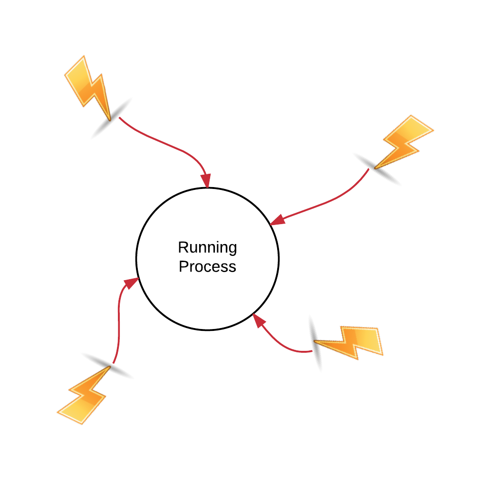

Software signals can interrupt the normal flow of execution of a running process. In this chapter we learn how signals are being transferred into a Ruby program
and how your code can be written in such a way so that it can handle them and respond gracefully and with control. Hence, incomign signals will not be
a surprise to your program, neither a reason for your program to terminate abruptly (if you don't want to).
