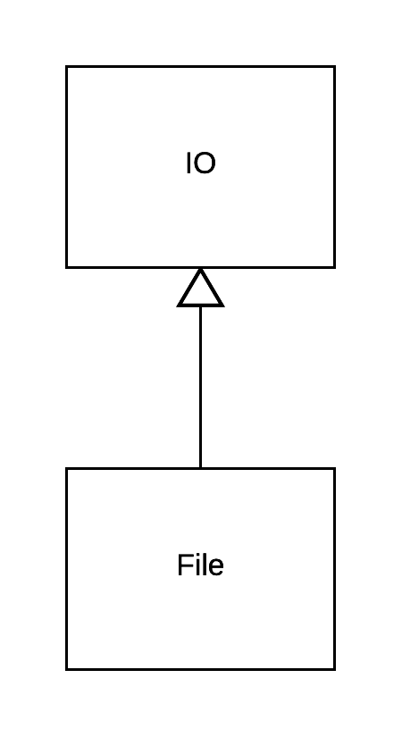

File, and its family, is the tool that we use to write data onto our storage medium and read data back from it. 
The process of reading data from a file is called *input* whereas the process of writing data into a file is called *output*.

Files are divided into two big categories:

1. Text Files
2. Binary Files

For example, [this is a text file](./hello-world.txt).
Whereas [this is a binary file](./images/sample-binary-file.png).

Text files can be read and edited by a simple text editor. On the other hand, a binary file needs a special application that has the capabilities to read it and allows the
user to update it. Text file contents can be easily printed / inspected with simple commands like `cat` (or `type` on Windows), whereas binary file ones cannot.

Files are very important because they allow data to be persistently stored. Otherwise, we wouldn't have been able to switch off our computer. Data in RAM are get lost
without electric power to keep them alive.

## `File` class

We will mostly work with the `File` class, which offers a series of class and instance methods. Some of those are inherited from the `IO` class which is the
`File` superclass.



Nevertheless, please, learn how to read the manual pages for these classes: [File](https://ruby-doc.org/core-2.2.0/File.html) and [IO](https://ruby-doc.org/core-2.2.0/IO.html). It will be proven useful in the future.

Let's start with examples of various use cases for files. This is how we are going to learn what Ruby offers us as programming tools around file content manipulation.

## Storing a String into a File

We will start with examples on text files. Hence, having a string stored into a memory variable, how can we persistently save it into a text file?
See the program `storing-string-to-a-file-1.rb`:

``` ruby
 1. # File: storing-string-to-a-file-1.rb
 2. #
 3. def get_answer
 4.   answer = gets.chomp
 5.   if answer.length.zero?
 6.     puts 'You need to give an answer to the question!'
 7.     exit 1
 8.   end
 9.   answer
10. end
11. 
12. print 'Give me the string you want stored into a file: '
13. string_to_store = get_answer
14. 
15. print 'Give me the file name you want string to be stored into: '
16. file_name = get_answer
17. 
18. File.write(file_name, string_to_store)
```

This program is very simple. It asks the user two questions. First, user needs to give the string that is going to be stored into a file.
Then user needs to give the filename the string is going to be stored into.

Here is an example run of this program:

``` bash
$ ruby storing-string-to-a-file-1.rb
Give me the string you want stored into a file: I love Ruby
Give me the file name you want string to be stored into: foo.txt 
$
```

On the above run user gave the string `I love Ruby` and the filename `foo.txt`. Then program terminated. If you listed the contents of the present working directory
you would get something like this:

``` bash
$ ls -ltr
-rw-r--r--  1 panayotismatsinopoulos  staff  404 Dec 14 18:40 storing-string-to-a-file-1.rb
-rw-r--r--  1 panayotismatsinopoulos  staff   11 Dec 14 18:40 foo.txt
$
```

which proves that a new file, with name `foo.txt` has been created. Printing the contents of the file would reveal the string `I love Ruby`:

``` bash
$ cat foo.txt
I love Ruby$
```

The Ruby command that took the string and saved it into a file was `File.write` command on line 18. Note that this command has many variations, but
the one used here will create a new text file and throw the string into it. Then it will *close* the file. *Close* the file means that it will
release the operating system resources reserved while this command was in action. Note that other commands that deal with IO, might require you to
close the file explicitly, but this one does that for you automatically. Generally, if you use file commands that do not close the files and you 
do not close them explicitly, you may end to the situation in which you would have run out of file resources. So, watch for those commands and
make sure that if you use them, then you close the file explicitly. (See at the end of this chapter on how you can close a file explicitly).

## Ending String with a New Line Character

The caveat of the previous program was that it allowed the user to enter only 1 line into the file. Also, that line was not terminated by a new
line character. Missing new line character at the end of the line had as result the prompt for the next command to appear exactly after the last
character of the string:

``` bash
I love Ruby$
```

Another improved version would have inserted a new line character at the end of the string when calling the `File.write` command. See `storing-string-to-a-file-2.rb`.

``` ruby
 1. # File: storing-string-to-a-file-2.rb
 2. #
 3. def get_answer
 4.   answer = gets.chomp
 5.   if answer.length.zero?
 6.     puts 'You need to give an answer to the question!'
 7.     exit 1
 8.   end
 9.   answer
10. end
11. 
12. print 'Give me the string you want stored into a file: '
13. string_to_store = get_answer
14. 
15. print 'Give me the file name you want string to be stored into: '
16. file_name = get_answer
17. 
18. File.write(file_name, "#{string_to_store}\n")
```

This new version has only one difference to the previous one. It is line 18. You can see that the string given by the user
is interpolated and a new line character is appended (`\n`).

If you run this program like that:

``` bash
$ ruby storing-string-to-a-file-2.rb
Give me the string you want stored into a file: I love Ruby
Give me the file name you want string to be stored into: foo.txt
$
```
and then print the contents of the file `foo.txt`, you will get this:

``` bash
$ cat foo.txt
I love Ruby
$
```

which is much better. The extra new line has forced the command line prompt to appear below `I love Ruby` string.

## Writing Multiple Lines to a File

Writing one line to a text file was good. But writing multiple lines is even better. Let's enhance our program to be able to
write multiple lines to a file. See program `storing-multiple-lines-to-a-file-1.rb`

``` ruby
 1. # File: storing-multiple-lines-to-a-file-1.rb
 2. #
 3. print 'Give me the filename you want to create multiple lines for: '
 4. filename = gets.chomp
 5. if filename.length.zero?
 6.   puts 'You have to give the filename!'
 7.   exit 1
 8. end
 9. 
10. while true
11.   print 'Give me the line to store in the file (terminate file creation by giving an empty input): '
12.   string_to_store = gets.chomp
13.   break if string_to_store.length.zero?
14.   File.write(filename, "#{string_to_store}\n")
15. end
```

This program is repeatedly asking the user for a new string to add to the file. If the user gives an empty string, the program terminates.

Let's see an example run of this program:

``` bash
$ ruby storing-multiple-lines-to-a-file-1.rb
Give me the filename you want to create multiple lines for: foo-m.txt
Give me the line to store in the file (terminate file creation by giving an empty input): I love Ruby
Give me the line to store in the file (terminate file creation by giving an empty input): And Ruby on Rails
Give me the line to store in the file (terminate file creation by giving an empty input):
$
```

We have asked the program to create the file `foo-m.txt` and insert two lines inside it. 1) `I love Ruby` and 2) `And Ruby on Rails`. Let's see what we have
done. Print the contents of the files with `cat foo-m.txt`

``` bash
$ cat foo-m.txt
And Ruby on Rails
$
```

Ooooops! As you can see, final file content contains only the last line that we have given as input.

This is because the command `File.write`, if it finds the file being already there, it truncates its content before inserting the content
given as argument. Hence, the first call `File.write(...)` for the `I love Ruby` content, created the file `foo-m.txt` and put the `I love Ruby` string in.
But the second call to `File.write(...)` for the `And Ruby on Rails` content, didn't create the file, because the file was already there, but it
actually truncated its content before inserting the new one.

So, how can we insert a new line after the previous one, without truncating the file? There is a version of `File.write(...)` that allows us to do that.
It takes as third argument the `offset` in the file that the new content is going to be appended to. Let's see this small improvement here, in the file
`storing-multiple-lines-to-a-file-2.rb`:

``` ruby
 1. # File: storing-multiple-lines-to-a-file-2.rb
 2. #
 3. print 'Give me the filename you want to create multiple lines for: '
 4. filename = gets.chomp
 5. if filename.length.zero?
 6.   puts 'You have to give the filename!'
 7.   exit 1
 8. end
 9.
10. offset = 0
11. string_to_store = ''
12.
13. while true
14.   print 'Give me the line to store in the file (terminate file creation by giving an empty input): '
15.   offset += string_to_store.length
16.
17.   string_to_store = gets.chomp
18.   break if string_to_store.length.zero?
19.
20.   string_to_store = "#{string_to_store}\n"
21.   File.write(filename, string_to_store, offset)
22. end
```

The main difference to the previous version is the call to `File.write(...)` on line 21. As you can see, we are providing the third argument `offset`.
But how is this calculated. Well, it is simple. Initially it is `0`, which means that the first call to `File.write` will write the `I love Ruby` at the
beginning of the file. The second time, when we give the string `And Ruby on Rails`, offset is increased by the length of the previous string we stored
into the file, i.e. the string `I love Ruby` + the new line character. See how the increment of `offset` takes place on line 15, before we actually read
the next input from the user.

Let's run this program:

``` bash
$ ruby storing-multiple-lines-to-a-file-2.rb
Give me the filename you want to create multiple lines for: foo-m2.txt
Give me the line to store in the file (terminate file creation by giving an empty input): I love Ruby
Give me the line to store in the file (terminate file creation by giving an empty input): And Ruby on Rails
Give me the line to store in the file (terminate file creation by giving an empty input):
$
```

We saved the lines into the file with name `foo-m2.txt`. Let's see its content:

``` bash
$ cat foo-m2.txt
I love Ruby
And Ruby on Rails
$
```

Perfect! Believe it or not, we have just created a primitive text file editor &#9786;

## Writing Multiple Lines to a File - Version 2

Staying on the same subject, there is another alternative to appending new lines to a file that does not require you to keep track of the offset.
Let's see the program `storing-multiple-lines-to-a-file-3.rb`:

``` ruby
 1. # File: storing-multiple-lines-to-a-file-3.rb
 2. #
 3. print 'Give me the filename you want to create multiple lines for: '
 4. filename = gets.chomp
 5. if filename.length.zero?
 6.   puts 'You have to give the filename!'
 7.   exit 1
 8. end
 9. 
10. while true
11.   print 'Give me the line to store in the file (terminate file creation by giving an empty input): '
12.   string_to_store = gets.chomp
13.   break if string_to_store.length.zero?
14. 
15.   string_to_store = "#{string_to_store}\n"
16.   File.write(filename, string_to_store, mode: "a")
17. end
```

This version is 99% similar to the original `storing-multiple-lines-to-a-file-1.rb`. The only difference is on line 16, where
we use the `File.write` method. There is a third argument, which, this time, is a hash, not an integer. The hash has the key `:mode` and the
value `"a"`. This means that whenever we write we actually open the destination file for append. Hence, any existing content will not get lost.

Let's run this program:

``` bash
$ ruby storing-multiple-lines-to-a-file-3.rb
Give me the filename you want to create multiple lines for: foo-m3.txt
Give me the line to store in the file (terminate file creation by giving an empty input): I love Ruby
Give me the line to store in the file (terminate file creation by giving an empty input): And Ruby on Rails
Give me the line to store in the file (terminate file creation by giving an empty input): 
$
```

When you print the contents of the file `foo-m3.txt`, you will see that the two lines exist in the file as expected:

``` bash
$ cat foo-m3.txt
I love Ruby
And Ruby on Rails
$
```

Nice! This is even better than the previous version with keeping track of the offset. And this is a good chance for us to 
let you know about the different *modes* that you can use to open a file:

1. "r": Opens the file for reading. The read pointer is positioned at the beginning of the file.
2. "r+": Opens the file for reading and for writing. The pointer is positioned at the beginning of the file.
3. "w": Opens and truncates an existing file to 0 length, or creates a new file. The pointer is positioned at the beginning of the file.
This is the default behaviour of the `File.write`, by the way.
4. "w+": Opens a file for both writing and reading. If the file exists, it is truncated to zero length. Otherwise, it is created. The pointer is
positioned at the beginning of the file.
5. "a": Opens a file for appending, i.e. for writing at the end of the file. The file is created if it does not exist. The pointer is positioned
at the beginning of the file. 
6. "a+": Opens a file for reading and for appending. If the file does not exist it is created. The pointer for reading is positioned at the beginning
of the file. The pointer for writing it is always at the end of the file ready for appending content.

## Writing Multiple Lines to a File - Version 3

There is a small problem with the previous version of our program. Every time we want to write a new line 1) we open the file then 2) we write the
line and then 3) we close the file. This is all done on every `File.write` call. Opening and closing a file multiple times without reason is not a good 
practice. On the previous small and short living program is not a problem. But, it may be a problem on other cases in which you write multiple 
times on a file.

Generally, you would like to have the file opened at the beginning of the processing and closed at the end, when there is no more output to send to
it. Let's see this technique here (`storing-multiple-lines-to-a-file-4.rb`):

``` ruby
 1. # File: storing-multiple-lines-to-a-file-4.rb
 2. #
 3. print 'Give me the filename you want to create multiple lines for: '
 4. filename = gets.chomp
 5. if filename.length.zero?
 6.   puts 'You have to give the filename!'
 7.   exit 1
 8. end
 9. 
10. File.open(filename, mode: "a") do |file|
11.   while true
12.     print 'Give me the line to store in the file (terminate file creation by giving an empty input): '
13.     string_to_store = gets.chomp
14.     break if string_to_store.length.zero?
15. 
16.     string_to_store = "#{string_to_store}\n"
17.     file.write(string_to_store)
18.   end
19. end
```

Here we are not calling the class method `.write` on the class `File`. Instead we are calling the instance method `#write` on an instance of a `File`.

On line 10, we open the file using the class method `.open`. We pass the filename and the mode. Like we did for `.write`. Then we also give the
block of processing that takes as argument the `File` instance that we can use, in the block, in order to write to the actual opened file.

Ruby makes sure that after the block terminates, the file is automatically closed and the resource is returned back to the operating system.
However, while we are in the block, taking input from user and writing output to the file, the file is opened. And we don't have to open it for
every line that we want to write to it.

## Need to Flush

While working with the same program, `storing-multiple-lines-to-a-file-4.rb`, we are going to watch the actual file at the operating system level
and see how it is being created and filled in with content. Please, follow the next steps:

(1) Start the program, give the filename `flush-1.txt` as output file name, but **don't give the first line to output**. Just wait there.

``` bash
$ ruby storing-multiple-lines-to-a-file-4.rb
Give me the filename you want to create multiple lines for: flush-1.txt
Give me the line to store in the file (terminate file creation by giving an empty input):
```

(2) Open another terminal and make sure that you are on the working directory where you have started your program. Give an `ls -ltr` command to get the
list of files in this working folder.

``` bash
$ ls -ltr
...
-rw-r--r--  1 panayotismatsinopoulos  staff    0 Dec 15 18:52 flush-1.txt
$
```

The bottom entry should be something like the above. It is the new file entry, `flush-1.txt`. You can see this entry there because we have already
asked for the opening of the file (`File.open(...)`). 

But, as you can see, the file size is `0`. This can be explained too. We have not given any line to the program in order to send it to the file. Let's do that now.

(3) Give to the program the line `I love Ruby`. **Don't give a second line**. Just let the program wait for it.

``` bash
.......................................................................
......................................................................................... I love Ruby
Give me the line to store in the file (terminate file creation by giving an empty input): 
```

Then go back to the other terminal and issue an `ls -ltr` command again. What you should see is the following:

``` bash
$ ls -ltr
...
-rw-r--r--  1 panayotismatsinopoulos  staff    0 Dec 15 18:52 flush-1.txt
$
```

Ooops! What is going on here? The file is still empty. `0` bytes size. Why is that? This is because Ruby, by default, buffers the output data into its
memory and will flush all of them together with one big flush command whenever its internal buffer is filled in, or whenever the file is closed, or
whenever the Ruby program itself asks Ruby to flush its buffer contents. Ruby believes that buffering the contents before actually send them to disk is
improving performance, because flushing data to disk is an expensive procedure. However, there is the risk that we loose our data if our process is killed
before data have been flushed to disk. Before we see how we can tune this process, let's add the second line (`And Ruby on Rails`). 

(4) Give one more line, but **don't give the third empty line to terminate the program**.

``` bash
.......................................................................
...........................................................................................................
......................................................................................... And Ruby on Rails
Give me the line to store in the file (terminate file creation by giving an empty input): 
```

Having given the second line, Ruby output buffer is still not flushed. This can be verified by another `ls -ltr` command on the other terminal:

``` bash
$ ls -ltr
...
-rw-r--r--  1 panayotismatsinopoulos  staff    0 Dec 15 18:52 flush-1.txt
$
```

(5) Let's now send the signal `KILL` to the running process to abruptly kill our running program. But, first, let's find its process id. Issue the following command
on the terminal (not the one your program is running on):

``` bash
$ ps -ahr
  PID TTY           TIME CMD
19259 ttys002    0:00.47 -bash
27549 ttys000    0:00.04 ruby storing-multiple-lines-to-a-file-4.rb
22061 ttys003    0:00.25 /bin/bash --login
27745 ttys002    0:00.01 ps -ahr
$
```
On our case, the process id is `27549`. Your process id will be something different. Let's send the kill signal that will terminate the program abruptly and 
prematurely:

``` bash
$ kill -9 27549
$
```

What you should now see on the terminal is the following:

``` bash
Give me the filename you want to create multiple lines for: flush-1.txt
Give me the line to store in the file (terminate file creation by giving an empty input): I love Ruby
Give me the line to store in the file (terminate file creation by giving an empty input): Killed: 9
```

which verifies that the running program has been killed.

What has happened to the two lines that the user has given and expected them to be inside its file? Let's give another `ls -ltr` command:

``` bash
$ ls -ltr
...
-rw-r--r--  1 panayotismatsinopoulos  staff    0 Dec 15 18:52 flush-1.txt
$
```

Unfortunately, the lines have been lost. The file is empty.

How can we remedy this? We need to make our program a little bit more robust. See new program `storing-multiple-lines-to-a-file-5.rb`:

``` ruby
 1. # File: storing-multiple-lines-to-a-file-5.rb
 2. #
 3. print 'Give me the filename you want to create multiple lines for: '
 4. filename = gets.chomp
 5. if filename.length.zero?
 6.   puts 'You have to give the filename!'
 7.   exit 1
 8. end
 9. 
10. File.open(filename, mode: "a") do |file|
11.   while true
12.     print 'Give me the line to store in the file (terminate file creation by giving an empty input): '
13.     string_to_store = gets.chomp
14.     break if string_to_store.length.zero?
15. 
16.     string_to_store = "#{string_to_store}\n"
17.     file.write(string_to_store)
18.     file.flush
19.   end
20. end
```

This is almost similar to the previous version. There is only one improvement. On line 18 we have added a call to the `#flush` command that
flushes all output buffer contents to the operating system (which is then responsible to do the actual write to the file). This will make the
contents of the file being updated after each call to `file.write()` on line 17 (and not only after the buffer is full or the file is closed).

Let's take the same steps that we did earlier to verify that the content is flushed after each string input given by the user:

(1) Start the program and give the first line. Let the program wait after the first line is given. **Don't give the second line**:

``` bash
$ ruby storing-multiple-lines-to-a-file-5.rb
Give me the filename you want to create multiple lines for: flush-2.txt
Give me the line to store in the file (terminate file creation by giving an empty input): I love Ruby
Give me the line to store in the file (terminate file creation by giving an empty input): 
```

(2) Open another terminal and make sure that you are on the same directory your program is running from. Run the `ls -ltr` command:

``` bash
...
-rw-r--r--  1 panayotismatsinopoulos  staff   12 Dec 15 19:35 flush-2.txt
```

As you can see, the file `flush-2.txt`, is **not** empty. You can also print its content and you will see that it has the line `I love Ruby` inside:

``` bash
$ cat flush-2.txt
I love Ruby
$
```

Even if the file is still open, its contents are now being filled in after every `#write`, thanks to the `#flush` call. 

(3) Give one more line. `And Ruby on Rails` and wait again.

(4) Print the content of the `flush-2.txt` file on the other terminal:

``` bash
$ cat flush-2.txt
I love Ruby
And Ruby on Rails
$
```

The second line has been appended to the file. Nice!

(5) Now find the process id of your running program and kill it by sending the `KILL` signal.

``` bash
$ ps -ahr
  PID TTY           TIME CMD
19259 ttys002    0:00.64 -bash
28448 ttys000    0:00.04 ruby storing-multiple-lines-to-a-file-5.rb
22061 ttys003    0:00.25 /bin/bash --login
28498 ttys002    0:00.01 ps -ahr
$ kill -9 28448
$
```

You can see the output on the terminal where your program was running:

``` bash
Give me the filename you want to create multiple lines for: flush-2.txt
Give me the line to store in the file (terminate file creation by giving an empty input): I love Ruby
Give me the line to store in the file (terminate file creation by giving an empty input): And Ruby on Rails
Give me the line to store in the file (terminate file creation by giving an empty input): Killed: 9
$
```

which proves that you program has been killed.

(6) Print the contents of the file `flush-2.txt`:

``` bash
$ cat flush-2.txt
I love Ruby
And Ruby on Rails
$
```

The file, still contains the two lines that the user has typed in.

Perfect! We have made our program, our primitive editor, a little bit more robust.

## `#puts`

Let's do one more improvement to our previous program. This has to do with the fact that we had
to add the `"\n"` character before sending the string to the file. We can avoid that by using the `#puts` method instead. This
adds the new line character automatically.

Look at the version `storing-multiple-lines-to-a-file-6.rb`:

``` ruby
 1. # File: storing-multiple-lines-to-a-file-6.rb
 2. #
 3. print 'Give me the filename you want to create multiple lines for: '
 4. filename = gets.chomp
 5. if filename.length.zero?
 6.   puts 'You have to give the filename!'
 7.   exit 1 
 8. end
 9. 
10. File.open(filename, mode: "a") do |file|
11.   while true
12.     print 'Give me the line to store in the file (terminate file creation by giving an empty input): '
13.     string_to_store = gets.chomp
14.     break if string_to_store.length.zero?
15. 
16.     file.puts(string_to_store)
17.     file.flush
18.   end
19. end
```

As you can see, we are now using `file.puts` method call. If you run the program it will create the file with the
lines one below the other, having a new line character at the end.

## Reading from a Text File

We have seen how we can write content to a text file. Let's see how we can read content from a text file. The following program
reads the lines of a text file, one-by-one, and prints them on the standard output. So, basically, it works like the `cat` command.

``` ruby
1. # File: my-cat.rb
2. #
3. File.open('mario.txt', 'r') do |file|
4.   while true
5.     line_read = file.gets
6.     break if line_read.nil?
7.     puts line_read
8.   end
9. end
```

The above program opens the file `mario.txt` which exists in the same directory like the program itself. It opens it for reading. Then
it iterates over each one of its lines using the `file.gets` method call. Note that when there is no other line to be read, the `file.gets`
returns back a `nil` value. That is why, we break the loop on line 6, if the `line_read` is `nil`. 

You can try with the following `mario.txt` file:

``` text
Nintendo shares have tumbled after investors gave the thumbs down to its new Super Mario app.

The Japanese technology giant saw $2bn (£1.6bn) wiped off its market value as shares fell by 5%
in Tokyo, after Super Mario Run was made available on the iPhone in 151 countries.

It later recovered slightly to close 4% lower.

Super Mario's release is the latest foray by Nintendo into the mobile app market after the Pokemon
GO craze earlier this year.

Early signs for the Mario game were positive as it topped download rankings in Britain, Japan, Germany
and Australia.

```

The call `ruby my-cat.rb` will print the contents of `mario.txt` file.

``` bash
$ ruby my-cat.rb
Nintendo shares have tumbled after investors gave the thumbs down to its new Super Mario app.

The Japanese technology giant saw $2bn (£1.6bn) wiped off its market value as shares fell by 5%
in Tokyo, after Super Mario Run was made available on the iPhone in 151 countries.

It later recovered slightly to close 4% lower.

Super Mario's release is the latest foray by Nintendo into the mobile app market after the Pokemon
GO craze earlier this year.

Early signs for the Mario game were positive as it topped download rankings in Britain, Japan, Germany
and Australia.
$
```

## CSV

Let's proceed now to a very popular type of text files, the CSVs, i.e. the Comma Separated Values text files. These
are files that organize data into rows and columns. Each row is a record with values. The values of a record are
being separated using `,`. Each value corresponds to an attribute of the record. Such files are usually generated as
export files from spreadsheets or databases. Or they are being created so that they can be imported to spreadsheets or databases.

Let's see an example. Suppose that we have the file `customers.csv` as follows: 

> *Hint:* Create this file as a text file, using your favourite text editor

``` text
First Name,Last Name
John,Smith
Peter,Papas
Mary,Foo
Paul,Beach

```

The following program builds an in-memory array of the customers using the CSV functionality included in standard Ruby library (`csv-customers-1.rb`):

``` ruby
 1. # File: csv-customers-1.rb
 2. #
 3. require 'csv'
 4. 
 5. customers = []
 6. 
 7. CSV.open('customers-1.csv', headers: true) do |csv|
 8.   while true
 9.     record = csv.readline
10.     break if record.nil?
11.     customers << record.to_h
12.   end
13. end
14. 
15. puts "Customers:\n#{customers.join("\n")}"
```

We open the text file with `CSV.open` method. Similar to `File.open`. And we then do the work inside a block that takes as argument the csv handle.
The block is composed of a loop. It will read the lines of the file one by one using the `#readline` method offered by the csv handle. If the `#readline`
returns `nil`, the loop will terminate. Otherwise, the result of the read, stored in `record`, is turned to `Hash` with the call to `#to_h`, and then
the hash is pushed to the array `customers`.

If you run the above program, you will get this:

``` ruby
$ ruby csv-customers-1.rb
Customers:
{"First Name"=>"John", "Last Name"=>"Smith"}
{"First Name"=>"Peter", "Last Name"=>"Papas"}
{"First Name"=>"Mary", "Last Name"=>"Foo"}
{"First Name"=>"Paul", "Last Name"=>"Beach"}
$
```

The CSV was very helpful utility here.

By giving the option `headers: true` (line 7), CSV understands that the first line of our csv file holds the headers of the columns of our CSV table.
Hence, when we, later on, turn the line read into a hash (line 11), CSV knows which keys to use to convert the line to a Hash. In other words, CSV knows that
the line `John,Smith` will be converted to `{"First Name"=>"John", "Last Name"=>"Smith"}`.
 
Otherwise, there is nothing special to this code above. We could have equally written the processing of the file with the `File` commands that we have
already learned, but CSV helps us quite a lot here.

Let's now see another, a little bit more complicated customers file. This new file below contains names and addresses. The tricky point 
here is that addresses include commas `,` themselves. This means that there needs to be a way to tell CSV parser which commas are
actually part of the payload, of the values of the record, rather than value delimiters.

Here is the proper customers content that would cater for commas inside the values (`customers-2.csv`):

``` text
First Name,Last Name,Address,Phone
John,Smith,"795 E DRAGRAM, TUCSON AZ 85705, USA",(541) 754-3010
Peter,Papas,"Schulstrasse 4, 32547 Bad Oyenhausen, Germany",232-321-2
Mary,Foo,"AGIA SOFIA 5, 19002, KOROPI, GREECE",378-3902-1
Paul,Beach,"5TH AVENUE 121, NEW YORK, USA",379-948-22

```

As you can see, the addresses, which include commas as part of their values, they enclose their values in between double quotes. Hence, CSV
knows how to pick up the values without getting confused by the commas inside them.

Let's write the program `csv-customers-2.rb` that would process this file above:

``` ruby
 1. # File: csv-customers-2.rb
 2. #
 3. require 'csv'
 4. 
 5. customers = []
 6. 
 7. CSV.open('customers-2.csv', headers: true) do |csv|
 8.   while true
 9.     record = csv.readline
10.     break if record.nil?
11.     customers << record.to_h
12.   end
13. end
14. 
15. puts "Customers:\n#{customers.join("\n")}"
```

This program does not actually differ from `csv-customers-1.rb`. The only difference is that it opens the file `customers-2.csv` instead of the
file `customers-1.csv`. 

If you run this program, you will get this:

``` bash
$ ruby csv-customers-2.rb
Customers:
{"First Name"=>"John", "Last Name"=>"Smith", "Address"=>"795 E DRAGRAM, TUCSON AZ 85705, USA", "Phone"=>"(541) 754-3010"}
{"First Name"=>"Peter", "Last Name"=>"Papas", "Address"=>"Schulstrasse 4, 32547 Bad Oyenhausen, Germany", "Phone"=>"232-321-2"}
{"First Name"=>"Mary", "Last Name"=>"Foo", "Address"=>"AGIA SOFIA 5, 19002, KOROPI, GREECE", "Phone"=>"378-3902-1"}
{"First Name"=>"Paul", "Last Name"=>"Beach", "Address"=>"5TH AVENUE 121, NEW YORK, USA", "Phone"=>"379-948-22"}
$
```

Perfect! As you can see, all the data have been parsed without any errors.

## Writing to a CSV file

We have seen how we can read from a CSV file. But CSV utility can be used to create CSV files too. Let's see program `create-csv-1.rb`
which asks the user to give the names of the customers and saves them into a CSV file.

``` ruby
 1. # File: create-csv-1.rb
 2. #
 3. require 'csv'
 4. 
 5. CSV.open('customers-3.csv', 'w') do |csv|
 6.   csv << ['First Name', 'Last Name']
 7. 
 8.   while true
 9.     print 'Give me first name and last name of the customer. Terminate by giving an empty input: '
10.     answer = gets.chomp
11.     first_name, last_name = answer.split(' ').map(&:strip)
12. 
13.     break if first_name.nil? || last_name.nil? || first_name.empty? || last_name.empty?
14. 
15.     csv << [first_name, last_name]
16.   end
17. end
```

The only new thing to you here, should be the fact that when we want to write to a CSV file, we push an array into the csv handle.
Like we do on line 6, when we want to actually write the first line of our csv file, the line with the headers of the columns. 
Or like we do on line 15, when we write the actual record to the file.

If you run this program, like below, it will generate the file `customers-3.csv`:

``` bash
$ ruby create-csv-1.rb
Give me first name and last name of the customer separated using comma character. Terminate by giving an empty input: John Smith
Give me first name and last name of the customer separated using comma character. Terminate by giving an empty input: Maria Foo
Give me first name and last name of the customer separated using comma character. Terminate by giving an empty input: George Papas
Give me first name and last name of the customer separated using comma character. Terminate by giving an empty input: 
$
```

and the `customers-3.csv` being generated:

``` text
First Name,Last Name
John,Smith
Maria,Foo
George,Papas

```

Ooooh! And don't forget. You can still call `csv.flush` after the `csv << [first_name, last_name]` in order to make sure that contents
are being flushed to disk.

Before we close this short section on CSVs, would like to let you know that CSV library has lots of capabilities and it would be good
if you could spend some time reading its documentation [here](https://ruby-doc.org/stdlib-2.0.0/libdoc/csv/rdoc/CSV.html).

## Logger

Logging is the ability that a language offers to a program to record information, usually to a text file. The log files are usually named
with the suffix, the filename extension, `.log`. 

Let's see the logger in action.

``` ruby
 1. # File: Logger-1.rb
 2. #
 3. require 'logger'
 4. 
 5. logger = Logger.new('division.log')
 6. 
 7. while true
 8.   print 'Give me the dividend (enter nothing to terminate): '
 9.   dividend = gets.chomp
10.   break if dividend.empty?
11. 
12.   dividend = dividend.to_i
13.   logger.info "Dividend given: #{dividend}"
14. 
15.   print 'Give me the divisor (enter nothing to terminate: '
16.   divisor = gets.chomp
17.   break if divisor.empty?
18. 
19.   divisor = divisor.to_i
20.   logger.info "Divisor given: #{divisor}"
21. 
22.   begin
23.     puts "Division of #{dividend} by #{divisor} results to: #{dividend / divisor}"
24.   rescue => ex
25.     error_message = "You didn't give correct numbers: error message: #{ex.message}"
26.     puts error_message
27.     logger.error error_message
28.   end
29. end
```

1. The above program creates a `Logger` instance on line 5: `logger = Logger.new('division.log')`. It's very simple. You only have
to give the filename the logs are going to be kept into. The convention here is that this file ends with `.log` extension. 
2. Then, the program asks the user to give a dividend and a divisor. Each one given, it is then logged into the log file with 
the method call `logger.info ...`. This means that the line recorded into the log file will have the tag `INFO`. This is useful,
if one reads the logs or filters them by tag. Later on, we will talk more about these specific tags.
3. Then, the program tries to execute the division of the dividend by divisor. If an error occurs, then it rescues the exception
and 1st prints the error message on screen/standard output and, 2nd, writes one more line into the log file but tagged with the
tag `ERROR`.

Let's see this program in action. Start it and run it like below:

``` bash
$ ruby logger-1.rb
Give me the dividend (enter nothing to terminate): 100
Give me the divisor (enter nothing to terminate: 20
Division of 100 by 20 results to: 5
Give me the dividend (enter nothing to terminate): 40
Give me the divisor (enter nothing to terminate: 0
You didn't give correct numbers: error message: divided by 0
Give me the dividend (enter nothing to terminate): 40
Give me the divisor (enter nothing to terminate: 4
Division of 40 by 4 results to: 10
Give me the dividend (enter nothing to terminate): 
$
```

The above run would create a new file into your current folder. The name of the file would be `division.log` and its contents will be like those below:

``` bash
$ cat division.log
# Logfile created on 2016-12-17 10:19:47 +0000 by logger.rb/47272
I, [2016-12-17T10:19:49.949544 #40783]  INFO -- : Dividend given: 100
I, [2016-12-17T10:19:51.893528 #40783]  INFO -- : Divisor given: 20
I, [2016-12-17T10:19:58.641400 #40783]  INFO -- : Dividend given: 40
I, [2016-12-17T10:20:01.305655 #40783]  INFO -- : Divisor given: 0
E, [2016-12-17T10:20:01.305822 #40783] ERROR -- : You didn't give correct numbers: error message: divided by 0
I, [2016-12-17T10:20:07.929265 #40783]  INFO -- : Dividend given: 40
I, [2016-12-17T10:20:09.241162 #40783]  INFO -- : Divisor given: 4
$
```

Perfect! You can now see how a log file looks like. It has a standard format. Each line starts with the tag first letter. So, the `INFO` tags
generate lines that start with `I`, whereas the `ERROR` tags generate lines that start with `E`. However, you can still see, the whole tag name
inside the line later on on the right. Also, you can see the timestamp the line has been logged into the file. On the far right, you can see
the actual message that you have logged from your Ruby program.

## Log Levels

Tags actually refer to log levels. There are the follow log levels:

1. UNKNOWN/ANY
2. FATAL
3. ERROR
4. WARN
5. INFO
6. DEBUG

The most important level is level 1, whereas the least important level is the level 6. When we instantiate a Logger, its
default logging level is `DEBUG`. This means that all messages are being logged.

Let's try that. The following program `logger-2.rb` logs one message per logging level into the file `logging-levels.log`.

``` ruby
 1. # File: logger-2.rb
 2. #
 3. require 'logger'
 4. 
 5. logger = Logger.new('logging-levels.log')
 6. logger.unknown('logging with unknown tag')
 7. logger.fatal('logging with fatal tag')
 8. logger.error('logging with error tag')
 9. logger.warn('logging with warn tag')
10. logger.info('logging with info tag')
11. logger.debug('logging with debug tag')
```

If you run this program:

``` bash
$ ruby logger-2.rb
$
```

You will see a file `logging-levels.log` to be created with the following contents:

``` bash
$ cat logging-levels.log
# Logfile created on 2016-12-17 10:32:30 +0000 by logger.rb/47272
A, [2016-12-17T10:32:30.535963 #41002]   ANY -- : logging with unknown tag
F, [2016-12-17T10:32:30.536000 #41002] FATAL -- : logging with fatal tag
E, [2016-12-17T10:32:30.536014 #41002] ERROR -- : logging with error tag
W, [2016-12-17T10:32:30.536026 #41002]  WARN -- : logging with warn tag
I, [2016-12-17T10:32:30.536036 #41002]  INFO -- : logging with info tag
D, [2016-12-17T10:32:30.536047 #41002] DEBUG -- : logging with debug tag
$
```

which proves that messages of all levels have been logged.

However, we can increase the logging level importance, from the default 6, to a higher number. For example 5, `INFO`. In that case
only messages with tag `INFO` or of higher importance (`WARN`, `ERROR`, `FATAL` or `UNKNOWN`) will be logged. 
Or, in other words, any `logger.debug...` call wouldn't have any content added to the log file.
 
Let's try that. We will set the logging level to `INFO` and we will try to log with all available tags (`logger-3.rb`):
 
``` ruby
 1. # File: logger-3.rb
 2. #
 3. require 'logger'
 4. 
 5. logger = Logger.new('logging-levels-set-to-info.log')
 6. logger.level = Logger::INFO
 7. 
 8. logger.unknown('logging with unknown tag')
 9. logger.fatal('logging with fatal tag')
10. logger.error('logging with error tag')
11. logger.warn('logging with warn tag')
12. logger.info('logging with info tag')
13. logger.debug('logging with debug tag')
```
The above program creates a logger to log into the file `logging-levels-set-to-info.log`. Then, before starting to log any lines,
it sets the logging level to `INFO` using the statement `logger.level = Logger::INFO` on line 6. 

If you run the above as:

``` bash
$ ruby logger-3.rb
$
```

and then check the contents of the file `logging-levels-set-to-info.log` you will see this:

``` bash
$ cat logging-levels-set-to-info.log
# Logfile created on 2016-12-17 10:37:34 +0000 by logger.rb/47272
A, [2016-12-17T10:37:34.243495 #41093]   ANY -- : logging with unknown tag
F, [2016-12-17T10:37:34.243528 #41093] FATAL -- : logging with fatal tag
E, [2016-12-17T10:37:34.243543 #41093] ERROR -- : logging with error tag
W, [2016-12-17T10:37:34.243554 #41093]  WARN -- : logging with warn tag
I, [2016-12-17T10:37:34.243564 #41093]  INFO -- : logging with info tag
$
```

As you can see, the `DEBUG` level line was not sent into the log file, even if there was a call to log at that level (line 13).

Depending on the program that you design, you will choose the default logging level. Usually, this should be `INFO`. Then, you can
have your Ruby application call log commands (`#info`, `#fatal`, `#error`, e.t.c.) at various points in your program. But, don't overdo it.
Usually, logging commands make the actual program logic to be difficult to read. It will come with your experience and the actual
program that you will be developing the best practice to use when logging.

Finally, `Logger` is part of the Ruby standard library and you can read more about it [here](https://ruby-doc.org/stdlib-2.3.0/libdoc/logger/rdoc/Logger.html)

## Binary files

We have seen some of the basic functionality offered by Ruby to manipulate the content of a text file. Let's move on now to a binary file. As we said earlier,
the binary files are not readable by a text editor or we can not print their content using commands like `cat`. We need special programs to read them.

Here is where Ruby comes handy again. It offers tools for you to develop binary file processing programs.

We will only write a very simple Ruby program that takes a PNG file and reads its first 8 bytes. These 8 bytes are the PNG signature according to the
specification [here](https://www.w3.org/TR/PNG-Structure.html) (3.1. PNG file signature).

Here is this simple file (`png-signature.rb`):

> Note that it uses the PNG file [water.png](./images/water.png) 
which you can download from [here](./images/water.png) or from the chapter resources.

``` ruby
 1. # File: png-signature.rb
 2. #
 3. # See PNG File Format Reference Here: https://www.w3.org/TR/PNG-Structure.html
 4. #
 5. File.open('water.png', mode: 'rb') do |file|
 6.   read_data = file.read(8)
 7.   bytes = read_data.bytes
 8.   puts "1st byte should be 137: #{bytes[0]}"
 9.   puts "2nd byte should be 80: #{bytes[1]}"
10.   puts "3rd byte should be 78: #{bytes[2]}"
11.   puts "4th byte should be 71: #{bytes[3]}"
12.   puts "5th byte should be 13: #{bytes[4]}"
13.   puts "6th byte should be 10: #{bytes[5]}"
14.   puts "7th byte should be 26: #{bytes[6]}"
15.   puts "8th byte should be 10: #{bytes[7]}"
16. end
```

If you run this program, you will get this:

``` bash
$ ruby png-signature.rb
1st byte should be 137: 137
2nd byte should be 80: 80
3rd byte should be 78: 78
4th byte should be 71: 71
5th byte should be 13: 13
6th byte should be 10: 10
7th byte should be 26: 26
8th byte should be 10: 10
$
```
This proves that we have successfully read the first 8 bytes of the file. Their values match the expected values according to what
is specified in the PNG file format specification.

Let's see how we have done that.

1. We have opened the file with the known method `File.open`. But pay attention to the mode that we have used. It is not simple `r`. It is 
accompanied by the `b`, which means that we want to process a `b`inary file. 
2. We used the command `#read()` to read the first `8` bytes of the file. This is on line 6. 
3. The result of the `#read()`, which is of type `String`, it is converted to a bytes array with a call to `#bytes`. 

And that's it. Then we have access to the bytes, one by one and we print them on the screen.

Writing to a binary file can be done in a similar way. You have to use the `#write` method and write out bytes. We will not go into more 
details for the binary files. Their input and output is based again on `IO` and `File` methods. But you only have to think about bytes and
not text characters.

## Command Line Run-time Arguments

Before we close the chapter on files, we would like to introduce you to the command line program arguments. These are the arguments a 
program can accept on the command line.

Let's see an example. We will change the previous program that prints a PNG file signature to take the filename of the file to process
as a command line argument. Hence, we will be able to call this program as in the following example:

``` bash
$ ruby png-signature-2.rb water.png
```

This is the enhanced version of the `png-signature.rb` file (`png-signature-2.rb`):

``` ruby
 1. # File: png-signature-2.rb
 2. #
 3. # See PNG File Format Reference Here: https://www.w3.org/TR/PNG-Structure.html
 4. #
 5. File.open(ARGV[0], mode: 'rb') do |file|
 6.   read_data = file.read(8)
 7.   bytes = read_data.bytes
 8.   puts "1st byte should be 137: #{bytes[0]}"
 9.   puts "2nd byte should be 80: #{bytes[1]}"
10.   puts "3rd byte should be 78: #{bytes[2]}"
11.   puts "4th byte should be 71: #{bytes[3]}"
12.   puts "5th byte should be 13: #{bytes[4]}"
13.   puts "6th byte should be 10: #{bytes[5]}"
14.   puts "7th byte should be 26: #{bytes[6]}"
15.   puts "8th byte should be 10: #{bytes[7]}"
16. end
```

As you can see, the line 5 does not hard code the name `water.png`. It uses the help of the array `ARGV` (provided by Ruby) and accesses its first element (`ARGV[0]`),
which will contain whatever the user gives as first run-time argument. So, if the user calls the program as `ruby png-signature-2.rb water.png`, then `ARGV[0]`
will have the value `water.png`.

Let's run this:

``` bash
$ ruby png-signature-2.rb water.png
1st byte should be 137: 137
2nd byte should be 80: 80
3rd byte should be 78: 78
4th byte should be 71: 71
5th byte should be 13: 13
6th byte should be 10: 10
7th byte should be 26: 26
8th byte should be 10: 10
$
```

Nice! This means that we can now check the PNG file signature of other files (e.g. [dice.png](./images/dice.png)) without changing the program.

``` bash
$ ruby png-signature-2.rb dice.png
1st byte should be 137: 137
2nd byte should be 80: 80
3rd byte should be 78: 78
4th byte should be 71: 71
5th byte should be 13: 13
6th byte should be 10: 10
7th byte should be 26: 26
8th byte should be 10: 10
$
```

Watch out that when you program with the help of the `ARGV` array. User might not give the input that you expect. Hence, your program should be robust enough to handle
that.

> *Important:* If your program accepts command line arguments **AND** waits for input from the user, after parsing the command line arguments, you need
to clear the `ARGV` array with a call to `ARGV.clear`, **before** calling any `gets` command to get user input. Otherwise, the `gets` will fail.

## `#close`

We have used the block versions of the methods that open a file and allow us to process its content or write data into it. If we don't use the block versions, then,
in that case, we need to close the files explicitly.

Here is another version of the previous program. This version closes the file explicitly by calling the method `#close` on the file handle (`png-signature-3.rb`):

``` ruby
 1. # File: png-signature-3.rb
 2. #
 3. # See PNG File Format Reference Here: https://www.w3.org/TR/PNG-Structure.html
 4. #
 5. file = File.open(ARGV[0], mode: 'rb') 
 6. read_data = file.read(8)
 7. bytes = read_data.bytes
 8. puts "1st byte should be 137: #{bytes[0]}"
 9. puts "2nd byte should be 80: #{bytes[1]}"
10. puts "3rd byte should be 78: #{bytes[2]}"
11. puts "4th byte should be 71: #{bytes[3]}"
12. puts "5th byte should be 13: #{bytes[4]}"
13. puts "6th byte should be 10: #{bytes[5]}"
14. puts "7th byte should be 26: #{bytes[6]}"
15. puts "8th byte should be 10: #{bytes[7]}"
16. file.close
```

On line 5, we save the file handle using the assignment operator. Hence, the next, file processing, statements, are being written outside of any block.
But, at the end, on line 16, we explicitly call `file.close` to close the file and release the system resources.

## Using a Debugger

Do you use a debugger while doing your development? If you believe that you need one, you may want to read the "Debugging Ruby Programs with a Debugger"
chapter.

## Closing Note

We have seen the text and the binary files. We have also seen the CSV and the Logger. File manipulation is a big subject, but if you practice this chapter and then
practice with your own programs, you will soon get familiar with what is going on here. File content maninputlation is a **must** have skill for any software
engineer. It is ubiquitous. There is no doubt that you will need these skills.
