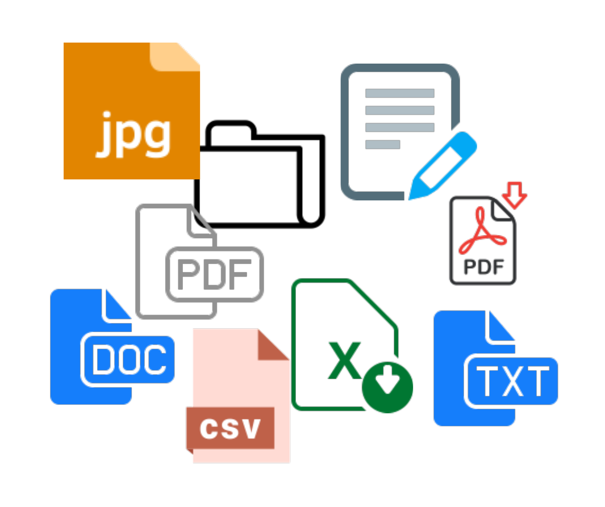

This chapters introduces you to one of the most important areas of software engineering. That of the file content processing.
It is an area that you will have to deal with no matter what you will be working on. File content processing is a must
have skill. It's also fun with lots of practical applications.
