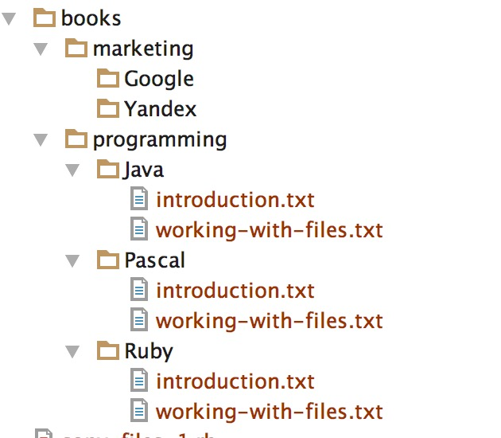
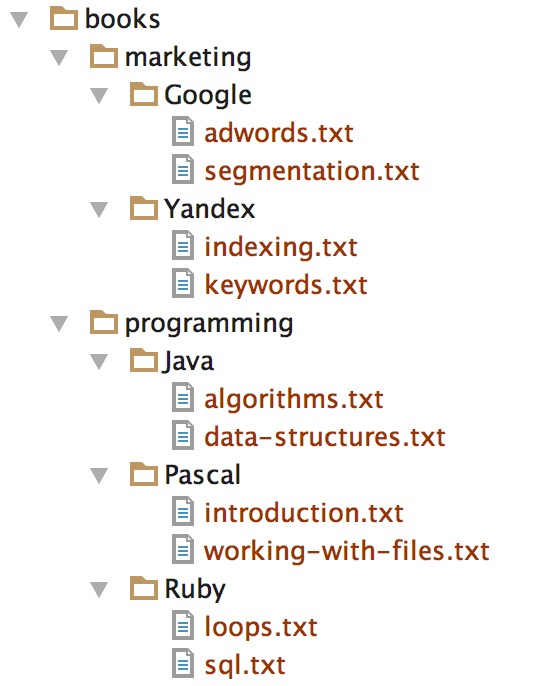

We have learned in the previous chapter how to manipulate and process the contents of a file, text or binary. Let's proceed now with
the management of files and directories (folders).

We will learn, again, using examples.

## Create a Directory

> We assume that there is no directory `books` inside your working folder.

Let's start by creating a folder/directory. Let's name this `books`. The Ruby program that can do that is the following:

``` ruby
1. # File: file-management-1.rb
2. #
3. require 'fileutils'
4. 
5. FileUtils.mkdir 'books'
```

This is very simple. It requires the `fileutils` file which imports the module `FileUtils` from the standard Ruby library. This
module exposes numerous methods for file and directory management.

Then, on line 5, it calls the method `.mkdir` which takes as argument the name of the directory to create.

If you run this program, you will have the new directory `books` created on your current directory.

``` bash
$ ruby file-management-1.rb
$
```

You can confirm that with:

``` bash
$ ls -ltr
...
drwxr-xr-x  2 panayotismatsinopoulos  staff  68 Dec 17 14:50 books
$
```
The last entry is `books`, the new directory that we have created.

## Delete a Directory

Let's now write the program that would delete this one. `file-management-2.rb`:

``` ruby
1. # File: file-management-2.rb
2. #
3. require 'fileutils'
4. 
5. FileUtils.rmdir 'books'
```

> Note that `FileUtils.mkdir` corresponds to the Linux command `mkdir`. And `FileUtils.rmdir` corresponds to the `rmdir` Linux command.
This mnemonic rule will be handy for all the `FileUtils` methods listed [here](http://ruby-doc.org/stdlib-2.2.2/libdoc/fileutils/rdoc/FileUtils.html)

If you run the program `ruby file-management-2.rb` and then list contents of your present working directory, then 
you will not see directory `books` in place any more.

## Create a Directory Branch

Creating a single directory is cool. Creating a directory branch, a directory path, is even cooler. You can use the method `.mkdir_p` if you want to
create a directory and all its parent directories if they do not exist. Let's try that (`file-management-3.rb`):

``` ruby
1. # File: file-management-3.rb
2. #
3. require 'fileutils'
4. 
5. FileUtils.mkdir_p 'books/programming/Ruby'
6. FileUtils.mkdir_p 'books/programming/Java'
7. FileUtils.mkdir_p 'books/programming/Pascal'
8. FileUtils.mkdir_p 'books/marketing/Google'
9. FileUtils.mkdir_p 'books/marketing/Yandex'
```

If you run the above program `ruby file-management-3.rb` and then you list the contents of your present working directory, you will see this:

``` bash
$ ls -ltrR | egrep "^\."
./books:
./books/programming:
./books/programming/Ruby:
./books/programming/Pascal:
./books/programming/Java:
./books/marketing:
./books/marketing/Yandex:
./books/marketing/Google:
$
```

> Information: the `ls -ltrR | egrep "^\."` will list all the directories and their subdirectories in your working folder.

Or you can visually see what this program has created:


The command `FileUtils.mkdir_p` creates the destination directory and all necessary directories above it, if they do not exist.

## Remove a Directory Branch

If you try to remove the directory `books` with the command `FileUtils.rmdir('books')` it will silently fail:
(`file-management-4.rb`):

``` ruby
1. # File: file-management-4.rb
2. #
3. require 'fileutils'
4. 
5. FileUtils.rmdir 'books'
6. puts "'books' directory exists? #{Dir.exist? 'books'}"
```

Try to run the above program and you will get this:

``` bash
$ ruby file-management-4.rb
'books' directory exists? true
$
```

which means that the directory `books` has not bee removed. Note that the existence of a the directory has been verified 
by the call to `Dir.exist?`. `Dir` is a class that comes with core Ruby. The `Dir.exist?` method check whether the given
argument corresponds to an existing directory.

The directory `books` has not been removed because it is not empty. If you want to remove a directory branch, you need to
call method `FileUtils.rm_rf` (or `FileUtils.remove_entry_secure` even better, read [here](http://ruby-doc.org/stdlib-2.2.2/libdoc/fileutils/rdoc/FileUtils.html#method-c-remove_entry_secure) why). See program `file-management-5.rb`:

``` ruby
1. # File: file-management-5.rb
2. #
3. require 'fileutils'
4. 
5. FileUtils.rm_rf 'books'
6. puts "'books' directory exists? #{Dir.exist? 'books'}"
```

If you now run this program, you will get this:

``` bash
$ ruby file-management-5.rb
'books' directory exists? false
$
```

Which proves that the `books` folder has been removed. Double check also by running `ls -ltr` on your working folder. You will not see the `books` directory present.

## Copying Files

Let's run the following program that would create a directory tree with some files (`create-directory-tree-with-files.rb`):

``` ruby
 1. # File: create-directory-tree-with-files.rb
 2. #
 3. require 'fileutils'
 4. 
 5. FileUtils.mkdir_p 'books/programming/Ruby'
 6. FileUtils.mkdir_p 'books/programming/Java'
 7. FileUtils.mkdir_p 'books/programming/Pascal'
 8. FileUtils.mkdir_p 'books/marketing/Google'
 9. FileUtils.mkdir_p 'books/marketing/Yandex'
10. 
11. # Files
12. filename = 'books/programming/Ruby/introduction.txt'
13. File.write(filename, 'Introduction To Ruby')
14. 
15. 
16. filename = 'books/programming/Ruby/working-with-files.txt'
17. File.write(filename, 'Working with Files - File Class')
```

If you run the program with `ruby create-directory-tree-with-files.rb` you will create this:


Can we write a program that would copy Ruby files to the other two programming directories, Java and Pascal? Indeed we can (`copy-files-1.rb`):

``` ruby
1. # File: copy-files-1.rb
2. #
3. require 'fileutils'
4. 
5. FileUtils.cp('books/programming/Ruby/introduction.txt', 'books/programming/Java')
6. FileUtils.cp('books/programming/Ruby/working-with-files.txt', 'books/programming/Java')
7. 
8. FileUtils.cp('books/programming/Ruby/introduction.txt', 'books/programming/Pascal')
9. FileUtils.cp('books/programming/Ruby/working-with-files.txt', 'books/programming/Pascal')
```

This program is very simple. For each copy it uses the command `FileUtils.cp` to carry out the copy. The first argument is the source.
The second argument is the destination. Since the destination specified is now a folder, the file copied is created with the same name as the 
source file. But this is not the only option. We could have specified a new name for the destination file.

Run the program with `ruby copy-files-1.rb` and you will see the files being copied to the other two folders:



## Deleting Files

Let's now delete the files that we have created inside the `Pascal` and `Java` directories. This is done with the `FileUtils.rm` call (`remove-files-1.rb`):

``` ruby
1. # File: remove-files-1.rb
2. #
3. require 'fileutils'
4. 
5. FileUtils.rm('books/programming/Java/introduction.txt')
6. FileUtils.rm('books/programming/Java/working-with-files.txt')
7. 
8. FileUtils.rm('books/programming/Pascal/introduction.txt')
9. FileUtils.rm('books/programming/Pascal/working-with-files.txt')
```

If you run this program as `ruby remove-files-1.rb` then you will see the two files removed from the `Java` and `Pascal` folders:


## Moving Files

Let's now move the files from `Ruby` folder to `Pascal` folder. This is done with the `FileUtils.mv` call (`move-files-1.rb`):

``` ruby
1. # File: move-files-1.rb
2. #
3. require 'fileutils'
4. 
5. FileUtils.mv('books/programming/Ruby/introduction.txt', 'books/programming/Pascal')
6. FileUtils.mv('books/programming/Ruby/working-with-files.txt', 'books/programming/Pascal')
```

The `FileUtils.mv` method call, takes two arguments. The first argument is the source. The second argument is the destination. The destination
on our example is a folder, hence the files are moved to another folder, but they retain their name. It could have been a move that would change
their names too.

## Parse the contents of a Directory

Let's now repopulate our `books` tree with some files, before we find a way to parse all the contents of a folder, recursively.
Run the program `create-directory-tree-with-files-2.rb`:

``` ruby
 1. # File: create-directory-tree-with-files-2.rb
 2. #
 3. require 'fileutils'
 4. 
 5. FileUtils.mkdir_p 'books/programming/Ruby'
 6. FileUtils.mkdir_p 'books/programming/Java'
 7. FileUtils.mkdir_p 'books/programming/Pascal'
 8. FileUtils.mkdir_p 'books/marketing/Google'
 9. FileUtils.mkdir_p 'books/marketing/Yandex'
10. 
11. # Files
12. filename = 'books/programming/Ruby/loops.txt'
13. File.write(filename, 'Loops in Ruby')
14. 
15. filename = 'books/programming/Ruby/sql.txt'
16. File.write(filename, 'Structured Query Language')
17. 
18. filename = 'books/programming/Java/data-structures.txt'
19. File.write(filename, 'Data Structures In Ruby')
20. 
21. filename = 'books/programming/Java/algorithms.txt'
22. File.write(filename, 'Algorithms and Complexity')
23. 
24. filename = 'books/marketing/Google/segmentation.txt'
25. File.write(filename, 'Customer Segmentation')
26. 
27. filename = 'books/marketing/Google/adwords.txt'
28. File.write(filename, 'Google Adwords')
29. 
30. filename = 'books/marketing/Yandex/indexing.txt'
31. File.write(filename, 'Yandex Indexing')
32. 
33. filename = 'books/marketing/Yandex/keywords.txt'
34. File.write(filename, 'Keywords Optimization')
```

If you run the above program `ruby create-directory-tree-with-files-2.rb`, you will get this:



Now, having this folder and file tree, how can we parse all the files that belong to it? Here is one way you can do that (`parse-tree-contents-1.rb`):

``` ruby
1. # File: parse-tree-contents-1.rb
2. #
3. Dir.glob('books/**/*.*') do |entry|
4.   puts entry
5. end
```

If you run this program, you will get this:

``` bash
$ ruby parse-tree-contents-1.rb
books/marketing/Google/adwords.txt
books/marketing/Google/segmentation.txt
books/marketing/Yandex/indexing.txt
books/marketing/Yandex/keywords.txt
books/programming/Java/algorithms.txt
books/programming/Java/data-structures.txt
books/programming/Pascal/introduction.txt
books/programming/Pascal/working-with-files.txt
books/programming/Ruby/loops.txt
books/programming/Ruby/sql.txt
$
```

The `Dir.glob('books/**/*.*')` returns an array of all the files thanks to the `*.*` that belong to any subdirectory (thanks to `**`) of the directory `books` (due to `books/`).

How can we get either folders or files? Here is how (`parse-tree-contents-2.rb`):

``` ruby
1. # File: parse-tree-contents-2.rb
2. #
3. Dir.glob('books/**/*') do |entry|
4.   puts entry
5. end
```

If you run the above program, you will get this:

``` bash
$ ruby parse-tree-contents-2.rb
books/marketing
books/marketing/Google
books/marketing/Google/adwords.txt
books/marketing/Google/segmentation.txt
books/marketing/Yandex
books/marketing/Yandex/indexing.txt
books/marketing/Yandex/keywords.txt
books/programming
books/programming/Java
books/programming/Java/algorithms.txt
books/programming/Java/data-structures.txt
books/programming/Pascal
books/programming/Pascal/introduction.txt
books/programming/Pascal/working-with-files.txt
books/programming/Ruby
books/programming/Ruby/loops.txt
books/programming/Ruby/sql.txt
$
```

which includes both directories and files. This is thanks to the fact that we have used `*` instead of `*.*` for the last part of the `glob()` 
pattern. With `*` we are more relaxed and we can match directories too, and not only files that include `.` in their names.

## Check for File Existence

Except from being able to check whether a directory exists, you can also check whether a file exists.
Let's look at the program `check-file-existence-1.rb`:

``` ruby
1. # File: check-file-existence-1.rb
2. #
3. filename = 'foo.txt'
4. puts "(Before creating file) Does #{filename} exist? #{File.exist?(filename)}"
5. File.write(filename, 'Creating file foo.txt')
6. puts "(After creating file) Does #{filename} exist? #{File.exist?(filename)}"
```

If you run the program, you will see this:

``` bash
$ ruby check-file-existence-1.rb
(Before creating file) Does foo.txt exist? false
(After creating file) Does foo.txt exist? true
$
```
which proves that the `File.exist?` method works by returning `false` if the file does not exist or `true` if it does.

## Checking for File or for Directory

Last, we need to mention here that `File` offers two very useful methods. `.directory?` and `.file?`. They both return
`true` or `false`. The `.directory?` returns `true` if the given argument corresponds to an existing directory. The `.file?` returns
`true` if the given argument corresponds to an existing file.

## Closing Note

That was a quick journey to file and directory management. Make sure you study the standard Ruby library for `FileUtils` and the core library
for `Dir`.

