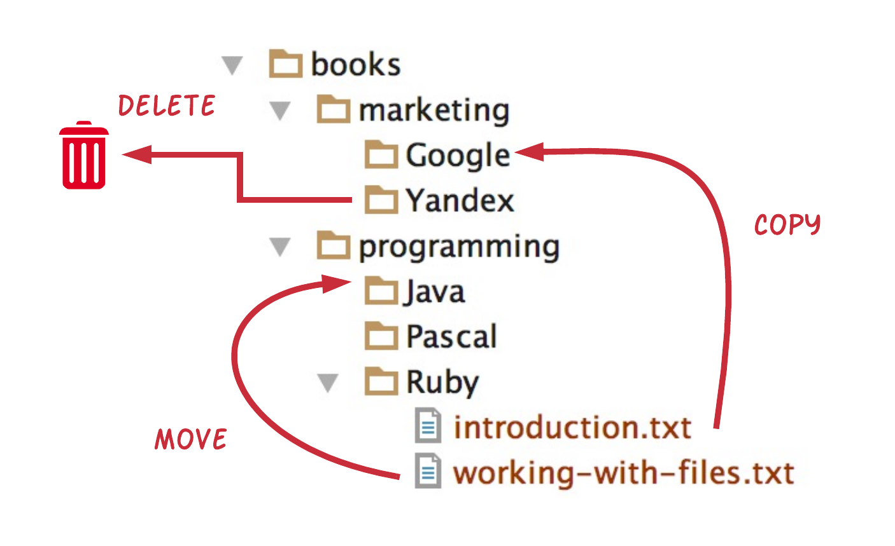

This is a chapter on file and directory management commands that one can issue with the help of Ruby, i.e. from within a Ruby program.
You probably know how to take the actions of copy, delete or move while you are interfacing with the operating system. But this 
chapter will give you the corresponding knowledge to take those actions from within Ruby. Hence, you will be able to design and
implement your own file management application!
