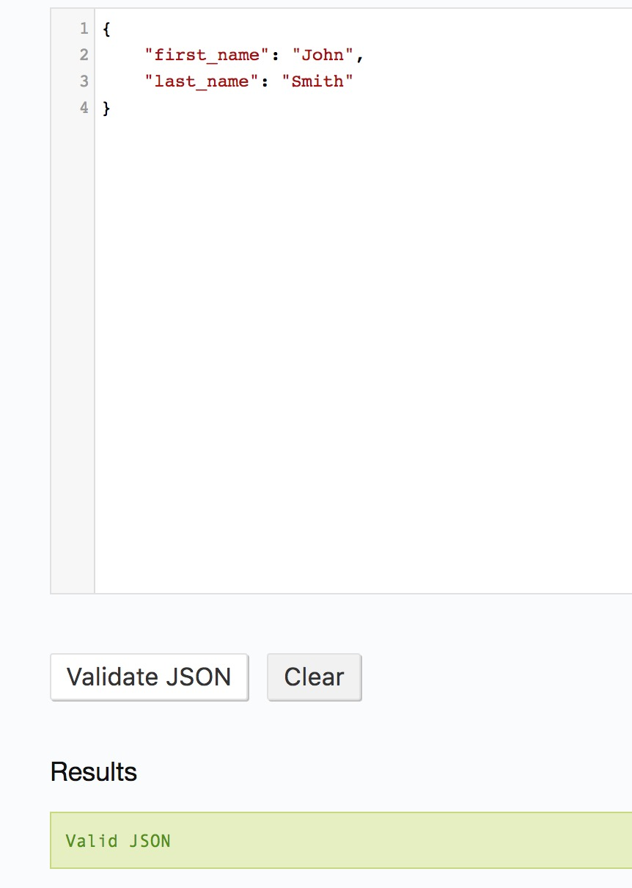
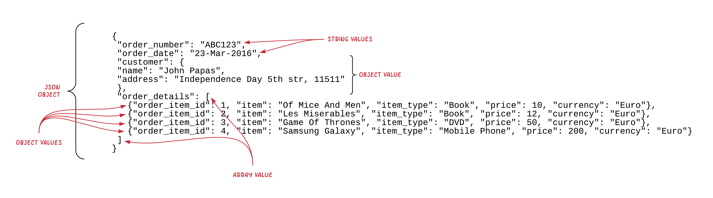

JSON (JavaScript Object Notation) is a way to represent data and is very popular in Web development. One of the most common uses
is to exchange data between a client and a server, e.g. between a browser and a Web server.

## Object

JSON objects look like JavaScript objects. They start with an opening `{` and they end with a closing one `}`. In between, we 
have the properties of an object which are name/value pairs. The name from the value is separated using the colon `:` symbol.
The name/value pairs are separated using commas `,`. The names are given using strings. The values can be strings or other data
types. We will see the valid data types later on.

Example:

``` json
{ "first_name": "John", "last_name": "Smith" }
```

As you can see, this is very similar to a Ruby Hash. In fact, Ruby standard library offers the [JSON](https://ruby-doc.org/stdlib-2.3.3/libdoc/json/rdoc/index.html)
utilities which can be used to deal with JSON objects. Let's see the following example (`hash-to-json.rb`):

``` ruby
 1. # File: hash-to-json
 2. #
 3. require 'json'
 4. 
 5. customer = {
 6.   first_name: 'John',
 7.   last_name: 'Smith'
 8. }
 9. 
10. customer_json = customer.to_json
11. 
12. puts "Customer_json: #{customer_json}, with class: #{customer_json.class}"
```

On this program, we define a Hash, `customer`, on lines 5 - 8. Then we call the method `#to_json`, which converts the Hash to a JSON string
representation.

If you run this program, you will get this:

``` bash
$ ruby hash-to-json.rb
Customer_json: {"first_name":"John","last_name":"Smith"}, with class: String
$
```

You can clearly see how a Hash has been converted to a String that has the JSON format.

## JSON Validator

Before we continue with any other example of JSON formatted data, just to let you know that there are a lot of JSON validators online.
One that you can try whether your JSON string is valid or not is this: [JSONLint](http://jsonlint.com/). Paste your JSON string inside the
text area and then click on `Validate JSON`. Here is the output for the customer JSON above:



So, whenever you have a JSON document and you want to validate that it is well constructed, you can use this online tool.

## Arrays

A JSON array is a list of values that are sorted. We represent that like we do for the Ruby and JavaScript arrays, enclosing the values inside 
square brackets `[`, `]`. Here is an example Ruby program that produces a JSON array:

``` ruby
1. # File: array-to-json.rb
2. #
3. require 'json'
4. 
5. customers = ['John Smith', 'Mary Foo', 'George Papas', 'Paul Adam']
6. customers_json = customers.to_json
7. puts "Customers JSON representation: #{customers_json}, class: #{customers_json.class}"
```

If you run the above program, you will get this:

``` bash
$ ruby array-to-json.rb
Customers JSON representation: ["John Smith","Mary Foo","George Papas","Paul Adam"], class: String
$
```

## Types for the Values

The values of the properties of a JSON Object or the values of the elements of a JSON Array can be:

1. String or
2. Number or
3. Object or
4. Array or
5. `true` or
6. `false` or
7. `null`

## Nesting and Complex Structures

And that was it! With objects, arrays and values, we can create complex structures. Let's see one such complex structure:

``` json
{
  "order_number": "ABC123",
  "order_date": "23-Mar-2016",
  "customer": {
    "name": "John Papas",
    "address": "Independence Day 5th str, 11511"
  },
  "order_details": [
    {"order_item_id": 1, "item": "Of Mice And Men", "item_type": "Book", "price": 10, "currency": "Euro"},
    {"order_item_id": 2, "item": "Les Miserables", "item_type": "Book", "price": 12, "currency": "Euro"},
    {"order_item_id": 3, "item": "Game Of Thrones", "item_type": "DVD", "price": 50, "currency": "Euro"},
    {"order_item_id": 4, "item": "Samsung Galaxy", "item_type": "Mobile Phone", "price": 200, "currency": "Euro"}
  ]
}
```

Take the above JSON string and validate it on JSONLint. Is this valid? Yes it is!

The above is a complex JSON object that contains values of various types:



## Ruby Object Serialization

JSON is very useful when it comes to serializing a Ruby object. With serializing we mean the conversion of a Ruby object instance into
a format that can either be saved to the file system or be sent over the wire to another process, e.g. from a browser to a WEB server.

Here is an example Ruby program that serializes an `Order` instance (`ruby-serialization-1.rb`). The `Order` class is composed of various attributes:

1. An order number
2. An order date
3. A customer object
4. A series of order details

resembling, on purpose, the structure defined by the JSON structure we saw earlier. 

``` ruby
 1. # File: ruby-serialization-1.rb
 2. #
 3. require 'Date'
 4. require 'json'
 5. 
 6. class Customer
 7.   attr_accessor :name,
 8.                 :address
 9. 
10.   def initialize(name, address)
11.     @name = name
12.     @address = address
13.   end
14. 
15.   def to_h
16.     {name: name,
17.      address: address}
18.   end
19. end
20. 
21. class OrderItem
22.   attr_accessor :id,
23.                 :item,
24.                 :item_type,
25.                 :price,
26.                 :currency
27. 
28.   def initialize(id, item, item_type, price, currency)
29.     @id = id
30.     @item = item
31.     @item_type = item_type
32.     @price = price
33.     @currency = currency
34.   end
35. 
36.   def to_h
37.     {id: id, item: item, item_type: item_type, price: price, currency: currency}
38.   end
39. end
40. 
41. class Order
42.   attr_accessor :order_number,
43.                 :order_date,
44.                 :customer,
45.                 :order_details
46.   def to_json(*options)
47.     {order_number: order_number,
48.      order_date: order_date,
49.      customer: customer.to_h,
50.      order_details: order_details.map(&:to_h) }.to_json(options)
51.   end
52. end
53. 
54. order = Order.new
55. order.order_number = 'ABC123'
56. order.order_date = Date.new(2016, 3, 23)
57. order.customer = Customer.new('John Papas', 'Independence Day 5th, 11511')
58. order.order_details = [
59.   OrderItem.new(1, 'Of Mice And Men', 'Book', 10, 'Euro'),
60.   OrderItem.new(2, 'Les Miserables', 'Book', 12, 'Euro'),
61.   OrderItem.new(3, 'Game Of Thrones', 'DVD', 50, 'Euro'),
62.   OrderItem.new(4, 'Samsung Galaxy', 'Mobile Phone', 200, 'Euro')
63. ]
64. 
65. order_json = order.to_json
66. File.write('order.json', order_json)
```

The above program defines the necessary objects, `Customer` (lines: 6 - 19), `OrderItem` (lines: 21 - 39) and `Order` (lines: 41 - 52).
Then it instantiates an `Order` instance and populates it with valid data. Then it tries to serialize the object to disk:

1. It converts it to JSON (line 65)
2. It saves the JSON string to a file (line 66)

This makes sure that the object data survive after the program has terminated. So, the JSON file works as a database for the orders.

Let's run the program `ruby ruby-serialization-1.rb`. When you do that, the file `order.json` will be created.


> Information: It is good that we named the file with the extension `.json`. This makes sure that we remember that this is not just a text
file, which it is, but also, it contains a JSON formatted object. This is helpful also for our editor. When we double click to open this file,
the editor knows that it is about a JSON content. So, it highlights the keys, for example.

If you print the contents of the file `order.json` you will see this:

``` bash
$ cat order.json
{"order_number":"ABC123","order_date":"2016-03-23","customer":{"name":"John Papas","address":"Independence Day 5th, 11511"},"order_details":[{"id":1,"item":"Of Mice And Men","item_type":"Book","price":10,"currency":"Euro"},{"id":2,"item":"Les Miserables","item_type":"Book","price":12,"currency":"Euro"},{"id":3,"item":"Game Of Thrones","item_type":"DVD","price":50,"currency":"Euro"},{"id":4,"item":"Samsung Galaxy","item_type":"Mobile Phone","price":200,"currency":"Euro"}]}$
```

You can take this output and put it inside the JSONLint validator and you will see that this is a valid JSON string. 

But, what did we have to do in order for the `Order` instance to be serializable as JSON string?

The `Order` instance had to respond to the `#to_json(*options)` method. That is what we implemented on line 46 to 51. And how did we implement that?
We just constructed a Hash with the properties of the order and then we called `#to_json` on that. We already know that `#to_json` knows how
to convert Hashes. Then, in order to be able to have a correct Hash representation of an `Order`, we had to make sure that both `customer` property
and `order_details` property could be converted to `Hash` too. For that reason, we implemented the method `#to_h` on both of these two classes.

> *Note* The actual `options` were not proven necessary now. And they will not be used in the context of this course. But you need to make
it a good habit to include it in the signature of your `#to_json` methods. This will be unavoidable when you will ask for a JSON conversion for
an array of objects, for example. See later on about it.

## Ruby Object Deserialization

Now that we do have our object serialized into a disk file, we might want to bring that back into memory, i.e. deserialize it. Let's see the
following program `ruby-serialization-2.rb`, which reads back the `order.json` file from the disk.

``` ruby
 1. # File: ruby-serialization-2.rb
 2. #
 3. require 'Date'
 4. require 'json'
 5.
 6. class Customer
 7.   attr_accessor :name,
 8.                 :address
 9.
10.   def initialize(name, address)
11.     @name = name
12.     @address = address
13.   end
14.
15.   def to_h
16.     {name: name,
17.      address: address}
18.   end
19.
20.   def self.from_h(customer_hash)
21.     new(customer_hash['name'], customer_hash['address'])
22.   end
23. end
24.
25. class OrderItem
26.   attr_accessor :id,
27.                 :item,
28.                 :item_type,
29.                 :price,
30.                 :currency
31.
32.   def initialize(id, item, item_type, price, currency)
33.     @id = id
34.     @item = item
35.     @item_type = item_type
36.     @price = price
37.     @currency = currency
38.   end
39.
40.   def to_h
41.     {id: id, item: item, item_type: item_type, price: price, currency: currency}
42.   end
43.
44.   def self.from_h(order_item_hash)
45.     new(
46.       order_item_hash['id'],
47.       order_item_hash['item'],
48.       order_item_hash['item_type'],
49.       order_item_hash['price'],
50.       order_item_hash['currency']
51.     )
52.   end
53. end
54.
55. class Order
56.   attr_accessor :order_number,
57.                 :order_date,
58.                 :customer,
59.                 :order_details
60.   def to_json(*options)
61.     {order_number: order_number,
62.      order_date: order_date,
63.      customer: customer.to_h,
64.      order_details: order_details.map(&:to_h) }.to_json(options)
65.   end
66.
67.   def self.from_json(order_json)
68.     order_hash = JSON.parse(order_json)
69.     order = Order.new
70.     order.order_number = order_hash['order_number']
71.     order.order_date = order_hash['order_date']
72.     order.customer = Customer.from_h(order_hash['customer'])
73.     order.order_details = order_hash['order_details'].map {|order_item_hash| OrderItem.from_h(order_item_hash)}
74.     order
75.   end
76. end
77.
78. order_json = File.read('order.json')
79.
80. order = Order.from_json(order_json)
81. puts order.inspect
```

So, the above program reads the contents of the file that `ruby-serialization-1.rb` creates. Reading is done with the very simple command
`File.read`. The contents are being loaded into the variable `order_json`.

Then it calls the method `.from_json` that we have implemented as class method inside the class `Order`. This method takes the string read from the disk
and has some logic to build a proper `Order` instance.

Let's run the program:

``` bash
$ ruby ruby-serialization-2.rb
#<Order:0x007f923b8a35c0 @order_number="ABC123", @order_date="2016-03-23", @customer=#<Customer:0x007f923b8a3598 @name="John Papas", @address="Independence Day 5th, 11511">, @order_details=[#<OrderItem:0x007f923b8a3548 @id=1, @item="Of Mice And Men", @item_type="Book", @price=10, @currency="Euro">, #<OrderItem:0x007f923b8a3520 @id=2, @item="Les Miserables", @item_type="Book", @price=12, @currency="Euro">, #<OrderItem:0x007f923b8a34f8 @id=3, @item="Game Of Thrones", @item_type="DVD", @price=50, @currency="Euro">, #<OrderItem:0x007f923b8a34d0 @id=4, @item="Samsung Galaxy", @item_type="Mobile Phone", @price=200, @currency="Euro">]>
$
```

As you can see the result proves that the deserialization worked successfully. the `Order.from_json` returned a proper `Order` instance with all its details populated
with the correct values, those that existed inside the `order.json` file.

How did that method work?

The core of the implementation of the method `Order.from_json` is the call to `JSON.parse`. This takes as input a JSON string and returns back a Hash.
Then, everything is Ruby and we have the tools to convert the Hash to whatever object instance we want. Note that we had to add

1. `Customer.from_h` method that converts a `Hash` to a `Customer` instance.
2. `OrderItem.from_h` method that converts a `Hash` to an `OrderItem` instance.

And that was it.

## Objects need to Implement `#to_json(*options) not `#to_json`

Before we close the JSON part of this chapter, we would like to give you some more emphasis on the fact that your custom objects, when you want them
to be JSON serializable, they should better implement the method `#to_json(*options)` and not `#to_json`. If they implement `#to_json`, without the
options argument, then they will be serializable but when your code would call the `#to_json` explicitly. But this is not always the case. Sometimes
`#to_json` is called implicitly, for example when your object is part of an Array, as an Array item. It that case, the `#to_json` called is required
to accept an argument.

Let's see the following example `ruby-serialization-3.rb`:

``` ruby
 1. # File: ruby-serialization-3.rb
 2. #
 3. require 'json'
 4.
 5. class Customer
 6.   attr_accessor :name, :email
 7.
 8.   def initialize(name, email)
 9.     @name = name
10.     @email = email
11.   end
12.
13.   def to_json
14.     {name: name, email: email}.to_json
15.   end
16. end
17.
18. customer = Customer.new('John Smith', 'john_smith@mailinator.com')
19. File.write('customers-db.json', customer.to_json)
```

This program above creates an instance of a `Customer` class, on line 18, and on line 19, it explicitly calls the `#to_json` method on that
object instance. Note that `#to_json` has been defined as not taking any argument.

If you run this program, `ruby ruby-serialization-3.rb`, it will successfully create the file `customers-db.json` as follows:

``` json
{"name":"John Smith","email":"john_smith@mailinator.com"}
```

Fair enough. But if you try to serialize an array of `Customer` instances, this will not go as smoothly as before. Look at the program `ruby-serialization-4.rb`:

``` ruby
 1. # File: ruby-serialization-4.rb
 2. #
 3. require 'json'
 4.
 5. class Customer
 6.   attr_accessor :name, :email
 7.
 8.   def initialize(name, email)
 9.     @name = name
10.     @email = email
11.   end
12.
13.   def to_json
14.     {name: name, email: email}.to_json
15.   end
16. end
17.
18. customers = [Customer.new('John Smith', 'john_smith@mailinator.com'), Customer.new('Peter Pan', 'peter_pan@mailinator.com')]
19. File.write('customers-db.json', customers.to_json)
```

You can see that on line 18, we now create an array of `Customer` instances. And we call `#to_json` on `customers` on line 19. JSON library
knows that if one calls `#to_json` on an Array, it needs to go and call the `#to_json` on each one of the elements of the array. But it does
that by passing an options variable.

Try to run this program, `ruby-serialization-4.rb` and you will see that failing:

``` bash
$ ruby ruby-serialization-4.rb
ruby-serialization-4.rb:13:in `to_json': wrong number of arguments (1 for 0) (ArgumentError)
        from ruby-serialization-4.rb:19:in `to_json'
        from ruby-serialization-4.rb:19:in `<main>'
$
```
It tells you that method `#to_json` has been called with wrong number of arguments. It has been called with `1` argument, whereas, it is
designed (on line 13 - 15) to be accepting 0 arguments. This is, again, due to the fact that JSON library is calling the `#to_json` on each
one of the arguments passing `options` as an argument.

Hence, the proper way to implement your `#to_json` method on your `Customer` class is depicted on program `ruby-serialization-5.rb`:

``` ruby
 1. # File: ruby-serialization-5.rb
 2. #
 3. require 'json'
 4.
 5. class Customer
 6.   attr_accessor :name, :email
 7.
 8.   def initialize(name, email)
 9.     @name = name
10.     @email = email
11.   end
12.
13.   def to_json(*options)
14.     {name: name, email: email}.to_json(options)
15.   end
16. end
17.
18. customers = [Customer.new('John Smith', 'john_smith@mailinator.com'), Customer.new('Peter Pan', 'peter_pan@mailinator.com')]
19. File.write('customers-db.json', customers.to_json)
```

As you can see, line 13 defines the `#to_json` taking an arbitrary number of arguments. Also, these arguments are passed to `#to_json` call
on the `Hash` on line 14.

If you run the program `ruby ruby-serialization-5.rb` now, it will not raise any error. And the `customers-db.json` will be created without problem
as such:

``` json
[{"name":"John Smith","email":"john_smith@mailinator.com"},{"name":"Peter Pan","email":"peter_pan@mailinator.com"}]
```

I hope that you now understand why the `#to_json` needs to be defined as `def to_json(*options)` and not `def to_json`.

## JSON Closing Note

If you want to read more about `JSON` please go to the official [JSON page here](http://www.json.org/). JSON will be extremely useful to your software
engineer career. And we will have the chance to work with that on many occurrences within the course.

## YAML

YAML is another very popular data serialization standard. It is used heavily in Ruby and Ruby on Rails and on other modern programming languages
and Web frameworks. YAML is more complex than JSON, but, still, YAML documents are usually easy to read.

As always, we will study YAML using some examples.

## Object to YAML - Serialization To File

Let's start with converting an object to a YAML representation and saving that to a file. Here is the program (`object-to-yaml.rb`):

``` ruby
 1. # File: object-to-yaml.rb
 2. #
 3. require 'yaml'
 4.
 5. class Customer
 6.   attr_accessor :name, :address
 7. end
 8.
 9. customer = Customer.new
10. customer.name = 'John'
11. customer.address = 'Independence Day 5th, 11511'
12.
13. customer_yaml = customer.to_yaml
14. File.write('customer.yml', customer_yaml)
```

You can see that this program has a lot of similarity with the corresponding JSON one.

1. We require the `yaml`, with is the file from the [Ruby standard library that supports YAML](http://ruby-doc.org/stdlib-2.3.0/libdoc/yaml/rdoc/YAML.html).
2. And then, after instantiating a `Customer` object, we call `#to_yaml` on that, in order to convert it to a string that complies to the YAML specification.
3. Then we use the `File.write` to write that string to a file. The file has the name `customer.yml`. The `.yml` filename extension is the standard extension
that we use to store YAML content.

If you run this program, you will have the file `customer.yml` created. Go ahead and print its contents:

``` bash
$ cat customer.yml
--- !ruby/object:Customer
name: John
address: Independence Day 5th, 11511
$
```

Pretty interesting. As you can see, at the beginning we have one line that specifies what follows: `--- !ruby/object:Customer`. And then we have
the properties and theirs values of the customer object that has beeen serialized. The line `--- !ruby/object:Customer` will help on the deserialization
process, in order for the deserializer to instantiate the correct object instance. Otherwise, the properties need to appear one below the other, the
names separated from the values using the `: ` character sequence.

## YAML to Object - Deserialization

Let's see now how we can read back from the disk. We are going to parse the `customer.yml` file and convert its content to a proper `Customer` instance.
Read the program `yaml-to-object.rb`:

``` ruby
 1. # File: yaml-to-object.rb
 2. #
 3. require 'yaml'
 4.
 5. class Customer
 6.   attr_accessor :name, :address
 7. end
 8.
 9. customer = YAML.load_file('customer.yml')
10. puts customer.inspect
```

If you run this program, you will see this:

``` bash
$ ruby yaml-to-object.rb
#<Customer:0x007f9fd09ab6c8 @name="John", @address="Independence Day 5th, 11511">
$
```

Perfect! As you can see, the `Customer` instance inspected on line 10 is a proper object with the attributes having the values
defined inside the `customer.yml` file. This means that we have successfully deserialized the content of the file, from string back
to a Ruby object.

How did we do that? We did that with the help of `YAML.load_file` method. Very simply. Just called that method, giving as argument
the filename of the file that contained the YAML version of our object. The returned object was a ready `Customer` instance.

## More Complex Example

Let's now see a more complex serialization/deserialization example. This is the same like we had on files `ruby-serialization-1.rb` and
`ruby-serialization-2.rb`. The difference now is that we serialize to YAML and we deserialize from YAML.

The first program, `order-to-yaml.rb` serializes the order to a YAML file, `order.yml`:

``` ruby
 1. # File: order-to-yaml.rb
 2. #
 3. require 'Date'
 4. require 'yaml'
 5.
 6. class Customer
 7.   attr_accessor :name,
 8.                 :address
 9.
10.   def initialize(name, address)
11.     @name = name
12.     @address = address
13.   end
14. end
15.
16. class OrderItem
17.   attr_accessor :id,
18.                 :item,
19.                 :item_type,
20.                 :price,
21.                 :currency
22.
23.   def initialize(id, item, item_type, price, currency)
24.     @id = id
25.     @item = item
26.     @item_type = item_type
27.     @price = price
28.     @currency = currency
29.   end
30. end
31.
32. class Order
33.   attr_accessor :order_number,
34.                 :order_date,
35.                 :customer,
36.                 :order_details
37. end
38.
39. order = Order.new
40. order.order_number = 'ABC123'
41. order.order_date = Date.new(2016, 3, 23)
42. order.customer = Customer.new('John Papas', 'Independence Day 5th, 11511')
43. order.order_details = [
44.     OrderItem.new(1, 'Of Mice And Men', 'Book', 10, 'Euro'),
45.     OrderItem.new(2, 'Les Miserables', 'Book', 12, 'Euro'),
46.     OrderItem.new(3, 'Game Of Thrones', 'DVD', 50, 'Euro'),
47.     OrderItem.new(4, 'Samsung Galaxy', 'Mobile Phone', 200, 'Euro')
48. ]
49.
50. order_yaml = order.to_yaml
51. File.write('order.yml', order_yaml)
```

If you compare this file to `ruby-serialization-1.rb`, you will see that it is much simpler. The class definitions only have the
necessary attribute definitions, but they didn't have to have method implementations like `#to_h` or `#to_json`. Turning the
object to its YAML serialized format was that simple: only call the method `#to_yaml` on the object instance.

If you run this program `ruby order-to-yaml.rb` it will generate the following file:

``` yaml
 1. --- !ruby/object:Order
 2. order_number: ABC123
 3. order_date: 2016-03-23
 4. customer: !ruby/object:Customer
 5.   name: John Papas
 6.   address: Independence Day 5th, 11511
 7. order_details:
 8. - !ruby/object:OrderItem
 9.   id: 1
10.   item: Of Mice And Men
11.   item_type: Book
12.   price: 10
13.   currency: Euro
14. - !ruby/object:OrderItem
15.   id: 2
16.   item: Les Miserables
17.   item_type: Book
18.   price: 12
19.   currency: Euro
20. - !ruby/object:OrderItem
21.   id: 3
22.   item: Game Of Thrones
23.   item_type: DVD
24.   price: 50
25.   currency: Euro
26. - !ruby/object:OrderItem
27.   id: 4
28.   item: Samsung Galaxy
29.   item_type: Mobile Phone
30.   price: 200
31.   currency: Euro
```

It is an easy to read document that contains the state of the order object instance. It also has some meta-data information,
e.g. `!ruby/object:OderItem` in order to be able to deserialize it back to a proper Ruby Object.

Some things that you might want to pay attention to:

(1) When the property of an object is another object, then the properties of that latter object are being listed
indented by 2 spaces:

``` yaml
4. customer: !ruby/object:Customer
5.   name: John Papas
6.   address: Independence Day 5th, 11511
```

(2) When a property is an `Array`, then its items are listed one after the other. Each item is prefixed with `- ` followed
by meta-information about the type of the item, if that is an object. The properties of that item object are indented by
2 spaces.
``` yaml
26. - !ruby/object:OrderItem
27.   id: 4
28.   item: Samsung Galaxy
29.   item_type: Mobile Phone
30.   price: 200
31.   currency: Euro
```

Now, let's write the program that would deserialize this YAML construct into the proper object instance. See program `yaml-to-order.rb`:

``` ruby
 1. # File: yaml-to-order.rb
 2. #
 3. require 'Date'
 4. require 'yaml'
 5.
 6. class Customer
 7.   attr_accessor :name,
 8.                 :address
 9.
10.   def initialize(name, address)
11.     @name = name
12.     @address = address
13.   end
14. end
15.
16. class OrderItem
17.   attr_accessor :id,
18.                 :item,
19.                 :item_type,
20.                 :price,
21.                 :currency
22.
23.   def initialize(id, item, item_type, price, currency)
24.     @id = id
25.     @item = item
26.     @item_type = item_type
27.     @price = price
28.     @currency = currency
29.   end
30. end
31.
32. class Order
33.   attr_accessor :order_number,
34.                 :order_date,
35.                 :customer,
36.                 :order_details
37. end
38.
39. order = YAML.load_file('order.yml')
40. puts order.inspect
```

This program is quite simple. It just calls `YAML.load_file('order.yml')` to convert the serialized version of an order instance
back to its Ruby version. And it works really well. The line 40 prints the object created.

Run the program to see its result:

``` bash
$ ruby yaml-to-order.rb
#<Order:0x007ff8a415b4f0 @order_number="ABC123", @order_date=#<Date: 2016-03-23 ((2457471j,0s,0n),+0s,2299161j)>, @customer=#<Customer:0x007ff8a415a960 @name="John Papas", @address="Independence Day 5th, 11511">, @order_details=[#<OrderItem:0x007ff8a4159998 @id=1, @item="Of Mice And Men", @item_type="Book", @price=10, @currency="Euro">, #<OrderItem:0x007ff8a4158a70 @id=2, @item="Les Miserables", @item_type="Book", @price=12, @currency="Euro">, #<OrderItem:0x007ff8a4158250 @id=3, @item="Game Of Thrones", @item_type="DVD", @price=50, @currency="Euro">, #<OrderItem:0x007ff8a585f598 @id=4, @item="Samsung Galaxy", @item_type="Mobile Phone", @price=200, @currency="Euro">]>
$
```

As you can see, the `Order` instance has been reconstructed very accurately, with all properties, nested and not, having the correct values and the correct type.

## Loading Configuration

You will frequently find that YAML is used to store application configuration settings. It is very easy to read and maintain. This is an example of such
a file (`config.yml`):

``` yaml
 1. # File: config.yml
 2. #
 3. development:
 4.   adapter: postgresql
 5.   encoding: unicode
 6.   pool: 5
 7.   host: localhost
 8.   database: customers_db_development
 9.   username: foo
10.   password: bar
11. 
12. test:
13.   adapter: postgresql
14.   encoding: unicode
15.   pool: 5
16.   host: localhost
17.   database: customers_db_test
18.   username: foo
19.   password: bar
20. 
21. production:
22.   adapter: postgresql
23.   encoding: unicode
24.   pool: 5
25.   host: 192.168.2.1
26.   database: customers_db_production
27.   username: customers_db
28.   password: adfkj3d8vjt4fjashd36
```
  
Let's try to load this file into memory using the `YAML.load_file` command. We will do that with irb:

``` ruby
$ irb
2.2.3 :001 > require 'yaml'
 => true 
2.2.3 :002 > config = YAML.load_file('config.yml')
 => {"development"=>{"adapter"=>"postgresql", "encoding"=>"unicode", "pool"=>5, "host"=>"localhost", "database"=>"customers_db_development", "username"=>"foo", "password"=>"bar"}, "test"=>{"adapter"=>"postgresql", "encoding"=>"unicode", "pool"=>5, "host"=>"localhost", "database"=>"customers_db_test", "username"=>"foo", "password"=>"bar"}, "production"=>{"adapter"=>"postgresql", "encoding"=>"unicode", "pool"=>5, "host"=>"localhost", "database"=>"customers_db_test", "username"=>"customers_db", "password"=>"adfkj3d8vjt4fjashd36"}} 
2.2.3 :003 >
```

As you can see, this YAML file has been deserialized into a `Hash` object. This `Hash` object has 3 keys, `development`, `test` and `production`.
Each has as value, another `Hash`, with keys the corresponding keys nested in the YAML file.

Here is an example of the values:

``` ruby
2.2.3 :003 > config['development']['database']
 => "customers_db_development" 
2.2.3 :004 > config['test']['database']
 => "customers_db_test" 
2.2.3 :005 > config['production']['database']
 => "customers_db_production" 
2.2.3 :006 > 
```

## Avoiding Repetition

Something that YAML is very good at, is to help you avoid repetition. For example, the 3 sections, `development`, `test` and `production`, in the
`config.yml` example above, they do have lots of key/value pairs in common. You can define another section, containing only those common key/values
and then reference that common section from within each individual specific section. 

This is how it can be done (`config-2.yml`):

``` yaml
 1. # File: config-2.yml
 2. #
 3. default: &default
 4.   adapter: postgresql
 5.   encoding: unicode
 6.   pool: 5
 7.   host: localhost
 8.   username: foo
 9.   password: bar
10. 
11. development:
12.   <<: *default
13.   database: customers_db_development
14. 
15. test:
16.   <<: *default
17.   database: customers_db_test
18. 
19. production:
20.   <<: *default
21.   host: 192.168.2.1
22.   database: customers_db_production
23.   username: customers_db
24.   password: adfkj3d8vjt4fjashd36
```

On line 3, `default: &default` we start the common section and we also give it a name that we will use to reference it. The name
is given with the prefix `&` and it is going to be `default`. Then on lines 12, 16 and 20, we *inherit* this common section with
the directive `<<: *default`. This tells YAML that, e.g. on `development` section we have all the keys that we have on `default`
section too, but some of them might be overriden with new values. For example, `production` section overrides the `host`, since
it defines the value `192.168.2.1`, whereas `default` defines the value `localhost`.

Here is a program that loads the configuration and prints the values for username and password for all sections (`load-config-1.rb`):

``` ruby
1. # File: load-config-1.rb
2. #
3. require 'yaml'
4. 
5. config = YAML.load_file('config-2.yml')
6. ['development', 'test', 'production'].each do |environment|
7.   environment_values = config[environment]
8.   puts "#{environment}: Username: #{environment_values['username']}, password: #{environment_values['password']}"
9. end
```

If you run this program, which does nothing but loading the `config-2.yml` file and then parsing the values for `username` and `password` keys
for each one of the top-level keys `development`, `test` and `production`, you will see this:
 
``` bash
$ ruby load-config-1.rb
development: Username: foo, password: bar
test: Username: foo, password: bar
production: Username: customers_db, password: adfkj3d8vjt4fjashd36
$
```

which proves how the specific keys, `development`, `test` and `production` inherit their values from the `default` key section,
and how `production` overrides the inherited values with specific ones.

## Closing Note

JSON and YAML are very useful tools in Ruby and Web development world in general. Make sure that you understand their concepts and
how they are used in practice.


