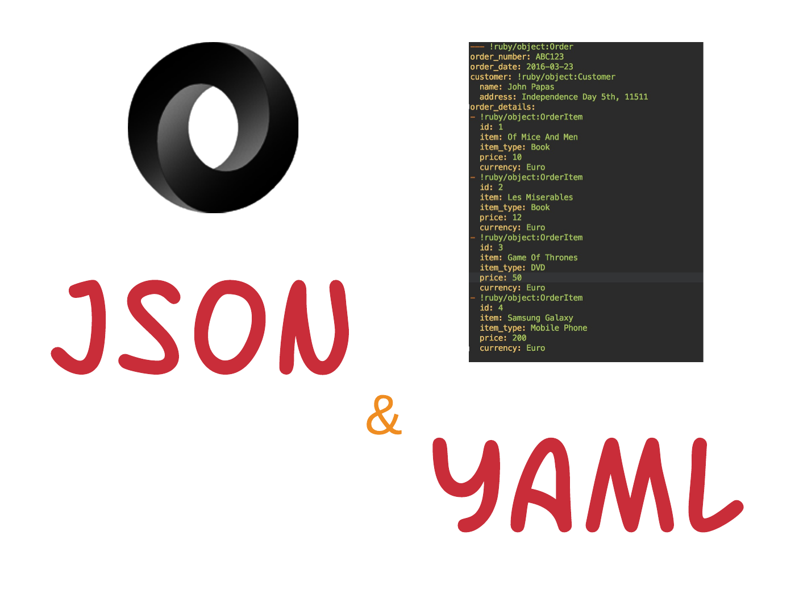

JSON and YAML are very popular data serialization formats, especially in the world of modern script languages like Ruby and 
JavaScript and in the WEB programming in general. You will learn about these formats and you incorporate them in your tool
set. Dealing with these artefacts is an absolute necessity in your software engineering career.
