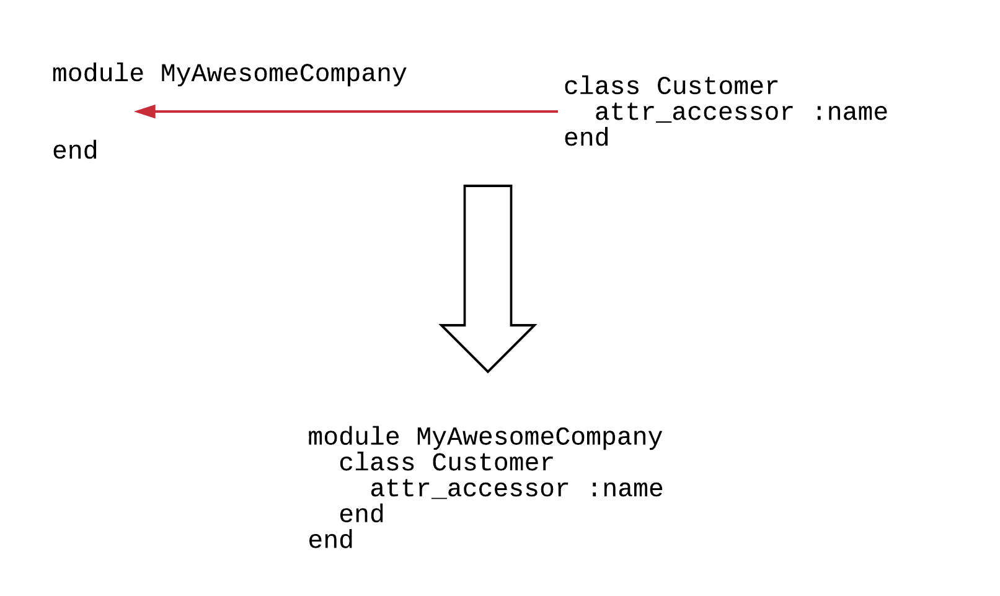
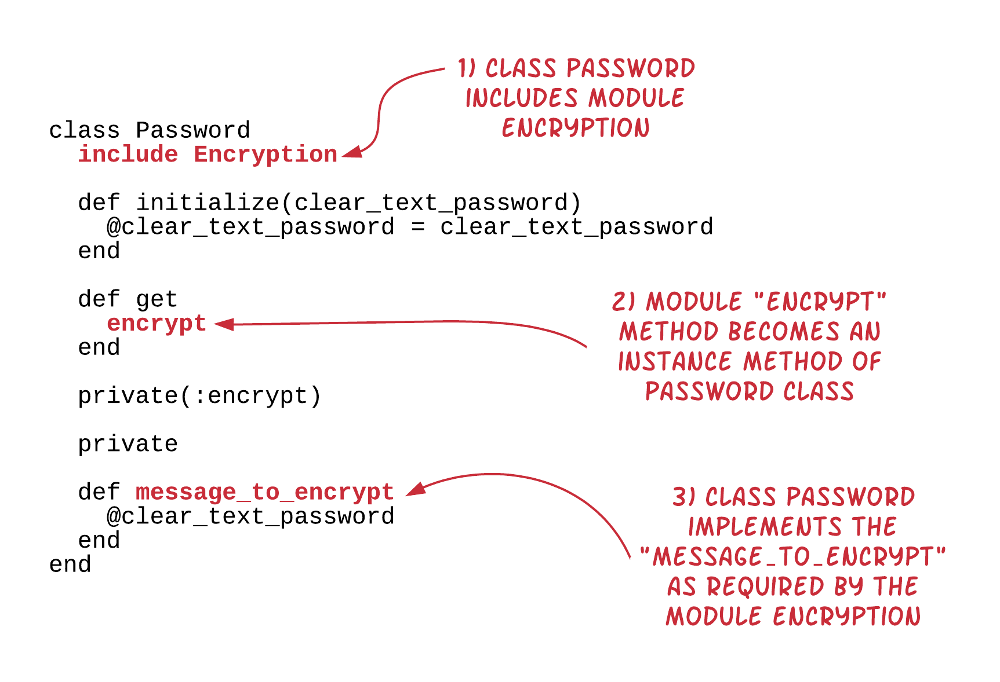
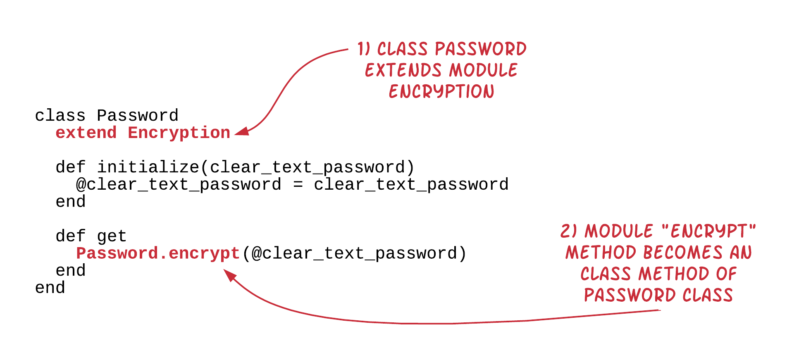
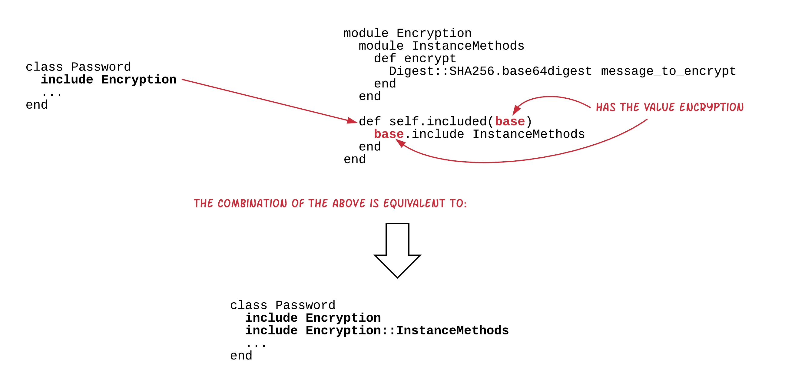

`Modules` are a very popular technique in Ruby. A `Module` is usually used for two reasons:

1. To create a namespace, i.e. write your Ruby code within a specific namespace, without
polluting the global namespace, and hence avoiding your project defined names clash with
other, already defined names.
2. To define a reusable software module, that could be potentially attached to other modules or classes.

Let's see those two in turn.

## Namespaces with Modules

Let's see the namespaces using an example. Suppose that you are building an invoice management Ruby application and
you need to define an `Invoice` class like in the following:

``` ruby
 1. # File: invoice.rb
 2. #
 3. class Invoice
 4.   attr_accessor :customer
 5. 
 6.   def initialize(customer)
 7.     @customer = customer
 8.   end
 9. 
10.   def generate
11.     puts "Will generate last month invoice for customer #{customer.name}"
12.   end
13. end
```

with `Customer` class being:

``` ruby
1. # File: customer.rb
2. #
3. class Customer
4.   attr_accessor :name
5. end
```

And the main application script being this:

``` ruby
 1. # File: invoice_management-1.rb
 2. #
 3. require_relative 'customer'
 4. require_relative 'invoice'
 5. 
 6. customer = Customer.new
 7. customer.name = 'John Smith'
 8. 
 9. invoice = Invoice.new(customer)
10. invoice.generate
```

When you run this on your command line, you will see something like the following:

``` bash
$ ruby invoice-management-1.rb
Will generate last month invoice for customer John Smith
$
```

So far so good. Until you decide to purchase a third-party Ruby library with utilities like queue and stack that you think
they will be useful for your invoice management application. You purchase them from a company that is called `Software Components` 
and you place their Ruby files inside the folder `software-components`. 

Then you decide to include their `software-components/utils.rb` as per their recommendation, and start using their `Queue` class.
This is the new version of your Ruby application:

``` ruby
 1. # File: invoice_management-2.rb
 2. #
 3. require_relative 'customer'
 4. require_relative 'invoice'
 5. require_relative 'software-components/utils'
 6. 
 7. customer = Customer.new
 8. customer.name = 'John Smith'
 9. 
10. invoice = Invoice.new(customer)
11. invoice.generate
12. 
13. queue = Queue.new
14. queue.push(invoice)
```

On line 5, you load the `utils` Ruby library that you have purchased. On line 13, you start using their `Queue` class.  Everything looks good,
until you run your program new version:

``` bash
$ ruby invoice-management-2.rb
software-components/lib/invoice.rb:8:in `initialize': wrong number of arguments (1 for 2) (ArgumentError)
        from invoice-management-2.rb:10:in `new'
        from invoice-management-2.rb:10:in `<main>'
$
```

It seems that on line 10 of our application, we call the `.new` method giving less arguments, 1, than the number of arguments required, i.e. 2
`wrong number of arguments (1 for 2)`. But this error is raised because our program tries to initialize an `Invoice` as defined in 
`software-components/lib/invoice.rb:8` and not as defined in our `invoice.rb` file. 
 
It seems that the `software-components` includes also an `Invoice` definition. This is something that we didn't expect.

And not only that, this overrides the definition of our `Invoice` class. 

Who is the culprit for this conflict? Is it our code? Or is it the third-party code? Shall we ask the third-party code to change their class
name definition so that it doesn't clash with ours? Shall we require our `invoice.rb` file after we require the `utils.rb` file?

These seem to be workarounds rather than proper solutions.

I believe that both software artefacts could improve on their naming practice, using namespaces. 

1. The third-party software should name their classes as part of a *module* with name that would uniquely identify those classes.
2. Our classes should be defined inside *modules* that would make them very unlikely to have their names clash with other classes, especially third-party ones.
 
Let's deal with our own classes. We will put them inside a module named `MyAwesomeCompany` after the name of our company:

For example, the `Customer` class:

``` ruby
1. # File: customer.rb
2. #
3. module MyAwesomeCompany
4.   class Customer
5.     attr_accessor :name
6.   end
7. end
```



Now the full name of the class is `MyAwesomeCompany::Customer` and not just `Customer`. Let's do the similar for our `Invoice` class:

``` ruby
 1. # File: invoice.rb
 2. #
 3. module MyAwesomeCompany
 4.   class Invoice
 5.     attr_accessor :customer
 6. 
 7.     def initialize(customer)
 8.       @customer = customer
 9.     end
10. 
11.     def generate
12.       puts "Will generate last month invoice for customer #{customer.name}"
13.     end
14.   end
15. end
```

Now, our `Invoice` class is actually named `MyAwesomeCompany::Invoice` and we can explicitly call that one when instantiating our invoice
(`invoice-management-3.rb`):

``` ruby
 1. # File: invoice_management-3.rb
 2. #
 3. require_relative 'customer'
 4. require_relative 'invoice'
 5. require_relative 'software-components/utils'
 6. 
 7. customer = MyAwesomeCompany::Customer.new
 8. customer.name = 'John Smith'
 9. 
10. invoice = MyAwesomeCompany::Invoice.new(customer)
11. invoice.generate
12. 
13. queue = Queue.new
14. queue.push(invoice)
```

If you try to run this program:

``` bash
$ ruby invoice-management-3.rb
Will generate last month invoice for customer John Smith
$
```

you will see that it is now flawless. Our `Invoice` class is now distinct from the `Invoice` class delivered with `software-components`. 

What we have done is that we have used a `module`, named `MyAwesomeCompany`, to scope the definitions of our classes. Hence, the global
scope class defined as `Invoice` within `software-components` does not conflict any more with the `Invoice` defined inside the *namespace*
`MyAwesomeCompany`.


I hope that the above clarifies the usage of `module` as a way to create namespaces in Ruby. Note that namespaces can be multilevel, nested one inside another like this:

``` ruby
module Com
  module MyAwesomeCompany
    module Accounting
      class Invoice
        ...
      end
    end
  end
end
```

If it were like that, then in order to instantiate the `Invoice` class we would have to do:

``` ruby
Com::MyAwesomeCompany::Accounting::Invoice.new
```

because that would have been the fully qualified name of the `Invoice` class.

Let's now proceed to learn about `mixins`, which is the second very popular application of `modules`.

## Mixins - Including a Module

There is another very popular use of modules. We use modules to define pieces of software reusable components that
we can embed into actual classes. These components are defined as methods inside modules.

Let's see an example, the module defined in `encryption.rb`:

``` ruby
1. # File: encryption.rb
2. #
3. require 'digest'
4. 
5. module Encryption
6.   def encrypt
7.     Digest::SHA256.base64digest message_to_encrypt
8.   end
9. end
```

The module defines a method, named `encrypt`, which does an encryption of a string returned by a call to method `message_to_encrypt`.
The method `message_to_encrypt` is not implemented by the module `Encryption` itself. `Encryption` module expects this method to be implemented by the actual
class that will include / use this module.

Let's be more specific. The module `Encryption` is a piece of functionality that can be reused by any class that will include this module.
The class `Password`, below, does that:

``` ruby
 1. # File: password.rb
 2. #
 3. require_relative 'encryption'
 4. 
 5. class Password
 6.   include Encryption
 7. 
 8.   def initialize(clear_text_password)
 9.     @clear_text_password = clear_text_password
10.   end
11. 
12.   def get
13.     encrypt
14.   end
15. 
16.   private(:encrypt)
17. 
18.   def message_to_encrypt
19.     @clear_text_password
20.   end
21. end
22. 
23. password = Password.new('foo-bar')
24. puts password.get
```



If you run the program `password.rb` you will get this:

``` bash
$ ruby password.rb
fYnE9RfjvUtejnZoeTcAW2AuoAxcuj4l7x/GV1pVED4=
$
```

The `#get` instance method is called on line 24. This one calls the `#encrypt` instance method. This is an instance method of the `Password` class.
The `#encrypt` method calls the instance method `#message_to_encrypt`, which returns the value of `@clear_text_password`. Hence, `#encrypt` finally
encrypts whatever value is on `@clear_text_password`. 

The most important thing that you need to be aware of with regards to the above technique is that:

**When you include a module inside a class**, then all the methods of the module become **instance methods** of the including class. So, their code
assumes that it will be executed at the instance level of the class they will be included in.

> *Note:* Password class makes sure that the `#encrypt` method becomes `private`. So, users of the class `Password` will not be able to
call the method directly. Same goes for the method `message_to_encrypt`. Hence, although `Encryption` methods can be included in the method
definition of another class, it is the actual class that decides about their visibility.

## Mixins - Extending a Module

Sometimes, we want to create reusable software components that could be reused at the class level and not at the instance level. This is done
by creating modules and then *extending* them from the class instead of *including* them.

Let's see the following module `Encryption` that exposes some methods that they assume they will be class and not instance methods:
(`encryption-2.rb`):

``` ruby
1. # File: encryption-2.rb
2. #
3. require 'digest'
4. 
5. module Encryption
6.   def encrypt(clear_text)
7.     Digest::SHA256.base64digest clear_text
8.   end
9. end
```

This version of the `Encryption` module is similar to the previous one, but it does not assume any state. It exposes a method that works on its
input argument only. In order to be able to reuse this module, we have two options:

1. Either to `include` it,
1. Or to `extend` it.

The `include` case we saw it earlier, but promoting the method `encrypt(clear_text)` as an instance method of a class, wouldn't have too much sense,
because this method does not rely on any object state. It makes more sense to promote this method as a class method instead. This is done with the 2nd
option of reuse, i.e. with the `extend` (`password-2.rb`):

``` ruby
 1. # File: password-2.rb
 2. #
 3. require_relative 'encryption-2'
 4. 
 5. class Password
 6.   extend Encryption
 7. 
 8.   def initialize(clear_text_password)
 9.     @clear_text_password = clear_text_password
10.   end
11. 
12.   def get
13.     Password.encrypt(@clear_text_password)
14.   end
15. end
16. 
17. password = Password.new('foo-bar')
18. puts password.get
```



Hence, the important take here is that **when you extend a module from within a class** then module methods become **class methods** of the
extending class. 

## Mixins - Explicitly Define the Instance Methods

When you design a module with methods that would be attached as instance methods to a class (via inclusion of the module), sometimes it's better
if you write your module in such a way that it is very clear that the methods are to be used as instance methods. Let's see the version `encryption-3.rb` below:

``` ruby
 1. # File: encryption-3.rb
 2. #
 3. require 'digest'
 4. 
 5. module Encryption
 6.   module InstanceMethods
 7.     def encrypt
 8.       Digest::SHA256.base64digest message_to_encrypt
 9.     end
10.   end
11. end
```

This version is not much different to the version `encryption.rb` that we saw earlier. However, it is a little bit more verbose and
declares that its methods need to be used as instance methods. How do we do that? We have defined the methods to be used as instance methods inside
a sub-module of the `Encryption` module that we call `InstanceMethods`. We could have called that sub-module any name we liked, but we use this
one as a convention. Now, the users of this module, they know that this method has been designed to be an instance method. Let's see the version
of the password program that includes this:

``` ruby
 1. # File: password-3.rb
 2. #
 3. require_relative 'encryption-3'
 4. 
 5. class Password
 6.   include Encryption::InstanceMethods
 7. 
 8.   def initialize(clear_text_password)
 9.     @clear_text_password = clear_text_password
10.   end
11. 
12.   def get
13.     encrypt
14.   end
15. 
16.   private(:encrypt)
17. 
18.   private
19. 
20.   def message_to_encrypt
21.     @clear_text_password
22.   end
23. end
24. 
25. password = Password.new('foo-bar')
26. puts password.get
```

The only difference now is the `include Encryption::InstanceMethods` line (instead of `include Encryption`). If you run this program
you will get exactly the same output like the version `password.rb`:

``` bash
$ ruby password-3.rb
fYnE9RfjvUtejnZoeTcAW2AuoAxcuj4l7x/GV1pVED4=
$
```

## Mixins - Explicitly Define the Class Methods

Explicitly define the class methods is done in a similar way. Instead of including the methods inside a sub-module `InstanceMethods`, we 
include them inside a sub-module `ClassMethods`. Look at the version `encryption-4.rb`:

``` ruby
 1. # File: encryption-4.rb
 2. #
 3. require 'digest'
 4. 
 5. module Encryption
 6.   module ClassMethods
 7.     def encrypt(clear_text)
 8.       Digest::SHA256.base64digest clear_text
 9.     end
10.   end
11. end
```

The only difference to `encryption-2.rb` is that it defines the method `encrypt` inside the sub-module `ClassMethods`. Again, the name is irrelevant.
It could have been anything, but we prefer this as a standard convention, because it clearly bears the meaning of what this module is used for.

Then, on `password-4.rb` we `extend` the sub-module `Encryption::ClassMethods` rather than the module `Encryption`.

``` ruby
 1. # File: password-4.rb
 2. #
 3. require_relative 'encryption-4'
 4. 
 5. class Password
 6.   extend Encryption::ClassMethods
 7. 
 8.   def initialize(clear_text_password)
 9.     @clear_text_password = clear_text_password
10.   end
11. 
12.   def get
13.     Password.encrypt(@clear_text_password)
14.   end
15. end
16. 
17. password = Password.new('foo-bar')
18. puts password.get
```

This is done on line 6. Otherwise, running the program `ruby password-4.rb` gives, once more, the same result.

## Mixins - Explicitly Define the Instance Methods - An Enhanced Version

We have improved the definition of the `Encryption` module to tell their users which are the instance methods. But we ask the users
to include `Encryption::InstanceMethods` rather than `Encryption`. This seems to be a little bit verbose and useless for the including
classes, like `Password`. This is because when a class includes a module it expects the methods to become instance methods anyway. Hence,
explicitly asking for the `Encryption::InstanceMethods` module does not add any further value for the including class.

There is a better version of the `Encryption` module that would allow the including class to avoid including the `Encryption::InstanceMethods` module.
Here it is `encryption-5.rb`:

``` ruby
 1. # File: encryption-5.rb
 2. #
 3. require 'digest'
 4. 
 5. module Encryption
 6.   module InstanceMethods
 7.     def encrypt
 8.       Digest::SHA256.base64digest message_to_encrypt
 9.     end
10.   end
11. 
12.   def self.included(base)
13.     base.include Encryption::InstanceMethods
14.   end
15. end
```

What we have done is the addition of these 3 extra lines, 12 to 14. It is the definition of the method `self.included(base)`. This is a callback, a hook.
I.e. it is a method that is called when the module `Encryption` (which defines this `self.included` method) is included by a class. So, when the `Password`
class calls `include Encryption`, this particular method (`self.included(base)`) is called. Also, it takes as argument the actual class that the module
is included in. Hence, `base` has the value `Password` on line 13. Which means that, calling `base.include Encryption::InstanceMethods` triggers one more
include for the `Password` class, that of the inclusion of the `Encryption::InstanceMethods`, hence making `Encryption::InstanceMethods` methods becoming
instance methods of the `Password` class.

Hence, the version of `Password` class returns back to its original version (`password-5.rb` which is same as `password.rb`):

``` ruby
 1. # File: password-5.rb
 2. #
 3. require_relative 'encryption-5'
 4. 
 5. class Password
 6.   include Encryption
 7. 
 8.   def initialize(clear_text_password)
 9.     @clear_text_password = clear_text_password
10.   end
11. 
12.   def get
13.     encrypt
14.   end
15. 
16.   private(:encrypt)
17. 
18.   private
19. 
20.   def message_to_encrypt
21.     @clear_text_password
22.   end
23. end
24. 
25. password = Password.new('foo-bar')
26. puts password.get
```

If you run `ruby password-5.rb`, it will print the same result `fYnE9RfjvUtejnZoeTcAW2AuoAxcuj4l7x/GV1pVED4=`.

Perfect! With this module design we have achieved both goals:

1. Reading the module code we understand which methods are being designed to be used as instance methods.
2. The client, including class remains simple, by only including the module and not the sub-module.



As you can see from the picture above, the existence of the implementation of the `self.included` inside the `Encryption` module
is very useful. It makes the `include Encryption` call on line 6 to actually include one more module (i.e. the `Encryption::InstanceMethods`)
inside the `Password` class. So, we essentially have this:

``` ruby
class Password
  include Encryption
  include Encryption::InstanceMethods
  ...
```
  
And, since `Encryption` itself does not have any methods defined, only the methods defined inside `Encryption::InstanceMethods` are actually defined
as instance methods of the `Encryption` class.

## Mixins - Explicitly Define the Class Methods - An Enhanced Version

I guess that after the previous paragraph, you now know how to create an enhanced version of the `Encryption` module that exposes methods to 
be used as class methods. Here is `encryption-6.rb`:

``` ruby
 1. # File: encryption-6.rb
 2. #
 3. require 'digest'
 4. 
 5. module Encryption
 6.   module ClassMethods
 7.     def encrypt(clear_text)
 8.       Digest::SHA256.base64digest clear_text
 9.     end
10.   end
11.   
12.   def self.extended(base)
13.     base.extend Encryption::ClassMethods
14.   end
15. end
```

We have added the lines 12 till 14 (compared that to `encryption-4.rb`). These make sure that when `Encryption` is extended inside a class, then
the methods inside `Encryption::ClassMethods` are attached as class methods (thanks to the `base.extend Encryption::ClassMethods`). On this case,
we are using the hook `self.extended`, which is called when a `extend Encryption` takes place. 

Hence, we can now use the `Password` version that extends the `Encryption` and not the `Encryption::ClassMethods` module (`password-6.rb`):

``` ruby
 1. # File: password-6.rb
 2. #
 3. require_relative 'encryption-6'
 4. 
 5. class Password
 6.   extend Encryption
 7. 
 8.   def initialize(clear_text_password)
 9.     @clear_text_password = clear_text_password
10.   end
11. 
12.   def get
13.     Password.encrypt(@clear_text_password)
14.   end
15. end
16. 
17. password = Password.new('foo-bar')
18. puts password.get
```

## Mixins - Expose both Instance and Class Methods

Now that we know how `Encryption` can expose instance and class methods, we can define it to expose both at the same time. See file
`encryption-7.rb`:

``` ruby
 1. # File: encryption-7.rb
 2. #
 3. require 'digest'
 4. 
 5. module Encryption
 6.   module InstanceMethods
 7.     def encrypt
 8.       Digest::SHA256.base64digest message_to_encrypt
 9.     end
10.   end
11. 
12.   module ClassMethods
13.     def encrypt(clear_text)
14.       Digest::SHA256.base64digest clear_text
15.     end
16.   end
17. 
18.   def self.included(base)
19.     base.include Encryption::InstanceMethods
20.   end
21. 
22.   def self.extended(base)
23.     base.extend Encryption::ClassMethods
24.   end
25. end
```

Cool! This module has been designed to expose both instance and class methods. And they both offer the same functionality. Shall we remove 
the duplication? Here is an enhanced version that does not repeat the encryption logic (`encryption-8.rb`):

``` ruby
 1. # File: encryption-8.rb
 2. #
 3. require 'digest'
 4. 
 5. module Encryption
 6.   module InstanceMethods
 7.     def encrypt
 8.       self.class.encrypt message_to_encrypt
 9.     end
10.   end
11. 
12.   module ClassMethods
13.     def encrypt(clear_text)
14.       Digest::SHA256.base64digest clear_text
15.     end
16.   end
17. 
18.   def self.included(base)
19.     base.include Encryption::InstanceMethods
20.   end
21. 
22.   def self.extended(base)
23.     base.extend Encryption::ClassMethods
24.   end
25. end
```

Now, the instance method, `#encrypt` delegates the implementation to the class one. Will that work? How will the `Password` need to be implemented?
With an `extend` to get the class method, or with an `include` in order to have access to the instance method?

Let's try with the `extend` (`password-7.rb`):

``` ruby
 1. # File: password-7.rb
 2. #
 3. require_relative 'encryption-8'
 4. 
 5. class Password
 6.   extend Encryption
 7. 
 8.   def initialize(clear_text_password)
 9.     @clear_text_password = clear_text_password
10.   end
11. 
12.   def get
13.     Password.encrypt(@clear_text_password)
14.   end
15. end
16. 
17. password = Password.new('foo-bar')
18. puts password.get
```

If you run the above program `ruby password-7.rb` you will get the correct output and the program will run without problem.

Let's try the `include` version:

``` ruby
 1. # File: password-8.rb
 2. #
 3. require_relative 'encryption-8'
 4. 
 5. class Password
 6.   include Encryption
 7. 
 8.   def initialize(clear_text_password)
 9.     @clear_text_password = clear_text_password
10.   end
11. 
12.   def get
13.     encrypt
14.   end
15. 
16.   private(:encrypt)
17. 
18.   private
19. 
20.   def message_to_encrypt
21.     @clear_text_password
22.   end
23. end
24. 
25. password = Password.new('foo-bar')
26. puts password.get
```

If you run the program, you will get an error:

``` bash
$ ruby password-8.rb
encryption-8.rb:8:in `encrypt': undefined method `encrypt' for Password:Class (NoMethodError)
        from password-8.rb:13:in `get'
        from password-8.rb:26:in `<main>'
$
```

What does the error say? There was an error on line 8 of file `encryption-8.rb`. I.e. on line `self.class.encrypt message_to_encrypt`. We are trying to
call the class method `.encrypt` on the class `Password`, but this method is not found: `undefined method 'encrypt' for Password:Class (NoMethodError)`.
This is actually an easy explained error. The class `Password` `includes` the `Encryption`. Does not `extend` it. Hence, the class methods exposed
by `Encryption` are not ever attached to the `Password` class.

How can we remedy this? Maybe you can guess the following workaround:

## Mixins - Expose both Instance and Class Methods - Easy Workaround

We can have the class `Password` both `extend` and `include` the class `Encryption` (`password-9.rb`):

``` ruby
 1. # File: password-9.rb
 2. #
 3. require_relative 'encryption-8'
 4. 
 5. class Password
 6.   include Encryption
 7.   extend Encryption
 8. 
 9.   def initialize(clear_text_password)
10.     @clear_text_password = clear_text_password
11.   end
12. 
13.   def get
14.     encrypt
15.   end
16. 
17.   private(:encrypt)
18. 
19.   private
20. 
21.   def message_to_encrypt
22.     @clear_text_password
23.   end
24. end
25. 
26. password = Password.new('foo-bar')
27. puts password.get
```

If you now run the program `ruby password-9.rb`, the program will run successfully. It is the two lines `include Encryption` and `extend Encryption` that do the trick.

## Mixins - Expose both Instance and Class Methods - A better Alternative

So, the client class, the class that uses the functionality of the `Encryption` module, wants to be able to call either the `#encrypt` or the `.encrypt` method.
The `include Encryption` and `extend Encryption` do the trick. But there is another alternative. One that makes class life even simpler. I think that you might
have guessed that by now, but we can get away with just a simple `include Encryption` on the using class and have both instance and class methods available.
Or we can get away with just a simple `extend Encryption` on the using class and, again, have both instance and class methods available.

In order to achieve that we need to change a little bit the `Encryption` module (`encryption-9.rb`):

``` ruby
 1. # File: encryption-9.rb
 2. #
 3. require 'digest'
 4. 
 5. module Encryption
 6.   module InstanceMethods
 7.     def encrypt
 8.       self.class.encrypt message_to_encrypt
 9.     end
10.   end
11. 
12.   module ClassMethods
13.     def encrypt(clear_text)
14.       Digest::SHA256.base64digest clear_text
15.     end
16.   end
17. 
18.   def self.included(base)
19.     reuse_module(base)
20.   end
21. 
22.   def self.extended(base)
23.     reuse_module(base)
24.   end
25. 
26.   def self.reuse_module(base)
27.     base.include Encryption::InstanceMethods
28.     base.extend Encryption::ClassMethods
29.   end
30. end
```

There is nothing new here. We just decided to both `base.include Encryption::InstanceMethods` and `base.extend Encryption::ClassMethods`. And we decided
to do that on both hooks, i.e. both on `self.included` hook and on `self.extended` hook.

> *Note:* BTW: module `Encryption` does not have to reference the modules `InstanceMethods` and `ClassMethods` with their fully
qualified name `Encryption::InstanceMethods` and `Encryption::ClassMethods`. This is because the reference is already done
from within the `Encryption` module and names can be resolved without problem. Hence, this is an `encryption-9.rb` 
implementation that will work too:
``` ruby
 1. # File: encryption-9.rb
 2. #
 3. require 'digest'
 4. 
 5. module Encryption
 6.   module InstanceMethods
 7.     def encrypt
 8.       self.class.encrypt message_to_encrypt
 9.     end
10.   end
11. 
12.   module ClassMethods
13.     def encrypt(clear_text)
14.       Digest::SHA256.base64digest clear_text
15.     end
16.   end
17. 
18.   def self.included(base)
19.     reuse_module(base)
20.   end
21. 
22.   def self.extended(base)
23.     reuse_module(base)
24.   end
25. 
26.   def self.reuse_module(base)
27.     base.include InstanceMethods
28.     base.extend ClassMethods
29.   end
30. end
```

Now, you can reuse the `Encryption` module with either an `extend Encryption` or an `include Encryption` and it wouldn't be of too much difference.
Both the class and the instance methods will be attached to the class.

The following version uses the `include Encryption`:

``` ruby
 1. # File: password-10.rb
 2. #
 3. require_relative 'encryption-9'
 4. 
 5. class Password
 6.   include Encryption
 7. 
 8.   def initialize(clear_text_password)
 9.     @clear_text_password = clear_text_password
10.   end
11. 
12.   def get
13.     encrypt
14.   end
15. 
16.   private(:encrypt)
17. 
18.   private
19. 
20.   def message_to_encrypt
21.     @clear_text_password
22.   end
23. end
24. 
25. password = Password.new('foo-bar')
26. puts password.get
```
and works without problem. And if you want, you can use `extend Encryption` instead.

## Closing Note

The big take from this chapter is that, except from using modules to create namespaces, we use modules to create reusable pieces of
software. We call them mixins when we include them in or extend them from a class. 

When we **include a module** its methods become **instance** methods of the class. When we **extend a module** its methods become **class** methods of the class.
But things can be changed and follow different routes, if we re-implement the including and extending hooks (i.e. `self.included` and `self.extended` respectively).
