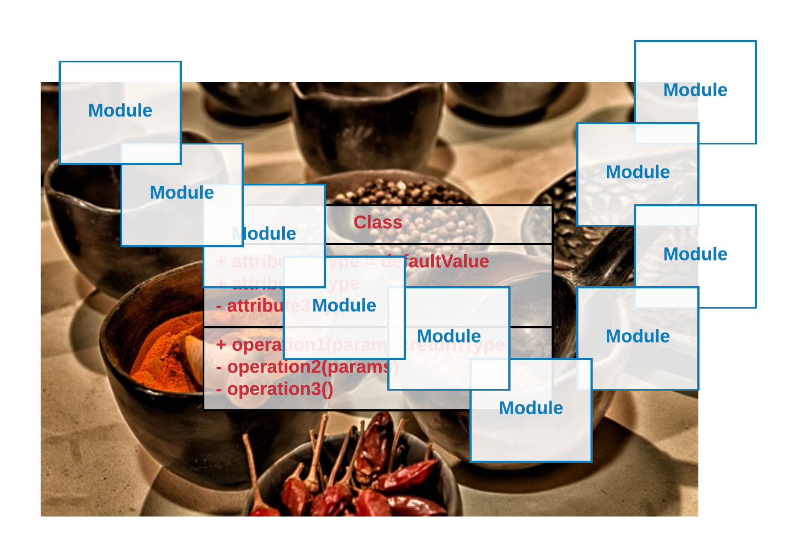

Ruby offers the tool of modules to allow for creating namespaces and also small software components that can be reused.
This is also a way for Ruby to balance the absence of multiple inheritance. You will find modules in every single Ruby
project. Hence, you need to understand very well how they work.
