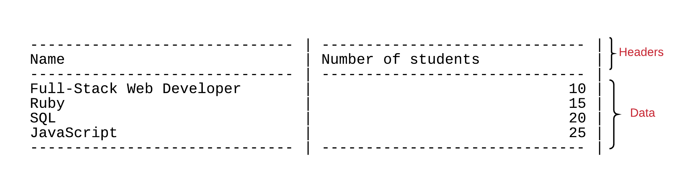

You are asked to implement a Ruby program that demonstrates the usage of mixins. Here is the skeleton of the main Ruby script of that program:

``` ruby
# File: print_data.rb
#
# .... any require files will go here .... #

courses = []
courses << Course.new('Full-Stack Web Developer', 10)
courses << Course.new('Ruby', 15)
courses << Course.new('SQL', 20)
courses << Course.new('JavaScript', 25)

puts '---- Courses :'
courses.print

students = []
students << Student.new('John', 'Smith')
students << Student.new('George', 'Papas')
students << Student.new('Maria', 'Foo')
students << Student.new('Paul', 'Adam')

puts '---- Students :'
students.print

puts '---- Empty Array :'

empty_array = []
empty_array.print
```

The program seems to be quite simple. Here are some notes that you need to be aware of in order to implement this program as required:

(1) It creates three arrays. First array is created and populated with instances of `Course` class.
 
(2) Second array is created and populated with instances of `Student` class.

(3) Third array is created but it is not populated with any elements. It is empty.

(4) When an array is populated then we ask the array to print itself (after the main program first prints a line like `---- Courses :'
or `---- Students :` or `---- Empty Array :` respectively).

(5) If you we run the program, we see this on the output:

``` bash
$ ruby print_data.rb
---- Courses :
------------------------------ | ------------------------------ | 
Name                           | Number of students             |
------------------------------ | ------------------------------ | 
Full-Stack Web Developer       |                             10 |
Ruby                           |                             15 |
SQL                            |                             20 |
JavaScript                     |                             25 |
------------------------------ | ------------------------------ | 
---- Students :
-------------------------------------------------- | -------------------------------------------------- | 
First name                                         | Last name                                          |
-------------------------------------------------- | -------------------------------------------------- | 
John                                               | Smith                                              |
George                                             | Papas                                              |
Maria                                              | Foo                                                |
Paul                                               | Adam                                               |
-------------------------------------------------- | -------------------------------------------------- | 
---- Empty Array :
$
```

(6) As you can see the output follows a pattern. First the headers are printed. Then the actual data are printed:



(7) Note that we call `#print` on the `Array` instances.

Pay attention to the lines `courses.print` and `students`.print`. We are calling `#print` on the `Array` instances. This means that we have enhanced
the `Array` class with a `#print` method.

(8) Note that the program should not fail if the array does not contain any elements like the `empty_array` instance. It should not print anything,
but it should not fail either.

(9) Note also that the column width used for printing for Courses is different from the one used for Students.

(10) Other than that, you will need to think about how to write a program that will be following the rules that we have learned so far.
You need to avoid any code duplication using modules and other techniques that we have learned in the previous chapters. Make your code
easy to read and easy to maintain and change.

**Important**: Your code needs to be uploaded into a new project on your Github account. Invite your mentor to review your code online.
