We have discussed about Classes and Objects while learning about Object-Oriented Programming. These are the two typical
artefacts exposed by most of the object-oriented programming languages.

However, Ruby has a feature that is not found frequently. Its Classes are actually Objects themselves, i.e. they are
instances of the `Class` class. 

## ./images/Ruby Object Model

This picture is depicting the Ruby object model and you need to make sure that you understand it very well.

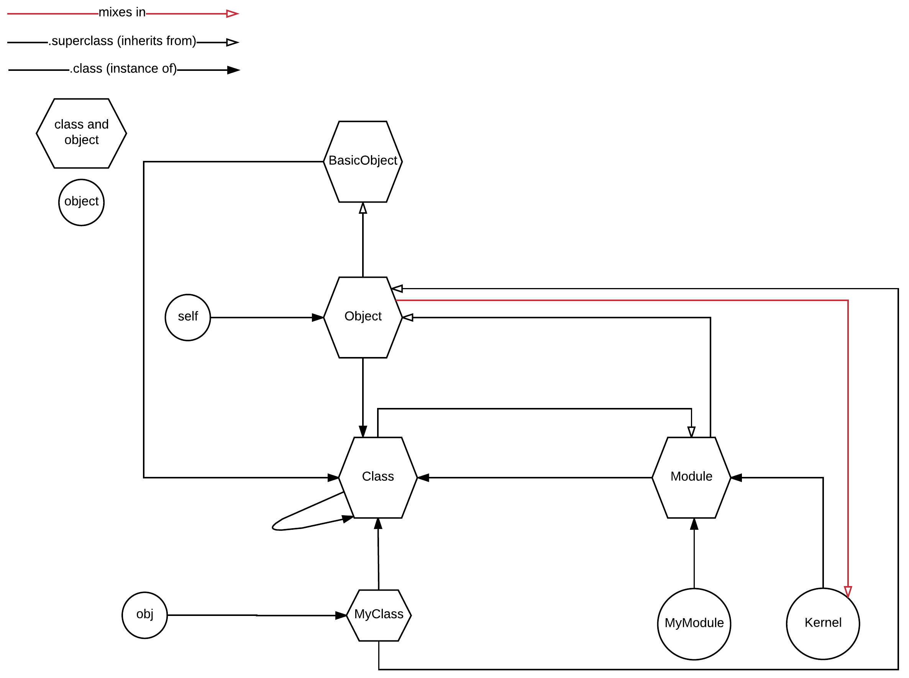

Let's work on the details of this picture together:

## Some Things Are Both Classes And Objects

The diagram depicts objects and classes. But, actually, there are not classes. Only objects. To be more accurate,
some of the artefacts are both classes and objects.
 
I know that this might be confusing to you, so, let's make sure we understand the following as basics:

(1) If *one thing is instance of another*, then that *one thing* is an *object* and the *other thing* is a *class*.

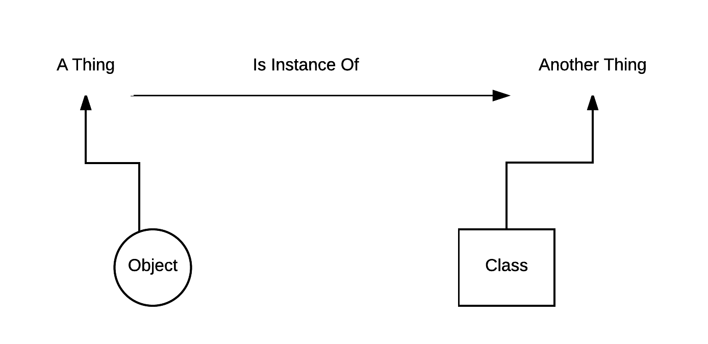

(2) The above does not mean that the *other thing* cannot be an instance of *another, third, thing* too. In that case, this *other thing* is
an *object* too (whereas *the other third thing* is a *class* according to definition (1) above).

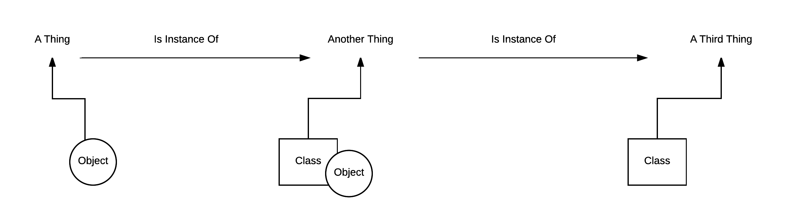

(3) Whenever something is instance of a Class, i.e. whenever something *is a* Class, then it responds to `.new` and can create instances. This goes hand-in-hand
with the statement that classes are used to instantiate objects.
 
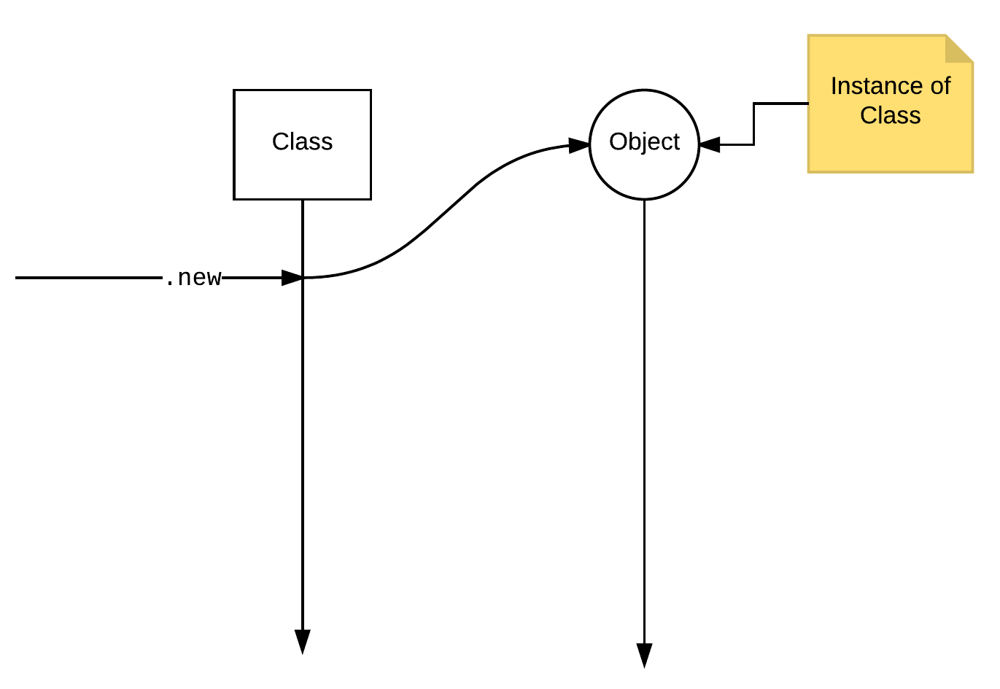
 
Or is it more accurate? Since there are not actually pure classes, and every class is actually an object too?

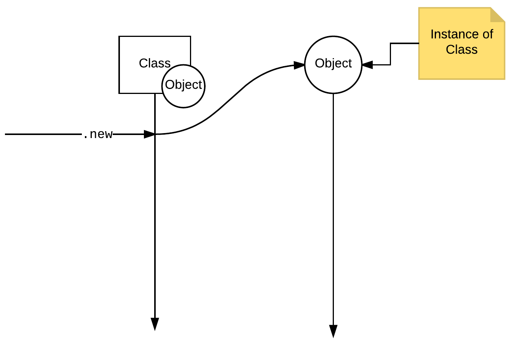

(4) When something is a class, it responds to `superclass` which gives its parent class (or `nil` if it does not derive from another class). When something is an object,
it responds to `class` which gives the class constant that this object is instance of. When something is both a class and an object, it responds to both of these two methods.
However, when something is an object, but not a class, it responds only to `class`.

Have these four things always in your mind. They will help you understand the ideas presented in this chapter. It's not easy, I agree, especially if you are used
to classic object-oriented programming. The concept that something can be both a class and an object is not present in classic OOP.
 
## Define a Class and an Instance of That Class 

Let's define a class and an object:

``` ruby
class MyClass
end

obj = MyClass.new
```

How many objects do you see here? The easy answer is 1. The `obj`. The accurate answer is:

1. the object `obj`, which is instance of `MyClass`.
1. the object `MyClass`, which is instance of `Class`.

hence, 2 instances.

Let's confirm that:

``` ruby
class MyClass
end

obj = MyClass.new

puts "obj is instance of MyClass ? #{obj.instance_of?(MyClass)}. Class of obj is: #{obj.class}"
puts "MyClass is instance of Class ? #{MyClass.instance_of?(Class)}. Class of MyClass is: #{MyClass.class}"
```

If you run the above, it will print this:

``` bash
obj is instance of MyClass ? true. Class of obj is: MyClass
MyClass is instance of Class ? true. Class of MyClass is: Class
```

Hence, when defining a class, like `MyClass` above, you actually define an instance of the class `Class`. 

In other words, `MyClass` is both a class and an object.

## What about the `Class`?

Is the `Class` a class or an object? Or both?

``` ruby
puts "Class is instance of Class ? #{Class.instance_of?(Class)}. Class of Class is: #{Class.class}"
```

which will print:

``` bash
Class is instance of Class ? true. Class of Class is: Class
```

This means that since

1. `MyClass` is an instance of `Class` (from the previous paragraph discussion), and
2. `Class` is an instance of `Class`,

then `Class` is both a class and an object!

## Here is what we have learned so far

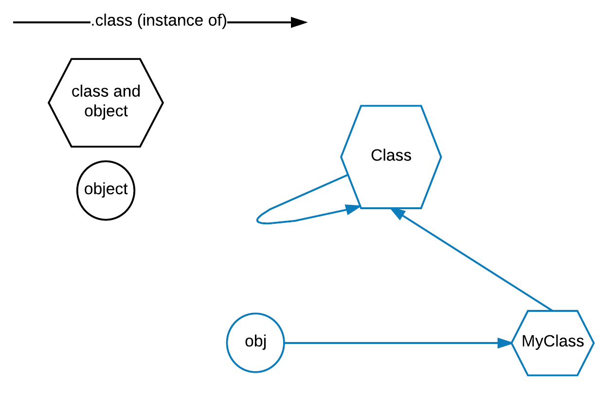

## What about `Module`?

Have we talked about `Module` in the past? No, we haven't. We have learned how to define new modules, but we have not talked
about the `Module` itself. `Module` is an instance of a `Class`. Let's see that:
 
``` ruby
puts "Module is instance of Class: #{Module.instance_of?(Class)}, Module.class is: #{Module.class}"
```

If you run the above, you will get this:

``` bash
Module is instance of Class: true, Module.class is: Class
```

This means that it is both a class and an object and it responds to `.new` to create new instances of `Module`. And this is what happens
whenever we define a new module. The new module defined is an instance of `Module`. Let's see that:

``` ruby
module MyModule
end

puts "MyModule is instance of Module: #{MyModule.instance_of?(Module)}, MyModule.class is: #{MyModule.class}"
```

If you run the above, you will get this:

``` bash
MyModule is instance of Module: true, MyModule.class is: Module
```

which proves that `MyModule` is instance of `Module`.

Let's put the above to our Ruby object model diagram:

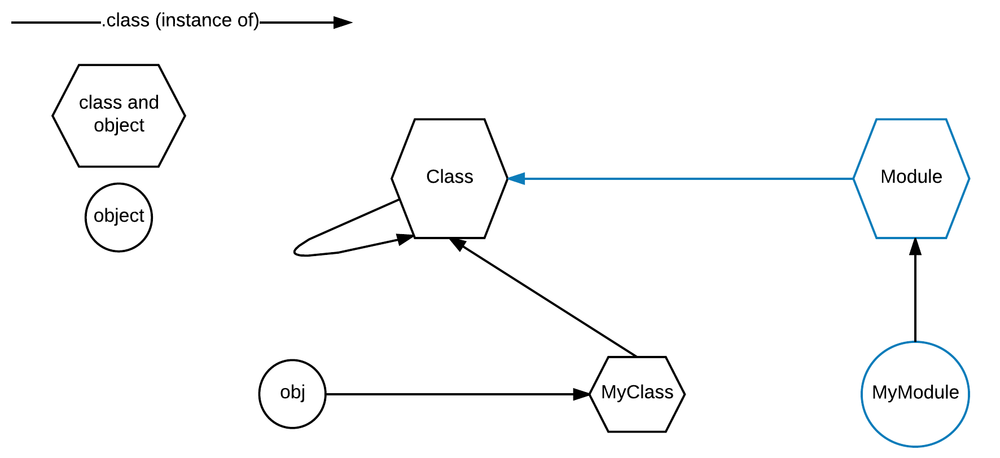

## Defining Classes With `.new`

We already know that `Class` is a class. This means that it responds to `.new` and it can create instances of `Class`. But, instances of `Class` are
the custom classes that we define, aren't they?

Look at the following code:

``` ruby
 1. class MyClass
 2.   def foo
 3.     puts "MyClass instance foo method"
 4.   end
 5. end
 6. 
 7. MySecondClass = Class.new
 8. 
 9. puts "MyClass is an instance of Class: #{MyClass.instance_of?(Class)}, MyClass.class is: #{MyClass.class}"
10. puts "MySecondClass is an instance of Class: #{MySecondClass.instance_of?(Class)}, MySecondClass.class is: #{MySecondClass.class}"
```

If you run this program, you will get this:

``` bash
MyClass is an instance of Class: true, MyClass.class is: Class
MySecondClass is an instance of Class: true, MySecondClass.class is: Class
```

The lines 1 till 5 define a class, named `MyClass` with the *traditional*, *conventional* class definition of Ruby. The line 7, defines a class with a *non-traditional*,
*non-conventional* method. But both, are correctly defined classes. Except from the fact that the second one does not have any methods. Otherwise, they are normal classes and
one can call `.new` on them to create instances:

``` ruby
 1. class MyClass
 2.   def foo
 3.     puts "MyClass instance foo method"
 4.   end
 5. end
 6. 
 7. MySecondClass = Class.new
 8. 
 9. my_class_instance = MyClass.new
10. my_class_instance.foo
11. 
12. my_second_class_instance = MySecondClass.new
13. 
14. puts "my_class_instance is instance of MyClass: #{my_class_instance.instance_of?(MyClass)}, my_class_instance.class is: #{my_class_instance.class}"
15. puts "my_second_class_instance is instance of MySecondClass: #{my_second_class_instance.instance_of?(MySecondClass)}, my_second_class_instance.class is: #{my_second_class_instance.class}"
```

On line 9, we create an instance of the class `MyClass`. On line 12, we create an instance of the class `MySecondClass`. If you run the above program,
you will get this:

``` bash
MyClass instance foo method
my_class_instance is instance of MyClass: true, my_class_instance.class is: MyClass
my_second_class_instance is instance of MySecondClass: true, my_second_class_instance.class is: MySecondClass
```

## Defining Methods On Classes Defined with `Class.new`

How can we define methods for classes that have been defined using the `Class.new` method? We can use a block to define its methods, or we can reopen the class
with the normal Ruby class definition method and add the methods:

``` ruby
1. MyClass = Class.new
2. 
3. class MyClass
4.   def foo
5.     puts "MyClass instance foo method"
6.   end
7. end
8. 
9. MySecondClass = Class.new do
10.   def foo
11.     puts "MySecondClass instance foo method"
12.   end
13. end
14. 
15. my_class_instance = MyClass.new
16. my_class_instance.foo
17. 
18. my_second_class_instance = MySecondClass.new
19. my_second_class_instance.foo
```

As you can see above, we define two classes, `MyClass` and `MySecondClass` with the *non-conventional* method, using `Class.new`. We also define the method `#foo`.
For `MyClass` the method `#foo` is defined by opening the class using the conventional class definition method in Ruby. On the other hand,
`MySecondClass` defines the method `#foo` at the moment we call the `Class.new` by sending a block `do..end` as block run-time argument to `.new`. That block
includes the `#foo` definition.

If you run the above program, you will get this:

``` ruby
MyClass instance foo method
MySecondClass instance foo method
```

## Defining Super Class when using `Class.new`

Fair enough. We have learned how to define a class with `Class.new` and, also, how to define its methods. How can we define a super-class of a new defined class
when we use the `Class.new` method of class definition? You only have to give the super-class constant as first run-time argument to the `.new` call.
Let's see that:

``` ruby
 1. class MyClass
 2.   def foo
 3.     puts "foo called on #{self.class} instance."
 4.   end
 5. end
 6. 
 7. MySecondClass = Class.new(MyClass)
 8. 
 9. my_class_instance = MyClass.new
10. my_class_instance.foo
11. 
12. my_second_class_instance = MySecondClass.new
13. my_second_class_instance.foo
14. 
15. puts "MySecondClass superclass is: #{MySecondClass.superclass}"
```

On line 7, we define a new class,`MySecondClass` as a sub-class of the class `MyClass`. For the definition, we use the `Class.new` method and we pass
as first run-time argument the name of constant class `MyClass`. 

If you run this program, you will get this:

``` bash
foo called on MyClass instance.
foo called on MySecondClass instance.
MySecondClass superclass is: MyClass
```

You can clearly see that the `#foo` method implementation has been inherited to `MySecondClass`. This is because `MySecondClass` is a sub-class of `MyClass`
thanks to line 7.

In other words...

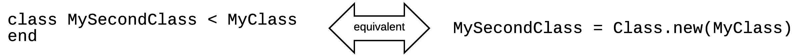

## Defining Modules with `Module.new`

Similarly to defining classes using `Class.new`, we can define modules using `Module.new` instead of the conventional `module <module name>..end` method.

Let's see an example:

``` ruby
 1. MyModule = Module.new do
 2.   def foo
 3.     puts "Module foo method"
 4.   end
 5. end
 6. 
 7. class MyClass
 8.   include MyModule
 9. end
10. 
11. my_class_instance = MyClass.new
12. my_class_instance.foo
```

The above example defines the module `MyModule` using the `Module.new` method. Then, it mixes `MyModule` into the definition of `MyClass` class.

## Modules are not Classes although `Module` is a `Class`

You need to understand one major difference between modules and classes. Modules are not classes. This means that they do not respond to `.new`.
However, `Module` is a `Class` and responds to `.new`. We have seen that earlier.

The fact that modules are not classes it means that we cannot create instances of them. Hence:

1. We can create instances of classes.
1. We cannot create instances of modules.

but

1. We can create instances of `Class`.
1. We can create instances of `Module`.

> Do you understand that? If not, please, go to the beginning of the chapter and study/practice those concepts again. You can always
ask your Mentor about these concepts here.

## `Class` is subclass of `Module`

`Class` is a sub-class of `Module`, or, in other words, `Class` has `Module` as its single superclass. 
`Class` has all the methods that `Module` has plus some extras.

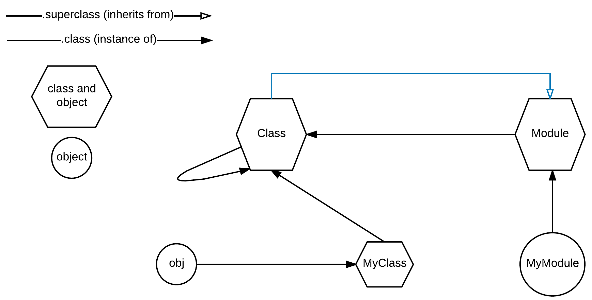

This irb snippet verifies the above:

``` ruby
2.2.3 :001 > Class.superclass
 => Module 
2.2.3 :002 > 
```

Remember that `Class` and `Module` are both classes and objects at the same time. But the `.superclass` method is related to the 
*class* aspect of those artefacts. It returns the parent class of a class.

## Get list of Instance Methods

As we already know, a subclass inherits the functionality offered by its superclass and, usually, it adds some extra. This means that the
instances of the subclass expose all the methods that the instances of the superclass do, plus some extra ones.

How can I get the instance methods exposed by the instances of a class? And in particular, how can I get the list of instance methods
exposed by the instances of the `Class` class? 

Given a class constant, the instance methods of the instances of that class can be derived by calling the method `.instance_methods` on that
class constant. Hence, the following gives the list of instance methods of the instances of the `Class` class:

``` ruby
2.2.3 :006 > Class.instance_methods
 => [:allocate, :new, :superclass, :freeze, :===, :==, :<=>, :<, :<=, :>, :>=, :to_s, :inspect, :included_modules, :include?, :name, 
 :ancestors, :instance_methods, :public_instance_methods, :protected_instance_methods, :private_instance_methods, :constants, :const_get, 
 :const_set, :const_defined?, :const_missing, :class_variables, :remove_class_variable, :class_variable_get, :class_variable_set, 
 :class_variable_defined?, :public_constant, :private_constant, :singleton_class?, :include, :prepend, :module_exec, :class_exec, 
 :module_eval, :class_eval, :method_defined?, :public_method_defined?, :private_method_defined?, :protected_method_defined?, 
 :public_class_method, :private_class_method, :autoload, :autoload?, :instance_method, :public_instance_method, :nil?, :=~, :!~, 
 :eql?, :hash, :class, :singleton_class, :clone, :dup, :itself, :taint, :tainted?, :untaint, :untrust, :untrusted?, :trust, :frozen?, 
 :methods, :singleton_methods, :protected_methods, :private_methods, :public_methods, :instance_variables, :instance_variable_get, 
 :instance_variable_set, :instance_variable_defined?, :remove_instance_variable, :instance_of?, :kind_of?, :is_a?, :tap, :send, 
 :public_send, :respond_to?, :extend, :display, :method, :public_method, :singleton_method, :define_singleton_method, :object_id, 
 :to_enum, :enum_for, :equal?, :!, :!=, :instance_eval, :instance_exec, :__send__, :__id__] 
2.2.3 :007 > 
```
But, this is the list of methods inherited from the superclass too. In that particular case, from `Module` which is the superclass of `Class`.

Can we get the list of instance methods without the inherited ones? Yes. We only have to pass the value `false` as the first run-time
argument to the call:

``` ruby
2.2.3 :007 > Class.instance_methods(false)
 => [:allocate, :new, :superclass] 
2.2.3 :008 > 
```

Bingo! The `Class` definition defines three instance methods. All the other methods listed by `Class.instance_methods` are methods inherited
from the `Module` superclass.

Note the method `.new`. This means that the instances of `Class` class, i.e. all class definitions, respond to `.new`, i.e. they can create
instances. We already knew that of course. This is only another point we encounter this.

Does the instances of `Module` have a `.new` method? We've said that, given a module, we cannot create instances of it. This means that the
list of instance methods of the `Module` class does not include the `.new` method, like the list of instance methods of `Class` class does:

``` irb
2.2.3 :009 > Module.instance_methods.include? :new
 => false 
2.2.3 :010 > Class.instance_methods.include? :new
 => true 
2.2.3 :011 > 
```

## Ruby program `self` instance

We have already talked about the `self` instance available when we start a Ruby program. Try this ruby program:

``` ruby
1. # File: self-1.rb
2. #
3. puts "self class: #{self.class}"
```

If you run this program, you will get this:

``` bash
$ ruby self-1.rb
self class: Object
$
```

This is a new class for us. It has the name `Object`. And `self` is an instance of `Object`. Having said that, run the following program:

``` ruby
# File: self-2.rb
#
puts "self is instance of Object: #{self.instance_of?(Object)}"
```

This will print:

``` bash
$ ruby self-2.rb
self is instance of Object: true
$
```

## `Object` is Instance of `Class`

Fair enough. `self` is instance of `Object`. What about `Object`? Is it a class? Is it an object? Or both? `Object` is both a class (since we
saw that it is the class of the `self`, for example) and it is an object as it is proven below, because it is instance of `Class`. Run this:

``` ruby
puts "Object is instance of Class: #{Object.instance_of?(Class)}, Object class is : #{Object.class}"
```

and you will get this:

``` bash
Object is instance of Class: true, Object class is : Class
```

Nice and clear. Let's see our current understanding of the Ruby object model:

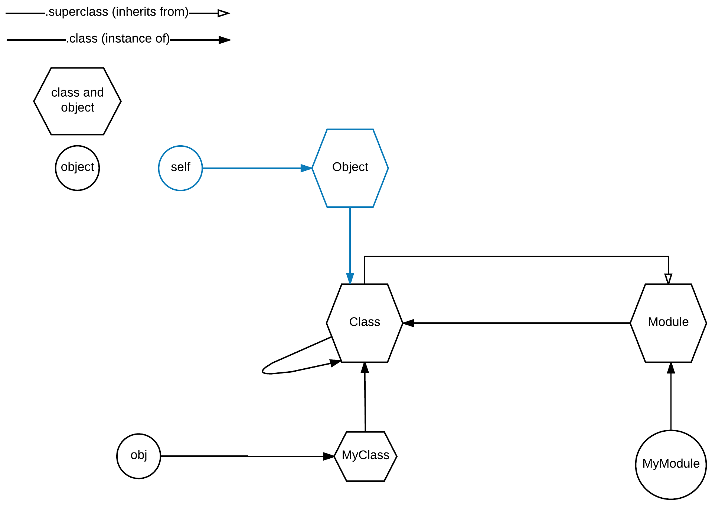

## `Module` superclass

Now that we know about `Object`, let's try this:

``` ruby
2.2.3 :001 > Module.superclass
 => Object 
2.2.3 :002 > 
```

This means that the `Module` class derives some functionality from the `Object` class. You can always *play* with the `.instance_methods` and `.instance_methods(false)` 
on the `Module` in order to see which methods are actually defined by `Module` and which ones are derived from `Object`. We will not do that now.

This is the new version of our understanding of the Ruby object model:

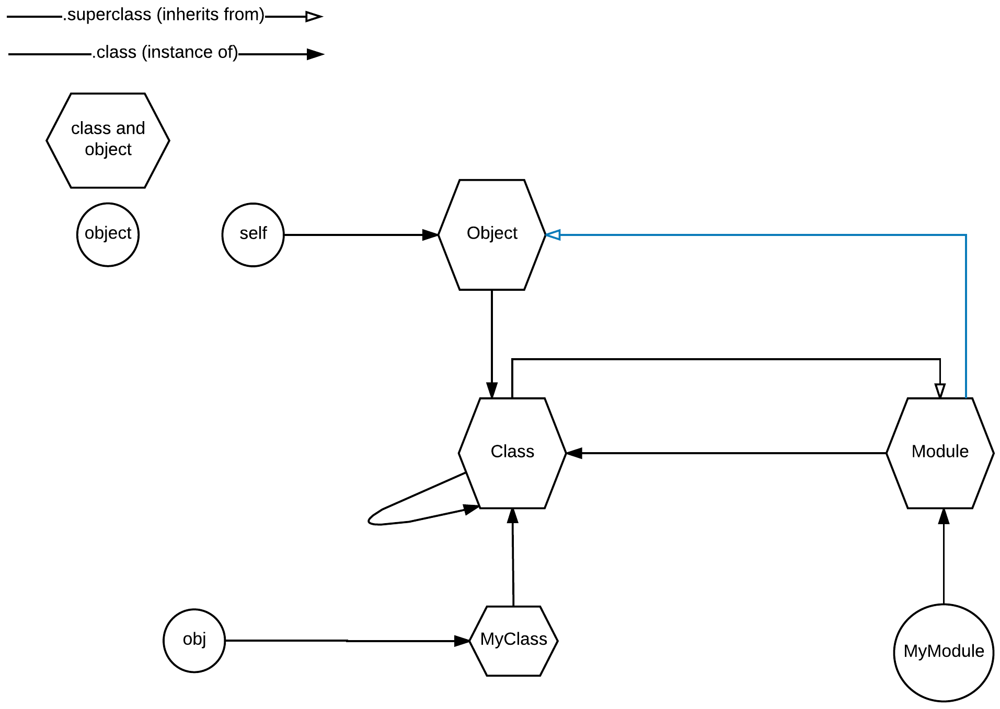

## `Object` superclass

Does `Object` have a superclass? Yes, it does. It is the `BasicObject`:

``` ruby
2.2.3 :007 > Object.superclass
 => BasicObject 
2.2.3 :008 > 
```

This means that `Object` instances, like `self` take some methods from `BasicObject` and some methods from `Object`.

But what is `BasicObject`? Is it a class, an object or both? `BasicObject` is an instance of `Class`, hence it is an object.
But, as we saw above, it is also the superclass of the `Object`. Hence it is a class too. 

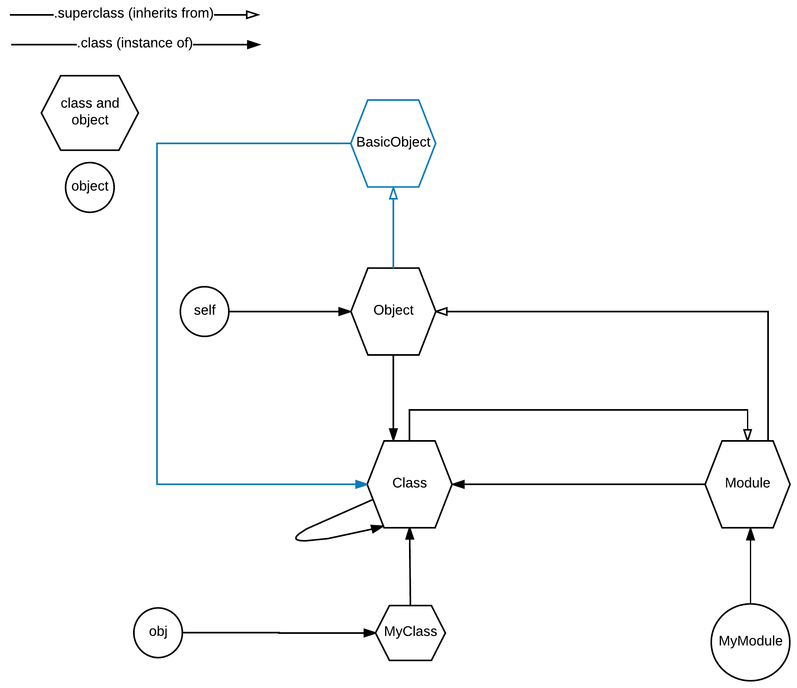

## All `Class` Instances Derive from `Object`

We have already learned that `Class.new` or `class <class name> ... end` creates a new class definition. What we didn't say is that 
whenever we create a new class definition, if that class definition does not define a superclass, then it is automatically defined as
subclass of the `Object` class. Hence, any class definition without explicit superclass has as its superclass the `Object` class.

Let's run this program:

``` ruby
class MyClass
end

puts "MyClass is instance of Class: #{MyClass.instance_of?(Class)}, MyClass.class: #{MyClass.class}"
puts "MyClass superclass is: #{MyClass.superclass}, which means that MyClass is an Object: #{MyClass.is_a?(Object)}"
```

We will get this:

``` ruby
MyClass is instance of Class: true, MyClass.class: Class
MyClass superclass is: Object, which means that MyClass is an Object: true
```

which proves that `MyClass` is a subclass of `Object` class:

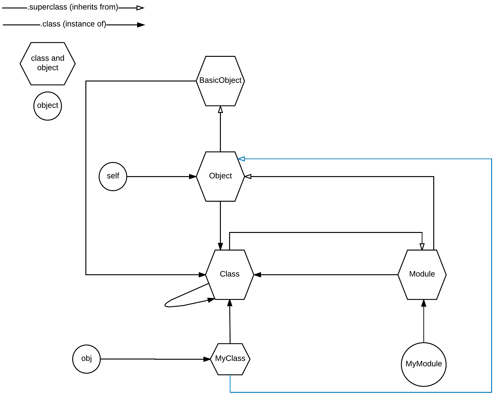

## Hence, All objects are `Object`s

How is the `obj` related to `Object` on Ruby object model?

We already know that `obj` is not an instance of `Object`, but it is an instance of `MyClass`. Try this:

``` ruby
class MyClass
end

obj = MyClass.new

puts "obj instance of Object? #{obj.instance_of?(Object)}"
puts "obj instance of MyClass? #{obj.instance_of?(MyClass)}"
```

which will give you this, if you run it:

``` bash
obj instance of Object? false
obj instance of MyClass? true
```

But, `obj` is a `MyClass`, without doubt, since it is responding with `true` as instance of `MyClass`. 

``` ruby
class MyClass
end

obj = MyClass.new

puts "obj instance of Object? #{obj.instance_of?(Object)}"
puts "obj instance of MyClass? #{obj.instance_of?(MyClass)}"
puts "obj is a? MyClass: #{obj.is_a?(MyClass)}"
```

If you run the above, you will get:

```
obj instance of Object? false
obj instance of MyClass? true
obj is a? MyClass: true
```

However, since `obj` is a `MyClass` and `MyClass` derives from `Object`, then `obj` is an `Object` too:

``` ruby
class MyClass
end

obj = MyClass.new

puts "obj instance of Object? #{obj.instance_of?(Object)}"
puts "obj instance of MyClass? #{obj.instance_of?(MyClass)}"
puts "obj is a? MyClass: #{obj.is_a?(MyClass)}"
puts "obj is a? Object: #{obj.is_a?(Object)}"
```

If you run the above, you will get this:

``` bash
obj instance of Object? false
obj instance of MyClass? true
obj is a? MyClass: true
obj is a? Object: true
```

This is why all instances in Ruby are actually `Object`s.

## `Kernel`, the Final Piece

There is a last artefact that we are interested in when we study the Ruby object model. It is called `Kernel`. It is not class.
It is only an object. And it is an object of the class `Module`. Hence it is a defined module.

``` ruby
2.2.3 :008 > Kernel.class
 => Module 
2.2.3 :009 > Kernel.instance_of?(Module)
 => true
2.2.3 :010 
```

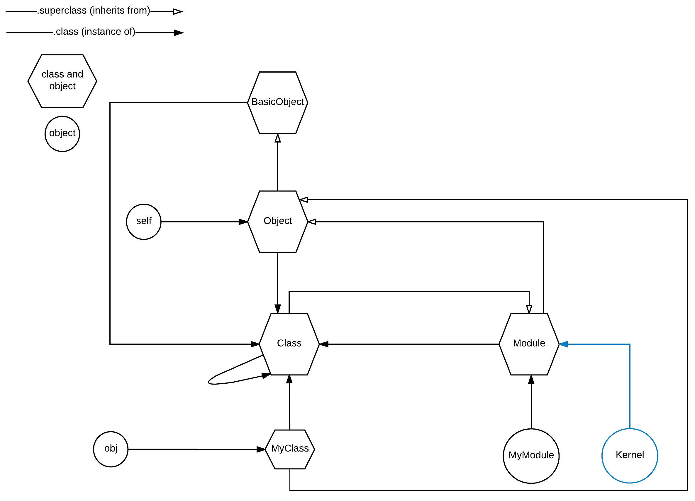

The `Kernel` module is defined by Ruby. Is it mixed in to any of the known classes? It is mixed in to `Object` class. Hence, some of the instance methods 
that instances of `Object` have, are taken from the `Kernel` module. In other words, since `Object` derives from `BasicObject` and mixes in `Kernel`, part
of its instance methods are from both `BasicObject` and `Kernel`. 


## `BasicObject` superclass?

We've said that `BasicObject` is both a class and object. Since it is a class, it responds to `superclass`, which returns the class it derives from:

``` ruby
2.2.3 :017 > BasicObject.superclass
 => nil 
2.2.3 :018 > 
```

We can see that `BasicObject` does not have any superclass it derives from. This means that it is at the top/root of the class hierarchy in Ruby.

## Object Equality

We have learned that all instances are `Object`s too. Because of that fact, there are some methods derived from `Object` that are exposed by all 
instances and have to do with equality comparison.

1. Method `#==`
1. Method `#===`
1. Method `#eql?`
1. Method `#equal?`

These methods implemented and exposed by `Object` do the same thing. They compare two objects by their `object_id` (something like a pointer
in RAM). If the two objects compared have the same `object_id` then these two objects return `true` for all of these methods. 
It is the responsibility of concrete sub-classes to differentiate this behaviour. We will see that in a while. First let's confirm that these
methods, by default, work as described:

``` ruby
 1. # File: equality-1.rb
 2. #
 3. class Person
 4.   def initialize(name)
 5.     @name = name
 6.   end
 7. end
 8. 
 9. john = Person.new('John')
10. john_ref = john
11. another_john = Person.new('John')
12. 
13. puts "John object id is: #{john.object_id}"
14. puts "John ref object id is: #{john_ref.object_id}"
15. puts "Another John object id is: #{another_john.object_id}"
16. 
17. puts "Is John == to John ref? : #{john == john_ref}"
18. puts "Is John === to John ref? : #{john === john_ref}"
19. puts "Is John eql? to John ref? : #{john.eql? john_ref}"
20. puts "Is John equal? to John ref? : #{john.equal? john_ref}"
21. 
22. puts "Is John == to Another John? : #{john == another_john}"
23. puts "Is John === to Another John? : #{john === another_john}"
24. puts "Is John eql? to Another John? : #{john.eql? another_john}"
25. puts "Is John equal? to Another John? : #{john.equal? another_john}"
```

If you run this program, you will see this:

``` bash
$ ruby equality-1.rb
John object id is: 70156420277360
John ref object id is: 70156420277360
Another John object id is: 70156420277020
Is John == to John ref? : true
Is John === to John ref? : true
Is John eql? to John ref? : true
Is John equal? to John ref? : true
Is John == to Another John? : false
Is John === to Another John? : false
Is John eql? to Another John? : false
Is John equal? to Another John? : false
$
```

The above verifies what we have said earlier. Only the variables pointing to the same object in memory are considered equal for all these methods.

## `==` Method

We've said that it might make sense, according to the problem at hand, to have your classes override the implementation of those methods. For example
comparing two `Person` instances might make sense to be done based on the actual value of their `@name` instance attribute.

Let's see some override examples and how they work. The following program `equality-2.rb` has the `Person` overriding the `==` method.

``` ruby
 1. # File: equality-2.rb
 2. #
 3. class Person
 4.   attr_reader :name
 5. 
 6.   def initialize(name)
 7.     @name = name
 8.   end
 9. 
10.   def ==(other)
11.     @name == other.name
12.   end
13. end
14. 
15. john = Person.new('John')
16. john_ref = john
17. another_john = Person.new('John')
18. 
19. puts "John object id is: #{john.object_id}"
20. puts "John ref object id is: #{john_ref.object_id}"
21. puts "Another John object id is: #{another_john.object_id}"
22. 
23. puts "Is John == to John ref? : #{john == john_ref}"
24. puts "Is John === to John ref? : #{john === john_ref}"
25. puts "Is John eql? to John ref? : #{john.eql? john_ref}"
26. puts "Is John equal? to John ref? : #{john.equal? john_ref}"
27. 
28. puts "Is John == to Another John? : #{john == another_john}"
29. puts "Is John === to Another John? : #{john === another_john}"
30. puts "Is John eql? to Another John? : #{john.eql? another_john}"
31. puts "Is John equal? to Another John? : #{john.equal? another_john}"
```

If you run this program, you will get this:

``` bash
$ ruby equality-2.rb
John object id is: 70204818341420
John ref object id is: 70204818341420
Another John object id is: 70204818341320
Is John == to John ref? : true
Is John === to John ref? : true
Is John eql? to John ref? : true
Is John equal? to John ref? : true
Is John == to Another John? : true
Is John === to Another John? : true
Is John eql? to Another John? : false
Is John equal? to Another John? : false
$
```

As you can see, now that we consider equal (using the operator `==`) two instances of `Person` that they have the same `@name`, the question `Is John == to Another John?`
returns `true` (whereas before, it was `false`). Also, note that the `===` operator now returns `true` too, whereas before it was `false`, even if we have not
defined its implementation. This means that the default `===` implementation is alias to the `==` implementation. In other words, when
we changed the definition of the `==` method that automatically rendered a new definition for the `===` method too.

However, methods `eql?` and `equal?` still return `false` when comparing `John` to `Another John`. 

## `===` Method

Although `===` is aliased to `==`, you have to know that the `===` operator is called `Case Equality Operator` because it is invoked
when comparing the value of a `case` statement to its `when` clauses. Let's work an example here. The program `equality-3.rb` is the
following:

``` ruby
 1. # File: equality-3.rb
 2. #
 3. class Person
 4.   attr_reader :name
 5. 
 6.   def initialize(name)
 7.     @name = name
 8.   end
 9. 
10.   def ==(other)
11.     @name == other.name
12.   end
13. 
14.   def ===(other)
15.     self.==(other) && other.instance_of?(self.class)
16.   end
17. end
18. 
19. class FakePerson
20.   attr_reader :name
21. 
22.   def initialize(name)
23.     @name = name
24.   end
25. end
26. 
27. john = Person.new('John')
28. another_john = Person.new('John')
29. fake_john = FakePerson.new('John')
30. 
31. puts "Is John == to Fake John? #{john == fake_john}"
32. 
33. case john
34.   when fake_john
35.     puts 'John is equal to Fake John'
36.   when another_john
37.     puts 'John is equal to Another John'
38.   else
39.     puts 'John is neither Fake nor Another John'
40. end
```

The above program specifies two classes, the `Person` and the `FakePerson`. Also, it implements both operators `==` and `===`, with different
implementations. The first one, `==`, considers a `Person` instance to be equal to the given argument `other`, if the given argument
responds to `#name` and, when called, returns a value which is equal to the `@name` of self. On other hand, the second one, i.e. `===`,
returns true if the `other` operand is also an instance of `Person` and not any instance that just responds to `#name`.

Later on, between lines 31 and 40, we prove that `john` object is considered equal (`==`) to `fake_john` object, but, it is not
considered *case equal* (`===`) to `fake_john`.

If you run the program, you will get this:

``` bash
$ ruby equality-3.rb
Is John == to Fake John? true
John is equal to Another John
$
```

As you can see, the comparison of `john` to `fake_john` on line 34 (`when fake_john`) returned false (whereas the comparison
of the same objects on line 31 returned `true`). This is because the comparison on line 34 is done in the context of a `case` statement,
and, in that case, the `===` operator is used.

## `eql?` Method

Let's see another example of object equality comparison. This is the program `equality-4.rb`:
 
``` ruby
 1. # File: equality-4.rb
 2. #
 3. class Person
 4.   attr_reader :name
 5. 
 6.   def initialize(name)
 7.     @name = name
 8.   end
 9. 
10.   def ==(other)
11.     @name == other.name
12.   end
13. 
14.   def ===(other)
15.     self.==(other) && other.instance_of?(self.class)
16.   end
17. end
18. 
19. john = Person.new('John')
20. another_john = Person.new('John')
21. 
22. h = {john => 36}
23. 
24. puts h[john]
25. puts h[another_john] 
```

We have already said, when discussing about Hashes, that we can use an object as a key to a Hash. This is what line 22 does above.
It creates a `Hash` instance, `h`, and uses the object instance `john` as the key.

If you run the above program you will get this:

``` bash
$ ruby equality-4.rb
36

$
```

The default behaviour of a Hash when retrieving the value of a specific key, is to try to locate the key using the object identity. 
That's why the line 25, `puts h[another_john]` does not return any value (like the `puts h[john]` does), even if `another_john` and
`john` are equal (their comparison with `==` returns `true`).

We can change this behaviour if we want. Let's see the following `equality-5.rb`:

``` ruby
 1. # File: equality-5.rb
 2. #
 3. class Person
 4.   attr_reader :name
 5. 
 6.   def initialize(name)
 7.     @name = name
 8.   end
 9. 
10.   def ==(other)
11.     @name == other.name
12.   end
13. 
14.   def ===(other)
15.     self.==(other) && other.instance_of?(self.class)
16.   end
17. 
18.   alias eql? ==
19. end
20. 
21. john = Person.new('John')
22. another_john = Person.new('John')
23. 
24. puts "John is == to Another John? #{john == another_john}"
25. puts "John is eql? to Another John? #{john.eql? another_john}"
26. 
27. h = {john => 36}
28. 
29. puts h[john]
30. puts h[another_john] 
```

This new version, `equality-5.rb` is not much different to the `equality-4.rb` version. It just makes sure that
the `eql?` method is aliased to the `==` method. This means that `john` is both `==` and `eql?` to `another_john`. 
However, this is not enough to make those objects equal in the context of locating keys into a hash. If you run the program
`equality-5.rb` you will get this:

``` bash
$ ruby equality-5.rb
John is == to Another John? true
John is eql? to Another John? true
36

$
```

As you can see, the `h[another_john]` does not return `36`. Even if `john` is now both `==` and `eql?` to `another_john`. 

In order for two objects to be considered *same hash keys*, besides the fact that they have to be `eql?`, they
also have to return the same `#hash` integer value. The method `#hash` is a method that needs to be returned
by every object (it has default implementation from `Object`) and uniquely identifies an object within a `Hash` bucket.

Let's run the program `equality-6.rb` which prints the hashes of the two objects:

``` ruby
 1. # File: equality-6.rb
 2. #
 3. class Person
 4.   attr_reader :name
 5. 
 6.   def initialize(name)
 7.     @name = name
 8.   end
 9. 
10.   def ==(other)
11.     @name == other.name
12.   end
13. 
14.   def ===(other)
15.     self.==(other) && other.instance_of?(self.class)
16.   end
17. 
18.   alias eql? ==
19. end
20. 
21. john = Person.new('John')
22. another_john = Person.new('John')
23. 
24. puts "John is == to Another John? #{john == another_john}"
25. puts "John is eql? to Another John? #{john.eql? another_john}"
26. 
27. puts "John hash: #{john.hash}"
28. puts "Another John Hash: #{another_john.hash}"
29. 
30. h = {john => 36}
31. 
32. puts h[john]
33. puts h[another_john]
```

If you run this program, you will get this:

``` bash
$ ruby equality-6.rb
John is eql? to Another John? true
John hash: 3033491333099022142
Another John Hash: -2179289782505944066
36

$
```

You can see how different are the hash keys for the two objects. If we change the implementation of the `#hash` method to return
a hash key that is based on the instance attribute values, then two objects with same instance attribute values would return the same key.

Let's do that. See the implementation `equality-7.rb`:

``` ruby
 1. # File: equality-7.rb
 2. #
 3. class Person
 4.   attr_reader :name
 5. 
 6.   def initialize(name)
 7.     @name = name
 8.   end
 9. 
10.   def ==(other)
11.     @name == other.name
12.   end
13. 
14.   def ===(other)
15.     self.==(other) && other.instance_of?(self.class)
16.   end
17. 
18.   alias eql? ==
19.   
20.   def hash
21.     @name.hash
22.   end
23. end
24. 
25. john = Person.new('John')
26. another_john = Person.new('John')
27. 
28. puts "John is == to Another John? #{john == another_john}"
29. puts "John is eql? to Another John? #{john.eql? another_john}"
30. 
31. puts "John hash: #{john.hash}"
32. puts "Another John Hash: #{another_john.hash}"
33. 
34. h = {john => 36}
35. 
36. puts h[john]
37. puts h[another_john]
```

You can see that we now implement the `#hash` method to return the `#hash` result when called on the `@name` attribute of the `Person`.
Note that `@name` is an object (a `String`) and it already has a default implementation which is enough for our case.

Let's try to run the program `equality-7.rb`:

``` bash
$ ruby equality-7.rb
John is == to Another John? true
John is eql? to Another John? true
John hash: 4403908512944791373
Another John Hash: 4403908512944791373
36
36
$
```

Bingo! `h[another_john]` and `h[john]` now return the same value. This is because the instances used to locate the value in the hash `h`
are the same hash keys.

Note that if we don't consider these two instances `eql?` then, the two instances are not the same hash keys. Let's see the `equality-8.rb`.

``` ruby
 1. # File: equality-8.rb
 2. #
 3. class Person
 4.   attr_reader :name
 5. 
 6.   def initialize(name)
 7.     @name = name
 8.   end
 9. 
10.   def ==(other)
11.     @name == other.name
12.   end
13. 
14.   def ===(other)
15.     self.==(other) && other.instance_of?(self.class)
16.   end
17. 
18.   def hash
19.     @name.hash
20.   end
21. end
22. 
23. john = Person.new('John')
24. another_john = Person.new('John')
25. 
26. puts "John is == to Another John? #{john == another_john}"
27. puts "John is eql? to Another John? #{john.eql? another_john}"
28. 
29. puts "John hash: #{john.hash}"
30. puts "Another John Hash: #{another_john.hash}"
31. 
32. h = {john => 36}
33. 
34. puts h[john]
35. puts h[another_john]
```

The difference to `equality-7.rb` is the removal of the `alias eql? ==`. This means that we have turned the `eql?` implementation to
be the default one derived from `Object`. If you run the program you will see that the `h[another_john]` does not locate the
value `36` in the hash anymore.

``` bash
$ ruby equality-8.rb
John is == to Another John? true
John is eql? to Another John? false
John hash: 4266479361867181839
Another John Hash: 4266479361867181839
36

$
```

It is compulsory, in order for two objects to be considered the same hash keys, to be both `eql?` and to return the same `#hash` integer value.

## `#hash` for Complex Objects

If an object has more than one instance attribute, then you might want to implement `eql?` in such a way that it would take into account all
instance attributes. In that case, the `#hash` implementation would need to take into account all attributes too.

Let's see the program `equality-9.rb`:

``` ruby
 1. # File: equality-9.rb
 2. #
 3. class Person
 4.   attr_reader :first_name, :last_name
 5. 
 6.   def initialize(first_name, last_name)
 7.     @first_name = first_name
 8.     @last_name = last_name
 9.   end
10. 
11.   def ==(other)
12.     @first_name == other.first_name && @last_name == other.last_name
13.   end
14. 
15.   def ===(other)
16.      self.==(other) && other.instance_of?(self.class)
17.   end
18. 
19.   alias eql? ==
20. 
21.   def hash
22.     [@first_name, @last_name].hash
23.   end
24. end
25. 
26. john = Person.new('John', 'Papas')
27. another_john = Person.new('John', 'Papas')
28. 
29. puts "John is == to Another John? #{john == another_john}"
30. puts "John is eql? to Another John? #{john.eql? another_john}"
31. 
32. puts "John hash: #{john.hash}"
33. puts "Another John Hash: #{another_john.hash}"
34. 
35. h = {john => 36}
36. 
37. puts h[john]
38. puts h[another_john]
```

If you run this program, you will see this:

``` bash
$ ruby equality-9.rb
John is == to Another John? true
John is eql? to Another John? true
John hash: -1324078635954612234
Another John Hash: -1324078635954612234
36
36
$
```

We have managed to generate the correct hash keys for the object instances of `Person`, thanks to the `#hash` call on the `Array` instance
on line 22: `[@first_name, @last_name].hash`. So, no matter how many attributes should be used to compare two instances for equality,
we can put them inside an array and call the `#hash` method and come back with their hash keys.

## `equal?` Method

Usually, `equal?` method is not overridden. We need one method to compare the actual object_id, i.e. to find out whether two variables
refer to the same object in memory. And this is the method that we usually use. Hence, we leave the default implementation derived from `Object` 
intact.

## Sorting

Comparing objects for equality might not be enough. You might want to find which one is bigger than the other. This is useful, for example,
when you want to sort the items in a collection.

Let's see the following example: `sorting-1.rb`:

``` ruby
 1. # File: sorting-1.rb
 2. #
 3. class Person
 4.   attr_reader :name
 5. 
 6.   def initialize(name)
 7.     @name = name
 8.   end
 9. 
10.   def ==(other)
11.     @name == other.name
12.   end
13. 
14.   def ===(other)
15.     self.==(other) && other.instance_of?(self.class)
16.   end
17. 
18.   def hash
19.     @name.hash
20.   end
21. end
22. 
23. john = Person.new('John')
24. bob = Person.new('Bob')
25. 
26. collection = [john, bob]
27. 
28. puts 'Collection before sorting: '
29. puts collection.inspect
30. 
31. collection.sort!
32. 
33. puts 'Collection after sorting: '
34. puts collection.inspect
```

The above program creates an `Array`, saved into `collection` variable. The `collection` has two items, both instances of `Person` class.
First is the `john` and then is the `bob` instance. On line 29 it prints the contents of the collection. Then on line 31 it calls the `#sort!`
that would sort the collection. And then on line 34 it prints the collection again.

If you run the program `sorting-1.rb` you will see this:

``` bash
$ ruby sorting-1.rb
Collection before sorting: 
[#<Person:0x007fd274984308 @name="John">, #<Person:0x007fd2749842b8 @name="Bob">]
sorting-1.rb:31:in `sort!': comparison of Person with Person failed (ArgumentError)
        from sorting-1.rb:31:in `<main>'
$
```

Although the collection was printed without problem (first 'John', then 'Bob'), before the sorting, the sorting itself failed. And the error
message is quite informative: `comparison of Person with Person failed`. The array instance `collection`, although it exposes the `#sort!` method
like all `Array` instances do, it does not know how to sort items that are instances of `Person`. Does not know which is the logic to compare two items. 

`sorting-2.rb` tries to remedy this. It gives `#sort!` call a block with the comparison logic:

``` ruby
 1. # File: sorting-2.rb
 2. #
 3. class Person
 4.   attr_reader :name
 5. 
 6.   def initialize(name)
 7.     @name = name
 8.   end
 9. 
10.   def ==(other)
11.     @name == other.name
12.   end
13. 
14.   def ===(other)
15.     self.==(other) && other.instance_of?(self.class)
16.   end
17. 
18.   def hash
19.     @name.hash
20.   end
21. end
22. 
23. john = Person.new('John')
24. bob = Person.new('Bob')
25. 
26. collection = [john, bob]
27. 
28. puts 'Collection before sorting: '
29. puts collection.inspect
30. 
31. collection.sort! do |one, other|
32.   if one.name < other.name
33.     -1
34.   elsif one.name > other.name
35.     1
36.   else
37.     0
38.   end
39. end
40. 
41. puts 'Collection after sorting: '
42. puts collection.inspect
```

The block passed to `#sort!` compares the two arguments' `name`s. That block 

1. should return an integer less than 0 (we return -1) if the `one` is supposed to be *before* the `other` operand.
2. should return an integer greater than 0 (we return 1) if the `one` is supposed to be *after* the `other` operand.
3. should return 0 if the `one` should be at the same sorting position as the `other` operand.

Having done that, `#sort!` now knows how to compare two `Person` instances, and hence, knows how to sort the collection. 
Run the program:

``` bash
$ ruby sorting-2.rb
Collection before sorting: 
[#<Person:0x007fd8dd0843b0 @name="John">, #<Person:0x007fd8dd084360 @name="Bob">]
Collection after sorting: 
[#<Person:0x007fd8dd084360 @name="Bob">, #<Person:0x007fd8dd0843b0 @name="John">]
$
```
You can now see that `#sort!` worked without problem and, actually, it sorted the items of the collection in the correct order.

## The Spaceship `<=>` operator

Note that `String` class offers a method `#<=>` (called spaceship operator) that already implements the correct logic to compare two strings alphabetically.
In other words, `String` objects respond to `#<=>` and return one of `-1`, `0` or `-1` depending on the relative alphabetical order
of the receiver to the argument given.

For example, `"Foo".<=>("Bar")` returns `1`:

``` ruby
$ irb
2.2.3 :001 > "Foo".<=>("Bar")
 => 1 
2.2.3 :002 > 
```

This means, that our `Person` comparison logic can rely on this fact and the block given to `#sort!` can be much simpler. See the
program `sorting-3.rb`:

``` ruby
 1. # File: sorting-3.rb
 2. #
 3. class Person
 4.   attr_reader :name
 5. 
 6.   def initialize(name)
 7.     @name = name
 8.   end
 9. 
10.   def ==(other)
11.     @name == other.name
12.   end
13. 
14.   def ===(other)
15.     self.==(other) && other.instance_of?(self.class)
16.   end
17. 
18.   def hash
19.     @name.hash
20.   end
21. end
22. 
23. john = Person.new('John')
24. bob = Person.new('Bob')
25. 
26. collection = [john, bob]
27. 
28. puts 'Collection before sorting: '
29. puts collection.inspect
30. 
31. collection.sort! { |one, other| one.name <=> other.name }
32. 
33. puts 'Collection after sorting: '
34. puts collection.inspect
```

Can you see how the block logic has been simplified? If you run this program, you will get the same result as before.

Note that we can simplify the call to `#sort!` on line 31 even more, if we transfer the comparison logic to the class `Person`.
See the program `sorting-4.rb`:

``` ruby
 1. # File: sorting-4.rb
 2. #
 3. class Person
 4.   attr_reader :name
 5. 
 6.   def initialize(name)
 7.     @name = name
 8.   end
 9. 
10.   def ==(other)
11.     @name == other.name
12.   end
13. 
14.   def ===(other)
15.     self.==(other) && other.instance_of?(self.class)
16.   end
17. 
18.   def hash
19.     @name.hash
20.   end
21. 
22.   def <=>(other)
23.     @name <=> other.name
24.   end
25. end
26. 
27. john = Person.new('John')
28. bob = Person.new('Bob')
29. 
30. collection = [john, bob]
31. 
32. puts 'Collection before sorting: '
33. puts collection.inspect
34. 
35. collection.sort!
36. 
37. puts 'Collection after sorting: '
38. puts collection.inspect
```

The line that calls sorting is now very simple: `collection.sort!`. However, we have added the method implementation `#<=>` inside the class definition `Person`.
That makes the `Array` `collection` to know how to sort its items. Run the program `ruby sorting-4.rb` and you will see the collection being sorted
without any problem.

## Closing Note

Study and practice this chapter many times. It is very important to understand how the Ruby object model works. What is a class, what is an object
and what is both a class and an object.

Also, spend some time reading the Ruby references below:

* [BasicObject](https://ruby-doc.org/core-2.3.3/BasicObject.html)
* [Object](https://ruby-doc.org/core-2.3.3/Object.html)
* [Class](https://ruby-doc.org/core-2.3.3/Class.html)
* [Module](https://ruby-doc.org/core-2.3.3/Module.html)
* [Kernel](https://ruby-doc.org/core-2.3.3/Kernel.html)

> *Note:* We have used the term *class constant*. Bear in mind that class name start with an uppercase Latin alphabet letter. Hence, in Ruby terms,
these are constants. Class and Module names are constants. We will have a separate chapter on constants and how they are being treated in Ruby.
