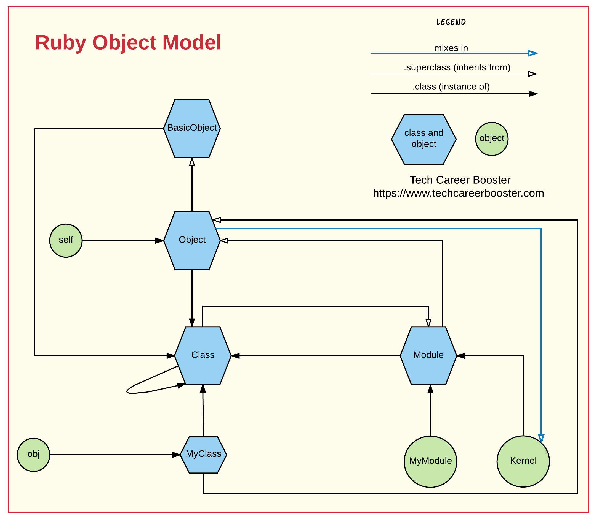

They say that Ruby has only objects and everything is an object. In this chapter we learn about the Ruby object model. If you manage
to harness the knowledge around it, then you will be able to take advantage of all the awesome features that meta-programming
capabilities of Ruby offers to you.
