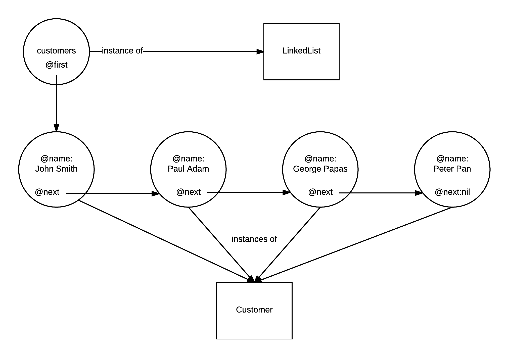
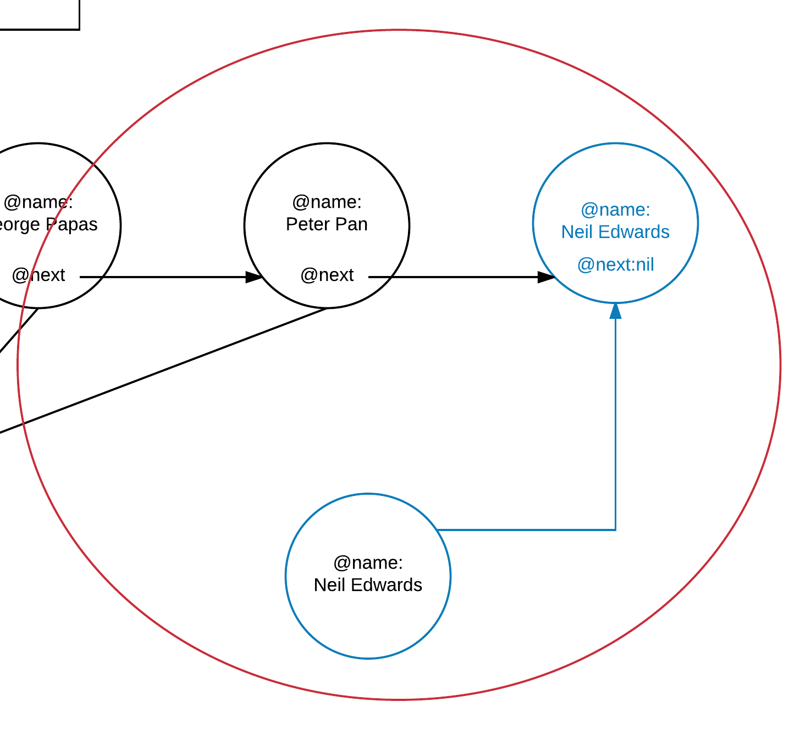
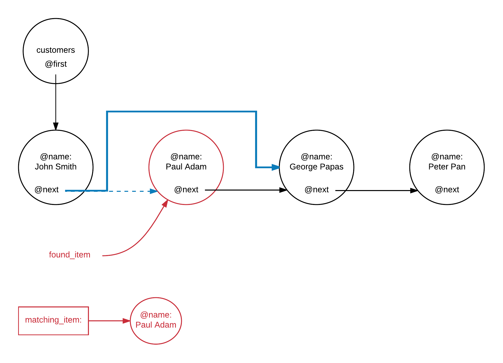
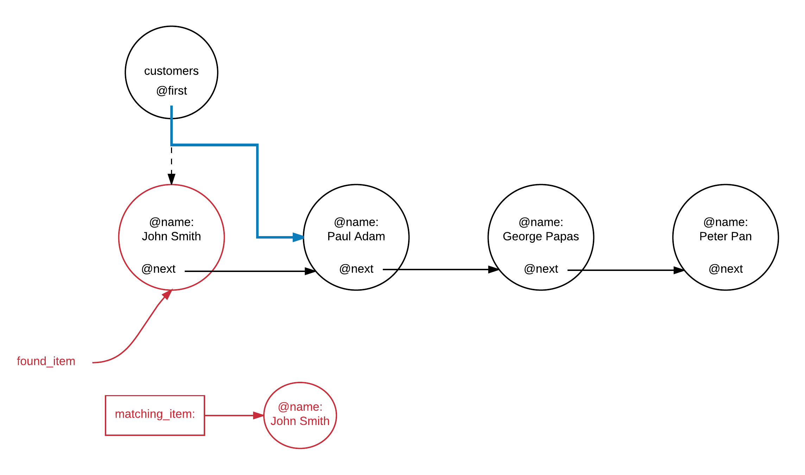
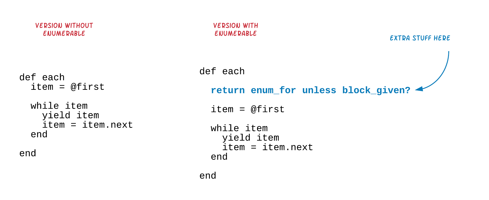

Simply Linked lists are lists of objects, one chained to the other, as in the following diagram:



The above picture depicts an instance of a linked list. The instance is saved into the variable `customers`. The linked list is modeled
with a `LinkedList` class. Each item in the list is modeled with the `Customer` class. Also, each item is pointing to the next item in the
list via the instance variable `@next`. The `@next` attribute of the last item in the list has value `nil`, which means, it does not point
to any item (since it is the last one).

## Linked List Implementation

We need to implement the linked list in such a way so that it can be used to hold any type of items. Not only `Customer` instances. Let's go:

## Linked List Class

Let's start with the `LinkedList` class implementation. In fact, we initially provide the skeleton of this class and what we would expect from this
class to offer as a set of public methods, i.e. as an interface.

``` ruby
 1. # File: linked_list.rb
 2. #
 3. class LinkedList
 4.   def initialize
 5.     @first = nil
 6.   end
 7. 
 8.   # @param item [LinkedListItem]
 9.   #    The method adds the item to the end of the list.
10.   #
11.   def add(item)
12.   end
13. 
14.  # @param matching_item
15.  #    The method will remove the first item matching the item given as matching_item
16.  #
17.  def remove(matching_item)
18.  end
19. 
20.   # This method returns the String representation of the List
21.   #
22.   def to_s
23.   end
24. end
```

The above is a skeleton of the class `LinkedList`. Initially, the instance of such a list, sets its `@first` instance variable to have the value `nil`.
Hence, implying that the list if empty. Client code will then use the methods `#add` and `#remove` to add and remove items from the list.

The above skeleton also implies that there is another class that should be defined, the class `LinkedListItem`. It does not really tell us about 
how this class should be defined, but it is needed to represent the items that will be added to the list. We will define this class later on as we
progress the implementation of our `LinkedList`.

## Instantiating the List

Instantiating the list will be something like this:

``` ruby
customers = LinkedList.new
```

Quite simple. This will create an instance of the `LinkedList` that will be holding no items. 

## Adding an Item

Adding an item to the list will require the following statements by the client code:

``` ruby
customer = Customer.new('John Smith')
customers.add(customer)
```

`Customer` class is something very simple, at least for the example we are working on:

``` ruby
1. # File: customer.rb
2. #
3. class Customer
4.   def initialize(name)
5.     @name = name
6.   end
7. end
```

But how about the actual `#add` method implementation? Our linked list only knows about the `@first` item.
Not the last one. Hence, it needs to travel from first till the last item before adding the new one. In other words,
as long as there is a pointer to the last item in the list, we can set its `next` property to the new item and we are done.
Also, we should not forget that we need to make sure that the new item added has its `next` property set to `nil`, in order
to flag the end of the list.



``` ruby
 1. # File: linked_list.rb
 2. #
 3. class LinkedList
 4.   def initialize
 5.     @first = nil
 6.   end
 7. 
 8.   # @param item [LinkedListItem]
 9.   #    The method adds the item to the end of the list.
10.   #
11.   def add(item)
12.     if last.nil?
13.       # the list is empty
14.       @first = item
15.     else
16.       last.next = item
17.     end
18.     item.next = nil
19.   end
20. 
21.  # @param matching_item
22.  #    The method will remove the first item matching the item given as matching_item
23.  #
24.  def remove(matching_item)
25.  end
26. 
27.   # This method returns the String representation of the List
28.   #
29.   def to_s
30.   end
31. 
32.   private
33. 
34.   def last
35.     return nil if @first.nil?
36.     result = @first
37. 
38.     while result.next
39.       result = result.next
40.     end
41. 
42.     result
43.   end
44. end
```

This is the new version of our `LinkedList` class. Look at the `#add` method. It uses the private method `last` to
have access to the last item in the list. If that is `nil`, then it just sets the `@first` pointing to the `item` being
added. If the `last` item points to an actual item of the list, then we only have to update its `.next` pointer to point to the new
item added. In any case, the new item added needs to have its `.next` pointer set to `nil`, since, this is going to be the last item
in the list.

Look how the `#last` method is implemented. 

1. It returns `nil` if `@first` is `nil`, because that means that the list is empty (line 35). Otherwise,
2. It travels from `@first` to last item using the local pointer `result`. And it returns the `result`. Goes from one item to the 
next via the `#next` method on the item.

Maybe, we can improve the readability of the class by introducing an `#empty?` method, that would return `true` if `@first` 
was `nil` or `false` if it wasn't.

``` ruby
 1. # File: linked_list.rb
 2. #
 3. class LinkedList
 4.   def initialize
 5.     @first = nil
 6.   end
 7. 
 8.   # @param item [LinkedListItem]
 9.   #    The method adds the item to the end of the list.
10.   #
11.   def add(item)
12.     if empty?
13.       @first = item
14.     else
15.       last.next = item
16.     end
17.     item.next = nil
18.   end
19. 
20.  # @param matching_item
21.  #    The method will remove the first item matching the item given as matching_item
22.  #
23.  def remove(matching_item)
24.  end
25. 
26.   # This method returns the String representation of the List
27.   #
28.   def to_s
29.   end
30. 
31.   private
32. 
33.   def last
34.     return nil if empty?
35.     result = @first
36. 
37.     while result.next
38.       result = result.next
39.     end
40. 
41.     result
42.   end
43. 
44.   def empty?
45.     @first.nil?
46.   end
47. end
```

Nice! 

Let's now try this. We are going to write the client program that would create the linked list of customers. Here it is (`main.rb`):

``` main
1. # File: main.rb
2. #
3. require_relative 'linked_list'
4. require_relative 'customer'
5. 
6. customers = LinkedList.new
7. 
8. customer = Customer.new('John Smith')
9. customers.add(customer)
```

The program instantiates the linked list on line 6. Then it instantiates a customer on line 8. Finally, on line 9, it adds the customer instance
to the linked list.

If you try to run this program, you will get this:

``` bash
$ ruby main.rb
...linked_list.rb:17:in `add': undefined method `next=' for #<Customer:0x007fccf9a9e3e0 @name="John Smith"> (NoMethodError)
        from main.rb:9:in `<main>'
$
```

Program is trying to call method `#next=` on the `Customer` instance. This happesn on line 17 of the file `linked_list.rb`. This line is this:

``` ruby
item.next = nil
```

from the `def add` definition.

This is easily explained. The `Customer` objects do not expose the method `#next=`. That's why we get this error. How shall we fix that?

Option 1: Add the method `#next=` to `Customer`. This means that the `Customer` instance acquires behaviour that is not related to a customer. It is behaviour
that has to do with the program internals, how to keep track of a list of customer. It is not an intrinsic customer behaviour. We wouldn't go with this option.

Option 2: Wrap the `Customer` instance into another object that would offer the same necessary behaviour and would allow the `Customer` instance to
be added to the list. I guess this is the time to introduce the `LinkedListItem` class:

``` ruby
 1. # File: linked_list_item.rb
 2. #
 3. class LinkedListItem
 4.   def initialize(item)
 5.     @item = item
 6.   end
 7. 
 8.   def next=(item)
 9.     @next = item
10.   end
11. end
```

The above class wraps whatever is given to its constructor and exposes the method `#next=` that is required by the `LinkedList#add` method. Let's modiy our `main.rb` program
to wrap the customer into such an instance:

``` ruby
 1. # File: main.rb
 2. #
 3. require_relative 'linked_list'
 4. require_relative 'customer'
 5. require_relative 'linked_list_item'
 6. 
 7. customers = LinkedList.new
 8. 
 9. customer = Customer.new('John Smith')
10. customers.add(LinkedListItem.new(customer)) 
```

As you can see, on line 10, we wrap the `customer` object into a `LinkedListItem` instance. Hence, the `#add` method will be able to call `#next=` on that. Let's try to run
the main program again:

``` bash
$ ruby main.rb
$
```

Nice. It seems that everything has gone ok. We have added the customer to the list without any problem. 

However, I see a small improvement that we can do. The line `customers.add(LinkedListItem.new(...))` makes the client code, being aware of the 
implementation details of the `LinkedList`. Why would the client code care about it? Why would the client code care about wrapping every object
to a `LinkedListItem` instance? I do not see that being a responsibility of the client code. `LinkedList` needs to make the client code life
easy and relieving it from having to deal with such details. The easiest code for the main program was this: `customers.add(customer)`. Plain
and clear. Does the client code have to call `LinkedListItem.new(...)` on every addition? This should not be necessary.

So, the small improvement that I see here is to move the wrapping **inside** the `#add` method.

This is the new version of the `#add` method in the `linked_list.rb` file:

``` ruby
# @param item: It can be any object 
#    The method adds the item to the end of the list.
#
def add(item)
  item = LinkedListItem.new(item)
  if empty?
    @first = item
  else
    last.next = item
  end
  item.next = nil
end
```

As you can see, the first thing that `#add` does is to wrap the `item` to a `LinkedListItem` instance. Then, `item` will be responding to `#next=`.

Here is the full version of the `LinkedList` implementation.

> *Note:* See how the file `linked_list.rb` now requires `linked_list_item.rb`. This requirement will be removed from the `main.rb` file since it is no
longer needed.

``` ruby
 1. # File: linked_list.rb
 2. #
 3. require_relative 'linked_list_item'
 4. 
 5. class LinkedList
 6.   def initialize
 7.     @first = nil
 8.   end
 9. 
10.   # @param item: It can be any object 
11.   #    The method adds the item to the end of the list.
12.   #
13.   def add(item)
14.     item = LinkedListItem.new(item)
15. 
16.     if empty?
17.       @first = item
18.     else
19.       last.next = item
20.     end
21.     item.next = nil
22.   end
23. 
24.  # @param matching_item
25.  #    The method will remove the first item matching the item given as matching_item
26.  #
27.  def remove(matching_item)
28.  end
29. 
30.   # This method returns the String representation of the List
31.   #
32.   def to_s
33.   end
34. 
35.   private
36. 
37.   def last
38.     return nil if empty?
39.     result = @first
40. 
41.     while result.next
42.       result = result.next
43.     end
44. 
45.     result
46.   end
47. 
48.   def empty?
49.     @first.nil?
50.   end
51. end
```

And the `main.rb` file now is:

``` ruby
1. # File: main.rb
2. #
3. require_relative 'linked_list'
4. require_relative 'customer'
5. 
6. customers = LinkedList.new
7. 
8. customer = Customer.new('John Smith')
9. customers.add(customer)
```

No requirement to the `linked_list_item.rb` file. And no wrapping of the `customer` object to `LinkedListItem` instance. Let's run it:

``` bash
$ ruby main.rb
$
```

Cool! Everything went ok.

## Printing the Contents of the List

So far so good. But let's try to print the contents of the list at the end of the main program (`main.rb`):

We add the line `puts customers` as the last line in the program. Let's run it:

``` bash
$ ruby main.rb
#<LinkedList:0x007f93cba80b40>
$
```

Hmmm! This is not very informative. We have learned that we can implement the `#to_s` method so that we can have a nice print out of the object contents.
Let's do that. This is new version of the `LinkedList` with the `#to_s` implemented:

``` ruby
 1. # File: linked_list.rb
 2. #
 3. require_relative 'linked_list_item'
 4. 
 5. class LinkedList
 6.   def initialize
 7.     @first = nil
 8.   end
 9. 
10.   # @param item: It can be any object
11.   #    The method adds the item to the end of the list.
12.   #
13.   def add(item)
14.     item = LinkedListItem.new(item)
15. 
16.     if empty?
17.       @first = item
18.     else
19.       last.next = item
20.     end
21.     item.next = nil
22.   end
23. 
24.  # @param matching_item
25.  #    The method will remove the first item matching the item given as matching_item
26.  #
27.  def remove(matching_item)
28.  end
29. 
30.   # This method returns the String representation of the List. Each item
31.   # is given in its own line
32.   #
33.   def to_s
34.     return "" if empty?
35. 
36.     result = []
37.     current_item = @first
38.     begin
39.       result << current_item
40.       current_item = current_item.next
41.     end while current_item
42. 
43.     result.join("\n")
44.   end
45. 
46.   private
47. 
48.   def last
49.     return nil if empty?
50.     result = @first
51. 
52.     while result.next
53.       result = result.next
54.     end
55. 
56.     result
57.   end
58. 
59.   def empty?
60.     @first.nil?
61.   end
62. end
```

This is the implementation of `#to_s`:

``` ruby
33.  def to_s
34.    return "" if empty?
35.
36.    result = []
37.    current_item = @first
38.    begin
39.      result << current_item
40.      current_item = current_item.next
41.    end while current_item
42.
43.    result.join("\n")
44.  end
```

1. It returns an empty string if the list is empty.
2. It returns a string with multiple lines (due to the `join("\n")` call at the end. Each line has the string representation of a list item. See
how items are being added to the `result` one-by-one. 

Let's now run the new version of `main.rb`:

``` bash
$ ruby main.rb
...linked_list.rb:40:in `to_s': undefined method `next' for #<LinkedListItem:0x007fc47c238cf8> (NoMethodError)
        from main.rb:11:in `puts'
        from main.rb:11:in `puts'
        from main.rb:11:in `<main>'
$
```

We now get a new error. It is the failure to call `#next` on a `LinkedListItem` instance. This call takes place on line 40 of file `linked_list.rb`:

``` ruby
current_item = current_item.next
```

This can easily be explained. We have not defined the method `def next` inside the class `LinkedListItem`. Let's do that:

``` ruby
 1. # File: linked_list_item.rb
 2. #
 3. class LinkedListItem
 4.   def initialize(item)
 5.     @item = item
 6.   end
 7. 
 8.   def next=(item)
 9.     @next = item
10.   end
11.   
12.   def next
13.     @next
14.   end
15. end
```

or even better (don't you think so?):

``` ruby
1. # File: linked_list_item.rb
2. #
3. class LinkedListItem
4.   attr_accessor :next
5.   
6.   def initialize(item)
7.     @item = item
8.   end
9. end
```

Now, with the `#next` method defined on `LinkedListItem` instances, let's try to call the main program again:

``` bash
$ ruby main.rb
#<LinkedListItem:0x007fe35198c420>
$
```

Cool! The program does not exit with error. And it seems that we have managed to print the list items (currently a list with only one item).
However, the item print out is not very informative either. It just gives us the class of the item and its object identifier.

Why is this? This is for the same reason we got `#<LinkedList:0x007f93cba80b40>` earlier, when trying to print the `LinkedList` instance (`customers`) contents.
We need to define a more informative `#to_s` method for the linked list items. But, `LinkedListItem` is only a wrapper and does not
know how a customer should be converted to a string. Hence, it only has to delegate the request to the item it is wrapping, i.e. to the customer instance.

Let's see the version of the `LinkedListItem` that does that:

``` ruby
 1. # File: linked_list_item.rb
 2. #
 3. class LinkedListItem
 4.   attr_accessor :next
 5. 
 6.   def initialize(item)
 7.     @item = item
 8.   end
 9.   
10.   def to_s
11.     @item.to_s
12.   end
13. end
```

As you can see, the method implementation `#to_s` delegates to `@item`, i.e. it just calls the method `#to_s` on the `@item`. Hence, it expects
that `@item` to do the job of converting itself to an informative string.

Let's run our main program now:

``` bash
$ ruby main.rb 
#<Customer:0x007f8af0a5c1e8>
$
```

That is a little bit better. We have managed to ask the `Customer` instance to print itself. But yet, the output is not informative at all.
I guess that you now understand that we have to implement the `#to_s` method on the `Customer` class in order to make sure that we get back
something that can tell us which customer is about. Let's do that:

``` ruby
 1. # File: customer.rb
 2. #
 3. class Customer
 4.   def initialize(name)
 5.     @name = name
 6.   end
 7. 
 8.   def to_s
 9.     @name
10.   end
11. end
```

As you can see, the implementation of `#to_s` is very simple. Only returns the value of the `@name` instance attribute. Having done that, let's try
to run the main program again:

``` bash
$ ruby main.rb
John Smith
$
```

Awesome! We finally have a nice print of the linked list. The first and only customer is `John Smith`. Let's change the `main.rb` program
to add some more customers in the list, in order to see the list printed when it has more than one item in.

``` ruby
 1. # File: main.rb
 2. #
 3. require_relative 'linked_list'
 4. require_relative 'customer'
 5. 
 6. customers = LinkedList.new
 7. 
 8. ['John Smith', 'George Papas', 'Peter Pan'].each do |customer_name|
 9.   customers.add(Customer.new(customer_name))
10. end
11. 
12. puts customers
```

If you run the above program, you will get this:

``` bash
$ ruby main.rb
John Smith
George Papas
Peter Pan
$
```

Fantastic! We have reached a point on which we can add customers and print the list contents.

Let's move on to the rest of the list functionality. Removing an item. 

## Removing an Item

We will implement a method inside the linked list that would allow us to remove an item from the list. There is already
a placeholder for this method:

``` ruby
# @param matching_item
#    The method will remove the first item matching the item given as matching_item
#
def remove(matching_item)
end
```

This method needs to travel the list, starting from first item, until it reaches an item matching the `matching_item` given as argument.
When it locates that item, then it has to remove it. 

Removal essentially means, updating the `@next` attribute of the previous item in the list to be pointing to the item pointed to by
the `@next` attribute of the item that is to be removed.



As you can see from the diagram above, if we locate the item to remove using a variable `found_item`, then we need to find a way to update the `@next` attribute 
of the previous item. Correct? Note also that if we want to remove the first item, then there is not previous item and what we have to update is the `@first` attribute of
the list. 



Having said that, let's see an implementation of the `#remove` method:

``` ruby
 1. # File: linked_list.rb
 2. #
 3. require_relative 'linked_list_item'
 4. 
 5. class LinkedList
 6.   def initialize
 7.     @first = nil
 8.   end
 9. 
10.   # @param item: It can be any object
11.   #    The method adds the item to the end of the list.
12.   #
13.   def add(item)
14.     item = LinkedListItem.new(item)
15. 
16.     if empty?
17.       @first = item
18.     else
19.       last.next = item
20.     end
21.     item.next = nil
22.   end
23. 
24.   # @param matching_item
25.   #    The method will remove the first item matching the item given as matching_item
26.   #
27.   def remove(matching_item)
28.     return if empty?
29. 
30.     matching_item = LinkedListItem.new(matching_item)
31. 
32.     found_item = @first
33.     previous_item = nil
34. 
35.     until found_item.nil?
36.       if found_item == matching_item
37.         if found_item == @first
38.           @first = found_item.next
39.         else
40.           previous_item.next = found_item.next
41.         end
42.         break
43.       else
44.         previous_item = found_item
45.         found_item = found_item.next
46.       end
47.     end
48. 
49.   end
50. 
51.   # This method returns the String representation of the List. Each item
52.   # is given in its own line
53.   #
54.   def to_s
55.     return "" if empty?
56. 
57.     result = []
58.     current_item = @first
59.     begin
60.       result << current_item
61.       current_item = current_item.next
62.     end while current_item
63. 
64.     result.join("\n")
65.   end
66. 
67.   private
68. 
69.   def last
70.     return nil if empty?
71.     result = @first
72. 
73.     while result.next
74.       result = result.next
75.     end
76. 
77.     result
78.   end
79. 
80.   def empty?
81.     @first.nil?
82.   end
83. end
```

The remove implementation 

``` ruby
24.   # @param matching_item
25.   #    The method will remove the first item matching the item given as matching_item
26.   #
27.   def remove(matching_item)
28.     return if empty?
29. 
30.     matching_item = LinkedListItem.new(matching_item)
31. 
32.     found_item = @first
33.     previous_item = nil
34. 
35.     until found_item.nil?
36.       if found_item == matching_item
37.         if found_item == @first
38.           @first = found_item.next
39.         else
40.           previous_item.next = found_item.next
41.         end
42.         break
43.       else
44.         previous_item = found_item
45.         found_item = found_item.next
46.       end
47.     end
48. 
49.   end
```

starts from the beginning of the list, on line 32. Then, with the help of the `found_item` scanning variable it moves
from item to item, until `found_item == matching_item` or `found_item.nil?`. In other words, until the item is found
or the scanning variable reaches the end of the list. It also uses another helping variable, called `previous_item`.
This helps keep a reference to the item before the one that needs to be removed. 

If the item is found and it is the first one, then we update the `@first` attribute of the list. Lines 38.
If the item is found and it is not the first item, then we update the `@next` attribute of the previous item. Line 40.

Please, note that we have wrapped the given `matching_item` to a `LinkedListItem` instance, since the `LinkedList` works
with this type of item objects.

Let's see that in action. This is a new version of the `main.rb` program. It removes the 2nd and then the 1st customer from the list.

``` ruby
 1. # File: main.rb
 2. #
 3. require_relative 'linked_list'
 4. require_relative 'customer'
 5. 
 6. customers = LinkedList.new
 7. 
 8. ['John Smith', 'George Papas', 'Peter Pan'].each do |customer_name|
 9.   customers.add(Customer.new(customer_name))
10. end
11. 
12. puts "List of Customers:"
13. puts customers
14. 
15. # Remove 2nd and then 1st customer:
16. ['George Papas', 'John Smith'].each do |customer_name_to_remove|
17.   item_to_remove = Customer.new(customer_name_to_remove)
18. 
19.   puts "About to remove #{item_to_remove}"
20. 
21.   customers.remove(item_to_remove)
22. 
23.   puts "List of Customers:"
24.   puts customers
25. end
```

You can see that the program first adds 3 customers to the list. Then, it removes the 2nd and then the 1st customer. The lines that
remove a customer are 17 to 21. Line 17 prepares a `Customer` instance that would represent the customer that we want to remove.
The line 21 does the removal.

Let's try to run this:

``` bash
$ ruby main.rb
List of Customers:
John Smith
George Papas
Peter Pan
About to remove George Papas
List of Customers:
John Smith
George Papas
Peter Pan
About to remove John Smith
List of Customers:
John Smith
George Papas
Peter Pan
$
```

Hmmm. It seems that our implementation didn't work. None of the two customers has been removed. 

We believe that this has happened because the matching item was never found inside the list.

In other words, the condition `found_item == matching_item` has never become true.
 
> You can use logging or debugging to verify that.
 
This can easily be explained, because the equality operator `==` has not been implemented for the
list items. We know that two items of the customer list are equal if they have the same name. But,
we have not told that to our program. We need to find a way to tell our program that two `Customer` instances
are the same if the have the same name.

But, `found_item == matching_item` does not compare `Customer` instances. It compares `LinkedListItem` instances.
Hence, what we initially have to do is to implement the comparison for those types of objects first. Let's do that:

``` ruby
 1. # File: linked_list_item.rb
 2. #
 3. class LinkedListItem
 4.   attr_accessor :next
 5. 
 6.   def initialize(item)
 7.     @item = item
 8.   end
 9. 
10.   def to_s
11.     @item.to_s
12.   end
13. 
14.   def ==(other_linked_list_item)
15.     @item == other_linked_list_item.item
16.   end
17. end
```

We have added lines 14 till 16 that implement the `==` operator for the `LinkedListItem` instances. Line 15 says that
the equality comparison is delegated to the actual @item wrapped by the `LinkedListItem` instances. So, instead of comparing
the `LinkedListItem` instances we compare their `@item` attributes. The `@item` is a pointer to a `Customer` instance
in our case. Hence, we delegate the comparison to the two `Customer` instances.

If we try to run the main program again, we will get an error:

``` bash
$ ruby main.rb
List of Customers:
John Smith
George Papas
Peter Pan
About to remove George Papas
...linked_list_item.rb:15:in `==': undefined method `item' for #<LinkedListItem:0x007ff0a097f390> (NoMethodError)
        from ...linked_list.rb:36:in `remove'
        from main.rb:21:in `block in <main>'
        from main.rb:16:in `each'
        from main.rb:16:in `<main>'
$
```

The error says that calling `item` on line 15 in the `linked_list_item.rb` file is a method call that is not defined. This 
is the line that fails: `@item == other_linked_list_item.item`. This is expected, because we have not implemented the
method `#item` on instances of `LinkedListItem`.

Let's do that:

``` ruby
 1. # File: linked_list_item.rb
 2. #
 3. class LinkedListItem
 4.   attr_accessor :next
 5.   attr_reader :item
 6. 
 7.   def initialize(item)
 8.     @item = item
 9.   end
10. 
11.   def to_s
12.     @item.to_s
13.   end
14. 
15.   def ==(other_linked_list_item)
16.     @item == other_linked_list_item.item
17.   end
18. end
```

The only new line here is line number 5. We use the `attr_reader :item` statement to define the method `#item` that returns the value
of the instance attribute `@item`. 

Let's now run the main program again:

``` bash
List of Customers:
John Smith
George Papas
Peter Pan
About to remove George Papas
List of Customers:
John Smith
George Papas
Peter Pan
About to remove John Smith
List of Customers:
John Smith
George Papas
Peter Pan
```

Although the program does not raise any error, it still fails to remove the two customers. 

This is because, although we have managed to compare instances of `LinkedListItem`, we have not implemented yet the comparison
operator for the `Customer` instances. Remember that line `@item == other_linked_list_item.item` will compare `Customer` instances
at the end.

Let's do that. We will implement the `==` operator for the `Customer` instances:

``` ruby
 1. # File: customer.rb
 2. #
 3. class Customer
 4.   attr_reader :name
 5.   
 6.   def initialize(name)
 7.     @name = name
 8.   end
 9. 
10.   def to_s
11.     @name
12.   end
13. 
14.   def ==(other_customer)
15.     @name == other_customer.name
16.   end
17. end
```

Comparing two instances of `Customer` is easy. We just compare their `@name` attributes. This has been implemented in between lines 14 and 16.
We have also added the line 4 that defines the `#name` method necessary for the `other_customer.name` statement.

If you run the main program now, you will see this:

``` bash
$ ruby main.rb
List of Customers:
John Smith
George Papas
Peter Pan
About to remove George Papas
List of Customers:
John Smith
Peter Pan
About to remove John Smith
List of Customers:
Peter Pan
$
```

Bingo! Now program works as expected. And it can delete both first and non-first customer items.

## Enumerate, `#next` method

Let's now find a way so that the client code using the list to be able to iterate over the items of the list, one by one. We would expect
the client code to be something like this (`main-2.rb`):

``` ruby
 1. # File: main-2.rb
 2. #
 3. require_relative 'linked_list'
 4. require_relative 'customer'
 5. 
 6. customers = LinkedList.new
 7. 
 8. ['John Smith', 'George Papas', 'Peter Pan'].each do |customer_name|
 9.   customers.add(Customer.new(customer_name))
10. end
11. 
12. puts "Iterating over all customers one-by-one"
13. 
14. customer = customers.first
15. while customer
16.   puts customer
17.   customer = customers.next
18. end
```

As you can see, after adding the customers, lines 10 to 12, we then start an iteration from the first customer until we reach
the end of the list, i.e. when there is no next customer.

The above implementation requires two new methods to be introduced in the `LinkedList` class. The `#first` that would return the
first customer and the `#next` that would return the next customer. Obviously, there is some kind of state that we need to keep
from `#first` to `#next` and from `#next` to the following `#next`. This is because we need to know which list item we have
returned in the previous call and return the next one on the current call.

Here is the implementation of the `LinkedList` that would support this kind of iteration:

``` ruby
 1. # File: linked_list.rb
 2. #
 3. require_relative 'linked_list_item'
 4. 
 5. class LinkedList
 6. 
 7.   def initialize
 8.     @first = nil
 9.   end
10.   
11.   # @param item: It can be any object
12.   #    The method adds the item to the end of the list.
13.   #
14.   def add(item)
15.     item = LinkedListItem.new(item)
16. 
17.     if empty?
18.       @first = item
19.     else
20.       last.next = item
21.     end
22.     item.next = nil
23.   end
24. 
25.   # @param matching_item
26.   #    The method will remove the first item matching the item given as matching_item
27.   #
28.   def remove(matching_item)
29.     return if empty?
30. 
31.     matching_item = LinkedListItem.new(matching_item)
32. 
33.     found_item = @first
34.     previous_item = nil
35. 
36.     until found_item.nil?
37.       if found_item == matching_item
38.         if found_item == @first
39.           @first = found_item.next
40.         else
41.           previous_item.next = found_item.next
42.         end
43.         break
44.       else
45.         previous_item = found_item
46.         found_item = found_item.next
47.       end
48.     end
49. 
50.   end
51. 
52.   # This method returns the String representation of the List. Each item
53.   # is given in its own line
54.   #
55.   def to_s
56.     return "" if empty?
57. 
58.     result = []
59.     current_item = @first
60.     begin
61.       result << current_item
62.       current_item = current_item.next
63.     end while current_item
64. 
65.     result.join("\n")
66.   end
67. 
68.   def first
69.     @iteration_index = @first
70.   end
71. 
72.   def next
73.     return nil if @iteration_index.nil?
74.     @iteration_index = @iteration_index.next
75.   end
76. 
77.   private
78. 
79.   def last
80.     return nil if empty?
81.     result = @first
82. 
83.     while result.next
84.       result = result.next
85.     end
86. 
87.     result
88.   end
89. 
90.   def empty?
91.     @first.nil?
92.   end
93. end
```

These are the two new methods added:

``` ruby
68.   def first
69.     @iteration_index = @first
70.   end
71. 
72.   def next
73.     return nil if @iteration_index.nil?
74.     @iteration_index = @iteration_index.next
75.   end
```

The method `#first` returns the value of the `@first` instance attribute. Also, it sets the instance attribute `@iteration_index` that would
keep track of the current position in iterating over the items of the list.

Then, `#next` has very little work to do. It will either return `nil` if the `@iteration_index` does not point to any item. Or progress the `@iteration_index`
to the next item and return that new next item.

If you run the program `main-2.rb`, you will get this:

``` bash
$ ruby main-2.rb
Iterating over all customers one-by-one
John Smith
George Papas
Peter Pan
$
```

## Using `#each` To Iterate

Another approach for the iteration problem might have been to implement a `#each` public method instead. In other words, the client program would have been
something like this (`main-3.rb`):

```
 1. # File: main-3.rb
 2. #
 3. require_relative 'linked_list'
 4. require_relative 'customer'
 5. 
 6. customers = LinkedList.new
 7. 
 8. ['John Smith', 'George Papas', 'Peter Pan'].each do |customer_name|
 9.   customers.add(Customer.new(customer_name))
10. end
11. 
12. puts "Iterating over all customers one-by-one"
13. 
14. customers.each do |customer|
15.   puts customer
16. end
```

This client requires the linked list to have a public method `#each` that would iterate over the elements of the list and yield each element to the
block given. Let's see this `LinkedList` implementation:

``` ruby
  1. # File: linked_list.rb
  2. #
  3. require_relative 'linked_list_item'
  4. 
  5. class LinkedList
  6. 
  7.   def initialize
  8.     @first = nil
  9.   end
 10. 
 11.   # @param item: It can be any object
 12.   #    The method adds the item to the end of the list.
 13.   #
 14.   def add(item)
 15.     item = LinkedListItem.new(item)
 16. 
 17.     if empty?
 18.       @first = item
 19.     else
 20.       last.next = item
 21.     end
 22.     item.next = nil
 23.   end
 24. 
 25.   # @param matching_item
 26.   #    The method will remove the first item matching the item given as matching_item
 27.   #
 28.   def remove(matching_item)
 29.     return if empty?
 30. 
 31.     matching_item = LinkedListItem.new(matching_item)
 32. 
 33.     found_item = @first
 34.     previous_item = nil
 35. 
 36.     until found_item.nil?
 37.       if found_item == matching_item
 38.         if found_item == @first
 39.           @first = found_item.next
 40.         else
 41.           previous_item.next = found_item.next
 42.         end
 43.         break
 44.       else
 45.         previous_item = found_item
 46.         found_item = found_item.next
 47.       end
 48.     end
 49. 
 50.   end
 51. 
 52.   # This method returns the String representation of the List. Each item
 53.   # is given in its own line
 54.   #
 55.   def to_s
 56.     return "" if empty?
 57. 
 58.     result = []
 59.     current_item = @first
 60.     begin
 61.       result << current_item
 62.       current_item = current_item.next
 63.     end while current_item
 64. 
 65.     result.join("\n")
 66.   end
 67. 
 68.   def first
 69.     @iteration_index = @first
 70.   end
 71.   
 72.   def next
 73.     return nil if @iteration_index.nil?
 74.     @iteration_index = @iteration_index.next
 75.   end
 76. 
 77.   def each(&block)
 78.     item = @first
 79.     while item
 80.       yield item
 81.       item = item.next
 82.     end
 83.   end
 84. 
 85.   private
 86. 
 87.   def last
 88.     return nil if empty?
 89.     result = @first
 90. 
 91.     while result.next
 92.       result = result.next
 93.     end
 94. 
 95.     result
 96.   end
 97. 
 98.   def empty?
 99.     @first.nil?
100.   end
101. end
```

There is a new public method `#each`:

``` ruby
 77.   def each(&block)
 78.     item = @first
 79.     while item
 80.       yield item
 81.       item = item.next
 82.     end
 83.   end
```

which is very simple. Starts from the `@first` element and iterates until it reaches the end of the list. Each element
is then yielded to the block given. Then block is the responsibile to deal with the item. This is the client code 
responsibility. Our client calls `puts` on the yielded item (file: `main-3.rb` line: `15.   puts customer`).

# Using the `Enumerable` Mixin

We have implemented the `#each` method and we can now iterate over the items of the linked list. However, can we get
the number of items in the list? Can we call methods like `#all?` or `#any?` on the list? or `#find`. Yes, we can.
And this will all come for free, if we mix in the [`Enumerable` module](http://ruby-doc.org/core-2.3.0/Enumerable.html).

Let's do that. We will change the `LinkedList` to mix in the `Enumerable` module. Note that one of the requirements for the
`Enumerable` module to work flawlessly with the `LinkedList` is that the `LinkedList` exposes a method `#each` that would
yield the next item. But, we have already implemented that. We will only have to tune the `#each` implementation to
match the `Enumerator` and `Enumerable` Ruby requirements. 

New `LinkedList` implementation:

``` ruby
 1. # File: linked_list.rb
 2. #
 3. require_relative 'linked_list_item'
 4. 
 5. class LinkedList
 6.   include Enumerable
 7. 
 8.   def initialize
 9.     @first = nil
10.   end
11. 
12.   # @param item: It can be any object
13.   #    The method adds the item to the end of the list.
14.   #
15.   def add(item)
16.     item = LinkedListItem.new(item)
17. 
18.     if empty?
19.       @first = item
20.     else
21.       last.next = item
22.     end
23.     item.next = nil
24.   end
25. 
26.   # @param matching_item
27.   #    The method will remove the first item matching the item given as matching_item
28.   #
29.   def remove(matching_item)
30.     return if empty?
31. 
32.     matching_item = LinkedListItem.new(matching_item)
33. 
34.     found_item = @first
35.     previous_item = nil
36. 
37.     until found_item.nil?
38.       if found_item == matching_item
39.         if found_item == @first
40.           @first = found_item.next
41.         else
42.           previous_item.next = found_item.next
43.         end
44.         break
45.       else
46.         previous_item = found_item
47.         found_item = found_item.next
48.       end
49.     end
50. 
51.   end
52. 
53.   # This method returns the String representation of the List. Each item
54.   # is given in its own line
55.   #
56.   def to_s
57.     to_a.join("\n")
58.   end
59. 
60.   def each
61.     return enum_for unless block_given?
62. 
63.     item = @first
64. 
65.     while item
66.       yield item
67.       item = item.next
68.     end
69.   end
70. 
71.   def empty?
72.     @first.nil?
73.   end
74. 
75.   def last
76.     to_a[-1]
77.   end
78. end
```

The above `LinkedList` implementation uses the `Enumerable` mixin. How the client code uses this `LinkedList` does not differ
to the previous versions. So, if you run the program `main-4.rb`:

``` ruby
 1. # File: main-4.rb
 2. #
 3. require_relative 'linked_list'
 4. require_relative 'customer'
 5. 
 6. customers = LinkedList.new
 7. 
 8. ['John Smith', 'George Papas', 'Peter Pan'].each do |customer_name|
 9.   customers.add(Customer.new(customer_name))
10. end
11. 
12. puts "Print the list contents:"
13. 
14. puts customers
15. 
16. puts "Iterating over all customers one-by-one:"
17. 
18. customers.each do |customer|
19.   puts customer
20. end
```

you will get exactly what you got before:

``` bash
$ ruby main-4.rb
Print the list contents:
John Smith
George Papas
Peter Pan
Iterating over all customers one-by-one:
John Smith
George Papas
Peter Pan
$
```

But, now, the `LinkedList` implementation is much shorter. It is 78 lines of code, whereas it was 101 lines of code when not using `Enumerable` mixin.
And not only that, `LinkedList` has some methods that are inherited from `Enumerable` and offered to client code for free.

See what are the main differences to the previous version of `LinkedList`, which didn't use the `Enumerable` module.

1. `#to_s` implementation is much simpler. This is because `Enumerable` makes the `LinkedList` have the method `#to_a` for free. This converts
the linked list to an array. Hence, we only had to call `#join("\n")` to get the same result that we got earlier with about 10 lines of code.
2. There is not need for `#first` and `#next` implementation. `Enumerable` gives those for free. There is a slight difference on how one can
iterate over the elements using `#next`, and we will explain that a little bit further down.
3. The `#last` implementation is very simple. We use the `#to_a` method to take all the items in an array and then take the last element.
So, from a version of 10 lines of code, we now only need 1 line of code to implement this.
4. There is a small difference in the implementation of `#each` and we are going to explain next.
5. We have plenty of methods available as extras from `Enumerable`. For example, the `#count` method gives us the number of items in the
list. And many more. Just read the [Enumerable reference page here](http://ruby-doc.org/core-2.3.0/Enumerable.html) to find out which.

The `#each` implementation here is a little bit different and follows a pattern that satisfies the `Enumerable` module.

Look at the previous version again and compare it to the new version:



They both start from the first item and they go from one item to the next, yielding each item to the block given with `#each` call. They do it with the
same `while` statement. However, the new `#each` method will immediately return with the result of the statement
`enum_for`, if the `#each` is called without a block. The statement, `enum_for` returns an [Enumerator](http://ruby-doc.org/core-2.3.0/Enumerator.html)
and allows client code to call methods like `#next`. 

Let's see the example client code below (`main-5.rb`):

``` ruby
 1. # File: main-5.rb
 2. #
 3. require_relative 'linked_list'
 4. require_relative 'customer'
 5. 
 6. customers = LinkedList.new
 7. 
 8. ['John Smith', 'George Papas', 'Peter Pan'].each do |customer_name|
 9.   customers.add(Customer.new(customer_name))
10. end
11. 
12. puts "Print the list contents:"
13. 
14. puts customers
15. 
16. puts "Iterating over all customers one-by-one:"
17. 
18. enumerator = customers.each # call #each without giving a block
19. 
20. while true
21.   begin
22.     puts enumerator.next
23.   rescue StopIteration
24.     puts "No more customers"
25.     break
26.   end
27. end
```

On line 18, above, we call `#each` without giving any block. Hence, we essentially call `enum_for` (line 61 on `linked_list.rb` file).
Then, between lines 20 and 26, we repeatedly call the `#next` method on the enumerator, until the `#next` raises the exception `StopIteration`.
At this point, we rescue the exception. `StopIteration` is the exception raised by the enumerator when no other elements exist.

Let's try to run this program (`main-5.rb`):

``` bash
Print the list contents:
John Smith
George Papas
Peter Pan
Iterating over all customers one-by-one:
John Smith
George Papas
Peter Pan
No more customers
```

Nice. We have shown how we can use the `#next` method to iterate over the items in the list. Although this is rarely used, since `#each` with
block is more commonly used.

Before we close this paragraph on `Enumerable` and `Enumerator`, you might want to know about the `loop` iteration statement. This is designed
to automatically rescue the `StopIteration` exception and exit the repetition block.

Hence, this is a better version of the main program, using the `loop` and hence less lines of code:

``` ruby
 1. # File: main-6.rb
 2. #
 3. require_relative 'linked_list'
 4. require_relative 'customer'
 5. 
 6. customers = LinkedList.new
 7. 
 8. ['John Smith', 'George Papas', 'Peter Pan'].each do |customer_name|
 9.   customers.add(Customer.new(customer_name))
10. end
11. 
12. puts "Print the list contents:"
13. 
14. puts customers
15. 
16. puts "Iterating over all customers one-by-one:"
17. 
18. enumerator = customers.each # call #each without giving a block
19. 
20. loop do
21.   puts enumerator.next
22. end
```

## Closing Note

We have studied the implementation of a simple, linked list structure. Also, we saw a version of it mixing in the `Enumerable` module.
The design of our linked list has some drawbacks that could be improved by adding some extra bits and pieces. For example, it is difficult
to traverse the list from end to start, in the reverse order. Maybe a doubly linked list might have been better in that case.

**Important:** Ruby already includes `Array` class which offers a lot of the functionality that we have manually implemented for our `LinkedList`
in this chapter. This chapter works more like an exercise rather than a suggestion for replacement of the `Array` class.

