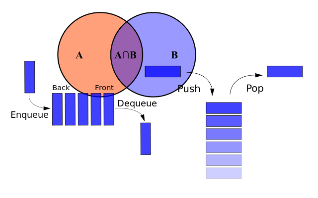

This chapters asks you to work with some very popular data structures in Computer Science. Sets, Stacks and Queues. It teaches you
both what these structures are and their purpose, but also, what Ruby tools you can use to implement them.
 
