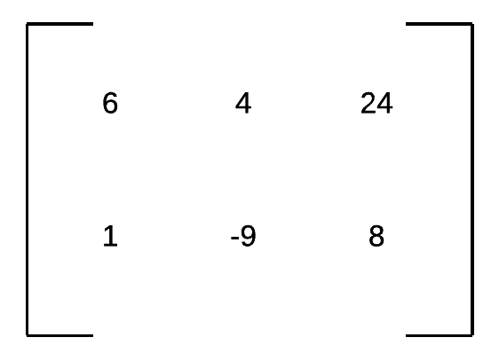
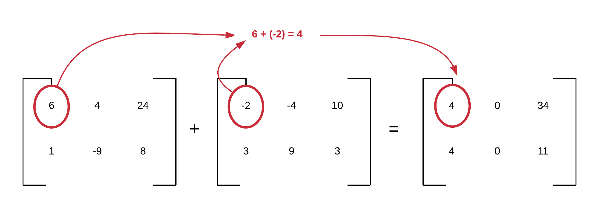
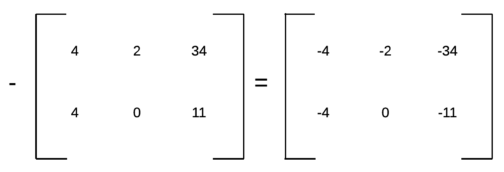
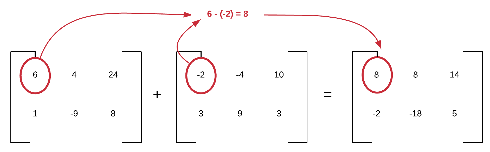
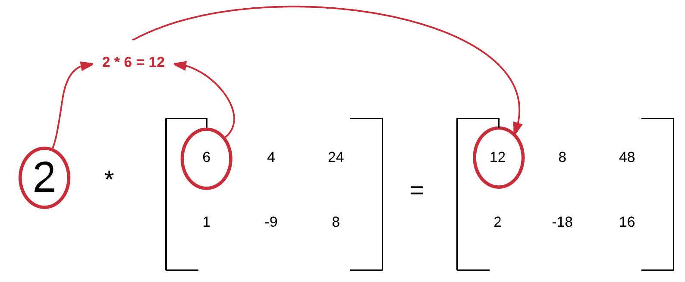
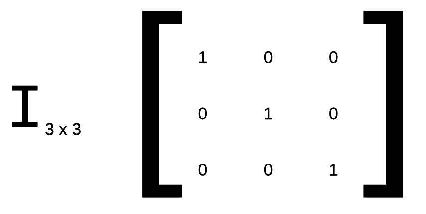
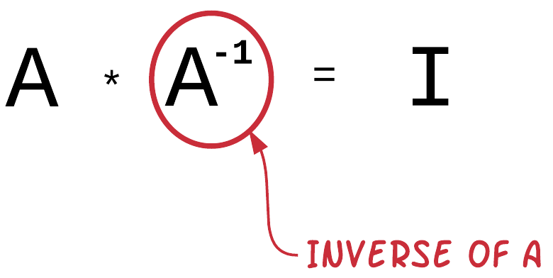
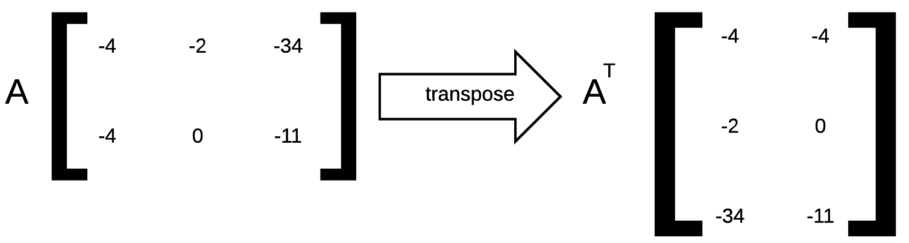

A mathematical matrix is represented in Ruby using the standard library class `Matrix`. It provides methods for creating matrices,
operating on them arithmetically or algebraically, and determining their properties like the determinant.

Let's see how we can use `Matrix` library for some basics around mathematical matrices.

## Matrix Representation

A matrix is an array of numbers. Here is an example of a matrix with 2 rows and 3 columns:



How are we going to represent this in Ruby? See the program `matrix-1.rb` below:

``` ruby
 1. # File: matrix-1.rb
 2. #
 3. require 'matrix'
 4. 
 5. a = Matrix[
 6.   [6, 4, 24],
 7.   [1, -9, 8]
 8. ]
 9. puts a.inspect
10. 
11. puts "a number of columns: #{a.column_count}"
12. puts "a number of rows: #{a.row_count}"
```

If your run this, you will get the following:

``` bash
$ ruby matrix-1.rb
Matrix[[6, 4, 24], [1, -9, 8]]
a number of columns: 3
a number of rows: 2
$
```

The variable `a` is initialized as a `Matrix` object. The way to initialize a `Matrix` object is by giving its elements
as a two dimensional array. Note how the method `#column_count` returns the number of columns and the method `#row_count` returns
the number of rows.

## Adding Matrices

Adding two matrices is about adding the elements at the corresponding positions.



The `Matrix#+` operator has been designed to implement this matrix addition. See the program `matrix-2.rb`:

``` ruby
 1. # File: matrix-2.rb
 2. #
 3. require 'matrix'
 4. 
 5. a = Matrix[
 6.   [6,  4, 24],
 7.   [1, -9,  8]
 8. ]
 9. 
10. b = Matrix[
11.   [-2, -4, 10],
12.   [ 3,  9,  3]
13. ]
14. 
15. c = a + b
16. 
17. puts c.inspect
```

The above program does a matrix addition on line 15. Let's run it:

``` bash
$ ruby matrix-2.rb
Matrix[[4, 0, 34], [4, 0, 11]]
$
```

The result is as expected.

## Negative

How to get the negative of a matrix? All the elements of the matrix need to be negated:



Let's try that with Ruby (`matrix-3.rb`):

``` ruby
 1. # File: matrix-3.rb
 2. #
 3. require 'matrix'
 4. 
 5. a = Matrix[
 6.   [6,  4, 24],
 7.   [1, -9,  8]
 8. ]
 9. 
10. b = -a
11. 
12. puts b.inspect
```

If you run this program, you will get this:

``` bash
$ ruby matrix-3.rb
Matrix[[-6, -4, -24], [-1, 9, -8]]
$
```

which is the negative of the Matrix `[[6, 4, 24], [1, -9, 8]]`.

## Subtracting

Subtracting two matrices is carried out similar to addition. We need to subtract the elements by position.



See the following program (`matrix-4.rb`):

``` ruby
 1. # File: matrix-4.rb
 2. #
 3. require 'matrix'
 4. 
 5. a = Matrix[
 6.   [6,  4, 24],
 7.   [1, -9,  8]
 8. ]
 9. 
10. b = Matrix[
11.   [-2, -4, 10],
12.   [ 3,  9,  3]
13. ]
14. 
15. c = a - b
16. 
17. puts c.inspect
```

If you run the above program, you will get this:

``` bash
$ ruby matrix-4.rb
Matrix[[8, 8, 14], [-2, -18, 5]]
$
```

## ./images/Scalar Multiplication

Sometimes we want to multiply an integer to a matrix. This is called scalar multiplication:



Here is an example program that does that `matrix-5.rb`:

``` ruby
 1. # File: matrix-5.rb
 2. #
 3. require 'matrix'
 4. 
 5. a = Matrix[
 6.   [6,  4, 24],
 7.   [1, -9,  8]
 8. ]
 9. 
10. 
11. b = 2 * a
12. 
13. puts b.inspect
```

If you run this program, you will get this:

``` bash
$ ruby matrix-5.rb
Matrix[[12, 8, 48], [2, -18, 16]]
$
```

## Multiply Matrices

Multiplying matrices is a little bit more difficult and we are not going to explain that in this course.
We need to do the *dot product* of rows and columns. But, Ruby `Matrix` multiplication operator, does that for us.

See the program `matrix-6.rb`:

``` ruby
 1. # File: matrix-6.rb
 2. #
 3. require 'matrix'
 4. 
 5. a = Matrix[
 6.   [1, 2, 3],
 7.   [4, 5, 6]
 8. ]
 9. 
10. b = Matrix[
11.   [ 7,  8],
12.   [ 9, 10],
13.   [11, 12]
14. ]
15. 
16. c = a * b
17. 
18. puts c.inspect
```

If you run this program, you will get this:

``` bash
$ ruby matrix-6.rb
Matrix[[58, 64], [139, 154]]
$
```

## Identity Matrix

The identity matrix is a square matrix whose values are 0 except from the diagonal which has 1's



The above, is a picture of a 3x3 identity matrix.

If we multiply a matrix with an identity matrix then the result is the original matrix. And this operation is commutative (whereas
the matrix multiplication, in general, is not).

See the program `matrix-7.rb`:

``` ruby
 1. # File: matrix-7.rb
 2. #
 3. require 'matrix'
 4. 
 5. a = Matrix[
 6.   [1, 2, 3],
 7.   [4, 5, 6],
 8.   [7, 8, 9]
 9. ]
10. 
11. i = Matrix.identity(3)
12. puts "Matrix a: #{a}"
13. puts "Identity Matrix: #{i}"
14. puts "a * i = #{a * i}"
15. puts "i * a = #{i * a}"
```
You can see that on line 11, we create an identity matrix with the statement `Matrix.identity(3)`. The number `3` is the number
of rows and columns, i.e. the dimensions of the identity matrix. 

If you run this program, you will get this:

``` bash
$ ruby matrix-7.rb
Matrix a: Matrix[[1, 2, 3], [4, 5, 6], [7, 8, 9]]
Identity Matrix: Matrix[[1, 0, 0], [0, 1, 0], [0, 0, 1]]
a * i = Matrix[[1, 2, 3], [4, 5, 6], [7, 8, 9]]
i * a = Matrix[[1, 2, 3], [4, 5, 6], [7, 8, 9]]
$
```

You can see that the multiplication is commutative and that the result is always the original matrix.

## Inverse of a Matrix

The inverse of a matrix is the matrix that if multiplied to the original matrix it gives the identity matrix. In other words:



We denote the inverse of a matrix <code>A</code> using the raise on the power of `-1`, like this <code>A<sup>-1</sup></code>.

But how do we find the inverse of a Matrix. There are a lot of algebraic methods to do that, but Ruby `Matrix` class has it ready for us.
Let's see the program `matrix-8.rb`:

``` ruby
 1. # File: matrix-8.rb
 2. #
 3. require 'matrix'
 4. 
 5. a = Matrix[
 6.   [3, 3.5],
 7.   [3.2, 3.6]
 8. ]
 9. 
10. a_inverse = a.inverse
11. i = a * a_inverse
12. 
13. puts "Matrix a: #{a}"
14. puts "Matrix a_inverse: #{a_inverse}"
15. puts "a * a_inverse: #{i}"
```

On line 10, we call `a.inverse` to get the inverse of the matrix stored in the variable `a`.

Let's run this program. We will get this:

``` bash
$ ruby matrix-8.rb
Matrix a: Matrix[[3, 3.5], [3.2, 3.6]]
Matrix a_inverse: Matrix[[-9.0, 8.75], [8.0, -7.5]]
a * a_inverse: Matrix[[1.0, 0.0], [0.0, 1.0]]
$
```

This program proves that the `#inverse` method works as expected, i.e. it returns a matrix that if multiplied by the
original matrix the result is the identity matrix.

## Dividing Matrices

When we have the matrix `A`, then we might want to carry out the operation `A / B` where `B` is another
matrix. However, we need to say that we don't have division in Matrix algebra. We have a multiplication by the inverse matrix.
In other words, `A / B` is actually <code>A * B<sup>-1</sup></code>. Nevertheless, this is all implemented by Ruby `Matrix` class.

Let's see the example `matrix-9.rb`:

``` ruby
 1. # File: matrix-9.rb
 2. #
 3. require 'matrix'
 4. 
 5. a = Matrix[
 6.   [4, 5],
 7.   [8, 2]
 8. ]
 9. 
10. b = Matrix[
11.   [3, 3.5],
12.   [3.2, 3.6]
13. ]
14. 
15. b_inverse = b.inverse
16. 
17. puts "Matrix a: #{a}"
18. puts "Matrix b: #{b}"
19. puts "Matrix a / b: #{a / b}"
20. puts "Matrix a * b_inverse: #{a * b_inverse}"
```

The above program does two things. 

1. Divides matrix `A` by `B` (line 19).
1. Multiplies matrix `A` by the inverse of matrix `B` (line 20).

Let's run this program:

``` bash
$ ruby matrix-9.rb
Matrix a: Matrix[[4, 5], [8, 2]]
Matrix b: Matrix[[3, 3.5], [3.2, 3.6]]
Matrix a / b: Matrix[[4.0, -2.5], [-56.0, 55.0]]
Matrix a * b_inverse: Matrix[[4.0, -2.5], [-56.0, 55.0]]
$
```

You can see that both results are the same.

## Transposing

In order to transpose a matrix, we swap the rows an columns. 



Ruby `Matrix` gives that for free. Let's see the program `matrix-10.rb`:

``` ruby
 1. # File: matrix-10.rb
 2. #
 3. require 'matrix'
 4. 
 5. a = Matrix[
 6.   [4, 5, 10],
 7.   [8, 2, 3]
 8. ]
 9. 
10. a_transpose = a.transpose
11. 
12. puts "Matrix a: #{a}"
13. puts "Matrix a_transpose: #{a_transpose}"
```

On line 10, we calculate the transposed matrix of matrix `A`. Let's run this program:

``` bash
$ ruby matrix-10.rb
Matrix a: Matrix[[4, 5, 10], [8, 2, 3]]
Matrix a_transpose: Matrix[[4, 8], [5, 2], [10, 3]]
$
```

You can see how the rows have become columns and the columns rows.

## `Matrix` is immutable

The point with `Matrix` instances is that are immutable. This means that you cannot change the value of an element of a matrix.

Let's try this (`matrix-11.rb`):

``` ruby
1. # File: matrix-11.rb
2. #
3. require 'matrix'
4. 
5. matrix = Matrix[[1, 2], [3, 4], [5, 6]]
6. puts matrix
7. matrix[0, 1] = 5
```

On line 7, we try to change the value of the element at row 0 and column 1. Let's run this program:

``` bash
$ ruby matrix-11.rb
Matrix[[1, 2], [3, 4], [5, 6]]
matrix-11.rb:7:in `<main>': private method `[]=' called for Matrix[[1, 2], [3, 4], [5, 6]]:Matrix (NoMethodError)
$
```

You see that we are getting an error. We have tried to call the method `[] = ` which is `private`.

Is there a work around for that? Yes. You need to work on the `Array` representation of the matrix, which is a mutable object. Let's see that (`matrix-12.rb`):

``` ruby
 1. # File: matrix-12.rb
 2. #
 3. require 'matrix'
 4. 
 5. matrix = Matrix[[1, 2], [3, 4], [5, 6]]
 6. puts "Matrix: #{matrix}"
 7. 
 8. matrix_array = matrix.to_a
 9. puts "Matrix array: #{matrix_array}"
10. 
11. matrix_array[0][1] = 5
12. 
13. matrix = Matrix[*matrix_array]
14. 
15. puts "Matrix: #{matrix}"
```

On line 8, we convert the `Matrix` instance to an `Array` instance by calling the method `#to_a`. The array created is stored
into the variable `matrix_array`. This is a two-dimensional array and we can update its elements without problem. Hence,
we update the element at row 0 and column 1 (line 11). Then, in order to get back an array instance, we have to reconstruct it,
using the `Matrix[<array>]` initializer. On line 13 we call `Matrix[*matrix_array]` and convert the two-dimensional array to
a `Matrix` instance. Note that the `*` in front of the `matrix_array` variable is necessary. Otherwise, the `Matrix` will not
have the correct dimensions. The `*` makes the `Matrix[]` method consider the elements of the arrray to be different run-time
arguments to the method call, otherwise, the whole `matrix_array` would be considered only 1 run-time argument.

Let's run this program now:

``` bash
$ ruby matrix-12.rb
Matrix: Matrix[[1, 2], [3, 4], [5, 6]]
Matrix array: [[1, 2], [3, 4], [5, 6]]
Matrix: Matrix[[1, 5], [3, 4], [5, 6]]
$
```
Perfect. we have managed to change the value of the row 0, column 1, from `2` to `5`.

## Closing Note

Matrices are very useful in practical programs. Ruby offers quite more features on Matrices than the ones we saw here.
You need to study the [Matrix Standard Library Class](https://ruby-doc.org/stdlib-2.4.0/libdoc/matrix/rdoc/Matrix.html).

> *Note:* You may want to consider representing the numbers of a matrix using [BigDecimal](https://ruby-doc.org/stdlib-2.3.0/libdoc/bigdecimal/rdoc/BigDecimal.html) instead of floats.
