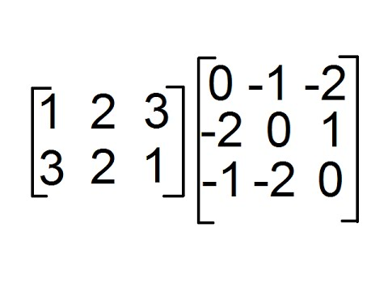

Ruby standard library expands core library with some classes that are related to Maths and Algebra. On this chapter we
learn how Ruby can help you deal with ./images/Matrices, an Algebra tool that has many practical applications.
