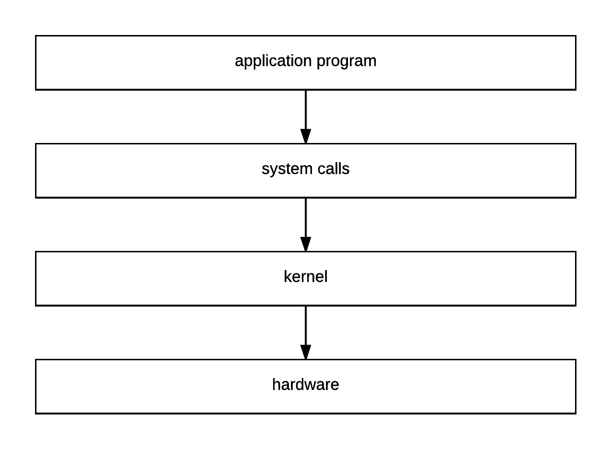
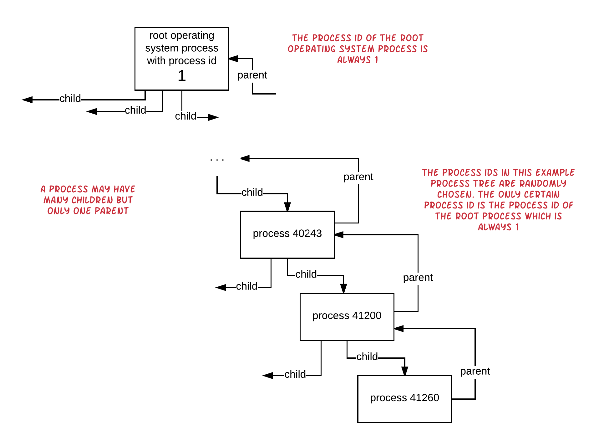
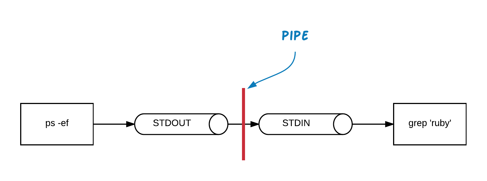

We will start learning about the internals of processes by first looking at some operating system stuff. Let's do that

## ./images/Kernel and System Calls

The *kernel* of your Unix operating system sits on top of the hardware and allows your program to communicate with it.
The speakers, the hard disks, the display, the keyboard and other hardware devices are being managed by the kernel. Your
program needs to issue *system calls* to the kernel in order to control the hardware. The program does not have direct
access to the kernel. Only via the *system calls*.



## User Land and User Calls

When your program does not execute system calls, but any other calls, like, for example, a string reverse command, we say
that it is in the *user land*. Let's call them *user calls* to differentiate them from *system calls*.

> *Hint:* Unix comes with manual pages. All the Unix general commands or system calls and many more are already documented in
the Unix manual pages that come installed with your Unix version. You only have to invoke the `man` command and give as argument
the name of the command you are looking help for. For example, this will give you the reference manual for the `ls` general 
command:
``` bash
man ls
```
Note also that the Unix manual pages are divided into sections. A command might exist in more than one section. For example the `stat`
command exists both in section number 1 and in section number 2. When you invoke the `man stat` to get the reference manual for the
command `stat` you are accessing section number 1. If you want to access section number 2, you have to give the section number as a
first argument and the command name as the second argument. For example:
``` bash
man 2 stat
```
The number of sections differs from Unix distribution to Unix distribution. But the first 4 are usually the following:
>
> 1. number 1 being the general commands, 
> 2. number 2 being the system calls, 
> 3. number 3 being the `C` library functions and
> 4. number 4 being the *special files* section.
> 
> If you want to find out how many `man` sections your Unix distribution has, you can lilst the contents of the directory `/usr/share/man`.
>
> If you want to know more about the Unix commands and the system calls, you will need to get acquainted with the Unix man pages. They
have everything you need although they are not very easy to read.

## Processes

Any code, program executed, is executed within a process. Even when you run the `ruby` interpreter a new process is created by the
operating system that hosts the Ruby interpreter which knows how to execute your program (given as argument to the `ruby` command).

Let's try this on the command line:

``` bash
$ ruby -e '10.times {|i| puts("#{i + 1}"); sleep(1) }'
...
$
```

> *Challenge:* Can you find what `-e` does using the Unix man pages for `ruby`? 

This will create a new process that will run for 10 seconds and print the second number on the screen. While the program is running,
open another terminal and give the command `ps -har` and you will see the process identifying information. When the program terminates,
the process will not be listed in the `ps -har` output.

> *Information:* You can also use the `ps -l`.

Watch the following video to see what I mean:

<div id="media-container-video-Process Created To Run Ruby Program">
  <a href="https://player.vimeo.com/video/201733848"></a>
</div>

So, when Unix is asked to execute a command (like `ruby`) it spawns a new process to do that. Things are getting more interested when you 
realize that a Unix process can spawn and manage one or more other Unix processes. We will talk about that a little bit later.

## Processes have Process Identifiers

When a process is being spawned, it gets a unique number from the operating system. This unique number is called *process identifier* or *pid* and
uniquely identifies this process. We have learned how to see the process id of a running process using the command `ps -har`. You can access the
process id of your Ruby program too, using the command `Process.pid`. Let's run the following:

``` bash
$ ruby -e '10.times {|i| puts("Process id: #{Process.pid} - Iteration: #{i + 1}"); sleep(1) }'
...
$
```

This is the same Ruby script as before, but it also prints the process id that has been created by the operating system to execute it.
While the program is running, if you run `ps -har` on another terminal, you will see that you get the same process identifier.

<div id="media-container-video-Printing The Process Identifier">
  <a href="https://player.vimeo.com/video/201734490"></a>
</div>

Note that `Process.pid` maps to `getpid` system call. 

## Processes have Parents

When a process starts it has one parent process. The parent process is identified by the `PPID` or `ppid`. The corresponding command in Ruby is `Process.ppid`.
The fact that each process has one parent means that we end up having a process tree like this:



Note that a process identifier `1` is referring to the root operating system process. This process spawns child processes and those child processes
spawn other child processes. One process can have multiple child processes but only one parent.

If you want to double check the parent process id of a process you can use the command `ps -harf` (or `ps -l`), which also adds the information of the parent process id.

Run the following program and on another terminal the `ps -harf` (or `ps -l`) command to double check the parent process id too:

``` bash
$ ruby -e '10.times {|i| puts("Process (pid/ppid): #{Process.pid}/#{Process.ppid} - Iteration: #{i + 1}"); sleep(1) }'
...
$
```

<div id="media-container-video-Print Parent Process Id">
  <a href="https://player.vimeo.com/video/201735151"></a>
</div>

> *Hint:* If you want to locate a specific process by id, you can issue the following command on your terminal `ps -p <process id>` (or `ps -l -p <process id>`). Another useful command
also is the `ps -ef`.

Note that the `Process.ppid` Ruby statement maps to `getppid` system call.

## Process Resource Limits

When a process starts its life it may start consuming resources, like, for example, file descriptors, which are handles, or identifiers, to open files.
Having said that, we need to say that a process does not have unlimited number of resources at its disposal. The resources are limited.

Using Ruby, we can ask about the limit on the file descriptors. The command is `Process.getrlimit(:NOFILE)` which returns the resource limits related to the
number of open file descriptors the process can use. Let's run that:

``` bash
$ ruby -e 'p Process.getrlimit(:NOFILE)'
[10240, 9223372036854775807]
$
```

The above output is machine and operating system dependent and it may be different on your Unix instance.

The first element in the array returned is the *soft limit*. The second one is the *hard limit*. The *soft limit* is not really a limit. If your process
exceeds the soft limit an exception will be raised, but you will be able to change that limit if you want. The hard limit is huge. Practically, you will
not be able to run a Ruby program that would consume so many file descriptors. The hard limit cannot be set by your Ruby process, unless it has the privileges
to do so. We will not expand on that.

Let's see how our process can change the *soft limit*. Let's run the following:

``` bash
$ ruby -e 'Process.setrlimit(:NOFILE, 8096); p Process.getrlimit(:NOFILE)'
[8096, 8096]
$
```

The above command sets the soft limit to `8096`. Note that this also sets the hard limit to `8096`. That's the default behaviour of the `#setrlimit` call. If you 
want to set the hard limit to another value, you will have to set it as a third argument to `#setrlimit`:

``` bash
$ ruby -e 'Process.setrlimit(:NOFILE, 2**10, 2**12); p Process.getrlimit(:NOFILE)'
[1024, 4096]
$
```

The `#setrlmit` and `#getrlimit` can be used to refer to various other resources, not only to number of open file descriptors. You can either read the Unix
manual pages for those system calls (`man 2 setrlimit` or `man 2 getrlimit`) or read the documentation at the [Ruby documentation pages](https://ruby-doc.org/core-2.2.0/Process.html#method-c-setrlimit)

## Processes and Standard Streams

When a new process starts it already has access to three *open* file descriptors, resources. These are also called standard streams or standard channels. 

1. The standard input, STDIN
1. The standard output, STDOUT
1. The standard error, STDERR

The STDIN is the stream where a process can get input from. In Ruby, you have access to the standard input via the global variable `$stdin`. Also,
the `gets` command takes input from the STDIN channel.

The STDOUT is the stream where a process can send output. Usually a process writes standard information messages there. Not error messages. Ruby offers the global variable
`$stdout` to write messages to this stream. Also, the `puts` and similar commands, they write to the STDOUT.

The STDERR is the stream where a process writes error messages. This is the standard convention, at least. Ruby offers the global variable `$stderr` to write on this
channel.

These file descriptors are already available and open when a process starts. This means that the process does not have to open these streams before reading or writing
to them.

Look at the following example `streams-1.rb`:

``` ruby
1. # File: streams-1.rb
2. #
3. $stdout.print 'How old are you? '
4. answer = $stdin.gets.chomp
5. $stdout.puts "Did you say #{answer}?"
6. 
7. $stderr.puts 'Bye!'
```

Lines 3 and 5 use the STDOUT channel to send output. Whereas line 4 uses the STDERR to send output. On line 4 it uses the STDIN to read input from.

This is an instance of an execution of this program:

``` bash
$ ruby streams-1.rb
How old are you? 20
Did you say 20?
Bye!
$
```

## Redirecting Stream Output

Having said about the STDOUT and STDERR, we need to say here that calling a program at the command line allows you to direct the content of these streams
to different output destinations. The STDOUT is referenced by the constant `1` and the STDERR is referenced by the constant `2`.

Let's assume the following program `streams-2.rb`:

``` ruby
1. # File: streams-2.rb
2. #
3. $stdout.puts 'Writing to STDOUT'
4. $stderr.puts 'Writing to STDERR'
```

If you run this program, you will get this:

``` bash
$ ruby streams-2.rb
Writing to STDOUT
Writing to STDERR
$
```

Unix allows us to redirect the standard channel STDOUT to a file instead of the default terminal output. Let's run the program with the following command `ruby streams-2.rb > file-1.txt`:

``` bash
$ ruby steams-2.rb > file-1.txt
Writing to STDERR
$
```

As you can see, the `Writing to STDOUT` now is not displayed. This is because the `> file-1.txt` tells `bash` shell to redirect the STDOUT channel stream to the file `file-1.txt`. In other
words, whatever the process created by `ruby streams-2.rb` writes to the STDOUT it will be actually saved to the file `file-1.txt`.

You can confirm the creation of the file:

``` bash
$ ls -l file-1.txt
-rw-r--r--  1 panayotismatsinopoulos  staff  18 Jan 21 21:03 file-1.txt
$ cat file-1.txt
Writing to STDOUT
$
```

The `cat` command prints the contents of the file `file-1.txt` and we can see that it contains the phrase `Writing to STDOUT`. 

Cool! The `> <file>` is a nice way to redirect the STDOUT of a process to a file in order to inspect and study its content after the process finishes running.

But what about the STDERR channel? Can we redirect that too? The answer is yes. You only have to prepend the `>` symbol of redirection with the channel number for
STDERR, which is the number `2`. 

Let's run the program like this:

``` bash
$ ruby streams-2.rb 2> errors-1.txt
Writing to STDOUT
$
```

Nice! The STDOUT remains to be the terminal, whereas, now, the STDERR has been redirected to the `errors-1.txt` file. Can we see its contents? 

``` bash
$ cat errors-1.txt
Writing to STDERR
$
```

Perfect! The `>` redirects the STDOUT to a file. The `2>` redirects the STDERR to a file. Apparently, the `1>` is equal to `>`:

``` bash
$ ruby streams-2.rb 1> file-2.txt
Writing to STDERR
$ cat file-2.txt
Writing to STDOUT
$
```

Is there a way we can redirect both STDOUT and STDERR to the same file? Yes. Try this:

``` bash
$ ruby steams-2.rb &> stdout-and-stderr.txt
$ cat stdout-and-stderr.txt
Writing to STDERR
Writing to STDOUT
$
```

The `&>` tells bash to redirect the STDOUT and STDERR streams of the process to the same output.

Or you can tell bash to redirect STDERR to the STDOUT. This is done with `2>&1`. Try this:

``` bash
$ ruby streams-2.rb > stdout-and-stderr-2.txt 2>&1
$ cat stdout-and-stderr-2.txt
Writing to STDERR
Writing to STDOUT
$
```

With the above command we redirect STDOUT to file `stdout-and-stderr-2.txt` and the STDERR to the STDOUT (with the `2>&1`). Hence,
we make sure that both STDOUT and STDERR are redirected to the `stdout-and-stderr-2.txt` file.

## Piping

Besides redirecting the process output to a file, Unix allows you to redirect the output of a process into the input of another
one. This is called piping. Here is an example call: `cat very_long_text_file.txt | more`. This example demonstrates the 
printing of the contents of a very long text file on the terminal using paging. The `| more` sends the output of the `cat` command
to the input of the `more` command and hence we can have the contents printed under the control of the `more` command, page-by-page.
Another command that we have seen many times used is the `ps -ef | grep 'ruby'`. The output of `ps -ef`, which is a long output with
many lines, is redirected to the input of the command `grep` which filters it and finally prints only the lines that contain the word `ruby`.



Let's see the `cat` example above. Download this file from this link here: [very long text file](FILE: woodstock-wikipedia-source-code)

Then try to cat its contents with the help of pipe and the command `more`. You will see something like this:

``` bash
$ cat woodstock-wikipedia-source-code.html | more
...
$
```

<div id="media-container-video-cat Command With Pipe To more Command">
  <a href="https://player.vimeo.com/video/201800492"></a>
</div>

It works nice. What I would like to show you here is that some commands work equally well even if you send their input as a run-time argument. 

Try the command `more woodstock-wikipedia-source-code.html` instead. You will see that you have the same result.

How can we write a Ruby program that takes its input both as a runtime argument and as a piped input from the previous command?

Let's see the program `rupcase-1.rb` below:

``` ruby
1. # File: rupcase-1.rb
2. #
3. File.open(ARGV[0]) do |file|
4.   file.each_line do |line|
5.     $stdout.puts line.upcase
6.   end
7. end
```

This program takes a file and prints its lines with upper case characters. Let's try that on our long file, by first giving the 
filename as run-time argument:


``` bash
$ ruby rupcase-1.rb woodstock-wikipedia-source-code.html
...
               </DIV>
                <SCRIPT>(WINDOW.RLQ=WINDOW.RLQ||[]).PUSH(FUNCTION(){MW.CONFIG.SET({"WGBACKENDRESPONSETIME":70,"WGHOSTNAME":"MW1174"});});</SCRIPT>
        </BODY>
</HTML>
$
```

You will see the file contents being printed upper case. Which is good. But does our program support piping? Can it get its input from the 
output of `cat` for example?

Let's try that:

``` bash
$ cat woodstock-wikipedia-source-code.html | ruby rupcase-1.rb
rupcase-1.rb:3:in `initialize': no implicit conversion of nil into String (TypeError)
        from rupcase-1.rb:3:in `open'
        from rupcase-1.rb:3:in `<main>'
$
```

No! It does not work. We are getting an error on line `File.open(ARGV[0])`. It seems that `ARGV[0]` is nil and that sounds reasonable, because
we have not given any run-time argument to `ruby rupcase-1.rb`. 

In order for the script to be able to take its input either as run-time argument or as part of a pipe command, then it needs to use `ARGF` stream instead.
Look at the program `rupcase-2.rb`:

``` ruby
1. # File: rupcase-2.rb
2. #
3. input = ARGF.read
4. 
5. input.each_line do |line|
6.   $stdout.puts line.upcase
7. end
```

If you run the command `cat woodstock-wikipedia-source-code.html | ruby rupcase-2.rb`, you will see now that it will not fail. Instead, it will print
the contents of the file `woodstock-wikipedia-source-code.html` upper cased.

``` bash
$ cat woodstock-wikipedia-source-code.html | ruby rupcase-2.rb
...
                </DIV>
                <SCRIPT>(WINDOW.RLQ=WINDOW.RLQ||[]).PUSH(FUNCTION(){MW.CONFIG.SET({"WGBACKENDRESPONSETIME":70,"WGHOSTNAME":"MW1174"});});</SCRIPT>
        </BODY>
</HTML>
$
```

But does it still work with run-time arguments? Try this one here:

``` bash
$ ruby rupcase-2.rb woodstock-wikipedia-source-code.html
...
                </DIV>
                <SCRIPT>(WINDOW.RLQ=WINDOW.RLQ||[]).PUSH(FUNCTION(){MW.CONFIG.SET({"WGBACKENDRESPONSETIME":70,"WGHOSTNAME":"MW1174"});});</SCRIPT>
        </BODY>
</HTML>
$
```

Perfect! Our script now works with both run-time arguments and with STDIN input coming in from a pipe. This is thanks to the `ARGF` which is a stream
that actually parses the `ARGV` contents assuming that they are all files or processes the STDIN, i.e. any pipe input.

## Processes and Environment

Environment is the set of key value pairs that constitutes the context in which a process is running. It is like a dictionary, a hash, and it is global to a process.
When a process starts, it inherits the environment from its parent process. But it can modify it. 

In `bash`, you can get the list of environment variables with the `env` command:

``` bash
$ env
rvm_bin_path=/Users/panayotismatsinopoulos/.rvm/bin
GEM_HOME=/Users/panayotis...tent
TERM=xterm-256color
SHELL=/bin/bash
IRBRC=/Users/panayotismatsinopoulos/.rvm/rubies/ruby-2.2.3/.irbrc
TMPDIR=/var/folders/2y/5mdtvpy52196yqv9sfh_qrcw0000gn/T/
Apple_PubSub_Socket_Render=/private/tmp/com.apple.launchd.fQCedhoSsW/Render
MY_RUBY_HOME=/Users/panayotismatsinopoulos/.rvm/rubies/ruby-2.2.3
rvm_stored_umask=0022
USER=panayotismatsinopoulos
rvm_path=/Users/panayotismatsinopoulos/.rvm
SSH_AUTH_SOCK=/private/tmp/com.apple.launchd.SuU7w43V7X/Listeners
__CF_USER_TEXT_ENCODING=0x1F5:0x0:0x0
rvm_prefix=/Users/panayotismatsinopoulos
PATH=/opt/local/bin:/opt/loca...mysql/bin
rvm_loaded_flag=1
PWD=/Users/panayotismatsinopoulos/Documents/techcareerbooster_course_content
_system_arch=x86_64
XPC_FLAGS=0x0
PS1=\u@\w\[\033[32m\]$(parse_git_branch)\[\033[00m\] $ 
_system_version=10.11
XPC_SERVICE_NAME=0
rvm_version=1.27.0 (latest)
SHLVL=1
HOME=/Users/panayotismatsinopoulos
rvm_ruby_string=ruby-2.2.3
LOGNAME=panayotismatsinopoulos
GEM_PATH=/Users/panayo...@global
LC_CTYPE=en_US.UTF-8
GOPATH=/usr/local/opt/go/libexec/bin
rvm_delete_flag=0
DISPLAY=/private/tmp/co...z:0
RUBY_VERSION=ruby-2.2.3
rvm_user_install_flag=1
_system_name=OSX
_=/usr/bin/env
```

Apparently, the output will be different on your Unix installation. 

According to what we have said, when we start a Ruby process, these environment variables will be present to that new process, because they are given to it by the
parent process that spawns it (i.e. the `bash` process).

What is the Ruby statement that gives us access to the environment variables. It is the `ENV` call which resembles, up to a point, the `Hash` API (although it is not a `Hash`).

Try to run the following program `env-1.rb`:

``` ruby
1. # File: env-1.rb
2. #
3. puts ENV.keys.map { |k| "#{k} = #{ENV[k]}" }.join("\n")
```

If you run the above program you will get something like the following:

``` bash
$ ruby env-1.rb
rvm_bin_path = /Users/panayotismatsinopoulos/.rvm/bin
GEM_HOME = /Users/panayotism...ent
TERM = xterm-256color
SHELL = /bin/bash
IRBRC = /Users/panayotismatsinopoulos/.rvm/rubies/ruby-2.2.3/.irbrc
TMPDIR = /var/folders/2y/5mdtvpy52196yqv9sfh_qrcw0000gn/T/
Apple_PubSub_Socket_Render = /private/tmp/com.apple.launchd.fQCedhoSsW/Render
MY_RUBY_HOME = /Users/panayotismatsinopoulos/.rvm/rubies/ruby-2.2.3
_system_type = Darwin
...
$
```

Compare that to the output of the bash command `env`. It will be the same.

## Passing Arguments as Environment Variables

Usually, we may want to pass some runtime arguments to a process, in our case Ruby program, using environment variables. This can be done by
setting the environment variable at the moment we start our process, our Ruby program. We put the environment variable with its value
as a `<key>=<value>` pair before the string that specifies the actual command.

For example, issue the following command:

``` bash
$ FOO=BAR ruby env-1.rb
FOO = BAR
rvm_bin_path = /Users/panayotismatsinopoulos/.rvm/bin
GEM_HOME = /Users/panayotismatsinopoulos/.rvm/gems/ruby-2.2.3@techcareerbooster_course_content
TERM = xterm-256color
SHELL = /bin/bash
...
$
```

You can see how the `FOO` environment variable has the value `BAR` within the Ruby program that we have written.

Actually, you can pass more than one environment variables using this technique:

``` bash
$ USERNAME=foo PASSWORD=bar ruby env-1.rb
USERNAME = foo
PASSWORD = bar
rvm_bin_path = /Users/panayotismatsinopoulos/.rvm/bin
GEM_HOME = /Users/pana...content
TERM = xterm-256color
SHELL = /bin/bash
$
```

You can now see that both `USERNAME` AND `PASSWORD` have their values accessed from within the Ruby program `env-1.rb`.

Please, note that environment variables that you set on the command line like above, they do not survive after the process finishes. Check that out
after you run the program `$ USERNAME=foo PASSWORD=bar ruby env-1.rb` try to get the list of environment variables on your terminal
prompt like below. You will not see those variables set:

``` bash
$ env | grep 'USERNAME'
$ env | grep 'PASSWORD'
$
```

If you want to set an environment variable that will survive independently of the process that you will execute, you will have to
set them on their own command call on the operating system terminal. For example:

``` bash
1. $ export FOO=BAR
2. $ env | grep 'FOO'
3. FOO=BAR
4. $ echo $FOO
5. BAR
```

It is the `export` command that sets the environment variables in the environment of the bash shell. This is what we do on line 1 above.
the `env | grep 'FOO'` prints the environment variables and filters the line that includes `FOO`. The command `echo $FOO` gets the value of
the variable `FOO` and prints it on the terminal. 

Note also that environment variables that are set on a terminal window using the `export` command do not survive after the terminal is closed.
If you want your environment variables to  have values that survive and exist on all of your `bash` shells (terminals), you will have to
set them with the `export` command defined inside your `~/bash_profile` file.

## Process Name

When a process starts it has a name. Usually it is the name of the command that spawned that process. However, you can change the name of the
process on the fly. Let's see how. 

The following is a program that sleeps every 1 second and in between it prints the current date and time. It does that for 20 times.

``` ruby
1. # File: name-1.rb
2. #
3. 20.times do
4.   puts Time.now
5.   sleep 1
6. end
```

Try to run this program and while the program is running open a terminal and get its process information printed by the `ps -har` (or `ps -l`) command. You will
get something like this:

``` bash
$ ps -har
  PID TTY           TIME CMD
43857 ttys002    0:00.28 -bash
46880 ttys001    0:00.04 ruby name-1.rb
44808 ttys001    0:00.59 /bin/bash --login
46886 ttys000    0:00.00 ps -har
43856 ttys002    0:00.02 login -pf panayotismatsinopoulos
$
```

On my case, the process has the id 46880 and the CMD (command) column prints the command executed by that process (`ruby name-1.rb`).

You can now enhance this program and ask Ruby to print also the name of the program. This is stored in the global variable `$PROGRAM_NAME`.
See program `name-2.rb`:

``` ruby
1. # File: name-2.rb
2. #
3. puts "Program Name: #{$PROGRAM_NAME}"
4. puts '------------'
5. 20.times do
6.   puts Time.now
7.   sleep 1
8. end
```

If you run the above program, you will get something like this:

``` bash
$ ruby name-2.rb
Program Name: name-2.rb
------------
2017-01-21 15:34:16 +0200
2017-01-21 15:34:17 +0200
2017-01-21 15:34:18 +0200
...
$
```

Ruby, inside the `$PROGRAM_NAME` variable, it stores the name of script the Ruby interpreter executes. 

However, the value of this variable can be updated and any updates are reflected back to the parent process and the
command `ps -har` shows the updated name. Look at the following program:

``` ruby
 1. # File: name-3.rb
 2. #
 3. puts "Program Name: #{$PROGRAM_NAME}"
 4. puts '------------'
 5. 
 6. 20.times do |i|
 7.   $PROGRAM_NAME = "name process with index #{i}"
 8.   puts "Program name is: #{$PROGRAM_NAME}"
 9.   sleep 1
10. end
```

If you run it, you will see a different string being printed for the `$PROGRAM_NAME`. Also, if you open another terminal
that executes the command `ps -har`, you will see the updates being reflected at the value of the column `CMD` for that same process.

<div id="media-container-video-Updating Process Name While Process is Running">
  <a href="https://player.vimeo.com/video/201801761"></a>
</div>

This is useful when you need your process to have a more descriptive name. Or when your process spawns a series of other
processes and you want your new processes' names to follow a particular pattern in order to be able to distinguish one from the
other.

## Process Exit Codes

Each process has an exit point, a point at which it terminates. Also, when it terminates it returns an exit code back to 
the parent process. The exit code can be an integer in the range `0` to `255`. `0` usually means `success` whereas any non-0 number
means error or failure.

Ruby offers the method `Kernel#exit` that allows a process to explicitly terminate with a specific exit code, which is given as
argument to the `#exit` call. If no argument is given, `0` is the default exit code.

Also, Ruby offers you the ability to attach specific blocks of code that will be executed when the process exits. Here is an example
`exit-1.rb`:

``` ruby
 1. # File: exit-1.rb
 2. #
 3. at_exit do
 4.   puts "Process with id: #{Process.pid} is about to exit"
 5. end
 6. 
 7. 20.times do |i|
 8.   puts "Iteration #{i}"
 9.   sleep 1
10.   exit if i == 5
11. end
```

If you run this program, you will get this:

``` bash
$ ruby exit-1.rb
Iteration 0
Iteration 1
Iteration 2
Iteration 3
Iteration 4
Iteration 5
Process with id: 47641 is about to exit
$
```

The message `Process with id: 47641 is about to exit` is printed because of the block defined at lines 3 to 5 and attached
to the exit hook with the `at_exit` method call.

Moreover, we need to tell that, you can attach as many exit blocks as you like. The point is that they are executed in the reverse
order to the order attached to the exit hook. Look at the program `exit-2.rb`:

``` ruby
 1. # File: exit-2.rb
 2. #
 3. at_exit do
 4.   puts "Process with id: #{Process.pid} is about to exit"
 5. end
 6. 
 7. at_exit do
 8.   puts "This is another exit block of code"
 9. end
10. 
11. 20.times do |i|
12.   puts "Iteration #{i}"
13.   sleep 1
14.   exit if i == 5
15. end
```

If your run this program, you will get something like this:

``` bash
$ ruby exit-2.rb
Iteration 0
Iteration 1
Iteration 2
Iteration 3
Iteration 4
Iteration 5
This is another exit block of code
Process with id: 47681 is about to exit
$
```

As you can see the 2nd attached block (lines 7 till 9) has been executed 1st, whereas the 1st attached block (lines 3 to 5) has
been executed 2nd.

## `exit!`

There is another method that can be used to exit a Ruby program. This is the `exit!`. This is almost similar to `exit` but with the
following main differences:

1. The default exit code for `exit!` is `1`, i.e. failure (whereas the default exit code for `exit` is `0`, i.e. success).
2. The `exit!` will not invoke any blocks attached at the exit hooks.

## `abort`

This is similar to calling `exit(1)`. It assumes failure and exits the program with exit code `1`. You can
optionally pass a message that will be printed to the standard error channel STDERR. Note that all the exit hooks are being
called. 

## `raise`

We have already learned in the chapter about exceptions, that `raise` raises an Exception instance that if not rescued will
finally terminate the program. Note that an unhandled exception terminates the program and the exit hooks are being
executed.

## Creating Child Processes

A Unix process can create another process. In that case, the newly created process is the child of the process that spawned it.
The process that spawned it is the parent process. 

How can we have a Ruby process create a child process? This is done with the statement `fork` and maps to the `fork` system call.
Let's see the following example:

``` ruby
1. # File: fork-1.rb
2. #
3. puts 'I am going to fork a new child process...'
4. child_process_id = fork
5. puts "Child process id: #{child_process_id}. I am process with id: #{Process.pid} and parent process id: #{Process.ppid}"
6. puts "Child process forked! I am process with id: #{Process.pid} and parent process id: #{Process.ppid}"
```

The program above, `fork`s on line 4. This means that whatever code exists after that will be executed by two processes. The parent
and the child process. Let's run this program:

``` bash
1. $ ruby fork-1.rb
2. I am going to fork a new child process...
3. Child process id: 61005. I am process with id: 61004 and parent process id: 51605
4. Child process forked! I am process with id: 61004 and parent process id: 51605
5. Child process id: . I am process with id: 61005 and parent process id: 61004
6. Child process forked! I am process with id: 61005 and parent process id: 61004
7. $ ps -p 51605
8.   PID TTY           TIME CMD
9. 51605 ttys001    0:00.45 /bin/bash --login
$
```

We can see from the above output that

1. The process that does the `fork` gets back as the return value of `fork` the process id of the child spawned process. See line 3 on the output above.
2. The child process does not get any id inside the `child_process_id` variable. In other words, the `fork` returns `nil` on the child process.

The following diagram is a diagram of the processes involved on the run of the above program:


## Forking And Branching on Fork Result

Let's run another fork example `fork-2.rb`:

``` ruby
1. # File: fork-2.rb
2. #
3. if fork
4.   puts "I am the parent with process id: #{Process.pid}"
5. else
6.   puts "I am the child with process id: #{Process.pid} and parent process id: #{Process.ppid}"
7. end
```

This is a common practice. The code has a branch. The `true` part is the code that is executed by the parent (line 4)
and the `false` part is the code executed by the child. Remember that `fork` returns a child process id for the parent
and `nil`, i.e. falsey value, for the child.

Let's run this program:

``` bash
$ ruby fork-2.rb
I am the parent with process id: 64081
I am the child with process id: 64082 and parent process id: 64081
$
```

Does this output make sense? Line 4 executed for parent and line 6 executed for child. And the child parent process id matches
that of the parent process id.

## Forking and Blocks

Another way you can fork with Ruby is using blocks. When you call fork and you pass a block, this block is executed by the child
process (`fork-3.rb`):

``` ruby
1. # File: fork-3.rb
2. #
3. fork do
4.   puts "I am child with process id: #{Process.pid} and parent process id: #{Process.ppid}"
5. end
6. puts "I am parent with process id #{Process.pid}"
```

If you run this program, you will see this:

``` bash
$ ruby fork-3.rb
I am parent with process id 64128
I am child with process id: 64129 and parent process id: 64128
$
```

As you can see child executes only whatever is inside the block, which is quite cool!

## Important Notes about Forking

Some very important things that you need to be aware of about forking:
 
(1) Since the child is an entirely new process, it will have its own unique process id. In the previous example, the process id of the
child was an integer 1 unit greater than the process id of the parent process. But this is not the rule.

(2) The child process inherits a copy of all the memory contents of the parent process. The memory footprint is exactly the same like
the one on the parent process. This includes any open file descriptors that have been opened by the parent process.

(3) When you fork a new child process, you double the amount of memory consumed by your application. If the parent process was on 500MB RAM,
then your child process will also require 500MB RAM. If you create two children processes, calling `fork` twice, then you will have three processes
consuming 1500MB RAM in total. Think about that before designing your application to run using multiple processes. RAM is a scarce resource.

(4) Child processes own their memory space and if a child process changes memory data does not affect the parent or other child processes.

(5) The call to `fork` returns instantly, if compared to the start up time of the parent process. This means that it might be preferable to
fork child processes when you want to have multiple processes working in parallel, rather than starting the process manually multiple times from
the terminal.

(6) If your application is running on a multi-core machine, then forking might increase the speed of processing for your application. But this
does not mean that this is linear to the number of cores. In other words, if your process forks 3 more children processes, then on a 4-core
CPU this does not mean that the processing will be increased by x4. CPU does other things too besides giving you enough room and time to execute
your process. 

## Orphaned Processes

When the parent process of a child terminates without waiting for the child process to finish, then child process is adopted by the process with id `1`.
Let's try that `fork-4.rb`:

``` ruby
 1. # File: fork-4.rb
 2. #
 3. fork do
 4.   20.times do
 5.     puts "I am the child process with id #{Process.pid} and parent process id #{Process.ppid}"
 6.     sleep 1
 7.   end
 8. end
 9. 
10. sleep 3
```

If you run this program, the child process will continue quite long after the parent process finishes. Start this program and then 
open another terminal to see the parent process of the child.

<div id="media-container-video-Orphaned Process Inherited By Root Process with Id 1">
  <a href="https://player.vimeo.com/video/201803286"></a>
</div>

A process that loses its immediate parent is called orphaned process and it is inherited by the root process with id `1`.

## Waiting for a Child to Finish

It is very common that when a process spawns a child process, usually when it spawns many child processes, to wait for them to finish. Here is an example code
`fork-5.rb`:

``` ruby
 1. # File: fork-5.rb
 2. #
 3. child_process_id = fork do
 4.   5.times do
 5.     puts "I am the child process with id #{Process.pid} and parent process id #{Process.ppid}"
 6.     sleep 1
 7.   end
 8. end
 9. 
10. puts "Waiting for #{child_process_id} to finish"
11. Process.wait
12. puts 'Child process finished. I will finish too!'
```

If you run this program, you will see this:

``` bash
$ ruby fork-5.rb
Waiting for 65839 to finish
I am the child process with id 65839 and parent process id 65838
I am the child process with id 65839 and parent process id 65838
I am the child process with id 65839 and parent process id 65838
I am the child process with id 65839 and parent process id 65838
I am the child process with id 65839 and parent process id 65838
Child process finish. I will finish too!
$
```

`Process.wait` is a blocking call. I.e. the parent process blocks until a child process finishes. 

## Find Which Child Finished

Let's assume that the parent process spawns 3 processes. In that case `Process.wait` will return if any of the child processes
finishes. The return value of the `Process.wait` is the child process id that just finished.

Let's see the program `fork-6.rb`:

``` ruby
 1. # File: fork-6.rb
 2. #
 3. number_of_processes_to_spawn = [
 4.     {number_of_sleeps: 10},
 5.     {number_of_sleeps: 5},
 6. ]
 7. 
 8. number_of_processes_to_spawn.size.times do |i|
 9.   fork do
10.     number_of_processes_to_spawn[i][:number_of_sleeps].times do
11.       puts "I am child process with index #{i} and process id: #{Process.pid} and parent: #{Process.ppid}"
12.       sleep 1
13.     end
14.   end
15. end
16. 
17. child_process_finished = Process.wait
18. puts "My child #{child_process_finished} just finished. I am quitting too."
```

The above is a very simple program. It spawns 2 child processes (because the `number_of_processes_to_spawn` is an array of size 2).
The first process sleeps for 10 seconds (because the `number_of_processes_to_spawn[0][:number_of_sleeps]` is `10`). The 
second process sleeps for 5 seconds (because the `number_of_processes_to_spawn[1][:number_of_sleeps]` is `5`). Take into account
that the child processes sleep for `1` second on each iteration defined in lines 10 to 13. (see `sleep 1`).

It is apparent, that the first process that will finish is the one with index `1`. This means that the line 17, `child_process_finished = Process.wait`
will catch the termination of the second (index `1`) child process.

Try to run this and you will see something like the following:

``` bash
 1. $ ruby fork-6.rb
 2. panayotismatsinopoulos@~ $ ruby fork-6.rb
 3. I am child process with index 0 and process id: 66504 and parent: 66503
 4. I am child process with index 1 and process id: 66505 and parent: 66503
 5. I am child process with index 0 and process id: 66504 and parent: 66503
 6. I am child process with index 1 and process id: 66505 and parent: 66503
 7. I am child process with index 0 and process id: 66504 and parent: 66503I am child process with index 1 and process id: 66505 and parent: 66503
 8. 
 9. I am child process with index 1 and process id: 66505 and parent: 66503
10. I am child process with index 0 and process id: 66504 and parent: 66503
11. I am child process with index 0 and process id: 66504 and parent: 66503
12. I am child process with index 1 and process id: 66505 and parent: 66503
13. I am child process with index 0 and process id: 66504 and parent: 66503
14. My child 66505 just finished. I am quitting too.
15. panayotismatsinopoulos@~ $ I am child process with index 0 and process id: 66504 and parent: 1
16. I am child process with index 0 and process id: 66504 and parent: 1
17. I am child process with index 0 and process id: 66504 and parent: 1
18. I am child process with index 0 and process id: 66504 and parent: 1
19. $
```

Look at the line 14 of the output. You can see that the parent process has caught the termination of the child process with id `66505` which is
the second child process created, the one that ran only for 5 seconds (see line 4 on the output).

This proves that the `Process.wait` returns for any child process that finishes. And then, it does not wait for the next.

However, if you know how many processes have been spawned, you can write something like the following to wait for all of them to finish (`fork-7.rb`):

``` ruby
 1. # File: fork-7.rb
 2. #
 3. number_of_processes_to_spawn = [
 4.     {number_of_sleeps: 10},
 5.     {number_of_sleeps: 5},
 6. ]
 7. 
 8. number_of_processes_to_spawn.size.times do |i|
 9.   fork do
10.     number_of_processes_to_spawn[i][:number_of_sleeps].times do
11.       puts "I am child process with index #{i} and process id: #{Process.pid} and parent: #{Process.ppid}"
12.       sleep 1
13.     end
14.   end
15. end
16. 
17. number_of_processes_to_spawn.size.times do
18.   child_process = Process.wait
19.   puts "Child process with id: #{child_process} finished"
20. end
21. 
22. puts 'All child processes should have been finished now.'
```

If you run this, you will see that the parent process finishes **only** if all child processes finish.

``` bash
$ ruby fork-7.rb
I am child process with index 0 and process id: 66566 and parent: 66565
I am child process with index 1 and process id: 66567 and parent: 66565
I am child process with index 0 and process id: 66566 and parent: 66565I am child process with index 1 and process id: 66567 and parent: 66565

I am child process with index 1 and process id: 66567 and parent: 66565
I am child process with index 0 and process id: 66566 and parent: 66565
I am child process with index 1 and process id: 66567 and parent: 66565I am child process with index 0 and process id: 66566 and parent: 66565

I am child process with index 0 and process id: 66566 and parent: 66565I am child process with index 1 and process id: 66567 and parent: 66565

I am child process with index 0 and process id: 66566 and parent: 66565
Child process with id: 66567 finished
I am child process with index 0 and process id: 66566 and parent: 66565
I am child process with index 0 and process id: 66566 and parent: 66565
I am child process with index 0 and process id: 66566 and parent: 66565
I am child process with index 0 and process id: 66566 and parent: 66565
Child process with id: 66566 finished
All child processes should have been finished now.
$
```

## Sending Information Back To Parent Using Exit

The child process can send information to the parent waiting for it to finish, via the exit status code. In order for the parent process
to have access to the exit status code of the child process, then it needs to wait for the child process using `Process.wait2` instead. This call
returns both the process id of the child process exited and its status code.

Let's see the program `fork-8.rb`:

``` ruby
 1. # File: fork-8.rb
 2. #
 3. number_of_processes_to_spawn = [
 4.     {number_of_sleeps: 10},
 5.     {number_of_sleeps: 5},
 6. ]
 7. 
 8. number_of_processes_to_spawn.size.times do |i|
 9.   fork do
10.     number_of_processes_to_spawn[i][:number_of_sleeps].times do
11.       puts "I am child process with index #{i} and process id: #{Process.pid} and parent: #{Process.ppid}"
12.       sleep 1
13.     end
14.     exit i
15.   end
16. end
17. 
18. number_of_processes_to_spawn.size.times do
19.   child_process, process_status = Process.wait2
20.   puts "Child process with id: #{child_process} finished. Status: #{process_status.exitstatus}"
21. end
22. 
23. puts 'All child processes should have been finished now.'
```

This program above, is same as the `fork-7.rb` program except from the fact that we now use a specific exit code for the child processes (line 14)
and we wait for the child processes using `Process.wait2` (instead of `Process.wait`). See how the second argument returned by the `Process.wait2` is
used on the subsequent line (line 20) to print the exit status code of the child process that has just finished. Note that `Process.wait2` returns an
object of type [Process::Status](https://ruby-doc.org/core-2.3.0/Process/Status.html).

## Waiting For Specific Children

If you want to wait for a specific child process you need to use the `Process.waitpid` and `Process.waitpid2`. Although `Process.wait` can accept the process
id of the child process to wait for, we prefer to use the `Process.waitpid` in order to be more revealing about our intention to wait for a specific
child process.

Let's see the example `fork-9.rb`:

``` ruby
 1. # File: fork-9.rb
 2. #
 3. number_of_processes_to_spawn = [
 4.     {number_of_sleeps: 10, process_id: nil},
 5.     {number_of_sleeps: 5, process_id: nil},
 6. ]
 7. 
 8. number_of_processes_to_spawn.size.times do |i|
 9.   number_of_processes_to_spawn[i][:process_id] = fork do
10.     number_of_processes_to_spawn[i][:number_of_sleeps].times do
11.       puts "I am child process with index #{i} and process id: #{Process.pid} and parent: #{Process.ppid}"
12.       sleep 1
13.     end
14.     exit i
15.   end
16. end
17. 
18. child_process_id = Process.waitpid(number_of_processes_to_spawn[1][:process_id])
19. puts "Child with id #{child_process_id}/#{number_of_processes_to_spawn[1][:process_id]} just finished!"
```

On line 9, we save the process id of the child process to its corresponding entry inside `number_of_processes_to_spawn`.

Then, on line 18, we use the saved process id alongside the `Process.waitpid` call to wait only for the second child process.

If you run the above program, you will get something like this:

``` bash
$ ruby fork-9.rb
 1. I am child process with index 0 and process id: 67635 and parent: 67634
 2. I am child process with index 1 and process id: 67636 and parent: 67634
 3. I am child process with index 0 and process id: 67635 and parent: 67634
 4. I am child process with index 1 and process id: 67636 and parent: 67634
 5. I am child process with index 1 and process id: 67636 and parent: 67634
 6. I am child process with index 0 and process id: 67635 and parent: 67634
 7. I am child process with index 1 and process id: 67636 and parent: 67634
 8. I am child process with index 0 and process id: 67635 and parent: 67634
 9. I am child process with index 1 and process id: 67636 and parent: 67634
10. I am child process with index 0 and process id: 67635 and parent: 67634
11. I am child process with index 0 and process id: 67635 and parent: 67634
12. Child with id 67636/67636 just finished!
13. $ I am child process with index 0 and process id: 67635 and parent: 1
14. I am child process with index 0 and process id: 67635 and parent: 1
15. I am child process with index 0 and process id: 67635 and parent: 1
16. I am child process with index 0 and process id: 67635 and parent: 1
$
```

As you can see, on line 12 of the output, the process caught by parent is the one with process id of the second child process.

## Closing Note

That was the first part of a two-chapters area of the course about processes. It taught you about the basics of process-level
programming. Next chapter goes to more advanced concepts, such as IPC (Inter-Process Communication). These two chapters will
lay the foundation for the Web development part of the course.
