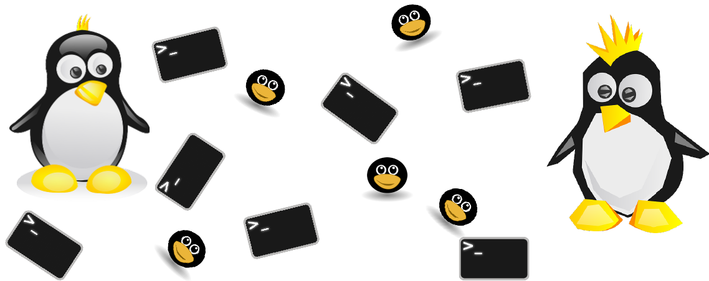

This is the first part of two-parts chapter pair. These two chapters will teach you about Unix processes. 
The Unix process architecture is more than 40 years old and will remain in place for many years to come, no matter what programming 
languages will appear in the future. No matter if you program in Ruby, Python or JavaScript or other popular, or non-popular programming language, 
knowledge of how Unix processes work, will prove to be invaluable to you. This knowledge will render you able to debug and improve
the performance of your application and deployment architecture. With the power that you are going to gain
from this chapter you will be able to advance your programming career to one more level higher. 

Read the learning goals to get an idea what this chapter will teach you about.
