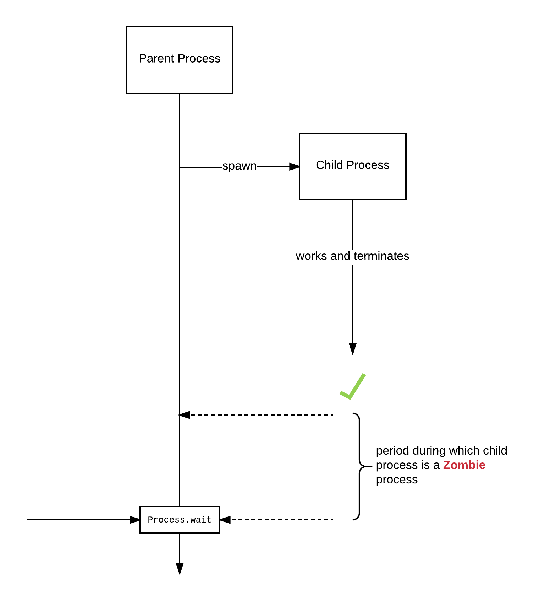
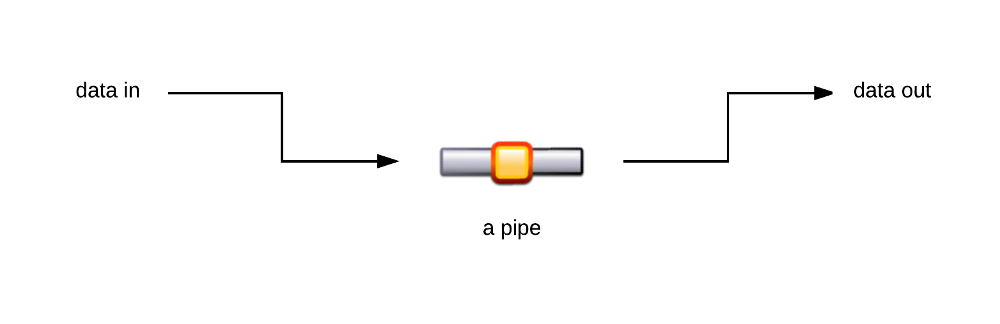
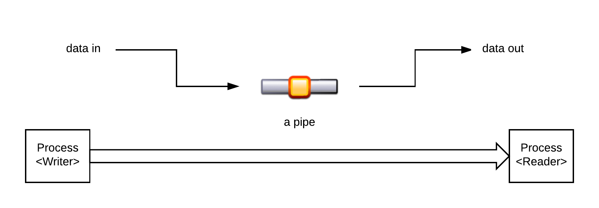
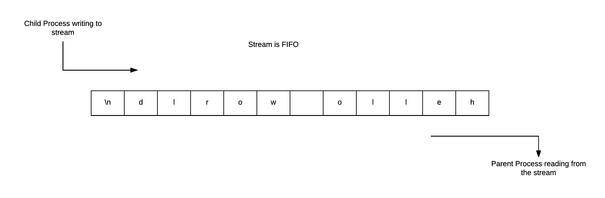
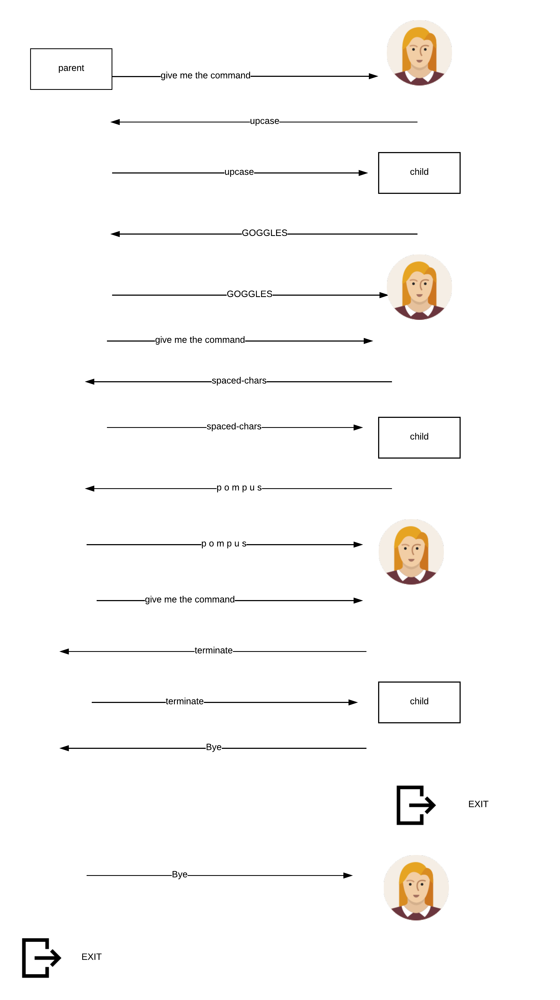
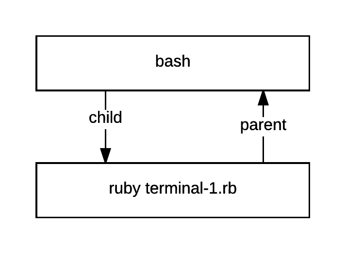
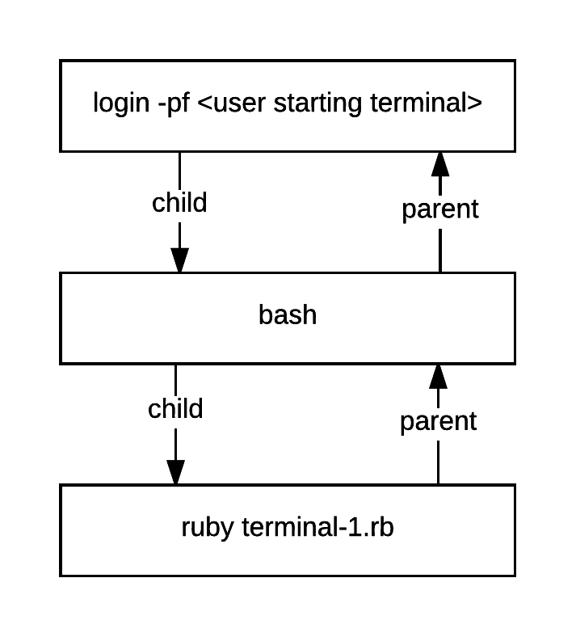
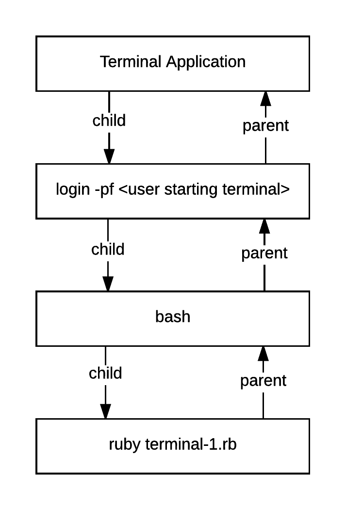
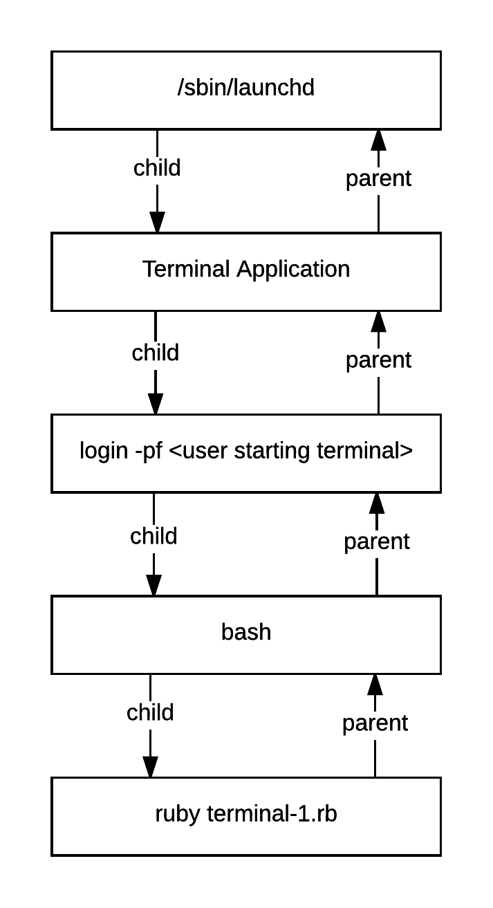

We have learned in the previous chapter that a child process can exit and it can send its exit status code to the parent process.
 
## Exit Status is Queued Up

What happens if child process has finished before parent process reaches the Ruby statement `Process.wait` (or its cousins)?

Let's try the following example `fork-10.rb`:

``` ruby
 1. # File: fork-10.rb
 2. #
 3. puts "Parent process with with id: #{Process.pid} will spawn a child that will quickly exit."
 4. 
 5. fork do
 6.   puts "Child process #{Process.pid} with parent #{Process.ppid} will now exit."
 7.   exit
 8. end
 9. 
10. puts 'Parent process will sleep for 5 seconds'
11. 5.times do |i|
12.   puts "parent sleeping (#{i + 1})... "
13.   sleep 1
14. end
15. 
16. puts 'Now waiting for the child process to finish'
17. child_process = Process.wait
18. 
19. puts "Child process with id: #{child_process} has finished!"
```

The above program starts a process that 

1. spawns a child process (lines 5 to 8).
2. the child process exits almost immediately (after printing a message on the standard output).
3. parent process sleeps for 5 seconds (printing some information every second).
4. then parent waits for the child process to finish with `Process.wait`. 

However, since the child process has already finished quite before `Process.wait` call, the `Process.wait` does not
block the execution of the parent. It gets the child process id and returns it back to the parent process. Then,
parent process executes the next statement.

This program, then, proves that the kernel queues the child process information as soon as it finishes, until the
parent process decides to consume that information with a call to `Process.wait` (or any of its cousins).

> *Reminder:* `Process.wait` and its cousins raise an exception `Errno::ECHILD` if this process does not have
any child information in the operating system process table, waiting to be consumed. In other words, when
this process does not have any child processes terminated and not have been waited for. Revise with the following
examples:
> 
> Try the following command on your terminal:
>
> ``` bash
> $ ruby -e "Process.wait"
>   -e:1:in `wait': No child processes (Errno::ECHILD)
>         from -e:1:in `<main>'
> $
> ```
> You can see the exception because the process didn't create any child.
>
> Try now this:
> 
> ``` bash
> $ ruby -e "fork {}; Process.wait"
> $
> ```
>
> This ran without any exception. The `Process.wait` consumed the exit information of the child process created with `fork {}`.
>
> Now try this command:
>
> ``` bash
> $ ruby -e "fork {}; Process.wait; Process.wait"
>   -e:1:in `wait': No child processes (Errno::ECHILD)
>         from -e:1:in `<main>'
> $
> ```
> 
> This time, you get an exception but for the second `Process.wait`. This is because there is no child exit information, inside
> the operation system process table, waiting to be consumed. There was only 1 that was consumed by the first `Process.wait`.
>

## Parent Detaches Child Processes - Zombie or Defunct Processes

We have learned how a parent process will collect child process exit information with some variants of `Process.wait`.
We have also learned that if the child process terminates before the parent process calls `Process.wait`, the information
of the child process is still available by the operating system and it is passed to parent process when the `Process.wait` 
takes place.

Having said that, if the child process terminates before the parent process calls `Process.wait`, that child process 
is called *zombie* or *defunct* process, i.e. it is a process that does not exist as real process, since it has exited,
but its exit information still exists in the operating system process table, until the parent process picks it up with
a call to `Process.wait`.



Hence, you understand that zombie processes, even if they have exited, they still occupy resources. Also, they can be
listed in the process table (`ps` command).

Let's see the program `zombie-1.rb`:

``` ruby
 1. # File: zombie-1.rb
 2. #
 3. pid = fork do
 4.   puts "child will now exit"
 5. end
 6. 
 7. puts pid
 8. puts 'Parent will sleep for 30 seconds to give you enough time to inspect the zombie process. Try ps -l on another terminal.'
 9. sleep 30
10. Process.wait
11. puts 'Parent will sleep for 30 seconds to give you enough time to inspect that no zombie process exists any more. Try ps -l on another terminal.'
12. sleep 30
13. puts 'Parent terminates'
```

This program spawns a child process that quickly terminates. The parent process waits for 30 seconds a period during which
the child process becomes a zombie process. You can inspect the zombie process using the `ps -l` command on another terminal.
After the 30 seconds wait, parent process calls `Process.wait` which consumes the information stored in the process table for the
zombie child process. This eliminates the zombie process completely and resources are returned to the operating system.

Watch the following video to see how this program is executed and how we inspect the zombie process:

<div id="media-container-video-Demo of a Zombie Process">
  <a href="https://player.vimeo.com/video/201694501"></a>
</div>

So far so good. But keeping the resources of the operating system without any good reason is something that you should avoid. What happens if the parent
process is a process that is designed to run for 2 weeks continuously, for example, and create 100 processes per
day. That would mean too many zombie processes if parent process didn't wait for their children, or if waited quite a long time after the
moment a child process exits, for example just before parent process exists itself. 

This means that the parent process needs to make sure that it waits for their children processes or otherwise call `Process.detach`, which
basically tells Ruby to create another thread (more about threads in the corresponding chapter) of execution, in order to wait for the child process.
Hence, when the child process terminates, there is always a piece of running code that waits for it and we don't have a zombie process. Also, parent
process is allowed to proceed with any other task that it might be responsible to carry out. 


Let's modify the previous program to detach the child process created (`zombie-2.rb`):

``` ruby
 1. # File: zombie-2.rb
 2. #
 3. pid = fork do
 4.   puts "child will now exit"
 5. end
 6. 
 7. puts pid
 8. puts 'Parent will now detach the child process'
 9. Process.detach(pid)
10. 
11. puts 'Parent will sleep for 15 seconds to give you enough time to inspect that no zombie process exists. Try ps -l on another terminal.'
12. sleep 15
13. 
14. puts 'Parent terminates'
```

On line 9 above, we call `Process.detach` giving as argument the process id of the child process. This tells Ruby that the parent process will
not wait for the child process to finish.

Let's run this program and, on another terminal, inspect that there isn't any zombie process anymore.

<div id="media-container-video-Demo Detaching a Child Process">
  <a href="https://player.vimeo.com/video/201704399"></a>
</div>

In summary, use either `Process.wait` or `Process.detach`. Otherwise, your parent process, when living for long, will be creating zombie processes.

## Non-Blocking Waiting for Child Processes

So far we dealt with the `Process.wait` flavour that blocks the parent process waiting for child processes. However, there is one more flavour that
allows a non-blocking `Process.wait`:

``` ruby
Process.wait( -1, Process::WNOHANG)
```

However, we remind you that this raises an exception `Errno::ECHILD`, if no child process is running or no child process has run and has not been
waited for (i.e. has become zombie). This exception needs to be rescued, otherwise your parent process will terminate with error.

Look at the following example `no-wait-1.rb`:

``` ruby
1. # File: no-wait-1.rb
2. #
3. Process.wait(-1, Process::WNOHANG)
```

If you run this program, you will get this:

``` bash
$ ruby no-wait-1.rb
no-wait-1.rb:3:in `wait': No child processes (Errno::ECHILD)
        from no-wait-1.rb:3:in `<main>'
$
```

This is because the exception was raised and we didn't rescue.

You need to understand what we said earlier. The statement does not raise an exception if a child process is running but has not finished yet.
It just returns `nil`. See the program `no-wait-2.rb`:

``` ruby
1. # File: no-wait-2.rb
2. #
3. fork { sleep 10 }
4. Process.wait(-1, Process::WNOHANG)
```

If you run that, you will not get any exception: there are child processes running.

Also, this program (`no-wait-3.rb`) will not raise an exception:

``` ruby
# File: no-wait-3.rb
#
fork { exit }
Process.wait(-1, Process::WNOHANG)
```
obviously, because the child exit status has been queued and `Process.wait` succeeds in getting it.

Again, `Process::WNOHANG` on `Process.wait(-1, Process::WNOHANG)` does not block the parent process if a child has not finished yet, i.e.
if there is no child exit information queued. Also, it raises an exception `Errno::ECHILD` if there is no child running. 

How this might be useful? It is useful when the parent process has some real job to do and at the same time it is interested to know when their
child processes finish (and their exist status). Let's see the following program:

``` ruby
 1. # File: no-wait-4.rb
 2. #
 3. number_of_child_processes = 3
 4. number_of_terminated_child_processes = 0
 5. 
 6. # spawn the three child processes
 7. number_of_child_processes.times do |i|
 8.   fork do
 9.     puts "I am child process with id #{Process.pid}, with #{9 + i + 1} seconds work to do"
10.     sleep 9 + i + 1
11.   end
12. end
13. 
14. # parent process works for 50 seconds and in between it checks whether children have finished
15. 5.times do |i|
16.   begin
17.     pid = Process.wait(-1, Process::WNOHANG)
18.     if pid
19.       puts "I am parent and my child with #{pid} finished!"
20.       number_of_terminated_child_processes += 1
21.     end
22.   rescue Errno::ECHILD
23.   end
24.   puts "Number of processes finished so far: #{number_of_terminated_child_processes}"
25.   puts "I am parent and I will do my #{i + 1} batch of work for 10 seconds"
26.   sleep 10
27. end
28. 
29. puts 'Parent finished its job...now go to wait for any child process pending'
30. 
31. # after having finished my job as parent, let me wait until any pending child finishes,
32. # although I do not expect any to finish after me.
33. while number_of_terminated_child_processes < number_of_child_processes
34.   Process.wait
35.   puts "I am parent and my child with #{pid} finished!"
36.   number_of_terminated_child_processes += 1
37. end
```

The above program, first spawns 3 child processes. Each one doing some heavy work of about 10 seconds each. This is coded in lines 3 to 12.
Then parent process has to do heavy work too. It breaks that into 5 repetitions of 10 seconds each. Lines 15 to 27. But before actually
doing its heavy work (lines 25 and 26) it checks whether any child process has finished:

1. It has to do that with the non-blocking version of `Process.wait`, i.e. with `Process.wait(-1, Process::WNOHANG)`, and
2. needs to make sure that it takes advantage of the information returned if that is not `nil` (lines 18 till 21), and
3. needs to make sure that does not terminate with an error, by rescuing the exception `Errno::ECHILD`. 

Finally, between lines 29 and 37, when parent process has finished doing its work and does not have anything else to do, it makes
sure that all child processes have finished. If not, it waits for them (line 34).

If you run this program, you will get something like this:

``` bash
$ ruby no-wait-4.rb
I am child process with id 6904, with 10 seconds work to do
Number of processes finished so far: 0
I am parent and I will do my 1 batch of work for 10 seconds
I am child process with id 6905, with 11 seconds work to do
I am child process with id 6906, with 12 seconds work to do
Number of processes finished so far: 0
I am parent and I will do my 2 batch of work for 10 seconds
I am parent and my child with 6906 finished!
Number of processes finished so far: 1
I am parent and I will do my 3 batch of work for 10 seconds
I am parent and my child with 6905 finished!
Number of processes finished so far: 2
I am parent and I will do my 4 batch of work for 10 seconds
I am parent and my child with 6904 finished!
Number of processes finished so far: 3
I am parent and I will do my 5 batch of work for 10 seconds
Parent finished its job...now go to wait for any child process pending
$
```

## Checking for More Than One Child

That was one good approach to let the parent process do work in parallel with the child processes. Also, parent was a good one,
waiting for their children once in a while. Hence, parent was polling the operating system for any child that might have finished.

However, currently, the above version, calls `Process.wait(-1, Process::WNOHANG)` only once. This means that every time the parent
process decides to check for possible finished child, it picks up the exit information for only one child, even if more child
processes might have finished in between. In other words, while parent process does its heavy work, more than one child process
might have finished, but the point of code in the `while` loop, that checks for finished child processes, will return only for
one of those.

Let's improve that (`no-wait-5.rb`):

``` ruby
 1. # File: no-wait-5.rb
 2. #
 3. number_of_child_processes = 3
 4. number_of_terminated_child_processes = 0
 5. 
 6. # spawn the three child processes
 7. number_of_child_processes.times do |i|
 8.   fork do
 9.     puts "I am child process with id #{Process.pid}, with #{9 + i + 1} seconds work to do"
10.     sleep 9 + i + 1
11.   end
12. end
13. 
14. # parent process works for 50 seconds and in between it checks whether children have finished
15. 5.times do |i|
16.   begin
17.     while pid = Process.wait(-1, Process::WNOHANG)
18.       puts "I am parent and my child with #{pid} finished!"
19.       number_of_terminated_child_processes += 1
20.     end
21.   rescue Errno::ECHILD
22.   end
23.   puts "Number of processes finished so far: #{number_of_terminated_child_processes}"
24.   puts "I am parent and I will do my #{i + 1} batch of work for 10 seconds"
25.   sleep 10
26. end
27. 
28. puts 'Parent finished its job...now go to wait for any child process pending'
29. 
30. # after having finished my job as parent, let me wait until any pending child finishes,
31. # although I do not expect any to finish after me.
32. while number_of_terminated_child_processes < number_of_child_processes
33.   Process.wait
34.   puts "I am parent and my child with #{pid} finished!"
35.   number_of_terminated_child_processes += 1
36. end
```

This program has a very small difference if compared to the previous version. Instead of ...

``` ruby
    pid = Process.wait(-1, Process::WNOHANG)
    if pid
      puts "I am parent and my child with #{pid} finished!"
      number_of_terminated_child_processes += 1
    end
```

it has ...

``` ruby
    while pid = Process.wait(-1, Process::WNOHANG)
      puts "I am parent and my child with #{pid} finished!"
      number_of_terminated_child_processes += 1
    end
````

In other words, when parent process wants to check whether a child process has finished or not (in order to collect its information),
it does that until `Process.wait(-1, Process::WNOHANG)` returns `nil` (case in which child processes still running) or until it raises
the exception `Errno::ECHILD` (case in which child processes would have been finished).

Doing so, it allows parent process to consume the terminating information of all the child processes that had been finished up to that
point.

Let's run this program now:

``` bash
$ ruby no-wait-5.rb
 1. Number of processes finished so far: 0
 2. I am parent and I will do my 1 batch of work for 10 seconds
 3. I am child process with id 7732, with 10 seconds work to do
 4. I am child process with id 7733, with 11 seconds work to do
 5. I am child process with id 7734, with 12 seconds work to do
 6. Number of processes finished so far: 0
 7. I am parent and I will do my 2 batch of work for 10 seconds
 8. I am parent and my child with 7734 finished!
 9. I am parent and my child with 7733 finished!
10. I am parent and my child with 7732 finished!
11. Number of processes finished so far: 3
12. I am parent and I will do my 3 batch of work for 10 seconds
13. Number of processes finished so far: 3
14. I am parent and I will do my 4 batch of work for 10 seconds
15. Number of processes finished so far: 3
16. I am parent and I will do my 5 batch of work for 10 seconds
17. Parent finished its job...now go to wait for any child process pending
$
```

According to the output above, when parent process finishes its 2nd batch of heavy work, i.e. after 20 seconds, all the
child processes are finished and their information is collected.

## Notified Instead of Polling

The previous two versions of the parent process are quite good. Parent has very good control over its child processes, with
regards to collecting their exit information. The model here is that the parent needs to pause what is doing and check
whether a child has finished. So parent is polling periodically for finished child processes.

There is another model we can use to have the parent process being notified for terminated child processes. This takes advantage
of the signal `SIGCHLD` (Read more about signals in the `Exceptions` chapter). This signal is sent to the parent process every 
time a child process terminates. Hence, parent can *trap* this signal and do whatever it has to do to deal with the terminating
child.

Here is a short example trapping the `SIGCHLD` signal (`signal-child-1.rb`):

``` ruby
 1. # File: signal-child-1.rb
 2. #
 3. trap('SIGCHLD') do
 4.   puts '**************** trapped terminated child code *********************'
 5. end
 6. 
 7. puts 'Parent will spawn a child sleeping 2 seconds'
 8. 
 9. fork { sleep 2 }
10. 
11. puts 'Parent will sleep for 5 seconds'
12. sleep 5
```

If you run this program, you will see this:

``` bash
$ ruby signal-child-1.rb
Parent will spawn a child sleeping 2 seconds
Parent will sleep for 5 seconds
**************** trapped terminated child code *********************
$
```

You can see how the piece of code in the trapping block is executed.

Let's see another example. `signal-child-2.rb` spawns 3 child processes each one terminating at different time intervals.

``` ruby
 1. # File: signal-child-2.rb
 2. #
 3. trap('SIGCHLD') do
 4.   puts '**************** trapped terminated child code *********************'
 5. end
 6. 
 7. puts 'Parent will spawn 3 children sleeping 2, 3 and 4 seconds respectively'
 8. 
 9. 3.times do |i|
10.   fork { sleep 1 + i + 1 }
11. end
12. 
13. puts 'Parent will sleep for 8 seconds'
14. sleep 8
```

First child process will finish after 2 seconds, third child process will finish after 3 seconds and fourth child process
will finish after 4 seconds. The parent process will finish after 8 seconds. 

If we run this program, we will see the message `**************** trapped terminated child code *********************` being
printed 3 times, since we have spawned 3 child processes. Let's do that:

``` bash
$ ruby signal-child-2.rb
Parent will spawn 3 children sleeping 2, 3 and 4 seconds respectively
Parent will sleep for 8 seconds
**************** trapped terminated child code *********************
**************** trapped terminated child code *********************
**************** trapped terminated child code *********************
$
```

Cool. Everything seems to be ok, but there are cases in which this does not work like that. Let's see the program `signal-child-3.rb`:

``` ruby
 1. # File: signal-child-3.rb
 2. #
 3. trap('SIGCHLD') do
 4.   puts '**************** trapped terminated child code *********************'
 5. end
 6. 
 7. puts 'Parent will spawn 3 children sleeping 3 seconds each'
 8. 
 9. 3.times do |i|
10.   fork { sleep 3 }
11. end
12. 
13. puts 'Parent will sleep for 5 seconds'
14. sleep 5
```

The difference now is that all child processes will work (`sleep`) the same amount of time. Which means that they will
finish almost simultaneously. That also means that the `trap` code will be invoked almost simultaneously too. Let's try to
run the program:

``` bash
$ ruby signal-child-3.rb
Parent will spawn 3 children sleeping 3 seconds each
Parent will sleep for 5 seconds
**************** trapped terminated child code *********************
$
```

Problem...we can see that the `trap` message is only printed once. This means that the `trap` code has been executed only
once. 

This is because the signal `SIGCHLD` is not handled by the parent process if it is already in the process of handling a
previous one. It is actually discarded (this is true for all the signal handling code actually). Hence `SIGCHLD` signal for the
first child process works, but `SIGCHLD` signals for the second and third child processes are ignored, since they are received
while processing the `SIGCHLD` signal of the first child process.

## Trapping and Polling At the Same Time

Now that we do know about this, how can we trap and deal with all child processes terminating? We will use the loop technique
we used earlier. See the program `signal-child-4.rb`:

``` ruby
 1. # File: signal-child-4.rb
 2. #
 3. trap('SIGCHLD') do
 4.   begin
 5.     while pid = Process.wait(-1, Process::WNOHANG)
 6.       puts '**************** trapped terminated child code *********************'
 7.     end
 8.   rescue Errno::ECHILD
 9.   end
10. end
11. 
12. puts 'Parent will spawn 3 children sleeping 3 seconds each'
13. 
14. 3.times do |i|
15.   fork { sleep 3 }
16. end
17. 
18. puts 'Parent will sleep for 5 seconds'
19. sleep 5
```

See the code between lines 4 and 9. It is not something new. We have used this technique earlier. Let's run the program now:

``` bash
$ ruby signal-child-4.rb
Parent will spawn 3 children sleeping 3 seconds each
Parent will sleep for 5 seconds
**************** trapped terminated child code *********************
**************** trapped terminated child code *********************
**************** trapped terminated child code *********************
$
```

Bingo! We have managed to execute the code for all the terminating children.

Having done that, let's rewrite the program `no-wait-5.rb` to use this new trap and polling technique to rewrite it:

``` ruby
 1. # File: signal-child-5.rb
 2. #
 3. number_of_child_processes = 3
 4. number_of_terminated_child_processes = 0
 5. 
 6. trap('SIGCHLD') do
 7.   begin
 8.     while pid = Process.wait(-1, Process::WNOHANG)
 9.       puts "I am parent and my child with #{pid} finished!"
10.       number_of_terminated_child_processes += 1
11.     end
12.   rescue Errno::ECHILD
13.   end
14. end
15. 
16. # spawn the three child processes
17. number_of_child_processes.times do |i|
18.   fork do
19.     puts "I am child process with id #{Process.pid}, with #{9 + i + 1} seconds work to do"
20.     sleep 9 + i + 1
21.   end
22. end
23. 
24. # parent process works for 50 seconds and in between it checks whether children have finished
25. 5.times do |i|
26.   puts "Number of processes finished so far: #{number_of_terminated_child_processes}"
27.   puts "I am parent and I will do my #{i + 1} batch of work for 10 seconds"
28.   sleep 10
29. end
30. 
31. puts 'Parent finished its job...now go to wait for any child process pending'
32. 
33. # after having finished my job as parent, let me wait until any pending child finishes,
34. # although I do not expect any to finish after me.
35. while number_of_terminated_child_processes < number_of_child_processes
36.   Process.wait
37.   puts "I am parent and my child with #{pid} finished!"
38.   number_of_terminated_child_processes += 1
39. end
```
 
You can see now that parent process does its work without having polling code in between the lines of code that
have to do with its own work (line 25 till 29). It has installed a signal trap and deals with the terminated children
in that piece of code. Much neater.

## Processes Can Send Signals to Other Processes

We have talked about signals in the `Exceptions` chapter. There, we have seen how the user could send signal from the
keyboard, or invoking the `kill` command. 

Those were actually examples of signal inter-process communication. One process can send a signal to another. When we
invoke `kill -9 12344` we ask the process `kill` to send the signal `-9` to the process with id `12344`. 

Ruby allows you to send signals too from within your Ruby application. In other words, you can send a signal from one
process to another using Ruby.

Let's see how we can do that. Let's write a program that runs forever but can handle the `SIGUSR1` signal. Here it is (`worker-1.rb`):

``` ruby
1. # File: worker-1.rb
2. #
3. trap('SIGUSR1') do
4.   puts 'Hey there!'
5. end
6. 
7. puts "I am process with id: #{Process.pid} and I am going to work forever..."
8. 
9. sleep
```

Start this program and then, go to another terminal and call the command `kill -SIGUSR1 <process id of the program>`. You will see the
program responding with `Hey there!`.

> *Information:* The `sleep` without arguments ... sleeps forever.

Here is how we did that:

<div id="media-container-Process Traps SIGUSR1 Signal">
  <a href="https://player.vimeo.com/video/201707508"></a>
</div>

But can we have another Ruby process, instead of `kill`, sending the `SIGUSR1` signal? Yes we can. We only have to use the `Process.kill` statement.

Start the previous program again, and, then on another terminal invoke the following command:

``` bash
$ ruby -e "Process.kill('SIGUSR1', <process id>)"
$
```

You will see the signal-receiving process printing the `Hey there!` message.

Let's see that in the following video:

<div id="media-container-video-Sending Signal From A Ruby Process">
  <a href="https://player.vimeo.com/video/201707932"></a>
</div>


## Inter-Process Communication With Pipes

We have already talked about pipes (see previous chapter). But how can we use pipes from within our own Ruby programs? How can we make two processes
communicate using pipes?

Pipes are unidirectional channels of communication. This means that data flows from one end of the pipe towards the other end
of the pipe, but not in the other direction. 



The end on which a pipe accepts data is the writing end, because we write data to the pipe. The end out of which a pipe generates data
is called the reading end, because we read data from the pipe.

When two processes communicate using a pipe, they claim either of the two ends. One process becomes the writer. It writes data
to the writing end of the pipe. The other process becomes the reader. It reads data from the reading end of the pipe.
Hence, the reading process reads the data that the writing process writes to the pipe. 



Let's see how we do that in practice, writing some Ruby code. We will write a program that would have one parent and one child process.
The child process will be sending information back to the parent. The parent will be responsible to print that information on the STDOUT.
These two processes will be using a pipe to communicate. The child process will be the *writer* and the parent process will be the *reader*.

Here it is:

``` ruby
 1. # File: pipe-1.rb
 2. #
 3. reader, writer = IO.pipe
 4. 
 5. fork do
 6.   reader.close # child process is going to be the writer
 7.                # so, we close the reading channel
 8.   words = [
 9.     'blubber',
10.     'discombobulated',
11.     'doodle',
12.     'doozy',
13.     'feeble',
14.     'finagle',
15.     'gargoyle',
16.     'goggles',
17.     'haphazard',
18.     'hogwash',
19.     'pompous',
20.     'ramshackle',
21.     'squelch'
22.   ]
23.   20.times do
24.     one_word = words.sample(1)[0]
25. 
26.     writer.puts one_word
27. 
28.     sleep 1
29.   end
30.   writer.close # no more to write
31. end
32. 
33. writer.close # parent is going to be the reader, not writer.
34. while message = reader.gets
35.   $stdout.puts message.upcase
36. end
37.
38. reader.close
39.
40. puts 'Parent process: no more words to read'
```

The program is very simple. The child process picks up a word from the set of `words` and writes to the writing end of 
the pipe (line 26). The parent process continuously reads from the reading end of the pipe, using `#gets` command, like
we read words from the input. The `message = reader.gets` blocks until there is a new word written by the child process.
If a new word is written, then parent process prints the word, upper cased (line 35), and then goes back to read another
one. The parent process terminates when the pipe is closed by the child process (line 30).

The new piece of code for you is the statement:

``` ruby
reader, writer = IO.pipe
```

This creates the pipe, obviously, and returns back the two ending points of the pipe, the `reader` and the `writer`. Then,
each process closes the end of the pipe that it does not use. So, on this particular example,
the child process closes the reading end (line 6) and the parent process closes the writing end (line 33). Each process
keeps open only the end of the pipe that it needs. And it closes it, when it no longer needs it. On our example, child process
closes the writing end on line 30 and parent process closes the reading end on line 38.

Let's run this program:

``` bash
$ ruby pipe-1.rb
HOGWASH
FEEBLE
POMPOUS
DOODLE
BLUBBER
RAMSHACKLE
FINAGLE
GARGOYLE
RAMSHACKLE
HAPHAZARD
FEEBLE
FINAGLE
POMPOUS
FINAGLE
HOGWASH
DOOZY
POMPOUS
DOODLE
GOGGLES
BLUBBER
Parent process: no more words to read
$
```

The above is an example run. At your side, the words printed will be different of course, because they are randomly sampled from the set of words.

Note that communicating using pipes like above, is an example of a *stream* mode communication. The receiving end knows when something has been
sent using an agreed delimiter found within the incoming stream of data. Also, the writing end writes data and terminates each of its messages using the
agreed delimiter. On our example above, the delimiter is the new-line character. The writing child process writes messages using `#puts` command which
appends a new-line character at the end of the string. The reading parent process reads messages from the pipe using `#gets` command which stops reading
a message when it encounters the new-line character.



## Datagrams and Unix Sockets

Besides the *stream* mode of communication, we can also have the *message* mode of communication. On this mode, the sending end sends a message, a series of
bytes, of specific size. The receiving end knows how big that message is and reads all the bytes up to that size. There is no need for an agreed delimiter.
The agreement is on the size of the message.

We cannot switch to this mode of communication using pipes. But we can use *Unix Sockets* to achieve that. We will have more to say about sockets when we will
be doing the Web development part of this course. For the time being, we want to say that *Unix Sockets* are sockets used for communication between processes
living *on the same machine*. So, it is another technique for IPC (Inter-Process Communication).

Note that the sockets are bi-directional, whereas the pipes are not. Let's see another example of communication between two processes, a parent and a child
(`unix-sockets-1.rb`):

``` ruby
 1. # File: unix-sockets-1.rb
 2. #
 3. require 'socket'
 4. 
 5. child_socket, parent_socket = Socket.pair(:UNIX, :DGRAM, 0)
 6. # child_socket will be used by the child process
 7. # parent_socket will be used by the parent process
 8. 
 9. maxlen = 100
10. 
11. fork do
12.   parent_socket.close # child process does not need the parent socket
13.   words = [
14.       'blubber',
15.       'discombobulated',
16.       'doodle',
17.       'doozy',
18.       'feeble',
19.       'finagle',
20.       'gargoyle',
21.       'goggles',
22.       'haphazard',
23.       'hogwash',
24.       'pompous',
25.       'ramshackle',
26.       'squelch'
27.   ]
28. 
29.   while true
30.     conversion_command = child_socket.recv(maxlen)
31.     one_word = words.sample(1)[0]
32.     case conversion_command
33.       when 'upcase'
34.         one_word = one_word.upcase
35.       when 'spaced-chars'
36.         one_word = one_word.gsub(/(?<char>.)/, '\k<char> ').strip # A word like "foo" becomes "f o o"
37.       when 'terminate'
38.         child_socket.send('bye', 0)
39.         child_socket.close
40.         exit # This will end the child
41.       else
42.         nil # We will not do anything to the word chosen. We will just send that over
43.     end
44.     child_socket.send(one_word, 0)
45.   end
46. end
47. 
48. child_socket.close
49. 
50. answer = ''
51. while answer != 'terminate'
52.   print 'Give me the command to send to client process (upcase, spaced-chars, terminate): '
53.   answer = gets.chomp.downcase
54. 
55.   parent_socket.send(answer, 0) # send the command to child process
56. 
57.   word_received = parent_socket.recv(maxlen) # receive the answer back
58. 
59.   puts word_received # print the answer
60. end
61. 
62. puts "Parent terminates!"
```

This is a program on which the parent process gets a command from the user and passes that command to the child process.
The child process returns back a word to the parent, according to the command that it has received. Parent process prints the
returned word back on the terminal and asks the user to give the next command. If the user types in `terminate` child process exits
and then, parent process exits too.



You can also see an example run of this program on the video below:

<div id="media-container-video-Unix Sockets Example">
  <a href="https://player.vimeo.com/video/201722630"></a>
</div>

Let's see some of the technical details of the implementation of this program:

1. The statement `child_socket, parent_socket = Socket.pair(:UNIX, :DGRAM, 0)` creates two ends of the same Unix Socket. Each end of type `Socket`. 
The `:UNIX` (i.e. the *domain* of the socket) and `:DGRAM` (i.e. the *type*) of the socket, is about creating Unix Sockets pair of datagram type.
This is used for sockets that exchange bytes via fixed size messages rather than streams.
The `0` value given as third argument is the socket `protocol` and depends on the domain. Actually, the value `0` tells operating system to pick up
the most appropriate protocol for the domain and type given. We usually leave that to have the value `0`.
2. The `child_socket.recv(maxlen)` command blocks until something is put on this socket by a sending end, i.e. the parent. It will receive up to 100 bytes (`maxlen = 100`)
and then will return the read bytes into `conversion_command`. The corresponding `parent.send(...)` command will send the conversion command.
3. The `child_socket.send('bye', 0)` command writes the 'bye' word to the `child_socket` end of the socket. A corresponding `parent.recv(maxlen)` command reads that and acts
accordingly.
4. Note that the `#send` method call is not the `#send` call that we use to invoke a method by its symbol name. It is the method exposed by `Socket` class
as derived by `BasicSocket` class (`BasicSocket` is the `superclass` of `Socket`). The first argument is the message to send to the other pair of the socket.
This message should be a string. The second argument is an integer calculated as the bitwise OR of `SOCKET::MSG_` constants. For our example sending `0` as the
second argument is enough. We will talk more about sockets in the Web development part of this course.

Note also that:

1. `#recv` command used above is a blocking command. The child process `child_socket.recv(maxlen)` will block until it receives at most 100 bytes of data.
2. On the other hand, the `#send` command is not blocking. It will send the data to the socket and will return immediately. Even if no `#recv` statement is
blocked waiting data at the other end.

Look at the following `irb` code:

``` ruby
2.2.3 :001 > require 'socket'
 => true 
2.2.3 :002 > end1, end2 = Socket.pair(:UNIX, :DGRAM, 0)
 => [#<Socket:fd 9>, #<Socket:fd 10>] 
2.2.3 :003 > end1.send('foo', 0)
 => 3 
2.2.3 :004 > end2.recv(100)
 => "foo" 
2.2.3 :005 > 
```

You can see that `end1.send('foo', 0)` returns immediately and does not fail, even if the receiving end starts receiving after the send has finished.
However, if you try to run the irb example by first calling `#recv`, then, `#recv` will block irb program waiting for *somebody* to send data. 

So, the communication is asynchronous. And as you can see, the socket pair ends can even be on the same process.

## Terminal Controlled Processes

Up until now, we have seen processes being under the control of a terminal which is usually controlled by the user. What does that mean? It means that we had
our processes start using a terminal window. If we closed the window for some reason, then that process would die too. Also, the process would respond to
signals coming from the terminal. For example, if the user typed in <kbd>Ctrl + C</kbd> that would be sent to our process.
 
Run the following program on a terminal and then just close the terminal. You will not have this process run any more.
 
``` ruby
# File: terminal-1.rb
#
puts "This is process #{Process.pid} and will sleep forever"
sleep
```

Here is a video that demonstrates the above:

<div id="media-container-video-Terminal Controlled Processes">
  <a href="https://player.vimeo.com/video/201724019"></a>
</div>

These processes, that are being controlled by the terminal, we say that they run on the *foreground*. If the terminal window closes, then we lose the process too.

Before we can see a way to detach this process from the terminal, let's trace the process tree for such a running process.

Start the process and then on another terminal try to trace its process tree. You will need to use the command `ps -l -p <process id>` to get information about a process
and locate its parent process id. Then you go recursively towards the root process of the tree, which is the process with id `1`.

Here is how it is done on my end:

(1) Start the process:

``` bash
$ ruby terminal-1.rb
This is process 3280 and will sleep forever
```

(2) While process is running, on another terminal, let's get the details of the process with id `3280` (which is the process id of my 
terminal controlled process that I have just started):

``` bash
$ ps -l -p 3280
  UID   PID  PPID        F CPU PRI NI       SZ    RSS WCHAN     S             ADDR TTY           TIME CMD
  501  3280  2936     4006   0  31  0  2450024   6548 -      S+                  0 ttys001    0:00.02 ruby terminal-1.rb
$
```

You can see that the `PPID` is `2936`. Let's see which process is that:

(3) On the same terminal:

``` bash
$ ps -l -p 2936
  UID   PID  PPID        F CPU PRI NI       SZ    RSS WCHAN     S             ADDR TTY           TIME CMD
  501  2936  2935     4006   0  31  0  2484588   4184 -      S                   0 ttys001    0:00.21 -bash
```

which reveals the parent process of our process being a `CMD` `-bash`, i.e. a `bash` shell. 



(4) The parent of the `bash` shell is the process with id `2935`. Let's see its details:

``` bash
$ ps -l -p 2935
  UID   PID  PPID        F CPU PRI NI       SZ    RSS WCHAN     S             ADDR TTY           TIME CMD
    0  2935   481     4106   0  31  0  2507872   3152 -      Ss                  0 ttys001    0:00.04 login -pf panayotismatsinopoulos
$
```

which reveals the parent of the `bash` process. It is a `login` process running: `login -pf panayotismatsinopoulos`. This is because
when we open a terminal the terminal makes sure we first login as the particular user (`panayotismatsinopoulos`) so that all the processes we
start from there they would belong to that user.



(5) Let's reveal the parent details of the `login` process. It is the process with id `481`:

``` bash
$ ps -l -p 481
  UID   PID  PPID        F CPU PRI NI       SZ    RSS WCHAN     S             ADDR TTY           TIME CMD
  501   481     1     4084   0   4  0  2849476  77004 -      S                   0 ??         0:43.72 /Applications/Utilities/Terminal.app/Contents/MacOS/Terminal -psn_0_57358
$
```

The parent process of the `login` process is the process `...Terminal` (`/Applications/Utilities/Terminal.app/Contents/MacOS/Terminal -psn_0_57358`) that has started when
we started the terminal application.



(6) Let's now reveal the details of the parent process of the terminal application. Its id is `1`:

``` bash
$ ps -l -p 1
  UID   PID  PPID        F CPU PRI NI       SZ    RSS WCHAN     S             ADDR TTY           TIME CMD
    0     1     0     4004   0  37  0  2539720  10408 -      Ss                  0 ??         0:21.54 /sbin/launchd
$
```

The `/sbin/launchd` is the process that is the root parent of all the processes (`init` in Linux distributions). It does not have any parent (try to find the details of the process with id `0`).



Do you see its name ending with the character `d`? This is a convention, because the `/sbin/launchd` is a Daemon process. It is a process that runs on the background and stays
running as long as the computer is running. It is not dependent on any terminal. But we will talk about daemon processes a little bit later.

> *Information:* `pstree` is a very nice command that will print a tree-like output of the process tree. Try it for the command `ruby terminal-1.rb` that you have
already started. You will get something like this:
>
> ``` bash
> $ pstree -p 3280
> -+= 00001 root /sbin/launchd
>  \-+= 00481 panayotismatsinopoulos /Applications/Utilities/Terminal.app/Contents/MacOS/Terminal -psn_0_57358
>    \-+= 02935 root login -pf panayotismatsinopoulos
>      \-+= 02936 panayotismatsinopoulos -bash
>        \--= 03280 panayotismatsinopoulos ruby terminal-1.rb
> $
>
> If the `pstree` command is not installed on your OS X, you can install it with `brew install pstree`. 

Now, please, go back and see again the outputs of the `ps -l -p <process id>` commands. Watch the value for the column `TTY`. You will see that some of the processes
have a value on this column and some they just have a `??`. Those that have a value, it means that they are attached to a terminal. So, on my example above:

1. main process `ruby terminal-1.rb` is attached to terminal `ttys001`.
2. its parent, `bash`, is attached to the same terminal `ttys001`.
3. its parent, `login`, is attached to the same terminal `ttys001`.
4. its parent, `...Terminal` app launcher process is not attached to any terminal.
5. its parent, `/sbin/launchd` root process is not attached to any terminal.

Processes attached to a terminal get their input from the STDIN and send their output to the STDOUT.

Let's keep those details at the back of our head while reading the next paragraph.

> On the terminal on which you have started the command `ruby terminal-1.rb` type <kbd>Ctrl + C</kbd> to terminate it.

## Returning Input Control To User Terminal

When we start a process that runs for very long, we might want to get control of the input of the terminal this process is started from.
In other words, we don't want the process to keep control of the input, but, instead we want it to return back to us a shell prompt. How can we do that? We can
start the process with the `&` at the end. This will make the process run in the background, as we say, and release the terminal input
to us so that we can type in more commands.

Let's try the `terminal-1.rb` again but calling that like this:

``` bash
$ ruby terminal-1.rb &
[1] 4328
$ This is process 4328 and will sleep forever

```

You will see something like the above, but if you type an <kbd>Enter</kbd> you will see the prompt appear again:
 
``` bash
$ ruby terminal-1.rb &
[1] 4328
$ This is process 4328 and will sleep forever

$
```

The process has started and it is running. However, you have full control of the terminal input. Verify that the process is running with `ps -l`, now
on the same terminal (since you have the control, there is no point going to another terminal window):

``` bash
$ ps -l -p 4328
  UID   PID  PPID        F CPU PRI NI       SZ    RSS WCHAN     S             ADDR TTY           TIME CMD
  501  4328  3898     4006   0  31  0  2469480   6820 -      S                   0 ttys001    0:00.03 ruby terminal-1.rb
$
```

The process `ruby terminal-1.rb`, is still running, but has freed the terminal input. However, pay attention to the fact that the `TTY` column
still has a value. The process is still attached to the terminal and if we close the terminal window, the process will die.
Also, this is the reason you see the message `This is process 4328 and will sleep forever` printed on the terminal window when the process
starts. It is because the process still sends its output to its terminal. 

Now close the terminal window and start a new one. On the new terminal window give the command `ps -l -p 4328`. You will not see the process
running anymore. Which proves what we have said above. That the process, even if we started that with `&` suffix and put that on the background,
it was still attached to its terminal.

> *Information*: If you want to terminate a process that is running on the background, without closing the terminal, the typing of <kbd>Ctrl + C</kbd> does no longer work. This
is because the input commands are not propagated from the terminal window to the process that has been put to the background. You will need
to use the `kill <process id>` command.

## Background Process Without Terminal Attached

As we saw earlier, putting the process to the background does not prevent the process from being terminated when the corresponding terminal terminates.
However, sometimes we want the process to go to the background and at the same time survive its terminal termination. 

How can we do that?

You can do that with the help of the `nohup` command. If you start your program using the `nohup` command, then, although the process spawned attaches to the terminal, 
when the terminal terminates, the process will not be terminated. You will be able to find this process if you start a new terminal and issue the command `ps -p <process id>`.
However, when you start a process using `nohup`, then the process output goes to the file `nohup.out` instead of to the standard output. So, you will not see the
output that you might expect to see.

Let's see that:

Start the `ruby terminal-1.rb` command using `nohup ruby terminal-1.rb`. You will see this:

``` bash
$ nohup ruby terminal-1.rb
appending output to nohup.out

```

Then open another terminal and cat the contents of the `nohup.out` file:

``` bash
$ cat nohup.out
$
```

Hmmm! There is no content. This is because the process does not flush the contents to `nohup.out` immediately, as soon as they are sent to the output with the `puts` command.

We will fix that later.

Now, on the new terminal that you are, give the command `ps -l`:

``` bash
$ ps -l
  UID   PID  PPID        F CPU PRI NI       SZ    RSS WCHAN     S             ADDR TTY           TIME CMD
  501 10055 10054     4006   0  31  0  2492780   5244 -      S                   0 ttys000    0:00.29 -bash
  501 10577 10576     4006   0  31  0  2467180   4920 -      S                   0 ttys001    0:00.20 -bash
  501 10768 10577     4006   0  31  0  2451048   6556 -      S+                  0 ttys001    0:00.03 ruby terminal-1.rb
  501  1589   480     4006   0  31  0  2500972    832 -      Ss+                 0 ttys002    0:00.32 /bin/bash --login
$
```

You can definitely see the entry that corresponds to your process. It is `ruby terminal-1.rb`. You can also see that it is attached to a terminal (`tts001`) and
has a parent process (`10577`), which is the `bash` shell. You can also print its process tree:

``` bash
$ pstree -p 10768
-+= 00001 root /sbin/launchd
 \-+= 00481 panayotismatsinopoulos /Applications/Utilities/Terminal.app/Contents/MacOS/Terminal -psn_0_57358
   \-+= 10576 root login -pf panayotismatsinopoulos
     \-+= 10577 panayotismatsinopoulos -bash
       \--= 10768 panayotismatsinopoulos ruby terminal-1.rb
$
```

This output is expected according to what we have learned so far. 

But now, go to the terminal that you have used to start the process (where you gave the command `nohup ruby terminal-1.rb`) and close it.

Having done that, go back to the terminal where you gave `pstree -p 10768` and give it again:

``` bash
$ pstree -p 10768
-+= 00001 root /sbin/launchd
 \--= 10768 panayotismatsinopoulos ruby terminal-1.rb
$
```

Bingo! The process is still running. It survived the terminal termination. But watch out to the following: It has now been inherited by the `root` process with id `1`.
Also, it is not attached to any terminal any more:

``` bash
$ ps -l -p 10768
  UID   PID  PPID        F CPU PRI NI       SZ    RSS WCHAN     S             ADDR TTY           TIME CMD
  501 10768     1     4006   0  31  0  2451048   6556 -      S                   0 ??         0:00.03 ruby terminal-1.rb
$
```

We managed to start a background process that survives the terminal termination. Which is very useful. Imagine that we might have
logged in to a remote server using some terminal services. And we have started a long, background process. Having started that
with `nohup` we make sure that even if we quit the terminal, then process will continue running.

> *Hint:* If you want to terminate the background process, you will need to send the `SIGTERM` signal using `kill` command:
> `kill 10768` (which sends, by default, the `SIGTERM` signal)

Watch out the following video. It demonstrates what we have just said about detaching a process from a terminal.

<div id="media-container-video-Demo of a Zombie Process">
  <a href="https://player.vimeo.com/video/201727439"></a>
</div>

## How to flush content to nohup.out

I guess that this is an answer that you may already know about. We have studied how a process can flush the contents of a file. STDOUT is not different.
Let's change the `terminal-1.rb` a little bit as follows (`terminal-2.rb`):

``` ruby
1. # File: terminal-2.rb
2. #
3. $stdout.puts "This is process #{Process.pid} and will sleep forever"
4. $stdout.flush
5. sleep
```

Now, if you run this program with `nohup`, you will see the `nohup.out` having contents from the very first moment. Let's do that:

Start the process on a brand new terminal:

``` bash
$ nohup ruby terminal-2.rb
appending output to nohup.out

```

Then open another terminal and `cat` the contents of the file `nohup.out`. You will see the message that our program sends to STDOUT with the `puts` command:

``` bash
$ cat nohup.out
This is process 12138 and will sleep forever
$
```

> Send `kill 12138` to terminate the background process.

## `nohup.out` can grow large

This is a gotcha. `nohup.out` may grow large. If you don't ever truncate it, multiple processes that might start on the background with `nohup` will all be
adding content to this. So, usually, we start the process with `nohup` but we also send the STDOUT output to `/dev/null` which is the black hole destination,
i.e. everything that goes there it is just lost. Of course, this technique is only used if we don't really care about the output of the process. An alternative
to that might have been to redirect the STDOUT of the process to a proper `.log` file. That file is usually rotated thanks to `logrotate` service. For [logrotate see here](https://support.rackspace.com/how-to/understanding-logrotate-utility/).

How can we redirect STDOUT? But we have already learned that. Let's start our `terminal-2.rb` program and have the STDOUT redirected to `/dev/null`:
(remove file `nohup.out` before running this example, it will make sure that when we then look for `nohup.out` file we will not find it)

``` bash
$ rm nohup.out
$ nohup ruby terminal-2.rb > /dev/null

```

If you now open another terminal, and do `ls -l nohup.out`, you will get nothing:

``` bash
$ ls -l nohup.out
ls: nohup.out: No such file or directory
$
```

## Detaching Input When `nohup`
 
When starting a process with `nohup`, you don't get back the terminal prompt. Just in case you want it back, you will need to use the background technique with `&`.
  
## Daemon Processes

And here is when it comes to understand the *daemon* processes. These are the processes that run in the background and they are not controlled by a user terminal.
Examples of such processes are Web servers, Database Servers e.t.c. and of course the background process that we launched earlier with the help of `nohup`.

But, can we create a daemon process with Ruby? Yes we can. We can call the correct system calls and *daemonize* the process or we can just call `Process.daemon`.

Let's do this latter one:

``` ruby
1. # File: daemonize-1.rb
2. #
3. Process.daemon
4. 
5. $PROGRAM_NAME = 'my-daemon'
6. # Daemon has taken place. This is the daemonized part of the code, i.e. the code of the new spawned process
7. sleep
```

The `Process.daemon` forks a new process that will be daemon process with no terminal attached. Whatever follows the code after
`Process.daemon` belongs to this new process.

Let's run this program. As you can see, we set the program name to `my-daemon` and this will make it easier for us to locate this on our ps table.

``` bash
$ ruby daemonize-1.rb
$ ps -ef | grep 'my-daemon'
  501 14772     1   0  6:21PM ??         0:00.00 my-daemon 
$ ps -l -p 14772
  UID   PID  PPID        F CPU PRI NI       SZ    RSS WCHAN     S             ADDR TTY           TIME CMD
  501 14772     1       44   0  31  0  2463192    664 -      S                   0 ??         0:00.00 my-daemon 
$
```

Perfect! Our program is running as a daemon. (Use `kill` command to terminate that.)

> *Note:* You can get the processes of a specific user with `ps -U <user id | user name>`. E.g. `ps -l -U panayotismatsinopoulos`.

## Running Shell Commands from Ruby

There are times that you might want to run a shell command from within your Ruby program. For example, it might be more efficient to
count the number of lines of a very big file using the shell command `wc -l` instead of counting the lines of the file using Ruby commands.
This is called *shell out*.
 
### `Kernel#system`

One way you can execute a shell command is using the `Kernel#system` call.  

Let's see the program `shell-out-1.rb`:

``` ruby
1. # File: shell-out-1.rb
2. #
3. puts "Calling 'system'..."
4. system('ls -l')
5. puts "after 'system' call"
```

If you run this program, you will get this:

``` bash
$ ruby shell-out-1.rb
Calling 'system'...
total 976
-rw-r--r--  1 panayotismatsinopoulos  staff     183 Jan 29 18:19 daemonize-1.rb
-rw-r--r--  1 panayotismatsinopoulos  staff      75 Jan 21 12:11 env-1.rb
...
-rw-r--r--  1 panayotismatsinopoulos  staff     407 Jan 27 09:50 zombie-1.rb
-rw-r--r--  1 panayotismatsinopoulos  staff     320 Jan 28 08:48 zombie-2.rb
after 'system' call
$
```

You can see that your program executed the command `ls -l`. The `system` method takes as argument the 
command to execute on the shell.

Let's try another example `shell-out-2.rb`:

``` ruby
1. # File: shell-out-2.rb
2. #
3. puts "Calling 'system'...#{Time.now}"
4. system('sleep 10')
5. puts "after 'system' call...#{Time.now}"
```

Now, the shell command that this program executes is the `sleep 10` command. If you run this, you will see your program being blocked
on the `system` call for 10 seconds:

``` bash
$ ruby shell-out-2.rb
Calling 'system'...2017-01-29 21:36:56 +0200
after 'system' call...2017-01-29 21:37:06 +0200
$
```

The `system` call is blocking. Also, the `system` call creates a child process and *replaces* it with the command given as input argument.

Run the above program again, and while your program is blocked, on another terminal give the command `ps -l`. You will see the two processes
running. The first one is your program, `ruby shell-out-2.rb` and the second one is the new process, child of the previous one, with `CMD` being
`sleep 10`. Like this:

``` bash
$ ps -l
  UID   PID  PPID        F CPU PRI NI       SZ    RSS WCHAN     S             ADDR TTY           TIME CMD
  501 14359 14358     4006   0  31  0  2492780   3508 -      S                   0 ttys000    0:00.20 -bash
  501  1589   480     4006   0  31  0  2500972   3260 -      Ss                  0 ttys002    0:00.52 /bin/bash --login
  501 15650  1589     4046   0  31  0  2456024   7852 -      S+                  0 ttys002    0:00.03 ruby shell-out-2.rb
  501 15651 15650     4006   0  31  0  2434824    668 -      S+                  0 ttys002    0:00.00 sleep 10
$
```

Do you see that on my case the `sleep 10` process has parent process id `15650` which is the id of our program `ruby shell-out-2.rb`? 

### Using backticks <code>`</code>

The backtick <code>`</code> can be used to enclose a command that your Ruby program needs to shell out.

Look at the following example `shell-out-3.rb`:

``` ruby
1. # File: shell-out-3.rb
2. #
3. puts "Calling backticks shell out command...#{Time.now}"
4. `sleep 10`
5. puts "after backticks shell out command...#{Time.now}"
```

This has the same behaviour as the system command. However, `system` command is much more flexible. You can read the [documentation of `system`](https://ruby-doc.org/core-2.2.0/Kernel.html#method-i-system) 
and you will find that it can take a series of arguments, not just the command in string format. 

However, there is a small difference between backticks and `system` that has to do with the STDOUT stream. The backticks return the STDOUT data 
as return value. Whereas the `system` command binds its STDOUT to the STDOUT of the Ruby program. 

Here is another example that demonstrates the backticks return value (`shell-out-4.rb`):

``` ruby
1. # File: shell-out-4.rb
2. #
3. list = `ls -l`
4. puts list.split("\n").first(5)
```

The above program gets a list of the contents of the current folder. The list is retrieved with the help of the `ls -l` command using backticks.
It is saved in the variable `list` and then we just select and print the first 5 lines.

Here is a sample output:

``` bash
$ ruby shell-out-4.rb
total 1000
-rw-r--r--  1 panayotismatsinopoulos  staff     183 Jan 29 18:19 daemonize-1.rb
-rw-r--r--  1 panayotismatsinopoulos  staff      75 Jan 21 12:11 env-1.rb
-rw-r--r--  1 panayotismatsinopoulos  staff      18 Jan 21 21:06 errors-1.txt
-rw-r--r--  1 panayotismatsinopoulos  staff     166 Jan 21 18:51 exit-1.rb
$
```

This is an ability that `system` call does not have, i.e. to return the STDOUT and save it into a variable.

### `Process.spawn`

The backticks and `system` tools are blocking. This is not true for `Process.spawn`. This one is not blocking.

Let's try the following command:

``` ruby
1. # File: shell-out-5.rb
2. #
3. puts "Calling 'Process.spawn'...#{Time.now}"
4. Process.spawn('sleep 3 && date')
5. puts "after 'Process.spawn' call...#{Time.now}"
```

The line 5, spawns a shell out that executes a `sleep 3` and `date`. Since the `Process.spawn` is non-blocking,
you will see your program terminating, but the spawn process will terminate after 3 seconds and will print the current date
and time.

Try that:

``` bash
$ ruby shell-out-5.rb
Calling 'Process.spawn'...2017-01-29 22:03:24 +0200
after 'Process.spawn' call...2017-01-29 22:03:24 +0200
$ Sun Jan 29 22:03:27 EET 2017
```

The above output proves what we have said earlier, about the non-blocking nature of the `Process.spawn`. 

### `IO.popen`

The `IO.popen` returns a stream that we can use to read what has been written to the output by the process ran on the shell.

Let's see an example:

``` ruby
1. # File: shell-out-6.rb
2. #
3. list = IO.popen('ls -l')
4. puts list.read.split("\n").first(5)
```

The above program does the same like what the `shell-out-4.rb` does, with the backticks. But one needs to call `#read` on the
returned object in order to get what the shelled out command has written to the STDOUT.

`IO.popen` can also be used to write out data to the stream, rather than read like we did earlier.

Look at the following example:

``` ruby
 1. # File: shell-out-7.rb
 2. #
 3. data =<<-STR
 4. hello
 5. foo bar
 6. world
 7. with more foo
 8. here
 9. STR
10. 
11. IO.popen("grep 'foo'", "w") do |stream|
12.   stream.puts data
13. end
```

On this example we write to the `stream` of the `IO.popen` command. The command executed on the shell is `grep 'foo'` and filters
whatever it gets from the STDIN. So, when we send to the STDIN (with `stream.puts data`) it prints only the lines that contain the
word `foo`:

``` bash
$ ruby shell-out-7.rb
foo bar
with more foo
$
```

Note that `data` sent to the `stream` is the multiline string:

```
hello
foo bar
world
with more foo
here
```

The disadvantage of the `IO.popen` tool is that it does not allow you access to both STDIN and STDOUT streams of the shell command being executed.
This is remedied by the `Open3.popen3` command

### `Open3.popen3`

`Open3.popen3` allows access to both STDIN and STDOUT of the spawned process. Note that `Open3` is available in the Ruby standard library. Let's see an example:

``` ruby
 1. # File: shell-out-8.rb
 2. #
 3. require 'open3'
 4. 
 5. data =<<-STR
 6. hello
 7. foo bar
 8. world
 9. with more foo
10. here
11. STR
12. 
13. result = ''
14. Open3.popen3("grep 'foo'") do |stdin, stdout, stderr|
15.   stdin.puts data
16.   stdin.close
17.   result = stdout.read
18. end
19. 
20. puts result
```

This is the example we implemented earlier with `IO.popen`. It shells out to `grep`. The point is that with `Open3.popen3` we have full access
to both STDIN and STDOUT (and STDERR) of the `grep` command called on the shell. On line 15 we write our data to the STDIN of the `grep` command.
Then we close the STDIN, since we don't need that any more. And on line 17 we use the STDOUT to read what the command sends on the STDOUT.

## Closing

That was a long journey to processes and how Ruby allows you to interface with these fundamental elements of the operating system. The knowledge
you acquired in these two chapters will be heavily applicable to your software engineering career, especially if you decide to go for [DevOps](https://en.wikipedia.org/wiki/DevOps).
