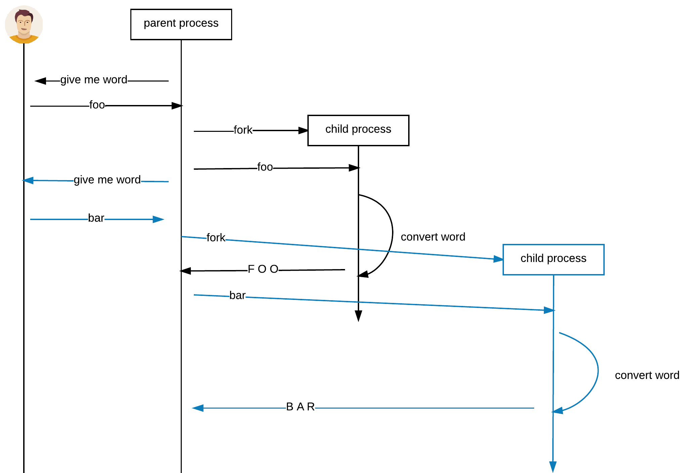
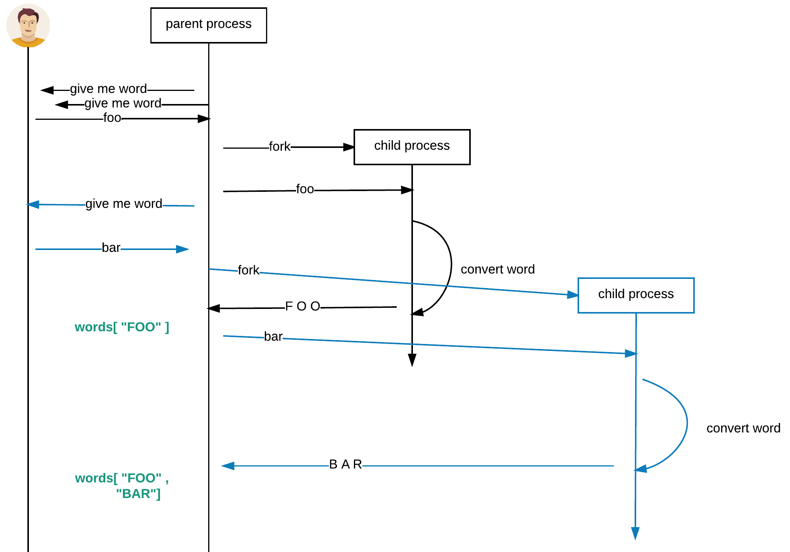



# Task B

You are asked to write a Ruby program that demonstrates the fact that a process can spawn other processes to 
run in parallel heavy tasks. Here are the details:

(1) There is a main process that asks the user for a word.
 
(2) The main process takes the word and forks a child process that processes that word.

(3) The child process, after having finished the processing, returns the result back to the parent process.

(4) However, the child process simulates a heavy task and we can imagine that each word might be processed for a long time.

(5) While the child process is busy processing the word given, we do not want to block the user from giving more words for processing. So,
while child process is busy, parent is still asking the user to give the second word. And, for the second word, the parent forks
another child to carry out the heavy processing.

(6) When a child process finishes, it passes the result back to the parent process and the parent process keeps those results into an array.

(7) This goes on until the user gives the word `exit`. In that case, the parent process does not fork any child process. But it waits
for any child process that is still running. When all child processes finish it just prints the result of processing.

Here is an example run of the program. You will see that while running the program, on another terminal, we can see the child processes running.
And the number of child processes created is equal to the number of words given by the user and are being processed in parallel.

  

This is how the program should behave. Let me give you some more information that might help you implement this:

1. You will have to work with sockets. In other words, the communication between the parent and the child process should
become via a socket pair. You should be using a brand new pair of sockets for every new child you create. In other words,
the socket pair is not shared between parent and many child processes. 
2. The fact that you have one dedicated socket pair per child process, but the parent talks to multiple child processes
might mean that you could use an array of socket pairs or a `Hash` of socket pairs. On the `Hash`, each socket pair
might be identified by the child process id. Hence, something like this: `sockets[child_process_id]` would return 
a two elements array, with the first element being the child end and the second element being the parent end of the socket
pair corresponding to the child with id `child_process_id`.
3. Since parent is free to accept input by the user, you may want to use a trap to handle the termination of the child
processes.
4. Note that child process does the work, replies back to parent and terminates. Does not stay running forever.
5. When the user types `exit` the parent should not finish before all its children are finished. You may want to consider
`sleep` (without arguments) which makes the process waiting forever. Since you have a trap code installed, the trap will
have to actually exit the program when no more child processes exist.

**Important** You will have to upload your code on Github. Your Mentor will review that online.

