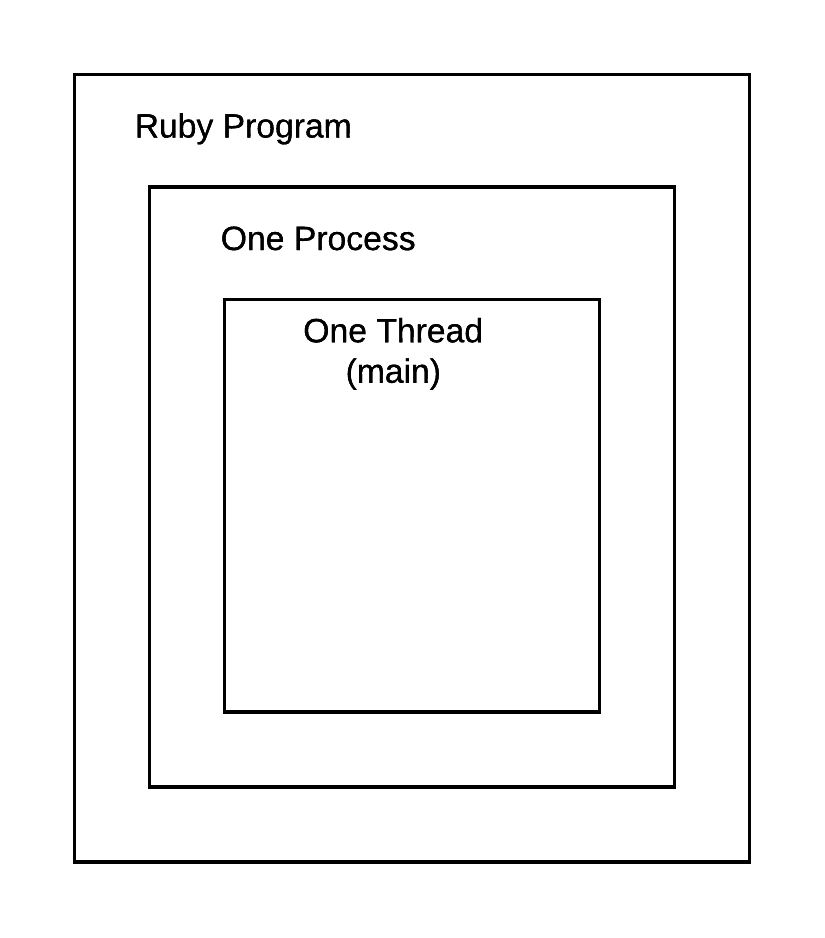
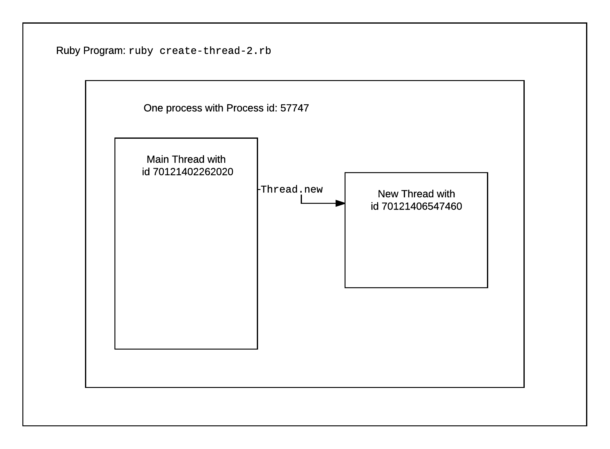
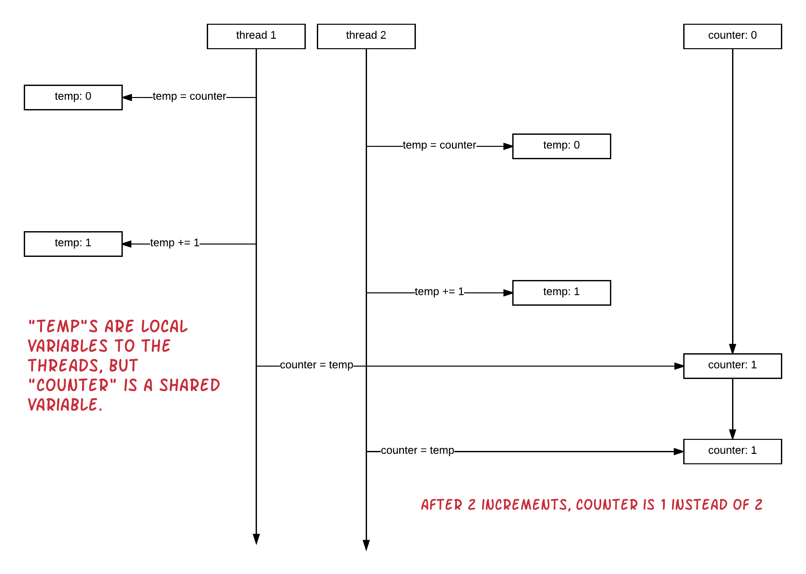
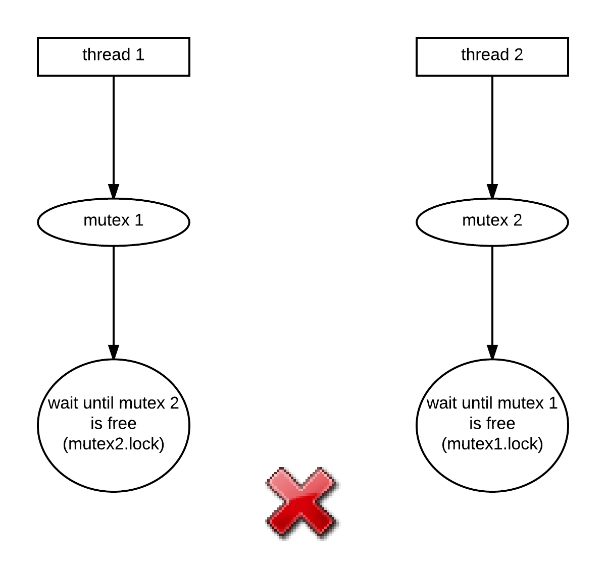
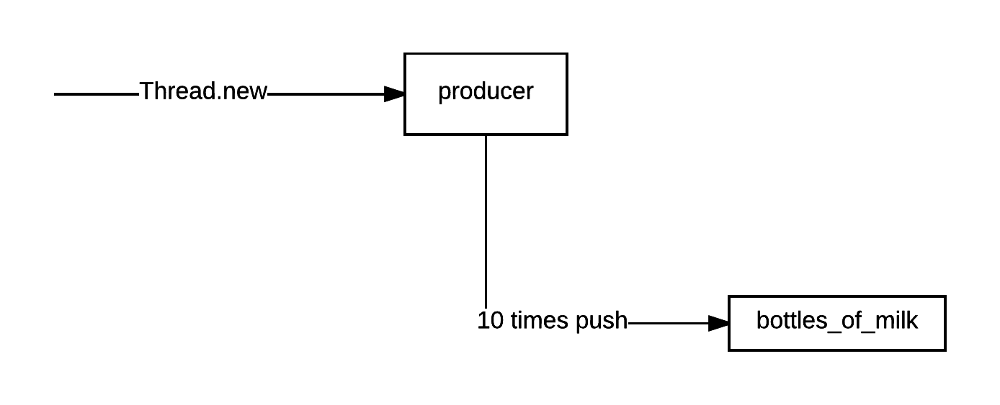
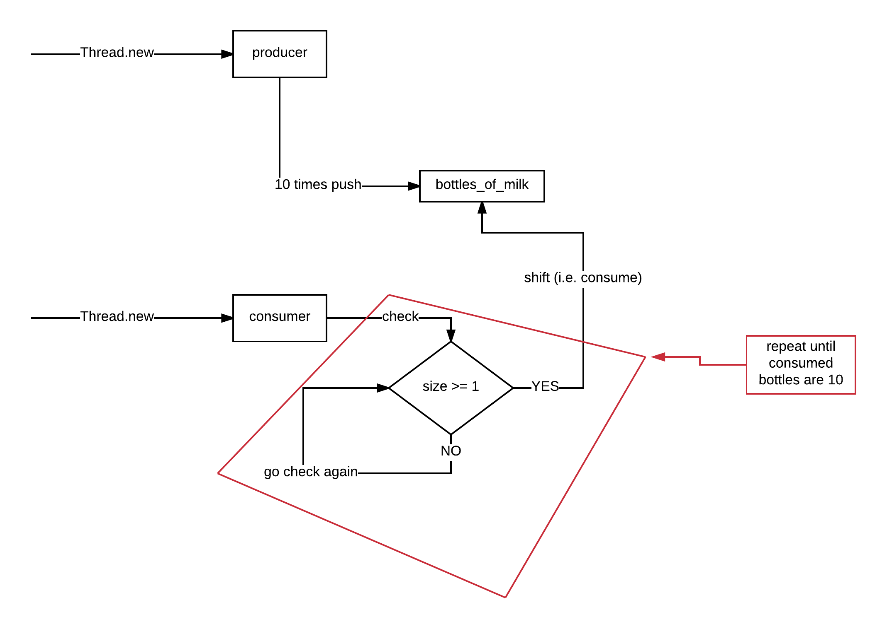
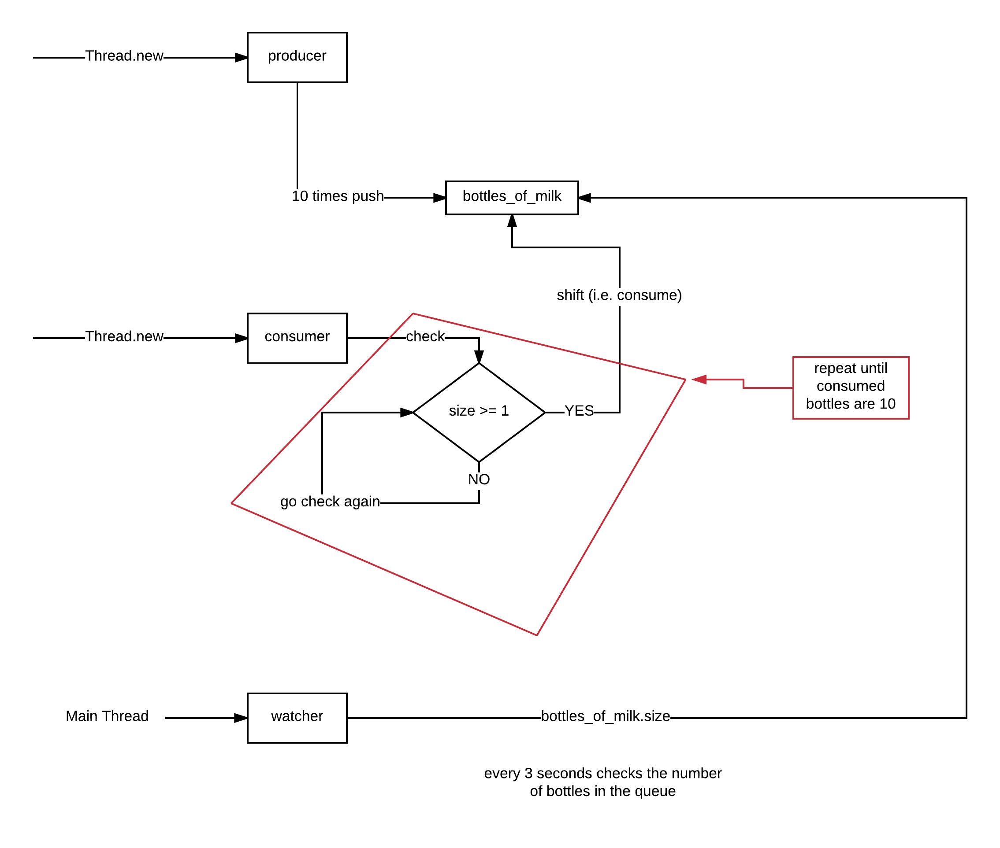

Threads is another tool at your tool set that could potentially help you write software that runs faster. This is because, when you break
your program into threads that run in parallel, then you take advantage of the multi-core systems of today and your big task can be executed
faster by a small number of threads each one dealing with parts of your big problem.

Multiple processes promise concurrency, but threads promise cheaper concurrency, in terms of performance and memory consumption cost. It is faster for the operating system
to spawn a new thread rather than a new process. Also, a new process occupies the same amount of memory like the process that spawned it, which is not the case with threads
that live inside the process that spawns them. Generally, what we say is that processes copy memory (from parent to child) whereas threads share the same memory.

Although threads might be lighter, they have a bigger programming cost. They are not easy to program. The main gotcha is that the memory is shared and your program
needs to control which thread has access to the memory resources at every one point in time. That's why we are saying that our code needs to be *thread safe*.

We will start learning about threads using a very primitive example:

## The ./images/./images/./images/Main Thread

Every Ruby program lives into at least 1 thread. I.e. every Ruby program is composed of at least 1 process that is composed of at least 1 thread.
So, even if you don't do anything to create any thread, the main thread exists by default and your code runs inside this single main thread.



Let's see this program, `main-thread-1.rb`:

``` ruby
1. # File: main-thread-1.rb
2. #
3. puts Thread.main
4. puts Thread.current == Thread.main
```

If you run this, you will get something like the following:

``` bash
$ ruby main-thread-1.rb
#<Thread:0x007fd7320a8410>
true
$
```

The `Thread.main` is a class method on the class `Thread` that returns a reference to the *main* thread of the program. The `Thread.current`, is the
class method that returns a reference to the current thread of the program execution. You can see that these two methods return a reference
to the same thread instance.

## Creating a Thread

Let's see the program `create-thread-1.rb`:

``` ruby
 1. # File: create-thread-1.rb
 2. #
 3. Thread.new do
 4.   puts "From within new thread, current thread is: #{Thread.current.object_id}"
 5.   puts "From within new thread, main thread is: #{Thread.main.object_id}"
 6. end
 7. 
 8. puts "From within main thread, current thread is: #{Thread.current.object_id}"
 9. puts "From within main thread, main thread is: #{Thread.main.object_id}"
10. 
11. sleep 10
```

The `Thread.new do ... end` Ruby statement asks Ruby to create another new thread of execution that will execute whatever is inside the
`do ... end` block.

If you run this program, you will see something like this:

``` bash
$ ruby create-thread-1.rb
From within new thread, current thread is: 70264348336640
From within new thread, main thread is: 70264348336640
From within main thread, current thread is: 70264360806420
From within main thread, main thread is: 70264348336640
$
```

You can see that the `Thread.current` when called from within a newly created thread, does not have the same value as the `Thread.main`.
On the other hand, the `Thread.main` always has the same value, no matter where we call it from. And again, `Thread.current` and `Thread.main`
have the same values if called from the main thread of execution.

## Starting With Arguments

There is another way you can start a thread. By calling `Thread.start(...arguments...)`. This is useful if you want to pass some arguments to the
thread block code. Let's see another example (`create-thread-2.rb`):

``` ruby
 1. # File: create-thread-2.rb
 2. #
 3. elements = ['a', 'b', 'c', 'd', 'e']
 4. 
 5. 5.times do
 6.   Thread.start(rand(elements.size)) do |element_index|
 7.     puts "element on index #{element_index}: #{elements[element_index]}"
 8.   end
 9. end
10. 
11. sleep 2
```
The program is very simple. It creates 5 threads. Each thread is started with the `Thread.start()` method, instead of the `Thread.new`.
The main thread that starts the threads gives an argument to `Thread.start()` which is a random number between `0` and `elements.size - 1`,
i.e. it is an integer index to the array `elements`. The index picked up randomly is given to the block at the block variable `element_index`,
and, hence, this index is available to the thread code. The thread can use it, which it does by reading the element and printing its value
with the `puts` command.

If you run this program, you will get something like this:

``` bash
$ ruby create-thread-2.rb
element on index 4: e
element on index 2: c
element on index 2: c
element on index 2: celement on index 0: a

$
```
The exact output is random, both because we are spawning threads and we do not know the exact order of each thread execution, and because the
element index selected for each thread is randomly picked up.

## Threads Live Inside Same Process

Maybe this was not clear to you yet, and that's why I would like to emphasize on that: Threads live inside the same process.
Let's see the following program `create-thread-3.rb`:

``` ruby
 1. # File: create-thread-3.rb
 2. #
 3. Thread.new do
 4.   puts "From within new thread, current thread is: #{Thread.current.object_id}"
 5.   puts "From within new thread, main thread is: #{Thread.main.object_id}"
 6.   puts "From within new thread, process id is: #{Process.pid}"
 7. end
 8. 
 9. puts "From within main thread, current thread is: #{Thread.current.object_id}"
10. puts "From within main thread, main thread is: #{Thread.main.object_id}"
11. puts "From within main thread, process id is: #{Process.pid}"
12. 
13. sleep 10
```

This program is the same as `create-thread-1.rb`, but it also prints the process id of the process the threads run into.

Let's execute this program. We will get something like this:

``` bash
$ ruby create-thread-3.rb
From within main thread, current thread is: 70121402262020
From within main thread, main thread is: 70121402262020
From within main thread, process id is: 57747
From within new thread, current thread is: 70121406547460
From within new thread, main thread is: 70121402262020
From within new thread, process id is: 57747
$
```

As you can see, the output proves that the new thread lives in the same process like the main thread of execution.



## Waiting for a Thread to Finish

The main thread may want to wait for the spawned thread to finish before finishing itself. This is done as follows (`wait-thread-1.rb`):

``` ruby
1. # File: wait-thread-1.rb
2. #
3. sleeping_thread = Thread.new { 10.times { print '.'; sleep 1} }
4. 
5. puts 'Main thread will now wait for sleeping thread to finish'
6. sleeping_thread.join
7. puts
8. puts 'Sleeping thread has finished, going to terminate now.'
```

If you run this program, you will see the message `Main thread will now wait for sleeping thread to finish` to be printed.
Then, every second a `.` to be printed. And finally the message `Sleeping thread has finished, going to terminate now.`.

Note how the `Thread.new` returns a handle to the new spawned thread, which is saved into the variable `sleeping_thread`
(line 3). This handle is then used to call `#join` that makes the main thread block to wait for the spawned thread to finish.

This is a video demonstrating the execution of this program:

<div id="media-container-video-Demo of a Zombie Process">
  <a href="https://player.vimeo.com/video/202538537"></a>
</div>

## Ruby Maps One Thread to a Native Thread

The code `Thread.new { ... }` creates a new thread of execution. This is actually mapped to what we call a *native* thread, i.e. an operating
system thread that is used to schedule the execution of a program onto a CPU core.

Let's confirm that. Write the following program `native-threads-1.rb`:

``` ruby
1. # File: native-threads-1.rb
2. #
3. Thread.new { sleep }
4. puts "Process.id: #{Process.pid}"
5. sleep
```

This program is very simple. Creates 1 thread that sleeps forever. And the main thread sleeps forever too. So, if you run that,
you will have a process (whose process id is printed out on the STDOUT) that will be composed of 2 threads and will be running forever.
That will give us enough time to inspect the process threads using the operating system command `top`.

Let's run the program and put it on the background, so that we have the control of the terminal input:

``` bash
$ ruby native-threads-1.rb &
Process.id: 57989
$
```

We now know the process id of the running process. Let's confirm that it is running (obviously, the process id on your end will be different):

``` bash
$ ps -l -p 57989
  UID   PID  PPID        F CPU PRI NI       SZ    RSS WCHAN     S             ADDR TTY           TIME CMD
  501 57989 47146     4046   0  31  0  2467300   7812 -      S                   0 ttys000    0:00.03 ruby native-threads-1.rb
$
```

And now, let's use the command `top` to ask for the number of native threads for that particular process running:

``` bash
$ top -l1 -pid 57989 -stats pid,th | tail -2
PID    #TH
57989  3
$
```

> *Information:* Use the `man top` command to read the manual for `top`. Basically, `top` displays information about the
resources consumed by the processes running on your system. This can be a long output and does not return. It runs forever
until you quit it. However with the option `-l1` we ask it to run only once and with option `-pid <process id>` we ask it
to collect information only for our process. The `-stats ...` option limits the columns displayed on the results to the
ones given (`pid` and `th`, i.e. process id and number of threads). We pipe that to `tail` command that picks up only the
last lines of the output, and in fact only the last `2`, since we call `tail -2`.

The `top` command reports that our program has 3 native threads. This is explained as follows:

1. Our program has the main thread
1. And the new thread that was created
1. Also, Ruby, has one internal thread for its own housekeeping

Fair enough.

> Terminate the process by using the `kill` command and then confirm that it is not running anymore
>
> ``` bash
> $ kill 57989
> [1]+  Terminated: 15          ruby native-threads-1.rb
> $ ps -l
>   UID   PID  PPID        F CPU PRI NI       SZ    RSS WCHAN     S             ADDR TTY           TIME CMD
> $
> ```
>

## Thread Scheduler

Since a process can create threads, many processes can create many threads. But the host machine has limited number
of CPU cores. Under these circumstances, the CPU is a shared resource and it is the responsibility of the operating
system to give enough CPU time to all the threads so that they can progress with the work they have to carry out.

The part of the operating system that does that is called thread scheduler. The switching of one CPU core from one thread to
another is called *context switching*. In other words, the thread scheduler chooses one thread and gives it some of the
CPU time, then pauses that thread and picks up another one and so on.

## Threads Share the Memory References

The main characteristic of the threads with regards to the Ruby program that creates them is that the threads of a process
share the same memory references. Let's see an example (`shared-memory-1.rb`):

``` ruby
 1. # File: shared-memory-1.rb
 2. #
 3. puts "Process starting: #{Process.pid}"
 4. counter = 0
 5. threads = []
 6. 10.times do |i|
 7.   threads << Thread.new do
 8.     5.times do
 9.       sleep (1..3).to_a.sample
10.       temp = counter
11. 
12.       sleep (1..3).to_a.sample
13.       temp += 1
14. 
15.       sleep (1..3).to_a.sample
16.       counter = temp
17.     end
18.   end
19. end
20. 
21. threads.each do |thread|
22.   thread.join
23. end
24. 
25. puts counter # expected to be 50 (10 threads X 5 increases each)
```

The above program has a `counter` which starts from the value `0`, on line 4. Then it spawns 10 threads. Each thread does an increment of the `counter` by
`1`. But it does it in three steps:

1. Saving the value to a temporary variable, `temp`,
1. Incrementing that variable by `1` and
1. Assigning that new value back to`counter`.

In between the above three steps, we have introduced some random sleep commands. So, each thread sleeps for a while (from 1 up to 3 seconds, randomly).
When a thread sleeps, then CPU is taken by another thread that does not sleep. Hence, having these sleeps, for this demo here, we increase the
chances the thread scheduler assigns CPU time to a thread in a more random manner.

Since we have 10 threads increasing the same counter 5 times by 1, then one would expect the final value of `counter` to actually be `50` at the end of
the program (printed by the last command `puts counter`). But if you run this program, you will see that things are much different.

This is a sample execution of this program:

``` bash
$ ruby shared-memory-1.rb
Process starting: 62674
7
$
```

The result was `7`, quite behind `50`.

And another run of the same program gave a different result:

``` bash
$ ruby shared-memory-1.rb
Process starting: 62684
8
$
```

So, not only the result is wrong, but it is not fixed too. Every time we run it, we get a different result.

Why is that? This is because all the 10 threads have access to the same memory variables. When 1 thread reads the content of a variable,
and before going to update it, another thread updates it first.

The following picture shows an instance of this *race condition* that makes things go wrong.



This example above, demonstrates the fact that every time you have two or more threads trying to modify the same thing (`counter` on our example) at the
same time, you need to be careful and write your code in a thread safe way. This will make sure that the race conditions do not cause you problems.

We will see later on, how we can avoid race conditions in multi-thread programming and what it would take to turn our code to be thread-safe.

## Exceptions in Threads

Usually a thread terminates its block execution and that is considered the happy path. But what happens if a thread raises an exception and it is
not handle by the code of the thread itself?

Let's see an example (`exception-in-thread-1.rb`):

``` ruby
1. # File: exception-in-thread-1.rb
2. #
3. Thread.new do
4.   raise 'Error inside the thread'
5. end
6. 
7. puts 'Main thread sleeping for 10 seconds.'
8. sleep 10
9. puts 'Main thread finished.'
```

The above program is very simple. It spawns a thread that raises an error. While doing that, the main thread just sleeps for 10 seconds and then terminates.
If you run this program, you will not see the exception being raised.

``` bash
$ ruby exception-in-thread-1.rb
Main thread sleeping for 10 seconds.
Main thread finished.
$
```

This proves that the exception raised inside a thread stays within the thread and does not affect other threads.

However, this is not totally true. The truth is that the exception will be finally raised when the thread that raised this exception is joined by another
thread. It will be raised by the joining thread.

Let's change the previous example a little bit (`exception-in-thread-2.rb`):

``` ruby
 1. # File: exception-in-thread-2.rb
 2. #
 3. thread = Thread.new do
 4.   raise 'Error inside the thread'
 5. end
 6. 
 7. puts 'Main thread sleeping for 3 seconds.'
 8. sleep 3
 9. puts 'Main thread slept for 3 seconds. Now going to join the thread...'
10. thread.join
```

This version of the program has a `thread.join` at the end. In other words, the main thread joins the thread that raised an exception.
In that case, the exception is raised by the main thread. Let's run it:

``` bash
$ ruby exception-in-thread-2.rb
Main thread sleeping for 3 seconds.
Main thread slept for 3 seconds. Now going to join the thread...
exception-in-thread-2.rb:4:in `block in <main>': Error inside the thread (RuntimeError)
$
```

Note, however, that even if the exception is raised by the main thread due to the `thread.join` statement, on line 10, the exception
error reports the actual root line of the exception, `exception-in-thread-2.rb:4...`, i.e. line 4.

## Return Value of a Thread

If the thread running does not raise an exception, then the main thread can get its *return value*, by calling the method `#value`.
The method `#value` calls `#join` internally, so it has the same semantics. Let's see an example:

``` ruby
 1. # File: value-1.rb
 2. #
 3. thread = Thread.new do
 4.   sleep 2
 5.   5
 6. end
 7. 
 8. puts 'Main thread waiting for the thread to finish and get its value...'
 9. thread_result = thread.value
10. puts "Main thread finished. Its value is: #{thread_result}"
```

If you run this program, you will get this:

``` bash
$ ruby value-1.rb
Main thread waiting for the thread to finish and get its value...
Main thread finished. Its value is: 5
$
```

Nice! This proves that the `#value` both blocks the main thread that calls it, like `#join` does, and it also
returns back the return value of the thread.

## Exiting A Thread

Note that calling `exit` (or its cousins) from a thread exits the whole process. Let's see the following example (`exit-1.rb`):

``` ruby 
1. # File: exit-1.rb
2. #
3. thread = Thread.new { exit }
4. thread.join
5. puts 'This line will never be printed'
```

This is a very simple program too. It spawns a thread the calls `exit`. Whereas the main thread waits for the thread to finish and then
print a line on the standard output.

If you run this program `ruby exit-1.rb` you will see that the line 5 (`puts 'This line ...'`) is never executed. This is because the
call of `exit`, even if it happens from within a thread, it terminates the whole process.

## Make it Thread Safe

The program `shared-memory-1.rb` was an example of a non-thread safe Ruby program. We wanted a counter to be incremented
by 10 threads concurrently, but we tried to do that using a shared memory reference, i.e. the `counter`. Can we rewrite this
program in order to be thread safe?

See the version `thread-safe-1.rb`:

``` ruby
 1. # File: thread-safe-1.rb
 2. #
 3. puts "Process starting: #{Process.pid}"
 4. counter = 0
 5. threads = []
 6. mutex = Mutex.new
 7. 
 8. 10.times do |i|
 9.   threads << Thread.new do
10.     5.times do
11.       mutex.lock
12.       print '.'
13.       sleep (1..3).to_a.sample
14.       temp = counter
15. 
16.       sleep (1..3).to_a.sample
17.       temp += 1
18. 
19.       sleep (1..3).to_a.sample
20.       counter = temp
21.       mutex.unlock
22.     end
23.   end
24. end
25. 
26. threads.each do |thread|
27.   thread.join
28. end
29. 
30. puts counter # expected to be 50 (10 threads X 5 increases each)
```

The above program introduces the concept of the *mutex* (Mutual Exclusion). The mutex in instantiated on line 6 (`mutex = Mutex.new`) and
then it is used to guard the piece of code that we want to make thread-safe. We mark the start of the code that needs to be thread-safe
using the `mutex.lock` and we mark the end of it using `mutex.unlock`. Having done that, we tell Ruby that this piece of code can be
executed only from a single-thread. The first thread that gets the mutex lock is the thread that will execute this piece of code. All the
other threads will have to wait until the mutex is unlocked. Hence, reading and updating the `counter` shared memory variable is done
in a *serialized* way. In other words, the concurrently running threads lose their *concurrency* and they become serialized.

> *Information:* Why would I want to have multiple threads running when they use mutexes and they are finally serialized? The previous
example was quite trivial. You may have multiple threads running concurrently and only parts of their code might have the need to
write onto a shared resource. In that case, only their small part of code would need to be guarded by a mutex.

If you run the above program, you will see this:

``` bash
$ ruby thread-safe-1.rb
Process starting: 66559
..................................................50
$
```
You will also encounter that it runs much slower and this is because the threads are now serialized.

## `Mutex#synchronize`

Using `Mutex#lock` and `Mutex#unlock` pair has a small drawback. If you forget to call the `Mutex#unlock` or if you
accidentally remove the unlocking line of code, then you might lock every other thread out indefinitely.

Having said that, you may want to use the `Mutex#synchronize` method instead.

Let's see a new version of the previous program that uses this technique (`thread-safe-2.rb`):

``` ruby
 1. # File: thread-safe-2.rb
 2. #
 3. puts "Process starting: #{Process.pid}"
 4. counter = 0
 5. threads = []
 6. mutex = Mutex.new
 7. 
 8. 10.times do |i|
 9.   threads << Thread.new do
10.     5.times do
11.       mutex.synchronize do
12.         print '.'
13.         sleep (1..3).to_a.sample
14.         temp = counter
15. 
16.         sleep (1..3).to_a.sample
17.         temp += 1
18. 
19.         sleep (1..3).to_a.sample
20.         counter = temp
21.       end
22.     end
23.   end
24. end
25. 
26. threads.each do |thread|
27.   thread.join
28. end
29. 
30. puts counter # expected to be 50 (10 threads X 5 increases each)
```

The above version does not use `Mutex#lock` and `Mutex#unlock`. It just uses the `Mutex#synchronize do ... end` technique
that has the mutex guarded piece of code given inside the block.

> *Information:* The block of code that is mutex protected from concurrent thread execution is often called *critical section*.

> *Important:* Different parts of the code that need to be protected, i.e. different critical sections, need to be protected by different mutexes. You cannot have one mutex
to guard more than one critical sections (unless you know what you are doing).

## Deadlock

Mutexes are good because they allow synchronized access to critical sections of the code. But if you are not careful, you may end up
creating threads that cannot continue. For example, when one thread waits for a mutex that is already hold by a second thread, and that
second thread is waiting for a mutex that is hold by first thread. This case is called a deadlock and when Ruby encounters such conditions
it terminates the program with a fatal error.

Let's see the following example `deadlock-1.rb`:

``` ruby
 1. # File: deadlock-1.rb
 2. #
 3. mutex1 = Mutex.new
 4. mutex2 = Mutex.new
 5. 
 6. thread1 = Thread.new do
 7.   puts 'Thread 1 waiting for mutex1 lock ...'
 8.   mutex1.lock
 9.   puts 'Thread 1 acquired mutex1 lock...'
10.   sleep 1
11.   puts 'Thread 1 waiting for mutex2 lock ...'
12.   mutex2.lock
13.   puts 'Thread 1 acquired mutex2 lock...'
14.   sleep 1
15.   mutex2.unlock
16.   sleep 1
17.   mutex1.unlock
18. end
19. 
20. thread2 = Thread.new do
21.   puts 'Thread 2 waiting for mutex2 lock ...'
22.   mutex2.lock
23.   puts 'Thread 2 acquired mutex2 lock...'
24.   sleep 1
25.   puts "Thread 2 waiting for mutex1 lock ..."
26.   mutex1.lock
27.   puts 'Thread 2 acquired mutex1 lock...'
28.   sleep 1
29.   mutex1.unlock
30.   sleep 1
31.   mutex2.unlock
32. end
33. 
34. puts 'Main thread to wait for threads to finish!'
35. [thread1, thread2].each(&:join)
```

This program does exactly that: Two threads one waiting for the other to unlock a mutex.

If you run this program, you will get this:

``` bash
$ ruby deadlock-1.rb
Main thread to wait for threads to finish!
Thread 1 waiting for mutex1 lock ...
Thread 1 acquired mutex1 lock...
Thread 2 waiting for mutex2 lock ...
Thread 2 acquired mutex2 lock...
Thread 1 waiting for mutex2 lock ...
Thread 2 waiting for mutex1 lock ...
deadlock-1.rb:35:in `join': No live threads left. Deadlock? (fatal)
        from deadlock-1.rb:35:in `each'
        from deadlock-1.rb:35:in `<main>'
$
```
As you can read from the output lines above, thread 1 is waiting for `mutex2` to be unlocked and thread 2 is waiting for `mutex1` to
be unlocked. But `mutex2` is already locked by thread 2 and it will not be unlocked, unless thread 2 gets the `mutex1`. Also,
`mutex1` is already locked by thread 1 and will not be unlocked unless thread 1 gets the `mutex2`.

This is a condition that is identified by the Ruby interpreter and it decides to raise a fatal error and terminate the whole program.



> *Side Note:*
>
> `[thread1, thread2].each(&:join)` is equivalent to:
>
> ``` ruby
> [thread1, thread2].each do |thread|
>   thread.join
> end
> ```
>
> Generally, when the block of code called on all the items of an array is just a call on a method, you can use this kind of
> shortcut. For example, the following code, that calls `String#reverse!` on all of the string elements of the array...
> ``` ruby
> ['foo', 'bar'].each do |string|
>   string.reverse!
> end
> ```
> can be written as:
> ``` ruby
> ['foo', 'bar'].each(&:reverse!)
> ```
>

## Producer Consumer Examples

Now that we know how to synchronize the access to a shared memory resource, let's implement a producer-consumer example program (`producer-consumer-1.rb`):

``` ruby
 1. # File: producer-consumer-1.rb
 2. #
 3. bottles_of_milk = []
 4. NUMBER_OF_BOTTLES_TO_PRODUCE = 10
 5. access_to_bottles = Mutex.new
 6. 
 7. producer = Thread.new do
 8.   NUMBER_OF_BOTTLES_TO_PRODUCE.times do
 9.     puts "Producer: about to produce some milk..."
10. 
11.     sleep (1..5).to_a.sample # simulate production of milk
12. 
13.     access_to_bottles.synchronize do
14.       bottles_of_milk.push(1) # put milk into the consumption queue
15.     end
16. 
17.     puts "Producer: milk produced."
18.   end
19. end
20. 
21. consumer = Thread.new do
22.   number_of_bottles_consumed = 0
23.   while number_of_bottles_consumed < NUMBER_OF_BOTTLES_TO_PRODUCE
24.     puts "Consumer: number of bottles consumed so far: #{number_of_bottles_consumed}"
25. 
26.     access_to_bottles.synchronize do
27.       if bottles_of_milk.size >= 1
28.         puts "Consumer: there is one more milk to consume..."
29. 
30.         sleep (1..3).to_a.sample # simulate consumption of milk
31. 
32.         bottles_of_milk.shift # get milk out of the queue
33. 
34.         puts "Consumer: milk consumed."
35.         number_of_bottles_consumed += 1
36.       end
37.     end
38.   end
39. end
40. 
41. loop do
42.   puts "Watcher: ... let's see current number of bottles ..."
43.   puts "Number of bottles: #{access_to_bottles.synchronize { bottles_of_milk.size }}"
44.   sleep 3
45. end
```

On the above program, we have a producer thread that produces `NUMBER_OF_BOTTLES_TO_PRODUCE` bottles of milk and puts them inside the
queue of consumption. The queue of consumption is represented by the array `bottles_of_milk`. The `NUMBER_OF_BOTTLES_TO_PRODUCE` has the
value `10`, which means that the producer knows that it has to produce `10` bottles of milk and put inside the `bottles_of_milk` queue.



Concurrently, there is a consumer thread that knows how many bottles of milk are expected to be consumed and consumes each that is coming in.
Note that, the consumer thread has to, first, check whether there is any bottle waiting to be consumed before actually picking up a bottle from the
queue. As you can see, on line 27, it does a check (`if bottles_of_milk.size >= 1`). If there is nothing to be consumed, it goes back at the
beginning of its loop and then checks again. Note also that the loop is repeated until all the bottles expected have been consumed.



Also, there is the main thread, that runs forever and every 3 seconds checks the number of bottles in the queue.



You can see that every access to the shared resource, i.e. to the `bottles_of_milk` is done using a shared mutex, the `access_to_bottles` mutex.

1. The producer synchronizes using the mutex when adding bottles of milk to the array (lines 13 - 15)
2. The consumer synchronizes using the mutex when checking the bottles in the array and possibly getting any out of it (lines 26 - 37)
3. The watcher synchronizes using the same mutex when checking the number of bottles in the array. (line 43)

If you run this program, you will get something like what we see on the following video:

<div id="media-container-video-Producer And Consumer - First Version Demo">
  <a href="https://player.vimeo.com/video/202710215"></a>
</div>

You can see how the main thread is the only thread running after all bottles have been produced and consumed.

However, there are some things that we could improve on this implementation. For example, when the consumer gets the mutex
to check for any bottle, the producer cannot produce bottles. Even if the bottles array is empty, consumer and watcher block the
producer just to check whether there is any bottle in the queue. It would have been better if there was a way for the producer
to tell those two other threads when producer puts something in the queue. Also, when the consumer finds that the queue is not empty
and there is at least 1 bottle inside, it consumes only 1 of the bottles, even if the queue might have more. This might not be good
under all circumstances.

## Signaling Consumer

Let's see how we can have the consumer be notified for a new bottle in the queue, rather than polling the queue for
the existence of bottles. Read the program `producer-consumer-2.rb` that is very little different to the first version:

``` ruby
 1. # File: producer-consumer-2.rb
 2. #
 3. bottles_of_milk = []
 4. NUMBER_OF_BOTTLES_TO_PRODUCE = 10
 5. access_to_bottles = Mutex.new
 6. bottles_in_the_queue = ConditionVariable.new
 7. 
 8. producer = Thread.new do
 9.   NUMBER_OF_BOTTLES_TO_PRODUCE.times do
10.     puts 'Producer: about to produce some milk...'
11. 
12.     sleep (1..5).to_a.sample # simulate production of milk
13. 
14.     access_to_bottles.synchronize do
15.       bottles_of_milk.push(1) # put milk into the consumption queue
16.       puts 'Producer: Tell consumer that a bottle has become available'
17.       bottles_in_the_queue.signal
18.     end
19. 
20.     puts 'Producer: milk produced.'
21.   end
22. end
23. 
24. consumer = Thread.new do
25.   number_of_bottles_consumed = 0
26.   while number_of_bottles_consumed < NUMBER_OF_BOTTLES_TO_PRODUCE
27.     puts "Consumer: number of bottles consumed so far: #{number_of_bottles_consumed}"
28. 
29.     access_to_bottles.synchronize do
30.       if bottles_of_milk.size >= 1
31.         puts 'Consumer: there is one more milk to consume...'
32. 
33.         sleep (1..3).to_a.sample # simulate consumption of milk
34. 
35.         bottles_of_milk.shift # get milk out of the queue
36. 
37.         puts 'Consumer: milk consumed.'
38.         number_of_bottles_consumed += 1
39.       else
40.         puts "Consumer: let's wait for some bottles to become available..."
41.         bottles_in_the_queue.wait(access_to_bottles) # let's wait for some bottles to become available
42.         puts 'Consumer: I have been told that some bottles have become available...'
43.       end
44.     end
45.   end
46. end
47. 
48. loop do
49.   puts "Watcher: ... let's see current number of bottles ..."
50.   puts "Watcher: Number of bottles: #{access_to_bottles.synchronize { bottles_of_milk.size }}"
51.   sleep 3
52. end
```

The differences to the previous version are:

1. Initially, we declared a `ConditionVariable`, line 6, with name `bottles_in_the_queue`.
2. Then on lines 16 and 17 we have enhanced the producer to tell the consumer that a new bottle has been added to the queue with the
   help of this `ConditionVariable`. The statement `bottles_in_the_queue.signal` notifies a thread that waits a signal on this condition
   variable.
3. On line 41, the consumer waits for a signal on the condition variable `bottles_in_the_queue`. The lines 40 - 42 are executed when
   the consumer does not find any bottle in the queue. Instead of repeatedly checking for the size of the queue for any change (like the
   first version of the program did), it calls `bottles_in_the_queue.wait(access_to_bottles)` and blocks there until it is notified by
   the producer (call `bottles_in_the_queue.signal`). When it is notified, it goes back at the beginning and gets the bottle from the
   queue. Note that the call `bottles_in_the_queue.wait(...)` takes as argument the locked mutex instance. Internally, it unlocks it
   and puts the thread into a waiting queue to get signal on this condition variable. When the signal comes in, the thread locks back
   the mutex again and thread can continue.

Let's run this version of the program. If you do that, you will see something like the following:

<div id="media-container-video-Demo of a Zombie Process">
  <a href="https://player.vimeo.com/video/202887564"></a>
</div>

As you can see when you run this second version of the program, the consumer does not continually poll the array to check whether there
are new bottles in. Consumer blocks until it gets a signal from the producer.

> *Information:* Besides the `ConditionVariable#signal` method, a thread can use `ConditionVariable#broadcast` method to send the signal
to all threads waiting on this condition variable.

## General Concepts about Threads

We have seen some examples of thread programming. Threads and mutexes, although they are very powerful, they can quickly turn into a nightmare if you do not follow some
best practices.

Let's see some of the things that you need to be aware of while doing threads programming.

1. Threads share the same memory space. So, you need to be careful when two or more threads are accessing the shared memory references.
   This is not true for the thread local variables, of course. Thread local variables are only accessed by the current thread.
1. Even the AST (Abstract Syntax Tree). i.e. the compiled source code, is a shared resource. So, if one thread is defining a new method
   dynamically and another thread is destroying this definition, that would be a problem if you don't really protect these actions
   with the correct mutexes.
1. Note that class-level variables are shared between object instances. So, if you access those via different object instances via different threads,
   you end up in a race condition and you might need to introduce a mutex for synchronized access.
1. Threads will be running concurrently and it will be more difficult for you to debug your application. Thread scheduler switches from
   one thread to the other in a way that you cannot predict. Attaching to a thread of execution for debugging purposes might be conflicting with the
   execution of another thread running at the same time.

## Different Ruby Implementations

Before we close this first encounter with the threads, I would like to raise your awareness that threads are being treated differently
by different Ruby implementations. The Ruby implementation that we work with in this course is the [MRI implementation](https://www.ruby-lang.org/en/).
Other popular implementations are [jRuby](http://jruby.org/) and [Rubinius](https://rubinius.com/).

What you need to understand today is the major difference between MRI and the other implementations. This is the GIL that MRI has as a core
implementation characteristic. [GIL is the Global Interpreter Lock](https://medium.com/@franzejr/ruby-3-mri-and-gil-a302577c6634#.gfxvfjbnc) GIL
does not allow two or more threads of the same process to run in parallel, i.e. to occupy different cores and execute instructions at the same time.
On the other hand, jRuby and Rubinius (and some other Ruby implementations) allow this.

This means that, MRI is not thread-friendly. Even if your host has many cores, scaling your application using threads will not actually scale it.
You will not see any performance improvement. MRI is process-friendly. MRI applications favour the scaling using multiple processes. If you really want
to scale your application using threads, you might want to consider using another Ruby implementation, like jRuby.

## Closing Note

Thread programming is a very big area in software engineering. This chapter tried to give you the first picture of it. It is not meant to be, by any means,
exhaustive about the subject matter. If you want to expand more on thread programming, especially with Ruby, you might want to read a book on this subject
or study corresponding articles freely available online.
