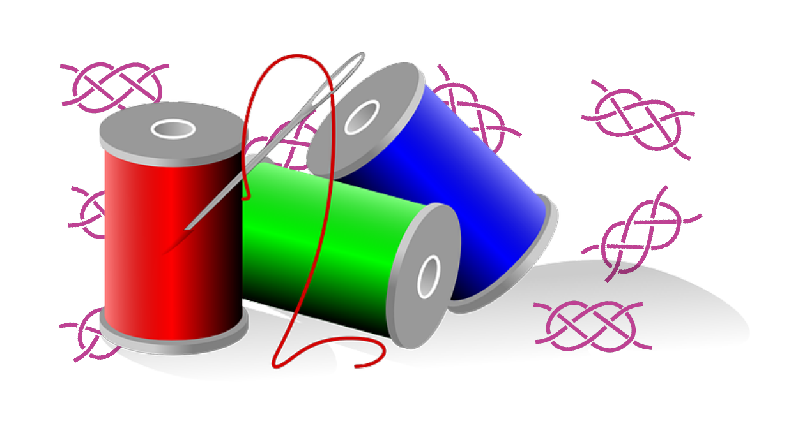

This chapter introduces you to threads programming. ./images/Threads can be a nightmare if you don't apply the technique using best practices
and if you don't understand the basic concepts. After this chapter you will be able to grasp the ideas behind threads and programming
with threads for any programming language.
