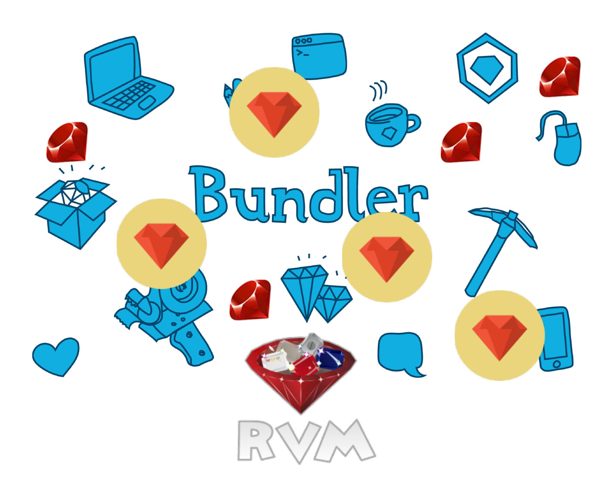

This chapters introduces you to the open source world, and in particular on how you can package your Ruby code and share it
with the Ruby world community. This is one of the more exciting characteristic of working in the Ruby eco system. The fact
that you can package your code and make it useful to other developers in the world. You will learn about RubyGems, Bundler
and Ruby Version Manager. You will also learn to develop your own gems and to publish them to RubyGems.
