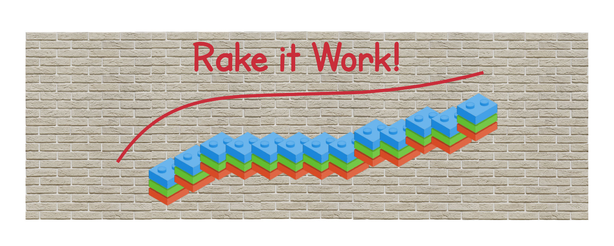

`rake` is a `make`-like utility that allows you to define tasks that have be executed either in sequence or in parallel, with
possible dependencies one to the other. It is very commonly used in the Ruby eco system and you can tell that from the number
of downloads that it has when you look at its page on RubyGems. Definitely a skill that will be required in the next sections.
