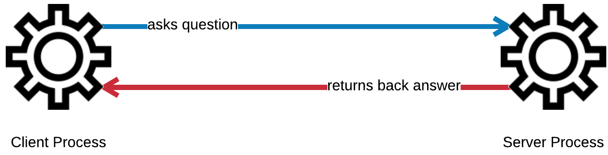
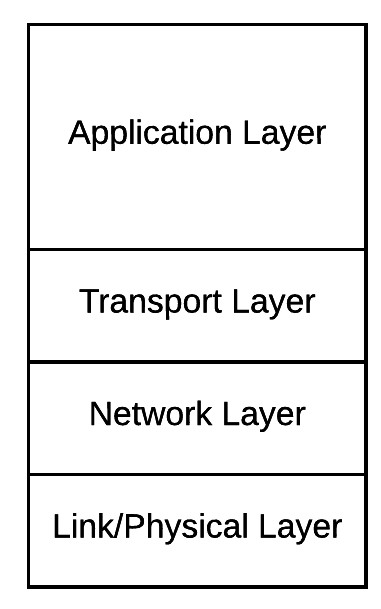
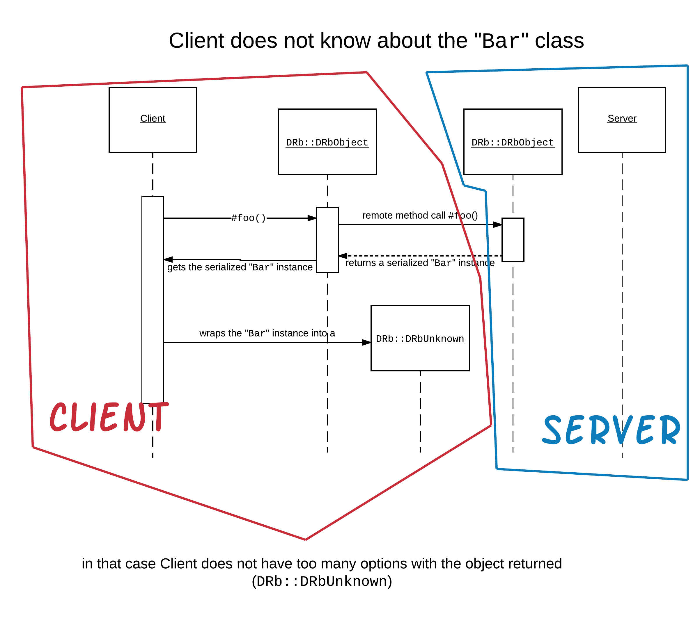
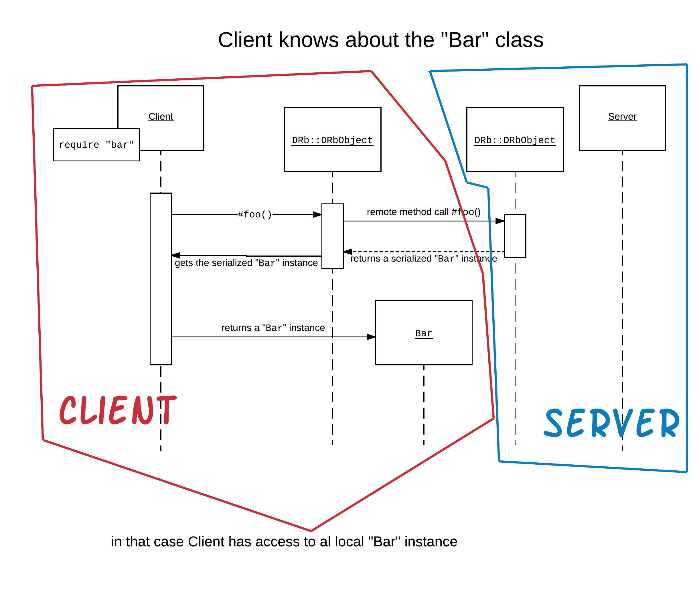
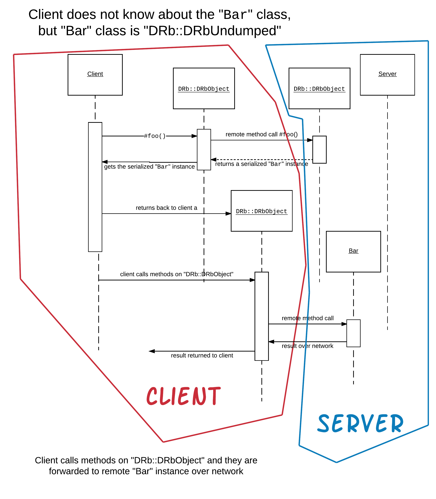

We have done lots of Ruby programming in the previous chapters but we didn't exploit the power of the network. We stayed
within the confines of a single Ruby process, although we have talked about multi-process programming. However, there
is another architecture paradigm in software engineering which is called *client-server* architecture. In this paradigm,
a process plays the role of the *client* asking questions and another one plays the role of the *server* returning back
the answers.



Although you have not programmed such an application, that is split in many processes, clients and servers, you have definitely
used applications that rely on this model. For example, the browser works like that. It is the client side of the communication.
It sends requests to the Web server, which is the *server* side of this architecture. Web server returns back the response
and the browser is responsible to render it so that the user can see.

Another example is `mysql` command line application that communicates with MySql server. 

## About Protocols

In the software engineering world, we have had various development around this area. Different technologies have been invented to allow a process,
possibly written in a programming language X, communicate with another process, possibly written in a different programming language Y
and living/running in another computer.

* [RPC (Remote Procedure Calls)](https://technet.microsoft.com/en-us/library/cc787851(v=ws.10).aspx)
* [CORBA](https://en.wikipedia.org/wiki/Common_Object_Request_Broker_Architecture)
* [DCOM](https://en.wikipedia.org/wiki/Distributed_Component_Object_Model)
* [RMI](https://www.javatpoint.com/RMI)

and many more.

In this course we will focus on the technologies around the family of TCP/IP protocols. TCP/IP (Transmission Control Protocol/Internet Protocol)
is the set of rules and protocols that allows two distributed processes to communicate using *Internet*.

TCP/IP family of protocols has been divided into four layers. Special technical groups have specified the rules and details of all these four layers:



The two most important layers for us, on our way to become Junior Web Developers, are the first two. The Application and the Transport layer.

In the Application Layer one can find popular protocols such as:

1. HTTP/S, which is the protocol that browsers use to exchange messages with the Web servers.
2. SMTP, which is the protocol that email uses.
3. S/FTP, which is a File Transfer Protocol
4. POP3 and IMAP are other email related protocols.

We will focus on the HTTP/S protocol of course. Reference to some other protocols will be done too.

Below the Application layer protocols, TCP (Transmission Control Protocol) is the most important for us now. It is the protocol that
allows an application (such as HTTP) to exchange reliable messages with another process over Internet. Another common protocol of this
layer is UDP (User Datagram Protocol). UDP is unreliable connectionless protocol, but it is also very efficient in terms of performance.

Before we start doing some work with TCP/IP protocols, we will introduce you to a tool called DRb (Distributed Ruby) which comes in the
Ruby Standard Library. 

## Distributed Ruby - DRb - dRuby

dRuby is a distributed object system for Ruby. This basically means that a process X can call a method on a remote object that lives in 
another process Y, even if that process Y is on another machine. The process X is the client and the process Y is the server in this
client-server model.

Let's start with an example. Create the RubyMine Ruby project `drb-example1`. 

### Server Code

We will first create the server process code. Create the file `server.rb` inside the root folder of your project:

``` ruby
 1. # File: drb-example1/server.rb
 2. #
 3. require 'drb/drb'
 4. 
 5. URI = "druby://localhost:8787"
 6. 
 7. class TimeServer
 8.   def get_current_time
 9.     Time.now
10.   end
11. end
12. 
13. SERVER_OBJECT = TimeServer.new
14. 
15. puts 'Starting server ....that can tell the time...(Hit Ctrl+C to terminate me)'
16. puts "(I am here: #{URI})..."
17. 
18. DRb.start_service(URI, SERVER_OBJECT)
19. 
20. # Wait for the drb server thread to finish before exiting.
21. DRb.thread.join
```

The things that you need to be aware of are:

1. We need to require `drb/drb` (line 3) because this is part of the Ruby standard library (and not the core library)
2. Each server needs to listen on particular host and port. On our example, we declare this to be the `localhost` host,
which refers to the local machine the server is started on, and the port being number `8787`. It could have been any
available port in the system we spawn our server on. (See the note about ports later on.)
3. We said that dRuby is a distributed object system. That's why we declare a class and we create an instance of the
object that will play the role of the server. This happens in lines 5 up to 13.
4. Then on line 18, we start the `DRb` server, i.e. we tell `DRb` which object is going to serve requests and behind
which `URI`, i.e. behind which host and port. This happens on line 18.
5. The server serving requests will be done, internally, by another thread. The parent thread, needs to join that thread
before exiting. This is the line 21.

Before we talk about the client code that will call the services of this object, let's try to run the server.

``` bash
drb-example1 > $ ruby server.rb
Starting server ....that can tell the time...(Hit Ctrl+C to terminate me)
(I am here: druby://localhost:8787)...

```

As you can see the process starts and stays alive. If you want to terminate it, you will need to hit the key combination
<kbd>Ctrl + C</kbd>.

### Client Code

Let's now write the client code. This is what you have to create:

``` ruby
 1. # File: drb-example1/client.rb
 2. #
 3. require 'drb/drb'
 4. 
 5. SERVER_URI = "druby://localhost:8787"
 6. 
 7. puts 'I am a client and I want to know the current time...'
 8. puts "...I am going to ask #{SERVER_URI}"
 9. 
10. timeserver = DRbObject.new_with_uri(SERVER_URI)
11. 
12. puts "...got back this: #{timeserver.get_current_time}"
```

1. First we require `drb/drb`, like we did for the server code. (line 3)
1. We declare the endpoint of the server. Otherwise, we will not be able to connect to that server. (line 5)
1. Then, on line 10, we instantiate a local representation of the remote object using the initializer `DRbObject.new_with_uri(...)`.
The `timeserver` local variable now has everything we need to call methods on the remote object.
1. This is what we do on line 12. We call the method `#get_current_time` which is not implemented in the client code 
of course. It is implemented in the remote server code.

All the technical details to transfer the request from the client process to the server process and get back the result
is being handled magically by `drb`. 

Let's run the client code to see it in action. Open another terminal, while on the original terminal you have the server code still running.
Execute the command that is given below:

``` bash
drb-example1 > $ ruby client.rb
I am a client and I want to know the current time...
...I am going to ask druby://localhost:8787
...got back this: 2017-04-21 13:54:39 +0300
drb-example1 > $
```

You can see how the current date and time are being printed. This is the response as was returned by the server code.

Pretty cool! Isn't it?

> * IPs: IP addresses uniquely identify a machine connected to the Internet. This is an example of an IP address: `23.23.128.123`
> * DNS: Domain Name Service translates names to IP addresses. Hence, we don't have to remember the IP address of a host machine.
> We can always remember its name. The translation from name to IP will be done automatically by underlying protocols and via the
> DNS servers. Try, for example, the command `host www.techcareerbooster.com`. You will get the IP address of this name. Or you
> can try visiting [What is my ip](https://www.whatismyip.com/) Web site, which will print your IP address.
> * Ports: Since we may have, and we do want to have, many different servers running on the same machine, we are using *ports* to
> allow for multiple servers to be able to listen for multiple clients at the same time. Hence when a server is spawned inside
> a host machine, it needs to declare which port to occupy. The system will allocate the requested port to this server, until the
> server program terminates. If the port is not available when server requests for it, system will raise an error and server will
> not be installed. Note that there are some well-known ports that are used by well-known servers. For example:
>   * Port 80: It is used for HTTP traffic. In fact it is the default port Web browsers use when we ask of an address.
>   * Port 443: It is used for HTTPS traffic. The Secure, encrypted version of HTTP. It is the default port when we ask our browser
> to bring a page using `https://` instead of `http://`. 
>   * Port 7: It is the ECHO server, which returns back whatever client sends to it.
>   * Port 21: FTP, File Transfer Protocol
>   * Port 22: SSH, Secure Shell protocol
>   * Port 23: Telnet protocol
>   * Port 25: Simple Mail Transfer Protocol (SMTP)
>   * Port 110: POP3 protocol, which is used to retrieve email from email boxes.
>   * Port 143: IMAP protocol, which is another protocol to manage email boxes on an email server.

## Remote Objects As Method Results

Calling a method on a remote object that we have constructed using `DRbObject.new_with_uri` was quite easy. The local object
representation is done using an instance of the class `DRbObject`.

You can confirm that with the following `drb-example1/client.rb` code:

``` ruby
 1. # File: drb-example1/client.rb
 2. #
 3. require 'drb/drb'
 4. 
 5. SERVER_URI = "druby://localhost:8787"
 6. 
 7. puts 'I am a client and I want to know the current time...'
 8. puts "...I am going to ask #{SERVER_URI}"
 9. 
10. timeserver = DRbObject.new_with_uri(SERVER_URI)
11. 
12. puts "...got back this: #{timeserver.get_current_time}"
13. 
14. puts "...timeserver is #{timeserver.inspect}"
```

This is exactly like the first version, but we have added the line 14 to print the inspection details of the `timeserver` variable.

Here is what we see when we run this version of the client code (make sure that `drb-example1/server.rb` is running on another terminal):

``` bash
drb-example1 > $ ruby client.rb
I am a client and I want to know the current time...
...I am going to ask druby://localhost:8787
...got back this: 2017-04-24 21:19:36 +0300
...timeserver is #<DRb::DRbObject:0x007ffbdb10b420 @uri="druby://localhost:8787", @ref=nil>
drb-example1 > $
```

You can tell from the last line of the output, that the object returned from `DRbObject.new_with_uri` is a `DRb::DRbObject` instance.

This class allows the client code to call methods on the remote object.

### Local Representation of Remote Object

Let's enhance the `drb-example1/client.rb` program to print the class of the result of the method call `timeserver.get_current_time` that
takes place on line 12.

Here is the new version:

``` ruby
 1. # File: drb-example1/client.rb
 2. #
 3. require 'drb/drb'
 4. 
 5. SERVER_URI = "druby://localhost:8787"
 6. 
 7. puts 'I am a client and I want to know the current time...'
 8. puts "...I am going to ask #{SERVER_URI}"
 9. 
10. timeserver = DRbObject.new_with_uri(SERVER_URI)
11. 
12. timeserver_result = timeserver.get_current_time
13. 
14. puts "...got back this: #{timeserver_result}"
15. 
16. puts "...timeserver is #{timeserver.inspect}"
17. puts "...timeserver_result class is #{timeserver_result.class}"
```

On line 12, we save the remote method call result into its own variable. Then, on line 17, we print the class of this variable. Here is what we
get if we run `drb-example1/client.rb` again:

``` bash
drb-example1 > $ ruby client.rb
I am a client and I want to know the current time...
...I am going to ask druby://localhost:8787
...got back this: 2017-04-24 21:23:56 +0300
...timeserver is #<DRb::DRbObject:0x007faffb837518 @uri="druby://localhost:8787", @ref=nil>
...timeserver_result class is Time
drb-example1 > $
```

Do you see that the class returned is `Time`? Matches the class of the result returned by the `TimeServer#get_current_time` (see `server.rb:9`).

Keep this at the back of your head: Server builds and returns a `Time` instance, and client code has this instance locally as a `Time` instance too.

### Class Returned Is not Known to Client Namespace

What will happen if server didn't actually return back an instance of a class that is known to the client namespace? Let's change the server code
as follows:

``` ruby
 1. # File: drb-example1/server.rb
 2. #
 3. require 'drb/drb'
 4. 
 5. URI = "druby://localhost:8787"
 6. 
 7. class MyTime
 8.   def initialize(a_time_instance)
 9.     @a_time_instance = a_time_instance
10.   end
11. 
12.   def to_s
13.     @a_time_instance.strftime("%Y%m%d%H%M%S")
14.   end
15. end
16. 
17. class TimeServer
18.   def get_current_time
19.     MyTime.new(Time.now)
20.   end
21. end
22. 
23. SERVER_OBJECT = TimeServer.new
24. 
25. puts 'Starting server ....that can tell the time...(Hit Ctrl+C to terminate me)'
26. puts "(I am here: #{URI})..."
27. 
28. DRb.start_service(URI, SERVER_OBJECT)
29. 
30. # Wait for the drb server thread to finish before exiting.
31. DRb.thread.join
```

Here is the difference to the previous program. The `TimeServer#get_current_time` now builds an instance of the class `MyTime`. And this is
what is returned back to the client. 

However, the client code does not know about this class (whereas the client code knew about the `Time` class as it is part of core Ruby).
What will the client print if we now run the program? (make sure you restart your server so that it takes the new code into account).

``` bash
drb-example1 > $ ruby client.rb
I am a client and I want to know the current time...
...I am going to ask druby://localhost:8787
...got back this: #<DRb::DRbUnknown:0x007f96229b6670>
...timeserver is #<DRb::DRbObject:0x007f96229b7480 @uri="druby://localhost:8787", @ref=nil>
...timeserver_result class is DRb::DRbUnknown
drb-example1 > $
```

The result returned back from `#get_current_time` is wrapped into an instance of an object of class `DRb::DRbUnknown`. This wrapping
is done automatically by DRb when the class is not known to the client namespace. 



Let's print a more informative message about
the instance that we have at our hands. Here is the new version of the client code:

``` ruby
 1. # File: drb-example1/client.rb
 2. #
 3. require 'drb/drb'
 4. 
 5. SERVER_URI = "druby://localhost:8787"
 6. 
 7. puts 'I am a client and I want to know the current time...'
 8. puts "...I am going to ask #{SERVER_URI}"
 9. 
10. timeserver = DRbObject.new_with_uri(SERVER_URI)
11. 
12. timeserver_result = timeserver.get_current_time
13. 
14. puts "...got back this: #{timeserver_result}"
15. 
16. puts "...timeserver is #{timeserver.inspect}"
17. puts "...timeserver_result class is #{timeserver_result.class}"
18. puts "...timeserver_result inspect is #{timeserver_result.inspect}"
```

The only new line here is the last one, line 18. We print the `#inspect` result called on the `DRb::DRbUnknown` object. Here is
what we get if we run the new version of the `drb-example1/client.rb` code:

``` bash
drb-example1 > $ ruby client.rb
I am a client and I want to know the current time...
...I am going to ask druby://localhost:8787
...got back this: #<DRb::DRbUnknown:0x007fbc6195a6d0>
...timeserver is #<DRb::DRbObject:0x007fbc6195b4e0 @uri="druby://localhost:8787", @ref=nil>
...timeserver_result class is DRb::DRbUnknown
...timeserver_result inspect is #<DRb::DRbUnknown:0x007fbc6195a6d0 @name="MyTime", @buf="\x04\bo:\vMyTime\x06:\x15@a_time_instanceIu:\tTime\r\x12O\x1D\x80\xF2\x11\xCC\xA0\a:\voffseti\x020*:\tzoneI\"\tEEST\x06:\x06EF">
drb-example1 > $
```

Interesting! the `DRb::DRbUnknown` is wrapping an instance of type `MyTime`. We can tell that from the `@name` value. The `DRb::DRbUnknown#name` method
call will return the constant that corresponds to the instance that is wrapped. Also, the `@buf` contains the actual binary representation
of the instance.

Unfortunately, in this case, client code needs to give some help to DRb to tell it how to reconstruct the actual `MyTime` instance.

### Client Knows The Class Returned Back From Server

Let's create the file `drb-example1/my_time.rb` and put the definition of this class there:

``` ruby
 1. # File: drb-example1/my_time.rb
 2. #
 3. class MyTime
 4.   def initialize(a_time_instance)
 5.     @a_time_instance = a_time_instance
 6.   end
 7. 
 8.   def to_s
 9.     @a_time_instance.strftime("%Y%m%d%H%M%S")
10.   end
11. end
```

Then require this file both at the `server.rb` code and at the `client.rb` code. 

Here is the new `server.rb` version:

``` ruby
 1. # File: drb-example1/server.rb
 2. #
 3. require 'drb/drb'
 4. require_relative 'my_time'
 5. 
 6. URI = "druby://localhost:8787"
 7. 
 8. class TimeServer
 9.   def get_current_time
10.     MyTime.new(Time.now)
11.   end
12. end
13. 
14. SERVER_OBJECT = TimeServer.new
15. 
16. puts 'Starting server ....that can tell the time...(Hit Ctrl+C to terminate me)'
17. puts "(I am here: #{URI})..."
18. 
19. DRb.start_service(URI, SERVER_OBJECT)
20. 
21. # Wait for the drb server thread to finish before exiting.
22. DRb.thread.join
```

And here is the new version of the `client.rb`:

``` ruby
 1. # File: drb-example1/client.rb
 2. #
 3. require 'drb/drb'
 4. require_relative 'my_time'
 5. 
 6. SERVER_URI = "druby://localhost:8787"
 7. 
 8. puts 'I am a client and I want to know the current time...'
 9. puts "...I am going to ask #{SERVER_URI}"
10. 
11. timeserver = DRbObject.new_with_uri(SERVER_URI)
12. 
13. timeserver_result = timeserver.get_current_time
14. 
15. puts "...got back this: #{timeserver_result}"
16. 
17. puts "...timeserver is #{timeserver.inspect}"
18. puts "...timeserver_result class is #{timeserver_result.class}"
19. puts "...timeserver_result inspect is #{timeserver_result.inspect}"
```

Restart your server and then run your client again:

``` bash
drb-example1 > $ ruby client.rb
I am a client and I want to know the current time...
...I am going to ask druby://localhost:8787
...got back this: 20170424221517
...timeserver is #<DRb::DRbObject:0x007fb7621b1c70 @uri="druby://localhost:8787", @ref=nil>
...timeserver_result class is MyTime
...timeserver_result inspect is #<MyTime:0x007fb7621b0f28 @a_time_instance=2017-04-24 22:15:17 +0300>
drb-example1 > $
```

Bingo! The result returned from `#get_current_time` is no longer wrapped in `DRb::DRbUnknown` instance. It is now a proper
`MyTime` instance. And the `...got back this: 20170424221517` verifies that the correct method `#to_s` has been called (line 15).


The question that one might now ask is the following. The `#to_s` method call has been executed in the server process (like the
`timeserver.get_current_time` did) or in the local client process?

It has been executed in the local client process. It has been called in the local `MyTime` instance that has been reconstructed
by the DRb system.



We can confirm that by sleeping for 10 seconds before actually calling the `puts "...got back this: #{timeserver_result}"` command.
While sleeping, we can kill server and we will see that the client code will be executed without problem, confirming that the
method call is done in the local, and not in the remote, process.

Here is the version of client code with the 10 seconds sleep before the statement that calls the `MyTime#to_s` method:

``` ruby
 1. # File: drb-example1/client.rb
 2. #
 3. require 'drb/drb'
 4. require_relative 'my_time'
 5. 
 6. SERVER_URI = "druby://localhost:8787"
 7. 
 8. puts 'I am a client and I want to know the current time...'
 9. puts "...I am going to ask #{SERVER_URI}"
10. 
11. timeserver = DRbObject.new_with_uri(SERVER_URI)
12. 
13. timeserver_result = timeserver.get_current_time
14. 
15. puts "Sleeping for 10 seconds to allow server to terminate..."
16. 
17. sleep 10
18. 
19. puts "...got back this: #{timeserver_result}"
20. 
21. puts "...timeserver is #{timeserver.inspect}"
22. puts "...timeserver_result class is #{timeserver_result.class}"
23. puts "...timeserver_result inspect is #{timeserver_result.inspect}"
```

Now, start your client and while it is sleeping for 10 seconds, kill your server. You will not see your client failing.

### Keeping Only a Reference To Remote Object

Do we have to let client know of the class of the remote object returned? No, we don't. But if we don't, we get a `DRb::DRbUnknown` instance
and we cannot actually call methods on this returned object. Or, at least, this is not easy. So, how can we avoid defining the
class details of the returned object in the client code, but still being able to call methods on the remote object?

This is only possible if the remote object class allows it. If the class includes `DRb::DRbUndumped` module then client does not
get a `DRb::DRbUnknown` instance, but it gets a `DRb::DRbObject` instance and it can call any method on this object.
But the method, in that case, it will be called in the server process.



Let's see that. Take the `my_time.rb` code and put it back to the `server.rb` file. Then delete the `my_time.rb` file completely. We
are going to have this class defined in the `server.rb` file only:

``` ruby
 1. # File: drb-example1/server.rb
 2. #
 3. require 'drb/drb'
 4. 
 5. URI = "druby://localhost:8787"
 6. 
 7. class MyTime
 8.   include DRb::DRbUndumped
 9.   
10.   def initialize(a_time_instance)
11.     @a_time_instance = a_time_instance
12.   end
13. 
14.   def to_s
15.     @a_time_instance.strftime("%Y%m%d%H%M%S")
16.   end
17. end
18. 
19. class TimeServer
20.   def get_current_time
21.     MyTime.new(Time.now)
22.   end
23. end
24. 
25. SERVER_OBJECT = TimeServer.new
26. 
27. puts 'Starting server ....that can tell the time...(Hit Ctrl+C to terminate me)'
28. puts "(I am here: #{URI})..."
29. 
30. DRb.start_service(URI, SERVER_OBJECT)
31. 
32. # Wait for the drb server thread to finish before exiting.
33. DRb.thread.join
```

Watch out for line 8. It is a new line that needs to be added. This makes the `MyTime` instance not to travel and be
reconstructed at the client side. Only a remote reference will be sent to the client.

Save and start your server.

Your `client.rb` should be like this:

``` ruby
 1. # File: drb-example1/client.rb
 2. #
 3. require 'drb/drb'
 4. 
 5. SERVER_URI = "druby://localhost:8787"
 6. 
 7. puts 'I am a client and I want to know the current time...'
 8. puts "...I am going to ask #{SERVER_URI}"
 9. 
10. timeserver = DRbObject.new_with_uri(SERVER_URI)
11. 
12. timeserver_result = timeserver.get_current_time
13. 
14. puts "...got back this: #{timeserver_result}"
15. 
16. puts "...timeserver is #{timeserver.inspect}"
17. puts "...timeserver_result class is #{timeserver_result.class}"
18. puts "...timeserver_result inspect is #{timeserver_result.inspect}"
```

Note that the `client.rb` does not know about the `MyTime` class. Now that `MyTime` class includes `DRb::DRbUndumped`, how will the `client.rb` 
behave? Let's run it:

``` bash
drb-example1 > $ ruby client.rb
I am a client and I want to know the current time...
...I am going to ask druby://localhost:8787
...got back this: 20170424223727
...timeserver is #<DRb::DRbObject:0x007fa1e5003460 @uri="druby://localhost:8787", @ref=nil>
...timeserver_result class is DRb::DRbObject
...timeserver_result inspect is #<DRb::DRbObject:0x007fa1e5002560 @uri="druby://localhost:8787", @ref=70304802116320>
drb-example1 > $
```

Perfect. The `...got back this: 20170424223727` confirms that the method `#to_s` has been called without problem. Also, do
you see the class of the `timeserver_result`? It is an instance of `DRb::DRbObject`. This makes it possible to call its
methods at the server process.

To confirm that the `#to_s` is now executed at the server side process, let's put the `sleep 10` again and while the
`client.rb` sleeps, we will kill the server.

``` ruby
 1. # File: drb-example1/client.rb
 2. #
 3. require 'drb/drb'
 4. 
 5. SERVER_URI = "druby://localhost:8787"
 6. 
 7. puts 'I am a client and I want to know the current time...'
 8. puts "...I am going to ask #{SERVER_URI}"
 9. 
10. timeserver = DRbObject.new_with_uri(SERVER_URI)
11. 
12. timeserver_result = timeserver.get_current_time
13. 
14. puts "Sleeping for 10 seconds to give enough time for the server to be killed..."
15. sleep 10
16. 
17. puts "...got back this: #{timeserver_result}"
18. 
19. puts "...timeserver is #{timeserver.inspect}"
20. puts "...timeserver_result class is #{timeserver_result.class}"
21. puts "...timeserver_result inspect is #{timeserver_result.inspect}"
```

Now run the `client.rb` and kill the server while client is sleeping. This is what you will get:

``` bash
drb-example1 > $ ruby client.rb
I am a client and I want to know the current time...
...I am going to ask druby://localhost:8787
Sleeping for 10 seconds to give enough time for the server to be killed...
.rvm/rubies/ruby-2.2.3/lib/ruby/2.2.0/drb/drb.rb:744:in `rescue in block in open': druby://localhost:8787 - #<Errno::ECONNREFUSED: Connection refused - connect(2) for "localhost" port 8787> (DRb::DRbConnError)
        from ....rvm/rubies/ruby-2.2.3/lib/ruby/2.2.0/drb/drb.rb:738:in `block in open'
        from ....rvm/rubies/ruby-2.2.3/lib/ruby/2.2.0/drb/drb.rb:737:in `each'
        from ....rvm/rubies/ruby-2.2.3/lib/ruby/2.2.0/drb/drb.rb:737:in `open'
        from ....rvm/rubies/ruby-2.2.3/lib/ruby/2.2.0/drb/drb.rb:1248:in `initialize'
        from ....rvm/rubies/ruby-2.2.3/lib/ruby/2.2.0/drb/drb.rb:1228:in `new'
        from ....rvm/rubies/ruby-2.2.3/lib/ruby/2.2.0/drb/drb.rb:1228:in `open'
        from ....rvm/rubies/ruby-2.2.3/lib/ruby/2.2.0/drb/drb.rb:1141:in `block in method_missing'
        from ....rvm/rubies/ruby-2.2.3/lib/ruby/2.2.0/drb/drb.rb:1160:in `with_friend'
        from ....rvm/rubies/ruby-2.2.3/lib/ruby/2.2.0/drb/drb.rb:1140:in `method_missing'
        from client.rb:17:in `<main>'
drb-example1 > $
```

Boom! The `#to_s` in this case failed. Because we now don't have a local representation of the object and the execution
takes place at the server side.

In summary, when you design your classes that are going to be travelling from server to client, then make sure that 
you know which classes will be including `DRb::DRbUndumped` and which ones not. Which objects need to travel to the
client side and their class needs to be known to the client vs the objects that will not have to travel to the client
and only a remote reference would have been enough.

## Missing Method Is Sent To Remote Object

Let's now proceed to a new example that will demonstrate the following:

*When the client code calls a method on a DRb object that does not exist on this object, i.e. the `DRb::DRbObject` does
not respond to this method, then this method call is forwarded to the remote object*

The reason this is of great importance is going to be revealed later on, in the discussion about Security. Until then, let's
proceed with the example.

Start the `drb-example2` project and write the server code as follows:

``` ruby
 1. # File: drb-example2/server.rb
 2. #
 3. require 'drb/drb'
 4. 
 5. class MyRemoteClass
 6.   def foo
 7.     "foo #{object_id}"
 8.   end
 9. 
10.   def inspect
11.     "my remote classsssss #{object_id}"
12.   end
13. end
14. 
15. my_remote_class = MyRemoteClass.new
16. 
17. DRb.start_service('druby://localhost:8787', my_remote_class)
18. 
19. DRb.thread.join
```

This is a very simple DRb server. It exposes the method `#inspect` of the object instances of class `MyRemoteClass`. 

Now, let's write the client side:

``` ruby
1. # File: drb-example2/client.rb
2. #
3. require 'drb/drb'
4. 
5. ro = DRbObject.new_with_uri('druby://localhost:8787')
6. 
7. puts ro.foo
8. puts ro.inspect
```

This is even simpler. We just call `#foo` and then `#inspect` on the remote object. Let's start the server and then run the client on another
terminal. This is what you will get:

``` bash
drb-example2 > $ ruby client.rb
foo 70296627378820
#<DRb::DRbObject:0x007fd5ab8bf618 @uri="druby://localhost:8787", @ref=nil>
drb-example2 > $
```

Right! The method `#foo` was actually called on the server side process, whereas the method `#inspect` was called on the
client side process. Although we thought that we called `#inspect` on the remote object, actually, we called the `#inspect` on the
local representative of the remote object, i.e. on the `DRb::DRbObject` instance. That's why we got back `#<DRb::DRbObject:0x007fc83a987650 @uri="dr...` and
not something like `my remote classsssss...`.

Whenever we call a method on the `DRb::DRbObject` instance that exists as method on the instance itself, then that method
stays here and does not travel to the server process for execution. On the other hand, when we call a method that does
not exist in the `DRb::DRbObject` instance methods, then this method is sent over to the server side process for execution, i.e.
it is a remote method invocation.

But how can I call the `#inspect` method on the remote object then? You can do that by removing the `#inspect` definition from
the `DRb::DRbObject` instance, before actually calling that on this instance. Having removed that, the method invocation will
be forwarded to the remote object.

Let's do that. This is the new version of the client that finally manages to call the `#inspect` on the remote object:

``` ruby
 1. # File: drb-example2/client.rb
 2. #
 3. require 'drb/drb'
 4. 
 5. ro = DRbObject.new_with_uri('druby://localhost:8787')
 6. 
 7. puts ro.foo
 8. 
 9. module DRb
10.   class DRbObject
11.     undef_method :inspect
12.   end
13. end
14. 
15. puts ro.inspect
```

In between lines 9 and 11, we undefine the method `#inspect` from the instances of the class `DRb::DRbObject`. 
 
Let's now run the client again:

``` ruby
foo 70296627378820
my remote classsssss 70296627378820
```

Nice! The `#inspect` has been called on the remote instance.

A better alternative, though, would have been to have undefined the method `#inspect` only for the `ro` instance and not
from all `DRb::DRbObject` objects, like we did. This version of client code below, removes the `#inspect` definition only from the
particular `ro` instance.

``` ruby
 1. # File: drb-example2/client.rb
 2. #
 3. require 'drb/drb'
 4. 
 5. ro = DRbObject.new_with_uri('druby://localhost:8787')
 6. 
 7. puts ro.foo
 8. 
 9. class << ro
10.   undef_method :inspect
11. end
12. 
13. puts ro.inspect
```

Running client code again, you will get the same result:

``` bash
drb-example2 > $ ruby client.rb
foo 70296627378820
my remote classsssss 70296627378820
drb-example2 > $
```

Cool! But `#inspect` is only one of the many methods a `DRb::DRbObject` responds to. The following paragraph
explains why the replacement technique that we used above (undefinition of the local method definition in order
to replace its execution with the one defined at the remote server object) might be proven very dangerous.

## Security Concerns

Since a distributed Ruby server allows a client to call a method on the remote/server object, this means that, pottentially,
a Ruby client can execute any piece of code at the server side process and host. How this can be done?

Here is a client that invokes a shell command at the server side:

``` ruby
 1. # File: drb-example2/client.rb
 2. #
 3. require 'drb/drb'
 4. 
 5. ro = DRbObject.new_with_uri('druby://localhost:8787')
 6. 
 7. puts ro.foo
 8. 
 9. class << ro
10.   undef_method :instance_eval
11. end
12. 
13. ruby_code =<<RUBY_CODE
14. `rm server.rb`
15. RUBY_CODE
16. 
17. ro.instance_eval ruby_code
```

This client code, using the technique of undefining a method that we saw earlier, it undefines the method `#instance_eval`.
Having done that, forces DRb to actually forward the method call to the remote object. This means that the argument given
in this method invocation on line 17 will be used as argument to execute arbitrary Ruby code at the **server** process
and host machine. 

In other words, the above client code will **remove the `server.rb` file from the directory where server is running**.

Pretty scary, isn't it? Imagine what would have happened if the command was `rm -f -R .` instead.

Now that we know how dangerous DRb might be we need to learn whether we can increase the security level. 

Let's see how:

### Tainted Variables

In Ruby all the strings that are coming from the outside world are marked as *tainted*. Try the following Ruby program:

``` ruby
1. # File: tainted_example.rb
2. #
3. external_string = ARGV[0]
4. internal_string = 'Hello World'
5. 
6. puts "External string tainted?: #{external_string.tainted?}"
7. puts "Internal string tainted:: #{internal_string.tainted?}"
```

This program prints the *tainted?* flag for two strings. One that is coming from the outside world and stored in the variable
`external_string` and another one that takes its value from a local literal string, stored in the variable `internal_string`.

Run this program as follows:

``` bash
$ ruby tainted_example.rb foo
External string tainted?: true
Internal string tainted:: false
$
```

You will see that the external string is considered *tainted?* whereas the internal string is considered *untainted?*. What does
this have to do with our security subject? It is the *tainted* variables that we need to be careful for and Ruby makes sure that
these values follow specific rules and their usage can be constrained. This is explained in the following paragraph:

### Ruby Safe Levels

Ruby is running on a specific safe level. The safe level is always stored in the global variable `$SAFE`.

#### Default Safe Level 0

``` ruby
1. # File: default_safe_level.rb
2. #
3. puts $SAFE
```

Run the above program and you will get the value of the default safe level. It is `0`.

In this level, the *tainted* data, i.e. data that is coming from the outside world are no different to the safe data.

#### Safe Level >= 1

When the save level is >= 1, then Ruby does not allow the use of tainted data from potentially dangerous operations. One 
such operation is the `eval` or the `instance_eval`.

Let's see that with the DRb server we created earlier. Here is its new version:

``` ruby
 1. # File: drb-example2/server.rb
 2. #
 3. require 'drb/drb'
 4. 
 5. $SAFE = 1
 6. 
 7. class MyRemoteClass
 8.   def foo
 9.     "foo #{object_id}"
10.   end
11. 
12.   def inspect
13.     "my remote classsssss #{object_id}"
14.   end
15. end
16. 
17. my_remote_class = MyRemoteClass.new
18. 
19. DRb.start_service('druby://localhost:8787', my_remote_class)
20. 
21. DRb.thread.join
```

The only difference here is the `$SAFE = 1` statement on line 5.

Now start the server and then try to run the dangerous client again (the one that undefined `instance_eval` and executed `rm server.rb`).
Here is what you will get:

``` bash
drb-example2 > $ ruby client.rb
foo 70127315958480
/.../drb/drb.rb:578:in `load': connection closed (DRb::DRbConnError)
        from ...2.2.3/lib/ruby/2.2.0/drb/drb.rb:640:in `recv_reply'
        from ...2.2.3/lib/ruby/2.2.0/drb/drb.rb:940:in `recv_reply'
        from ...2.2.3/lib/ruby/2.2.0/drb/drb.rb:1254:in `send_message'
        from ...2.2.3/lib/ruby/2.2.0/drb/drb.rb:1142:in `block (2 levels) in method_missing'
        from ...2.2.3/lib/ruby/2.2.0/drb/drb.rb:1229:in `open'
        from ...2.2.3/lib/ruby/2.2.0/drb/drb.rb:1141:in `block in method_missing'
        from ...2.2.3/lib/ruby/2.2.0/drb/drb.rb:1160:in `with_friend'
        from ...2.2.3/lib/ruby/2.2.0/drb/drb.rb:1140:in `method_missing'
        from client.rb:17:in `<main>'
drb-example2 > $
```

Line `puts ro.foo` in the client code was successfully executed. But then, the `ro.instance_eval ruby_code` was not. Server was very
harsh with this client and closed the connection, refusing to execute its dangerous code. Note that the file `server.rb` is still there
and was not deleted like it did before, when we had the unsafe version of the server code.

#### Other Safe Levels

The `$SAFE` variable can be set to other values too:

1. $SAFE >= 2: This prohibits Ruby interpreter from loading (`require` or `load`) a Ruby program from a globally writable location.
2. $SAFE >= 3: This level renders any newly created object as *tainted*, hence, pottentially unsafe.
3. $SAFE >= 4: In this level Ruby partitions the running program in two. Nontainted objects, i.e. objects created from the program itself cannot be modified.

The explanation of these safe levels is out of the scope of this course.

## Closing Note

We have seen how we can create Ruby programs that are distributed to many processes deployed on different machines. They will be
able to communicate via remote method invocations.
