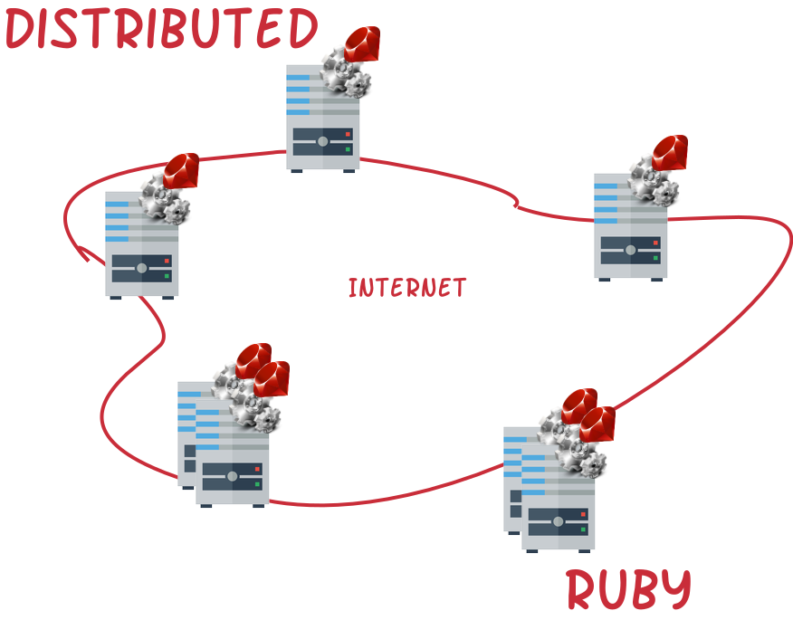

This is the chapter that introduces you to Web development. I.e. development of software that is deployed in Internet and uses
its technologies. We are learning how to design and deploy applications that follow the client-server architecture paradigm. We rely
on the protocol `dRuby`, ./images/Distributed Ruby, which is coming for free with the Ruby standard library. We will also have an introduction
to internet protocols.
