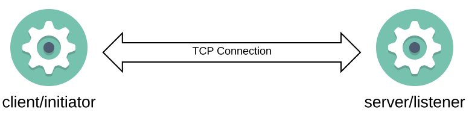
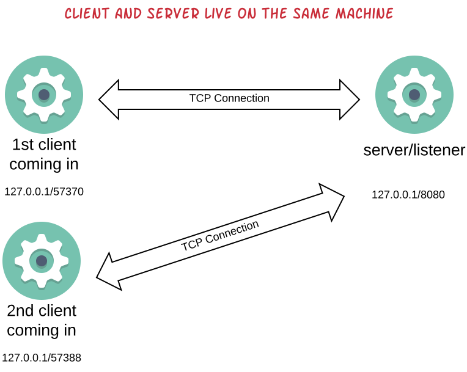
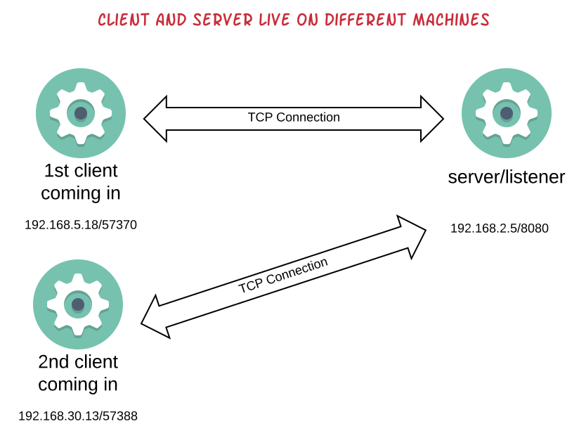

TCP/IP (Transmission Control Protocol/Internet Protocol) sockets is a set of programming API that allows us to write
Ruby applications deployed on the Internet. It is the [Berkeley Sockets API](https://en.wikipedia.org/wiki/Berkeley_sockets) that we will rely on in this course.
This API has been invented back in 1983 and has truly stood the test of time.  
 
Although we will internally be using the Berkeley Sockets API, this will be done via the Ruby libraries that wrap the calls to this API. 
Hence, you will have the chance to learn details about the Berkeley Sockets API that are independent of the programming language that 
you use, but, on top of that, we will show you how Ruby has made it much easier to use this API via their libraries.

Having said the above, let's start with the Ruby Sockets API.

## TCP Connections

A TCP Connection involves two endpoints. The client, which is also called *initiator* and the server, which is also called *listener*.



## Server TCP Socket LifeCycle

A server TCP socket lifecycle includes the following:
 
1. create the TCP socket
2. bind to an IP/PORT address
3. listen for incoming connections from a client
4. accept an incoming connection
5. close an incoming connection and the socket

The following is a program that demonstrates the above:

``` ruby
 1. # File: sockets-server-1.rb
 2. #
 3. require 'socket'
 4. 
 5. # 1. create the socket
 6. socket = Socket.new(:INET, :STREAM)
 7. 
 8. # 2. Bind:
 9. #
10. # 2.1. Create a structure to hold the address for listening
11. address = Socket.pack_sockaddr_in(8080, '0.0.0.0')
12. # 2.2. Bind to this address
13. socket.bind(address)
14. 
15. # 3. Listen for incoming connections:
16. socket.listen(5) # 5 is the size of the pending connections queue
17. 
18. # 4. Accept an incoming connection:
19. connection, remote_address = socket.accept
20.
21. puts "Connection: #{connection.inspect}"
22. puts "Remote address: #{remote_address.inspect}"
```

These are the things that you need to be aware of about the above program:

1. It requires the `socket` file. This is because sockets in Ruby are part of the standard library and, hence, they are not required by default.
2. On line 6 we take the first step to create the socket object. The `:INET` and `:STREAM` parameters are there in order to 
create an Internet v4 TCP socket.
3. Then we just call `socket.listen(...)` on line 16, which is the third step in the server socket lifecycle. The `#listen` method takes as argument
the size of the *pending connections queue*. When a client tries to connect to a server and the server is busy, in the middle of processing the
previous connection, then latest incoming connection will be first put in the *pending connections queue* until it is accepted by the server. 
You cannot set this number to a very big number for various reasons. One is that you don't want your clients to wait for connections for too long.
If it appears that you need bigger queue, this might mean that your server does not process connections quickly, something that you would better remedy. Also, the
queue consumes system resources which are shared with other processes in your host machine. Nevertheless, the maximum number that you can
use here is `Socket::SOMAXCONN` which on my machine was `128`. Also, you don't want this number to be very small, because if you do, you increase
the chances your clients get a connection refused error. For this example, we set the number to `5`, but feel free to experiment.
4. This is the 4th step in the server socket lifecycle. When we call the `#accept` on a server socket, then the process thread calling this, it
blocks until a new client connection comes in. When the client connection finally comes in, then this method returns two elements. A connection
object and a remote address object. The first has the details of the connection established and the second has specific details about the
address of the remote client that the connection was established with.

Let's run this program on a terminal:

``` bash
$ ruby sockets-server-1.rb

```
When you start this program, the process does not terminate. It is the line 19, `socket.accept` that blocks the server process until a client
comes in.

Can we have a client connect to this socket? One program that you can have handy for such things is `netcat` or `nc` in Linux. Try the
following on *another* terminal:

``` bash
$ nc localhost 8080
$
```

You will see that the server process will execute lines 21 and 22 and will terminate:

``` bash
Connection: #<Socket:fd 8>
Remote address: #<Addrinfo: 127.0.0.1:57197 TCP>
$
```

What has just happened is that the `nc` program worked as a client and connected to the port `8080` on the local machine, i.e. on the machine
that the server process (`sockets-server-1.rb`) was waiting for an incoming connection. So, the server process was unblocked from the `socket.accept`
call and it executed the two lines that printed the connection and the remote address information.

## Accept Loop

We saw that the server program that we wrote above terminated when the client connected to it. Usually, you wouldn't like to do that.
You would like to be able to accept more connections, after accepting the first.

You can easily do that with a `loop` around `accept`. Here is the new version of our server:

``` ruby
 1. # File: sockets-server-2.rb
 2. #
 3. require 'socket'
 4. 
 5. socket = Socket.new(:INET, :STREAM)
 6. 
 7. address = Socket.pack_sockaddr_in(8080, '0.0.0.0')
 8. socket.bind(address)
 9. 
10. socket.listen(5)
11. 
12. loop do
13.   connection, _ = socket.accept
14.   puts "Server local address: #{connection.local_address.inspect}"
15.   puts "Client remote address: #{connection.remote_address.inspect}"
16.   connection.close
17. end
```

You can see that we have wrapped the `socket.accept` into a `loop do ... end` block. Which means that this call after accepting
an incoming client request, it prints the details of the connection and then closes the connection before going to accept a new
one.

> Hint: When we don't care about working on the return value of a Ruby method call, we can assign it to `_`.

> Note also that we print the details of the local and remote address as they are returned from the `connection` object.

Here is an example of what we see if we start this new version of the server and we use another terminal to call `nc localhost 8080`.

``` bash
$ ruby sockets-server-2.rb
Server local address: #<Addrinfo: 127.0.0.1:8080 TCP>
Client remote address: #<Addrinfo: 127.0.0.1:57370 TCP>

```

and the server stays there waiting for more connections. Try once more to call `nc localhost 8080`. This is what you will 
be looking at, at the server terminal:

``` bash
$ ruby sockets-server-2.rb
Server local address: #<Addrinfo: 127.0.0.1:8080 TCP>
Client remote address: #<Addrinfo: 127.0.0.1:57370 TCP>
Server local address: #<Addrinfo: 127.0.0.1:8080 TCP>
Client remote address: #<Addrinfo: 127.0.0.1:57388 TCP>

```

You can see above that one more pair of local and remote addresses has been printed.

> Each TCP connection is a pair of two endpoints as we said above. The server point and the client point. They are both
represented with the `Addrinfo` object. Two properties of this object are more important here. The IP and the port. You can
see that the server port printed (8080) is the one that we bound the server on. On the other hand, the client port
is always ephemeral and assigned on the fly on each client coming in. 

> Note that client and server do not have to be living in the same host. In the picture above we see the client living in the same machine
like the server does, both having same IP, `127.0.0.1`. But in the following, you see an example with client and server living on completely
different machines.


Note that when a connection is not needed any more by the server side, it is `closed`. This is necessary because it releases invaluable system resources.


> Information: Sometimes, you may try to start your server and you might get the following error
``` bash
sockets-server-2.rb:8:in `bind': Address already in use - bind(2) for 0.0.0.0:8080 (Errno::EADDRINUSE)
        from sockets-server-2.rb:8:in `<main>'
```
> This means that your server is trying to bind to port that is already in use. Make sure that you don't have
another server process running at the same time (and bound to the same port). Also, sometimes, the port is not
made available by the system, immediately after the server terminates. In that case, you will have to wait for 
a minute or so, before trying to bring the server up again on the same port. Or you can just start your server
on another port.

## Using Ruby API

We have seen how the server can use the Ruby version of the Berkeley Sockets API. However, Ruby takes it one step further and
offers us an API that makes creating, binding and listening on sockets much easier. Let's see that.

Write the following new version of the server process (`sockets-server-3.rb`):

``` ruby
# File: sockets-server-3.rb
#
require 'socket'

server = TCPServer.new(8080)

loop do
  connection = server.accept
  puts "Server local address: #{connection.local_address.inspect}"
  puts "Client remote address: #{connection.remote_address.inspect}"
  connection.close
end
```

Then, start the server by running `ruby sockets-server-3.rb`. On another terminal, issue `nc localhost 8080`. Do it twice.
You will see similar output printed at the server terminal like you did with the version `sockets-server-2.rb`. Something like
this:

``` bash
$ ruby sockets-server-3.rb
Server local address: #<Addrinfo: 127.0.0.1:8080 TCP>
Client remote address: #<Addrinfo: 127.0.0.1:61369 TCP>
Server local address: #<Addrinfo: 127.0.0.1:8080 TCP>
Client remote address: #<Addrinfo: 127.0.0.1:61371 TCP>

```

`sockets-server-3.rb` functions exactly the same like the `sockets-server-2.rb`. Instead of calling 4 lines of code like this:

``` ruby
socket = Socket.new(:INET, :STREAM)

address = Socket.pack_sockaddr_in(8080, '0.0.0.0')
socket.bind(address)

socket.listen(5)
```

we just call one line of code like this:

``` ruby
server = TCPServer.new(8080)
```

Which one would you prefer? I definitely prefer the latter one. 

Note, however, one more difference. The `TCPServer.new` returns a `TCPServer` object and not a socket object. So, calling
`server.accept` on line 8, then it returns only the `connection` and not both the `connection` and the `remote_address`.

## IPv4 VS IPv6

The most common IP addresses are addresses like this: `46.176.104.17` i.e. addresses with 4 integer numbers, each one 
starting from 0 up to 255. These are the v4 IP addresses. However, since more and more computers are acquiring IP addresses
every day, which means that IP v4 addressing scheme is running out of addresses, a new version of IP addressing scheme 
has been invented, that would cover for many more IP addresses. This new scheme is called v6 and this is an example of an IP 
v6 address: `0:0:0:0:0:ffff:2eb0:6811`.

Ruby allows you to bind a server to a socket that complies to both IPv4 and IPv6. In fact, we are talking about two sockets
that could be *listened* together and return back one connection when either of them is contacted by a client.

The Ruby API that creates the two sockets is `Socket.tcp_server_sockets`. Then you can use the `Socket.accept_loop(sockets)` to
wait for any client at either of these two sockets.

Here is an example that uses this technique (file: `sockets-server-4.rb`):

``` ruby
 1. # File: sockets-server-4.rb
 2. #
 3. require 'socket'
 4. 
 5. sockets = Socket.tcp_server_sockets(8080)
 6. puts "sockets: #{sockets.inspect}"
 7. 
 8. Socket.accept_loop(sockets) do |connection|
 9.   puts "Server local address: #{connection.local_address.inspect}"
10.   puts "Client remote address: #{connection.remote_address.inspect}"
11.   connection.close
12. end
```

On line 5, we return two sockets in the array `sockets`. With the `Socket.accept_loop(sockets) do |connection|` we make sure that
we have a server accepting connections to both sockets at the same time, depending on how the client wants to connect to the
server, i.e. either using IPv4 or IPv6 addressing scheme. In any case, the new connection created is given in the block level
variable. Inside the block, server is handling the connection. Before ending the processing, it closes the connection like before.

Try to run the server program. You will initially see this:

``` bash
$ ruby sockets-server-4.rb
sockets: [#<Socket:fd 8>, #<Socket:fd 9>]

```

The server waits for a client to connect. Now run the command `nc localhost 8080` on another terminal. You will get something like 
this at the server side:

```
Server local address: #<Addrinfo: [::1]:8080 TCP>
Client remote address: #<Addrinfo: [::1]:61589 TCP>
```

Then try the localhost/127.0.0.1 representation in IPv6 version: `nc 0:0:0:0:0:ffff:7f00:1 8080`. You will get something like this:

```
Server local address: #<Addrinfo: 127.0.0.1:8080 TCP>
Client remote address: #<Addrinfo: 127.0.0.1:61605 TCP>
```

In the previous examples, you can see how server is representing either the IPv4 or IPv6 addresses (`AddrInfo` instances).

## Ruby API Is Even Easier

But Ruby API for TCP sockets that support both IPv4 and IPv6 and loop while accepting connections on a specific port is 
even easier. See the version `sockets-server-5.rb`:

``` ruby
1. # File: sockets-server-5.rb
2. #
3. require 'socket'
4. 
5. Socket.tcp_server_loop(8080) do |connection|
6.   puts "Server local address: #{connection.local_address.inspect}"
7.   puts "Client remote address: #{connection.remote_address.inspect}"
8.   connection.close
9. end
```

Believe it or not (you only have to run it and convince yourself), this server program is exactly the same like the
one in `sockets-server-4.rb`. But with much less lines of code.

## Client Program

We have talked about the server side of the TCP socket. Let's see now the details on how we build a client that
would connect to a server socket.

The version `sockets-client-1.rb` uses the low level API. We will see this first before we use the high-level Ruby API.

``` ruby
1. # File: sockets-client-1.rb
2. #
3. require 'socket'
4. 
5. socket = Socket.new(:INET, :STREAM)
6. remote_addr = Socket.pack_sockaddr_in(8080, '127.0.0.1')
7. socket.connect(remote_addr)
8. socket.close
```

On line 5, we first create the socket. We define it to be an IPv4 TCP/IP socket. Then on line 6 we convert the address that
we want to connect to into a structure that is necessary for remote addressing. We specify also that we want to connect
to port 8080 of the localhost. Then on line 7, we connect using the `socket.connect(remote_addr)`, which basically tells the
client to initiate a connection to the server running on localhost/8080.

We finally close the socket to release any resources.

Having the `sockets-server-5.rb` programming running on a terminal, run the above client program on another:

``` bash
$ ruby sockets-client-1.rb
$
```

You will not see anything on clients terminal. The client will terminate immediately. What you will see on the server terminal
will be something like this (something that we have already seen earlier):

``` bash
$ ruby sockets-server-5.rb
Server local address: #<Addrinfo: 127.0.0.1:8080 TCP>
Client remote address: #<Addrinfo: 127.0.0.1:61893 TCP>

$
```

which proves that the client has been successfully connected to the server.

## Client Using the Ruby API.

Ruby API offers a higher level interface to connect to a client using TCP, both for IPv4 and IPv6. Here is the version of the
previous client using this higher level API.

``` ruby
1. # File: sockets-client-2.rb
2. #
3. require 'socket'
4. 
5. Socket.tcp('127.0.0.1', 8080) do |connection|
6.   connection.close
7. end
```

Pretty neat. Isn't it? Try this client now (while having the `sockets-server-5.rb` still running). You will see something like
this at the server terminal:

``` bash
Server local address: #<Addrinfo: 127.0.0.1:8080 TCP>
Client remote address: #<Addrinfo: 127.0.0.1:61928 TCP>
```

## Exchange Data

The examples so far didn't do something useful. Useful things start to happen when we have the client request data, ask questions,
and the server return back responses.

## Server Getting The Question

Let's enhance our latest server example to be able to read the question, i.e. get data from the client.

``` ruby
 1. # File: server-reading-from-connection.rb
 2. #
 3. require 'socket'
 4. 
 5. Socket.tcp_server_loop(8080) do |connection|
 6.   puts 'starting to read ...'
 7.   puts connection.read
 8.   puts '...end reading'
 9. 
10.   puts 'closing connection...'
11.   connection.close
12.   puts '...connection closed'
13. end
14. 
15. puts 'Server terminates'
```

This server version is similar to the previous one, but it also has the line 7, `connection.read` that renders server into
a *reading* mode. In other words, server reads whatever is put on the connection. When it finishes reading (we will see what
does this exactly mean) we just print some extra messages.

Let's run the server on a terminal (`ruby server-reading-from-connection.rb`) and then use the `echo 'hello world' | nc localhost 8080` command
on another terminal. This `netcat` command is going to send the string `hello world` to the server waiting for data on port `8080`.

This is what we will see at the server side after we send the `hello world` string with the above command.

``` bash
$ ruby server-reading-from-connection.rb
starting to read ...
hello world
...end reading
closing connection...
...connection closed

```

Cool! `connection.read` was executed. The string `hello word` was printed at the server side, thanks to the command 
`puts connection.read`. In other words, the `connection.read` was executed and the returned value, which was the
string sent by the client, was printed on the server side console window.

Server is still running, so you can try more `echo <a string> | nc localhost 8080` commands. You will see the echoed strings
being printed at the server side.

## A Client That Sends Data

We have used `nc` to send data to our server. Can we write a client that does that?

``` ruby
1. # File: client-writing-to-connection.rb
2. #
3. require 'socket'
4. 
5. Socket.tcp('127.0.0.1', 8080) do |connection|
6.   connection.write ARGV[0]
7.   connection.close
8. end
```

I believe that this must have been expected by you. We use the `connection.write` to write data to the connection. The above client
sends to the server the string given as run-time argument on the command line.

If you run this command `ruby client-writing-to-connection.rb 'hello world'` (having server still running), you will see server
printing the words:

``` bash
starting to read ...
hello world
...end reading
closing connection...
...connection closed
```
again.

## Server Waits for EOF Character

Before we continue it is very important that you understand that server `connection.read` reads data until it encounters
the datum which is called EOF (End Of File). This is something like *there is no more data* signal that is sent from the
client to the server and makes the `connection.read` stop waiting for more data from the client. If the EOF is not ever sent
by the client, unfortunately, `connection.read` will indefinitely be waiting.

Let's see an occurrence of the non-ending reading case. Instead of using the `echo` command (which tells `nc` when the data
finishes) we will use the `tail -f` command which never ends and continuously expects to send data to the `nc` pipe.

Issue the following command on a terminal, while you have your server running:

``` bash
tail -f sockets-server-5.rb | nc localhost 8080

```

You will see that the above never terminates. `tail` waits for more data to be added to file `sockets-server-5.rb` in order to
send it to `nc localhost 8080`. (Note that the choice of the file `sockets-server-5.rb` is completely irrelevant, just ask `tail` to
`tail` any existing file). `tail` never sends the EOF character to `nc`. This means that `nc` never sends the EOF to the server too.
If you see what happens at the server side, you will see this:

``` bash
starting to read ...

```

Server is blocked on continuous reading waiting to receive more data until it receives the EOF character.

The original client which used the `connection.write` it did sent the EOF character to the server. Same did the `echo 'hello world' | nc localhost 8080`
technique. But this one, with the `tail -f` does not ever send the EOF character.

> Now, let's stop both the server and the `tail -f ...` command by using the keyboard to send <kbd>Ctrl + C</kbd>

## Limiting Read Length

The problem we demonstrated above implies also that `connection.read` blocks and does not return any data to the server. It accumulates
the data received from the client, but never returns anything to the server until it receives the EOF character. 

What we can do in order to give some data back to the server code, even if EOF is not received yet, is that we can limit the
read length to a specific small number.

This is the version of the server that does not wait endlessly on the `connection.read` command:

``` ruby
 1. # File: server-reading-small-chunks-of-data.rb
 2. #
 3. require 'socket'
 4. 
 5. Socket.tcp_server_loop(8080) do |connection|
 6.   while data = connection.read(10)
 7.     $stdout.print data
 8.     $stdout.flush
 9.   end
10. 
11.   $stdout.puts 'closing connection...'
12.   connection.close
13.   $stdout.puts '...connection closed'
14. end
15. 
16. $stdout.puts 'Server terminates'
```

The difference here being that `connection.read` is provided with a number which specifies the amount of data to be read
before returning control back to server and the data read into the variable `data`. In our example, we will continuously
be fetching data in chunks of 10. Every 10 bytes we get back from client, we will be printing the data and then we will
be going back again to read more data, until the EOF is given by the client or the connection is closed by the client.

Start the server with `ruby server-reading-small-chunks-of-data.rb` and then try to use the `tail -f <an existing file>` 
technique that we used earlier. You will see that although the server is *blocked* in waiting for data to come in,
it now has the ability to print the data sent from client in chunks of 10 characters.

The video below shows this interaction on my machine:

<div id="media-container-video-Server Reading Data in Chunks of 10">
  <a href="https://player.vimeo.com/video/215706568"></a>
</div>

Nevertheless, `connection.read(<amount of data>)` is blocking. Either waiting for the EOF to be sent, or waiting for the specified amount
of data to be sent. This can be quite tricky to handle. And may also end you having a deadlock situation: client waiting for the
server and server waiting for the client.

## Partial Reads

An alternative to `connection#read` is the `connection#readpartial`. This alternative returns, immediately, the available data. You call
it by passing the maximum amount of data that you want to receive. But if less data are available, these will be immediately returned.

Let's see the version of the server that uses partial read:

``` ruby
 1. # File: server-partial-read.rb
 2. #
 3. require 'socket'
 4. 
 5. Socket.tcp_server_loop(8080) do |connection|
 6.   begin
 7.     while data = connection.readpartial(10)
 8.       $stdout.print data
 9.       $stdout.flush
10.     end
11. 
12.   rescue EOFError
13.   end
14. 
15.   $stdout.puts 'closing connection...'
16.   connection.close
17.   $stdout.puts '...connection closed'
18. end
19. 
20. $stdout.puts 'Server terminates'
```

The difference to the lazy `#read` is that the `#readpartial` will read as much as it has and then will return back to the 
server to continue execution. Note also that, to the contrary of how `#read` behaves, it will raise an `EOFError` exception
if the client terminates sending data. 

The following video shows how much better the `#readpartial` behaves.

<div id="media-container-video-Server Uses ReadPartial">
  <a href="https://player.vimeo.com/video/215713818"></a>
</div>

## Server Responds Back

We have seen how a client can send a request to the server and how the server can write the request data on the console.
But how can we have the server respond back to the client?

This is a new version of the server that takes a *first name* from the client and returns back the *last name* corresponding to that last name.

``` ruby
 1. # File: server-responds-back-to-client.rb
 2. #
 3. require 'socket'
 4. 
 5. last_names = {
 6.   'John' => 'Smith',
 7.   'Mary' => 'Foo',
 8.   'Paul' => 'Fox'
 9. }
10. Socket.tcp_server_loop(8080) do |connection|
11.   first_name = connection.read
12.   puts "First name: #{first_name}"
13.   answer = last_names.fetch(first_name, 'unknown')
14.   connection.write answer
15.   connection.close
16. end
17. 
18. puts 'Server terminates'
```

This is a simple server that uses the lazy `connection.read` command in order to read a piece of string from the client.
Then it uses the same connection to write back the answer. Then closes the connection (which also sends an EOF to the client).

Let's start the server:

``` bash
ruby server-responds-back-to-client.rb

```

Now, this is a client that asks for the last name of a first name.

``` ruby
 1. # File: client-writing-to-connection.rb
 2. #
 3. require 'socket'
 4. 
 5. Socket.tcp('127.0.0.1', 8080) do |connection|
 6.   connection.write ARGV[0]
 7.   connection.close_write # This will send the EOF
 8. 
 9.   last_name = connection.read
10.   puts last_name
11. 
12.   connection.close
13. end
```

The tricky point here is the `#close_write` that you see on line 7. This signals that client does not have anything else
to write to the server. This sends the EOF signal and server knows that it does not have to wait for anything else.
`#close_write` closes the *write* direction of a connection. Does not close the whole connection. The *read* direction
is still available for reading. Hence, client reads the last name returned back by the server and then closes the connection.

Having the server running, try calling the client:

``` bash
$ ruby client-writing-to-connection.rb John
Smith
$ ruby client-writing-to-connection.rb Mary
Foo
$ ruby client-writing-to-connection.rb Dummy
unknown
$
```

## Closing Note

We have learned the basics of TCP/IP programming. The clients and servers that we have built are quite primitive. They have 
many issues that need to be addressed until we call them production-ready. For example, the servers need to introduce some
kind of concurrency. Otherwise, serving a client prevents from accepting connections and serving another, until the first
request has been completely served.


