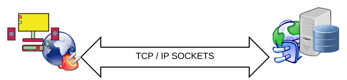

In the world of Internet, the majority of the devices communicate using TCP/IP sockets. A client sends a message to a server
and gets back a response, all with the help of TCP/IP sockets. This chapter is an introduction to this old technology that
has survived the test of time and that is very useful for people to be connected over Internet. Learning about sockets will
prepare you to later on study the HTTP protocol which sits on top of them.
