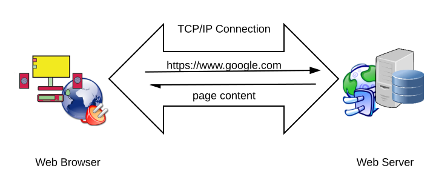
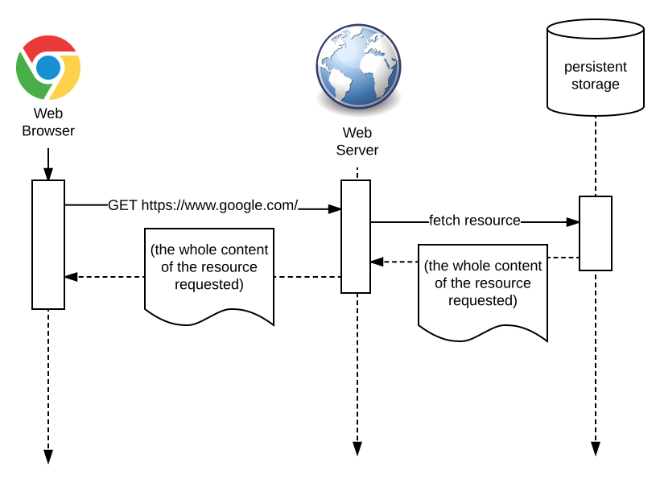
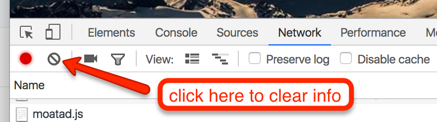
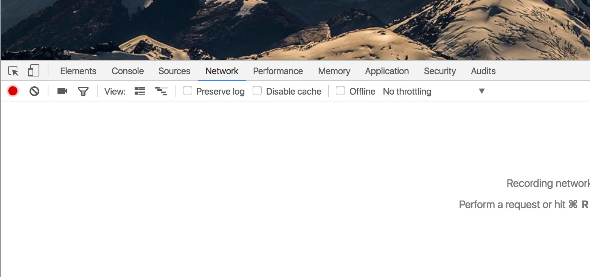
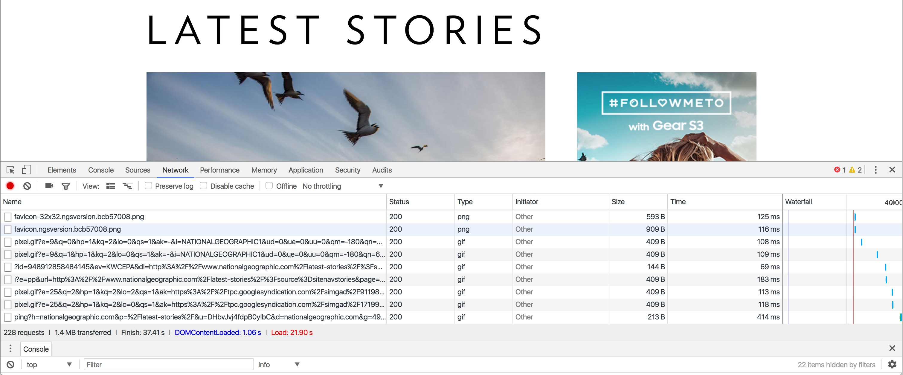
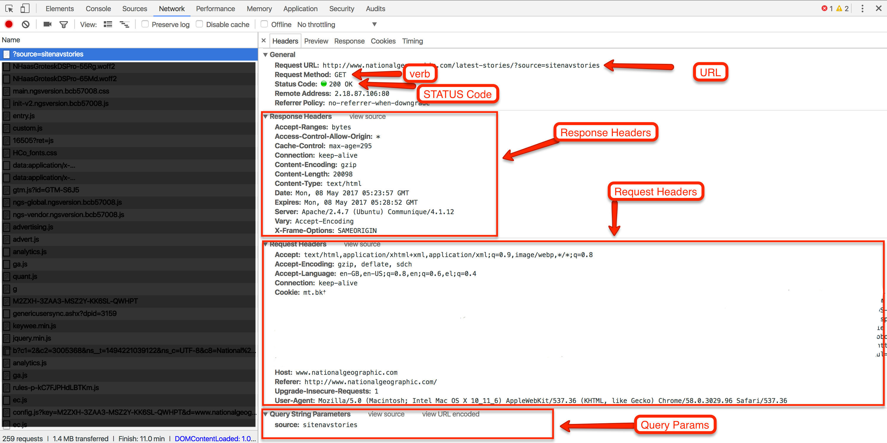
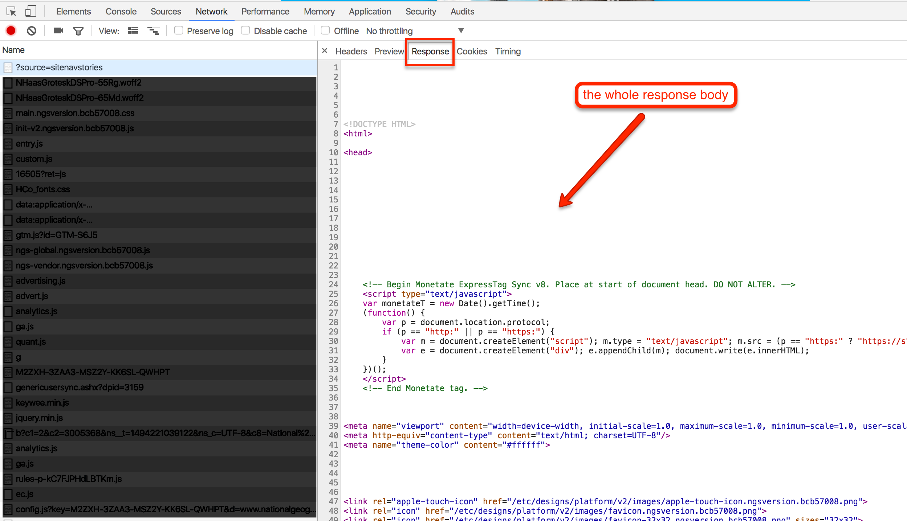
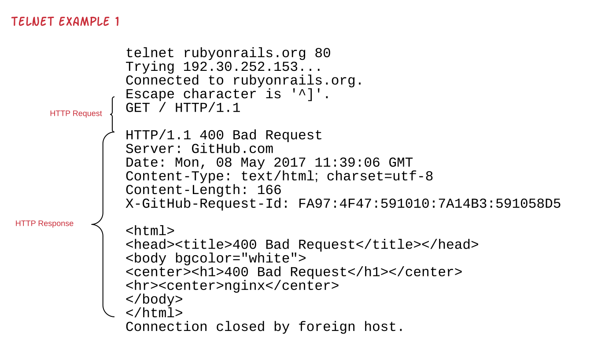
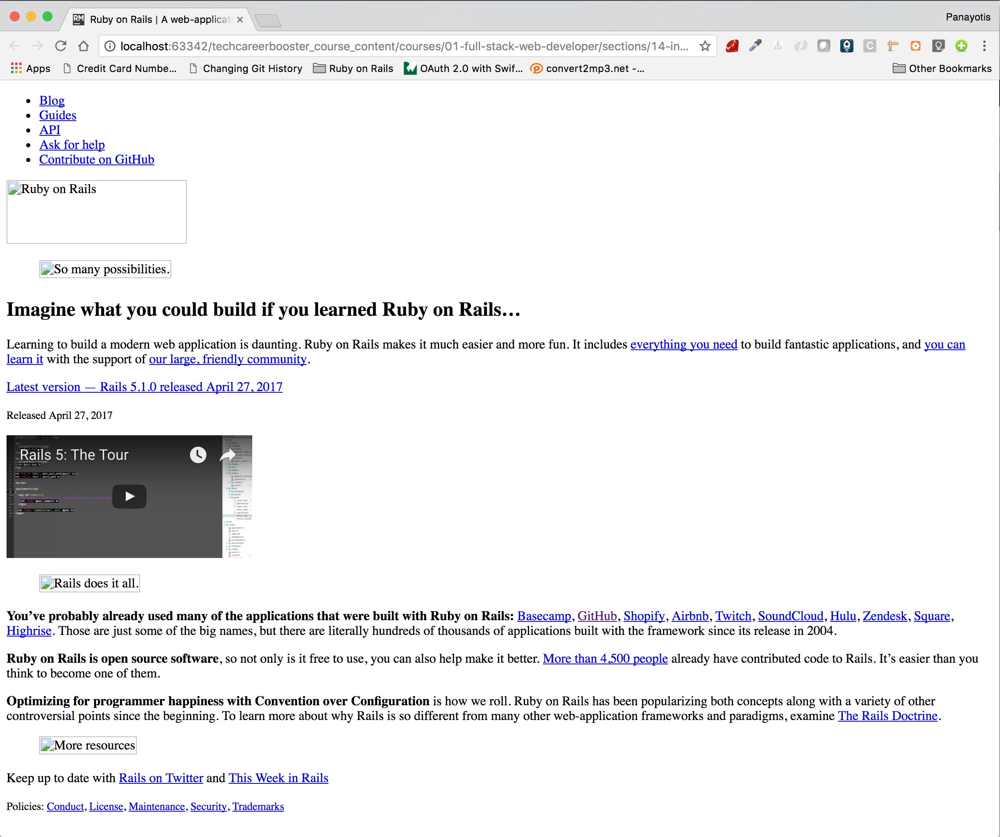
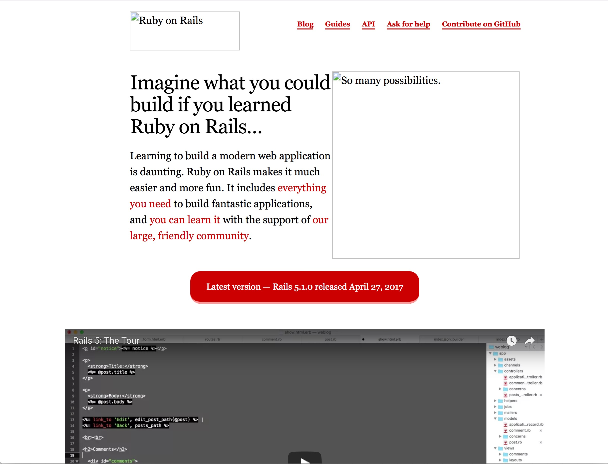

HTTP, Hypertext Transfer Protocol is an application layer protocol that relies on TCP/IP and it is used for communication
between clients and servers over the Web. It is the protocol that a browser uses to connect to a Web server and ask
for information. Its secure version is the HTTPS and it is becoming ubiquitous little-by-little.

## HTTP Request/Response

HTTP is a request/response paradigm of communication and relies on TCP/IP which guarantees the delivery of messages
from sender to recipient and vice-versa.

There is a server that expects an HTTP Request from a client, e.g. a Web Browser. The client sends the HTTP Request
and signals the end of the request transmission. It then puts itself into a reading mode (over the same connection, which
is bidirectional) and reads the HTTP Response coming in from the server.



## HTTP Port

The well-known port for TCP/IP connections that would serve the HTTP protocol is port number `80`. When you use your browser to
get the contents of a page, e.g. to get the contents of `http://www.google.com`, your browser will use, by default, the port number `80`,
to connect to the Web server that listens for connections behind the host `www.google.com`. 

## HTTPS Port

On the other hand, the well-known port for TCP/IP connections that HTTP Secure (HTTPS) protocol uses is `443`. So, whenever you
access `https://www.google.com`, then your browser is setting up a connection to a remote server listening on port `443`. 

## URL - Uniform Resource Locator

An HTTP Request includes a Uniform Resource Locator, i.e. a URL which specifies what this request is interested in retrieving
as an answer.

The components of the URL such as this: `https://www.techcareerbooster.com:8749/course/full-stack/students?state=active&grade=100` are
the following:


1. The protocol. In this example, this is `https`. The protocol can be either `http` or `https`. When the protocol is `https`, then
any data that are sent from client to server, i.e. from your browser to the Web server, are being encrypted.
2. The host. In this example, this is `www.techcareerbooster.com`. The host name is being translated to an IP address with the 
help of Domain Name Servers.
3. The port. In this example, the port is `8749`. When the port is omitted and the protocol is `http`, then the port `80` is used.
But when the protocol is `https`, then the default port is `443`. 
4. Path to the resource. In this example, this is `/courses/full-stack/students`. It tells Web server which resource on that server
the client is interested in.
5. The query and its params. In this example it is `state=active&grade=100`. The query is separated from the resource path using the
symbol `?`. The query is composed of a series of query params. In this example with have 2 params, the `state` and the `grade`. Each
param comes with a value which is separated from the param name using the symbol `=`. Each param/value pair is separated from the
next using the symbol `&`. The params are not mandatory, but when present tell the Web server that the client is interested in
getting the particular resource information under some kind of filtering based on the param values. It is the responsibility of
the Web application processing those params to return back the requested information.

## HTTP Verbs

As we said above, the client uses HTTP to send a request that bares a URL. But, besides the URL, that is the full address of the
resource the client is interested in, HTTP requires the client to tell what they want to do with the particular resource. Client tells
what they want to do with the particular resource using well-defined *HTTP verbs*. 

### `GET`

The most popular verb is the `GET` verb which tells server that the client wants to retrieve the information related to the resource
specified in the URL. The URL needs to contain everything (host, path to resource, query parameters) the Web application 
needs in order to return back the information the client is asking to retrieve.



When you use your Web browser to access / fetch a Web page, it is the `GET` verb that is internally used by your browser.

### `POST`

This verb is used when we want to tell the Web application to *create* a resource. Client sends a `POST` request with all the
data encoded in the body of the request (we will talk about head and body of the HTTP request later on). Some clients may
also send the data as query params but this is not usually a good practice.

Web application will process the data sent with the HTTP request and will update its state. For example, it will update a record
into a database. So `POST` requests are dangerous and whenever a client sends such a request, client needs to know that 
the server side of things will permanently be updated. (Have you ever seen your browser popping up a dialog asking whether
you are sure that you want to resubmit? It tries to protect you from resending a `POST` request accidentally).

When you use your Web browser to fill in a form and submit your data, your browser will usually use a `POST` request to the remote
server.

### `PUT` or `PATCH`

This verb is used when the client wants to *update* the resource specified in the URL. Similar to `PUT` is the `PATCH` verb and
can be used in the place of `PUT`.

### `DELETE`

This verb is used when the client wants to *delete* a resource. 

Note that `PUT` and `DELETE` might not be supported by some clients. In that case, the client might use `POST` instead and 
specifying the actual intention as part of the data sent in the body of the request.

### `HEAD`

This is very useful because it can be used to check whether a resource exists and if it exists whether it has been changed
from the previous try to get it. It does not return the whole resource itself. So, it minimizes the amount of information that
travels from server end to client end.

### Verbs and Usages

This is a table with the most common HTTP Verbs and their Usages

<table>
    <thead>
        <tr><th>HTTP Verb</th><th>Usage</th></tr>
    </thead>
    
    <tbody>
        <tr><td><code>GET</code></td><td>Requesting a resource, e.g. a page</td></tr>
        <tr><td><code>POST</code></td><td>Create a resource, e.g. a book on a bookstore application</td></tr>
        <tr><td><code>PUT</code> or <code>PATCH</code</td><td>Update a resource, e.g. a book price</td></tr>
        <tr><td><code>DELETE</code></td><td>Delete a resource, e.g. a book</td></tr>
        <tr><td><code>HEAD</code></td><td>Checking whether a resource has been updated without actually fetching the resource</td></tr>
    </tbody>
</table>

## Response Status Codes

We have learned about the URL, that is part of the HTTP request, and about the HTTP verbs. There are other things that are
part of the HTTP request, but before learning about these, let's see one very important part of the HTTP response. It is the
HTTP Response Status code. 

The HTTP Response Status code gives instructions to client on how to interpret the response content. 

### 1XX

The HTTP Response Status code in the range `100 - 199` are informational messages. Usually, when sent by the server, this implies
that the server is still processing the request and a final response will soon be returned.

### 2XX

Any code in the range `200 - 299` denotes success of the processing on the server side. The most common code is `200` which is also
called `OK`. For a `GET` request, the server replies with an HTTP Response with status code `200` and the resource data encoded
in the body of the response. If the verb was `POST`, then a `200` response might contain a piece of information that would allow
the client to fetch the created resource in the subsequent call. For example, it might contain the URL to the newly created resource.

Usually, we should be expecting a return status code of `201`, when a new resource is created. However, this is a rule that it may not be followed by all Web applications.
There are Web applications that return a `200` instead of a `201` when they create a new resource.

The code `202` means that the request has been accepted, but not fulfilled immediately. The fulfillment would take place asynchronously.
It may be fulfilled or not.

### 3XX

This response code indicates that a resource has been moved and that the client should be redirected to another resource (page).

In fact, `301` means that the resource has been moved permanently and the resource should now be looked at at a different URL. The different URL
is included as part of the response. 

`302`, on the other hand, usually means temporary redirection. In other words, although the current request should now be repeated to another URL,
future ones should be done to the original URL. 

`304` is very useful to implement some caching mechanism. It tells client that the resource has not been modified since the last request
and, for that reason, the response body, besides the status code (`304`) does not contain the actual resource information, assuming that the
client already has the cached copy. 

### 4XX - Client Side Errors

These response status codes informing the client that there is something wrong on the client side. In other words, that something didn't go
as expected due to incorrect or missing information provided by the client.

The most common response status code is `404`, which means `Not Found`. This is returned to the client that is requesting to get a resource
that cannot be found.

Other common codes are:

* `400` which is a `Bad Request`. This is usually returned when the server believes that the client didn't form the request data correctly.
* `401` or `Unauthorized`. This is returned when the server cannot authenticate the client request, i.e. credentials provided are wrong. Note that
although this response code is officially called `Unauthorized`, it should be returned when server does *authentication* and authentication fails.
Not when server does *authorization*. For failed authorization, the response code should be `403` (`Forbidden`).
* `403` or `Forbidden`. This is returned when the client has been authenticated, so server knows who the client is, but this client is not allowed 
to access the resource requested.
* `405` or `Method Not Allowed`. This is returned when the client is sending an HTTP Verb that is not supported by the server for the particular resource.
* `406` or `Not Acceptable`. This is returned when the client is sending data in a format that the server does not support, or if the client
is asking the server to return the data in a format that the server does not support.
* `422` or `Unprocessable Entity`. This error means that the client is asking server to carry out an action with data that are not valid, business-wise.
For example, the client might be sending customer details to be saved as a new customer, without sending the customer last name, when customer last
name is required by the Web application.

### 5XX - Server Side Errors

This family of response status codes is there to indicate to the client that a server-side error has taken place. 

The most common error code is `500`, which is the `Internal Server Error`. This error code is returned when the server side cannot actually give
any more specific information. Another common error is `503`, `Service Unavailable`. This usually means that the server cannot respond due to 
overload or because it is down due to maintenance. Usually, this is more temporary situation than the `500` case.

This is a table that summarizes the ranges of HTTP status codes:

<table>
    <thead>
        <tr><th>HTTP Status Code Range</th><th>Purpose</th></tr>
    </thead>
    <tbody>
        <tr><td>1XX</td><td>Informational Response. Rare. Usually, not final.</td></tr>
        <tr><td>2XX</td><td>Success</td></tr>
        <tr><td>3XX</td><td>Redirection or Not Changed</td></tr>
        <tr><td>4XX</td><td>Client Error</td></tr>
        <tr><td>5XX</td><td>Server Error</td></tr>
    </tbody>
</table>
 

> *Information:* Before I continue, let me just make clear, the difference between *authentication* and *authorization*. Authentication is
carried out by the server in the input of a username and a password (usually). Using the credentials (username and password) server
identifies who is behind the request. On the other hand, authorization makes sure that the authenticated and identified user has access
to a particular resource or not. For example, an admin user might have access to admin pages of a Web application, whereas a standard user
might not.

## HTTP Message Format

We have learned about the main constituent parts of the HTTP protocol. Let's now see the actual HTTP message format.

The format of an HTTP message, either request or response, is the same and has as follows:

### Request Line Or Status Line

The first line is either called the *Request Line*, if the HTTP is a request, or *Status Line*, if the HTTP is a response. In any case, the
first line is separated from the second one using a new line character

### Message Headers

After the first line (request or status), the message may be composed of 0 or more message headers. Each message header is sent in its own line.
The message headers give information to the recipient about the resource and may also help recipient decode the message body that follows.

### An Empty Line Separator

After the (optional) message headers, or after the first line (if the message headers are not present), there has to be an empty line.
This empty line is mandatory and either marks the end of the HTTP message, when a message body does not follow, or separates the head
from the message body if message body exists.

### The Message Body

The message body is optional and, if present, follows the empty line separator described above.

## HTTP Request Message Example

This is an example of an HTTP Request Message:

```
 1. POST https://www.techcareerbooster.com/contact_us_emails HTTP/1.1
 2. Accept: */*
 3. Accept-Encoding: gzip, deflate, br
 4. Accept-Language: en-GB,en-US;q=0.8,en;q=0.6,el;q=0.4
 5. Connection: keep-alive
 6. Content-Length: 309
 7. Content-Type: application/x-www-form-urlencoded; charset=UTF-8
 8. Cookie:_techcareerbooster_session=RVVhbl3779b43660; _ga=GA1.2.1475987; _gid=GA1.2.052; _gat=1; __zlcmid=gFgOzLF
 9. Host: www.techcareerbooster.com
10. Origin: https://www.techcareerbooster.com
11. Referer: https://www.techcareerbooster.com/
12. User-Agent: Mozilla/5.0 (Macintosh; Intel Mac OS X 10_11_6) AppleWebKit/537.36 (KHTML, like Gecko) Chrome/58.0.3029.96 Safari/537.36
13. X-Requested-With: XMLHttpRequest
14. 
15. contact_us_email%5Bname%5D=Panos&contact_us_email%5Bsubject%5D=Test+Subject&contact_us_email%5Bemail%5D=panosm%2B201705072117%40techcareerbooster.com&contact_us_email%5Bmessage%5D=Test+Body&authenticity_token=PSaRpPT2YVjumsCTMTVapim7%2B4GJR%2BN%2B36usQwmA8iBT%2FYFNywdS5UUiA%3D%3D 
```

(The line numbers above are not part of the message)

Let's see some details of the above example:

1. The line `POST https://www.techcareerbooster.com/contact_us_emails HTTP/1.1` is the *request line*. The request line always starts with the
HTTP verb. In this particular case is `POST`. Then we have the URL that we want to refer to. After that, we have the HTTP version specification.
Currently, having the value `HTTP/1.1` denoting that we are using HTTP version 1.1. which is the most popular version today.
1. Lines 2 till 13 are message headers. The message headers give extra information about the request and the client itself. Server will process
the information inside the headers and act accordingly. The headers have a name and a value. The name ends with a `:` character that separates
the name from the value. The value starts after a single space following the `:` character. In the above example we can see headers like:
    1. `Accept-Encoding` with value `gzip, deflate, br`
    1. `Content-Length` with value `309`
    1. `Content-Type` with value `application/x-www-form-urlencoded; charset=UTF-8`
    1. and many more
1. Line 14 is the empty line that delineates the end of the message headers.
1. Line 15 is the start of the message body. Note that in the particular example above, the message body has `309` characters, equal to the number
of characters specified in the `Content-Length` header. I guess that you get the point here. The `Content-Length` is very important because
it will tell the server how long the message body is and, hence, server will check the consistency of the message body, by comparing its actual
length to the expected length given in `Content-Length`. 

It is also very important to understand that each header may have its own encoding of their values. For example `Accept-Encoding` has 
a value which is a comma-separated list of other values (e.g.: `gzip, deflate, br`). On another example, the `Content-Type` has values
that are semi-colon-separated list of other values (e.g.: `application/x-www-form-urlencoded; charset=UTF-8`). Hence, the more you do
HTTP and Web programming, the more you will get familiar with these headers and their values. You only have to google for HTTP headers
and you will find an abundance of information about these pieces of information in the request and response messages.

## HTTP Response Message Example

The following is an HTTP response message example:

```
 1. HTTP/1.1 200 OK 
 2. Cache-Control: no-cache
 3. Connection: keep-alive
 4. Content-Type: text/html
 5. Date: Sun, 07 May 2017 18:48:22 GMT
 6. Server: Cowboy
 7. Set-Cookie:_techcareerbooster_session=U2lDeEdlQVJnT1ZBPT0tLW1lbTgyN1RRcFNQSVFtOWNOcGplR3c9PQ%3D%3D--a727e75bc6e61b2f98681fb58; path=/; secure; HttpOnly
 8. Strict-Transport-Security: max-age=31536000
 9. Transfer-Encoding: chunked
10. Via: 1.1 vegur
11. X-Content-Type-Options: nosniff
12. X-Frame-Options: SAMEORIGIN
13. X-Request-Id: c68c6ab0-79e5-422d-ad33-a2bb89162c55
14. X-Runtime: 0.026712
15. X-Xss-Protection: 1; mode=block
16.
```

Let's see the details of it:

1. The first line is the *status line* of the HTTP response message. It is composed of three parts. The HTTP version, here being
`HTTP/1.1`. Then is the Status Code, here being `200`. Finally, we see the word `OK` which is the *Reason Phrase*.
2. Lines 2 till 15 are the response headers. These are encoded, one header per line. And the name of the header is separated
from the value using the `:` character.
3. This example response does not have message body.

## A `GET` Request Response Example

We continue with another example, which is a `GET` request that will be issued by our browser to a Web server. In order to inspect
the message details, we will use our Google Developer Tools, and in particular, the *Network* tab.

(1) Open your browser and visit the page [https://www.nationalgeographic.com](https://www.nationalgeographic.com).
 
(2) Open your developer tools and make sure that you have the *Network* tab open. You should see something like this:


(3) Hover over (but **don't click**) the link *Latest Stories* or

over any link that you feel like. Keep a note of the URL that appears at the bottom. I.e. the URL that the browser would 
follow if you were to click that link.

On my case the URL is `www.nationalgeographic.com/latest-stories/?source=sitenavstories`. This is going to be the URL for the
`GET` request that will take place as soon as we click on the link.

(4) Clear the Network Tab information:

Click on the corresponding button in order to clear the network tab information.



You should see something like this:



(5) Now Click on The Link ...

... and watch the network tab being filled in with lots of HTTP requests. Something like this:



When you load a page, usually numerous HTTP requests are being sent to the corresponding Web server. And this was an example of such
a case. You can click on any of them and see its details, like the headers, the request body and the response status code.

(6) Click on the First Entry...

... which will correspond to the first HTTP request, i.e. to the `GET` request to visit that link that you spotted on step (3) above.



The *Headers* tab bears a lot of information about your HTTP request. You can clearly see the URL, the HTTP Verb and the Status Code. The Response Headers,
the Request Headers and the Query parameters.

(7) Click on the *Response* Tab...

... and you will see the response body, which, in this particular case is an HTML document.



## URL Encoding Of Query Param Names and Values

We saw earlier that the URL specifying the resource we want to act upon, might contain a *query*. We also saw that the query is being encoded following
specific rules. 

1. It starts with the `?` symbol.
2. Each param/value pair is given using a `=` to separate the name from the value.
3. One pair from the other is separated using the `&`.

But what happens if the value of a param includes the `&`? Or the `=` symbol? Or what happens if the name of a param has a space?
 
```
first name=Panos&last name=Matsinopoulos&address=18st Cross Street&Angel Street&city=London
```

In the above example, there are two parameters that have names that include a blank space as part of the name. Also, the `address` parameter
has value that includes both spaces and the symbol `&`.

Trying to use a URL that would include the above query wouldn't work.

This is where the idea of URL encoding comes into place. You need to encode the names and the values of your query so that they can
be part of the URL. 

[Here is an online site that does URL encoding and decoding](https://meyerweb.com/eric/tools/dencoder/). Use that to encode the
names and values of the above example:

1. `first name` becomes `first%20name`.
2. `last name` becomes `last%20name`.
3. `address` value `18st Cross Street&Angel Street` becomes `18st%20Cross%20Street%26Angel%20Street`

Now, the query, with proper encoding to be used in the URL has the value:

`first%20name=Panos&last%20name=Matsinopoulos&address=18st%20Cross%20Street%26Angel%20Street&city=London`

The URL encoding is also called *Percent encoding* and you can google for that. In Ruby, you can use the `CGI.escape()` method
call to encode a value following the URL encoding rules.

## Practice HTTP using `telnet`

Now that we know the basics of the HTTP protocol, let's do some practice using `telnet`. `telnet` allows you to connect to a 
remote server (by defining its IP and port) and exchange text messages. It uses the [Telnet](https://tools.ietf.org/html/rfc854) protocol, but we don't have
to know the details of it in order to practice some HTTP requests. We will use it to exchange HTTP protocol messages.

### Telnet Example 1

On your bash terminal issue the following command:

``` bash
$ telnet rubyonrails.org 80
Trying 192.30.252.153...
Connected to rubyonrails.org.
Escape character is '^]'.

```

`telnet` starts and connects to host `rubyonrails.org` on port `80`. This means that it connects to the Web server sitting behind this IP and port.
Then, `telnet` waits for you to give the strings/data to send over to the remote server.

Type the following:

```
GET / HTTP/1.1
```

... together with an empty line. This is an example of an HTTP request that does not have headers. Only the Request Line.

You will get back this:

```
HTTP/1.1 400 Bad Request
Server: GitHub.com
Date: Mon, 08 May 2017 11:39:06 GMT
Content-Type: text/html; charset=utf-8
Content-Length: 166
X-GitHub-Request-Id: FA97:4F47:591010:7A14B3:591058D5

<html>
<head><title>400 Bad Request</title></head>
<body bgcolor="white">
<center><h1>400 Bad Request</h1></center>
<hr><center>nginx</center>
</body>
</html>
Connection closed by foreign host.
```

Great! You just sent an HTTP request to the `rubyonrails.org:80` server, to retrieve the `/` root resource sitting behind this Web server.
And you just got back a response with status code `400 Bad Request`. The response has a `Server` header, which reveals where the reponse came
from and also, it tells you that it has some reponse body data with length equal to `166` bytes. It tells you also, that the 
type of the response body is `text/html`, which means that it is a proper HTML page:

``` html
<html>
<head><title>400 Bad Request</title></head>
<body bgcolor="white">
<center><h1>400 Bad Request</h1></center>
<hr><center>nginx</center>
</body>
</html>
```

This is the full interaction with the `rubyonrails.org` Web server as you experienced it above:



### Telnet Example 2

The problem with the previous request that we did was that we didn't specify which Web site we wanted to fetch. We just gave `/`, in the resource URL.
So, we basically said to the remote server that we need the default resource for the default Web site. And this didn't actually work. Most of the Web servers
serve many Web sites and we need to tell them which Web site we are interested in. Hence, with HTTP, the pair IP/Port is not usually enough. We need to specify
the Web site too. 

> Please, don't get confused. The fact that we gave `rubyonrails.org` on the command line on telnet, didn't actually tell anything to the 
HTTP request that we issued using telnet. It was only used by `telnet` at the beginning to try to locate the remote server (by doing a host-to-IP translation using DNS).

Try the following telnet session:

``` bash
$ telnet rubyonrails.org 80
Trying 192.30.252.153...
Connected to rubyonrails.org.
Escape character is '^]'.
GET / HTTP/1.1
Host: rubyonrails.org

```

You can see that except from the request line `GET http://www.rubyonrails.org HTTP/1.1`, we also send the header `Host` with value `rubyonrails.org`. 
This header is used to tell the remote server listening on port 80, which Web site we are interested in. 

Now, after you issue the empty line (following the `Host: rubyonrails.org` line), you will get back this:

``` html
HTTP/1.1 200 OK
Server: GitHub.com
Date: Mon, 08 May 2017 12:00:49 GMT
Content-Type: text/html; charset=utf-8
Content-Length: 5564
Last-Modified: Fri, 28 Apr 2017 11:51:53 GMT
Access-Control-Allow-Origin: *
Expires: Mon, 08 May 2017 12:10:49 GMT
Cache-Control: max-age=600
Accept-Ranges: bytes
X-GitHub-Request-Id: D141:4F4D:111CBDD:175FB4C:59105DEA

<!DOCTYPE html>
<html>
  <head>
    <meta charset="utf-8">
    <meta name="viewport" content="width=device-width">
    <link rel="stylesheet" href="/style.css" type="text/css" media="screen" charset="utf-8">
    <meta name="google-site-verification" content="Jknoaf3CvRzba3wXMxqgurDErIGZ9e1L1luuDMhQYEI" />
    <!-- Begin Jekyll SEO tag v2.2.0 -->
<title>Ruby on Rails | A web-application framework that includes everything needed to create database-backed web applications according to the Model-View-Controller (MVC) pattern.</title>
<meta property="og:title" content="Ruby on Rails" />
<meta property="og:locale" content="en_US" />
<meta name="description" content="A web-application framework that includes everything needed to create database-backed web applications according to the Model-View-Controller (MVC) pattern." />
<meta property="og:description" content="A web-application framework that includes everything needed to create database-backed web applications according to the Model-View-Controller (MVC) pattern." />
<link rel="canonical" href="http://rubyonrails.org/" />
<meta property="og:url" content="http://rubyonrails.org/" />
<meta property="og:site_name" content="Ruby on Rails" />
<meta name="twitter:card" content="summary" />
<meta name="twitter:site" content="@rails" />
<script type="application/ld+json">
{"@context": "http://schema.org",
"@type": "WebSite",
"name": "Ruby on Rails",
"headline": "Ruby on Rails",
"description": "A web-application framework that includes everything needed to create database-backed web applications according to the Model-View-Controller (MVC) pattern.",
"url": "http://rubyonrails.org/"}</script>
<!-- End Jekyll SEO tag -->

  </head>

  <body>
    <div class="container">
          <div class="nav">
      <ul>
        <li class="first"><a href="http://weblog.rubyonrails.org/">Blog</a></li>
        <li><a href="http://guides.rubyonrails.org/">Guides</a></li>
        <li><a href="http://api.rubyonrails.org/">API</a></li>
        <li><a href="http://stackoverflow.com/questions/tagged/ruby-on-rails">Ask for help</a></li>
        <li><a href="https://github.com/rails/rails">Contribute on GitHub</a></li>
      </ul>
    </div>

    <section>
      <p class="mobile-center">
        
      </p>
    </section>

    <section>
      <figure class="right">
        
      </figure>

      <h1>Imagine what you could build if you learned Ruby on Rails&#8230;</h1>
      <p>Learning to build a modern web application is daunting. Ruby on Rails makes it much easier and more fun. It includes <a href="everything-you-need">everything you need</a> to build fantastic applications, and <a href="http://guides.rubyonrails.org/getting_started.html">you can learn it</a> with the support of <a href="community">our large, friendly community</a>.</p>
    </section>

    <section class="version">
      <p><a href="http://weblog.rubyonrails.org/2017/4/27/Rails-5-1-final/">Latest version &mdash; Rails 5.1.0 <span class="hide-mobile">released April 27, 2017</span></a></p>
      <p class="show-mobile"><small>Released April 27, 2017</small></p>
    </section>

    <section class="video-container">
      <iframe src="https://www.youtube.com/embed/OaDhY_y8WTo" frameborder="0" allowfullscreen class="video"></iframe>
    </section>

    <section class="interior">
      <figure class="left">
        
      </figure>

      <p><strong>You’ve probably already used many of the applications that were built with Ruby on Rails:</strong> <a href="https://basecamp.com">Basecamp</a>, <a href="https://github.com">GitHub</a>, <a href="https://shopify.com">Shopify</a>, <a href="https://airbnb.com">Airbnb</a>, <a href="https://twitch.tv">Twitch</a>, <a href="https://soundcloud.com">SoundCloud</a>, <a href="https://hulu.com">Hulu</a>, <a href="https://zendesk.com">Zendesk</a>, <a href="https://square.com">Square</a>, <a href="https://highrisehq.com">Highrise</a>. Those are just some of the big names, but there are literally hundreds of thousands of applications built with the framework since its release in 2004.</p>

      <p><strong>Ruby on Rails is open source software</strong>, so not only is it free to use, you can also help make it better. <a href="http://contributors.rubyonrails.org">More than 4,500 people</a> already have contributed code to Rails. It’s easier than you think to become one of them.</p>

      <p><strong>Optimizing for programmer happiness with Convention over Configuration</strong> is how we roll. Ruby on Rails has been popularizing both concepts along with a variety of other controversial points since the beginning. To learn more about why Rails is so different from many other web-application frameworks and paradigms, examine <a href="doctrine">The Rails Doctrine</a>.</p>
    </section>

    <section class="more">
      <figure>
        
      </figure>

      <p>Keep up to date with <a href="https://twitter.com/rails">Rails on Twitter</a> and <a href="https://rails-weekly.ongoodbits.com">This Week in Rails</a></p>

      <p><small>Policies: <a href="conduct">Conduct</a>, <a href="http://opensource.org/licenses/MIT">License</a>, <a href="maintenance">Maintenance</a>, <a href="security">Security</a>, <a href="trademarks">Trademarks</a></small></p>
    </section>

    </div> <!-- /.container -->
  </body>
</html>
```

which is the whole page that corresponds to `http://rubyonrails.org`. 

The first line (`HTTP/1.1 200 OK`) tells us that the `GET` request was successfully served. Also the `Content-Type` header in the
response tells us that the response body is an HTML page. We also have its length being `5564` bytes.

Try to save the response body into an `.html` document. e.g. `ror.html` and then try to open this document with your browser. You will
see something like this:



### Telnet Example 3

We used `telnet` to get the HTML content of the page `rubyonrails.org`. And we saved the content and loaded the page into our browser.
Why the page is not displayed as it has to? It seems that it is missing the style sheets. But this is how browsers work more or less.
They first fetch the HTML document and then they fetch the related other assets, based on the references in the HTML document itself.

For example, the HTML that we have got as response back from the example include a line like this:

``` html
<link rel="stylesheet" href="/style.css" type="text/css" media="screen" charset="utf-8">
```

This means that the browser needs to issue another HTTP request to get the file `style.css`.

Let's do this with our `telnet` technique:

``` bash
$ telnet rubyonrails.org 80
Connected to rubyonrails.org.
Escape character is '^]'.
GET /style.css HTTP/1.1
Host: rubyonrails.org

HTTP/1.1 200 OK
Server: GitHub.com
Date: Mon, 08 May 2017 12:12:35 GMT
Content-Type: text/css
Content-Length: 4882
Last-Modified: Fri, 28 Apr 2017 11:51:49 GMT
Access-Control-Allow-Origin: *
Expires: Mon, 08 May 2017 12:22:35 GMT
Cache-Control: max-age=600
Accept-Ranges: bytes
X-GitHub-Request-Id: DC79:4F4D:1128EE4:17705D4:591060A9

/*--------------------------------------------------
GENERAL
--------------------------------------------------*/

body {
  font-family: Georgia, serif;
  line-height: 2rem;
  font-size: 1.3rem;
  background-color: white;
  margin: 0;
  padding: 0;
  color: #000;
}

small { font-size: 1rem; }

img { border: 0; }

a { color: #cc0000; text-decoration: none; }

p a:hover { text-decoration: underline; }

h1 {
  font-weight: normal;
  line-height: 2.8rem;
  font-size: 2.5rem;
  letter-spacing: -1px;
  color: black;
  margin-bottom: 1rem;
}

h2 {
  font-weight: normal;
  font-size: 1.8rem;
  color: black;
  margin-top: 2rem;
  margin-bottom: -0.5rem;
}

.container {
  width: 960px;
  margin: 0 auto 40px;
  overflow: hidden;
}

.show-mobile { display: none; }

/*--------------------------------------------------
NAV
--------------------------------------------------*/

.logo { text-align: center; margin: 1rem 0; }
.logo a { border: 0; }

.nav { margin-top: 30px; width: 500px; float: right; font-size: 14px; }
.nav ul { margin: 0; padding: 0; }
.nav ul li { display: inline; list-style-type: none; margin-left: 20px; }
.nav ul li.first { margin-left: 5px; }
.nav ul li a { padding-bottom: 1px; font-weight: bold; border-bottom: 2px solid #cc0000; }
.nav ul li a:hover { color: #000; border-bottom: 2px solid #000; }

.back { margin: 4rem 0; text-align: center; font-size: 1rem; }

/*--------------------------------------------------
LAYOUT
--------------------------------------------------*/

section {
  margin: 0 auto 2rem;
  width: 700px;
}

section.more { overflow: hidden; text-align: center;}
section.more figure img { width: 250px; height: 120px;}

figure { margin: 0; }
figure img { width: 375px; height: 375px; }
figure.right { float: right; margin-right: -5rem; }
figure.left { float:left; margin-left: -5rem; }

.version {
  text-align: center;
  overflow: hidden;
  margin: 3rem auto;
}

.version a {
  font-size: 1.1rem;
  color: white;
  border-bottom: 4px solid #ff9999;
  background-color: #cc0000;
  padding: 1.3rem 2rem;
  border-radius: 20px;
}

.version a:hover {
  opacity: 0.8;
  text-decoration: none;
}

.video-container {
    position: relative;
    width: 100%;
    height: 0;
    padding-bottom: 56.25%;
}
.video {
    position: absolute;
    top: 0;
    left: 0;
    width: 100%;
    height: 100%;
}

/*--------------------------------------------------
CONTRIBUTORS
--------------------------------------------------*/

.rails-core {
  width: 100%;
  overflow: hidden;
  text-align: center;
}

.person {
  display: inline-block;
  padding: 0.5rem;
  text-align: center;
}

.person a, .person em {
  font-family: Helvetica, sans-serif;
  font-size: 1rem;
}

.person em { color: #777; }

.meta {
  font-family: Helvetica, sans-serif;
  font-size: 1rem;
  margin-top: 2.5rem;
  line-height: 1.25rem;
}

figure.contributor {
  background-size: 700px 420px;
  background-image: url('images/rails-core.jpg');
  width: 140px;
  height: 0;
  padding-top: 140px;
  box-sizing: border-box;
  font-family: Helvetica, sans-serif;
  font-size: 1rem;
  line-height: 1.25rem;
}

.david { background-position: 0 0; }
.jeremy { background-position: 560px 0; }
.santiago { background-position: 420px 0; }
.aaron { background-position: 280px 0; }
.xavier { background-position: 140px 0; }
.rafael { background-position: 0 280px; }
.andrew { background-position: 560px 280px; }
.guillermo { background-position: 420px 280px; }
.carlos { background-position: 280px 280px; }
.yves { background-position: 140px 280px; }
.godfrey { background-position: 0 560px; }
.matthew { background-position: 560px 560px; }
.kasper { background-position: 420px 140px; }
.eileen { background-position: 280px 140px; }

figure p { margin: 0; }

/*----------------------------------------------------
RESPONSIVE CSS
----------------------------------------------------*/

/* iPhone */
@media only screen and (max-device-width: 480px) {
  body {
    font-size: 1.2rem;
  }
  .container { width: auto; margin: 0; }
  .mobile-center { text-align: center; }
  section { width: auto; }
  .version { margin: 0 auto; }
  .version a { padding: 1rem; }
  .nav { width: 100%; margin: 20px 0 40px; overflow: hidden; text-align: center; }
  .nav ul li, .nav ul li.first { margin: 15px; line-height: 2rem; }
  .nav ul li.back { margin-right: 10px; }
  section { padding: 10px;}
  h1 { font-size: 32px; margin-top: 10px; }
  h2 { font-size: 21px; font-weight: bold; margin-bottom: -18px; }
  figure img { width: 380px; height: 380px; }
  figure.right, figure.left { margin: 0; float: none; }
  .show-mobile { display: block; }
  .hide-mobile { display: none; }
}

/* iPad */
@media only screen and (min-device-width: 481px) and (max-device-width: 1024px) and (orientation:portrait) {
}

@media only screen and (min-device-width: 481px) and (max-device-width: 1024px) and (orientation:landscape) {
}
```

Using `telnet`, we issued the request 

```
GET /style.css HTTP/1.1
Host: rubyonrails.org

```
and we've got back the content of the `style.css` file. Let's save the response body into the file `style.css`
(in the same folder that the `ror.html` file exists).

Then change the line

``` html
<link rel="stylesheet" href="/style.css" type="text/css" media="screen" charset="utf-8">
```

to have `href="style.css"` instead of `href="/style.css"`. This will make sure that the `ror.html` file binds 
to the local `style.css` file. Then reload the `ror.html` file in your browser. You will see something like this:



As you can see, the page `ror.html` is much better displayed. The images are missing, but the style is now present to style
the HTML document. 

Then we can follow the same technique to download locally the images. And this is how the browser works and downloads all the
necessary information in order to draw the page properly.

We will not download the content of the images using `telnet`, you can do that yourself as an exercise.

## Issuing HTTP Requests with `curl`

Another tool that you can use to issue HTTP requests and get back responses is [curl](https://curl.haxx.se/docs/manpage.html). Actually,
`curl` is used to exchange data in various protocols, not only HTTP.

### `curl` Example 1

Let's get the `rubyonrails.org` main page using `curl`.

``` bash
$ curl -v rubyonrails.org
* Rebuilt URL to: http://rubyonrails.org/
*   Trying 192.30.252.153...
* Connected to rubyonrails.org (192.30.252.153) port 80 (#0)
> GET / HTTP/1.1
> Host: rubyonrails.org
> User-Agent: curl/7.43.0
> Accept: */*
> 
< HTTP/1.1 200 OK
< Server: GitHub.com
< Date: Mon, 08 May 2017 17:48:10 GMT
< Content-Type: text/html; charset=utf-8
< Content-Length: 5564
< Last-Modified: Fri, 28 Apr 2017 11:51:53 GMT
< Access-Control-Allow-Origin: *
< Expires: Mon, 08 May 2017 17:58:10 GMT
< Cache-Control: max-age=600
< Accept-Ranges: bytes
< X-GitHub-Request-Id: EEF7:4F53:1FDCE0A:2B8D773:5910AF5A
< 
<!DOCTYPE html>
<html>
  <head>
    <meta charset="utf-8">
    <meta name="viewport" content="width=device-width">
    <link rel="stylesheet" href="/style.css" type="text/css" media="screen" charset="utf-8">
    <meta name="google-site-verification" content="Jknoaf3CvRzba3wXMxqgurDErIGZ9e1L1luuDMhQYEI" />
    <!-- Begin Jekyll SEO tag v2.2.0 -->
<title>Ruby on Rails | A web-application framework that includes everything needed to create database-backed web applications according to the Model-View-Controller (MVC) pattern.</title>
<meta property="og:title" content="Ruby on Rails" />
<meta property="og:locale" content="en_US" />
<meta name="description" content="A web-application framework that includes everything needed to create database-backed web applications according to the Model-View-Controller (MVC) pattern." />
<meta property="og:description" content="A web-application framework that includes everything needed to create database-backed web applications according to the Model-View-Controller (MVC) pattern." />
<link rel="canonical" href="http://rubyonrails.org/" />
<meta property="og:url" content="http://rubyonrails.org/" />
<meta property="og:site_name" content="Ruby on Rails" />
<meta name="twitter:card" content="summary" />
<meta name="twitter:site" content="@rails" />
<script type="application/ld+json">
{"@context": "http://schema.org",
"@type": "WebSite",
"name": "Ruby on Rails",
"headline": "Ruby on Rails",
"description": "A web-application framework that includes everything needed to create database-backed web applications according to the Model-View-Controller (MVC) pattern.",
"url": "http://rubyonrails.org/"}</script>
<!-- End Jekyll SEO tag -->

  </head>

  <body>
    <div class="container">
          <div class="nav">
      <ul>
        <li class="first"><a href="http://weblog.rubyonrails.org/">Blog</a></li>
        <li><a href="http://guides.rubyonrails.org/">Guides</a></li>
        <li><a href="http://api.rubyonrails.org/">API</a></li>
        <li><a href="http://stackoverflow.com/questions/tagged/ruby-on-rails">Ask for help</a></li>
        <li><a href="https://github.com/rails/rails">Contribute on GitHub</a></li>
      </ul>
    </div>

    <section>
      <p class="mobile-center">
        
      </p>
    </section>

    <section>
      <figure class="right">
        
      </figure>

      <h1>Imagine what you could build if you learned Ruby on Rails&#8230;</h1>
      <p>Learning to build a modern web application is daunting. Ruby on Rails makes it much easier and more fun. It includes <a href="everything-you-need">everything you need</a> to build fantastic applications, and <a href="http://guides.rubyonrails.org/getting_started.html">you can learn it</a> with the support of <a href="community">our large, friendly community</a>.</p>
    </section>

    <section class="version">
      <p><a href="http://weblog.rubyonrails.org/2017/4/27/Rails-5-1-final/">Latest version &mdash; Rails 5.1.0 <span class="hide-mobile">released April 27, 2017</span></a></p>
      <p class="show-mobile"><small>Released April 27, 2017</small></p>
    </section>

    <section class="video-container">
      <iframe src="https://www.youtube.com/embed/OaDhY_y8WTo" frameborder="0" allowfullscreen class="video"></iframe>
    </section>

    <section class="interior">
      <figure class="left">
        
      </figure>

      <p><strong>You’ve probably already used many of the applications that were built with Ruby on Rails:</strong> <a href="https://basecamp.com">Basecamp</a>, <a href="https://github.com">GitHub</a>, <a href="https://shopify.com">Shopify</a>, <a href="https://airbnb.com">Airbnb</a>, <a href="https://twitch.tv">Twitch</a>, <a href="https://soundcloud.com">SoundCloud</a>, <a href="https://hulu.com">Hulu</a>, <a href="https://zendesk.com">Zendesk</a>, <a href="https://square.com">Square</a>, <a href="https://highrisehq.com">Highrise</a>. Those are just some of the big names, but there are literally hundreds of thousands of applications built with the framework since its release in 2004.</p>

      <p><strong>Ruby on Rails is open source software</strong>, so not only is it free to use, you can also help make it better. <a href="http://contributors.rubyonrails.org">More than 4,500 people</a> already have contributed code to Rails. It’s easier than you think to become one of them.</p>

      <p><strong>Optimizing for programmer happiness with Convention over Configuration</strong> is how we roll. Ruby on Rails has been popularizing both concepts along with a variety of other controversial points since the beginning. To learn more about why Rails is so different from many other web-application frameworks and paradigms, examine <a href="doctrine">The Rails Doctrine</a>.</p>
    </section>

    <section class="more">
      <figure>
        
      </figure>

      <p>Keep up to date with <a href="https://twitter.com/rails">Rails on Twitter</a> and <a href="https://rails-weekly.ongoodbits.com">This Week in Rails</a></p>

      <p><small>Policies: <a href="conduct">Conduct</a>, <a href="http://opensource.org/licenses/MIT">License</a>, <a href="maintenance">Maintenance</a>, <a href="security">Security</a>, <a href="trademarks">Trademarks</a></small></p>
    </section>

    </div> <!-- /.container -->
  </body>
</html>
```

The `-v` switch for the `curl` command is for `verbose` and allows you to see the HTTP request headers and the HTTP response headers.

## Closing Note

That was an introduction to HTTP. HTTP has a lot more details for you to learn, but these are enough for you as a start. You will
learn more about HTTP while you will be leveling up your knowledge on Web development in the next chapters and sections.

