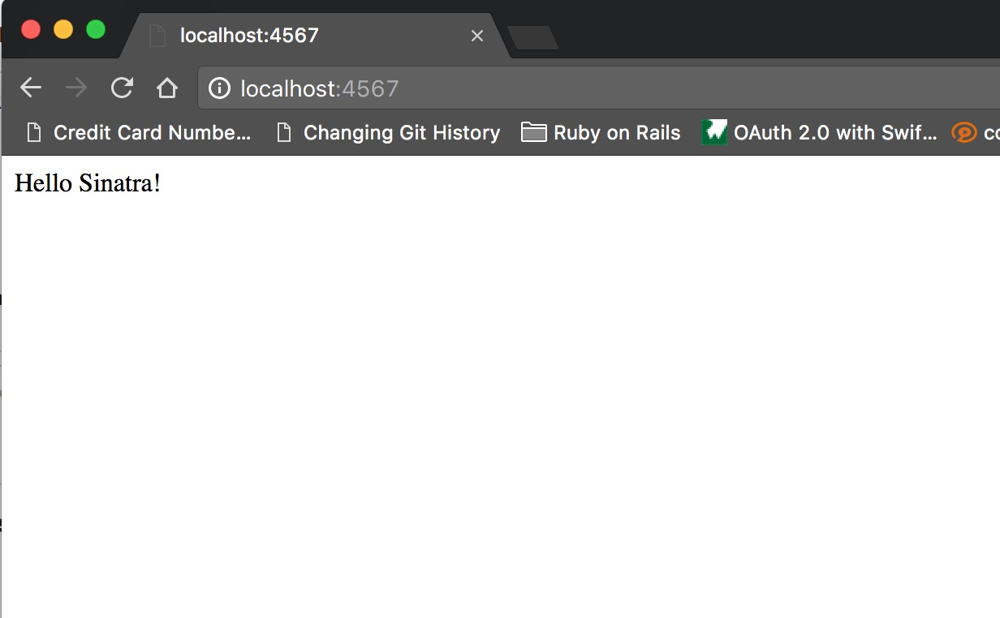
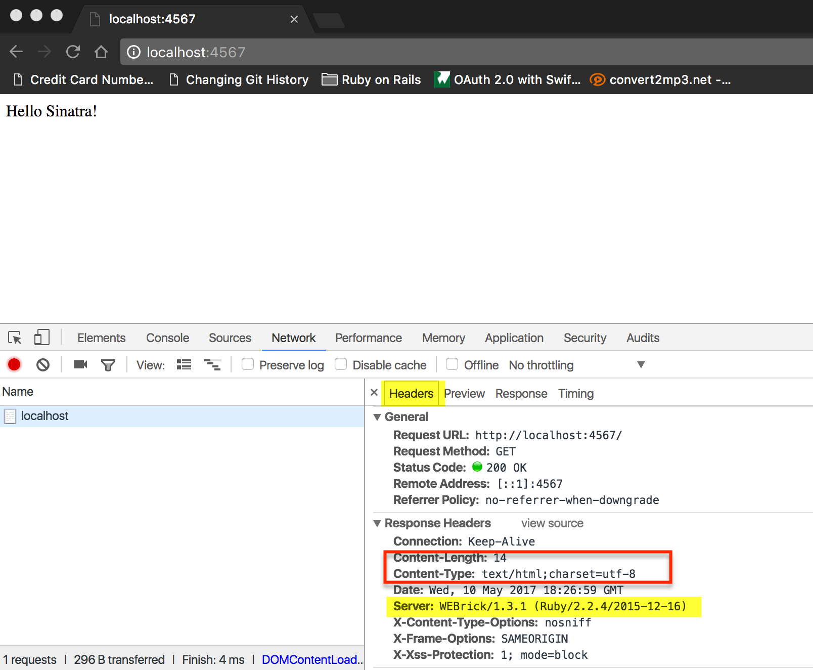
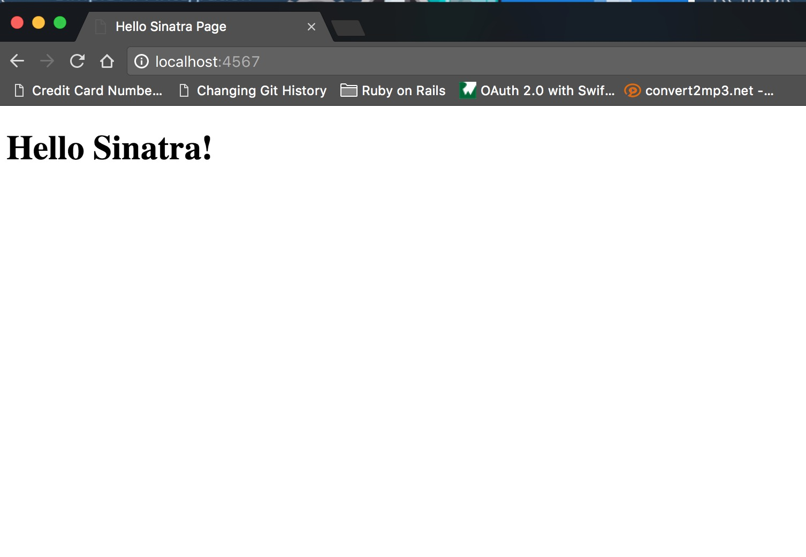
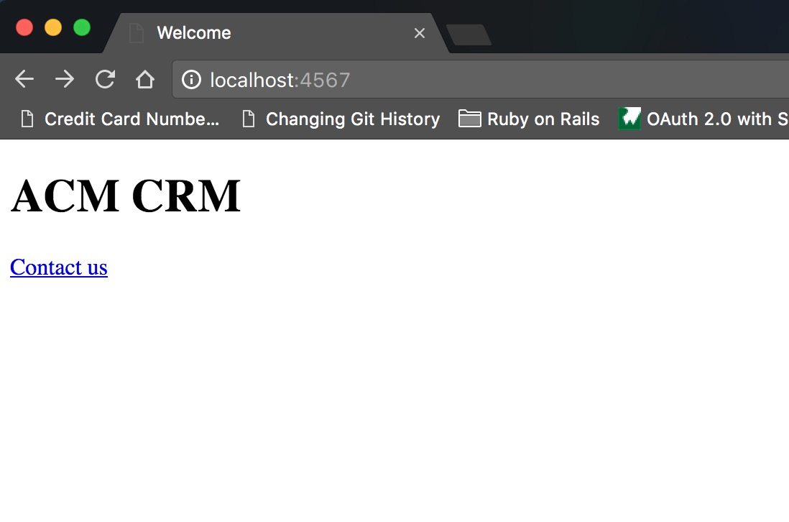
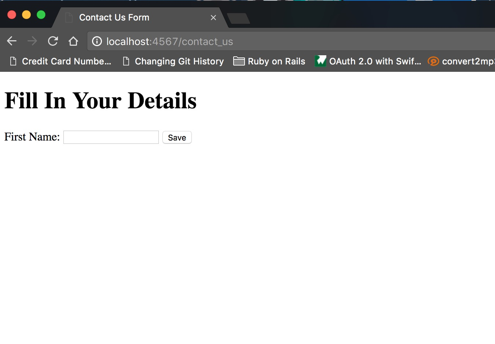
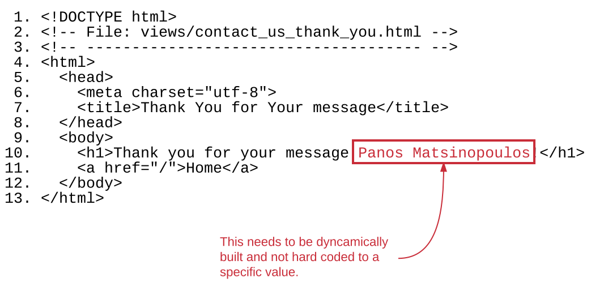
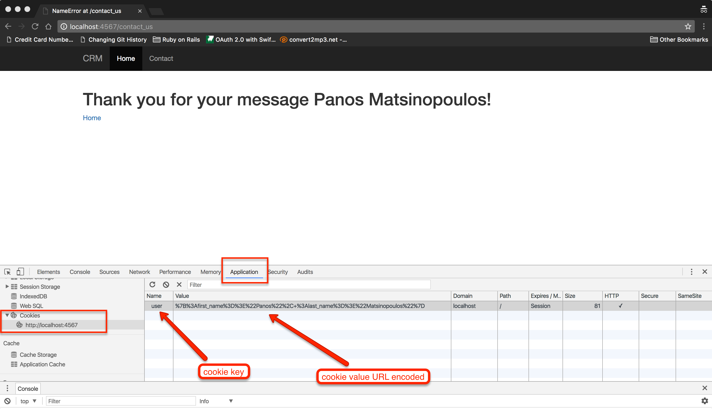
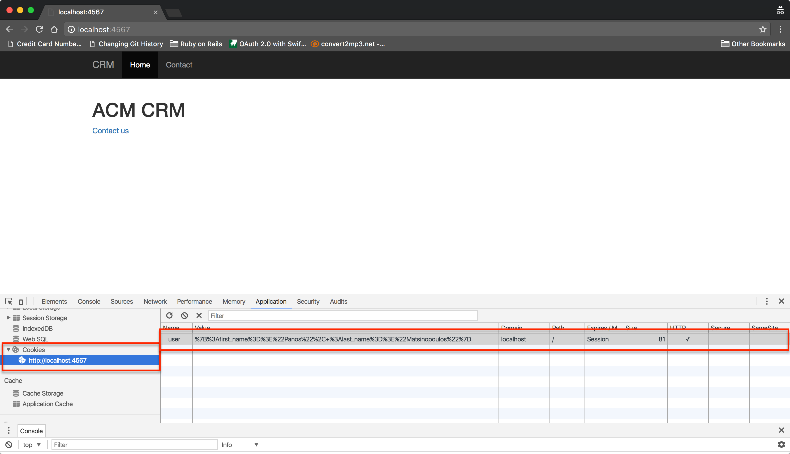

[Sinatra](http://www.sinatrarb.com/) is a Ruby Web framework. A Ruby Web framework is composed of a set of Ruby libraries. It has solved many problems for
you. So, you need less things to worry about the technology to build a Web application.
 
Sinatra is based on [Rack](http://rack.github.io/), which is a Ruby Web Interface. When a Web framework like Sinatra implements the Rack interface, then
this framework can be deployed into Web servers that support Ruby via Rack.

In other words.

1. We have the Web Server. E.g. Apache.
2. We have a module in Web Server that makes it capable of hosting a Rack compatible application.
3. We have Sinatra being Rack compatible and with hooks for you to build your Web application.

All this makes it what we actually call a deployed Web application.

## Rack

Let's talk about Rack. Rack will allow to quickly build a Web application, i.e. an application that accepts HTTP requests and responds with HTTP responses.

### Rack Hello World Project

Create the project `hello_rack` in your RubyMine environment. Add the files to support `rvm` (try using Ruby 2.x and gemset `hello_rack`). Also, create the 
`Gemfile` with the following content:

``` ruby
1. # File: Gemfile
2. #
3. source 'https://rubygems.org'
4. 
5. gem 'rack'
```

Make sure that you have `bundler` installed (`gem install bundle --no-ri --no-rdoc`) and then run `bundle` to install the `Gemfile` specified gems.

The Gemfile specifies the gem `rack` to be installed. This brings in all the functionality necessary to start with a Web application based on `rack`.

``` bash
hello_rack > $ bundle
Fetching gem metadata from https://rubygems.org/..............
Fetching version metadata from https://rubygems.org/.
Resolving dependencies...
Installing rack 2.0.2
Using bundler 1.14.6
Bundle complete! 1 Gemfile dependency, 2 gems now installed.
Use `bundle show [gemname]` to see where a bundled gem is installed.
hello_rack > $
```

Now create the file `main.rb`. This is going to be our starting script for our Web application:

``` ruby
 1. # File: main.rb
 2. #
 3. require 'rack'
 4. 
 5. html_content =<<-HTML
 6. <!DOCTYPE html>
 7. <html>
 8.   <head>
 9.     <meta charset="utf-8">
10.     <title>Hello Rack Page</title>
11. 
12.   </head>
13.   <body>
14.     <h1>./images/Hello Rack!</h1>
15.   </body>
16. </html>
17. HTML
18. 
19. app = Proc.new do |environment|
20.   ['200', {'Content-Type' => 'text/html'}, [html_content]]
21. end
22. 
23. Rack::Handler::WEBrick.run app
```

Before we explain what is going on here, let's just see this in action. Start your Web application like this:

``` bash
hello_rack > $ bundle exec ruby main.rb
[2017-05-10 18:55:02] INFO  WEBrick 1.3.1
[2017-05-10 18:55:02] INFO  ruby 2.2.4 (2015-12-16) [x86_64-darwin14]
[2017-05-10 18:55:02] INFO  WEBrick::HTTPServer#start: pid=22774 port=8080

```

You will see something like the above. This is the explanation of what you see:

1. The above command starts your Web application.
1. It internally uses a Web server tool which is called `WEBrick`. `WEBrick` is a primitive Web server that you can host your Rack application.
It is not used in production deployments. But it is very useful for development purposes. At least at this level. Later on we will learn
how we can use other Web servers.
1. The most important line of output is the last one, which says that an HTTP Server has started listening on port `8080`. The process of the
HTTP Server is the process with process id `22774` (this number will be different in your case). 
1. As you can see, the terminal does not return back to you. This terminal is now occupied by the Web server who is waiting for
HTTP requests to arrive.

Now, let's open our Web browser and visit the page `http://localhost:8080`. This is what we will see:


Fantastic! This is our first Web application without having to deal with sockets and HTTP message formatting!

## What Is a Rack Application
 
A Rack application is a Ruby object that

1. responds to the `#call` instance method
2. Its `#call` method takes exactly one argument. Usually conventionally called `environment` or `env`. It is a `Hash` instance
that is populated with environment specific keys and HTTP request/response related keys. See later on about it.
3. Its `#call` method should return an array of 3 elements.
    1. The first element should be a string corresponding to a valid HTTP Status Response Code. 
    1. The second element is a Hash of response headers. This is optional.
    1. The third element, which is optional too, is the response body.

In our `main.rb` Ruby application, we have a Rack application stored in the variable `app`.

The line 19 is the point at which the `app` is instantiated. It is instantiated with the help of the `Proc.new` call which
creates instances that respond to `#call`. The `#call` implementation is going to be what the block given to `Proc.new` defines.

> *Information:* This is another example of the `Proc.new` usage. Start `irb` and issue the following commands:
>
> ``` ruby
> 2.2.4 :001 > a = Proc.new do |foo, bar|
> 2.2.4 :002 >     "#{foo.upcase}/#{bar.upcase}"
> 2.2.4 :003?>   end
>  => #<Proc:0x007fc7cd219980@(irb):1> 
> 2.2.4 :004 > a.call('John', 'Woo')
>  => "JOHN/WOO" 
> 2.2.4 :005 >
> ```
> As you can see from above, we can invoke the `#call` on the instance returned by `Proc.new`, giving run-time arguments
> as per the typical arguments defined in the block given to `Proc.new`.

Hence, lines 19 till 21 define a Rack application compatible instance. 
 
Then on line 23, we ask a `WEBrick` HTTPServer to load this application and serve corresponding requests.

By default, the HTTP server starts listening for connections on port `8080`.

> *Hint*: This Ruby command will start the HTTP server on port `8090`: 
> ``` ruby
> Rack::Handler::WEBrick.run app, Port: 8089
> ```

## The `environment` Hash

This is an example of the `environment` value that is given to the `#call` invocation:

``` ruby
{"GATEWAY_INTERFACE"=>"CGI/1.1", 
 "PATH_INFO"=>"/", 
 "QUERY_STRING"=>"", 
 "REMOTE_ADDR"=>"::1", 
 "REMOTE_HOST"=>"localhost", 
 "REQUEST_METHOD"=>"GET", 
 "REQUEST_URI"=>"http://localhost:8080/", 
 "SCRIPT_NAME"=>"", 
 "SERVER_NAME"=>"localhost", 
 "SERVER_PORT"=>"8080", 
 "SERVER_PROTOCOL"=>"HTTP/1.1", 
 "SERVER_SOFTWARE"=>"WEBrick/1.3.1 (Ruby/2.2.4/2015-12-16)", 
 "HTTP_HOST"=>"localhost:8080", 
 "HTTP_CONNECTION"=>"keep-alive", 
 "HTTP_CACHE_CONTROL"=>"max-age=0", 
 "HTTP_UPGRADE_INSECURE_REQUESTS"=>"1", 
 "HTTP_USER_AGENT"=>"Mozilla/5.0 (Macintosh; Intel Mac OS X 10_11_6) AppleWebKit/537.36 (KHTML, like Gecko) Chrome/58.0.3029.96 Safari/537.36", 
 "HTTP_ACCEPT"=>"text/html,application/xhtml+xml,application/xml;q=0.9,image/webp,*/*;q=0.8", 
 "HTTP_ACCEPT_ENCODING"=>"gzip, deflate, sdch, br", 
 "HTTP_ACCEPT_LANGUAGE"=>"en-GB,en-US;q=0.8,en;q=0.6,el;q=0.4", 
 "rack.version"=>[1, 3], 
 "rack.input"=>#<StringIO:0x007fedcca71f68>, 
 "rack.errors"=>#<IO:<STDERR>>, 
 "rack.multithread"=>true, 
 "rack.multiprocess"=>false, 
 "rack.run_once"=>false, 
 "rack.url_scheme"=>"http", 
 "rack.hijack?"=>true, 
 "rack.hijack"=>#<Proc:0x007fedcca71e28@/...rack/handler/webrick.rb:74 (lambda)>, 
 "rack.hijack_io"=>nil, 
 "HTTP_VERSION"=>"HTTP/1.1", 
 "REQUEST_PATH"=>"/"}
```

As you can read from the above list, Rack makes sure we have everything that we need to handle the HTTP request accordingly. 

These are some of the most important keys here:

1. `REQUEST_METHOD`. This is the HTTP verb. In our example it is `GET`. 
1. `QUERY_STRING`. This has the query params portion of the URL. For example, if the call was to `http://localhost:8080?foo=bar`, then this would have been `foo=bar`.
1. `HTTP_HOST`. This is important because it tells us which Web site the user is requesting.
1. `REQUEST_PATH`. This is the part of the URL that corresponds to the path. For example, if the call was to `http://localhost:8089/path/to/resource?foo=bar`, then
this would have been `/path/to/resource`.

## Using `rackup` tool

Instead of using a Ruby script like `main.rb`, that uses a `Rack::Handler` to start a Rack application, you can instead follow another technique:

Create the file `config.ru` with the following content (Note that this is a Ruby file with extension `.ru` instead of `.rb`):

``` ruby
 1. # File: config.ru
 2. #
 3. html_content =<<-HTML
 4. <!DOCTYPE html>
 5. <html>
 6.   <head>
 7.     <meta charset="utf-8">
 8.     <title>Hello Rack Page</title>
 9. 
10.   </head>
11.   <body>
12.     <h1>./images/Hello Rack!</h1>
13.   </body>
14. </html>
15. HTML
16. 
17. app = Proc.new do |environment|
18.   ['200', {'Content-Type' => 'text/html'}, [html_content]]
19. end
20. 
21. run app
```

This is exactly the same file like the `main.rb` but it does not require `rack` and calls `run app` instead of `Rack::Handler::WEBrick.run app`.

Now in order to start your Web application, you need to invoke the `rackup` tool as follows:

``` bash
hello_rack > $ bundle exec rackup
[2017-05-10 19:48:00] INFO  WEBrick 1.3.1
[2017-05-10 19:48:00] INFO  ruby 2.2.4 (2015-12-16) [x86_64-darwin14]
[2017-05-10 19:48:00] INFO  WEBrick::HTTPServer#start: pid=23647 port=9292

```

and you will see the HTTP Server starting at the default port `9292` instead.

If you want to start your server using another port you can invoke it like this:

``` bash
hello_rack > $ bundle exec rackup --port 8080
[2017-05-10 19:49:22] INFO  WEBrick 1.3.1
[2017-05-10 19:49:22] INFO  ruby 2.2.4 (2015-12-16) [x86_64-darwin14]
[2017-05-10 19:49:22] INFO  WEBrick::HTTPServer#start: pid=23676 port=8080

```

... giving the `--port 8080` as an example to start on port `8080`.


## Sinatra and Rack

As we said earlier, Sinatra is a Web framework that builds on top of Rack. Let's now switch to Sinatra.

## Hello Sinatra

Let's create a new RubyMine project with name `hello_sinatra`. Make sure you integrate with `rvm` (ruby version 2.X, gemset `hello_sinatra`) and
that you install `bundler` (`gem install bundler --no-ri --no-rdoc`).

Then create the file `Gemfile` with the following contents:

``` ruby
1. # File: Gemfile
2. #
3. source 'https://rubygems.org'
4.
5. gem 'sinatra'
```

Having specified in the `Gemfile` that you want to use the `sinatra` gem, run `bundle`:

``` bash
hello_sinatra > $ bundle
Fetching gem metadata from https://rubygems.org/..........
Fetching version metadata from https://rubygems.org/.
Resolving dependencies...
Installing mustermann 1.0.0
Installing rack 2.0.2
Installing tilt 2.0.7
Using bundler 1.14.6
Installing rack-protection 2.0.0
Installing sinatra 2.0.0
Bundle complete! 1 Gemfile dependency, 6 gems now installed.
Use `bundle show [gemname]` to see where a bundled gem is installed.
hello_sinatra > $
```

Now that Sinatra gem is installed, let's write our `main.rb` program:

``` ruby
1. # File: main.rb
2. #
3. require 'sinatra'
4. 
5. get '/' do
6.   './images/Hello Sinatra!'
7. end
```

With the `main.rb` file ready, lets start our Web application:

``` bash
hello_sinatra > $ bundle exec ruby main.rb
[2017-05-10 21:17:27] INFO  WEBrick 1.3.1
[2017-05-10 21:17:27] INFO  ruby 2.2.4 (2015-12-16) [x86_64-darwin14]
== Sinatra (v2.0.0) has taken the stage on 4567 for development with backup from WEBrick
[2017-05-10 21:17:27] INFO  WEBrick::HTTPServer#start: pid=24478 port=4567

```

Perfect! You can now see, that an HTTP Server is running on port `4567`. Let's open our Web browser and visit the page `http://localhost:4567`:



Pretty cool! Isn't it?

## What's Inside Our `main.rb`

The Web application that we have developed above is quite simple and straightforward.

1. On line 5 we tell it hat it has to respond to HTTP verb `GET` for the root `/` path of our application. 
2. In the block given to `get '/'` call we tell what we have to return. Currently, returning a simple text string.

If you inspect the HTTP request using the Google Developer Tools Network tab, you will see something like this:



You can see that the `Content-Length` is 14, equal to the `./images/Hello Sinatra!` string. The response code was `200`. Also, the `Content-Type` specified for the response is `text/html`
although it is not a proper HTML document.

Let's try some real HTML response like we did with the Rack application. Update the `main.rb` to be like this:

``` ruby
 1. # File: main.rb
 2. #
 3. require 'sinatra'
 4. 
 5. html_content =<<-HTML
 6. <!DOCTYPE html>
 7. <html>
 8.   <head>
 9.     <meta charset="utf-8">
10.     <title>Hello Sinatra Page</title>
11. 
12.   </head>
13.   <body>
14.     <h1>./images/Hello Sinatra!</h1>
15.   </body>
16. </html>
17. HTML
18. 
19. get '/' do
20.   html_content
21. end
```

If you save this, restart your HTTP Server (press <kbd>Ctrl + C</kbd> to stop it and then issue `bundle exec ruby main.rb` again), and then
reload the page on your browser, you will see this:



## Routes

The combination of an HTTP verb and a URL path constitutes a route for your Sinatra application. When a request is coming in, 
Sinatra matches the verb and the path of the request against one route defined in your code. It scans the routes from top to
bottom and the first that matches takes responsibility to handle the request. 

Let's write a new Sinatra application, called `crm`. Create the RubyMine project and add the `Gemfile` to bring `sinatra` in.

Then write the `main.rb` as follows:

``` ruby
 1. # File: main.rb
 2. #
 3. require 'sinatra'
 4. 
 5. def welcome
 6.   File.read('views/welcome.html')
 7. end
 8. 
 9. def contact_us
10.   File.read('views/contact_us.html')
11. end
12. 
13. get '/' do
14.   welcome
15. end
16. 
17. get '/contact_us' do
18.   contact_us
19. end
```

This application defines two routes:

1. `/` for `GET` verb.
2. `/contact_us` for 'GET' verb.

Both route handlers read the HTML content to return from a corresponding HTML file. These files are inside the sub-folder with name `views`.

So, let's create the sub-folder `views`:

``` bash
crm > $ mkdir views
crm > $
```

And then create the files `contact_us.html` and `welcome.html` inside this folder as follows:

``` html
 1. <!DOCTYPE html>
 2. <!-- File: views/contact_us.html -->
 3. <!--                             -->
 4. <html>
 5.   <head>
 6.     <meta charset="utf-8">
 7.     <title>Contact Us Form</title>
 8.   </head>
 9.   <body>
10.     <h1>Fill In Your Details</h1>
11.     <form>
12.       <label for="first_name">First Name:</label>
13.       <input type="text" name="first_name" id="first_name"/>
14.       <button type="submit">Save</button>
15.     </form>
16.   </body>
17. </html>
```

and 

``` html
 1. <!DOCTYPE html>
 2. <!-- File: views/welcome.html -->
 3. <!--                          -->
 4. <html>
 5.   <head>
 6.     <meta charset="utf-8">
 7.     <title>Welcome</title>
 8. 
 9.   </head>
10.   <body>
11.     <h1>ACM CRM</h1>
12.     <a href="/contact_us">Contact us</a>
13.   </body>
14. </html>
```

Now everything is ready to start your Web application:

``` bash
crm > $ bundle exec ruby main.rb
[2017-05-10 22:33:34] INFO  WEBrick 1.3.1
[2017-05-10 22:33:34] INFO  ruby 2.2.4 (2015-12-16) [x86_64-darwin14]
== Sinatra (v2.0.0) has taken the stage on 4567 for development with backup from WEBrick
[2017-05-10 22:33:34] INFO  WEBrick::HTTPServer#start: pid=25762 port=4567

```

Now visit the page `http://localhost:4567`. You will see this:



And if you click on the link `Contact Us`, you will see this:



Cool! We have just created two endpoints in our Sinatra application. Wasn't that easy?

1. The first endpoint, `GET '/'`, is displaying a welcome page. With a link to visit the other endpoint.
2. The second endpoint, `GET '/contact_us'`, is displaying a form for the user to submit their details.

## Try a `POST` Endpoint

Let's enhance our application to include the endpoint `POST '/contact_us'`. This will be handled by a route handler
that would take the data posted by the user using the form.

This is the new version of our `main.rb` file:

``` ruby
 1. # File: main.rb
 2. #
 3. require 'sinatra'
 4. 
 5. def welcome
 6.   File.read('views/welcome.html')
 7. end
 8. 
 9. def contact_us
10.   File.read('views/contact_us.html')
11. end
12. 
13. def process_contact_us_form
14.   first_name = params['first_name']
15.   last_name = params['last_name']
16.   message = params['message']
17.   File.open('messages.txt', 'a') do |file|
18.     file.write("New message from #{first_name} #{last_name}. Message is: #{message}\n")
19.   end
20.   redirect '/'
21. end
22. 
23. get '/' do
24.   welcome
25. end
26. 
27. get '/contact_us' do
28.   contact_us
29. end
30. 
31. post '/contact_us' do
32.   process_contact_us_form
33. end
```

As you can see above, we have added the `post '/contact_us'` route handler. This is implemented with the help of the
method `process_contact_us_form`. Before we see the implementation of this method, let's see the new version of the 
`views/contact_us.html` that has all the fields and details for the form to be properly submitted to the server.

``` html
 1. <!DOCTYPE html>
 2. <!-- File: views/contact_us.html -->
 3. <!--                             -->
 4. <html>
 5.   <head>
 6.     <meta charset="utf-8">
 7.     <title>Contact Us Form</title>
 8.   </head>
 9.   <body>
10.     <h1>Fill In Your Details And Your Message To Us</h1>
11.     <small>Or <a href="/">Go Back</a></small>
12.     <br/>
13.     <br/>
14. 
15.     <form action="/contact_us" method="post">
16.       <label for="first_name">First Name:</label>
17.       <input type="text" name="first_name" id="first_name"/>
18.       <br/>
19. 
20.       <label for="last_name">Last Name:</label>
21.       <input type="text" name="last_name" id="last_name"/>
22.       <br/>
23. 
24.       <label for="message">Message:</label>
25.       <textarea name="message" id="message"></textarea>
26.       <br/>
27. 
28.       <button type="submit">Save</button>
29.     </form>
30.   </body>
31. </html>
```

Besides the fact that we have added two more fields, the `last_name` and the `message`, the most important detail here is
`action` and `method` attributes of the `form` tag. The `action` specifies at which endpoint the data will be submitted.
And the `method` specifies the verb that will be used for the submission. In our case, the `action` has the value `/contact_us`
and the `method` has the value `post`. And this is how we bind the submission of this form to the end point `POST /contact_us`
and the route handler `post '/contact_us'` in our code.

With regards to the implementation of the route handler, the method `process_contact_us_form` is as follows:

``` ruby
11. ...
12. 
13. def process_contact_us_form
14.   first_name = params['first_name']
15.   last_name = params['last_name']
16.   message = params['message']
17.   File.open('messages.txt', 'a') do |file|
18.     file.write("New message from #{first_name} #{last_name}. Message is: #{message}")
19.   end
20.   redirect '/'
21. end
22. 
23. ...
24. ...
```

There is a method called `params` that returns a `Hash` and contains the keys and values of the parameters submitted by the form.
For example, `params['first_name']` has the `first_name` submitted. This is offered by Sinatra for free. 

On lines 17 till 19 we just save the details of the message submitted into a text file.

Another important piece of information here is the `redirect '/'`. This sends back to the browser a `302` response and tells
browser where it should take user to. In other words, the browser will issue a `GET` request to the endpoint `/`. Our implementation
displays the `welcome.html` page for the `GET '/'` requests.

Restart your server and revisit the `http://localhost:4567` and try to submit a message. Look what is happening. The following video
demonstrates our current implementation.

<div id="media-container-video-Sinatra App - Contact Us Form In Action">
  <a href="https://player.vimeo.com/video/216958825"></a>
</div>

## Reloading Of Changed Files While On Development

You might have noticed, until now, that whenever you did a change in your app code, you had to restart your server in order for it
to reload your pages and take into account your changes. This is really annoying while doing development.

There is a way you can tell Sinatra to reload the files on every request so that it takes into account any changes that might have
been implemented in between.

First, we need to use the gem `sinatra-contrib`. Amend your Gemfile:

``` ruby
1. # File: Gemfile
2. #
3. source 'https://rubygems.org'
4. 
5. gem 'sinatra'
6. gem 'sinatra-contrib'
```

and do `bundle`. You will see the `sinatra-contrib` gem to be installed (alongside its dependencies).

Then, what you only have to do is to require the file `sinatra/reloader`. So, let's change the first lines of our `crm/main.rb` file:

``` ruby
1. # File: main.rb
2. #
3. require 'sinatra'
4. require 'sinatra/reloader' if development?
5.
6. def welcome
7. ...
```

You can see the line 4 that requires the file `sinatra/reloader`. Note also the `if development?` statement. Sinatra distinguishes 
the environment it is running on and you can have access to this information using the `development?` or `production?` methods. 
The default environment is `development`. But when we push our application to a production server we will make sure that the environment
that Sinatra application is bound to is the `production` environment. In that case, the `if development?` will return `false` and hence
the `require 'sinatra/reloader'` will not be executed. This is the required behaviour for production environments. We do not want the
files to be reloaded on every request.

Now that you have done that, you can restart your server to take into account the Sinatra reloader. Then on every change in your files,
you do not have to restart your server in order to continue your development with the changes in. The changes will be picked up automatically
on every request to the server.

## Setting the Environment

As we said earlier, you can set the environment to different values, with the default environment being `development` and the method `development?`
returning `true`. 

The Sinatra application takes its environment from the `RACK_ENV` environment variable. Let's change our `crm/main.rb` as follows:

``` ruby
1. # File: main.rb
2. #
3. require 'sinatra'
4. 
5. puts "RACK_ENV = #{ENV['RACK_ENV']}"
6. puts "development? = #{development?}"
7. puts "production? = #{production?}"
8. 
9. require 'sinatra/reloader' if development?
...
```

We have changed the first lines of our `crm/main.rb` file. We print the value of the environment variable `RACK_ENV`. If you restart your server
like below, you will see that `RACK_ENV` is not set and the `development?` returns `true`, whereas the `production?` returns `false`.

``` bash
crm > $ bundle exec ruby main.rb
RACK_ENV = 
development? = true
production? = false
[2017-05-11 08:54:34] INFO  WEBrick 1.3.1
[2017-05-11 08:54:34] INFO  ruby 2.2.4 (2015-12-16) [x86_64-darwin14]
== Sinatra (v2.0.0) has taken the stage on 4567 for development with backup from WEBrick
[2017-05-11 08:54:34] INFO  WEBrick::HTTPServer#start: pid=28674 port=4567

```

Now, stop your server and restart it with the command `RACK_ENV=production bundle exec ruby main.rb`. You will see this:

``` bash
crm > $ RACK_ENV=production bundle exec ruby main.rb
RACK_ENV = production
development? = false
production? = true
[2017-05-11 08:55:36] INFO  WEBrick 1.3.1
[2017-05-11 08:55:36] INFO  ruby 2.2.4 (2015-12-16) [x86_64-darwin14]
== Sinatra (v2.0.0) has taken the stage on 4567 for production with backup from WEBrick
[2017-05-11 08:55:36] INFO  WEBrick::HTTPServer#start: pid=28695 port=4567

```

You can see that when we have set the `RACK_ENV` to the specific value of `production`, then the corresponding environment check
method, `production?`, returns `true`. Whereas `development?` returns `false`.

This is how we set the environment that our Sinatra application will live in. And with branching statements (like `if development?`)
we might change its behaviour according to the environment.
 
> Stop your server and start it again without specifying the `RACK_ENV`, so that it starts in `development` environment.

## Views and Templates

In our crm example application, the views files that reside inside the `views` folder, they are simple `html` files. Although this is
enough for static HTML content, it is not enough for our Web application that might need to generate content dynamically. Content that
depends on the value of various data variables. For example, let's suppose that we want to redirect to a *Thank You* page after the
user submits their message, and on that *Thank You* page we want to address the user with their details, first name and last name.
In that case, we need a page like this:

``` html
 1. <!DOCTYPE html>
 2. <!-- File: views/contact_us_thank_you.html -->
 3. <!-- ------------------------------------- -->
 4. <html>
 5.   <head>
 6.     <meta charset="utf-8">
 7.     <title>Thank You for Your message</title>
 8.   </head>
 9.   <body>
10.     <h1>Thank you for your message Panos Matsinopoulos!</h1>
11.     <a href="/">Home</a>
12.   </body>
13. </html>
```

But with the first_name/last_name part of it being dynamically generated.



In order to achieve this, we need to use templates and a template language. Templates are like HTML files but they have dynamic
parts inside. The language we use to write the dynamic parts is the template language. There are many template languages out there
and Sinatra supports plenty of them. We are going to use ERB, Embedded Ruby which comes with Ruby as part of the standard Ruby library.
Sinatra supports ERB with the call to method `erb` from within the route handlers.

But before we call this method, the `erb`, let's write the above HTML page as an ERB template.

Create the file `views/contact_us_thank_you.erb` (watch out for the `.erb` suffix) with the following content:

``` erb
 1. <!DOCTYPE html>
 2. <!-- File: views/contact_us_thank_you.erb -->
 3. <!-- ------------------------------------ -->
 4. <html>
 5.   <head>
 6.     <meta charset="utf-8">
 7.     <title>Thank You for Your message</title>
 8.   </head>
 9.   <body>
10.     <h1>Thank you for your message <%= "#{@first_name} #{@last_name}" %>!</h1>
11.     <a href="/">Home</a>
12.   </body>
13. </html>
```

The `.erb` files are HTML files that can contain embedded Ruby code. The Ruby code is embedded within blocks that start with the `<%` and
end with the `%>`. On line 10 above we see one Ruby embedded code block. It references the instance variables `@first_name` and `@last_name`. 
The `=` that follows the opening `<%` tells ERB rendering engine to embed the output of the right-hand side into the HTML content. 
Hence, the ERB rendering engine will take the value of the Ruby expression `"#{@first_name} #{@last_name}"` and will
embedded it into the HTML content. 

Now, the point is that we have to change our `crm/main.rb` file to take advantage of this new view. Let's do that:

``` ruby
 1. # File: main.rb
 2. #
 3. require 'sinatra'
 4. 
 5. puts "RACK_ENV = #{ENV['RACK_ENV']}"
 6. puts "development? = #{development?}"
 7. puts "production? = #{production?}"
 8. 
 9. require 'sinatra/reloader' if development?
10. 
11. def welcome
12.   File.read('views/welcome.html')
13. end
14. 
15. def contact_us
16.   File.read('views/contact_us.html')
17. end
18. 
19. def process_contact_us_form
20.   @first_name = params['first_name']
21.   @last_name = params['last_name']
22.   message = params['message']
23.   File.open('messages.txt', 'a') do |file|
24.     file.write("New message from #{@first_name} #{@last_name}. Message is: #{message}\n")
25.   end
26.   erb :contact_us_thank_you
27. end
28. 
29. get '/' do
30.   welcome
31. end
32. 
33. get '/contact_us' do
34.   contact_us
35. end
36. 
37. post '/contact_us' do
38.   process_contact_us_form
39. end
```

The only changes are for the method `process_contact_us_form`:

``` ruby
18. ...
19. def process_contact_us_form
20.   @first_name = params['first_name']
21.   @last_name = params['last_name']
22.   message = params['message']
23.   File.open('messages.txt', 'a') do |file|
24.     file.write("New message from #{@first_name} #{@last_name}. Message is: #{message}\n")
25.   end
26.   erb :contact_us_thank_you
27. end
28. ...
```

On line 20 and 21 we assign the first name and last name to the corresponding *instance* variables, `@first_name` and `@last_name`.
Assigning to instance variables and not just local variables, makes these variable being available at the view template level. That's why
we can later use code like `"#{@first_name} #{@last_name}"` in the view template.

Then on line 24 we use the instance variables instead of the local variables. And finally ...

The other big change is the invocation of the method `erb` which basically tells Sinatra to take parse as an ERB template the
file with name `contact_us_thank_you.erb` inside the `views` folder. Again, when we invoke `erb` with a symbol as argument, e.g. `erb :foo`,
we instruct Sinatra to render the file `views/foo.erb` using the ERB template engine.

The following video shows how the *Thank You* page is displayed with the name of the person that submitted the message dynamically rendered.

<div id="media-container-video-Sinatra App - Thank You Page With Dynamic Content">
  <a href="https://player.vimeo.com/video/216967133"></a>
</div>

## ERB File Does not Have To Contain ERB Code

Now that we have learned about the ERB files, let me just tell you that you don't have to have ERB code in order to use ERB templates.
 
Our crm application now has two more files, the `views/contact_us.html` and the `views/welcome.html` that we can turn to ERB templates and then
simplify the `crm/main.rb` code that requests their rendering.

Hence, rename the files `views/contact_us.html` and `views/welcome.html` to `views/contact_us.erb` and `views/welcome.erb` respectively. Then,
simplify the implementation of the `get '/'` and `get '/contact_us'` endpoints by just calling `erb` with the correct symbols: 

``` ruby
1. # File: main.rb
2. #
3. require 'sinatra'
4. 
5. puts "RACK_ENV = #{ENV['RACK_ENV']}"
6. puts "development? = #{development?}"
7. puts "production? = #{production?}"
8. 
9. require 'sinatra/reloader' if development?
10. 
11. def process_contact_us_form
12.   @first_name = params['first_name']
13.   @last_name = params['last_name']
14.   message = params['message']
15.   File.open('messages.txt', 'a') do |file|
16.     file.write("New message from #{@first_name} #{@last_name}. Message is: #{message}\n")
17.   end
18.   erb :contact_us_thank_you
19. end
20. 
21. get '/' do
22.   erb :welcome
23. end
24. 
25. get '/contact_us' do
26.   erb :contact_us
27. end
28. 
29. post '/contact_us' do
30.   process_contact_us_form
31. end
```

Look at lines 22 and 26. We are calling `erb` with the view template symbol that we want to render. And we got rid off of the methods
`welcome` and `contact_us`, cause we didn't need them any more.

Try your application again on your browser and you will see that it works without any problem, like before.

## Layouts

Currently, we have 3 view templates. And they both have some code that it is repeated in all templates. For example the head part.
How can we have common pieces of all the view templates reside in one file and being reused? This is the idea of the *layout*.

A Sinatra application uses a default layout template and *yields* the view templates within it. The default layout is the file
`views/layout.erb`. 

So, let's create the following file, the `views/layout.erb`:

``` html
1. <!DOCTYPE html>
2. <html lang="en">
3.   <head>
4.     <meta charset="utf-8">
5.     <meta http-equiv="X-UA-Compatible" content="IE=edge">
6.     <meta name="viewport" content="width=device-width, initial-scale=1">
7.     <!-- The above 3 meta tags *must* come first in the head; any other head content must come *after* these tags -->
8.     <meta name="description" content="">
9.     <meta name="author" content="">
10.     <link rel="icon" href="../../favicon.ico">
11. 
12.     <title><%= @page %></title>
13. 
14.     <!-- Latest compiled and minified CSS -->
15.     <link rel="stylesheet" href="https://maxcdn.bootstrapcdn.com/bootstrap/3.3.7/css/bootstrap.min.css" integrity="sha384-BVYiiSIFeK1dGmJRAkycuHAHRg32OmUcww7on3RYdg4Va+PmSTsz/K68vbdEjh4u" crossorigin="anonymous">
16. 
17.     <!-- Custom CSS -->
18.     <link rel="stylesheet" href="assets/stylesheets/main.css">
19. 
20.     <!-- Latest jQuery -->
21.     <script src="https://code.jquery.com/jquery-2.2.4.min.js" integrity="sha256-BbhdlvQf/xTY9gja0Dq3HiwQF8LaCRTXxZKRutelT44=" crossorigin="anonymous"></script>
22. 
23.     <!-- Latest compiled and minified JavaScript -->
24.     <script src="https://maxcdn.bootstrapcdn.com/bootstrap/3.3.7/js/bootstrap.min.js" integrity="sha384-Tc5IQib027qvyjSMfHjOMaLkfuWVxZxUPnCJA7l2mCWNIpG9mGCD8wGNIcPD7Txa" crossorigin="anonymous"></script>
25. 
26.     <!-- HTML5 shim and Respond.js for IE8 support of HTML5 elements and media queries -->
27.     <!--[if lt IE 9]>
28.     <script src="https://oss.maxcdn.com/html5shiv/3.7.3/html5shiv.min.js"></script>
29.     <script src="https://oss.maxcdn.com/respond/1.4.2/respond.min.js"></script>
30.     <![endif]-->
31.   </head>
32. 
33.   <body>
34. 
35.   <nav class="navbar navbar-inverse navbar-fixed-top">
36.     <div class="container">
37.       <div class="navbar-header">
38.         <button type="button" class="navbar-toggle collapsed" data-toggle="collapse" data-target="#navbar" aria-expanded="false" aria-controls="navbar">
39.           <span class="sr-only">Toggle navigation</span>
40.           <span class="icon-bar"></span>
41.           <span class="icon-bar"></span>
42.           <span class="icon-bar"></span>
43.         </button>
44.         <a class="navbar-brand" href="/">CRM</a>
45.       </div>
46.       <div id="navbar" class="collapse navbar-collapse">
47.         <ul class="nav navbar-nav">
48.           <li class="active"><a href="/">Home</a></li>
49.           <li><a href="/contact_us">Contact</a></li>
50.         </ul>
51.       </div><!--/.nav-collapse -->
52.     </div>
53.   </nav>
54. 
55.   <div class="container">
56. 
57.     <%= yield %>
58. 
59.   </div><!-- /.container -->
60. 
61.   </body>
62. </html>
```

The above is the layout and it has a `<%= yield %>` command on line 57. This is where the view template files are going to be embedded. Having said
that, we need to change the view template files now, in order to include only the necessary HTML snippet that would live inside the layout template,
and not having a whole HTML page.

Here is the new version of the `views/welcome.erb`:

``` html
1. <!-- File: views/welcome.html -->
2. <!--                          -->
3. <h1>ACM CRM</h1>
4. <a href="/contact_us">Contact us</a>
```

This is a very simple file. Its content is going to appear where the `<%= yield %>` statement inside the `views/layout` appears.

Similar content we now see for the other view templates. The `views/contact_us.erb`:

``` html
 1. <!-- File: views/contact_us.html -->
 2. <!--                             -->
 3. <h1>Fill In Your Details And Your Message To Us</h1>
 4. <small>Or <a href="/">Go Back</a></small>
 5. <br/>
 6. <br/>
 7. 
 8. <form action="/contact_us" method="post">
 9.   <div class="form-group">
10.     <label for="first_name">First Name:</label>
11.     <input type="text" name="first_name" id="first_name" class="form-control" placeholder="Give your first name"/>
12.   </div>
13. 
14.   <div class="form-group">
15.     <label for="last_name">Last Name:</label>
16.     <input type="text" name="last_name" id="last_name" class="form-control" placeholder="Give your last name"/>
17.   </div>
18. 
19.   <div class="form-group">
20.     <label for="message">Message:</label>
21.     <textarea name="message" id="message" class="form-control" placeholder="Place your message here"></textarea>
22.   </div>
23. 
24.   <button type="submit" class="btn btn-default">Save</button>
25. </form>
```

And the `views/contact_us_thank_you.erb`:

``` html
<!-- File: views/contact_us_thank_you.html.erb -->
<!-- ----------------------------------------- -->
<h1>Thank you for your message <%= @first_name %> <%= @last_name %>!</h1>
<a href="/">Home</a>
```

Before you browse your application again, make sure that you have the file `public/assets/stylesheets/main.css` in your project:

``` css
/* File: crm/public/assets/stylesheets/main.css */

body {
    margin-top: 70px;
}
```

This file is referenced by the `views/layout.erb` and it has a very simple rule so that the content of the page is not obscured by the
navigation bar.

Note that the reference of static files like local CSS files and local JavaScript files from the view templates or layouts is done
using the relative path of the file that needs to be placed inside the `public` folder of the application, excluding the `public` folder itself.
Hence the file `public/assets/stylesheets/main.css` is referenced as `assets/stylesheets/main.css` on line 18 in `views/layout.erb`:

``` html
16. ...
17.    <!-- Custom CSS -->
18.    <link rel="stylesheet" href="assets/stylesheets/main.css">
19. ...
```

Now everything is set up. Let's navigate to our new styled application. Here is a video that demonstrates the navigation:

<div id="media-container-video-Sinatra App - Contact Us Form In Action">
  <a href="https://player.vimeo.com/video/216982984"></a>
</div>

## Cookies

We have learned that HTTP is a stateless protocol. But Web applications need to keep some kind of state in between requests. For example,
a Web application might want to know which user is signed in. A mechanism that Web applications usually use in order to keep
state in between HTTP requests is the mechanism of a *cookie*. The *cookie* is saved at the browser side file system and it is being sent 
back to the server on subsequent requests. Hence, server can read the information stored in the cookie. And this works as a state storage
in between HTTP requests.


As we are trying to depict in the above picture, when the server decides to create a cookie with some information inside, then the browser is
going to be sending this cookie back within subsequent requests. Hence server keeps track of things in between HTTP requests and this works
like a state-keeping mechanism.

### Storing a Cookie

Let's use a cookie with our crm application. We will use a cookie to store the first name and last name of the user sending a message. 

First, let's save the first name and last name in a new cookie. See how the `crm/main.rb` method `process_contact_us_form` is amended to
save the information in a cookie:

``` ruby
11. def process_contact_us_form
12.   @first_name = params['first_name']
13.   @last_name = params['last_name']
14.  message = params['message']
15.  File.open('messages.txt', 'a') do |file|
16.    file.write("New message from #{@first_name} #{@last_name}. Message is: #{message}\n")
17.  end
18.  cookies[:user] = {first_name: @first_name, last_name: @last_name}.to_json
19.  erb :contact_us_thank_you
20. end
```

It is the line 18 that was added. The `cookies` works like a `Hash`. Before leaving the route handler, we set the cookie with key `:user`
and we attach to it the information `{first_name: @first_name, last_name: @last_name}`. Note that we convert the `Hash` value to a string
with a call to `#to_json` method. This is because we need to be able to save strings that can then be deserialized when we will later on
read the cookie value back.

Note that you have to `require 'sinatra/cookies'` at the top of `crm/main.rb` file in order to make sure that `cookies` are available:

``` ruby
 1. # File: main.rb
 2. #
 3. require 'sinatra'
 4. 
 5. puts "RACK_ENV = #{ENV['RACK_ENV']}"
 6. puts "development? = #{development?}"
 7. puts "production? = #{production?}"
 8. 
 9. require 'sinatra/reloader' if development?
10. require 'sinatra/cookies'
...
```

Now, every time the user posts data using the contact us form, a cookie with key `user` is set in the browser and saved on client side.

Let's see that with the help of Google Developer Tools.
 

 
And as we said earlier, the cookie persists when user goes to another page. You can still see that if you go to the home page:



### Retrieving a Cookie

But writing a cookie is the one side of the story. Reading back closes the loop and allows us to use cookies as a state storage.
We can use the `cookies` `Hash` to read the cookies and act accordingly.

See how we amend the `views/welcome.erb` to display a greeting message if there is a user stored in the cookie:

``` html
 1. <!-- File: views/welcome.erb -->
 2. <!--                          -->
 3. <h1>ACM CRM</h1>
 4. <br/>
 5. <a href="/contact_us">Contact us</a>
 6. 
 7. <% require 'json' %>
 8. <% if cookies[:user] %>
 9.     <% details = JSON.parse(cookies[:user]) %>
10.     <h2>Hi! <%= "#{details['first_name']} #{details['last_name']}" %></h2>
11. <% end %>
```
On line 7 we require the `json` library that will allow us to call `JSON.parse`. The `JSON.parse` is called on `cookies[:user]`. We know that this
value stores a JSON string and with the `JSON.parse` we convert it to a `Hash`. Then we use the `Hash` values to display a greeting to the
user.

The following video shows how cookie is updated every time we use the contact us form.

<div id="media-container-video-Sinatra App - Contact Us Form In Action">
  <a href="https://player.vimeo.com/video/217063836"></a>
</div>

## Helpers

Before we move on to another subject, let's just make this piece of code a little bit more clean with the use of *helpers*. Helpers are methods that can
be used inside route handlers and templates and they are define using `helpers` method in the main part of the application.

First, let's clean the `views/welcome.erb` code:

``` html
1. <!-- File: views/welcome.erb -->
2. <!--                         -->
3. <h1>ACM CRM</h1>
4. <br/>
5. <a href="/contact_us">Contact us</a>
6. 
7. <% if user? %>
8.     <h2>Hi! <%= "#{user.first_name} #{user.last_name}" %></h2>
9. <% end %>
```

You can now see lines 7 to 9 which are much cleaner if compared to the previous version. Here we are now calling the methods `user?` and `user`.
The first returns `true` or `false` depending on whether there is a user in cookie or not. The second returns a `User` instance that 
responds to `#first_name` and `#last_name`. 

The `user?` and `user` methods are defined as `helpers` inside the main file:

``` ruby
 1. # File: main.rb
 2. #
 3. require 'sinatra'
 4. 
 5. puts "RACK_ENV = #{ENV['RACK_ENV']}"
 6. puts "development? = #{development?}"
 7. puts "production? = #{production?}"
 8. 
 9. require 'sinatra/reloader' if development?
10. require 'sinatra/cookies'
11. require 'json'
12. require_relative './user'
13. 
14. helpers do
15.   # Returns true if there is a user stored in the cookie
16.   def user?
17.     !cookies[:user].nil?
18.   end
19. 
20.   # Returns an instance of the User class. It's values are populated from the cookie
21.   def user
22.     details = JSON.parse(cookies[:user])
23.     User.new(details['first_name'], details['last_name'])
24.   end
25. end
26. 
27. def process_contact_us_form
28.   @first_name = params['first_name']
29.   @last_name = params['last_name']
30.   message = params['message']
31.   File.open('messages.txt', 'a') do |file|
32.     file.write("New message from #{@first_name} #{@last_name}. Message is: #{message}\n")
33.   end
34.   cookies[:user] = {first_name: @first_name, last_name: @last_name}.to_json
35.   erb :contact_us_thank_you
36. end
37. 
38. get '/' do
39.   erb :welcome
40. end
41. 
42. get '/contact_us' do
43.   erb :contact_us
44. end
45. 
46. post '/contact_us' do
47.   process_contact_us_form
48. end
```

See lines 11 till 25. This is where we define the two helper methods. Their implementation is quite simple and easy to understand.

And the class `User` lives inside the file `user.rb`:

``` ruby
 1. # File: crm/user.rb
 2. #
 3. class User
 4.   def initialize(first_name, last_name)
 5.     @first_name = first_name
 6.     @last_name = last_name
 7.   end
 8. 
 9.   attr_accessor :first_name, :last_name
10. end
```

If you play with the pages of your application, you will see that it works as before, but the code is much cleaner now.

## Sessions

Another tool that can help you keep track of state in between HTTP requests is the *session*. When you start your browser,
and visit a specific page, then you start a new *session*. How does your code can take advantage of it?

With Rack and Sinatra, you have access to the `session` `Hash`. You can use it to store data that would last as long as the
user browser session lasts. The `session` `Hash` in Sinatra is usually implemented using some kind of cookie. That's why is
called cookie-based session technique. This means that the state of the session is saved client-side, at the browser-side.
However, you can use tools and techniques to implement a session saved at server-side, maybe inside a database.

Here, let's convert the previous implementation of keeping the state with cookies, to a session based state. We need to change
the `crm/main.rb` file to stop using `cookies[:user]`, but use the `session` `Hash` instead.

Here is this new version that is using `session` `Hash`:

``` ruby
 1. # File: main.rb
 2. #
 3. require 'sinatra'
 4. 
 5. puts "RACK_ENV = #{ENV['RACK_ENV']}"
 6. puts "development? = #{development?}"
 7. puts "production? = #{production?}"
 8. 
 9. require 'sinatra/reloader' if development?
10. require 'json'
11. require_relative './user'
12. 
13. helpers do
14.   # Returns true if there is a user stored in the session
15.   def user?
16.     !session[:user].nil?
17.   end
18. 
19.   # Returns an instance of the User class. It's values are populated from the session
20.   def user
21.     details = JSON.parse(session[:user])
22.     User.new(details['first_name'], details['last_name'])
23.   end
24. end
25. 
26. enable :sessions
27. 
28. def process_contact_us_form
29.   @first_name = params['first_name']
30.   @last_name = params['last_name']
31.   message = params['message']
32.   File.open('messages.txt', 'a') do |file|
33.     file.write("New message from #{@first_name} #{@last_name}. Message is: #{message}\n")
34.   end
35.   session[:user] = {first_name: @first_name, last_name: @last_name}.to_json
36.   erb :contact_us_thank_you
37. end
38. 
39. get '/' do
40.   erb :welcome
41. end
42. 
43. get '/contact_us' do
44.   erb :contact_us
45. end
46. 
47. post '/contact_us' do
48.   process_contact_us_form
49. end
```

The differences to the cookies version are the following.

1. We don't require `sinatra/cookies` any more.
1. We call `enable :sessions` which enables the session management.
1. Then, wherever we had `cookies`, we now call `sessions`. 

Restart your server in order to enable sessions and play with the pages of your application. You will see how the session
keeps track of the first name and last name of the person that submits the contact us form.

> *Important:* Usually, we don't want data to be stored in clear text format inside cookies (or session that relies on cookies).
This is for security reasons. When we go to production, we make sure that data stored in cookies and sessions are encrypted
in order to avoid a hacker changing the data inside them. We will not see this aspect of the cookies security today. More on
this, in the Ruby on Rails section.

## Sinatra is a Rack Based Framework

Your Sinatra application is also a Rack application. This means that we can create a `config.ru` file and be able to start the
server using `bundle exec rackup` command. Let's do that:

``` ruby
1. # File: crm/config.ru
2. #
3. require_relative './main'
4. 
5. run Sinatra::Application
```

The `crm/config.ru` file is very simple, as you can see above. It requires the `main.rb` file and then it just calls `run` with the
standard `Sinatra::Application` class as an argument.

Stop your server, if it is running, and issue the following command:

``` bash
crm > $ bundle exec rackup
RACK_ENV = development
development? = true
production? = false
[2017-05-11 22:45:11] INFO  WEBrick 1.3.1
[2017-05-11 22:45:11] INFO  ruby 2.2.4 (2015-12-16) [x86_64-darwin14]
[2017-05-11 22:45:11] INFO  WEBrick::HTTPServer#start: pid=34858 port=9292

```

Your Web application starts as before. The only difference is that the `rackup` default port is `9292` and not `4567`.

## Deploying to Heroku

Now we have our first primitive Web application based on Sinatra. [Heroku](https://www.heroku.com/) allows you to deploy your
Rack-based applications with no cost, if they don't consume too many resources. Let's do that then. We will deploy our
primitive crm application to Heroku.

### Create a Heroku Account

If you have not done that in the past, please create a Heroku account by following the instructions for signing up for free.

### Download and install Heroku toolkit

After that, make sure that you install [Heroku toolkit](https://devcenter.heroku.com/articles/heroku-cli).

### Make Sure You Login to Heroku From CLI

Using the `heroku` executable, login to your Heroku account. Issue the command `heroku login` at your shell prompt and
follow the instructions.

### Integrate with Git

Run the following command from your CRM project folder to initialize it with `git`:

``` bash
crm > $ git init
Initialized empty Git repository in /..../crm/.git/
crm > $
```

Then add all the files and commit your current work.

``` bash
crm > $ git add .
crm > $ git commit -m "Initial Commit"
create ....
....
crm > $
```

### Create Heroku Application

Then create a new Heroku application under your account:

> *Important:* replace the `panosm-crm` with whatever name you want your application to have.

``` bash
crm > $ heroku create panosm-crm
Creating ⬢ panosm-crm... done
https://panosm-crm.herokuapp.com/ | https://git.heroku.com/panosm-crm.git
crm > $
```

The above command creates the application on your Heroku account (just log in to your dashboard and you will see your new application).
Also, it registers a new `git` remote repository. You can confirm that with the following command (note that you will see `fetch` and `push` 
URLs specific to your project):

``` bash
crm > $ git remote -v
heroku  https://git.heroku.com/panosm-crm.git (fetch)
heroku  https://git.heroku.com/panosm-crm.git (push)
crm > $
```

### Push Your Code to Heroku

The deployment of your latest `master` branch code to your production Heroku machine is done with the following command:
 
``` bash
crm > $ git push heroku master
Counting objects: 19, done.
Delta compression using up to 8 threads.
Compressing objects: 100% (14/14), done.
Writing objects: 100% (19/19), 3.77 KiB | 0 bytes/s, done.
Total 19 (delta 0), reused 0 (delta 0)
remote: Compressing source files... done.
remote: Building source:
remote: 
remote: -----> Ruby app detected
remote: -----> Compiling Ruby/Rack
remote: -----> Using Ruby version: ruby-2.3.4
remote: -----> Installing dependencies using bundler 1.13.7
remote:        Running: bundle install --without development:test --path vendor/bundle --binstubs vendor/bundle/bin -j4 --deployment
remote:        Warning: the running version of Bundler (1.13.7) is older than the version that created the lockfile (1.14.6). We suggest you upgrade to the latest version of Bundler by running `gem install bundler`.
remote:        Fetching gem metadata from https://rubygems.org/.........
remote:        Fetching version metadata from https://rubygems.org/.
remote:        Installing multi_json 1.12.1
remote:        Installing mustermann 1.0.0
remote:        Installing backports 3.8.0
remote:        Installing rack 2.0.2
remote:        Installing tilt 2.0.7
remote:        Using bundler 1.13.7
remote:        Installing rack-protection 2.0.0
remote:        Installing sinatra 2.0.0
remote:        Installing sinatra-contrib 2.0.0
remote:        Bundle complete! 2 Gemfile dependencies, 9 gems now installed.
remote:        Gems in the groups development and test were not installed.
remote:        Bundled gems are installed into ./vendor/bundle.
remote:        Bundle completed (2.14s)
remote:        Cleaning up the bundler cache.
remote: -----> Detecting rake tasks
remote: 
remote: ###### WARNING:
remote:        You have not declared a Ruby version in your Gemfile.
remote:        To set your Ruby version add this line to your Gemfile:
remote:        ruby '2.3.4'
remote:        # See https://devcenter.heroku.com/articles/ruby-versions for more information.
remote: 
remote: ###### WARNING:
remote:        No Procfile detected, using the default web server.
remote:        We recommend explicitly declaring how to boot your server process via a Procfile.
remote:        https://devcenter.heroku.com/articles/ruby-default-web-server
remote: 
remote: -----> Discovering process types
remote:        Procfile declares types     -> (none)
remote:        Default types for buildpack -> console, rake, web
remote: 
remote: -----> Compressing...
remote:        Done: 17.9M
remote: -----> Launching...
remote:        Released v4
remote:        https://panosm-crm.herokuapp.com/ deployed to Heroku
remote: 
remote: Verifying deploy... done.
To https://git.heroku.com/panosm-crm.git
 * [new branch]      master -> master
crm > $
```

The above is the output of the `git push heroku master`. As you can see from the last messages, you can visit the URL `https://panosm-crm.herokuapp.com/`
in order to see your application running.

Or you can just do:

``` bash
crm > $ heroku open --app panosm-crm
crm > $
```

and you will see your default browser travelling to the root page of your Web application.

Bingo!!!! You should see your Web application in action. And you can share the Web application URL to the rest of the World! It's publicly accessible
by anyone. This is your first Web application deployed in the wild world and you can be very proud about it.

> Every time you do a change to your local machine code, you need to commit and push to `heroku` remote in order for your changes to be
deployed to production.

## Closing Note

Sinatra is used in many production Web applications. And, within the learning process experience, it is a very good start to prepare the
ground for the next section, which is totally devoted to the best Ruby Web Framework, Ruby on Rails.

