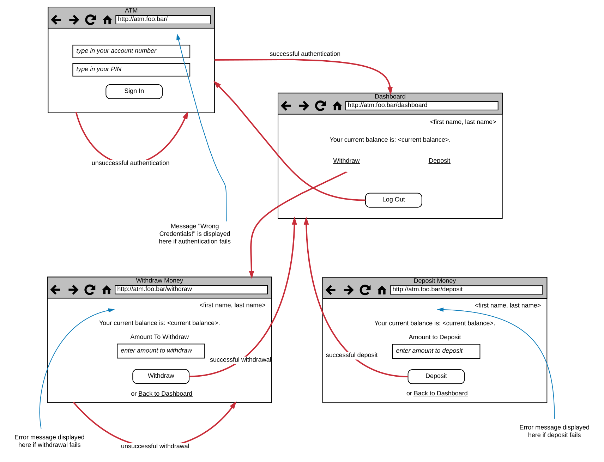

You are required to implement a Web application that resembles an ATM, i.e. a machine to withdraw and
deposit money.

Here is a drawing with the flow of the application:

1. When the user visits the `/` path of the application, he is presented with a sign in page. They have to give their account number
and PIN and then click on *Sign In* button.
1. On successful authentication, the user is presented with the dashboard page, on path `/dashboard`.
1. Dashboard presents the name of the user.
1. Dashboard presents the current balance of the user.
1. There are three options there. 1) to withdraw money. 2) to deposit money and 3) to log out.
1. When the user clicks on withdraw link, they are taken to the page `/withdraw`. 
1. When the user clicks on deposit link, they are taken to the page `/deposit`.
1. When the user clicks on button log out, they are taken back to the `/` authentication page.
1. When user is on `/withdraw` page, they need to give the amount to withdraw and click on *Withdraw* button.
1. When the withdrawal is successful, user is taken to their dashboard.
1. When user is on `/deposit` page, they need to give the amount to deposit and click on the *Deposit* button.
1. When the deposit is successful, user is taken to their dashboard.

Here are some more things that you need to take into account:

1. When the user visits the `/` page but he is already signed in, then they are redirected to the `/dashboard` page.
1. When the user tries to visit any of the pages that require authentication (`/dashboard`, `/withdraw`, `/deposit`)
but they are not signed in, then they are being redirected to the `/` page.
1. When authentication, or the withdrawal, or the deposit fails, then the user stays on same page but a message appears
giving them more information about the problem.
1. The Web application needs to save the account data persistently. You an use a YML or a JSON file to do that. Assume that 
you already have a file like that with some accounts inside.
1. Application should be using Twitter Bootstrap.

On the following video you can see the final result in action:

  

**Important** 

1. You need to upload your code to your Github account.
2. You need to put your application to production onto Heroku.

