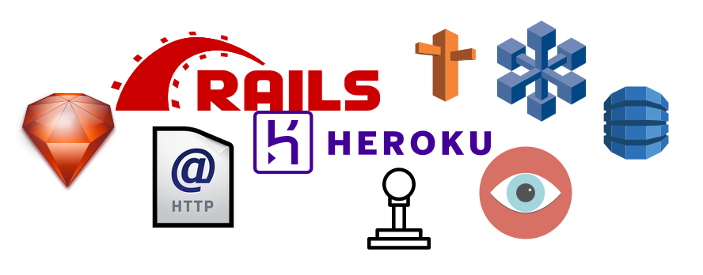

This is going to be a long chapter on Ruby on Rails. It is still, however, an introduction to this fantastic Web framework. The chapter
will take you through all the basic components of a Rails application. You will build two applications while studying the content
and a third one while doing the chapter tasks. This last one will be evolving with the knowledge that you will be acquiring going through
the next chapters. The content here is so powerful that will make you feel really awesome with the things you will learn
and the actual results of the hands-on material practiced.
