Let's continue our `blog` application development. We will work on things that need to be implemented in a Rails-suggested way
and using the Rails API.

## PostgreSQL Database on Local Machine

Before going into the application code itself, we would like to take some time to make sure that we have the least possible impendance
mismatch between our local development environment VS the production environment.

One thing that we need to make sure is the same, is the database vendor we use locally. Currently, our `blog` is using SQLite. Whereas
our production server, in Heroku, is using PostgreSQL. We are going to make sure that your local environment is using PostgreSQL too.
Here is how:

### Make sure PostgreSQL is installed and running

On my machine I did `ps -ef | grep 'postgres'` and I saw this:

``` bash
blog $ ps -ef | grep 'postgre'
 501 82998     1   0  2:52AM ??         0:00.08 /Applications/Postgres.app/Contents/Versions/9.4/bin/postgres -D /Users/panayotismatsinopoulos/Library/Application Support/Postgres/var-9.4
  501 83002 82998   0  2:52AM ??         0:00.00 postgres: checkpointer process     
  501 83003 82998   0  2:52AM ??         0:00.08 postgres: writer process     
  501 83004 82998   0  2:52AM ??         0:00.04 postgres: wal writer process     
  501 83005 82998   0  2:52AM ??         0:00.04 postgres: autovacuum launcher process     
  501 83006 82998   0  2:52AM ??         0:00.09 postgres: stats collector process     
  501 85430 83968   0  8:36AM ttys000    0:00.00 grep postgre
blog $
```

This proves that PostgreSQL is running. Also, if I do `psql` on the command line, I am getting into the PostgresSQL command line interface.

``` bash
blog $ psql
psql (9.4.4)
Type "help" for help.

panayotismatsinopoulos=# 
```

> *Hint:* You can quit the `psql` terminal by giving the command `\q`. Also make sure that, while in `psql` command line, you give the command `help` if you want
to learn more about using the `psql` interface.
 
If you don't have PostgreSQL installed, there are some ways you can install it.
 
#### Mac OS X

On my Mac, I have installed the `Postgres.app`, which I found very easy to do and covered my development needs. 

On the [official download page here](https://www.postgresql.org/download/macosx/) you can see also other ways you can install PostgreSQL on your Mac.
 
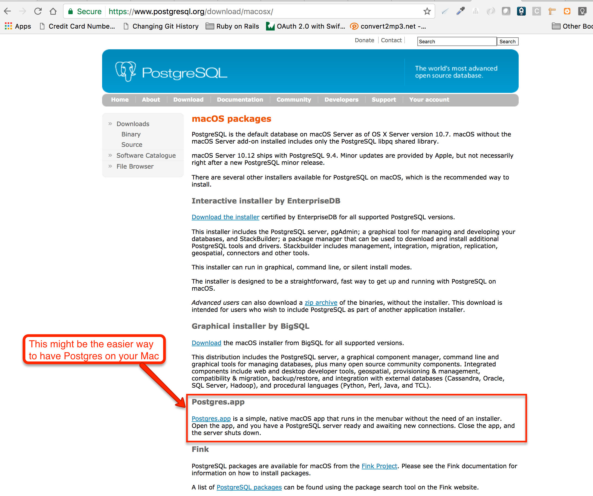 

#### Linux (Ubuntu/Debian)

* Here is the [official page](https://www.postgresql.org/download/linux/ubuntu/) for installing PostgreSQL on Ubuntu.
* Here is the [official page](https://www.postgresql.org/download/linux/debian/) for installing PostgreSQL on Debian.

You may want to try the *Interactive Installer by EnteripriseDB*

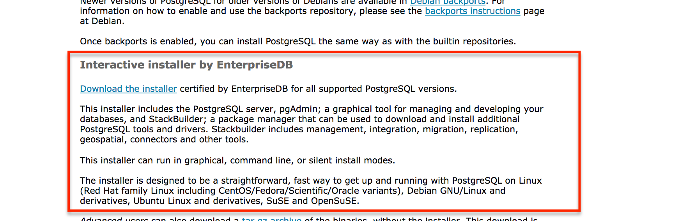 

### After Installation

Make sure that you can access the `psql` command line interface and that you can start and stop your PostgreSQL server.

### Update `config/database.yml` file

Now that you have PostgreSQL up and running on your local machine, you will need to update your `config/database.yml` file to have the correct settings for 
the `development` and `test` environments. Currently, they are using SQLite, but you want them to be using PostgreSQL. 

This is the new version of the `config/database.yml` file:

``` yml
 1. # File: config/database.yml
 2. #
 3. default: &default
 4.   adapter: postgresql
 5.   encoding: unicode
 6. 
 7. development:
 8.   <<: *default
 9.   database: blog_development
10. 
11. # Warning: The database defined as "test" will be erased and
12. # re-generated from your development database when you run "rake".
13. # Do not set this db to the same as development or production.
14. test:
15.   <<: *default
16.   database: blog_test
17. 
18. production:
19.   <<: *default
20.   database: blog_production
```

As you can see, we have an area with the default settings. Then we have environment specific settings. For `development`, `test` and `production`.
Note that the environment specific settings inherit from the `default` settings. 

> **Important:** We are not using `username` and `password`, but you may want to use them in your setup. We are not using because we have
setup our PostgreSQL security checks on our local machine to allow us for connection without credentials. If you have not done the
same, you may need to add the `username` and `password` keys in your `development` and `test` blocks. However, don't write the password
verbatim into the `config/database.yml` file, because this will risk you committing that to your git repo and pushing it to public Github remote
repository. Use the ERB tags to tell `config/database.yml` to take the `password` from an environment variable. This is an example `config/database.yml`
that does that:
>
>  ``` yml
>  # File: config/database.yml
>  #
>  default: &default
>    adapter: postgresql
>    encoding: unicode
>  
>  development:
>    <<: *default
>    database: blog_development
>    username: blog
>    password: <%= ENV['BLOG_PASSWORD_DEVELOPMENT']
>  
>  # Warning: The database defined as "test" will be erased and
>  # re-generated from your development database when you run "rake".
>  # Do not set this db to the same as development or production.
>  test:
>    <<: *default
>    database: blog_test
>    username: blog
>    password: <%= ENV['BLOG_PASSWORD_TEST']
>  
>  production:
>    <<: *default
>    database: blog_production
>  ```
> Having done the above, you will need to set the environment variables in your shell so that they hold the actual password values. See later on
> in this chapter how we use a gem to help us set the environment variables while we are doing development and test.
>
> Finally, the `username` and `password` do not play any role for the `production` block, because Heroku ignores them anyway and sets up the
connection to the database with its own credentials.

<br/>

> *Hint:* If you use username and password to start `psql` on your shell prompt, then you will have to use these in your `development` and `test`
> blocks in your `config/database.yml`. If you are not required to give these credentials and you have free access to `psql`, then you will
> not need to use `username` and `password`.

### Update `Gemfile`

Now, the `Gemfile` defines a dependency to `sqlite3` for `development` and `test` environments. This line should be removed.
Also, the line that defines a dependency to `pg` gem only for `production` environment, it needs to be updated by removing the environment
predicate. This is how your `Gemfile` needs to be:

``` ruby
 1. source 'https://rubygems.org'
 2. 
 3. git_source(:github) do |repo_name|
 4.   repo_name = "#{repo_name}/#{repo_name}" unless repo_name.include?("/")
 5.   "https://github.com/#{repo_name}.git"
 6. end
 7. 
 8. 
 9. # Bundle edge Rails instead: gem 'rails', github: 'rails/rails'
10. gem 'rails', '~> 5.1.1'
11. # Use Puma as the app server
12. gem 'puma', '~> 3.7'
13. gem 'jquery-rails'
14. gem 'bootstrap-sass'
15. # Use SCSS for stylesheets
16. gem 'sass-rails', '~> 5.0'
17. # Use Uglifier as compressor for JavaScript assets
18. gem 'uglifier', '>= 1.3.0'
19. # See https://github.com/rails/execjs#readme for more supported runtimes
20. # gem 'therubyracer', platforms: :ruby
21. 
22. # Use CoffeeScript for .coffee assets and views
23. gem 'coffee-rails', '~> 4.2'
24. # Turbolinks makes navigating your web application faster. Read more: https://github.com/turbolinks/turbolinks
25. gem 'turbolinks', '~> 5'
26. # Build JSON APIs with ease. Read more: https://github.com/rails/jbuilder
27. gem 'jbuilder', '~> 2.5'
28. # Use Redis adapter to run Action Cable in production
29. # gem 'redis', '~> 3.0'
30. # Use ActiveModel has_secure_password
31. # gem 'bcrypt', '~> 3.1.7'
32. 
33. # Use Capistrano for deployment
34. # gem 'capistrano-rails', group: :development
35. 
36. group :development, :test do
37.   # Call 'byebug' anywhere in the code to stop execution and get a debugger console
38.   gem 'byebug', platforms: [:mri, :mingw, :x64_mingw]
39.   # Adds support for Capybara system testing and selenium driver
40.   gem 'capybara', '~> 2.13'
41.   gem 'selenium-webdriver'
42. end
43. 
44. group :development do
45.   # Access an IRB console on exception pages or by using <%= console %> anywhere in the code.
46.   gem 'web-console', '>= 3.3.0'
47.   gem 'listen', '>= 3.0.5', '< 3.2'
48.   # Spring speeds up development by keeping your application running in the background. Read more: https://github.com/rails/spring
49.   gem 'spring'
50.   gem 'spring-watcher-listen', '~> 2.0.0'
51. end
52. 
53. # Windows does not include zoneinfo files, so bundle the tzinfo-data gem
54. gem 'tzinfo-data', platforms: [:mingw, :mswin, :x64_mingw, :jruby]
55. 
56. gem 'pg'
57. 
58. ruby '2.3.3'
```

### Create Local Databases

Having done that, it is now time for us to create the local database. Previously, we had it with SQLite, but now we need to recreate it
using PostgreSQL.

``` bash
blog $ bin/rake db:create
Running via Spring preloader in process 88054
Created database 'blog_development'
Created database 'blog_test'
blog $
```

Nice. The last two lines of the above output confirm that we have created the database with PostgreSQL.

### Schema Migrations

With the database in place, let's run the schema migrations. You will see something like the following:

``` bash
blog $ bin/rake db:migrate
Running via Spring preloader in process 88121
== 20170519062431 CreateArticles: migrating ===================================
-- create_table(:articles)
   -> 0.0052s
== 20170519062431 CreateArticles: migrated (0.0053s) ==========================
blog $
```

The above confirms that we have run the schema migrations successfully. But we can confirm that with the help of `psql` too,
i.e. with the help of the PostgreSQL command line interface:

``` bash
blog $ psql
psql (9.4.4)
Type "help" for help.

panayotismatsinopoulos=# \l
                                                                                          List of databases
             Name              |         Owner          | Encoding |   Collate   |    Ctype    |                 Access privileges                 
-------------------------------+------------------------+----------+-------------+-------------+---------------------------------------------------
 blog_development              | panayotismatsinopoulos | UTF8     | en_US.UTF-8 | en_US.UTF-8 | 
 blog_test                     | panayotismatsinopoulos | UTF8     | en_US.UTF-8 | en_US.UTF-8 | 
...
panayotismatsinopoulos=#
```

The `\l` command returns the list of databases. Then with `\connect blog_development` we can connect to the database:

``` bash
panayotismatsinopoulos=# \connect blog_development
You are now connected to database "blog_development" as user "panayotismatsinopoulos".
blog_development=# 
```

And the command to list all the tables of the current database is `\dt`:

``` bash
blog_development=# \dt
                       List of relations
 Schema |         Name         | Type  |         Owner          
--------+----------------------+-------+------------------------
 public | ar_internal_metadata | table | panayotismatsinopoulos
 public | articles             | table | panayotismatsinopoulos
 public | schema_migrations    | table | panayotismatsinopoulos
(3 rows)

blog_development=# 
```

You can see that there 3 tables in our newly created database. The `ar_internal_metadata` and `schema_migrations` are tables that Rails
creates and we will talk about those in the later chapters. Our busines domain table is the table `articles`. And you can inspect its
structure with the `\d+ articles` command:

``` bash
blog_development=# \d+ articles
                                                         Table "public.articles"
   Column   |            Type             |                       Modifiers                       | Storage  | Stats target | Description 
------------+-----------------------------+-------------------------------------------------------+----------+--------------+-------------
 id         | bigint                      | not null default nextval('articles_id_seq'::regclass) | plain    |              | 
 title      | character varying           |                                                       | extended |              | 
 text       | text                        |                                                       | extended |              | 
 created_at | timestamp without time zone | not null                                              | plain    |              | 
 updated_at | timestamp without time zone | not null                                              | plain    |              | 
Indexes:
    "articles_pkey" PRIMARY KEY, btree (id)

blog_development=# 
```

Cool. Let's exit the `psql` prompt with the command `\q`.

We are now happy that the integration of our Rails application to our local PostgreSQL server has been done correctly.

## Environment Variables

As we said earlier, your development might rely on the values of various Environment Variables. And we already know that 
Ruby and Rails have access to environment variables via the `Hash` `ENV`. On the other hand, while doing development, we might
not want to pollute the real Environment Variables namespace. We need a way to create *fake* environment variables, those that
are only needed by our Rails application while doing development or running tests.

We can do that with the help of the gem [dotenv-rails](https://github.com/bkeepers/dotenv). We will need this gem only for the `development` 
and `testing` environments. Not for `production`. In `production` the environment variables are set by the hosting shell. We will
see this is done for Heroku-deployed Rails appplications.

Let's amend our `Gemfile` to have this gem in.

``` ruby
 1. source 'https://rubygems.org'
 2. 
 3. git_source(:github) do |repo_name|
 4.   repo_name = "#{repo_name}/#{repo_name}" unless repo_name.include?("/")
 5.   "https://github.com/#{repo_name}.git"
 6. end
 7. 
 8. 
 9. # Bundle edge Rails instead: gem 'rails', github: 'rails/rails'
10. gem 'rails', '~> 5.1.1'
11. # Use Puma as the app server
12. gem 'puma', '~> 3.7'
13. gem 'jquery-rails'
14. gem 'bootstrap-sass'
15. # Use SCSS for stylesheets
16. gem 'sass-rails', '~> 5.0'
17. # Use Uglifier as compressor for JavaScript assets
18. gem 'uglifier', '>= 1.3.0'
19. # See https://github.com/rails/execjs#readme for more supported runtimes
20. # gem 'therubyracer', platforms: :ruby
21. 
22. # Use CoffeeScript for .coffee assets and views
23. gem 'coffee-rails', '~> 4.2'
24. # Turbolinks makes navigating your web application faster. Read more: https://github.com/turbolinks/turbolinks
25. gem 'turbolinks', '~> 5'
26. # Build JSON APIs with ease. Read more: https://github.com/rails/jbuilder
27. gem 'jbuilder', '~> 2.5'
28. # Use Redis adapter to run Action Cable in production
29. # gem 'redis', '~> 3.0'
30. # Use ActiveModel has_secure_password
31. # gem 'bcrypt', '~> 3.1.7'
32. 
33. # Use Capistrano for deployment
34. # gem 'capistrano-rails', group: :development
35. 
36. group :development, :test do
37.   # Call 'byebug' anywhere in the code to stop execution and get a debugger console
38.   gem 'byebug', platforms: [:mri, :mingw, :x64_mingw]
39.   # Adds support for Capybara system testing and selenium driver
40.   gem 'capybara', '~> 2.13'
41.   gem 'selenium-webdriver'
42.   gem 'dotenv-rails'
43. end
44. 
45. group :development do
46.   # Access an IRB console on exception pages or by using <%= console %> anywhere in the code.
47.   gem 'web-console', '>= 3.3.0'
48.   gem 'listen', '>= 3.0.5', '< 3.2'
49.   # Spring speeds up development by keeping your application running in the background. Read more: https://github.com/rails/spring
50.   gem 'spring'
51.   gem 'spring-watcher-listen', '~> 2.0.0'
52. end
53. 
54. # Windows does not include zoneinfo files, so bundle the tzinfo-data gem
55. gem 'tzinfo-data', platforms: [:mingw, :mswin, :x64_mingw, :jruby]
56. 
57. gem 'pg'
58. 
59. ruby '2.3.3'
```

Note that we have only added line 42, `gem 'dotenv-rails'`. We have not done any other change. Note that we have added this line
inside the gems that we need while we are in `development` or `test`. 

Let's run `bundle` now to bring this gem (and it's dependencies) in.

Then create the files `.env` and `.env.test` in the root folder of your project. These files can be initially empty. But later on,
if you need an environment variable, you will have to put it there. For example, if your database password for `development` 
needs to be specified with the environment variable `'BLOG_PASSWORD_DEVELOPMENT'`, then you need to have your `.env` file being
with the following content:

``` bash
BLOG_PASSWORD_DEVELOPMENT=dadf#A0(
```

Each line of the `.env` file contains one environment variable, with its name and its value for the `development` environment. 
While running tests, the environment variables are being read from the `.env.test` file instead.

> **Important**. You should not add/commit the `.env` and `.env.test` files in your Git repository. In order to avoid doing
that, you will have to edit the file `.gitignore` and add two lines that would make Git ignore these files:
> ``` bash
> .env
> .env.test
> ```

## Routes with `resources`

Let's now move to another improvement that will make our code to be more Railsish. Look at the `config/routes.rb` file:

``` ruby
# File: config/routes.rb
#
Rails.application.routes.draw do
  get 'articles/new'
  get 'articles/:id/edit', to: 'articles#edit'
  get 'articles/:id', to: 'articles#show'
  get 'articles', to: 'articles#index'
  post 'articles', to: 'articles#create'
  put 'articles/:id', to: 'articles#update'
  delete 'articles/:id', to: 'articles#destroy'

  root 'welcome#index'
end
```

It defines various routes for the Article resource (besides the route to welcome page). Let's refresh how these entries are being
translated to actual routes:

``` bash
blog $ bin/rake routes
      Prefix Verb   URI Pattern                  Controller#Action
articles_new GET    /articles/new(.:format)      articles#new
             GET    /articles/:id/edit(.:format) articles#edit
             GET    /articles/:id(.:format)      articles#show
    articles GET    /articles(.:format)          articles#index
             POST   /articles(.:format)          articles#create
             PUT    /articles/:id(.:format)      articles#update
             DELETE /articles/:id(.:format)      articles#destroy
        root GET    /                            welcome#index
blog $
```

We have 7 endpoints corresponding to the 7 entries inside the `config/routes.rb` file:

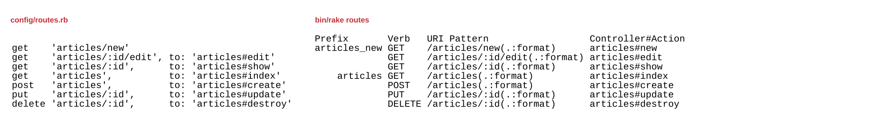 

We can see how there is one-to-one mapping from the entries in `config/routes.rb` to the actual routes that Rails finally compiles by reading the content of the
`config/routes.rb` file.

We have already said that Rails is heavily based on *resources*. For that reason, and because it seems that there is a pattern here with regards to the routes
that one usually defines for a resource, Rails provides a quick way to generate all these 7 routes with the use of only one Ruby statement.

Remove the 7 lines from the `config/routes.rb` file that have to do with the Article resource and replace them with the statement `resources :articles`. In other
words, your `config/routes.rb` file needs to be like this:

``` ruby
1. # File: config/routes.rb
2. #
3. Rails.application.routes.draw do
4.   resources :articles
5. 
6.   root 'welcome#index'
7. end
```

Now, run the command to see which routes Rails finally defines out of this new `config/routes.rb` file:

``` bash
blog $ bin/rake routes
       Prefix Verb   URI Pattern                 Controller#Action
article_index GET    /article(.:format)          article#index
              POST   /article(.:format)          article#create
  new_article GET    /article/new(.:format)      article#new
 edit_article GET    /article/:id/edit(.:format) article#edit
      article GET    /article/:id(.:format)      article#show
              PATCH  /article/:id(.:format)      article#update
              PUT    /article/:id(.:format)      article#update
              DELETE /article/:id(.:format)      article#destroy
         root GET    /                           welcome#index
```

Bingo! As you can see, with a single line of code, `resources :articles`, we have generated the same routes that we
had before. Actually, there is one more, the `PATCH` verb, but it points to the same controller and action like the
one for `PUT` verb.

> *Information:* The `PATCH` verb is preferred when we update parts of a resource. The `PUT` verb is preferred when we
update all the attributes of a resource and the request bears the new state of the resource as a whole. That is why
the `PATCH` is not idempotent whereas the `PUT` is considered to be. Read more about it [here](http://restcookbook.com/HTTP%20Methods/patch/)

The differences to the routes generated with the manual entries of Article routes were very slightly different:

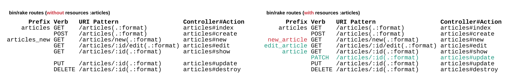 

1. There are some differences in the `Prefix` values. We have not talked about what the prefixes are yet.
2. There is this new `PATCH` entry.

In order to close this `resources` utility, let me just tell you that if you can generate your resources with `resources`, then prefer that. But make
sure that you cover all the endpoints. *Covering* all the endpoints might mean more than just implementing the controllers and their actions 
and views. For example, you may want to deal with security issues (authentication/authorization), something that we will discuss about in later
chapters.

## Form Builders

When we created the form to create a new Article, we used HTML markup, as we have already learned in the HTML section of this course. However,
when you write Rails, the framework provides you some helper methods that make your life much easier, when creating forms. The primary tool is the
form builder method `form_for`. Let's now recreate the form to create articles using the `form_for` form builder:

``` html
 1. <% # File: app/views/articles/new.html.erb %>
 2. 
 3. <h1>Create a New Article</h1>
 4. <%= form_for :article do |f| %>
 5.   <div class="form-group">
 6.     <%= f.label :title %>
 7.     <%= f.text_field :title, placeholder: 'Give Title of Article', class: 'form-control' %>
 8.   </div>
 9. 
10.   <div class="form-group">
11.     <%= f.label :text %>
12.     <%= f.text_area :text, placeholder: 'Type in the text of the Article', class: 'form-control' %>
13.   </div>
14. 
15.   <div>
16.     <%= f.submit class: 'btn btn-success' %>
17.   </div>
18. <% end %>
19. 
20. <div class="text-right">
21.   <a href="/articles">List of Articles</a>
22. </div>
```

Here are the things that you should be aware of and that they make this markup differ from the first version we used:

1. We use the `form_for` helper which takes as input the symbol that corresponds to the resource you are building a form for.
1. We provide a block in which we will use both standard HTML and ERB to generate the input related information.

 <div id="media-container-image-form_for to Generate the Form to Create New Article">
   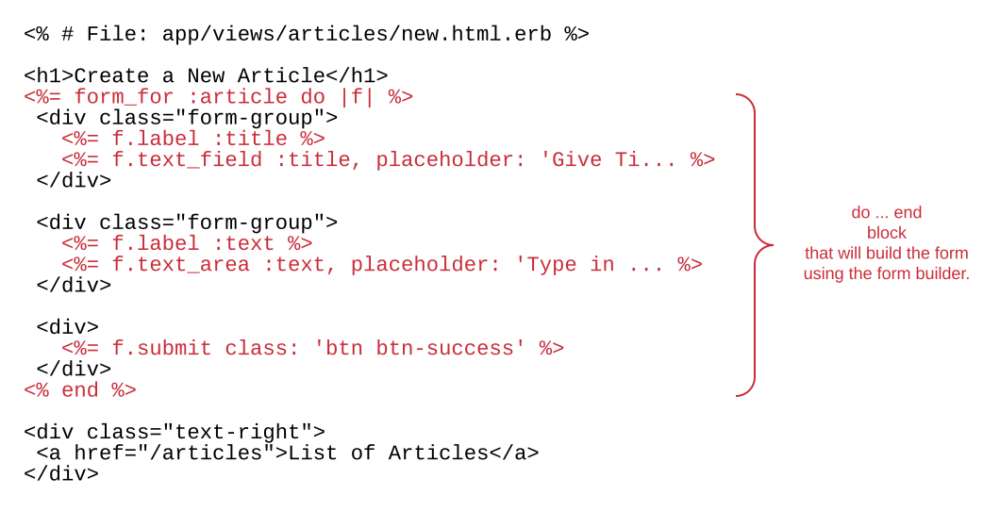</img>
 </div> 
1. The `f.label` will generate a `label` HTML tag.
1. The `f.text_field` will generate an `input` of type `text` HTML tag.
1. The `f.text_area` will generate a `textarea` HTML tag.
1. The `f.submit` will generate an `input` of type `submit`. 

If you save the above `.html.erb` content and visit the URL [http://localhost:3000/articles/new](http://localhost:3000/articles/new), you will see
the form to create a new article displayed as such:

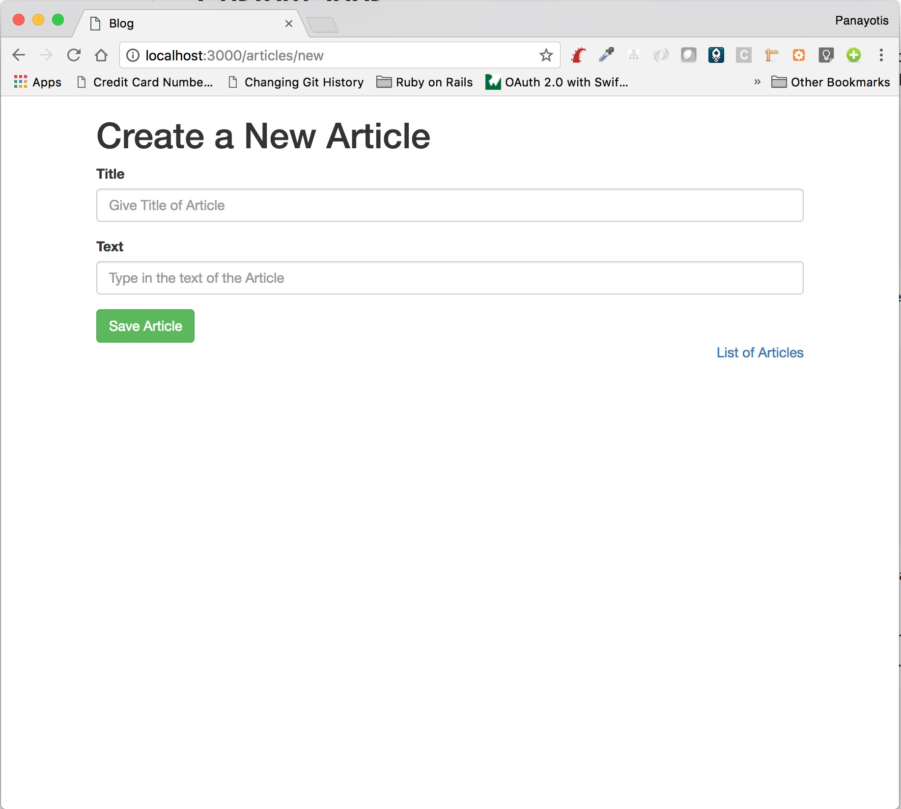 

The most important details of this technique (`form_for`) to build the form are revealed if you inspect the source of the generated
HTML page. Right-click on the page and select `View Source`. This is the part that is generated for the form:

``` html
 1. <form action="/articles" accept-charset="UTF-8" method="post">
 2.   <input name="utf8" type="hidden" value="&#x2713;" />
 3.   <input type="hidden" name="authenticity_token" value="VZVE9vJYsJ2adxLe0TZp1RkUMcQwbd313alxaV7OeMPVEVZ+ShGii2X+yn7ypuTTdmYAxZNaxvmhBc4W7UrcEg==" />
 4.   <div class="form-group">
 5.     <label for="article_title">Title</label>
 6.     <input placeholder="Give Title of Article" class="form-control" type="text" name="article[title]" id="article_title" />
 7.   </div>
 8. 
 9.   <div class="form-group">
10.     <label for="article_text">Text</label>
11.     <textarea placeholder="Type in the text of the Article" class="form-control" name="article[text]" id="article_text">
12.     </textarea>
13.   </div>
14. 
15.   <div>
16.     <input type="submit" name="commit" value="Save Article" class="btn btn-success" data-disable-with="Save Article" />
17.   </div>
18. </form>
```

1. On line 1, do you see the attributes `action` and `method` that have been generated automatically? The `method` has the
value `post` as expected. The `action`, does not have the correct value, though. We expected that to be `/articles`, but,
instead, it has the value `/articles/new`. POSTing to `/articles/new` is not an endpoint that is covered by our routes. Let's keep
that for a while at the back of our head. We will need to fix that later on.
1. Do you see the line 3? It is the `authenticity_token` hidden field that we had to create manually. Now it is created automatically.
1. On line 2, you can see another hidden field that is automatically generated. It is the field with name `utf-8` and value &#x2713;
This makes sure that the data of the form are submitted as UTF-8. This is necessary because some browsers do not submit the data
correctly.
1. Lines 6 and 11 are the input fields of the form. Their `id` and `name` attributes have been automatically generated. Do you see
their convention? The `id` and `name` is constructed within the namespace of the resource. So, instead of `title` now it is
`article_title` and `article[title]` respectively. 
1. Lines 5 and 10 are the label tags which correctly have the `for` attribute pointing to the corresponding `input` fields. Also, the
`label` HTML content is automatically generated too.
1. The `input` field with type `submit` has been automatically created too.

After having done the above analysis, there are some things that we need to do in order to make sure the form creates new articles

### `form` `action` Attribute Value

In order to fix the problem with the `action` value of the `form` generated, we need to give value to the key `url` that we
pass to the `form_for` method:

``` html
<%= form_for :article, url: '/articles' do |f| %>
...
<% end %>
```

If you do the above change, you refresh the page on your browser and you view the source of the page, you will see that the
form now has the correct `action` value:

``` html
<form action="/articles" accept-charset="UTF-8" method="post">
...
<form>
```

### Change Params Parsing

Now that the `name` attributes of the form have changed, we will need to change the `create` action logic in the `articles_controller`. Here
is how the `create` action should be implemented:

``` ruby
...
def create
  article = Article.new
  article.title = params[:article][:title]
  article.text = params[:article][:text]
  article.save
end
...
```

So, instead of `params[:title]`, we will use `params[:article][:title]`. Similarly for the `title` attribute.

Having done all the above, Try to create a new Article. Does it work?

YES! It does.

## Path and URL Helpers

We will continue to improve our code for the create new article functionality. We move onto *path and url helpers*. These are
methods that we can use in our Views to generate paths and full URLs. You can tell which methods you have available by looking
at the *Prefix* column on the `bin/rake routes` output:

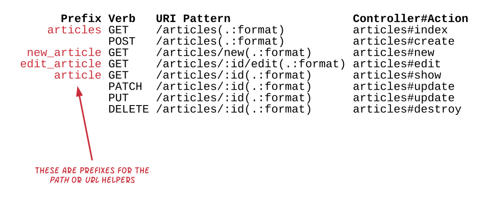 

The path helpers are methods whose names are the prefix and the string `_path` appended at the end. The URL helpers are methods whose names are the
prefix and the string `_url` appended at the end. So, when `bin/rake routes` generates the routes:

``` bash
blog $ bin/rake routes
      Prefix Verb   URI Pattern                  Controller#Action
    articles GET    /articles(.:format)          articles#index
             POST   /articles(.:format)          articles#create
 new_article GET    /articles/new(.:format)      articles#new
edit_article GET    /articles/:id/edit(.:format) articles#edit
     article GET    /articles/:id(.:format)      articles#show
             PATCH  /articles/:id(.:format)      articles#update
             PUT    /articles/:id(.:format)      articles#update
             DELETE /articles/:id(.:format)      articles#destroy
        root GET    /                            welcome#index
blog $ 
```

the available path helpers are:

1. `articles_path`
2. `new_article_path`
3. `edit_article_path`
4. `article_path`
5. `root_path`

and the available URL helpers are:

1. `articles_url`
2. `new_article_url`
3. `edit_article_url`
4. `article_url`
5. `root_url`

Let's now enhance our `app/views/articles/new.html.erb` template to be using path helpers:

``` html
 1. <% # File: app/views/articles/new.html.erb %>
 2. 
 3. <h1>Create a New Article</h1>
 4. <%= form_for :article, url: articles_path do |f| %>
 5.   <div class="form-group">
 6.     <%= f.label :title %>
 7.     <%= f.text_field :title, placeholder: 'Give Title of Article', class: 'form-control' %>
 8.   </div>
 9. 
10.   <div class="form-group">
11.     <%= f.label :text %>
12.     <%= f.text_area :text, placeholder: 'Type in the text of the Article', class: 'form-control' %>
13.   </div>
14. 
15.   <div>
16.     <%= f.submit class: 'btn btn-success' %>
17.   </div>
18. <% end %>
19. 
20. <div class="text-right">
21.   <a href="<%= articles_path %>">List of Articles</a>
22. </div>
```

The only amendments are on lines 4 and 21. Instead of using `/articles` we use `articles_path`. Later on we will take advantage
of the other helpers too. They are very helpful because they make sure that the paths and URLs are built following any
standard and convention and they reduce the possibility to write something wrong, especially when the links might include
placeholders and query parameters.

Note that the difference between a `<...>_path` and the corresponding `<...>_url` is that the latter version prepends the
protocol, current host and port. In other words, the `articles_url` would have been `http://localhost:3000/articles` instead
of just `/articles` that is generated by `articles_path`. Generally, we use the `<...>_path` version, but there are cases
that we need to make sure the `<...>_url` version is used. For example, when we generate links that will be embedded inside
emails that we send out.

## Strong Parameters

We have learned how to access the parameters posted from the form to the server. Here is the `create` action again:

``` ruby
def create
  article = Article.new
  article.title = params[:article][:title]
  article.text = params[:article][:text]
  article.save
end
```

The above implementation implies that one would have to amend it every time a new param is added to the form. There is a cleaner
way you can write this.

``` ruby
def create
  article = Article.new(article_params)
  article.save
end
```

The above invokes the `article_params` method which needs to be a `private` method implemented in the `articles_controller.rb`: 

``` ruby
private

def article_params
  params.require(:article).permit(:title, :text)
end
```

The above implementation uses a Rails API that 

1. specifies which namespace we should use to pick up the values of the form. In this case, this is the `:article` one.
2. specifies what keys are allowed/permitted to exist in this bucket/namespace. Only the values of these keys are taken and used 
as values to create the article.

The above is a very good practice to use. It clearly conveys the design behind the form that you have published and makes sure
that no other keys will be processed. Hence, malicious forms will not be able to submit other keys and set values to attributes
of an Article that might not be public for creation (or update).

Try to create another Article. Does it work? Yes it does. We will use this new private method for the `update` action too, but
later on.

## Model Validations

We still stay in the creation of an Article and now we are suggesting you to try to create an Article without giving any of the
values, i.e. with neither *title* nor *text*. What will happen when you click to create such an Article? This, with the current
implementation, is something that will allow the Article to be created with blank values.

<div id="media-container-video-Blog Demo Articles Management First Part">
  <a href="https://player.vimeo.com/video/219292684"></a>
</div>

How, can we prevent that? We can definitely prevent that at the client side, but, before we do that, we prefer to make sure that
things are shielded from such situations at the server-side.

> **Important**: Delete any Article that you have created and that it does not have either text or title.

Rails provide a mechanism which is called ActiveRecord Validations. Here is what we have to do in order to prevent an Article
being created with empty title or empty text:

``` ruby
1. # File: app/models/article.rb
2. #
3. class Article < ApplicationRecord
4.   validates :title, presence: true
5.   validates :text, presence: true
6. end
```

The two lines that we have added are examples of Active Record validations. They both make sure that the corresponding attributes
are going to have values before being created or updated.

With the above validations in place, try to create an Article with empty values. Does it work?

You will see that it does not. And this is what you see in the Rails logs:

``` bash
Started POST "/articles" for 127.0.0.1 at 2017-05-28 23:13:44 +0300
Processing by ArticlesController#create as HTML
  Parameters: {"utf8"=>"✓", "authenticity_token"=>"mKZEGveBU8ndKZTM5mozaiR9XgS4tfnX8ae4DBwIgJkYIlaST8hB3yKgTGzF+r5sSw9vBRuC4tuNCwdzr4wkSA==", "article"=>{"title"=>"", "text"=>""}, "commit"=>"Save Article"}
   (0.2ms)  BEGIN
   (0.1ms)  ROLLBACK
  Rendering articles/create.html.erb within layouts/application
  Rendered articles/create.html.erb within layouts/application (0.4ms)
Completed 200 OK in 48ms (Views: 43.3ms | ActiveRecord: 0.3ms)
```

There is no `INSERT` command at the database level. The insertion didn't take place because the model was considered *invalid*. The validations take
place before the actual work to the database. 

We will talk more about validations in a later chapter.

The following video demonstrates the fact that the article is not created if information is missing:

<div id="media-container-video-Article Is Not Created If Information Is Missing">
  <a href="https://player.vimeo.com/video/219302009"></a>
</div>

## Handle Error

We have fixed the problem with *invalid* Articles and now `create` action cannot save such erroneous data in the database. But, the user
is informed that the Article has been created successfully, even if it has not. 

We need to tune our controller handling code so that it takes into account the failure of the statement `article.save`.

Here is an improved version of the `create` method that redirects user to the edit page of the article created, if `article.save` returns
`true`. Otherwise, if `article.save` returns `false`, it renders the view template `app/views/articles/new.html.erb`, i.e. it asks the
user to fill in the details again.

``` ruby
def create
  article = Article.new(article_params)
  if article.save
    redirect_to edit_article_url(article)
  else
    render :new
  end
end
```  

Here is a short video that demonstrates the functionality of this implementation.

<div id="media-container-video-Blog Demo Articles Management First Part">
  <a href="https://player.vimeo.com/video/219357357"></a>
</div>

The statement `redirect_to` is used to send back to the browser a `302` response with the URL the browser needs to take the user to. The URL that
we are specifying here is the result of the call to `edit_article_url(article)` and it is more or less something like this:
`http://localhost:3000/articles/<id of article created>/edit`.

You can also understand what is going on here, by reading, once more, the Rails logs:

``` bash
Started POST "/articles" for 127.0.0.1 at 2017-05-29 12:49:19 +0300
Processing by ArticlesController#create as HTML
  Parameters: {"utf8"=>"✓", "authenticity_token"=>"kPuz61NgOf9Xjh+O8Vcv5jVz1GLmfV5i/gnfXZ//PocQf6Fj6ykr6agHxy7Sx6LgWgHlY0VKRW6CpWAiLHuaVg==", "article"=>{"title"=>"Ruby Hashes", "text"=>"The Ruby Hash API ..."}, "commit"=>"Save Article"}
   (0.1ms)  BEGIN
  SQL (0.3ms)  INSERT INTO "articles" ("title", "text", "created_at", "updated_at") VALUES ($1, $2, $3, $4) RETURNING "id"  [["title", "Ruby Hashes"], ["text", "The Ruby Hash API ..."], ["created_at", "2017-05-29 09:49:19.122674"], ["updated_at", "2017-05-29 09:49:19.122674"]]
   (0.2ms)  COMMIT
Redirected to http://localhost:3000/articles/10/edit
Completed 302 Found in 3ms (ActiveRecord: 0.6ms)


Started GET "/articles/10/edit" for 127.0.0.1 at 2017-05-29 12:49:19 +0300
Processing by ArticlesController#edit as HTML
  Parameters: {"id"=>"10"}
  Article Load (0.3ms)  SELECT  "articles".* FROM "articles" WHERE "articles"."id" = $1 LIMIT $2  [["id", 10], ["LIMIT", 1]]
  Rendering articles/edit.html.erb within layouts/application
  Rendered articles/edit.html.erb within layouts/application (0.5ms)
Completed 200 OK in 51ms (Views: 47.9ms | ActiveRecord: 0.3ms)
```

The first batch is the `POST` to create the article. Do you see how this HTTP Request terminates? It terminates with a `Redirected 302 to http://locahost:3000/articles/10/edit`.
And you can see the `Completed 302 Found` HTTP response returned.

Then, the second batch of log lines, is about the request that the browser did to the URL the redirection specified, i.e. a `GET` to the `/articles/10/edit`.

But, what happens if the article cannot be saved? The `render :new` statement takes place. And the following video demonstrates that:

<div id="media-container-video-Blog Demo Articles Management First Part">
  <a href="https://player.vimeo.com/video/219358937"></a>
</div>

## Improving Error Handling

As you can see from the video, there are two problems:

1. The user is not actually informed about the error.
2. The user has lost any information that they might have entered. For example, if they have forgotten the `text` part which is mandatory,
but they have only given the `title` part, the form is rerendered and the `title` value has been lost. So, user is required to enter again
all the information from the beginning.

Can we fix these two issues?

Let's start from the second problem. In order for the form to preserve the values that the user has submitted, we need to make the form
rely on an instance of an Article. This instance will have to have the values that the user has submitted. There is a small change in the
form code:

``` html
 1. <% # File: app/views/articles/new.html.erb %>
 2. 
 3. <h1>Create a New Article</h1>
 4. <%= form_for @article, url: articles_path do |f| %>
 5.   <div class="form-group">
 6.     <%= f.label :title %>
 7.     <%= f.text_field :title, placeholder: 'Give Title of Article', class: 'form-control' %>
 8.   </div>
 9. 
10.   <div class="form-group">
11.     <%= f.label :text %>
12.     <%= f.text_area :text, placeholder: 'Type in the text of the Article', class: 'form-control' %>
13.   </div>
14. 
15.   <div>
16.     <%= f.submit class: 'btn btn-success' %>
17.   </div>
18. <% end %>
19. 
20. <div class="text-right">
21.   <a href="<%= articles_path %>">List of Articles</a>
22. </div>
```

This is the same as before, but the only difference is on line 4. Instead of `form_for :article` we use `form_for @article` and we now
have the form using an instance variable `@article` to build the input controls and its values from.

If you save the above and reload the [http://localhost:3000/articles/new](http://localhost:3000/articles/new) page on your browser,
you will see this:

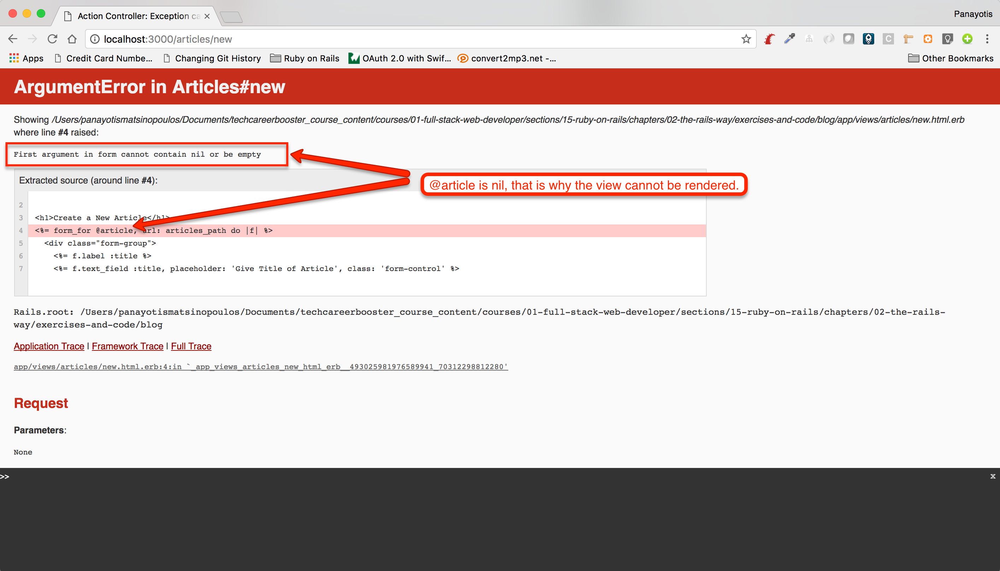 

We cannot give `nil` to the `form_for` call. And `@article` is `nil` because we have not instantiated it. 

Where do we instantiate the variables that the views need? In the corresponding controller actions. Which is the action that we deal
with when we fetch the form to create a new Article? It is the `new` action. Having said that, we need to amend the
`new` action to instantiate an Article and store it in the `@article` instance variable:

This is the version of the `new` action in our `ArticlesController`:

``` ruby
def new
  @article = Article.new
end
```

Now, reload the [http://localhost:3000/articles/new](http://localhost:3000/articles/new) page. You will see that the page is being loaded without
any problem.

Now, if you try to save a new Article, it will succeed. But if you try to save an incomplete Article things will not go as expected. You will get
the same error about providing `form_for` with `nil`. This is because the line 13, in Articles controller (`render :new`) asks Rails to render
the `app/views/articles/new.html.erb` which requires the `@article` instance. And `create` action does not instantiate that.

This is the new version of `create` that will do that:

``` ruby
def create
  article = Article.new(article_params)
  if article.save
    redirect_to edit_article_url(article)
  else
    @article = article
    render :new
  end
end
```

The error branch (`else ... end`) will instantiate the `@article` to be equal to the `article` variable that has been created at the beginning of the
method. Hence, the view `app/views/articles/new.html.erb` will, first, have the `@article` instantiated, and, second, will use the values of this
instance to prepopulate the values of the input controls.

Now, when you submit and invalid Article, the values of the fields that you have completed are filled in with the values that you have given.

Here is how it works:

<div id="media-container-video-Values Are Retained When We Submit Invalid Article">
  <a href="https://player.vimeo.com/video/219410835"></a>
</div>

## Informing User

The other issue that we have to fix is about telling user that there was something wrong with the data that they have submitted. In order to
address this one, we are going to enhance our `app/views/articles/new.html.erb` content to include markup that would display any errors
if errors were present:

``` html
 1. <% # File: app/views/articles/new.html.erb %>
 2. 
 3. <h1>Create a New Article</h1>
 4. <%= form_for @article, url: articles_path do |f| %>
 5. 
 6.   <% if @article.errors.any? %>
 7.     <div id="error-explanation">
 8.       <h2>
 9.         <%= pluralize(@article.errors.count, "error") %> prohibited
10.         this article from being saved:
11.       </h2>
12.       <ul>
13.         <% @article.errors.full_messages.each do |msg| %>
14.           <li><%= msg %></li>
15.         <% end %>
16.       </ul>
17.     </div>
18.   <% end %>    
19. 
20.   <div class="form-group">
21.     <%= f.label :title %>
22.     <%= f.text_field :title, placeholder: 'Give Title of Article', class: 'form-control' %>
23.   </div>
24. 
25.   <div class="form-group">
26.     <%= f.label :text %>
27.     <%= f.text_area :text, placeholder: 'Type in the text of the Article', class: 'form-control' %>
28.   </div>
29. 
30.   <div>
31.     <%= f.submit class: 'btn btn-success' %>
32.   </div>
33. <% end %>
34. 
35. <div class="text-right">
36.   <a href="<%= articles_path %>">List of Articles</a>
37. </div>
```

The amendment is the block of code between lines 6 and 18. It is a `div` with id `error-explanation`, which is only printed if
the instance `@article` has any errors attached. If it has...

1. We print the number of errors. Line 9. The `pluralize` method displays either `error` or `errors` depending on the number of
errors the instance has. The number of errors is `@article.errors.count`. 
2. For each one of the error messages (`@article.errors.full_messages.each`) we display a list item inside a `ul` tag. The list item
contains the actual error message.

Let's try this. Try to create an Article with missing information, either with missing title or with missing text, or with both.
See how the error message is displayed.

Watch the following video to see this in action:

<div id="media-container-video-Values Are Retained When We Submit Invalid Article">
  <a href="https://player.vimeo.com/video/219413602"></a>
</div>

## Style Div With Error Messages

Before we close this paragraph on error handling, you may want to introduce some kind of styling, in order to make the errors
being displayed nicer.

One way you can do that is by creating the file `app/assets/stylesheets/errors.scss` with the following content:

``` scss
/* File: app/assets/stylesheets/errors.scss */

#error-explanation {
  h2 { font-size: 1.4rem; }
}
```

Then, make sure that this file is being imported by your `app/assets/stylesheets/application.scss` file:

``` scss
// File: app/assets/stylesheets/application.scss
//
@import "bootstrap-sprockets";
@import "bootstrap";
@import "errors";
```

Also, enhance the markup that has to do with the `error-explanation` to have classes that are coming from Twitter Bootstrap, as follows:

``` html
...
<div id="error-explanation" class="alert alert-danger alert-dismissible" role="alert">
  <button type="button" class="close" data-dismiss="alert" aria-label="Close"><span aria-hidden="true">&times;</span></button>
...
```

As you can see, we have added the classes `alert alert-danger alert-dismissible`. We have also added a `button` that will be used by
the user to dismiss the alert.

Now, when you try to create an invalid Article, you will see something like this:

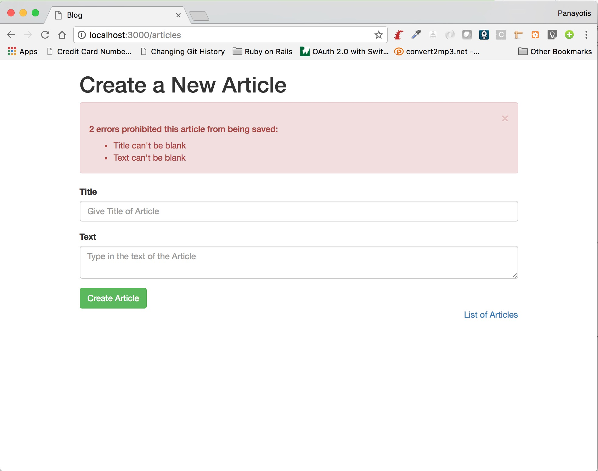 

## Removing `create.html.erb` Confirmation Page

Since we don't display the confirmation page for the creation of an Article, we can now safely remove the `app/views/articles/create.html.erb` file. 

## Display Success Message

We have implemented the `create` method in such a way so that it redirects to the edit page of the article that has just been created. However, sometimes,
it is also user-friendly, to be able to display an alert message that the creation was successful. Like this:

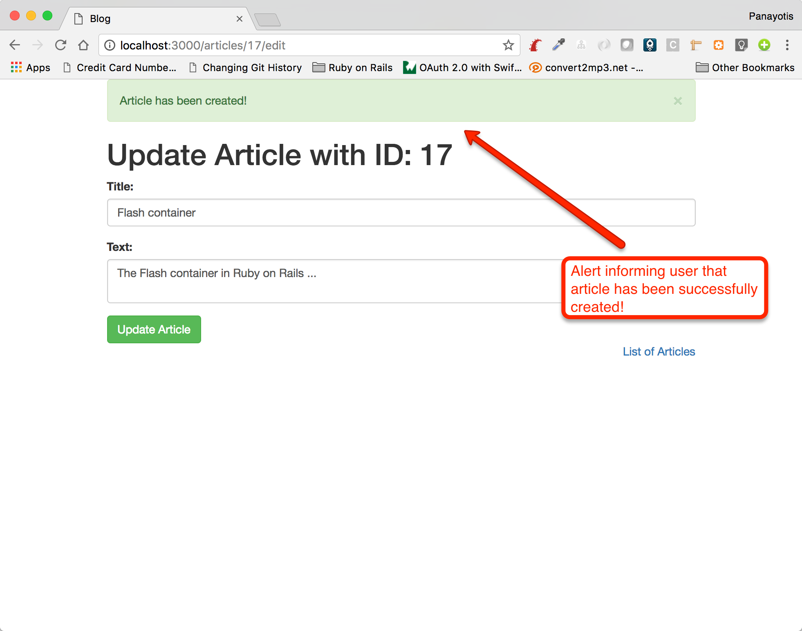 

Let's do that.

First, you need to prepare the message to display. This is done inside the `create` action of our Articles controller. Here is the implementation:

``` ruby
def create
  article = Article.new(article_params)
  if article.save
    flash[:success] = 'Article has been created!'
    redirect_to edit_article_url(article)
  else
    @article = article
    render :new
  end
end
```

The line that does the trick to prepare the message is line `flash[:success] = 'Article has been created!'`. The `flash` bucket is a Hash-like
bucket that keeps its content **only for the next request**. Hence, It will be available when our server will process the `GET /articles/:id/edit` request
which will come next (thanks to the `redirect_to` statement). We could have used the `session` bucket instead (like we have done this when we worked
with Sinatra), but for this case here, we prefer to use `flash` because `flash` lives only for the next request and we don't have to 
clear the bucket, like we would had to do if we were to use `session` instead.

Now that `flash` contains the message to display when processing the `GET /articles/:id/edit` request, we can read its content and display the
message inside the `app/views/articles/edit.html.erb` which is the view that displays the edit form.

``` html
<% # File: app/views/articles/edit.html.erb %>

<% flash.each do |name, message| %>
  <div class="alert alert-<%= name %> alert-dismissible">
    <button type="button" class="close" data-dismiss="alert" aria-label="Close"><span aria-hidden="true">&times;</span></button>
    <%= message %>
  </div>
<% end %>


<h1>Update Article with ID: <%= @article.id %></h1>

<form method="post" action="/articles/<%= @article.id %>">
...
```

Above, you can see the `<% flash ... end %>` block that we have added at the beginning of the file `app/views/articles/edit.html.erb`. The `flash`, is
a `Hash` like bucket and can contain many keys. The above block creates one Twitter Bootstrap alert for each one of the keys. Note that the key 
is used to actually set the `alert-xxxxx` class that we attach to the `alert` used. This is a common practice with Twitter Bootstrap. Hence, when the key
is `success`, like it does in our case, the class attached to the alert will be `alert-success`. The other values that can be used to create Twitter Bootstrap
alerts with different semantics can be found [here](http://getbootstrap.com/components/#alerts).

Save the changes in your `app/views/articles/edit.html.erb` and try to create a new valid Article. You will see that the success alert is 
being displayed.

## Using Layout For `flash`

Usually, you will see the `flash` being rendered from the layout and not from a particular view. This is useful, because it allows all the
views to use the `flash` bucket. Let's move the `flash` from the `app/views/articles/edit.html.erb` to the `app/views/layouts/application.html.erb`:

``` html
 1. <!DOCTYPE html>
 2. <html>
 3.   <head>
 4.     <title>Blog</title>
 5.     <%= csrf_meta_tags %>
 6. 
 7.     <%= stylesheet_link_tag    'application', media: 'all', 'data-turbolinks-track': 'reload' %>
 8.     <%= javascript_include_tag 'application', 'data-turbolinks-track': 'reload' %>
 9.   </head>
10. 
11.   <body>
12.     <div class="container">
13. 
14.       <% flash.each do |name, message| %>
15.           <div class="alert alert-<%= name %> alert-dismissible">
16.             <button type="button" class="close" data-dismiss="alert" aria-label="Close"><span aria-hidden="true">&times;</span></button>
17.             <%= message %>
18.           </div>
19.       <% end %>
20. 
21.       <%= yield %>
22. 
23.     </div>
24.   </body>
25. </html>
```

You can see the lines 14 to 19 that display the `flash` like we did in the `app/views/articles/edit.html.erb`. If you try to create the
Article again, you will see the `flash` being displayed as before.

## Anchors With `link_to`

There is another helper method that Rails provides us with, and it has to do with creating anchor HTML tags. This is the `link_to` method.

Let's take for example the `app/views/articles/index.html.erb` view template. We are going to replace the anchor tags with the use of this method.

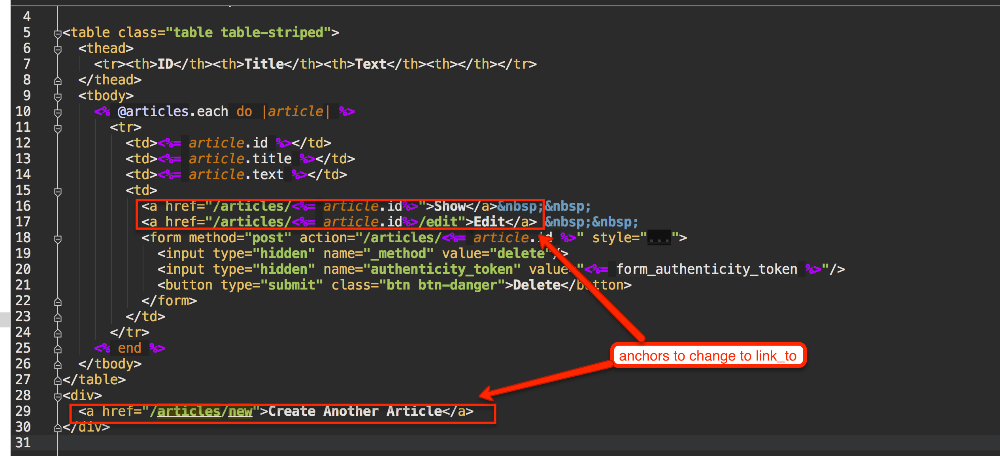 

The `link_to` usually works in conjunction with the path and url helpers that we saw earlier. Here are the changes that we are going to do:

1. `<a href="/articles/<%= article.id%>">Show</a>` is going to be replaced with `<%= link_to 'Show', article_path(article) %>`.
1. `<a href="/articles/<%= article.id%>/edit">Edit</a>` is going to be replaced with `<%= link_to 'Edit', edit_article_path(article) %>`.
1. `<a href="/articles/new">Create Another Article</a>` is going to be replaced with `<%= link_to 'Create Another Article', new_article_path %>`.

Do the above changes and visit the page [http://localhost:3000/articles](http://localhost:3000/articles). If you view the source of the page, you will
see that the anchors have been generated by the `link_to` statements. 

Generating the anchor tags with the help of the `link_to` command, in conjunction with the path helpers is much more safe and powerful. Also, the `html.erb` file
is much easier to read.

## Delete Links

In file `app/views/articles/index.html.erb` we have used a `form` to build the markup for the `Delete` action on each article. An alternative would have been
to have used an anchor instead.

Replace the code:

``` html
<form method="post" action="/articles/<%= article.id %>" style="display: inline;">
  <input type="hidden" name="_method" value="delete"/>
  <input type="hidden" name="authenticity_token" value="<%= form_authenticity_token %>"/>
  <button type="submit" class="btn btn-danger">Delete</button>
</form>
```

with the following:

``` html
<%= link_to 'Delete', article_path(article), method: :delete, class: 'btn btn-danger' %>
```

Now, save the file and visit the [http://localhost:3000/articles](http://localhost:3000/articles). You will still see the `Delete` button as one
of the available actions on each Article entry in the table. However, now, there is no `form` in the markup, but there is a anchor instead. If
you inspect the source on the `Delete` element, you will see that the following markup is generated:

``` html
<a class="btn btn-danger" rel="nofollow" data-method="delete" href="/articles/17">Delete</a>
```

1. The anchor has the `rel` attribute set to `nofollow`. This is very important, otherwise, the crawling robots would *click* on this link.
1. There is a `data` attribute with name `data-method` and value `delete`. This is to tell browser that we want to send over a `DELETE` HTTP request.
1. The `href` value of the anchor points to the article that we want to delete. 

Note that there is some JavaScript involved here for the actual submission of the HTTP request. The JavaScript provided by the Rails framework and
it is automatically invoked when we click on the particular link.

## Delete With Confirmation

Let's now add a feature on our `Delete` buttons. We will have the browser ask the user whether they really want to delete the Article or not.

Go to line that has the link to delete, `<%= link_to 'Delete', article_path(article), method: :delete, class: 'btn btn-danger' %>` and add the
data attribute `confirm` with the question that you want the user to be asked. In other words, your `link_to` needs to be like this:

``` html
<%= link_to 'Delete', article_path(article), method: :delete, class: 'btn btn-danger', data: {confirm: 'Are you sure that you want to delete this Article?'} %>
```

Now, save your view template code and reload the [http://localhost:3000/articles](http://localhost:3000/articles) page. Then try to delete an 
article. You will see that the browser is asking for a confirmation, with the question that you have just added as value to the data attribute `confirm`.

Also, inspect the code that is generated for this link:

``` html
<a class="btn btn-danger" data-confirm="Are you sure that you want to delete this Article?" rel="nofollow" data-method="delete" href="/articles/13">Delete</a>
```

Do you see the `data-confirm` HTML attribute? This is the result of the `data: {confirm: 'Are you sure that you want to delete this Article?'}` that we have
added to the `link_to` call.

> *Information*: This is a standard way to add `data` HTML attributes in Rails views. `data: {x: y}` is adding the data attribute with name `data-x` and value `y`.

## Using `before` Hooks In Controller

Sometimes, we want to reduce code duplication in our controllers' code. One way you can do that is by factoring out into a method, the code that is commonly used in more
than one action. 

For example, we can see that the actions `show`, `edit`, `update` and `destroy`, the first thing they do, is to locate the Article that the `params[:id]` specifies. We can
tell controller that these actions need to execute the same common piece of code *before* the actual action code.

This is the new version of the Articles controller that does that:

``` ruby
 1. # File: app/controllers/articles_controller.rb
 2. #
 3. class ArticlesController < ApplicationController
 4.   before_action :find_article, only: [:show, :edit, :update, :destroy]
 5. 
 6.   def new
 7.     @article = Article.new
 8.   end
 9. 
10.   def create
11.     article = Article.new(article_params)
12.     if article.save
13.       flash[:success] = 'Article has been created!'
14.       redirect_to edit_article_url(article)
15.     else
16.       @article = article
17.       render :new
18.     end
19.   end
20. 
21.   def show
22.   end
23. 
24.   def index
25.     @articles = Article.all
26.   end
27. 
28.   def edit
29.   end
30. 
31.   def update
32.     @article.title = params[:title]
33.     @article.text = params[:text]
34. 
35.     @article.save
36.   end
37. 
38.   def destroy
39.     @article.destroy
40.   end
41. 
42.   private
43. 
44.   def article_params
45.     params.require(:article).permit(:title, :text)
46.   end
47. 
48.   def find_article
49.     @article = Article.find(params[:id])
50.   end
51. end
```

You can see that in lines 48 to 50 we have defined the private method `find_article`. This locates the Article using the `params[:id]` and stores
the retrieved Article inside the instance variable `@article`.

Since this functionality needs to be executed *before* the actions `show`, `edit`, `update` and `destroy`, we have added the code on line 4:

``` ruby
before_action :find_article, only: [:show, :edit, :update, :destroy]
```

And we have removed the `@article = Article.find(params[:id])` piece of code, from the actions `show`, `edit`, `update` and `destroy` implementation.

Now, Rails knows that it will execute the `find_article` method before the actual execution of the action for each one of the actions `show`, `edit`, `update` and `destroy`.

Save the above code and experiment with the actions `show`, `edit`, `update` and `destroy`. You will see that they will be functioning correctly, as before.

Also, now that `show` and `edit` actions are empty, we can completely remove them from the `ArticlesController` code. 

``` ruby
 1. # File: app/controllers/articles_controller.rb
 2. #
 3. class ArticlesController < ApplicationController
 4.   before_action :find_article, only: [:show, :edit, :update, :destroy]
 5. 
 6.   def new
 7.     @article = Article.new
 8.   end
 9. 
10.   def create
11.     article = Article.new(article_params)
12.     if article.save
13.       flash[:success] = 'Article has been created!'
14.       redirect_to edit_article_url(article)
15.     else
16.       @article = article
17.       render :new
18.     end
19.   end
20. 
21.   def index
22.     @articles = Article.all
23.   end
24. 
25.   def update
26.     @article.title = params[:title]
27.     @article.text = params[:text]
28. 
29.     @article.save
30.   end
31. 
32.   def destroy
33.     @article.destroy
34.   end
35. 
36.   private
37. 
38.   def article_params
39.     params.require(:article).permit(:title, :text)
40.   end
41. 
42.   def find_article
43.     @article = Article.find(params[:id])
44.   end
45. end
```

## Using Partials

View templates can become quite long. Also, parts of your view templates code might be the same from one view template to the next. 
Rails provides you with a mechanism to share code between view templates and layouts. It is called `partials`. 

We are going to apply this technique in the `app/views/layouts/application.html.erb`. We will factor out in its own partial the
code that has to do with the `flash`.

Let's create the file `app/views/layouts/_flash.html.erb`. Note that the filename is `_flash.html.erb` and not `flash.html.erb`.
It has a prefix `_` and this is how we should name the `partials` in Rails. 

Then, remove the `flash` part from the `app/views/layouts/application.html.erb` and put it inside this new file:

``` html
1. <% # File: app/views/layouts/_flash.html.erb %>
2. 
3. <% flash.each do |name, message| %>
4.   <div class="alert alert-<%= name %> alert-dismissible">
5.     <button type="button" class="close" data-dismiss="alert" aria-label="Close"><span aria-hidden="true">&times;</span></button>
6.     <%= message %>
7.   </div>
8. <% end %>
```

Now, add the line `<%= render partial: 'layouts/flash' %>` in your `app/views/layouts/application.html.erb` file, at the point you 
previously had the flash code. Hence, your `app/views/layouts/application.html.erb` needs to be this:

``` html
 1. <!DOCTYPE html>
 2. <html>
 3.   <head>
 4.     <title>Blog</title>
 5.     <%= csrf_meta_tags %>
 6. 
 7.     <%= stylesheet_link_tag    'application', media: 'all', 'data-turbolinks-track': 'reload' %>
 8.     <%= javascript_include_tag 'application', 'data-turbolinks-track': 'reload' %>
 9.   </head>
10. 
11.   <body>
12.     <div class="container">
13. 
14.       <%= render partial: 'layouts/flash' %>
15. 
16.       <%= yield %>
17. 
18.     </div>
19.   </body>
20. </html>
```

Do you see line 14? This is the replacement for the flash code which has now been moved inside the `app/views/layouts/_flash.html.erb` file.
The call to `render` takes as argument the partial to render. The argument is given as a Hash with the key `:partial`. Note that we 
specify the partial using a relative path to the `app/views` folder. Also, we do not specify the `_` that is the actual character the
partial filename starts with.
 
## Rails Console

Now, I will introduce you to a very useful tool that is provided by Rails. The Rails Console. Similar to the Ruby console, the Rails Console gives you a non-UI
interface to your Web application. It can be started with `bin/rails console`. Let's do it:

``` bash
blog $ bin/rails console
Loading development environment (Rails 5.1.1)
2.3.3 :001 > 
```

You can see the `>` prompt. It allows you to issue any Rails command that you like. For example, you can count the number of Articles with the following 
command:

``` ruby
2.3.3 :001 > Article.count
   (0.6ms)  SELECT COUNT(*) FROM "articles"
 => 4 
2.3.3 :002 > 
```

You can even do updates in your database. 

``` ruby
2.3.3 :002 > a = Article.first
  Article Load (0.3ms)  SELECT  "articles".* FROM "articles" ORDER BY "articles"."id" ASC LIMIT $1  [["LIMIT", 1]]
 => #<Article id: 1, title: "Of Mice And Men", text: "Of Mice and Men text", created_at: "2017-05-28 09:18:29", updated_at: "2017-05-28 09:18:29"> 
2.3.3 :003 > a.text = "Of Mice and Men is a book written by John Steinbeck"
 => "Of Mice and Men is a book written by John Steinbeck" 
2.3.3 :004 > a.save
   (0.2ms)  BEGIN
  SQL (0.6ms)  UPDATE "articles" SET "text" = $1, "updated_at" = $2 WHERE "articles"."id" = $3  [["text", "Of Mice and Men is a book written by John Steinbeck"], ["updated_at", "2017-05-30 08:11:30.249219"], ["id", 1]]
   (1.0ms)  COMMIT
 => true 
2.3.3 :005 > 
```

In the above, we locate the first article (`a = Article.first`) and then we update its `text` attribute and we save the update in the database.

Rails console is very useful when doing development and sometimes it can be useful when working on a production instance, although in this latter case
you need to be very careful because you might change data in your production database. 

Exit from the Rails console by giving `exit`.

## HAML - HTML Abstraction Markup Language

Before we close this chapter with refactorings that made our code being more Railsish, I would like to introduce you to [HAML](http://haml.info/). HAML
stands for *HTML Abstraction Markup Language* and its intention is to help us write less code within our view templates.

Look for example how this piece of code here, that is using ERB:

``` html
<div class=”container”>
  <h1><%= post.title %></h1>
  <h2><%= post.subtitle %></h2>
  <div class=”content”>
    <%= post.content %>
  </div>
</div>
```

can now be written with HAML:

``` haml
.container
  %h1= post.title
  %h2= post.subtitle
  .content
    = post.content
```

At the beginning, it might look a little bit strange, but, when you get used to it, you will see how powerful it is and how cleaner your view templates
code becomes.

### Let's Introduce HAML Gem

In order to use HAML in your Rails project, we are recommending using the `haml-rails` gem. Hence, add this gem to your Gemfile:

``` 
gem 'haml-rails'
```

and run `bundle` to install HAML gems.

### Convert the ERB files to HAML

Now that you have installed the HAML related gem, you have at your disposal a `rake` task which can convert all your `.erb` files to
`.haml` files. Execute the following command:

``` bash
blog $ bin/rake haml:erb2haml 
--------------------------------------------------------------------------------
Generating HAML for app/views/articles/destroy.html.erb...
Generating HAML for app/views/articles/edit.html.erb...
Generating HAML for app/views/articles/index.html.erb...
Generating HAML for app/views/articles/new.html.erb...
Generating HAML for app/views/articles/show.html.erb...
Generating HAML for app/views/articles/update.html.erb...
Generating HAML for app/views/layouts/_flash.html.erb...
Generating HAML for app/views/layouts/application.html.erb...
Generating HAML for app/views/layouts/mailer.html.erb...
Generating HAML for app/views/layouts/mailer.text.erb...
Generating HAML for app/views/welcome/index.html.erb...
--------------------------------------------------------------------------------
HAML generated for the following files:
        app/views/articles/destroy.html.erb
        app/views/articles/edit.html.erb
        app/views/articles/index.html.erb
        app/views/articles/new.html.erb
        app/views/articles/show.html.erb
        app/views/articles/update.html.erb
        app/views/layouts/_flash.html.erb
        app/views/layouts/application.html.erb
        app/views/layouts/mailer.html.erb
        app/views/layouts/mailer.text.erb
        app/views/welcome/index.html.erb
--------------------------------------------------------------------------------
Would you like to delete the original .erb files? (This is not recommended unless you are under version control.) (y/n)
y
Deleting original .erb files.
--------------------------------------------------------------------------------
Task complete!
No .erb files found. Task will now exit.
blog $
```

> As you can see, I have answered `y` to the question `Would you like to delete the original .erb files?`.

Now, all your files have been converted to HAML files. Let's take for example, the file `app/views/articles/new.html.haml`,
which is the HAML version of the original `app/views/articles/new.html.erb` file:

``` haml
 1. - # File: app/views/articles/new.html.erb
 2. 
 3. %h1 Create a New Article
 4. 
 5. = form_for @article, url: articles_path do |f|
 6.   - if @article.errors.any?
 7.     #error-explanation.alert.alert-danger.alert-dismissible{:role => "alert"}
 8.       %button.close{"aria-label" => "Close", "data-dismiss" => "alert", :type => "button"}
 9.         %span{"aria-hidden" => "true"} ×
10.       %h2
11.         = pluralize(@article.errors.count, "error")
12.         prohibited this article from being saved:
13.       %ul
14.         - @article.errors.full_messages.each do |msg|
15.           %li= msg
16.   .form-group
17.     = f.label :title
18.     = f.text_field :title, placeholder: 'Give Title of Article', class: 'form-control'
19.   .form-group
20.     = f.label :text
21.     = f.text_area :text, placeholder: 'Type in the text of the Article', class: 'form-control'
22.   %div
23.     = f.submit class: 'btn btn-success'
24. 
25. .text-right
26.   %a{:href => articles_path} List of Articles
```

Here are the basic HAML rules that can help you understand what is going on in the above content:

### Indentation

HAML organizes its code in blocks, each one possibly nested into another. The indentation used to
nest a block inside another is two spaces.

For example, line 5 starts a block that ends on line 24. Actually, its last line is line 23. The block starts
on line 5 at column 1 and all its content is indented two spaces to the right, column 3.

### Nested Blocks

A nested block can contain other nested blocks. For example, the block at line 5 till 24 contains three other blocks.

1. First block are lines 6 to 15
1. Second block are lines 16 to 18
1. Third block are lines 19 to 21
1. Fourth block are lines 22 to 23

Every time we nest a new block inside another, we have to indent by two spaces.

### Ruby Code

You can write Ruby code inside the view templates like you did with ERB when you enclosed the Ruby code in blocks of `<% %>`

For example, line 1 has one line of Ruby code:

``` haml
- # File: app/views/articles/new.html.erb
```

which is equivalent to 

``` erb
<% # File: app/views/articles/new.html.erb %>
```

### Output to HTML Buffer

When you want your Ruby code to send its output to the HTML buffer, you have to use the `=` and not the `-` symbol. In other
words, the `<%=` has the equivalent of `=` in HAML. 

This is how the line 5 generates the `form` HTML tag. The `<%= form_for ...` has been converted to `= form_for ...`.

### No Need To End Blocks

With HAML you don't have to *end* the blocks, like you did with ERB.

So, this:

``` erb
<% if @article.errors.any? %>
...
<% end %>
```

is simply written:

``` haml
- if @article.errors.any?

```

This is because of the nesting and indentation rules that help HAML parser find the end of the block without the need for the `end` markers.

### HTML Tags

All the HTML tags in HAML need to start with the `%` symbol and then the tag name. For example, on line 22, we create a `div` tag:

``` HAML
%div
  = f.submit class: 'btn btn-success'
```

The HTML content that goes inside the HTML tag needs to be nested in the following line(s) using two spaces indentation.

### `div` Tags with Ids

`div` tags that they have an id, they can be written with the id following a `#` symbol, without the `%div` to be used. In other words
the following are equivalent:

1. `%div{'id' => 'error-explanation'}`
1. `%div#error-explanation`
1. `#error-explanation`

The last option is the one that we are using on line 7.

### `div` Tags with Classes

Also, if a `div` has at least one class, then we can start with the class without specifying explicitly that it is about a `div`. In other words,
the following are equivalent:

1. `%div{class: 'form-group'}`
1. `%div.form-group`
1. `.form-group`

And we can have multiple classes on the same `div`, one listed after the other.

We have used this technique multiple times in the `app/views/articles/new.html.erb` file. See lines 7, 16, 19 and others.

### HTML Attributes

You can attach HTML attributes to your HTML tags by just listing them into a `Hash` next to your HTML tag definition. This is how
we have done it on line 7, for example, for the `role` HTML attribute. The good think with this approach is that your `Hash` is Ruby
code and you can use any Ruby code to build its keys and/or its values.

### Content On Same Line

Sometimes, we give the HTML content of a tag on the same line with the line that we open the tag with. Look at line 15 for example.
The

``` haml
%li= msg
```

is equivalent to

``` haml
%li
  = msg
```
 
We prefer the one line approach when the block content is actually only one line. Hence, here, we prefer the `%li= msg` version. 

### HAML Reference

HAML offers a lot more features than the ones we have seen above. After you get a little bit familiar with HAML, we suggest
that you read the [HAML Reference](http://haml.info/docs/yardoc/file.REFERENCE.html). At least once. So that you know what
this tool can offer to you.

### Online HTML To HAML Conversion

I sometimes find handy this [HTML 2 HAML Conversion](https://html2haml.herokuapp.com/) tool. You may find it handy too.

## Closing Note

That was a second round on Rails features that make our life much easier when developing a Web Application. Definitely, this
is not an exhaustive list of the techniques and tools provided by Rails. We will learn more in the following chapters.

**Important** Don't forget to commit your code and push to your Github remote repository. Also, deploy your changes
to your production Heroku application.
